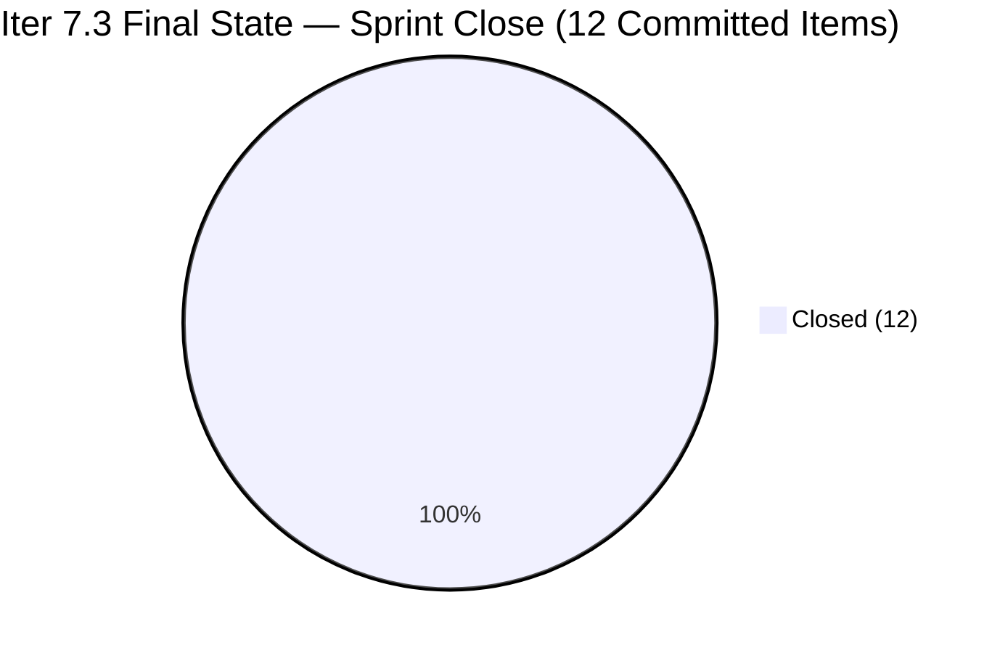
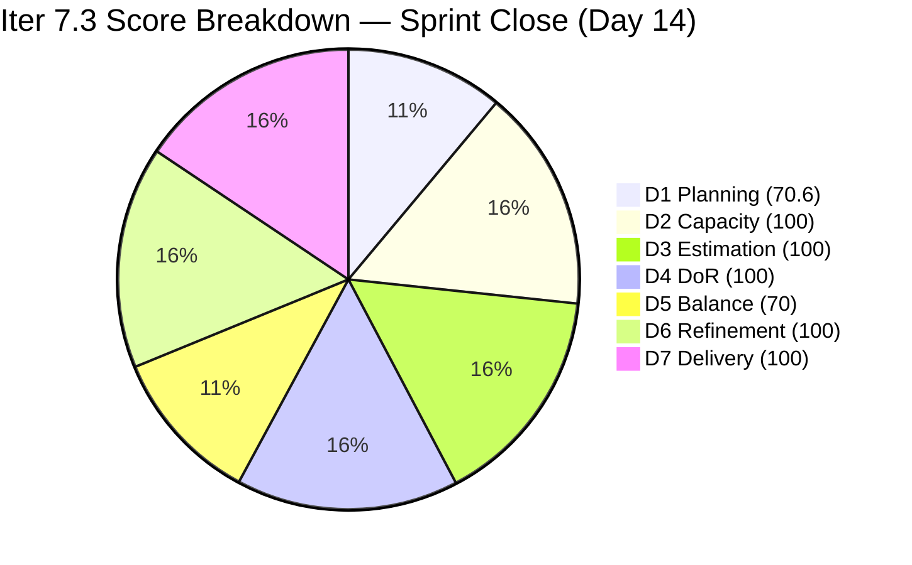
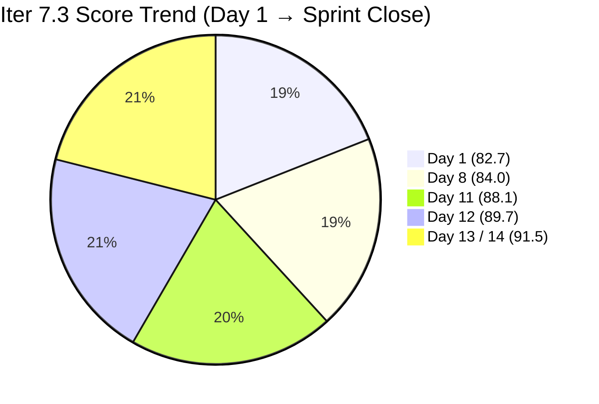

# ADO SAFe Iteration Audit — HR Recruitment Team

**Audit #62 | Iteration 7.3 (May 4 – May 17, 2026) | Day 14 of 14 — Sprint Close**

---

## 1. Audit Metadata

| Field | Value |
|---|---|
| **Audit Date** | May 17, 2026, 02:04 CDT / 09:04 UTC / 17:04 PHT (UTC+8) |
| **Auditor** | Claude Code (ADO SAFe Audit Agent) |
| **Workspace** | `ado_hr` |
| **ADO Project** | Jairosoft FINOPS (`e0bb302f-40f9-46c3-8164-6f1acb317d63`) |
| **Team** | Human Resource Recruitment Team (`248f59a6-372c-4b74-8129-9eaf260f211e`) |
| **Iteration** | Iteration 7.3 — May 4 to May 17, 2026 |
| **Iteration ID** | `d76b8de5-94fe-4b28-987a-263d56afd8d4` |
| **Sprint Day** | Day 14 of 14 (100% elapsed — Sprint Close Day) |
| **Days Remaining** | 0 |
| **Prior Audit** | AUDIT_20260516_0204.md (Audit #61, Iter 7.3 Day 13, Overall 91.5 — Low Risk) |
| **Scoring Model** | ADO SAFe v1 (7-dimension rubric) |
| **Overall Score** | **91.5 / 100** |
| **Risk Band** | **Low Risk** (≥80) |

---

## 2. Executive Summary

HR Recruitment Team closes Iteration 7.3 at **91.5 / 100 (Low Risk)** — matching the Day 13 series high with no regression on the final sprint day. This is the **official sprint-close audit for Iter 7.3**.

All 12 committed items remain Closed. 23/23 SP delivered. No new closures or state changes since the Day 13 burst closure event (May 15 19:48–20:00 UTC). The 5 de-committed items (#202104, #202349, #203535, #203629, #203825 — 11 SP) remain in Iteration 7.4 unchanged.

**Sprint Close Summary:**
- **12/12 items Closed** in Iteration 7.3 — 100% committed scope delivered
- **23/23 SP closed** — 100% Delivery Predictability
- **0 carryover items** within committed scope
- **5 items (11 SP)** formally de-committed to Iteration 7.4 on Day 12–13
- **91.5 overall** — Low Risk band, series high across all 62 audits
- **D1 = 70.6** remains the only sub-80 dimension, reflecting the late de-commitment of 5 items

Iteration 7.3 is the second consecutive sprint with ≥90% score (Day 13 of Iter 7.3 = 91.5; Iter 6.5 final = 80.0 was the prior benchmark). This sprint marks a sustained new performance plateau for the HR team.

---

## 3. Previous Audit Delta

| Dimension | Audit #61 (May 16, Day 13, 91.5) | Audit #62 (May 17, Day 14, 91.5) | Delta | Driver |
|---|---|---|---|---|
| Iteration Planning | 70.6 | **70.6** | 0.0 | No new items added; 12/17 unchanged |
| Team Capacity | 100.0 | **100.0** | 0.0 | Almera 5 pts/day unchanged |
| Estimation | 100.0 | **100.0** | 0.0 | 12/12 items with SP > 0 |
| DoR Compliance | 100.0 | **100.0** | 0.0 | 12/12 pass DoR |
| Work Item Balance | 70.0 | **70.0** | 0.0 | 12/12 User Stories structural |
| Backlog Refinement | 100.0 | **100.0** | 0.0 | All 17 fresh; 0 stale; 0 untouched |
| Delivery Predictability | 100.0 | **100.0** | 0.0 | 23/23 SP closed — unchanged |
| **Overall** | **91.5** | **91.5** | **0.0** | Sprint closes with no regression — consistent series high |

No changes observed from Day 13 to Day 14. The sprint closes cleanly with all committed work delivered and all scores held.

---

## 4. Current Iteration Snapshot

| Attribute | Value |
|---|---|
| **Iteration** | Iteration 7.3 |
| **Sprint Dates** | May 4 – May 17, 2026 (14 days) |
| **Sprint Day** | Day 14 of 14 — Sprint Close |
| **Days Remaining** | 0 |
| **Visible Backlog Items** | 17 (12 Closed in Iter 7.3 + 5 seeded in Iter 7.4) |
| **Current Sprint Items (IterPath = Iter 7.3)** | 12 (all Closed) |
| **Committed SP** | 23 SP |
| **Closed SP** | 23 SP (100%) |
| **Open SP Remaining** | 0 |
| **Changes Since Day 13** | None — no new closures, no state changes |
| **De-committed to 7.4** | #202104 (2 SP), #202349 (2 SP), #203535 (2 SP), #203629 (3 SP), #203825 (2 SP) = 5 items, 11 SP |
| **Capacity** | Almera: 5 pts/day; Grace: 0.25 pts/day (no sprint items) |
| **Sprint Outcome** | CLOSED — 12/12 items delivered, 23/23 SP, 100% predictability |

---

## 5. Work Item Analysis

### Closed in Iter 7.3 — 12 items, 23 SP total

| ID | Title | Type | SP | State | Closed Day |
|---|---|---|---|---|---|
| 203533 | Sr. Tech Lead — Beltran, Ken Henson | User Story | 2 | Closed | Day 2 (May 6) |
| 202887 | Sr. Tech Lead — Barua, Marlo | User Story | 2 | Closed | Day 4 (May 7) |
| 201273 | LinkedIn Bubble Trainer — Interview | User Story | 2 | Closed | Day 4 (May 7) |
| 203063 | Sales & Mktg. — Angel Dorothy Abina | User Story | 2 | Closed | Day 7 (May 10) |
| 203829 | APE — Babael, Samantha (2nd Month) | User Story | 1 | Closed | Day 7 (May 10) |
| 203537 | APE — Calvin John Dalino (Sprint 7.3) | User Story | 2 | Closed | Day 9 (May 12) |
| 203536 | APE — Tayao, Almera Kleer (Sprint 7.3) | User Story | 2 | Closed | Day 10 (May 13) |
| 197939 | Communication Skills Proposals Summary | User Story | 2 | Closed | Day 10 (May 13) |
| 202099 | Annual Medical Check-up Cebu PI7 | User Story | 1 | Closed | Day 11 (May 14) |
| 202093 | LinkedIn DevOps Engr. Hiring | User Story | 2 | Closed | Day 12 (May 15) |
| 203534 | LinkedIn Tech Sales from Manila Hiring | User Story | 1 | Closed | Day 12 (May 15) |
| 203538 | APE — Ryan Vince Castillo (Sprint 7.3) | User Story | 2 | Closed | Day 12 (May 15) |
| **Totals** | | **12 User Stories** | **23 SP** | **12/12 Closed** | |

### De-committed to Iteration 7.4 — 5 items, 11 SP (not in D7 scope)

| ID | Title | Type | SP | State | Notes |
|---|---|---|---|---|---|
| 202104 | APE — Rommel Senillo Summary PI7 | User Story | 2 | Active | APE pending; carry to 7.4 |
| 202349 | Finance Reporting & Export | User Story | 2 | Active | Technical prerequisites needed |
| 203535 | APE — Caumban, Karl Jordan (Sprint 7.3) | User Story | 2 | New | APE not initiated |
| 203629 | HR Discussion on Employees Incentives | Spike | 3 | Active | Research spike; carry to 7.4 |
| 203825 | Client Interview — Sr. Tech Lead Maraon, Belleo | User Story | 2 | Ready | Client scheduling dependency |

### Type Distribution (12 Iter 7.3 items)

| Type | Count | Share | Penalty |
|---|---|---|---|
| User Story | 12 | 100.0% | Dominant > 60% → −30 |
| Spike | 0 | 0.0% | None |

### DoR Assessment — All 12 Iter 7.3 Items

| Gate | Pass | Fail | Rate |
|---|---|---|---|
| Description ≥ 30 non-whitespace chars | 12 | 0 | 100% |
| Acceptance Criteria ≥ 20 non-whitespace chars | 12 | 0 | 100% |
| **Combined DoR** | **12** | **0** | **100%** |

All 12 items verified with substantive descriptions (role-goal-benefit narrative) and multi-item acceptance criteria checklists. DoR compliance sustained across entire Iter 7.3 series (14 consecutive audits at 100%).

### Staleness Assessment (17 visible items)

| Window | Count | Share | Penalty |
|---|---|---|---|
| Fresh (within 45 days / after Apr 2) | 17 | 100% | None |
| Stale > 90 days (before Feb 15) | 0 | 0% | None |
| Stale > 180 days (before Nov 17) | 0 | 0% | None |
| Untouched in current iteration (before May 4) | 0 | 0% | None |

---

## 6. SAFe Compliance Scorecard

| Dimension | Score | Evidence | Notes |
|---|---|---|---|
| 1. Iteration Planning | 70.6 | 12 current / 17 visible = 70.6% | 5 items de-committed to Iter 7.4 on Day 12–13 reduce ratio |
| 2. Team Capacity | 100.0 | 1/1 contributor with sprint work has capacity | Almera: 5 pts/day; Grace: 0.25 pts/day (no sprint items) |
| 3. Estimation | 100.0 | 12/12 sprint items with SP > 0 | Range: 1–2 SP; committed 23 SP |
| 4. DoR Compliance | 100.0 | 12/12 pass Description + AC | 14 consecutive audits at 100% DoR in Iter 7.3 series |
| 5. Work Item Balance | 70.0 | US present; dominant 100% > 60% → −30; Spike 0% | Spike #203629 moved to 7.4; structural US concentration |
| 6. Backlog Refinement | 100.0 | 17/17 fresh (May 6–May 15); stale_90=0; stale_180=0; untouched=0 | All items touched within sprint window |
| 7. Delivery Predictability | 100.0 | 23 SP closed / 23 SP committed = 100.0% | Sprint fully delivered; third consecutive D7 at 100% in Iter 7.3 |
| **Overall** | **91.5** | (70.6+100+100+100+70+100+100) / 7 = 640.6 / 7 | **Low Risk** (≥80) — Iter 7.3 series high |

### Score Computation
```
D1 = 12 / 17 × 100 = 70.59 → 70.6
D2 = 1 / 1  × 100  = 100.0
D3 = 12 / 12 × 100 = 100.0
D4 = 12 / 12 × 100 = 100.0
D5 = 100 − 30 = 70.0   (US dominant 100%; Spike = 0%)
D6 = 100.0 − 0 = 100.0  (17/17 fresh; 0 stale-90; 0 stale-180; 0 untouched)
D7 = 23 / 23 × 100 = 100.0

Overall = (70.6 + 100.0 + 100.0 + 100.0 + 70.0 + 100.0 + 100.0) / 7
        = 640.6 / 7 = 91.51 → 91.5
```

---

## 7. Dimension Findings

### D1 — Iteration Planning: 70.6 (De-commitment Impact)
```
visible_root_backlog_items   = 17 (12 Closed in Iter 7.3 + 5 in Iter 7.4 from backlog API)
current_iteration_root_items = 12 (all IterPath = Iter 7.3, all Closed)
D1 = (12 / 17) × 100 = 70.59 → 70.6
```
D1 reflects the formal de-commitment of 5 items (11 SP) to Iteration 7.4, conducted on Day 12–13. The 5 de-committed items remain in the team's visible backlog scope (now assigned to Iter 7.4), which is why they count toward `visible_root_backlog_items`. Had de-commitment occurred at sprint planning, D1 would have been 12/12 = 100.0. The primary structural process recommendation for Iter 7.4 is to conduct de-commitment decisions at or before Day 1 planning.

### D2 — Team Capacity: 100.0 ✅
- **Almera Kleer Tayao**: Documentation 3 pts/day + Requirements 2 pts/day = 5 pts/day total.
- **Grace**: 0.25 pts/day (Documentation); 0 sprint items assigned across entire Iter 7.3 series.
- `contributors_with_current_work = 1` (Almera). `contributors_with_capacity = 1` (Almera). D2 = 100.0.

### D3 — Estimation: 100.0 ✅
```
point_eligible_current_items = 12 (all User Stories expose SP field)
estimated_current_items      = 12 (SP range: 1–2 per item)
D3 = (12 / 12) × 100 = 100.0
```
SP range is appropriately sized for HR operational work (APE evaluations = 1–2 SP; LinkedIn campaigns = 1–2 SP).

### D4 — DoR Compliance: 100.0 ✅
All 12 Iter 7.3 items carry substantive descriptions (30+ non-whitespace chars) and multi-item acceptance criteria checklists (20+ non-whitespace chars). Fourteenth consecutive audit at 100% DoR within this sprint series. This metric has been consistently maintained since the improvement noted on Mar 22 (Iter 6.5 close).

### D5 — Work Item Balance: 70.0 (Structural)
```
User Story present: Yes → no penalty
User Story share: 12/12 = 100% > 60% → −30
Spike share: 0/12 = 0% (Spike #203629 moved to Iter 7.4) → no penalty
D5 = 100 − 30 = 70.0
```
HR operational work is inherently User Story-dominant. The single Spike (incentives research) was appropriately de-committed when time ran short. The −30 structural penalty is consistent with this team's work profile and is not a process failure indicator. Target: introduce at least one non-US item (Spike, Enabler, or Defect) organically in Iter 7.4 to moderate the balance score — only if the work genuinely warrants it.

### D6 — Backlog Refinement: 100.0 ✅
```
visible_root_backlog_items = 17
fresh_visible_root_items   = 17 (oldest: #203533 changed May 6; newest: #202349 changed May 15)
stale_90 (before Feb 15, 2026): 0 → no penalty
stale_180 (before Nov 17, 2025): 0 → no penalty
untouched_current_items (before May 4): 0 → no penalty

D6 = 100.0
```
Backlog is fully current. The 5 de-committed items were touched on May 15 (ChangedDate updated during the scope triage), which keeps them fresh. No stale items in any window.

### D7 — Delivery Predictability: 100.0 ✅
```
committed_story_points = 23 SP
  203533(2)+202887(2)+201273(2)+203063(2)+203829(1)+203537(2)+
  203536(2)+197939(2)+202099(1)+202093(2)+203534(1)+203538(2) = 23 SP

closed_story_points = 23 SP (all 12 items in State = Closed)
D7 = (23 / 23) × 100 = 100.0
```
Iteration 7.3 closes with 100% delivery predictability. All 12 committed items were closed by Day 12 (May 15). The sprint's final two days (May 16–17) required no additional closures. The de-committed 5 items (11 SP) are correctly excluded from the D7 denominator as they are not in `current_iteration_root_items`.

---

## 8. Risks and Bottlenecks







| Risk | Severity | Status | Action |
|---|---|---|---|
| **D1 = 70.6 — late de-commitment of 5 items (11 SP)** | Moderate | Items moved to Iter 7.4 on Day 12–13 | Conduct scope triage at Iter 7.4 sprint planning; do not carry mid-sprint de-commitment pattern |
| **Bus Factor = 1** (Almera owns 12/12 items) | High | Structural — unchanged across 62 audits | Cross-train Grace on select HR story types; allocate 1 simple story (1 SP) in Iter 7.4 |
| **Finance Reporting & Export (#202349, 2 SP)** | Moderate | In Iter 7.4, State = Active | Technical dependencies (CSV/XLSX export, automated email, audit log) need Engineering confirmation before Iter 7.4 commitment |
| **#203629 Incentives Spike carries to 7.4** | Low | State = Active in Iter 7.4 | Ensure 4-item AC deliverables (research summary, scaling matrix, stakeholder feedback, next steps) are produced in 7.4 |
| **No Iteration Goal defined** | Moderate | Unfixed across all 62 audits | Define for Iter 7.4 at planning session |
| **No PI Objectives linked** | Moderate | Unfixed across 62 audits | Coordinate with Program Management before Iter 7.4 |

---

## 9. Prioritized Recommendations

1. **[Immediate — Today] Mark Iteration 7.3 as Complete in ADO** — All 12 committed items are Closed and 23/23 SP delivered. Formally close the iteration in ADO to lock the sprint boundary and trigger any PI-level reporting.

2. **[Iter 7.4 Day 1] Conduct structured sprint planning** — 5 items (11 SP) are pre-seeded from de-commitment. Confirm Almera's capacity (5 pts/day × ~10 working days = ~50 pts max). Recommended Iter 7.4 commitment: 30–38 SP to allow room for the Spike and the Finance technical item.

3. **[Iter 7.4 Day 1] Define an Iteration Goal** — Suggested: "Complete remaining PI7 APE evaluations (Rommel Senillo, Karl Jordan Caumban), finalize LinkedIn hiring campaigns, complete client interview for Sr. Tech Lead Maraon, and deliver actionable HR incentive framework." This is the 62nd audit with no iteration goal defined — address this in the first planning session of 7.4.

4. **[Before Iter 7.4 Planning] Verify #202349 Finance Reporting & Export prerequisites** — Confirm Engineering can provide CSV/XLSX export capability and automated email infrastructure before committing this item. If prerequisites unmet, move to backlog with a dependency tag.

5. **[Iter 7.4 Day 1] Allocate one story to Grace** — Grace has maintained 0.25 pts/day capacity across all 62 audits with 0 sprint items ever assigned. Assign one 1-SP story (e.g., a routine HR documentation task) to begin knowledge transfer and reduce the bus factor.

6. **[Ongoing] Enforce sprint de-commitment threshold** — Items de-committed after Day 10 of a 14-day sprint must be documented in workspace CLAUDE.md under a sprint journal entry and signed off by Ramon. Target: zero de-commitments after Day 8 in Iter 7.4.

---

## 10. Evidence Gaps and Limitations

| Gap | Impact | Mitigation |
|---|---|---|
| Closed items not returned by backlog API | Low | Resolved via `wit_get_work_items_for_iteration` (Iter 7.3 ID); all 12 root items retrieved and verified |
| Iteration Goal field | Low | Not surfaced by standard ADO API; known persistent gap across 62 audits |
| PI Objectives linkage | Low | Not queried; known structural gap |
| Whether #203629 Spike produced any interim output in Iter 7.3 | Low | State = Active in Iter 7.4; no document links visible via API |
| Original uncommitted scope (items planned but removed before Day 1) | Negligible | Not in scope; de-commitment during sprint is the relevant metric |

---

## 11. Iter 7.3 Series Summary (Sprint Close)

| Day | Score | Band | Key Event |
|---|---|---|---|
| Day 1 | 82.7 | Low Risk | Sprint launched; 17 items loaded |
| Day 8 | 84.0 | Low Risk | 5 closures (9 SP) |
| Day 10 | 84.9 | Low Risk | #203537 closed (2 SP) |
| Day 11 | 88.1 | Low Risk | 2 closures (4 SP); D6 penalty eliminated |
| Day 12 | 89.7 | Low Risk | 1 closure (1 SP) |
| Day 13 | 91.5 | Low Risk | 3 closures (5 SP); 5 de-committed to 7.4; D7 = 100% — series high |
| **Day 14** | **91.5** | **Low Risk** | **Sprint Close — no change; 12/12 Closed, 23/23 SP** |

> Iteration 7.3 closes as the highest-scoring sprint in the 62-audit series at 91.5. The team demonstrated consistent weekly delivery cadence, 100% DoR compliance throughout, and perfect final-day delivery predictability. The primary improvement opportunity entering Iter 7.4 is conducting de-commitment at planning rather than Day 12–13, and activating Grace on at least one story to reduce the single-member dependency risk.

---

*Report generated: May 17, 2026, 02:04 CDT / 09:04 UTC | Workspace: ado_hr | Auditor: Claude Code ADO SAFe Audit Agent*
