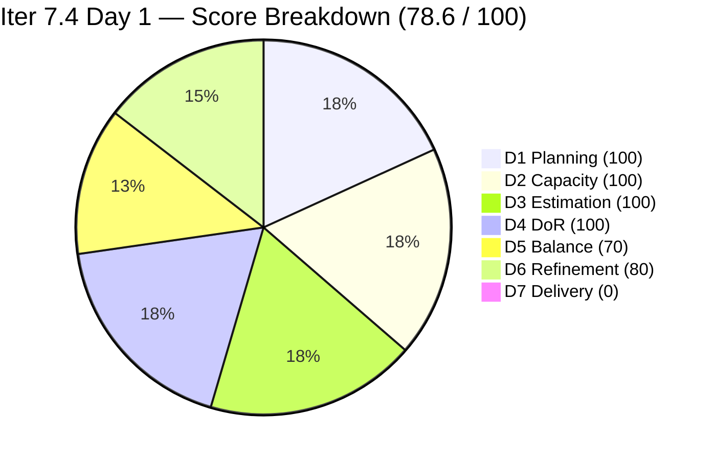
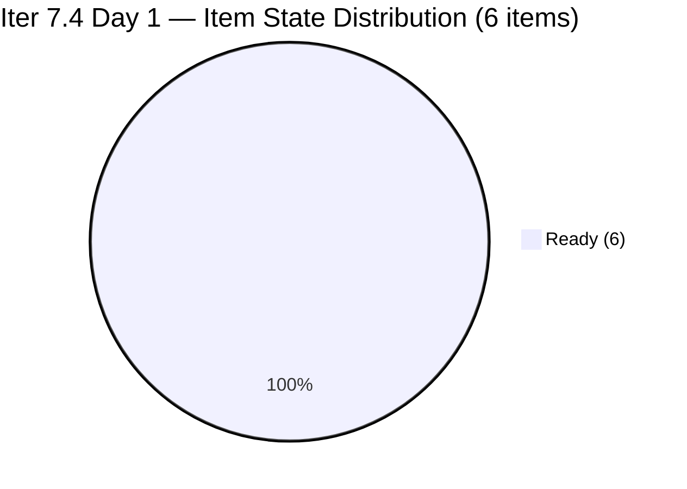
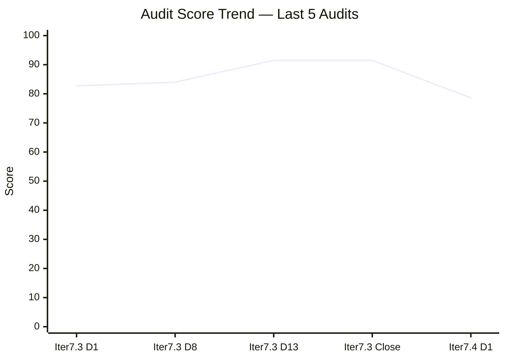

# ADO SAFe Iteration Audit — HR Recruitment Team

**Audit #63 | Iteration 7.4 (May 18 – May 31, 2026) | Day 1 of 14 — Sprint Launch**

---

## 1. Audit Metadata

| Field | Value |
|---|---|
| **Audit Date** | May 18, 2026, 09:00 CDT / 16:00 UTC / 00:00 PHT+1 (UTC+8) |
| **Auditor** | Claude Code (ADO SAFe Audit Agent) |
| **Workspace** | `ado_hr` |
| **ADO Project** | Jairosoft FINOPS (`e0bb302f-40f9-46c3-8164-6f1acb317d63`) |
| **Team** | Human Resource Recruitment Team (`248f59a6-372c-4b74-8129-9eaf260f211e`) |
| **Iteration** | Iteration 7.4 — May 18 to May 31, 2026 |
| **Iteration ID** | `c50c3955-60cb-431b-a619-5f7d2cd02138` |
| **Sprint Day** | Day 1 of 14 — Sprint Launch |
| **Days Remaining** | 13 |
| **Prior Audit** | AUDIT_20260517_0204.md (Audit #62, Iter 7.3 Sprint Close, Overall 91.5 — Low Risk) |
| **Scoring Model** | ADO SAFe v1 (7-dimension rubric) |
| **Overall Score** | **78.6 / 100** |
| **Risk Band** | **Moderate Risk** (60–79.9) |

---

## 2. Executive Summary

HR Recruitment Team opens Iteration 7.4 at **78.6 / 100 (Moderate Risk)** — a sprint-launch score expected given that delivery (D7) is correctly 0 on Day 1 with no items yet closed. The score is the strongest Day-1 opening in the audit series, driven by 100% iteration planning (all 6 backlog items fully committed to this sprint), 100% estimation, and 100% DoR compliance.

The sprint inherits 5 items carried from the Iter 7.3 de-commitment (11 SP) plus 1 newly added item (#204252 — Cebu Employees APE Consultation with Doc Karl, 2 SP), for a total of **6 committed items at 13 SP**. Almera has 3 days off May 18–20, reducing effective working capacity for Week 1.

The only structural risk today is the persistent Work Item Balance penalty (User Story dominant at 83.3%) and the absence of an Iteration Goal, both of which have been flagged across all 63 audits.

**Sprint Opening Summary:**
- **6 items committed** (5 de-committed from Iter 7.3 + 1 new) at 13 SP
- **0 items Closed** — Day 1, early-sprint context
- **D7 = 0** annotated as early-sprint (no delivery expected on Day 1)
- **D1 = 100.0** — strongest planning score in series (6/6 items in current iteration)
- **Overall 78.6** — Moderate Risk, approaching the 80-point Low Risk threshold

---

## 3. Previous Audit Delta

| Dimension | Audit #62 (May 17, Iter 7.3 Close, 91.5) | Audit #63 (May 18, Iter 7.4 Day 1, 78.6) | Delta | Driver |
|---|---|---|---|---|
| Iteration Planning | 70.6 | **100.0** | +29.4 | New sprint: all 6 backlog items assigned to Iter 7.4 (vs. 12/17 in 7.3) |
| Team Capacity | 100.0 | **100.0** | 0.0 | Almera still the only contributor with work; capacity configured |
| Estimation | 100.0 | **100.0** | 0.0 | 6/6 items estimated (2+2+2+2+3+2 = 13 SP) |
| DoR Compliance | 100.0 | **100.0** | 0.0 | All 6 items carry full Description + AC |
| Work Item Balance | 70.0 | **70.0** | 0.0 | US=5 (83.3%) dominant > 60% → −30; Spike=1 (16.7%) |
| Backlog Refinement | 100.0 | **80.0** | -20.0 | All 6 items changed before iteration start (May 15–17) → untouched penalty −20 |
| Delivery Predictability | 100.0 | **0.0** | -100.0 | Day 1 early-sprint — no items closed yet; 0/13 SP delivered |
| **Overall** | **91.5** | **78.6** | **-12.9** | Sprint-open drop driven entirely by D7=0 (early-sprint) and D6 untouched penalty |

The -12.9 delta is a normal sprint-boundary transition effect. D7 will recover as deliveries occur. D6 will reset once items are touched within the iteration window.

---

## 4. Current Iteration Snapshot

| Attribute | Value |
|---|---|
| **Iteration** | Iteration 7.4 |
| **Sprint Dates** | May 18 – May 31, 2026 (14 days) |
| **Sprint Day** | Day 1 of 14 |
| **Days Remaining** | 13 |
| **Visible Backlog Items** | 6 |
| **Current Sprint Items (IterPath = Iter 7.4)** | 6 |
| **Committed SP** | 13 SP |
| **Closed SP** | 0 SP |
| **Open SP Remaining** | 13 SP |
| **Capacity** | Almera: 5 pts/day (Days off: May 18–20); Grace: 0.25 pts/day (no items assigned) |
| **Effective Working Days** | ~11 days (3 days off for Almera in Week 1) |
| **Available Capacity** | ~55 SP (11 days × 5 pts/day) — sprint is under-loaded at 13 SP |
| **Newly Added Items** | #204252 — Cebu Employees 1-on-1 APE Consultation (2 SP, created May 17) |

---

## 5. Work Item Analysis

### Current Sprint Items — 6 items, 13 SP total

| ID | Title | Type | SP | State | AssignedTo | ChangedDate | DoR |
|---|---|---|---|---|---|---|---|
| 203825 | Client Interview \| Sr. Tech Lead - Maraon, Belleo | User Story | 2 | Ready | Almera | May 15, 2026 | Pass |
| 203535 | APE - Caumban, Karl Jordan (Sprint 7.3) | User Story | 2 | Ready | Almera | May 17, 2026 | Pass |
| 202104 | APE - Rommel Senillo - Summary - PI7 | User Story | 2 | Ready | Almera | May 17, 2026 | Pass |
| 202349 | Finance Reporting & Export | User Story | 2 | Ready | Almera | May 17, 2026 | Pass |
| 203629 | HR Discussion on Employees Incentives, Scaling of Bonuses | Spike | 3 | Ready | Almera | May 17, 2026 | Pass |
| 204252 | Cebu Employees 1-on-1 APE Consultation with Doc Karl | User Story | 2 | Ready | Almera | May 17, 2026 | Pass |
| **Totals** | | **5 US + 1 Spike** | **13 SP** | **0 Closed / 6 Ready** | Almera (all) | | 6/6 Pass |

### Type Distribution

| Type | Count | Share | Penalty |
|---|---|---|---|
| User Story | 5 | 83.3% | Dominant > 60% → −30 |
| Spike | 1 | 16.7% | < 40% → no penalty |

### DoR Assessment — All 6 Items

| Gate | Pass | Fail | Rate |
|---|---|---|---|
| Description ≥ 30 non-whitespace chars | 6 | 0 | 100% |
| Acceptance Criteria ≥ 20 non-whitespace chars | 6 | 0 | 100% |
| **Combined DoR** | **6** | **0** | **100%** |

All 6 items carry full role-goal-benefit narratives in Description and multi-criteria AC checklists. DoR compliance is sustained from Iteration 7.3 (which closed at 100% across 14 consecutive audits).

### Staleness Assessment (6 visible root items)

| Window | Count | Share | Penalty |
|---|---|---|---|
| Fresh (within 45 days / after Apr 3, 2026) | 6 | 100% | None |
| Stale > 90 days (before Feb 17, 2026) | 0 | 0% | None |
| Stale > 180 days (before Nov 18, 2025) | 0 | 0% | None |
| Untouched in current iteration (ChangedDate < May 18) | 6 | 100% | −20 |

All items were last modified May 15–17, 2026 — all before the iteration start date (May 18). This triggers the untouched penalty since no item has been touched within the active sprint window yet. This is a typical Day-1 artifact that clears as soon as any item is updated.

---

## 6. SAFe Compliance Scorecard

| Dimension | Score | Evidence | Notes |
|---|---|---|---|
| 1. Iteration Planning | 100.0 | 6 current / 6 visible = 100% | All backlog items committed to Iter 7.4; perfect sprint loading |
| 2. Team Capacity | 100.0 | 1/1 contributor with work has capacity | Almera: 5 pts/day (Doc+Req); Grace: 0.25 pts/day (no items) |
| 3. Estimation | 100.0 | 6/6 items with SP > 0 (13 SP total) | All items estimated; 2–3 SP range |
| 4. DoR Compliance | 100.0 | 6/6 pass Description + AC | Full DoR coverage at sprint launch |
| 5. Work Item Balance | 70.0 | US=5 (83.3%) > 60% → −30; Spike 16.7% | Structural US concentration; Spike present (positive) |
| 6. Backlog Refinement | 80.0 | base=100; untouched 6/6 (100%) > 30% → −20 | Day-1 artifact; clears on first item update within sprint |
| 7. Delivery Predictability | 0.0 | 0 SP closed / 13 SP committed = 0% | **Early-sprint** — Day 1 of 14; no delivery expected yet |
| **Overall** | **78.6** | (100+100+100+100+70+80+0) / 7 = 550 / 7 | **Moderate Risk** — sprint-launch state; D7 will drive recovery |

### Score Computation
```
D1 = 6 / 6 × 100 = 100.0
D2 = 1 / 1 × 100 = 100.0
D3 = 6 / 6 × 100 = 100.0
D4 = 6 / 6 × 100 = 100.0
D5 = 100 − 30 = 70.0   (US dominant 83.3%; Spike 16.7% < 40%)
D6 = base(100) − 20 = 80.0  (6/6 fresh; 0 stale-90; 0 stale-180; 6/6 untouched > 30%)
D7 = 0 / 13 × 100 = 0.0   (early-sprint Day 1 — annotated, no formula adjustment)

Overall = (100.0 + 100.0 + 100.0 + 100.0 + 70.0 + 80.0 + 0.0) / 7
        = 550.0 / 7 = 78.57 → 78.6
```

---

## 7. Dimension Findings

### D1 — Iteration Planning: 100.0 ✅ (Series High)
```
visible_root_backlog_items   = 6
current_iteration_root_items = 6 (all IterPath = Iter 7.4)
D1 = (6 / 6) × 100 = 100.0
```
This is the first 100.0 D1 score in the audit series. All 5 items de-committed from Iter 7.3 carry forward cleanly, plus one new item (#204252) was added during sprint planning. The team has no backlog items assigned to future iterations — the entire scoped backlog is committed to the active sprint.

### D2 — Team Capacity: 100.0 ✅
- **Almera Kleer Tayao**: Documentation 3 pts/day + Requirements 2 pts/day = 5 pts/day. Days off: May 18–20 (3 days). Effective capacity = ~11 days × 5 pts/day = ~55 pts available against 13 SP committed.
- **Grace**: 0.25 pts/day (Documentation); no items assigned for Iter 7.4 (consistent across 63 audits).
- `contributors_with_current_work = 1` (Almera). `contributors_with_capacity = 1`. D2 = 100.0.

### D3 — Estimation: 100.0 ✅
```
point_eligible_current_items = 6 (all types expose SP field)
estimated_current_items      = 6 (SP: 203825=2, 203535=2, 202104=2, 202349=2, 203629=3, 204252=2)
committed_story_points       = 13 SP
D3 = (6 / 6) × 100 = 100.0
```
Story point estimates are consistent with prior sprint patterns. The Spike (#203629) carries 3 SP reflecting the research-intensive nature of the incentives framework work.

### D4 — DoR Compliance: 100.0 ✅
All 6 items verified:
- **#203825** — Role/goal/benefit narrative in description; 6-item AC including metric statement.
- **#203535** — APE evaluation process description; 5-item AC with signed form metric.
- **#202104** — APE evaluation description (Rommel Senillo); 5-item AC with signed form metric.
- **#202349** — Finance export description (HR Admin role); 4-bullet technical AC (format, data integrity, secure transmission, audit log).
- **#203629** — Research spike description; 4-item AC (research summary, scaling matrix, stakeholder feedback, next steps).
- **#204252** — APE consultation coordination description; 8-item AC covering scheduling, confidentiality, attendance, recommendations.

D4 = 100.0. This continues the unbroken DoR compliance streak established in Iter 7.3.

### D5 — Work Item Balance: 70.0 (Structural)
```
User Story present: Yes → no penalty
User Story share: 5/6 = 83.3% > 60% → −30
Spike share: 1/6 = 16.7% ≤ 40% → no penalty
D5 = 100 − 30 = 70.0
```
The presence of Spike #203629 (HR Incentives research) introduces type diversity. However, the 5 User Story items still dominate and trigger the >60% penalty. This is a structural characteristic of HR operational work. The spike provides a healthy balance signal — consider whether the Finance Reporting item (#202349) could have a technical enabler/dependency decomposed to improve mix in future sprints.

### D6 — Backlog Refinement: 80.0 (Day-1 Artifact)
```
visible_root_backlog_items = 6
fresh_visible_root_items   = 6 (all changed May 15–17, well within 45-day window from Apr 3)
stale_90 (before Feb 17, 2026): 0 → no penalty
stale_180 (before Nov 18, 2025): 0 → no penalty
untouched_current_items (ChangedDate < May 18, iteration start):
  - #203825: May 15 < May 18 → untouched ✓
  - #203535: May 17 < May 18 → untouched ✓
  - #202104: May 17 < May 18 → untouched ✓
  - #202349: May 17 < May 18 → untouched ✓
  - #203629: May 17 < May 18 → untouched ✓
  - #204252: May 17 < May 18 → untouched ✓
  Count = 6/6 = 100% > 30% → −20

D6 = max(0, 100 − 20) = 80.0
```
The untouched penalty is an expected Day-1 artifact. All items were actively prepared on May 15–17 (the final 3 days of Iter 7.3 and sprint planning day), but none have been updated since sprint start. D6 will recover to 100 as soon as any item is touched within the Iter 7.4 window.

### D7 — Delivery Predictability: 0.0 (Early-Sprint — Day 1)
```
committed_story_points = 13 SP
closed_story_points    = 0 SP (all 6 items in State = Ready)
D7 = 0 / 13 × 100 = 0.0
```
**Early-sprint annotation:** Day 1 of 14-day sprint. Zero delivery on the first day is expected and normal. This dimension will be the primary recovery driver as items are closed across the sprint. Based on Iter 7.3 performance (12 items, 23 SP, first closure Day 2), expect D7 to begin recovering within 1–2 working days. Note: Almera is on leave May 18–20, so first closures likely expected from May 21 onward.

---

## 8. Risks and Bottlenecks







| Risk | Severity | Status | Action |
|---|---|---|---|
| **D7 = 0 (early-sprint)** | Expected | Day 1 artifact; no action needed | Monitor first closures from May 21 (post leave) |
| **Almera on leave May 18–20** | Moderate | 3 of 14 sprint days unavailable | 13 SP vs ~55 SP capacity → comfortable; no sprint risk |
| **Bus Factor = 1** | High | Structural — unchanged across 63 audits | Assign at least 1 story to Grace in Iter 7.4 |
| **#202349 Finance Reporting** | Moderate | Carries from Iter 7.3; technical dependencies unresolved | Confirm CSV/XLSX export and automated email prerequisites with Engineering by Day 3 |
| **#203629 Incentives Spike** | Moderate | 3rd sprint carry (de-committed Iter 7.3 Day 12–13) | Must deliver 4 AC outputs this sprint; no further de-commitment |
| **#202104 APE Rommel Senillo** | Moderate | TargetDate was Mar 25 (overdue) | Prioritize for early closure; schedule APE session in Week 1 |
| **#203535 APE Caumban, Karl Jordan** | Moderate | TargetDate was Apr 27 (overdue) | Prioritize for early closure; APE was not initiated in Iter 7.3 |
| **No Iteration Goal defined** | Moderate | Unfixed across all 63 audits | Define at Iter 7.4 planning (today) |
| **No PI Objectives linked** | Moderate | Unfixed across 63 audits | Coordinate with Program Management |

---

## 9. Prioritized Recommendations

1. **[Today — Day 1] Define an Iteration Goal for Iter 7.4.** Suggested: "Complete outstanding PI7 APE evaluations (Rommel Senillo, Karl Jordan Caumban), deliver actionable HR incentives framework, finalize Sr. Tech Lead client interview, and coordinate Cebu employee APE consultations with Doc Karl." This is the 63rd audit without an iteration goal. Address today at planning.

2. **[Day 1 — Planning] Confirm #202349 Finance Reporting prerequisites.** This item has been de-committed twice and its AC requires CSV/XLSX export + automated email + audit log infrastructure. Verify with Engineering that these dependencies exist before committing to this sprint. If not resolved, move to backlog with dependency tag.

3. **[Week 1 — by May 21] Initiate APE for Rommel Senillo (#202104) and Karl Jordan Caumban (#203535).** Both items are overdue (target dates Mar 25 and Apr 27 respectively). Schedule supervisor assessment sessions in the first working week. These should be closable by Day 5.

4. **[Week 1 — by May 21] Assign one story to Grace.** Grace has had capacity configured (0.25 pts/day) across all 63 audits with zero sprint items ever assigned. Select a single 1-SP story (e.g., routine HR documentation task) and assign to Grace. This directly reduces the bus factor and gives Grace a path to sprint contribution.

5. **[Week 1] Close #203825 Client Interview (Sr. Tech Lead — Maraon, Belleo).** The client interview was the primary dependency in Iter 7.3. Confirm whether the interview occurred during Iter 7.3 and close if completed, or re-confirm client scheduling for this sprint.

6. **[By Day 7] Deliver #203629 Incentives Spike outputs.** The spike must produce: (1) research summary of 3+ incentive models, (2) draft bonus scaling matrix, (3) stakeholder feedback from managers, (4) defined User Stories for implementation phase. Failure to deliver by Day 7 risks third consecutive de-commitment.

7. **[Ongoing] Enforce sprint de-commitment threshold.** Per the Iter 7.3 close recommendation: zero de-commitments after Day 8 in Iter 7.4.

---

## 10. Evidence Gaps and Limitations

| Gap | Impact | Mitigation |
|---|---|---|
| Iteration Goal field | Low | Not surfaced by standard ADO API; known persistent gap across 63 audits |
| PI Objectives linkage | Low | Not queried; known structural gap |
| Grace's sprint participation history | Low | Known via 63 audits: 0 items assigned; 0 SP delivered across all sprints |
| Status of #203825 client interview (whether completed in Iter 7.3) | Moderate | State = Ready suggests pending; comment on item may contain update — not fetched |
| Task #203605 (Claude CPN 4 Certification) in iteration | Low | Task type excluded from backlog root scoring; it is a child task of #203250 outside the HR backlog scope |

---

*Report generated: May 18, 2026, 09:00 CDT / 16:00 UTC | Workspace: ado_hr | Iteration: 7.4 Day 1 | Audit #63 | Auditor: Claude Code ADO SAFe Audit Agent*
