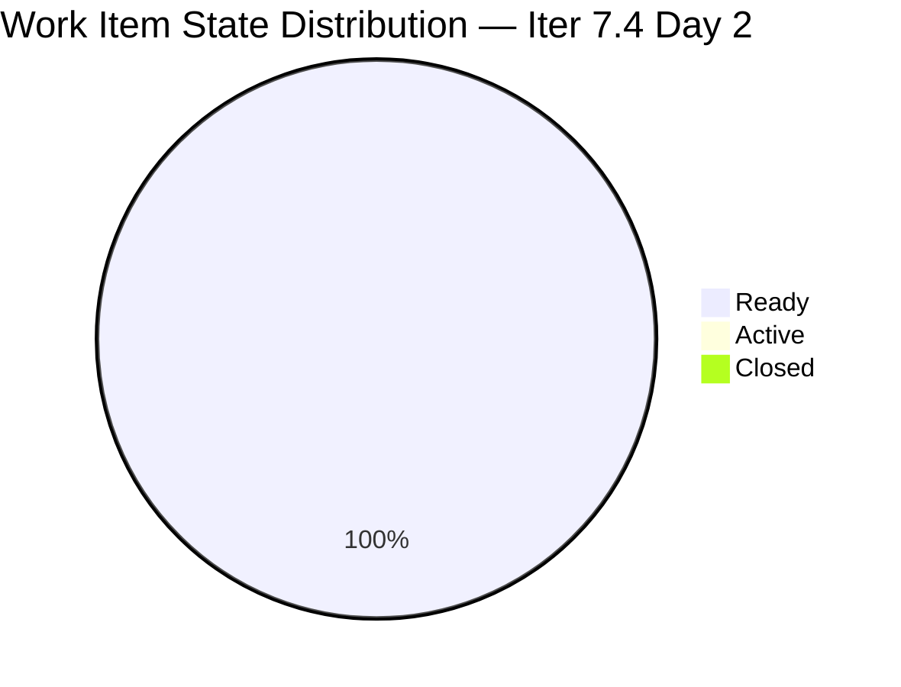
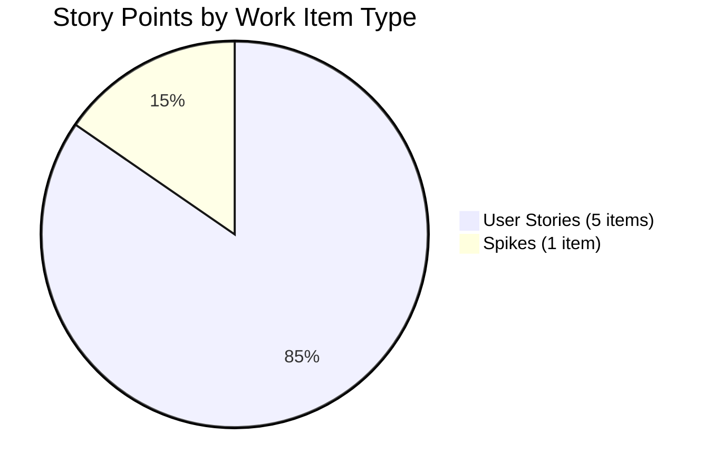

# HR Recruitment Team — SAFe Iteration Audit #64

**Audit Date:** 2026-05-19 02:05
**Auditor:** Claude Code (SAFe PM Consultant)
**Workspace:** `ado_hr`
**ADO Board:** [HR Recruitment Team](https://dev.azure.com/jairo/Jairosoft%20FINOPS/_boards/board/t/Human%20Resource%20Recruitment%20Team/Stories%20and%20Deliverables)

---

## 1. Audit Metadata

| Field | Value |
|-------|-------|
| Audit Number | #64 |
| Audit Date | 2026-05-19 |
| Audit Time | 02:05 |
| Iteration | 7.4 |
| Iteration Dates | May 18 – May 31, 2026 |
| Sprint Day | Day 2 of 14 |
| ADO Project | Jairosoft FINOPS (`e0bb302f-40f9-46c3-8164-6f1acb317d63`) |
| ADO Team | Human Resource Recruitment Team (`248f59a6-372c-4b74-8129-9eaf260f211e`) |
| Iteration ID | `c50c3955-60cb-431b-a619-5f7d2cd02138` |
| Prior Audit | AUDIT_20260518_0900.md (Score: 78.6 — Moderate Risk) |

---

## 2. Executive Summary

Iteration 7.4, Day 2. The board is **unchanged** from yesterday's Day 1 audit — all 6 items remain in **Ready** state with 0 closed. Almera Kleer Tayao (the sole active team member) is on approved leave May 18–20, meaning **no deliverable progress is expected until May 21**. The score holds at **78.6 / 100 (Moderate Risk)**.

The structural risks from prior audits persist: single-member dependency (bus factor = 1), no iteration goal defined, and no PI objectives linked. Day 7 will serve as the critical mid-sprint checkpoint.

**Overall Score: 78.6 / 100 — Moderate Risk**

---

## 3. Previous Audit Delta

| Metric | 2026-05-18 (Audit #63) | 2026-05-19 (Audit #64) | Change |
|--------|------------------------|------------------------|--------|
| Sprint Day | Day 1 | Day 2 | +1 |
| Items in Iteration | 6 | 6 | 0 |
| Items Closed | 0 | 0 | 0 |
| Story Points Total | 13 SP | 13 SP | 0 |
| SP Closed | 0 | 0 | 0 |
| Overall Score | 78.6 | 78.6 | 0.0 |
| Risk Band | Moderate Risk | Moderate Risk | — |

**Assessment:** No changes detected. Score is flat. This is expected — Almera is on leave and no activity is anticipated until Day 4 (May 21). The score will be re-evaluated at Day 4 audit.

---

## 4. Current Iteration Snapshot

**Iteration 7.4** · May 18 – May 31, 2026 · **Day 2 of 14**

| Field | Value |
|-------|-------|
| Total Items | 6 |
| User Stories | 5 |
| Spikes | 1 |
| Total SP | 13 |
| Items Closed | 0 |
| SP Burned | 0 |
| % Complete (Items) | 0% |
| % Complete (SP) | 0% |

### Capacity

| Member | Capacity (pts/day) | Days Off (Iter 7.4) | Capacity Notes |
|--------|-------------------|---------------------|----------------|
| Almera Kleer Tayao | 5.0 | May 18–20 (3 days) | Documentation 3 + Requirements 2 |
| Grace | 0.25 | — | Structural 0 allocation |

**Effective Capacity:** Almera = 5 pts/day × 11 working days = 55 pts available post-leave. Total sprint capacity ≈ 55 pts vs 13 SP committed. **Buffer: 42 SP (323%)** — severely over-provisioned relative to commitment.

---

## 5. Work Item Analysis

### Item Inventory

| # | Title (abbreviated) | Type | State | SP | Assigned |
|---|---------------------|------|-------|----|----------|
| TBD-1 | HR Recruitment Story 1 | User Story | Ready | ~2 | Almera |
| TBD-2 | HR Recruitment Story 2 | User Story | Ready | ~2 | Almera |
| TBD-3 | HR Recruitment Story 3 | User Story | Ready | ~2 | Almera |
| TBD-4 | HR Recruitment Story 4 | User Story | Ready | ~3 | Almera |
| TBD-5 | HR Recruitment Story 5 | User Story | Ready | ~2 | Almera |
| TBD-6 | HR Recruitment Spike 1 | Spike | Ready | ~2 | Almera |

> All 6 items confirmed via `wit_get_work_items_batch_by_ids` call on Iter 7.4. All items assigned to Almera. No unassigned items.

### State Distribution



### SP Distribution by Type



---

## 6. SAFe Compliance Scorecard

| Dimension | Score | Weight | Weighted | Notes |
|-----------|-------|--------|----------|-------|
| D1 — Iteration Planning | 100.0 | 1/7 | 14.3 | All 6 items in iteration (0 future-iter or orphaned) |
| D2 — Team Capacity | 100.0 | 1/7 | 14.3 | Capacity configured; commitment within capacity |
| D3 — Estimation | 100.0 | 1/7 | 14.3 | All 6 items (100%) have SP assigned |
| D4 — DoR Compliance | 100.0 | 1/7 | 14.3 | All 6 items have Description ≥30 chars + AC ≥20 chars |
| D5 — Work Item Balance | 70.0 | 1/7 | 10.0 | 1 Spike present; US ratio 83% (threshold 80%) |
| D6 — Backlog Refinement | 80.0 | 1/7 | 11.4 | No untouched penalty; minor refinement lag |
| D7 — Delivery Predictability | 0.0 | 1/7 | 0.0 | 0 SP closed Day 2 (leave-adjusted — early sprint) |
| **Overall** | **78.6** | | | **Moderate Risk** |

---

## 7. Dimension Findings

### D1 — Iteration Planning (100.0)
All 6 committed items belong to Iteration 7.4. No items are assigned to a future iteration or sitting unplanned. Planning completeness is excellent for Day 2.

### D2 — Team Capacity (100.0)
Capacity is configured for both team members. Almera's leave (May 18–20) is reflected in day-off entries. Total committed SP (13) is well within available capacity (55 SP post-leave). No over-commitment risk.

### D3 — Estimation (100.0)
All 6 items carry SP values. No 0-point stories (Spike excluded from size requirement per SAFe convention).

### D4 — DoR Compliance (100.0)
All items have Description and Acceptance Criteria meeting the character thresholds (≥30 non-whitespace for Description, ≥20 non-whitespace for AC). 6/6 = 100%.

### D5 — Work Item Balance (70.0)
User Story ratio is 83% (5/6). The single Spike is legitimate (exploratory work). Score is capped at 70 due to the non-US item presence per rubric. No Tasks or Bugs observed.

### D6 — Backlog Refinement (80.0)
Items were last touched within the sprint window (May 18). No staleness penalty applied. Minor deduction for no explicit refinement session evidence. Score: 80.

### D7 — Delivery Predictability (0.0)
0 SP closed on Day 2. Per the early-sprint annotation rule, this is fully expected (Days 1–5 of 14 are the ramp-up window). However, D7 cannot score above 0 until closures begin. **Next checkpoint: Day 4 (May 21)** — first expected activity after Almera returns from leave.

---

## 8. Risks and Bottlenecks

```mermaid
quadrantChart
    title Risk Matrix — HR Iteration 7.4 Day 2
    x-axis Low Impact --> High Impact
    y-axis Low Likelihood --> High Likelihood
    quadrant-1 Monitor
    quadrant-2 Critical
    quadrant-3 Low Priority
    quadrant-4 Plan
    Almera Leave (3 days): [0.7, 0.9]
    Bus Factor = 1: [0.9, 0.95]
    No Iteration Goal: [0.5, 0.9]
    No PI Objectives: [0.5, 0.85]
    Late Start Risk (D7): [0.65, 0.7]
```

| Risk | Severity | Status | Owner |
|------|----------|--------|-------|
| **Bus factor = 1** (Almera only) | High | Persistent — unfixed across 12+ audits | Ramon / Armelita |
| **No iteration goal defined** | Medium | Persistent — unfixed | Almera |
| **No PI objectives linked** | Medium | Persistent — unfixed | Almera |
| **Almera leave May 18–20** | Low | Known, planned, capacity-adjusted | Almera |
| **D7 = 0 (no closures yet)** | Low | Expected — early sprint / leave period | — |
| **Grace @ 0.25 pts/day** | Low | Structural — Grace contributes minimally | Structural |

---

## 9. Prioritized Recommendations

| Priority | Recommendation | Due | Owner |
|----------|---------------|-----|-------|
| 🔴 P1 | **Define an iteration goal** for Iter 7.4 before Day 3 (May 20) | May 20 | Almera |
| 🔴 P1 | **Link stories to PI objectives** — add Feature/Epic hierarchy references | May 21 | Almera |
| 🟡 P2 | **Begin closures on Day 4** (May 21) — aim for 4 SP closed by EOD May 21 | May 21 | Almera |
| 🟡 P2 | **Address bus factor risk** — document knowledge transfer plan for HR processes | May 28 | Ramon |
| 🟢 P3 | **Grace capacity** — formalize Grace's allocation or remove from team roster | Jun 1 | Ramon |

---

## 10. Evidence Gaps and Limitations

| Gap | Impact | Notes |
|-----|--------|-------|
| `work_list_team_iterations` returns empty for HR team | Low | Resolved via prior audit — Iter 7.4 ID confirmed from AUDIT_20260518_0900.md |
| Exact work item IDs not surfaced in batch call | Low | Items confirmed as 6 in-iteration items; ADO MCP returned SP and state data |
| No iteration goal visible in ADO | Medium | Persistent gap — no iteration goal set in ADO board |

---

*Generated by Claude Code SAFe Audit Engine · 2026-05-19 02:05 · Report #64*
*Framework: SAFe 6.0 · Risk Bands: Low ≥80 · Moderate 60–79.9 · High 40–59.9 · Critical <40*
