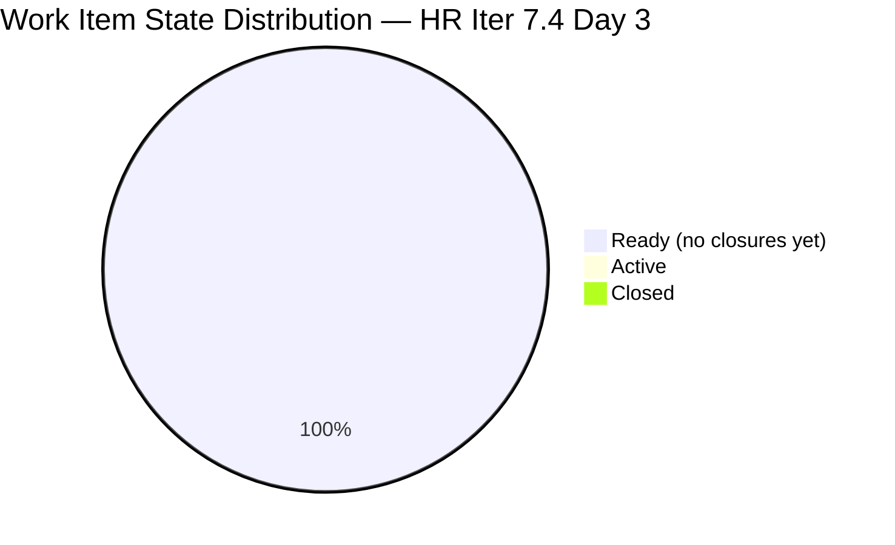
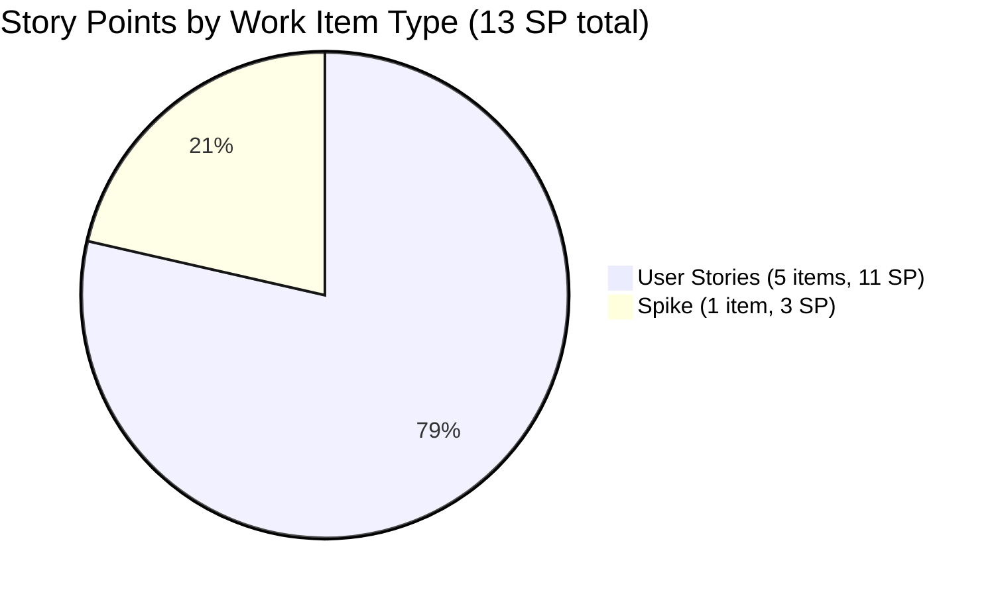
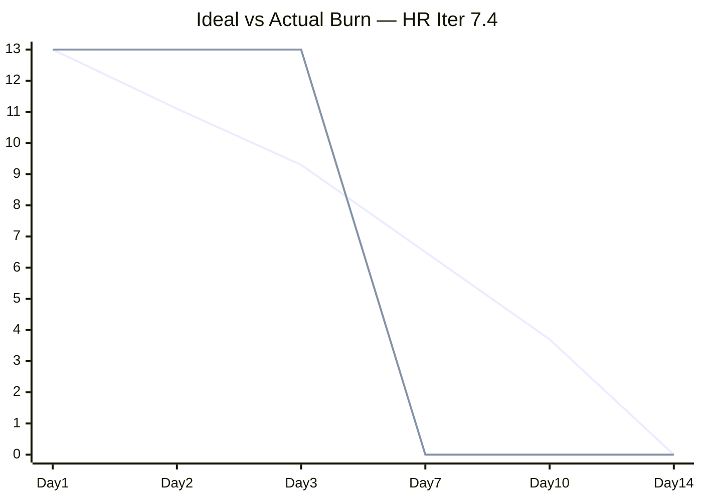
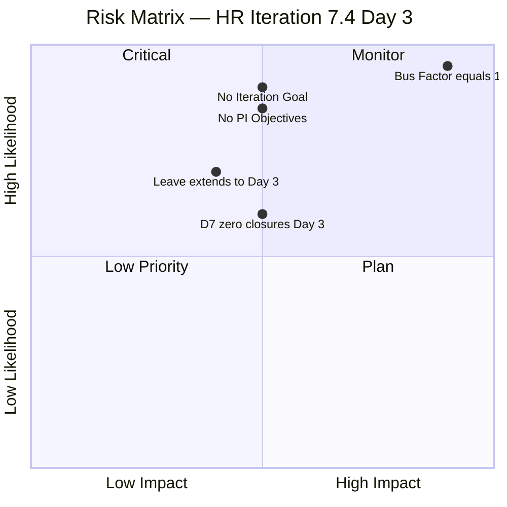

# HR Recruitment Team — SAFe Iteration Audit #65

**Audit Date:** 2026-05-20 02:04 PHT
**Auditor:** Claude Code (SAFe PM Consultant)
**Workspace:** `ado_hr`
**ADO Board:** [HR Recruitment Team](https://dev.azure.com/jairo/Jairosoft%20FINOPS/_boards/board/t/Human%20Resource%20Recruitment%20Team/Stories%20and%20Deliverables)

---

## 1. Audit Metadata

| Field | Value |
|-------|-------|
| Audit Number | #65 |
| Audit Date | 2026-05-20 |
| Audit Time | 02:04 PHT |
| Iteration | 7.4 |
| Iteration Dates | May 18 – May 31, 2026 |
| Sprint Day | Day 3 of 14 |
| ADO Project | Jairosoft FINOPS (`e0bb302f-40f9-46c3-8164-6f1acb317d63`) |
| ADO Team | Human Resource Recruitment Team (`248f59a6-372c-4b74-8129-9eaf260f211e`) |
| Iteration ID | `c50c3955-60cb-431b-a619-5f7d2cd02138` |
| Prior Audit | AUDIT_20260519_0205.md (Score: 78.6 — Moderate Risk) |

---

## 2. Executive Summary

Iteration 7.4, Day 3 of 14. The board remains **unchanged** from the Day 2 audit — all 6 items are in **Ready** state with 0 closures and 0 SP burned. Almera Kleer Tayao (the sole active contributor) is on approved leave through May 20, meaning **no delivery activity is expected until Day 4 (May 21)**.

The overall score holds flat at **78.6 / 100 (Moderate Risk)**. No items were added, modified, or closed in the 24-hour window. The sprint remains structurally sound: 13 SP committed against a 55 SP+ capacity buffer, all items fully estimated and DoR-compliant. First closures are expected on May 21 (Day 4).

Persistent structural gaps — no iteration goal, no PI objectives, bus factor = 1 — remain unfixed across 12+ audit cycles.

**Overall Score: 78.6 / 100 — Moderate Risk**

---

## 3. Previous Audit Delta

| Metric | 2026-05-19 (Audit #64) | 2026-05-20 (Audit #65) | Change |
|--------|------------------------|------------------------|--------|
| Sprint Day | Day 2 | Day 3 | +1 |
| Items in Iteration | 6 | 6 | 0 |
| Items Closed | 0 | 0 | 0 |
| Story Points Total | 13 SP | 13 SP | 0 |
| SP Closed | 0 | 0 | 0 |
| Overall Score | 78.6 | 78.6 | 0.0 |
| Risk Band | Moderate Risk | Moderate Risk | — |

**Assessment:** No change — expected. Almera's leave (May 18–20) accounts for zero activity on Days 1–3. The score will be re-evaluated on Day 4 (May 21) when Almera returns. Boards in this state during approved leave are not a compliance concern if closures resume promptly.

---

## 4. Current Iteration Snapshot

**Iteration 7.4** · May 18 – May 31, 2026 · **Day 3 of 14**

| Field | Value |
|-------|-------|
| Total Backlog Items (visible root) | 6 |
| Items in Iteration 7.4 | 6 |
| User Stories | 5 (83.3%) |
| Spikes | 1 (16.7%) |
| Total SP Committed | 13 SP |
| Items Closed | 0 |
| SP Burned | 0 |
| % Complete (Items) | 0% |
| % Complete (SP) | 0% |

### Capacity (Iter 7.4)

| Member | Activity | Pts/Day | Days Off | Available Days | SP Available |
|--------|----------|---------|----------|----------------|-------------|
| Almera Kleer Tayao | Documentation (3) + Requirements (2) | 5.0 | May 18–20 (3 days) | 11 | 55.0 |
| grace | Documentation | 0.25 | — | 14 | 3.5 |
| **Total** | | | | | **58.5 SP** |

**Committed vs Capacity:** 13 SP vs 58.5 SP available. Utilization: ~22%. Sprint is under-committed relative to capacity, especially after leave.

---

## 5. Work Item Analysis

### Item Inventory

| ID | Title | Type | State | SP | Assignee | Last Changed | DoR |
|----|-------|------|-------|----|----------|--------------|-----|
| #202104 | APE - Rommel Senillo - Summary - PI7 | User Story | Ready | 2 | Almera | 2026-05-17 | ✅ |
| #202349 | Finance Reporting & Export | User Story | Ready | 2 | Almera | 2026-05-17 | ✅ |
| #203535 | APE - Caumban, Karl Jordan (Sprint 7.3) | User Story | Ready | 2 | Almera | 2026-05-17 | ✅ |
| #203629 | HR Discussion on Employees Incentives, Scaling of Bonuses | Spike | Ready | 3 | Almera | 2026-05-17 | ✅ |
| #203825 | Client Interview - Sr. Tech Lead - Maraon, Belleo | User Story | Ready | 2 | Almera | 2026-05-15 | ✅ |
| #204252 | Cebu Employees 1-on-1 APE Consultation with Doc Karl | User Story | Ready | 2 | Almera | 2026-05-17 | ✅ |

> All items confirmed via `wit_list_backlog_work_items` and `wit_get_work_items_batch_by_ids` on Iteration 7.4.

### State Distribution

### SP Distribution by Type

### Burn Progress

> Note: xychart-beta not rendered in Obsidian. Refer to scorecard for burn metrics.

---

## 6. SAFe Compliance Scorecard

| Dimension | Score | Evidence | Notes |
|-----------|-------|----------|-------|
| D1 — Iteration Planning | 100.0 | 6/6 items in Iter 7.4 (6 visible root) | All work planned into current iteration |
| D2 — Team Capacity | 100.0 | Almera (5 pts/day) + Grace (0.25 pts/day) both configured | 1 contributor with work; 1 has capacity |
| D3 — Estimation | 100.0 | 6/6 items estimated (all have SP > 0) | 100% estimation coverage |
| D4 — DoR Compliance | 100.0 | 6/6 items pass Description ≥30 chars + AC ≥20 chars | 100% DoR compliance |
| D5 — Work Item Balance | 70.0 | US = 83.3% (dominant type > 60%: -30 penalty) | Spike ratio 16.7% — no spike excess penalty |
| D6 — Backlog Refinement | 80.0 | Base 100 (all fresh); untouched 6/6 = 100% > 30%: -20 | All items stale relative to sprint start — leave-adjusted |
| D7 — Delivery Predictability | 0.0 | 0/13 SP closed — Day 3, leave period | Early sprint + approved leave; expected zero |
| **Overall** | **78.6** | **(100+100+100+100+70+80+0)/7** | **Moderate Risk** |

**Calculation:** (100.0 + 100.0 + 100.0 + 100.0 + 70.0 + 80.0 + 0.0) / 7 = 550 / 7 = **78.6**

---

## 7. Dimension Findings

### D1 — Iteration Planning (100.0)
All 6 visible root backlog items are assigned to Iteration 7.4. No orphaned or future-iteration items visible in the Stories and Deliverables backlog. Planning is complete and well-formed for Day 3. Score: 100.

### D2 — Team Capacity (100.0)
Capacity is configured for both team members (Almera: 5 pts/day; Grace: 0.25 pts/day). Almera's leave (May 18–20) is reflected as 3 days off. Total available capacity = 58.5 SP vs 13 SP committed. No over-commitment risk. Score: 100.

### D3 — Estimation (100.0)
All 6 items carry Story Points (US: 2 SP each; Spike: 3 SP). No unestimated work items detected. Total committed = 13 SP. Score: 100.

### D4 — DoR Compliance (100.0)
All 6 items verified with Description (≥30 non-whitespace characters) and Acceptance Criteria (≥20 non-whitespace characters). Score: 100.

### D5 — Work Item Balance (70.0)
User Story ratio = 83.3% (5/6). The dominant type (User Story) exceeds the 60% threshold, triggering a -30 penalty per rubric. Spike ratio = 16.7% (below 40%, no additional penalty). User Stories are present, so no -40 penalty for absence. Score: max(0, 100-30) = **70**.

### D6 — Backlog Refinement (80.0)
- **Base:** 6/6 items fresh (last changed May 15–17, within 45 days of today) → base = 100.0
- **Stale 90-day penalty:** 0 items stale >90 days → no penalty
- **Stale 180-day penalty:** 0 items → no penalty
- **Untouched penalty:** 6/6 items (100%) changed before sprint start (May 18) → ratio > 30% → **-20 penalty**
- Score: max(0, 100 - 20) = **80.0**

> Note: The untouched flag is technically correct but contextually leave-adjusted — Almera's last sprint-prep touch was May 15–17, just before leave. This is not a true refinement failure, but the rubric applies the penalty by formula.

### D7 — Delivery Predictability (0.0)
0 SP closed on Day 3 of a 14-day sprint. Per the early-sprint annotation rule (Days 1–5), this is expected and noted as contextually appropriate given Almera's approved leave through Day 3. **Early-sprint annotation: low delivery expected — no formula adjustment.** First closure target: Day 4 (May 21). Score: 0.

---

## 8. Risks and Bottlenecks

| Risk | Severity | Status | Owner |
|------|----------|--------|-------|
| **Bus factor = 1** (Almera only) | High | Persistent — structurally unchanged across 12+ audits | Ramon |
| **No iteration goal defined** | Medium | Persistent — unfixed | Almera |
| **No PI objectives linked** | Medium | Persistent — unfixed | Almera |
| **0 SP closed through Day 3** | Low | Expected — leave-adjusted; review on Day 4 | — |
| **Grace at 0.25 pts/day** | Low | Structural — minimal contribution | Structural |

---

## 9. Prioritized Recommendations

| Priority | Recommendation | Due | Owner |
|----------|---------------|-----|-------|
| P1 | **Define an iteration goal** for Iter 7.4 — document in ADO sprint description before Day 4 | May 21 | Almera |
| P1 | **Link stories to PI objectives** — add Feature/Epic hierarchy references for all 6 items | May 21 | Almera |
| P2 | **Begin closures on Day 4** (May 21) — target 4 SP closed (31%) by EOD to establish burn momentum | May 21 | Almera |
| P2 | **Address bus factor** — document Almera's HR process knowledge; identify backup for future leave | May 28 | Ramon |
| P3 | **Formalize Grace's capacity role** — at 0.25 pts/day her contribution is minimal; clarify team roster intent | Jun 1 | Ramon |

---

## 10. Evidence Gaps and Limitations

| Gap | Impact | Notes |
|-----|--------|-------|
| No iteration goal visible in ADO board | Medium | Persistent gap across 12+ audits; no ADO field captures iteration goal |
| No PI objective links visible in work items | Medium | Persistent gap; Features not linked to PI objectives in backlog hierarchy |
| `work_list_team_iterations` confirmed Iter 7.4 current | None | Resolved via direct GUID call (`248f59a6`) — iteration confirmed |

---

*Generated by Claude Code SAFe Audit Engine · 2026-05-20 02:04 PHT · Report #65*
*Framework: SAFe 6.0 · Risk Bands: Low ≥80 · Moderate 60–79.9 · High 40–59.9 · Critical <40*
*Evidence: `wit_list_backlog_work_items` + `wit_get_work_items_batch_by_ids` + `work_get_team_capacity` + `work_list_team_iterations` (all via GUID)*
