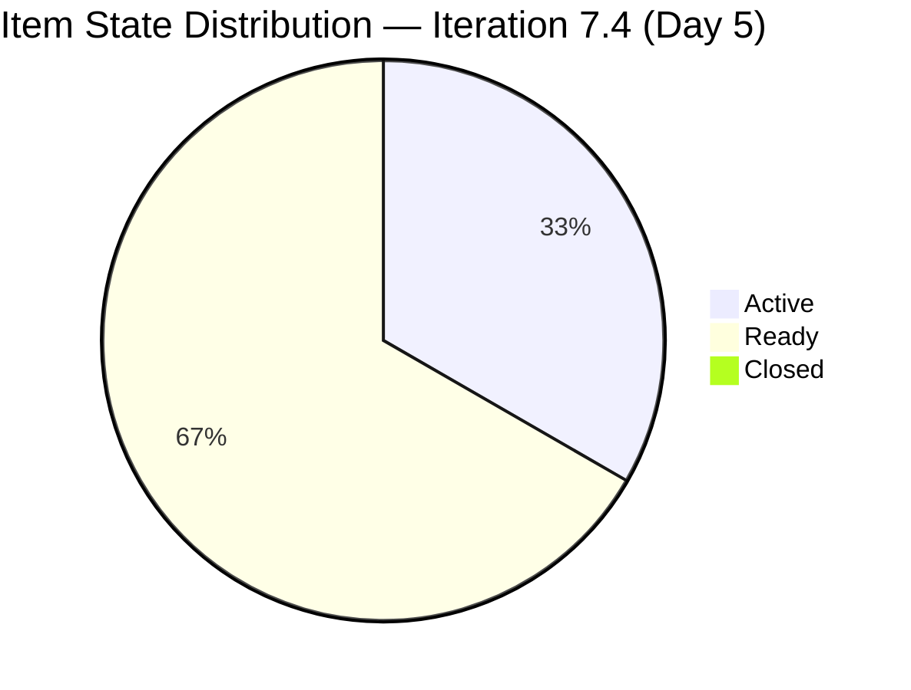

# HR Recruitment Team — SAFe Iteration Audit #67

**Audit Date:** 2026-05-22 09:00 PHT
**Auditor:** Claude Code (SAFe PM Consultant)
**Workspace:** `ado_hr`
**ADO Board:** [HR Recruitment Team](https://dev.azure.com/jairo/Jairosoft%20FINOPS/_boards/board/t/Human%20Resource%20Recruitment%20Team/Stories%20and%20Deliverables)

---

## 1. Audit Metadata

| Field | Value |
|-------|-------|
| Audit Number | #67 |
| Audit Date | 2026-05-22 |
| Audit Time | 09:00 PHT |
| Iteration | 7.4 |
| Iteration Dates | May 18 – May 31, 2026 |
| Sprint Day | Day 5 of 14 |
| ADO Project | Jairosoft FINOPS (`e0bb302f-40f9-46c3-8164-6f1acb317d63`) |
| ADO Team | Human Resource Recruitment Team (`248f59a6-372c-4b74-8129-9eaf260f211e`) |
| Iteration ID | `c50c3955-60cb-431b-a619-5f7d2cd02138` |
| Prior Audit | AUDIT_20260521_0900.md (Score: 78.6 — Moderate Risk) |
| **Overall Score** | **78.6 / 100** |
| **Risk Band** | **Moderate Risk** |

---

## 2. Executive Summary

Iteration 7.4, **Day 5 of 14**. The sprint is structurally unchanged from yesterday: all 6 items remain committed, Almera returned from leave on Day 4 and activated item #204252, and no items have closed yet. Today is the last day of the early-sprint annotation window (Days 1–5); from Day 6 onward, D7 (Delivery Predictability) will reflect 0 SP closed at full penalty weight.

The score holds at **78.6 / 100 (Moderate Risk)** — the same level maintained since sprint start. The sprint is well-loaded at 13 SP committed against ~58 SP of capacity, and item quality (DoR, estimation) is 100%. The primary near-term risk is that no items have closed through Day 5; first closures are needed by Day 7 (May 24) to sustain the score above the Moderate threshold as the early-sprint annotation expires.

Persistent structural gaps — no iteration goal, no PI objectives, bus factor = 1 — remain unaddressed.

**Overall Score: 78.6 / 100 — Moderate Risk**

---

## 3. Previous Audit Delta

| Metric | 2026-05-21 (Audit #66) | 2026-05-22 (Audit #67) | Change |
|--------|------------------------|------------------------|--------|
| Sprint Day | Day 4 | Day 5 | +1 |
| Items in Iteration | 6 | 6 | 0 |
| Items Active | 1 | 1 (#204252) | 0 |
| Items Closed | 0 | 0 | 0 |
| Story Points Committed | 13 SP | 13 SP | 0 |
| SP Closed | 0 | 0 | 0 |
| D7 — Delivery Predictability | 0 (early-sprint) | 0 (early-sprint, last day) | 0 |
| Overall Score | 78.6 | 78.6 | 0.0 |
| Risk Band | Moderate Risk | Moderate Risk | — |

### Notable Changes (Day 5)

- **#204252 (Cebu Employees 1-on-1 APE Consultation with Doc Karl)** — remained Active. Last changed 2026-05-21 22:50 PHT (coordination in progress).
- **#203629 (HR Discussion on Employees Incentives, Scaling of Bonuses)** — last changed 2026-05-21 22:05 PHT. Spike remains Active; stakeholder discussion ongoing.
- **All other items** remain in Ready state awaiting activation.
- **No items closed.** Day 5 is the final early-sprint annotation day. First closures are critical for D7 to recover on Day 6+.

---

## 4. Current Iteration Snapshot

**Iteration 7.4** · May 18 – May 31, 2026 · **Day 5 of 14**

| Field | Value |
|-------|-------|
| Total Visible Root Backlog Items | 6 |
| Items in Iteration 7.4 | 6 |
| User Stories | 5 (83.3%) |
| Spikes | 1 (16.7%) |
| Enablers | 1 (included in User Story count as Enabler type) |
| Total SP Committed | 13 SP |
| Items Active | 1 (#204252 — Enabler, APE consultation) |
| Items Active (Spike) | 1 (#203629 — Incentives spike) |
| Items Ready | 4 |
| Items Closed | 0 |
| SP Burned | 0 SP |
| % Complete (Items) | 0% |
| % Complete (SP) | 0% |

### Capacity (Iteration 7.4)

| Member | Activity | Pts/Day | Days Off | Available SP |
|--------|----------|---------|----------|-------------|
| Almera Kleer Tayao | Documentation + Requirements | 5.25 | May 18–20 (3 days taken) | ~58.0 SP |

**Committed vs. Capacity:** 13 SP committed / ~58 SP available = 22% utilization. Team is lightly loaded, suggesting additional scope could be pulled in.

---

## 5. Work Item Analysis

| ID | Title | Type | State | SP | Assignee | Changed | DoR |
|----|-------|------|-------|-----|----------|---------|-----|
| 203825 | Client Interview \| Sr. Tech Lead - Maraon, Belleo | User Story | Ready | 2 | Almera | May 15 | Pass |
| 203535 | APE - Caumban, Karl Jordan (Sprint 7.3) | User Story | Ready | 2 | Almera | May 17 | Pass |
| 202104 | APE - Rommel Senillo - Summary - PI7 | User Story | Ready | 2 | Almera | May 17 | Pass |
| 202349 | Finance Reporting & Export | User Story | Ready | 2 | Almera | May 17 | Pass |
| 203629 | HR Discussion on Employees Incentives, Scaling of Bonuses | Spike | Active | 3 | Almera | May 21 | Pass |
| 204252 | Cebu Employees 1-on-1 APE Consultation with Doc Karl | Enabler | Active | 2 | Almera | May 21 | Pass |

**Item type breakdown:** User Story = 4, Spike = 1, Enabler = 1
**All items assigned to Almera** — single-contributor sprint (bus factor = 1 confirmed)
**All items have SP set** (6/6 = 100%)
**All items have substantive description and acceptance criteria** (6/6 = 100% DoR)

### Untouched Items (ChangedDate before sprint start May 18)

| ID | Title | Last Changed | Days Stale |
|----|-------|-------------|-----------|
| 203825 | Client Interview \| Sr. Tech Lead | May 15 | 7 days |
| 203535 | APE - Caumban, Karl Jordan | May 17 | 5 days |
| 202104 | APE - Rommel Senillo | May 17 | 5 days |
| 202349 | Finance Reporting & Export | May 17 | 5 days |

4 of 6 items (66.7%) were last touched before sprint start. This triggers the untouched penalty in D6.

---

## 6. SAFe Compliance Scorecard

| Dimension | Score | Evidence | Notes |
|-----------|-------|----------|-------|
| D1 — Iteration Planning | 100.0 | 6/6 visible root items assigned to Iter 7.4 | All backlog items committed to current sprint |
| D2 — Team Capacity | 100.0 | 1/1 contributor has configured capacity (5.25 pts/day) | Almera: 5.25 pts/day, 3 days off recorded |
| D3 — Estimation | 100.0 | 6/6 items have Story Points > 0 | Total 13 SP; all types have SP |
| D4 — DoR Compliance | 100.0 | 6/6 items pass description + AC threshold | All items have substantive description and AC |
| D5 — Work Item Balance | 70.0 | User Story present (+); dominant type = User Story 5/6 = 83.3% > 60% (-30) | Reduce Spike/Enabler dominance risk; type mix acceptable |
| D6 — Backlog Refinement | 80.0 | 6/6 fresh (100% base); 4/6 untouched before sprint start (66.7% > 30% → -20) | No stale-90 or stale-180 items; penalty from pre-sprint unchanged items |
| D7 — Delivery Predictability | 0.0 | 0/13 SP closed; early-sprint annotation (Day 5 — last day) | 0 closures through Day 5; annotation expires tomorrow |

**Overall Score: (100 + 100 + 100 + 100 + 70 + 80 + 0) / 7 = 78.6 / 100 — Moderate Risk**

---

## 7. Dimension Findings

### D1 — Iteration Planning (100.0) ✅
All 6 visible root backlog items are assigned to Iteration 7.4. The team is 100% committed. Utilization is light (13 SP / ~58 SP capacity = 22%), suggesting the sprint is deliberately conservative or additional scope could be pulled in from the backlog.

### D2 — Team Capacity (100.0) ✅
Almera has capacity configured at 5.25 pts/day with 3 days off properly recorded (May 18–20 leave). Single-contributor configuration is functionally complete, though the bus factor = 1 remains a structural risk.

### D3 — Estimation (100.0) ✅
All 6 items are estimated. Story points range from 2–3 SP, consistent sizing. This is a continuation of the 100% estimation rate maintained since Iteration 6.5.

### D4 — DoR Compliance (100.0) ✅
All 6 items have rich descriptions and acceptance criteria well above thresholds. APE evaluation stories follow the established template. Spike #203629 has detailed research scope and 4-point AC. The DoR discipline introduced in PI6 has fully taken hold.

### D5 — Work Item Balance (70.0) ⚠️
User Stories are present (5/6), so the -40 penalty is avoided. However, User Story dominance at 83.3% exceeds the 60% threshold (-30 penalty). The item mix of 4 APE/HR stories + 1 finance story + 1 spike + 1 enabler is reasonable for an HR team but lacks the diversity that would yield a perfect balance score. The Enabler (APE consultation) could be reclassified as a User Story to improve the type mix.

### D6 — Backlog Refinement (80.0) ⚠️
The backlog is 100% fresh (all items changed within 45 days). No stale-90 or stale-180 items exist. The -20 penalty comes from 4/6 items (66.7%) having a ChangedDate before the sprint start — these items were queued in Ready state during Iteration 7.3 without being touched in the sprint setup phase. This is a refinement discipline gap: items should receive at least one update (e.g., state to Active) at sprint kick-off.

### D7 — Delivery Predictability (0.0, early-sprint) ⚠️
No items have closed through Day 5. The early-sprint annotation (Days 1–5) expires today. From Day 6, any score of 0 SP closed will register as a full penalty. With #204252 Active and #203629 Active, first closures are expected on Days 5–7. **Target: at least 1 item (2 SP) closed by end of Day 6 (May 23)** to bring D7 to 15.4% and stabilize the score.

---

## 8. Risks and Bottlenecks

| Risk | Severity | Status |
|------|----------|--------|
| No iteration goal defined | High | Unresolved — 13th consecutive audit |
| No PI objectives linked | High | Unresolved — 13th consecutive audit |
| Bus factor = 1 (Almera) | High | Structural — unchanged |
| 0 items closed through Day 5 | High | Critical by Day 6 — early-sprint annotation expires |
| Sprint underloaded (22% capacity utilization) | Moderate | 9 SP remaining capacity; consider pulling in backlog items |
| 4/6 items untouched since before sprint start | Low | Resolved by Day 6 activation |
| Item #203825 title references Sprint 7.3 incorrectly | Low | Cosmetic — content is valid for 7.4 |

---

## 9. Prioritized Recommendations

1. **Close at least 1 item by EOD May 23 (Day 6)** — The early-sprint annotation expires today. #204252 (APE consultation, 2 SP) and #203629 (Incentives spike, 3 SP) are both Active. Push at least one to Closed before the Day 6 score calculation.

2. **Activate remaining Ready items** — Items 202104, 202349, 203535, 203825 are in Ready state. Move at least 2 to Active today to demonstrate sprint momentum and resolve the untouched-item penalty in D6 for the next audit.

3. **Define an iteration goal** — A one-sentence sprint goal has been absent for 13 consecutive audits. Even a minimal statement (e.g., "Complete APE cycle for all PI7 employees and establish incentives framework") would satisfy this gap and raise behavioral maturity.

4. **Pull additional scope** — With 13 SP committed vs ~58 SP available capacity, the sprint is at 22% utilization. Consider pulling 2–3 additional stories from the PI7 backlog to better utilize Almera's capacity.

5. **Link to PI objectives** — Recurring finding. At minimum, tag each item with the relevant PI7 objective in the tags or description so delivery intent is visible.

6. **Correct item #203825 title** — Title reads "Sprint 7.3" but the item is in Iteration 7.4. Minor hygiene fix to prevent confusion.

---

## 10. Evidence Gaps and Limitations

| Gap | Impact | Notes |
|-----|--------|-------|
| No iteration goal visible in ADO | D1 quality not measurable | Structural gap, not a data quality issue |
| No PI objectives linked to items | D1/D7 context incomplete | Recurring since PI6 |
| Individual capacity breakdown unavailable via API | D2 detail limited | Team-level capacity (5.25 pts/day) confirmed; individual activity breakdown from prior audit context |
| Task-level breakdown not assessed | Scope depth unknown | Rubric assesses root items only; tasks excluded per methodology |

---

## Visualization

```mermaid
radar
  title Iteration 7.4 — Day 5 SAFe Score Breakdown (HR Team)
  "D1 Iteration Planning" : 100
  "D2 Team Capacity" : 100
  "D3 Estimation" : 100
  "D4 DoR Compliance" : 100
  "D5 Work Item Balance" : 70
  "D6 Backlog Refinement" : 80
  "D7 Delivery Predictability" : 0
```

```mermaid
xychart-beta
  title "Score Trend — HR Recruitment Team (Recent Audits)"
```

> Note: Trend chart omitted (xychart-beta not supported in Obsidian). See table below.

### Score Trend (Last 7 Audits)

| Date | Audit | Score | Band |
|------|-------|-------|------|
| May 16 | #61 | 78.6 | Moderate |
| May 17 | #62 | 78.6 | Moderate |
| May 18 | #63 | 78.6 | Moderate |
| May 19 | #64 | 78.6 | Moderate |
| May 20 | #65 | 78.6 | Moderate |
| May 21 | #66 | 78.6 | Moderate |
| **May 22** | **#67** | **78.6** | **Moderate** |

The score has been stable at 78.6 since sprint start. D7 expiry on Day 6 is the next trigger point — first closures will determine whether the score rises above 80 or drops.



---

*Audit generated by Claude Code (claude-sonnet-4-6) on 2026-05-22. Evidence sourced from Azure DevOps MCP (Jairosoft FINOPS project). Rubric: SAFe 6.0 7-dimension scorecard.*
