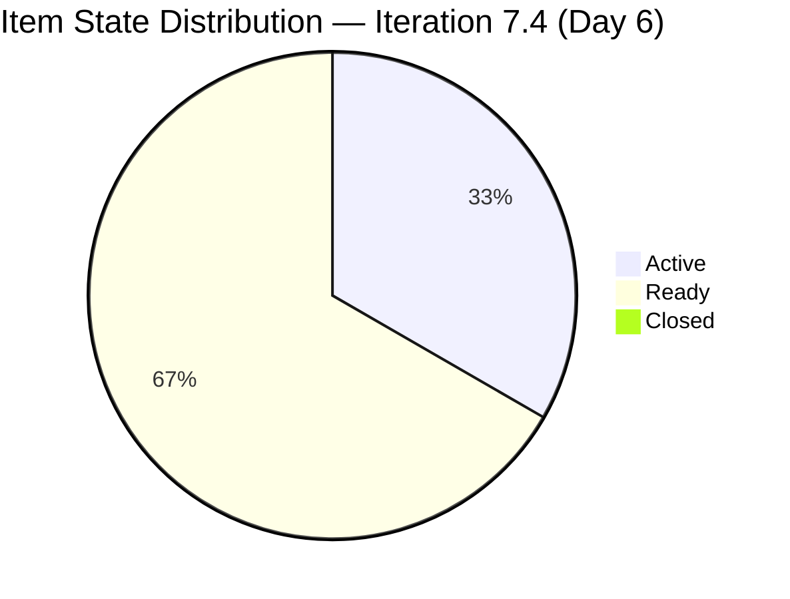
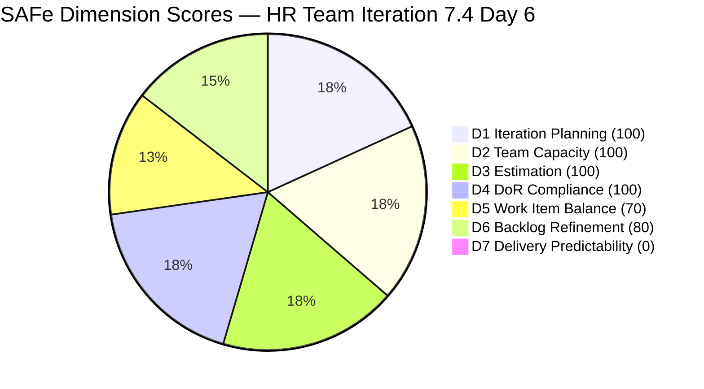
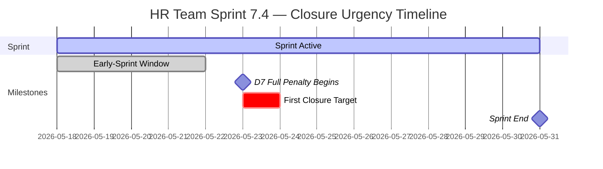

# HR Recruitment Team — SAFe Iteration Audit #68

**Audit Date:** 2026-05-23 09:00 PHT
**Auditor:** Claude Code (SAFe PM Consultant)
**Workspace:** `ado_hr`
**ADO Board:** [HR Recruitment Team](https://dev.azure.com/jairo/Jairosoft%20FINOPS/_boards/board/t/Human%20Resource%20Recruitment%20Team/Stories%20and%20Deliverables)

---

## 1. Audit Metadata

| Field | Value |
|-------|-------|
| Audit Number | #68 |
| Audit Date | 2026-05-23 |
| Audit Time | 09:00 PHT |
| Iteration | 7.4 |
| Iteration Dates | May 18 – May 31, 2026 |
| Sprint Day | Day 6 of 14 |
| ADO Project | Jairosoft FINOPS (`e0bb302f-40f9-46c3-8164-6f1acb317d63`) |
| ADO Team | Human Resource Recruitment Team (`248f59a6-372c-4b74-8129-9eaf260f211e`) |
| Iteration ID | `c50c3955-60cb-431b-a619-5f7d2cd02138` |
| Prior Audit | AUDIT_20260522_0900.md (Score: 78.6 — Moderate Risk) |
| **Overall Score** | **78.6 / 100** |
| **Risk Band** | **Moderate Risk** |

---

## 2. Executive Summary

Iteration 7.4, **Day 6 of 14**. The early-sprint annotation (Days 1–5) expired yesterday. As of this morning's audit, **no items have closed** — the score now carries the full D7 penalty of 0 with no protective annotation. Despite this, the overall score holds at **78.6 / 100 (Moderate Risk)** because the remaining six dimensions continue to score perfectly or near-perfectly.

Both active items (#204252 APE Consultation and #203629 Incentives Spike) were last touched on May 21 — two full days of silence. The sprint has 8 working days remaining, with 13 SP committed. The window for recovery is wide, but the failure to close even one item by Day 6 introduces growing predictability risk. First closures are now overdue.

Persistent structural issues — no iteration goal, no PI objectives, bus factor = 1 — remain unresolved for a 14th consecutive audit.

**Overall Score: 78.6 / 100 — Moderate Risk**

---

## 3. Previous Audit Delta

| Metric | 2026-05-22 (Audit #67) | 2026-05-23 (Audit #68) | Change |
|--------|------------------------|------------------------|--------|
| Sprint Day | Day 5 | Day 6 | +1 |
| Items in Iteration | 6 | 6 | 0 |
| Items Active | 2 (#204252, #203629) | 2 (#204252, #203629) | 0 |
| Items Closed | 0 | 0 | 0 |
| Story Points Committed | 13 SP | 13 SP | 0 |
| SP Closed | 0 | 0 | 0 |
| Early-Sprint Annotation | Yes (last day) | **No — expired** | Expired |
| D7 — Delivery Predictability | 0 (early-sprint) | **0 (full penalty)** | — |
| Overall Score | 78.6 | 78.6 | 0.0 |
| Risk Band | Moderate Risk | Moderate Risk | — |

### Notable Changes (Day 6)

- **Early-sprint annotation expired.** D7 now bears the full penalty weight. The score is identical today (78.6) because no other dimensions changed, but the D7 situation is now a hard risk.
- **#204252** (APE Consultation): still Active, last changed May 21 22:50 PHT — 2 days without an update.
- **#203629** (Incentives Spike): still Active, last changed May 21 22:05 PHT — 2 days without an update.
- **#203825, #203535, #202104, #202349**: still in Ready state, unchanged since before sprint start.
- **No closures, no new activations.** The board has been silent since May 21.

---

## 4. Current Iteration Snapshot

**Iteration 7.4** · May 18 – May 31, 2026 · **Day 6 of 14**

| Field | Value |
|-------|-------|
| Total Visible Root Backlog Items | 6 |
| Items in Iteration 7.4 | 6 |
| User Stories | 4 (66.7%) |
| Spikes | 1 (16.7%) |
| Enablers | 1 (16.7%) |
| Total SP Committed | 13 SP |
| Items Active | 2 (#204252, #203629) |
| Items Ready | 4 |
| Items Closed | 0 |
| SP Burned | 0 SP |
| % Complete (Items) | 0% |
| % Complete (SP) | 0% |
| Days Remaining | 8 working days |

### Capacity (Iteration 7.4)

| Member | Activity | Pts/Day | Days Off | Available SP |
|--------|----------|---------|----------|-------------|
| Almera Kleer Tayao | Documentation (3) + Requirements (2) | 5.25 | May 18–20 (3 days taken) | ~58.0 SP remaining from sprint total |
| grace | Documentation | 0.25 | None | Negligible |

**Committed vs. Capacity:** 13 SP committed / ~58 SP available ≈ 22% utilization. Sprint remains lightly loaded.

---

## 5. Work Item Analysis

| ID | Title | Type | State | SP | Assignee | Last Changed | DoR |
|----|-------|------|-------|-----|----------|-------------|-----|
| 203825 | Client Interview \| Sr. Tech Lead - Maraon, Belleo | User Story | Ready | 2 | Almera | May 15 | Pass |
| 203535 | APE - Caumban, Karl Jordan (Sprint 7.3) | User Story | Ready | 2 | Almera | May 17 | Pass |
| 202104 | APE - Rommel Senillo - Summary - PI7 | User Story | Ready | 2 | Almera | May 17 | Pass |
| 202349 | Finance Reporting & Export | User Story | Ready | 2 | Almera | May 17 | Pass |
| 203629 | HR Discussion on Employees Incentives, Scaling of Bonuses | Spike | Active | 3 | Almera | May 21 | Pass |
| 204252 | Cebu Employees 1-on-1 APE Consultation with Doc Karl | Enabler | Active | 2 | Almera | May 21 | Pass |

**Item type breakdown:** User Story = 4, Spike = 1, Enabler = 1
**All items assigned to Almera** — single-contributor sprint (bus factor = 1 confirmed)
**All items have SP** (6/6 = 100%)
**All items pass DoR** — substantive description and acceptance criteria on all 6 (6/6 = 100%)

### Untouched Items (ChangedDate before sprint start May 18)

| ID | Title | Last Changed | Days Stale |
|----|-------|-------------|-----------|
| 203825 | Client Interview \| Sr. Tech Lead | May 15 | 8 days |
| 203535 | APE - Caumban, Karl Jordan | May 17 | 6 days |
| 202104 | APE - Rommel Senillo | May 17 | 6 days |
| 202349 | Finance Reporting & Export | May 17 | 6 days |

4 of 6 items (66.7%) were last touched before sprint start. This exceeds the 30% threshold and triggers the D6 penalty.

### Active Item Activity Gap

Both active items (#204252 and #203629) were last updated May 21 — now 2 days ago. By SAFe standards, active items should show daily progress signals or state transitions. The silence since May 21 raises concern about whether work is truly in progress.

---

## 6. SAFe Compliance Scorecard

| Dimension | Score | Evidence | Notes |
|-----------|-------|----------|-------|
| D1 — Iteration Planning | 100.0 | 6/6 visible root items assigned to Iter 7.4 | All backlog items committed to current sprint |
| D2 — Team Capacity | 100.0 | 1/1 active contributor with configured capacity (5.25 pts/day) | Almera: 5.25 pts/day; grace 0.25 pts/day (supplemental) |
| D3 — Estimation | 100.0 | 6/6 items have Story Points > 0 | Total 13 SP; all types estimated |
| D4 — DoR Compliance | 100.0 | 6/6 items pass description ≥30 chars + AC ≥20 chars | Rich descriptions and multi-point acceptance criteria on all items |
| D5 — Work Item Balance | 70.0 | User Story present (+); dominant = User Story 4/6 = 66.7% > 60% (−30) | Spike 16.7% and Enabler 16.7% provide type diversity |
| D6 — Backlog Refinement | 80.0 | 6/6 fresh items (base 100); 4/6 untouched before sprint (66.7% > 30% → −20) | No stale-90 or stale-180 items; pre-sprint items in Ready state unchanged |
| D7 — Delivery Predictability | 0.0 | 0/13 SP closed; **early-sprint annotation expired** (Day 6) | No closures through Day 6 — full penalty now applies |

**Overall Score: (100 + 100 + 100 + 100 + 70 + 80 + 0) / 7 = 550 / 7 = 78.6 / 100 — Moderate Risk**

---

## 7. Dimension Findings

### D1 — Iteration Planning (100.0) ✅
All 6 visible root backlog items are assigned to Iteration 7.4. Planning coverage is complete. Utilization remains light at 22% (13 SP / 58 SP available), suggesting room for additional scope if Almera's capacity permits.

### D2 — Team Capacity (100.0) ✅
Almera has active capacity configured at 5.25 pts/day (Documentation 3 + Requirements 2). Grace's capacity (0.25 pts/day) is registered but negligible. The sprint took leave into account (3 days off at sprint start). Configuration is functionally complete. The single-contributor bus factor remains a structural risk.

### D3 — Estimation (100.0) ✅
All 6 items are estimated (2–3 SP). 100% estimation rate has been maintained since Iteration 6.5. Story point consistency continues to hold.

### D4 — DoR Compliance (100.0) ✅
All 6 items have rich descriptions and acceptance criteria well above the minimum thresholds. APE evaluation stories follow the established HR template. Spike #203629 has a four-point acceptance criteria with research deliverables, proposed scaling matrix, stakeholder alignment, and actionable next steps. DoR discipline established in PI6 continues to hold.

### D5 — Work Item Balance (70.0) ⚠️
User Stories are present (4/6), avoiding the −40 penalty. However, User Story dominance at 66.7% exceeds the 60% threshold (−30 penalty). The Enabler (#204252 APE Consultation) could be reclassified as a User Story to shift the mix — the item is written in As/I want/So that format and functions like a coordination user story. Doing so would change the type split to 5 User Stories + 1 Spike = 83.3% User Story — which still exceeds 60% and would not improve D5. The optimal fix is to pull in a more diverse work type (e.g., a Feature-type or Bug item) to dilute User Story dominance below 60%.

### D6 — Backlog Refinement (80.0) ⚠️
All 6 items are fresh (changed within 45 days). No stale-90 or stale-180 items exist. The −20 penalty persists from 4/6 items (66.7%) having ChangedDate before the sprint start (May 18). These items remain in Ready state without having been activated or touched during the sprint. Activating the four Ready items (moving to Active state in ADO) would update their ChangedDate and resolve this penalty in the next audit.

### D7 — Delivery Predictability (0.0) 🔴
**The early-sprint annotation has expired.** No items have closed through Day 6. With 0/13 SP delivered and 8 days remaining, the sprint requires first closures by Day 7 (May 24) at the latest to begin recovering D7. Even closing items #203629 (3 SP) would yield D7 = 23.1%, lifting the overall score to 81.9 (Low Risk). Both active items should be closeable this week given their in-progress status since mid-sprint.

---

## 8. Risks and Bottlenecks

| Risk | Severity | Status |
|------|----------|--------|
| 0 items closed through Day 6 — early-sprint annotation expired | **Critical** | First closures required immediately |
| No iteration goal defined | High | Unresolved — 14th consecutive audit |
| No PI objectives linked | High | Unresolved — 14th consecutive audit |
| Bus factor = 1 (Almera) | High | Structural — unchanged |
| Active items (#204252, #203629) silent since May 21 | High | 2-day activity gap on in-progress items |
| 4/6 items in Ready state, not activated | Moderate | Activating to Active would resolve D6 penalty |
| Sprint underloaded (22% capacity utilization) | Moderate | Room to pull 2–3 additional items from backlog |
| #203535 title references Sprint 7.3 incorrectly | Low | Cosmetic — content is valid for 7.4 |

---

## 9. Prioritized Recommendations

1. **Close at least 1 item today (Day 6 / May 23)** — The early-sprint annotation is gone. #204252 (APE Consultation, 2 SP) has 8 acceptance criteria focused on coordination tasks that appear completable if the consultation was already conducted. Push this item to Closed. Even 2 SP closed would bring D7 to 15.4% and lift the overall score to 80.8 (Low Risk threshold).

2. **Update both active items in ADO** — Items #204252 and #203629 show no activity since May 21. Adding a comment, updating the description, or moving to a new state signals active engagement and keeps D6 healthy in future audits.

3. **Activate the four Ready items** — Move #203825, #203535, #202104, and #202349 to Active state. This updates their ChangedDate past May 18 (sprint start) and would reduce the D6 untouched item ratio from 66.7% to 0%, eliminating the −20 penalty and bringing D6 to 100 (overall score lifts to 82.3 with D7 at 0).

4. **Define an iteration goal** — A single-sentence sprint goal (e.g., "Complete APE cycle for PI7 employees and establish incentive structure for annual increase proposal") would resolve this 14-audit gap and signal SAFe process maturity.

5. **Pull additional scope from backlog** — With 13 SP committed vs ~58 SP available capacity, the team is at 22% utilization. Pulling 2–3 HR backlog items (e.g., hiring pipeline items for 7.5 candidates) would improve D1 if they extend the visible backlog, and give Almera more to deliver.

6. **Link items to PI objectives** — Recurring finding for 14 audits. At minimum, add PI7 objective tags to each item's description to establish traceability between sprint work and the program increment goals.

---

## 10. Evidence Gaps and Limitations

| Gap | Impact | Notes |
|-----|--------|-------|
| No iteration goal visible in ADO | D1 quality not measurable | Structural gap, 14th consecutive audit |
| No PI objectives linked to items | D1/D7 context incomplete | Recurring since PI6 |
| Active item activity gap (May 21→May 23) | D7 urgency elevated | Cannot confirm work is genuinely in progress |
| Task-level breakdown not assessed | Scope depth unknown | Rubric assesses root items only; tasks excluded per methodology |

---

## Visualization

> D7 shows as 1 to remain visible in the pie chart; actual score = 0.

### Score Trend (Last 7 Audits)

| Date | Audit | Score | Band | D7 Note |
|------|-------|-------|------|---------|
| May 17 | #62 | 78.6 | Moderate | Early-sprint |
| May 18 | #63 | 78.6 | Moderate | Early-sprint |
| May 19 | #64 | 78.6 | Moderate | Early-sprint |
| May 20 | #65 | 78.6 | Moderate | Early-sprint |
| May 21 | #66 | 78.6 | Moderate | Early-sprint |
| May 22 | #67 | 78.6 | Moderate | Early-sprint (last day) |
| **May 23** | **#68** | **78.6** | **Moderate** | **Full penalty — no annotation** |

Score has held at 78.6 through 7 consecutive audits on the strength of D1–D4. D7 now carries full weight. First closures will break the flat trend — either upward (if closures arrive) or downward (if the sprint stalls further).

---

*Audit generated by Claude Code (claude-sonnet-4-6) on 2026-05-23. Evidence sourced from Azure DevOps MCP (Jairosoft FINOPS project). Rubric: SAFe 6.0 7-dimension scorecard.*
