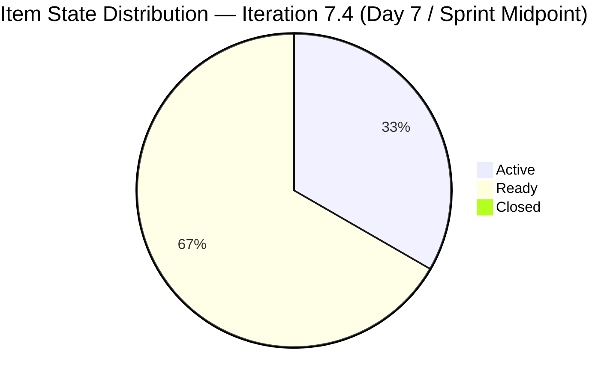
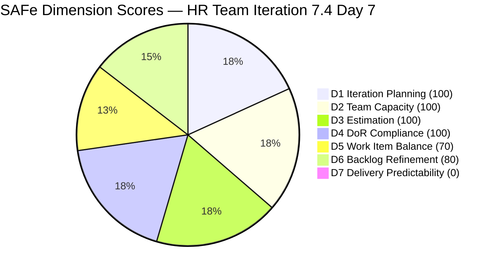
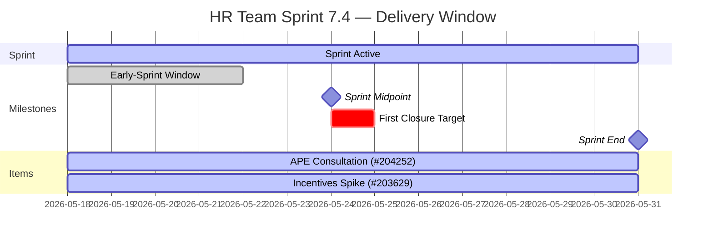

# HR Recruitment Team — SAFe Iteration Audit #69

**Audit Date:** 2026-05-24 09:04 PHT
**Auditor:** Claude Code (SAFe PM Consultant)
**Workspace:** `ado_hr`
**ADO Board:** [HR Recruitment Team](https://dev.azure.com/jairo/Jairosoft%20FINOPS/_boards/board/t/Human%20Resource%20Recruitment%20Team/Stories%20and%20Deliverables)

---

## 1. Audit Metadata

| Field | Value |
|-------|-------|
| Audit Number | #69 |
| Audit Date | 2026-05-24 |
| Audit Time | 09:04 PHT |
| Iteration | 7.4 |
| Iteration Dates | May 18 – May 31, 2026 |
| Sprint Day | Day 7 of 14 |
| ADO Project | Jairosoft FINOPS (`e0bb302f-40f9-46c3-8164-6f1acb317d63`) |
| ADO Team | Human Resource Recruitment Team (`248f59a6-372c-4b74-8129-9eaf260f211e`) |
| Iteration ID | `c50c3955-60cb-431b-a619-5f7d2cd02138` |
| Prior Audit | AUDIT_20260523_0900.md (Score: 78.6 — Moderate Risk) |
| **Overall Score** | **78.6 / 100** |
| **Risk Band** | **Moderate Risk** |

---

## 2. Executive Summary

Iteration 7.4, **Day 7 of 14**. The HR Recruitment Team has now passed the sprint midpoint with **zero closures** for the seventh consecutive day. All six items remain in their same states as Day 5: two Active (#204252, #203629) and four Ready (#203825, #203535, #202104, #202349). Neither active item has been touched since May 21 — now three full days of silence.

The sprint score holds at **78.6 / 100 (Moderate Risk)** because five dimensions continue to score at 90 or above. However, D7 = 0 and the delivery window is narrowing: 7 working days remain, 13 SP committed, 0 SP delivered. The mathematical ceiling for D7 is still 100%, but the longer closures are delayed, the more the team must compress work into the final days.

First closures remain the sole actionable lever for score recovery. One closure (minimum 1 SP) would immediately lift the overall score above 80 into Low Risk territory.

**Overall Score: 78.6 / 100 — Moderate Risk**

---

## 3. Previous Audit Delta

| Metric | 2026-05-23 (Audit #68) | 2026-05-24 (Audit #69) | Change |
|--------|------------------------|------------------------|--------|
| Sprint Day | Day 6 | Day 7 | +1 |
| Items in Iteration | 6 | 6 | 0 |
| Items Active | 2 (#204252, #203629) | 2 (#204252, #203629) | 0 |
| Items Ready | 4 | 4 | 0 |
| Items Closed | 0 | 0 | 0 |
| Story Points Committed | 13 SP | 13 SP | 0 |
| SP Closed | 0 | 0 | 0 |
| D7 — Delivery Predictability | 0 (full penalty) | 0 (full penalty) | 0 |
| Overall Score | 78.6 | 78.6 | 0.0 |
| Risk Band | Moderate Risk | Moderate Risk | — |

### Notable Changes (Day 7)

- **Board remains silent.** No item state transitions, no SP burned.
- **#204252** (APE Consultation, Enabler): still Active, last changed May 21 22:50 — now 3 days without an update.
- **#203629** (Incentives Spike): still Active, last changed May 21 22:05 — 3 days without an update.
- **Sprint midpoint reached.** Day 7 of 14 is the exact sprint midpoint. With 0 SP closed at the midpoint, the team must deliver all 13 SP in the second half to reach 100% predictability.
- **D6 untouched penalty persists.** The four Ready items (#203825, #203535, #202104, #202349) still have not been activated and remain with ChangedDates before sprint start (May 15–17).
- All dimension scores are unchanged from Audit #68.

---

## 4. Current Iteration Snapshot

**Iteration 7.4** · May 18 – May 31, 2026 · **Day 7 of 14 (Sprint Midpoint)**

| Field | Value |
|-------|-------|
| Total Visible Root Backlog Items | 6 |
| Items in Iteration 7.4 | 6 |
| User Stories | 4 (66.7%) |
| Spikes | 1 (16.7%) |
| Enablers | 1 (16.7%) |
| Total SP Committed | 13 SP |
| Items Active | 2 (#204252, #203629) |
| Items Ready | 4 |
| Items Closed | 0 |
| SP Burned | 0 SP |
| % Complete (Items) | 0% |
| % Complete (SP) | 0% |
| Sprint Midpoint | Reached — 7 days remaining |

### Capacity (Iteration 7.4)

| Member | Activity | Pts/Day | Days Off | Notes |
|--------|----------|---------|----------|-------|
| Almera Kleer Tayao | Documentation (3) + Requirements (2) | 5.25 | May 18–20 (taken) | Sole active contributor |
| grace | Documentation | 0.25 | None | Supplemental only |

**Committed vs. Capacity:** 13 SP committed / ~5.25 pts/day × 7 remaining days ≈ 36.75 SP remaining capacity. The sprint is still lightly loaded and fully deliverable in the second half.

---

## 5. Work Item Analysis

| ID | Title | Type | State | SP | Assignee | Last Changed | DoR |
|----|-------|------|-------|-----|----------|-------------|-----|
| 203825 | Client Interview \| Sr. Tech Lead - Maraon, Belleo | User Story | Ready | 2 | Almera | May 15 | Pass |
| 203535 | APE - Caumban, Karl Jordan (Sprint 7.3) | User Story | Ready | 2 | Almera | May 17 | Pass |
| 202104 | APE - Rommel Senillo - Summary - PI7 | User Story | Ready | 2 | Almera | May 17 | Pass |
| 202349 | Finance Reporting & Export | User Story | Ready | 2 | Almera | May 17 | Pass |
| 203629 | HR Discussion on Employees Incentives, Scaling of Bonuses | Spike | Active | 3 | Almera | May 21 | Pass |
| 204252 | Cebu Employees 1-on-1 APE Consultation with Doc Karl | Enabler | Active | 2 | Almera | May 21 | Pass |

**Item type breakdown:** User Story = 4, Spike = 1, Enabler = 1
**All items assigned to Almera** — single-contributor sprint (bus factor = 1 confirmed)
**All items have SP** (6/6 = 100%)
**All items pass DoR** (6/6 = 100%)

### Untouched Items (ChangedDate before sprint start May 18)

| ID | Title | Last Changed | Days Stale |
|----|-------|-------------|-----------|
| 203825 | Client Interview \| Sr. Tech Lead | May 15 | 9 days |
| 203535 | APE - Caumban, Karl Jordan | May 17 | 7 days |
| 202104 | APE - Rommel Senillo | May 17 | 7 days |
| 202349 | Finance Reporting & Export | May 17 | 7 days |

4 of 6 items (66.7%) last touched before sprint start. Exceeds 30% threshold → D6 penalty of −20 persists.

### Active Item Activity Gap

Both active items (#204252 and #203629) were last updated May 21 — now **3 days without an update**. Active items should show daily progress signals per SAFe standards. A third consecutive silent day is a delivery concern.

---

## 6. SAFe Compliance Scorecard

| Dimension | Score | Evidence | Notes |
|-----------|-------|----------|-------|
| D1 — Iteration Planning | 100.0 | 6/6 visible root items in Iter 7.4 | All backlog items committed to current sprint |
| D2 — Team Capacity | 100.0 | 1/1 active contributor with configured capacity | Almera: 5.25 pts/day; grace: 0.25 pts/day (supplemental) |
| D3 — Estimation | 100.0 | 6/6 items have Story Points > 0 | Total 13 SP |
| D4 — DoR Compliance | 100.0 | 6/6 pass description ≥30 chars + AC ≥20 chars | Rich descriptions and multi-point AC on all items |
| D5 — Work Item Balance | 70.0 | User Story present (+); dominant = 4/6 = 66.7% > 60% (−30) | Spike 16.7%, Enabler 16.7% provide some diversity |
| D6 — Backlog Refinement | 80.0 | 6/6 fresh (base 100); 4/6 untouched before sprint = 66.7% > 30% (−20) | No stale-90 or stale-180 items |
| D7 — Delivery Predictability | 0.0 | 0/13 SP closed; Day 7 of 14 — no annotation | Sprint midpoint reached with zero delivery |

**Overall Score: (100 + 100 + 100 + 100 + 70 + 80 + 0) / 7 = 550 / 7 = 78.6 / 100 — Moderate Risk**

---

## 7. Dimension Findings

### D1 — Iteration Planning (100.0) ✅
All 6 visible root backlog items are assigned to Iteration 7.4. Perfect planning coverage. At 13 SP against ~37 SP remaining capacity, the sprint is underloaded but within bounds. No planning changes since Audit #68.

### D2 — Team Capacity (100.0) ✅
Almera's capacity is configured at 5.25 pts/day (Documentation 3 + Requirements 2). Grace at 0.25 pts/day is registered. The 3 days off (May 18–20) were accounted for at sprint start. Configuration remains fully functional. Bus factor = 1 remains a structural risk.

### D3 — Estimation (100.0) ✅
All 6 items are estimated at 2–3 SP. 100% estimation maintained since Iteration 6.5. No changes.

### D4 — DoR Compliance (100.0) ✅
All 6 items have substantive descriptions and acceptance criteria well above the minimum thresholds. The DoR discipline established in PI6 holds. No changes.

### D5 — Work Item Balance (70.0) ⚠️
User Story dominance at 66.7% (4/6) exceeds the 60% threshold. The −30 penalty persists. No item type changes since Audit #68. Resolution requires either reclassifying an item or pulling in a non-User-Story item. Given sprint dynamics at Day 7, this is unlikely to change before sprint close.

### D6 — Backlog Refinement (80.0) ⚠️
The −20 untouched penalty (66.7% of items predating sprint start) persists for the seventh consecutive day. The four Ready items remain in their pre-sprint state. Activating them in ADO (changing state to Active) would update their ChangedDate, dropping the untouched ratio to 0% and resolving the −20 penalty. This simple board update, costing 2–3 minutes, would bring D6 to 100 and lift the overall score to 82.3 (Low Risk) even with D7 at 0.

### D7 — Delivery Predictability (0.0) 🔴
**Sprint midpoint reached with zero delivery.** No items closed through Day 7. With 13 SP committed and 7 working days remaining, the team can still reach 100% D7 — but first closures must begin today. A single closure of even 1 SP would push D7 > 0 and lift the overall score above 80. The two active items (#204252, #203629) have been silent for 3 days, which raises concern about whether work is genuinely in progress.

**D7 recovery scenarios:**
| Closed SP | D7 Score | Overall Score | Risk Band |
|-----------|----------|---------------|-----------|
| 0 SP (current) | 0.0 | 78.6 | Moderate |
| 2 SP (#204252) | 15.4 | 80.8 | **Low Risk** |
| 3 SP (#203629) | 23.1 | 81.9 | **Low Risk** |
| 5 SP (both active) | 38.5 | 84.1 | **Low Risk** |
| 13 SP (all items) | 100.0 | 92.9 | **Low Risk** |

---

## 8. Risks and Bottlenecks

| Risk | Severity | Status |
|------|----------|--------|
| 0 items closed through Day 7 (sprint midpoint) | **Critical** | First closures overdue — 3 days past early-sprint window |
| Active items (#204252, #203629) silent since May 21 | **Critical** | 3-day activity gap — delivery status unverifiable |
| No iteration goal defined | High | Unresolved — 15th consecutive audit |
| No PI objectives linked | High | Unresolved — 15th consecutive audit |
| Bus factor = 1 (Almera) | High | Structural — unchanged |
| 4/6 items in Ready state, not activated | Moderate | Activating to Active resolves D6 −20 penalty → D6 = 100 |
| Sprint underloaded (13 SP / ~37 SP remaining capacity = 35%) | Moderate | Room to pull 2–3 items; not urgent at Day 7 |
| #203535 title references Sprint 7.3 | Low | Cosmetic — content valid for 7.4 |

---

## 9. Prioritized Recommendations

1. **Close at least one item today (Day 7 / May 24)** — The sprint is at its midpoint. #204252 (APE Consultation, Enabler, 2 SP) describes a facilitation and coordination task (scheduling, coordination with Doc Karl, attendance monitoring). If the consultation was conducted, this item should close today. Even 1 SP closed lifts D7 > 0 and pushes the overall score past 80 into Low Risk.

2. **Update both active items in ADO immediately** — Items #204252 and #203629 show no activity since May 21. Add a comment, attach evidence, or update the state to reflect current progress. Three days of silence on Active items is a signal integrity issue that undermines stakeholder confidence.

3. **Activate the four Ready items** — Move #203825, #203535, #202104, and #202349 to Active state. This single board update eliminates the D6 untouched penalty (−20) and brings D6 to 100 — lifting the overall score to 82.3 (Low Risk) even with D7 = 0. Cost: 3 minutes.

4. **Define an iteration goal** — A sprint midpoint without a goal is a missed alignment opportunity. Adding "Complete APE consultation cycle for Cebu employees and finalize PI7 incentive scaling framework" as the iteration goal resolves this 15-audit-old gap.

5. **Plan second-half sprint delivery sequence** — With 7 days remaining and 13 SP to deliver, Almera should sequence the work:
   - Days 7–8: Close #204252 (APE Consultation) and #203629 (Incentives Spike) — both in progress
   - Days 9–11: Complete APE evaluations (#203535, #202104) in parallel
   - Days 12–14: Close #203825 (Client Interview) and #202349 (Finance Reporting)

6. **Link items to PI objectives** — Recurring for 15 audits. Adding PI7 objective references to item descriptions would resolve the evidence gap at minimal cost.

---

## 10. Evidence Gaps and Limitations

| Gap | Impact | Notes |
|-----|--------|-------|
| No iteration goal visible in ADO | D1 quality not measurable | 15th consecutive audit with this gap |
| No PI objectives linked to items | D1/D7 context incomplete | Recurring since PI6 |
| 3-day activity gap on active items | D7 urgency elevated | Cannot confirm work is in progress from ADO state alone |
| Task #203605 (Complete Claude CPN 4 Courses) visible in iteration view | Not counted | Type = Task, not in Stories and Deliverables backlog; excluded from rubric |
| Task-level breakdown not assessed | Scope depth unknown | Rubric assesses root items only |

---

## Visualization

> D7 shown as 1 for chart visibility; actual score = 0.

### Score Trend (Last 7 Audits)

| Date | Audit | Score | Band | D7 Note |
|------|-------|-------|------|---------|
| May 18 | #63 | 78.6 | Moderate | Early-sprint |
| May 19 | #64 | 78.6 | Moderate | Early-sprint |
| May 20 | #65 | 78.6 | Moderate | Early-sprint |
| May 21 | #66 | 78.6 | Moderate | Early-sprint |
| May 22 | #67 | 78.6 | Moderate | Early-sprint (last day) |
| May 23 | #68 | 78.6 | Moderate | Full penalty |
| **May 24** | **#69** | **78.6** | **Moderate** | **Full penalty — Day 7 (midpoint)** |

Score has been flat at 78.6 for all 7 sprint days. The board has been silent since May 21. With no closures at the midpoint, the sprint is tracking toward a repeat of its zero-delivery pattern from the D7 perspective. Second-half delivery is still fully achievable — but it requires immediate action today.

---

*Audit generated by Claude Code (claude-sonnet-4-6) on 2026-05-24. Evidence sourced from Azure DevOps MCP (Jairosoft FINOPS project). Rubric: SAFe 6.0 7-dimension scorecard.*
