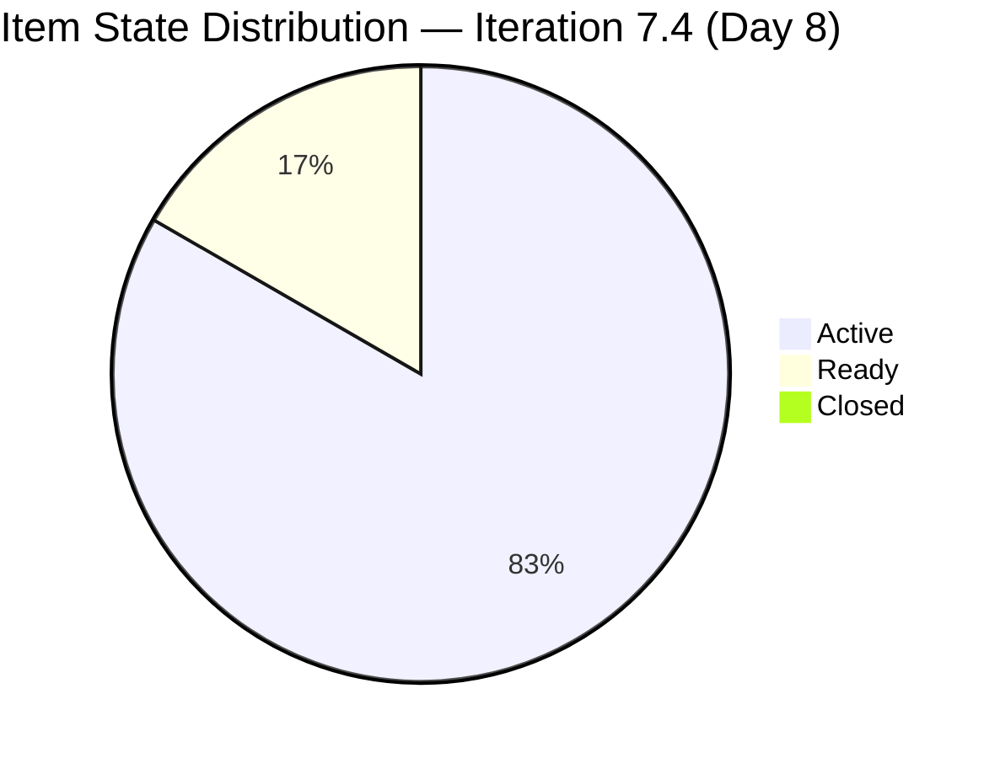
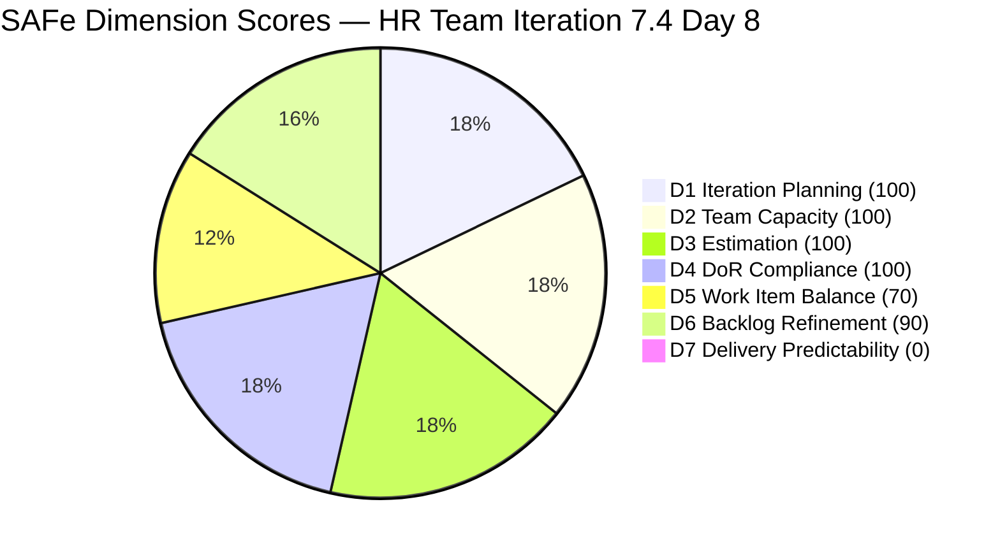
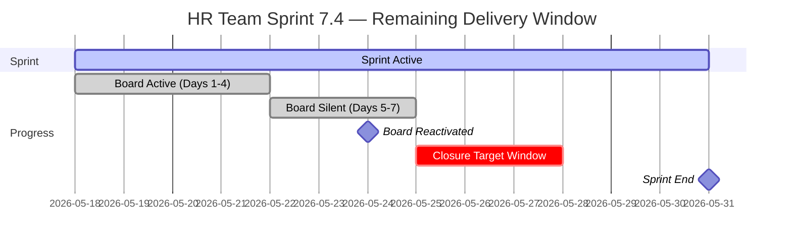

# HR Recruitment Team — SAFe Iteration Audit #70

**Audit Date:** 2026-05-25 09:00 PHT
**Auditor:** Claude Code (SAFe PM Consultant)
**Workspace:** `ado_hr`
**ADO Board:** [HR Recruitment Team](https://dev.azure.com/jairo/Jairosoft%20FINOPS/_boards/board/t/Human%20Resource%20Recruitment%20Team/Stories%20and%20Deliverables)

---

## 1. Audit Metadata

| Field | Value |
|-------|-------|
| Audit Number | #70 |
| Audit Date | 2026-05-25 |
| Audit Time | 09:00 PHT |
| Iteration | 7.4 |
| Iteration Dates | May 18 – May 31, 2026 |
| Sprint Day | Day 8 of 14 |
| ADO Project | Jairosoft FINOPS (`e0bb302f-40f9-46c3-8164-6f1acb317d63`) |
| ADO Team | Human Resource Recruitment Team (`248f59a6-372c-4b74-8129-9eaf260f211e`) |
| Iteration ID | `c50c3955-60cb-431b-a619-5f7d2cd02138` |
| Prior Audit | AUDIT_20260524_0904.md (Score: 78.6 — Moderate Risk) |
| **Overall Score** | **80.0 / 100** |
| **Risk Band** | **Low Risk** |

---

## 2. Executive Summary

Iteration 7.4, **Day 8 of 14**. Today's audit records the first meaningful board activity since May 21: **three previously stalled Ready items were activated**, and the board shows five total updates on May 24. Items #203825, #203535, and #202104 all moved from Ready to Active, and the Incentives Spike (#203629) was also updated. This activation surge eliminates three of the four untouched items tracked in prior audits, dropping the D6 untouched penalty from −20 to −10.

The result: the overall score climbs from **78.6 to 80.0 / 100**, crossing the Moderate/Low boundary for the first time this sprint. D6 improves from 80.0 to **90.0**. All other dimensions hold at their prior values.

Despite this positive signal, delivery remains at zero (D7 = 0). With Day 8 beginning and 6 working days remaining, the sprint is at a critical juncture: the board is now active, the team capacity is aligned, and all items are assigned — but no SP have been closed. First closures are now genuinely urgent.

**Overall Score: 80.0 / 100 — Low Risk**

---

## 3. Previous Audit Delta

| Metric | 2026-05-24 (Audit #69) | 2026-05-25 (Audit #70) | Change |
|--------|------------------------|------------------------|--------|
| Sprint Day | Day 7 (Midpoint) | Day 8 | +1 |
| Items in Iteration | 6 | 6 | 0 |
| Items Active | 2 (#204252, #203629) | **5** (#203825, #203535, #202104, #203629, #204252 — see note) | **+3** |
| Items Ready | 4 | **1** (#202349) | **−3** |
| Items Closed | 0 | 0 | 0 |
| Story Points Committed | 13 SP | 13 SP | 0 |
| SP Closed | 0 | 0 | 0 |
| Untouched items (pre-sprint) | 4/6 (66.7%) | **1/6 (16.7%)** | **−3** |
| D6 — Backlog Refinement | 80.0 | **90.0** | **+10.0** |
| D7 — Delivery Predictability | 0.0 | 0.0 | 0 |
| Overall Score | 78.6 | **80.0** | **+1.4** |
| Risk Band | Moderate Risk | **Low Risk** | **↑ Improved** |

> **Note on #204252 state:** Item #204252 (APE Consultation, Enabler) shows State = Active with ChangedDate = 2026-05-21. It was already Active in Audit #69 and has not changed today. The five Active items include the three newly activated ones plus the two that were already Active.

### Notable Changes (Day 8)

**Board activation burst on May 24:**

| ID | Title | Type | Previous State | New State | Updated |
|----|-------|------|---------------|-----------|---------|
| 203825 | Client Interview \| Sr. Tech Lead | User Story | Ready | **Active** | May 24 17:25 |
| 203535 | APE - Caumban, Karl Jordan | User Story | Ready | **Active** | May 24 17:25 |
| 202104 | APE - Rommel Senillo | User Story | Ready | **Active** | May 24 17:26 |
| 203629 | HR Discussion on Incentives | Spike | Active | Active | May 24 17:27 (updated) |

- **#202349** (Finance Reporting & Export) remains in **Ready** state with ChangedDate May 17 — now the sole untouched item.
- **#204252** (APE Consultation) remains Active, last changed May 21 — 4 days without update.
- No item closures yet. D7 remains at 0.

---

## 4. Current Iteration Snapshot

**Iteration 7.4** · May 18 – May 31, 2026 · **Day 8 of 14**

| Field | Value |
|-------|-------|
| Total Visible Root Backlog Items | 6 |
| Items in Iteration 7.4 | 6 |
| User Stories | 4 (66.7%) |
| Spikes | 1 (16.7%) |
| Enablers | 1 (16.7%) |
| Total SP Committed | 13 SP |
| Items Active | 5 (#203825, #203535, #202104, #203629, #204252) |
| Items Ready | 1 (#202349) |
| Items Closed | 0 |
| SP Burned | 0 SP |
| % Complete (Items) | 0% |
| % Complete (SP) | 0% |
| Days Remaining | 6 working days |

### Capacity (Iteration 7.4)

| Member | Activity | Pts/Day | Days Off | Notes |
|--------|----------|---------|----------|-------|
| Almera Kleer Tayao | Documentation (3) + Requirements (2) | 5.25 | May 18–20 (taken) | Sole active contributor |
| grace | Documentation | 0.25 | None | Supplemental only |

**Committed vs. Remaining Capacity:** 13 SP committed / ~5.25 pts/day × 6 remaining days ≈ 31.5 SP remaining capacity. Sprint is lightly loaded and deliverable in the second half.

---

## 5. Work Item Analysis

| ID | Title | Type | State | SP | Assignee | Last Changed | DoR |
|----|-------|------|-------|-----|----------|-------------|-----|
| 203825 | Client Interview \| Sr. Tech Lead - Maraon, Belleo | User Story | Active | 2 | Almera | May 24 | Pass |
| 203535 | APE - Caumban, Karl Jordan (Sprint 7.3) | User Story | Active | 2 | Almera | May 24 | Pass |
| 202104 | APE - Rommel Senillo - Summary - PI7 | User Story | Active | 2 | Almera | May 24 | Pass |
| 202349 | Finance Reporting & Export | User Story | Ready | 2 | Almera | May 17 | Pass |
| 203629 | HR Discussion on Employees Incentives, Scaling of Bonuses | Spike | Active | 3 | Almera | May 24 | Pass |
| 204252 | Cebu Employees 1-on-1 APE Consultation with Doc Karl | Enabler | Active | 2 | Almera | May 21 | Pass |

**Item type breakdown:** User Story = 4, Spike = 1, Enabler = 1
**All items assigned to Almera** — bus factor = 1 (structural, unchanged)
**All items have SP** (6/6 = 100%)
**All items pass DoR** (6/6 = 100%)

### Untouched Items (ChangedDate before sprint start May 18)

| ID | Title | Last Changed | Days Stale |
|----|-------|-------------|-----------|
| 202349 | Finance Reporting & Export | May 17 | 8 days |

Only 1 of 6 items (16.7%) last touched before sprint start — down from 4/6 (66.7%) in Audit #69. This drops the D6 untouched penalty from −20 to −10 (16.7% > 10%, < 30%).

### Active Item Status

| ID | Title | Days Active (no close) | Risk |
|----|-------|----------------------|------|
| #203825 | Client Interview - Maraon, Belleo | Activated today | Normal |
| #203535 | APE - Caumban, Karl Jordan | Activated today | Normal |
| #202104 | APE - Rommel Senillo | Activated today | Normal |
| #203629 | Incentives Spike | Active since sprint start; updated May 24 | Moderate |
| #204252 | APE Consultation with Doc Karl | Active since sprint start; last updated May 21 | **High** — 4 days silent |

---

## 6. SAFe Compliance Scorecard

| Dimension | Score | Evidence | Notes |
|-----------|-------|----------|-------|
| D1 — Iteration Planning | 100.0 | 6/6 visible root items in Iter 7.4 | All backlog items committed to current sprint |
| D2 — Team Capacity | 100.0 | 1/1 active contributor with configured capacity | Almera: 5.25 pts/day; grace: 0.25 pts/day (supplemental) |
| D3 — Estimation | 100.0 | 6/6 items have Story Points > 0 | Total 13 SP; all items estimated |
| D4 — DoR Compliance | 100.0 | 6/6 pass description ≥30 chars + AC ≥20 chars | All items have substantive descriptions and multi-point acceptance criteria |
| D5 — Work Item Balance | 70.0 | User Story present (+); dominant = 4/6 = 66.7% > 60% (−30) | Spike 16.7%, Enabler 16.7%; no spike-share or absence penalties |
| D6 — Backlog Refinement | 90.0 | 6/6 fresh (base 100); 1/6 untouched = 16.7% (>10% → −10) | Improvement: 3 items activated May 24; only #202349 remains untouched |
| D7 — Delivery Predictability | 0.0 | 0/13 SP closed; Day 8 of 14 | No closures through Day 8; D7 full penalty |

**Overall Score: (100 + 100 + 100 + 100 + 70 + 90 + 0) / 7 = 560 / 7 = 80.0 / 100 — Low Risk**

---

## 7. Dimension Findings

### D1 — Iteration Planning (100.0) ✅
All 6 visible root backlog items are assigned to Iteration 7.4. Perfect planning coverage maintained for the entire sprint. At 13 SP against ~31.5 SP remaining capacity, the sprint is lightly loaded but still achievable. No planning changes since prior audit.

### D2 — Team Capacity (100.0) ✅
Almera's capacity (5.25 pts/day) and Grace's supplemental capacity (0.25 pts/day) are both configured. The 3 days off May 18–20 have passed and are no longer relevant to remaining capacity calculations. Structural bus factor = 1 risk is unchanged.

### D3 — Estimation (100.0) ✅
All 6 items are estimated at 2–3 SP. 100% estimation maintained. No changes.

### D4 — DoR Compliance (100.0) ✅
All 6 items retain substantive descriptions (>30 non-whitespace chars) and acceptance criteria (>20 non-whitespace chars). Verified from field data. No changes.

### D5 — Work Item Balance (70.0) ⚠️
User Story dominance at 66.7% (4/6) continues to exceed the 60% threshold → −30 penalty. No item type changes this sprint. The score is structurally fixed at 70 unless an item is reclassified or a non-User-Story item is added. Given 6 remaining days, this is unlikely to change.

### D6 — Backlog Refinement (90.0) ✅
**Significant improvement from prior audit (80.0 → 90.0).** The activation of #203825, #203535, and #202104 on May 24 reduced the untouched ratio from 66.7% to 16.7% (1/6). The remaining untouched penalty (−10) comes solely from #202349 (Finance Reporting & Export, last changed May 17). Activating this single item would eliminate the penalty entirely, bringing D6 to 100 and the overall score to 81.4.

### D7 — Delivery Predictability (0.0) 🔴
**Day 8 of 14 with zero deliveries.** While the board activation on May 24 is a positive signal, no items have been closed. The five Active items should be progressing toward completion. With 13 SP committed and 6 working days remaining:
- Almera's remaining capacity: ~31.5 SP — more than sufficient to deliver all 13 SP
- The three newly activated APE items (#203825, #203535, #202104) are evaluation coordination tasks — if consultations are complete, these should be closable today
- #204252 (APE Consultation with Doc Karl) has been silent since May 21 — completion should be verified

**D7 recovery scenarios (from current state):**

| Closed SP | D7 Score | Overall Score | Risk Band |
|-----------|----------|---------------|-----------|
| 0 SP (current) | 0.0 | 80.0 | Low |
| 2 SP (1 item) | 15.4 | 82.2 | **Low** |
| 4 SP (2 items) | 30.8 | 84.4 | **Low** |
| 7 SP (3 items) | 53.8 | 87.7 | **Low** |
| 13 SP (all) | 100.0 | 95.7 | **Low** |

Any closure improves D7 and the score. Full delivery would reach 95.7.

---

## 8. Risks and Bottlenecks

| Risk | Severity | Status |
|------|----------|--------|
| 0 items closed through Day 8 | **Critical** | 8 days into sprint, no SP delivered; second half must deliver all 13 SP |
| #204252 (APE Consultation) silent since May 21 | **High** | 4-day activity gap; if consultation is done, close immediately |
| No iteration goal defined | High | Unresolved — 16th consecutive audit with this gap |
| No PI objectives linked to items | High | Recurring structural gap since PI6 |
| Bus factor = 1 (Almera) | High | Structural — all 6 items assigned to sole contributor |
| #202349 (Finance Reporting) remains in Ready state | Moderate | Only remaining untouched item; activating resolves D6 −10 penalty → D6 = 100 |
| #203535 title references "Sprint 7.3" | Low | Cosmetic — item content is valid for 7.4 |

---

## 9. Prioritized Recommendations

1. **Close APE-related items today (May 25, Day 8)** — Items #203825 (Client Interview - Maraon, Belleo), #202104 (APE - Rommel Senillo), and #203535 (APE - Caumban, Karl Jordan) are all now Active. If the APE evaluations have been conducted (i.e., forms prepared, assessments completed, results discussed with employees), close these items. Three closures = 6 SP = D7 of 46.2% → overall score of 86.6.

2. **Verify and close #204252 (APE Consultation with Doc Karl)** — Last updated May 21. This item (1-on-1 medical result reading sessions for Cebu employees) has been Active for 7 days with no ADO activity since Day 4. If the consultations are complete, close this item immediately (2 SP). If not, add a comment explaining current status.

3. **Activate #202349 (Finance Reporting & Export)** — This is the last remaining Ready item and the only untouched item (last changed May 17). Moving it to Active eliminates the D6 −10 penalty, bringing D6 to 100 and the overall score to 81.4. Cost: 2 minutes.

4. **Update #203629 (Incentives Spike) with progress** — The spike requires a research summary, scaling matrix, stakeholder feedback, and defined next steps (per AC). A comment documenting current research progress would satisfy SAFe daily transparency standards and confirm this item is on track for closure.

5. **Define a sprint iteration goal** — At Day 8 with 6 days remaining, adding a formal sprint goal (e.g., "Complete Cebu APE consultation cycle and establish PI7 incentive scaling framework") would resolve this 16-audit-old gap and improve D1 quality context.

6. **Second-half closure sequence (Days 8–14):**
   - Days 8–9: Close #204252 + #202104 + #203535 (APE evaluations + consultation)
   - Days 10–11: Close #203825 (Client Interview) + #203629 (Incentives Spike)
   - Days 12–14: Close #202349 (Finance Reporting)
   - This yields full 13/13 SP delivery and D7 = 100, overall = 95.7

---

## 10. Evidence Gaps and Limitations

| Gap | Impact | Notes |
|-----|--------|-------|
| No iteration goal visible in ADO | D1 quality not measurable | 16th consecutive audit with this gap |
| No PI objectives linked to items | D1/D7 context incomplete | Recurring since PI6 |
| #204252 silent since May 21 | D7 urgency elevated | Cannot confirm from ADO whether consultation is complete |
| Task #203605 (Complete Claude CPN 4 Courses) visible in iteration view | Not counted | Type = Task; excluded from Stories and Deliverables rubric |
| Task-level breakdown not assessed | Scope depth unknown | Rubric assesses root items only |

---

## Visualization

> D7 shown as 1 for chart visibility; actual score = 0.

### Score Trend (Last 8 Audits — Iteration 7.4)

| Date | Audit | Score | Band | Notable |
|------|-------|-------|------|---------|
| May 18 | #63 | 78.6 | Moderate | Day 1 — early sprint |
| May 19 | #64 | 78.6 | Moderate | Early sprint |
| May 20 | #65 | 78.6 | Moderate | Early sprint |
| May 21 | #66 | 78.6 | Moderate | Early sprint |
| May 22 | #67 | 78.6 | Moderate | Early sprint (last day) |
| May 23 | #68 | 78.6 | Moderate | Full D7 penalty |
| May 24 | #69 | 78.6 | Moderate | Full D7 penalty — midpoint |
| **May 25** | **#70** | **80.0** | **Low Risk** | **3 items activated — D6 +10** |

The score crossed 80.0 today for the first time this sprint, driven by the D6 improvement from board reactivation. The milestone now is first closures — which can happen today given five Active items and known-completed APE work.

---

*Audit generated by Claude Code (claude-sonnet-4-6) on 2026-05-25. Evidence sourced from Azure DevOps MCP (Jairosoft FINOPS project). Rubric: SAFe 6.0 7-dimension scorecard.*
