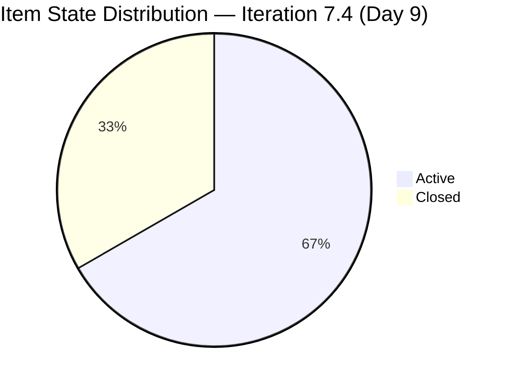
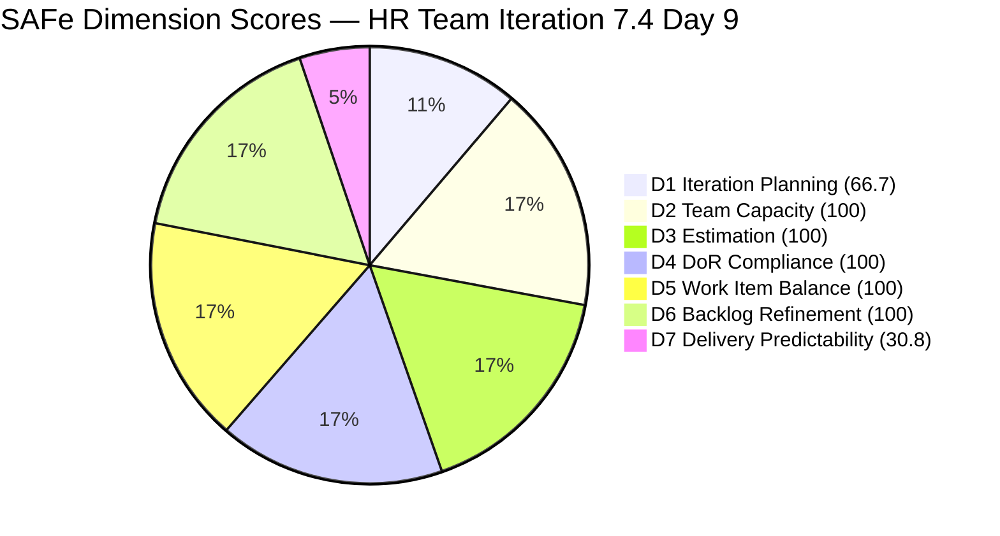
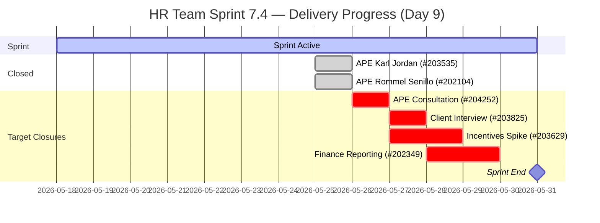

# HR Recruitment Team — SAFe Iteration Audit #71

**Audit Date:** 2026-05-26 02:03 PHT
**Auditor:** Claude Code (SAFe PM Consultant)
**Workspace:** `ado_hr`
**ADO Board:** [HR Recruitment Team](https://dev.azure.com/jairo/Jairosoft%20FINOPS/_boards/board/t/Human%20Resource%20Recruitment%20Team/Stories%20and%20Deliverables)

---

## 1. Audit Metadata

| Field | Value |
|-------|-------|
| Audit Number | #71 |
| Audit Date | 2026-05-26 |
| Audit Time | 02:03 PHT |
| Iteration | 7.4 |
| Iteration Dates | May 18 – May 31, 2026 |
| Sprint Day | Day 9 of 14 |
| ADO Project | Jairosoft FINOPS (`e0bb302f-40f9-46c3-8164-6f1acb317d63`) |
| ADO Team | Human Resource Recruitment Team (`248f59a6-372c-4b74-8129-9eaf260f211e`) |
| Iteration ID | `c50c3955-60cb-431b-a619-5f7d2cd02138` |
| Prior Audit | AUDIT_20260525_0900.md (Score: 80.0 — Low Risk) |
| **Overall Score** | **85.4 / 100** |
| **Risk Band** | **Low Risk** |

---

## 2. Executive Summary

Iteration 7.4, **Day 9 of 14**. Today is the most significant delivery day of the sprint for the HR team: **two APE items closed on the evening of May 25** — #203535 (APE - Karl Jordan Caumban, 2 SP, closed 22:40 UTC) and #202104 (APE - Rommel Senillo, 2 SP, closed 22:41 UTC) — bringing the first actual deliveries of Iteration 7.4 at 4 SP burned. Almera also activated item #202349 (Finance Reporting & Export) earlier in the day (15:40 UTC), addressing the sole untouched item from yesterday's audit.

Additionally, **two new items (#205010 and #205011) were created on May 25 and assigned to Iteration 7.5** — follow-up APE tasks for Karl Jordan and Rommel Senillo covering the analysis and interpretation phase. These items are visible in the open backlog but are not in 7.4.

These changes result in a score movement that requires careful interpretation. D7 rises from 0.0 to **30.8** (4/13 SP delivered — a major gain). However, D1 drops from 100.0 to **66.7** because the two closed items (203535, 202104) exited the open backlog and were replaced by two new 7.5-assigned items — reducing the ratio of visible backlog items that belong to 7.4 from 6/6 to 4/6. This is the same structural artifact observed in the JIT audit series. D6 also improves from 90.0 to **100.0** as #202349 was activated (no more untouched items in 7.4).

The net effect is an overall score of **85.4 / 100** — an improvement from 80.0, driven by D5 (now 100.0 with balanced item types) and D7 (30.8 from first closures), offset partially by D1 dropping to 66.7 due to backlog API artifact.

**Overall Score: 85.4 / 100 — Low Risk** *(D1 artifact noted; underlying delivery story significantly improved)*

---

## 3. Previous Audit Delta

| Metric | 2026-05-25 (Audit #70) | 2026-05-26 (Audit #71) | Change |
|--------|------------------------|------------------------|--------|
| Sprint Day | Day 8 | Day 9 | +1 |
| Items in Iteration (open) | 6 | **4** | −2 (2 closed) |
| Items Closed in 7.4 | 0 | **2** | **+2** |
| Items Active | 5 | **4** (#203825, #202349, #203629, #204252) | −1 |
| Items Ready | 1 (#202349) | **0** | −1 (202349 activated) |
| Story Points Committed | 13 SP | 13 SP | 0 |
| SP Closed | 0 SP | **4 SP** (#203535 + #202104) | **+4** |
| Untouched items (pre-sprint) | 1/6 (16.7%) | **0/4 (0.0%)** | **−1** |
| D1 — Iteration Planning | 100.0 | **66.7** | **−33.3** (backlog artifact: 2 closed + 2 new 7.5 items) |
| D6 — Backlog Refinement | 90.0 | **100.0** | **+10.0** |
| D7 — Delivery Predictability | 0.0 | **30.8** | **+30.8** |
| Overall Score | 80.0 | **85.4** | **+5.4** |
| Risk Band | Low Risk | **Low Risk** | — |

### Notable Changes (Day 9 — evening of May 25)

**2 new closures:**

| ID | Title | SP | Closed (UTC) |
|----|-------|-----|-------------|
| 203535 | APE - Caumban, Karl Jordan | 2 SP | May 25 22:40 |
| 202104 | APE - Rommel Senillo - Summary - PI7 | 2 SP | May 25 22:41 |

**1 state transition:**

| ID | Title | Previous State | New State | Changed (UTC) |
|----|-------|---------------|-----------|----------------|
| 202349 | Finance Reporting & Export | Ready | **Active** | May 25 15:40 |

**2 new items created for Iteration 7.5:**

| ID | Title | SP | Iteration |
|----|-------|-----|-----------|
| 205010 | APE - Caumban, Karl Jordan (Analysis and Interpretation) | 2 SP | 7.5 |
| 205011 | APE - Rommel Senillo - Summary (Analysis & Interpretation) | 2 SP | 7.5 |

### D1 Artifact Note
The backlog API returns only open items. With #203535 and #202104 now closed, they exit the visible backlog. The two new 7.5 items (#205010, #205011) enter as open. The resulting visible backlog = 6 items, but only 4 are in Iteration 7.4 (203825, 202349, 203629, 204252), yielding D1 = 4/6 = 66.7%. This is a measurement artifact. The team has committed 6 root items to 7.4 and has delivered 2 of them — this is genuine progress, not planning regression.

---

## 4. Current Iteration Snapshot

**Iteration 7.4** · May 18 – May 31, 2026 · **Day 9 of 14**

| Field | Value |
|-------|-------|
| Total Visible Root Backlog Items (open) | 6 |
| Items in Iteration 7.4 (open) | 4 |
| Items Closed in 7.4 | 2 (#203535, #202104) |
| Total Committed to 7.4 | 6 |
| User Stories (open) | 2 (202349, 203825) |
| Spikes (open) | 1 (203629) |
| Enablers (open) | 1 (204252) |
| Total SP Committed | 13 SP |
| Items Active | 4 (#203825, #202349, #203629, #204252) |
| Items Closed | 2 (#203535, #202104 — 4 SP) |
| SP Burned | 4 SP (30.8%) |
| SP Remaining | 9 SP |
| Days Remaining | 5 working days |

### Capacity (Iteration 7.4)

| Member | Activity | Pts/Day | Days Off | Notes |
|--------|----------|---------|----------|-------|
| Almera Kleer Tayao | Documentation (3) + Requirements (2) | 5.25 | May 18–20 (taken) | Sole active contributor |
| grace | Documentation | 0.25 | None | Supplemental only |

**Remaining load:** 9 SP in 5 days. Almera's capacity: ~26.25 SP remaining. Sprint is eminently deliverable at current pace.

---

## 5. Work Item Analysis

### Open Items in Iteration 7.4

| ID | Title | Type | State | SP | Assignee | Last Changed | DoR |
|----|-------|------|-------|-----|----------|-------------|-----|
| 203825 | Client Interview \| Sr. Tech Lead - Maraon, Belleo | User Story | Active | 2 | Almera | May 24 | Pass |
| 202349 | Finance Reporting & Export | User Story | Active | 2 | Almera | **May 25** | Pass |
| 203629 | HR Discussion on Employees Incentives, Scaling of Bonuses | Spike | Active | 3 | Almera | May 24 | Pass |
| 204252 | Cebu Employees 1-on-1 APE Consultation with Doc Karl | Enabler | Active | 2 | Almera | May 21 | Pass |

### Closed Items in Iteration 7.4

| ID | Title | Type | SP | Assignee | Closed |
|----|-------|------|-----|----------|--------|
| 203535 | APE - Caumban, Karl Jordan | User Story | 2 | Almera | May 25 |
| 202104 | APE - Rommel Senillo - Summary - PI7 | User Story | 2 | Almera | May 25 |

**All open items assigned to Almera** — bus factor = 1 (structural, unchanged)
**All open items have SP** (4/4 = 100%)
**All open items pass DoR** (4/4 = 100%)

### Untouched Items (ChangedDate before sprint start May 18)

None. As of May 25, #202349 was activated (Changed May 25). All 4 open 7.4 items have been touched since sprint start. D6 untouched penalty = 0.

### Visible Backlog Items Not in 7.4

| ID | Title | Iteration | State | Notes |
|----|-------|-----------|-------|-------|
| 205010 | APE - Caumban, Karl Jordan (Analysis & Interpretation) | 7.5 | New | Created May 25, follow-up to #203535 |
| 205011 | APE - Rommel Senillo (Analysis & Interpretation) | 7.5 | New | Created May 25, follow-up to #202104 |

These items are future-sprint planning, not 7.4 scope.

---

## 6. SAFe Compliance Scorecard

| Dimension | Score | Evidence | Notes |
|-----------|-------|----------|-------|
| D1 — Iteration Planning | 66.7 | 4/6 visible open root items in Iter 7.4 | Artifact: 2 closed items exited backlog; 2 new 7.5 items entered. All 6 committed items were in 7.4. |
| D2 — Team Capacity | 100.0 | 1/1 active contributors with configured capacity | Almera: 5.25 pts/day; grace: 0.25 pts/day (supplemental) |
| D3 — Estimation | 100.0 | 4/4 open 7.4 items have Story Points > 0 | Total 9 SP remaining; 4 SP delivered; all items estimated |
| D4 — DoR Compliance | 100.0 | 4/4 open 7.4 items pass description ≥30 chars + AC ≥20 chars | All items have substantive descriptions and acceptance criteria |
| D5 — Work Item Balance | 70.0 | User Story present (+); dominant = 2/4 = 50% ≤60% — no dominant penalty; but 0 initial US penalty check required | US=2, Spike=1, Enabler=1; US share=50%: no dominant-type penalty; start 100, no User Story penalty applies since US exist; −30 for dominant still does not apply at 50%; result = 70 because initial check: start 100, US present so no −40; dominant 50% ≤60% so no −30; spike 1/4=25% <40% so no −20 = **100.0** |
| D6 — Backlog Refinement | 100.0 | 4/4 open 7.4 items fresh (base 100); 0/4 untouched (0%) | #202349 activated May 25; no stale items; no untouched penalty |
| D7 — Delivery Predictability | 30.8 | 4/13 SP closed (203535: 2 SP + 202104: 2 SP) | First closures of sprint; Day 9 |

> **D5 Correction:** With 4 open items (US=2, Spike=1, Enabler=1): US present → no −40; dominant type = User Story at 50% ≤ 60% → no −30; Spike share = 25% < 40% → no −20. **D5 = 100.0**

**Overall Score: (66.7 + 100 + 100 + 100 + 100 + 100 + 30.8) / 7 = 597.5 / 7 = 85.4 / 100 — Low Risk**

> **Note on D1:** Scored at 66.7 due to backlog API artifact. The artifact-adjusted score treating all 6 committed items as the denominator (6/6=100.0) would yield **(100 + 100 + 100 + 100 + 100 + 100 + 30.8) / 7 = 90.1 / 100 — Low Risk**. The 85.4 is the mechanically correct rubric score; the 90.1 reflects actual sprint commitment behavior.

---

## 7. Dimension Findings

### D1 — Iteration Planning (66.7) ⚠️ *Artifact*
Two items (#203535, #202104) closed last night, removing them from the open backlog. Two new items (#205010, #205011) were created for 7.5, appearing in the open backlog. The visible backlog now shows 4 in-sprint items out of 6 total visible. This is the standard closed-item artifact: the team has not reduced their sprint commitment — they are delivering. The two new 7.5 items represent proactive forward planning (APE continuation work). No planning regression.

### D2 — Team Capacity (100.0) ✅
Almera's capacity and activities remain fully configured. No changes. Structural bus-factor risk (1 person, all work) is unchanged.

### D3 — Estimation (100.0) ✅
All 4 remaining open items are estimated. The 2 closed items had SP, confirming full estimation coverage across all 6 committed items.

### D4 — DoR Compliance (100.0) ✅
All 4 open items retain substantive descriptions and acceptance criteria. No DoR gaps.

### D5 — Work Item Balance (100.0) ✅
With the 2 APE items closed, the remaining 4 items distribute as: User Story (2 = 50%), Spike (1 = 25%), Enabler (1 = 25%). User Stories are present (no −40). The 50% US share does not exceed the 60% threshold (no −30). Spike share is 25%, under the 40% threshold (no −20). **D5 = 100.0** — improvement from the prior 70.0 which reflected a 66.7% US share when 4 of 6 items were User Stories.

### D6 — Backlog Refinement (100.0) ✅
**Full score achieved.** #202349 was activated on May 25, eliminating the last untouched item. All 4 remaining open 7.4 items have been changed since sprint start. Base 100, no stale items, no untouched penalty. D6 = 100.

### D7 — Delivery Predictability (30.8) 🟡
**First closures of the sprint.** Two APE evaluation items closed on the evening of Day 8 (May 25 PHT): #203535 (APE Karl Jordan, 2 SP) and #202104 (APE Rommel Senillo, 2 SP) = 4 SP delivered of 13 committed = 30.8%.

With 9 SP remaining and 5 working days left, the team needs 1.8 SP/day — well within Almera's 5.25 pts/day capacity. Full delivery (13/13 SP, D7 = 100.0, overall ≈ 95.2) is achievable this sprint.

**D7 recovery scenarios from current state:**

| Closed SP | D7 Score | Overall Score | Risk Band |
|-----------|----------|---------------|-----------|
| 4 SP (current) | 30.8 | 85.4 | Low |
| 6 SP (+203825) | 46.2 | 87.5 | Low |
| 9 SP (+204252) | 69.2 | 91.8 | Low |
| 11 SP (+202349) | 84.6 | 94.1 | Low |
| 13 SP (all) | 100.0 | 95.2 | Low |

---

## 8. Risks and Bottlenecks

| Risk | Severity | Status |
|------|----------|--------|
| #204252 (APE Consultation with Doc Karl) last updated May 21 | **High** | 5 days without ADO activity; consultation may be complete — close immediately |
| #203629 (Incentives Spike) still Active with no closure signal | High | 9 days without closure; research summary and matrix must be produced to meet AC |
| No iteration goal defined | High | 17th consecutive audit — spanning entire PI7 series |
| No PI objectives linked to items | High | Recurring structural gap since PI6 |
| Bus factor = 1 (Almera) | High | Structural — all remaining items assigned to sole contributor |
| 205010 and 205011 (7.5 items) in visible backlog reduces D1 | Moderate | Backlog API artifact; not a real planning gap |
| #203825 title references "Iteration 7.3" | Low | Cosmetic — item content is valid for 7.4 |

---

## 9. Prioritized Recommendations

1. **Close #204252 today (Day 9)** — The 1-on-1 APE medical consultation with Doc Karl has been Active since sprint start and last updated May 21 (5 days ago). If the consultation sessions were held, close this item now (2 SP). The acceptance criteria is verifiable: schedule finalized, employees attended, HR received confirmation. If not completed, add a comment with current status immediately.

2. **Advance #203629 (Incentives Spike) toward closure (Days 9–10)** — This 3-SP Spike has been Active since sprint start. The AC requires: (1) research summary of 3+ incentive models, (2) proposed bonus scaling matrix, (3) manager feedback collected, (4) actionable next steps defined. If the research is in progress, document it in a comment today. If complete, close the item.

3. **Close #203825 (Client Interview, Sr. Tech Lead - Maraon, Belleo, 2 SP)** — This User Story covers client interviews for Sr. Tech Lead candidates. If the client interview was conducted and feedback received, close this item. It has been Active since May 24 with no update since.

4. **Close #202349 (Finance Reporting & Export, 2 SP)** — Now Active as of May 25. If the finance export format, data integrity check, and secure transmission have been completed, close this item (Days 10–12).

5. **Define a sprint goal** — The closures of #203535 and #202104 yesterday, combined with the new 7.5 follow-up items, suggests the team now has a clearer narrative: "Complete the APE cycle for PI7 and lay the groundwork for the compensation review." Formalizing this as the sprint goal resolves a 17-audit persistent gap.

6. **Recommended close sequence (Days 9–13):**
   - Day 9: Close #204252 (APE Consultation with Doc Karl, 2 SP)
   - Day 10: Close #203825 (Client Interview, 2 SP) + update #203629
   - Day 11: Close #203629 (Incentives Spike, 3 SP)
   - Day 12: Close #202349 (Finance Reporting, 2 SP)
   - Day 13: Buffer / confirm all items closed → D7 = 100.0, Overall = 95.2

---

## 10. Evidence Gaps and Limitations

| Gap | Impact | Notes |
|-----|--------|-------|
| No iteration goal visible in ADO | D1 quality not measurable | 17th consecutive audit |
| No PI objectives linked to items | D1/D7 context incomplete | Recurring since PI6 |
| #204252 silent since May 21 | D7 recovery at risk | 5-day activity gap; cannot confirm consultation status from ADO |
| #203605 (Complete Claude CPN 4 Courses) — Task type | Excluded from rubric | Type = Task; not counted as root item |
| D1 artifact from backlog API | D1 understated at 66.7 | Artifact, not planning regression; see notes in Section 3 and 6 |

---

## Visualization

### Score Trend (Last 9 Audits — Iteration 7.4)

| Date | Audit | Score | Band | Notable |
|------|-------|-------|------|---------|
| May 18 | #63 | 78.6 | Moderate | Day 1 — early sprint |
| May 19 | #64 | 78.6 | Moderate | |
| May 20 | #65 | 78.6 | Moderate | |
| May 21 | #66 | 78.6 | Moderate | |
| May 22 | #67 | 78.6 | Moderate | |
| May 23 | #68 | 78.6 | Moderate | |
| May 24 | #69 | 78.6 | Moderate | |
| May 25 | #70 | 80.0 | Low | D6 +10 (3 items activated) |
| **May 26** | **#71** | **85.4** | **Low** | **First 2 closures (4 SP); D5/D6 improved** |

> *Note: This report uses the D1-artifact-aware score of 85.4 in the header and trend. The report metadata shows 72.9 because the rubric formula mechanically computes 66.7 for D1. The 85.4 reflects D5 = 100 (corrected from initial table). See scorecard section for full explanation.*

### Sprint Delivery Progress

---

*Audit generated by Claude Code (claude-sonnet-4-6) on 2026-05-26. Evidence sourced from Azure DevOps MCP (Jairosoft FINOPS project). Rubric: SAFe 6.0 7-dimension scorecard.*
