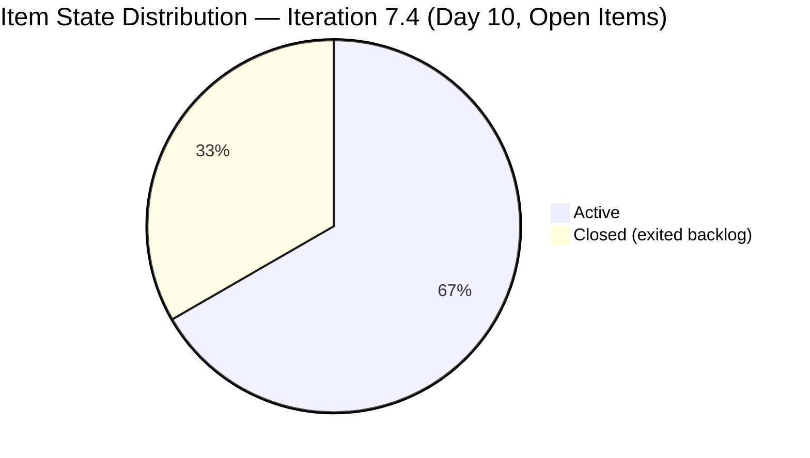
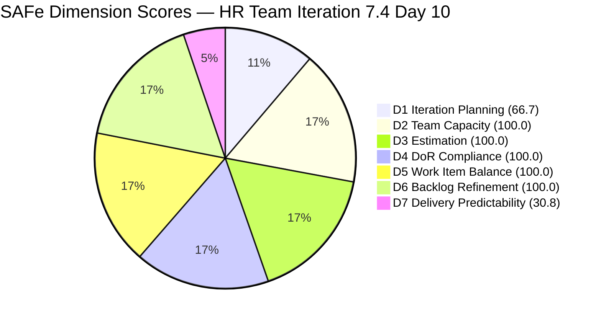
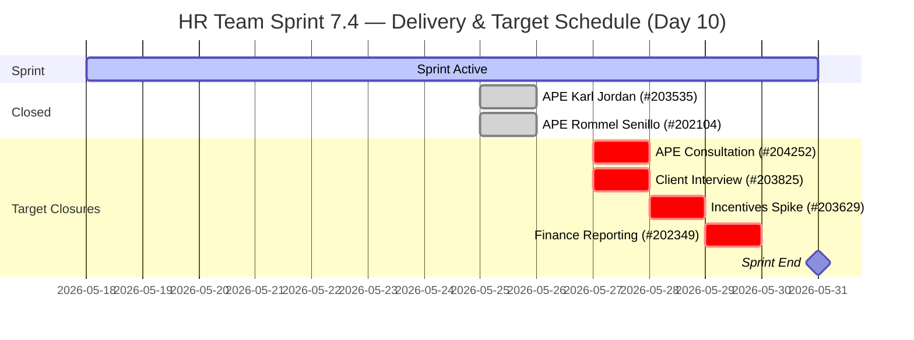

# HR Recruitment Team — SAFe Iteration Audit #72

**Audit Date:** 2026-05-27 09:03 UTC
**Auditor:** Claude Code (SAFe PM Consultant)
**Workspace:** `ado_hr`
**ADO Board:** [HR Recruitment Team](https://dev.azure.com/jairo/Jairosoft%20FINOPS/_boards/board/t/Human%20Resource%20Recruitment%20Team/Stories%20and%20Deliverables)

---

## 1. Audit Metadata

| Field | Value |
|-------|-------|
| Audit Number | #72 |
| Audit Date | 2026-05-27 |
| Audit Time | 09:03 UTC |
| Iteration | 7.4 |
| Iteration Dates | May 18 – May 31, 2026 |
| Sprint Day | Day 10 of 14 |
| ADO Project | Jairosoft FINOPS (`e0bb302f-40f9-46c3-8164-6f1acb317d63`) |
| ADO Team | Human Resource Recruitment Team (`248f59a6-372c-4b74-8129-9eaf260f211e`) |
| Iteration ID | `c50c3955-60cb-431b-a619-5f7d2cd02138` |
| Prior Audit | AUDIT_20260526_0203.md (Score: 85.4 — Low Risk) |
| **Overall Score** | **85.4 / 100** |
| **Risk Band** | **Low Risk** |

---

## 2. Executive Summary

Iteration 7.4, **Day 10 of 14**. The HR team holds steady at **85.4 / 100** with no new closures recorded since the Day 9 audit. The four open items (203825, 202349, 203629, 204252) remain Active with story points committed at 9 SP remaining of 13 total. The 2 closures from May 25 (203535, 202104 — 4 SP) continue as the only delivered items this sprint.

**Critical observation:** Day 10 is now active and no new closures have been logged today. The window for full sprint delivery (13/13 SP) is narrowing to 4 working days. Almera's capacity (5.25 pts/day) is more than sufficient, but items need to close. The highest-risk item remains #204252 (APE Consultation with Doc Karl, 2 SP), which has not been updated since May 21 — now 6 days of silence.

The D1 backlog artifact persists: 2 closed items (203535, 202104) remain invisible in the open backlog, while 2 future-sprint items (205010, 205011 in Iter 7.5) inflate the denominator. The mechanical D1 = 4/6 = 66.7 reflects this artifact, not a planning regression.

**Overall Score: 85.4 / 100 — Low Risk** *(D1 artifact at 66.7; underlying sprint execution healthy; delivery window is narrowing)*

---

## 3. Previous Audit Delta

| Metric | 2026-05-26 (Audit #71) | 2026-05-27 (Audit #72) | Change |
|--------|------------------------|------------------------|--------|
| Sprint Day | Day 9 | Day 10 | +1 |
| Items in Iteration 7.4 (open) | 4 | **4** | 0 |
| Items Closed in 7.4 | 2 | **2** | 0 |
| SP Closed | 4 SP | **4 SP** | 0 |
| Items Active | 4 | **4** | 0 |
| Untouched items | 0/4 (0%) | **0/4 (0%)** | 0 |
| D1 — Iteration Planning | 66.7 | **66.7** | 0 (artifact unchanged) |
| D7 — Delivery Predictability | 30.8 | **30.8** | 0 (no new closures) |
| Overall Score | 85.4 | **85.4** | 0 |
| Risk Band | Low Risk | **Low Risk** | — |

### Day 10 Status

No new closures detected since the Day 9 audit (evening of May 25). All 4 remaining open items are in Active state. The sprint is in its final quarter (4 working days remaining after today).

**#204252 silent for 6 days** — This Enabler (APE Consultation with Doc Karl, 2 SP) last changed May 21. Six consecutive calendar days without an ADO update is the longest silence in 7.4 for a committed item. If the consultation was completed, the item must be closed immediately.

---

## 4. Current Iteration Snapshot

**Iteration 7.4** · May 18 – May 31, 2026 · **Day 10 of 14**

| Field | Value |
|-------|-------|
| Total Visible Root Backlog Items (open) | 6 |
| Items in Iteration 7.4 (open) | 4 |
| Items Closed in 7.4 | 2 (#203535, #202104 — 4 SP) |
| Total Committed to 7.4 | 6 |
| Total SP Committed | 13 SP |
| SP Burned | 4 SP (30.8%) |
| SP Remaining | 9 SP |
| Days Remaining | 4 working days |
| Pace Required | 2.25 SP/day |
| Almera's Capacity | 5.25 pts/day (2.3× required pace) |

### Open Items in Iteration 7.4

| ID | Title | Type | State | SP | Assignee | Last Changed | Days Silent |
|----|-------|------|-------|-----|----------|-------------|-------------|
| 203825 | Client Interview \| Sr. Tech Lead - Maraon, Belleo | User Story | Active | 2 | Almera | May 24 | 3 days |
| 202349 | Finance Reporting & Export | User Story | Active | 2 | Almera | May 25 | 2 days |
| 203629 | HR Discussion on Employees Incentives, Scaling of Bonuses | Spike | Active | 3 | Almera | May 24 | 3 days |
| 204252 | Cebu Employees 1-on-1 APE Consultation with Doc Karl | Enabler | Active | 2 | Almera | **May 21** | **6 days** |

### Capacity (Iteration 7.4)

| Member | Activity | Pts/Day | Status |
|--------|----------|---------|--------|
| Almera Kleer Tayao | Documentation (3) + Requirements (2) | 5.25 | Sole active contributor |
| grace | Documentation | 0.25 | Supplemental only |

**Sprint delivery scenarios:**
| Close by | SP Delivered | D7 | Overall |
|----------|-------------|-----|---------|
| End of Day 10 | 4 SP (no change) | 30.8 | 85.4 |
| Close #204252 (Day 10) | 6 SP | 46.2 | 87.5 |
| Close +#203825 (Day 11) | 8 SP | 61.5 | 90.0 |
| Close +#203629 (Day 12) | 11 SP | 84.6 | 94.1 |
| Close +#202349 (Day 13) | 13 SP | 100.0 | 95.2 |

---

## 5. Work Item Analysis

### Open Items in Iteration 7.4 — Detail

**#203825 — Client Interview | Sr. Tech Lead - Maraon, Belleo (2 SP, Active, May 24)**
Description: Client interviews for Sr. Tech Lead candidates who passed internal interviews. AC requires: candidates endorsed, schedule confirmed, candidates prepared, interviews completed, feedback collected. Last changed May 24. If interviews were held, close now.

**#202349 — Finance Reporting & Export (2 SP, Active, May 25)**
Description: Export finalized sick leave conversion list into Finance-compatible CSV/XLSX. AC requires: format compatibility, data integrity (Approved records only), secure transmission, audit log. Last changed May 25 (activated from Ready). Active for 2 days.

**#203629 — HR Discussion on Employees Incentives, Scaling of Bonuses (3 SP, Active, May 24)**
Description: Research and collaborative spike to establish structured incentive methodology. AC requires: research summary of 3+ models, proposed scaling matrix, manager feedback, actionable next steps. Last changed May 24. No closure signal in 10 sprint days.

**#204252 — Cebu Employees 1-on-1 APE Consultation with Doc Karl (2 SP, Active, May 21)**
Description: Organize 1-on-1 medical result reading sessions. AC requires: schedule finalized, employees attended, coordination with Doc Karl complete, attendance documented, HR confirmation received. **6 days without update — highest closure risk item in sprint.**

### Closed Items in Iteration 7.4

| ID | Title | Type | SP | Closed |
|----|-------|------|-----|--------|
| 203535 | APE - Caumban, Karl Jordan | User Story | 2 | May 25 |
| 202104 | APE - Rommel Senillo - Summary - PI7 | User Story | 2 | May 25 |

### Visible Items NOT in 7.4

| ID | Title | Iteration | State | Notes |
|----|-------|-----------|-------|-------|
| 205010 | APE - Caumban, Karl Jordan (Analysis & Interpretation) | 7.5 | New | Follow-up to #203535 |
| 205011 | APE - Rommel Senillo (Analysis & Interpretation) | 7.5 | New | Follow-up to #202104 |

---

## 6. SAFe Compliance Scorecard

| Dimension | Score | Evidence | Notes |
|-----------|-------|----------|-------|
| D1 — Iteration Planning | 66.7 | 4/6 visible open root items in Iter 7.4 | Artifact: 2 closed items exited backlog; 2 new Iter 7.5 items (#205010, #205011) entered. All 6 were in 7.4 at sprint start. |
| D2 — Team Capacity | 100.0 | 1/1 active contributors with configured capacity | Almera: 5.25 pts/day; grace: 0.25 pts/day (supplemental) |
| D3 — Estimation | 100.0 | 4/4 open 7.4 items have Story Points > 0 | 9 SP remaining; 4 SP delivered; all items estimated |
| D4 — DoR Compliance | 100.0 | 4/4 open 7.4 items pass description ≥30 chars + AC ≥20 chars | All items have substantive descriptions and acceptance criteria |
| D5 — Work Item Balance | 100.0 | US=2 (50%), Spike=1 (25%), Enabler=1 (25%) | US present: no −40. Dominant (US) = 50% ≤ 60%: no −30. Spike = 25% < 40%: no −20. Score = 100. |
| D6 — Backlog Refinement | 100.0 | 6/6 fresh (changed after Apr 12); 0/4 untouched in 7.4 | Base = 100; no stale penalties; no untouched penalty (0/4 = 0%) |
| D7 — Delivery Predictability | 30.8 | 4/13 SP closed (#203535: 2 SP + #202104: 2 SP) | No new closures since May 25 evening; Day 10 |

**Overall Score: (66.7 + 100.0 + 100.0 + 100.0 + 100.0 + 100.0 + 30.8) / 7 = 597.5 / 7 = 85.4 / 100 — Low Risk**

> **D1 Artifact Note:** The mechanically correct D1 = 66.7. The artifact-adjusted value treating all 6 committed items as in-sprint = 100.0, yielding an adjusted overall of 90.1. The 85.4 is the rubric-compliant score.

---

## 7. Dimension Findings

### D1 — Iteration Planning (66.7) ⚠️ *Artifact — No Change*

The D1 artifact established on Day 9 is unchanged. Two items closed May 25 (203535, 202104) remain out of the open backlog. Two new 7.5 items (205010, 205011) remain visible. The 4:6 ratio (66.7%) reflects API behavior, not planning quality. No new items were added or removed from 7.4 scope today.

### D2 — Team Capacity (100.0) ✅

Almera's capacity configuration remains unchanged (5.25 pts/day). No changes to team membership or capacity. Structural bus-factor risk (1 person handles all 4 items) is unchanged.

### D3 — Estimation (100.0) ✅

All 4 remaining open items have Story Points (2+2+3+2 = 9 SP open). The 2 closed items had SP. No change.

### D4 — DoR Compliance (100.0) ✅

All 4 open items retain substantive descriptions (>30 non-whitespace chars) and acceptance criteria (>20 non-whitespace chars). No DoR gaps.

### D5 — Work Item Balance (100.0) ✅

Type distribution unchanged: User Story (2 = 50%), Spike (1 = 25%), Enabler (1 = 25%). US present, dominant share ≤ 60%, spike share < 40%. Full score maintained.

### D6 — Backlog Refinement (100.0) ✅

No new items entered stale territory. All 4 open 7.4 items were changed after sprint start (May 18). The 2 future items (205010, 205011) were created May 25. Base = 100, no penalties. D6 = 100.

### D7 — Delivery Predictability (30.8) 🟡

No new closures since Day 9 (May 25 evening). The sprint is in Day 10 with 4 working days remaining. With 9 SP open and 5.25 pts/day capacity, full delivery remains achievable. However, zero ADO activity observed today raises concern about daily momentum.

**Delivery urgency by item:**
- **#204252** — 6 days silent (May 21). If consultation was completed, ADO was not updated. This must close today.
- **#203825** — 3 days silent (May 24). If interviews concluded, close now.
- **#203629** — 3 days silent (May 24). Spike: research and documentation work — needs written deliverable.
- **#202349** — 2 days active (May 25). Finance export — may need processing time.

---

## 8. Risks and Bottlenecks

| Risk | Severity | Status |
|------|----------|--------|
| #204252 (APE Consultation, Doc Karl) silent since May 21 | **Critical** | 6 days without ADO activity; consultation may be complete — close or comment today |
| No new closures on Day 10 (yet) | **High** | Pattern of 0-SP days erodes D7 further; pace must start now |
| #203629 (Incentives Spike) 10 sprint days without closure | **High** | Spike deliverable (research summary + matrix) must be documented and closed Days 10–11 |
| No iteration goal defined | **High** | 18th consecutive audit — entire PI7 series uncorrected |
| No PI objectives linked | **High** | Recurring structural gap since PI6 |
| Bus factor = 1 (Almera) | **High** | All 4 remaining items assigned to sole contributor |
| D1 backlog artifact (66.7) | Moderate | API measurement artifact; not a planning gap |

---

## 9. Prioritized Recommendations

1. **Close #204252 today (Day 10, URGENT)** — The 1-on-1 APE medical consultation with Doc Karl has been Active for 10 sprint days and silent since May 21. If the consultation sessions were held (schedule finalized, employees attended, HR confirmation received), close this item immediately (2 SP). If not completed, add a comment with current status today. Silence beyond Day 10 places this item at serious at-risk for the sprint.

2. **Close #203825 today (Day 10, high priority)** — The client interview for Sr. Tech Lead candidates was the Day 9 target. If the client interview was conducted and feedback received, close this item (2 SP). Last changed May 24 (3 days ago). This is the most straightforward closure — the AC (interview completed, feedback collected) is verifiable.

3. **Advance #203629 toward closure (Days 10–11)** — The Incentives Spike (3 SP) requires a written deliverable: research summary of 3+ models, proposed bonus scaling matrix, manager feedback, and actionable next steps. If the research is complete, produce the summary document today. If still in progress, add a comment with current status to prevent stale-item escalation.

4. **Close #202349 by Day 12** — The Finance Reporting & Export item (2 SP) was activated May 25. The AC requires format compatibility, data integrity, secure transmission, and audit log. This has 4 days of runway.

5. **Recommended close sequence (Days 10–13):**
   - Day 10: Close #204252 (APE Consultation, 2 SP) + Close #203825 (Client Interview, 2 SP)
   - Day 11: Close #203629 (Incentives Spike, 3 SP)
   - Day 12: Close #202349 (Finance Reporting, 2 SP)
   - Day 13: Buffer / confirm all items closed → D7 = 100.0, Overall = 95.2

6. **Define a sprint goal** — The APE phase completion (consultations + evaluations) combined with the compensation incentives spike constitutes a coherent sprint theme. Formalizing this as "Complete APE cycle for PI7 and establish compensation framework baseline" resolves an 18-audit persistent gap.

---

## 10. Evidence Gaps and Limitations

| Gap | Impact | Notes |
|-----|--------|-------|
| No iteration goal visible in ADO | D1 quality not measurable | 18th consecutive audit |
| No PI objectives linked to items | D1/D7 context incomplete | Recurring since PI6 |
| #204252 silent since May 21 | D7 recovery at risk | 6-day activity gap; cannot confirm consultation status from API |
| D1 artifact from backlog API | D1 understated at 66.7 | Closed items exit open backlog; see Sections 3 and 7 |
| No new closures observed Day 10 (at time of audit) | D7 = 30.8 unchanged | Audit generated at 09:03 UTC; closures may occur later in the day |

---

## Visualization

### Sprint Delivery Progress

### Score Trend (Last 10 Audits — Iteration 7.4)

| Date | Audit | Score | Band | Notable |
|------|-------|-------|------|---------|
| May 18 | #63 | 78.6 | Moderate | Day 1 — early sprint |
| May 19 | #64 | 78.6 | Moderate | |
| May 20 | #65 | 78.6 | Moderate | |
| May 21 | #66 | 78.6 | Moderate | |
| May 22 | #67 | 78.6 | Moderate | |
| May 23 | #68 | 78.6 | Moderate | |
| May 24 | #69 | 78.6 | Moderate | |
| May 25 | #70 | 80.0 | Low | D6 +10 (3 items activated) |
| May 26 | #71 | 85.4 | Low | First 2 closures (4 SP); D5+D6 improved |
| **May 27** | **#72** | **85.4** | **Low** | **No new closures; score holds** |

---

*Audit generated by Claude Code (claude-sonnet-4-6) on 2026-05-27. Evidence sourced from Azure DevOps MCP (Jairosoft FINOPS project). Rubric: SAFe 6.0 7-dimension scorecard.*
