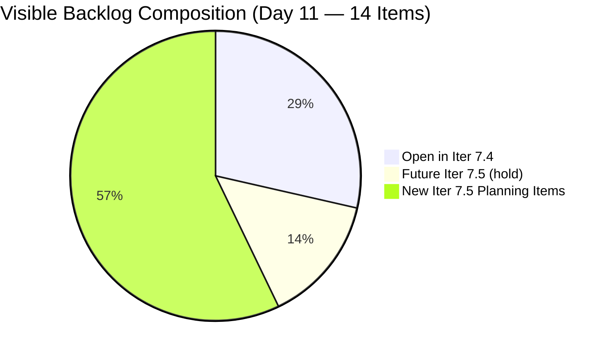
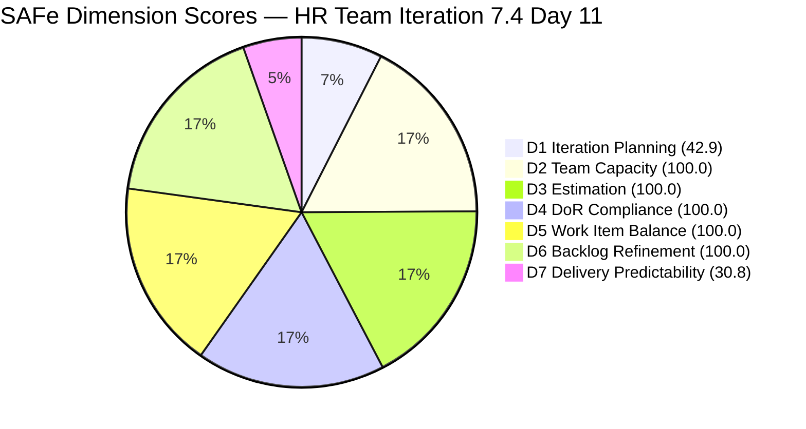
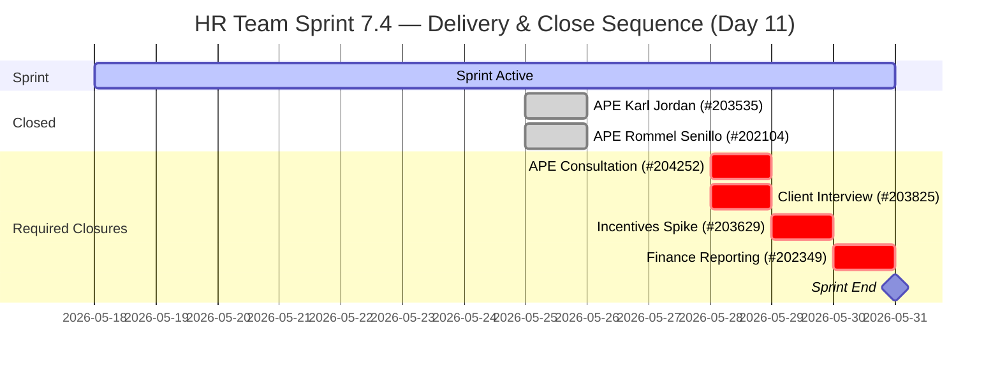

# HR Recruitment Team — SAFe Iteration Audit #73

**Audit Date:** 2026-05-28 02:04 UTC
**Auditor:** Claude Code (SAFe PM Consultant)
**Workspace:** `ado_hr`
**ADO Board:** [HR Recruitment Team](https://dev.azure.com/jairo/Jairosoft%20FINOPS/_boards/board/t/Human%20Resource%20Recruitment%20Team/Stories%20and%20Deliverables)

---

## 1. Audit Metadata

| Field | Value |
|-------|-------|
| Audit Number | #73 |
| Audit Date | 2026-05-28 |
| Audit Time | 02:04 UTC |
| Iteration | 7.4 |
| Iteration Dates | May 18 – May 31, 2026 |
| Sprint Day | Day 11 of 14 |
| ADO Project | Jairosoft FINOPS (`e0bb302f-40f9-46c3-8164-6f1acb317d63`) |
| ADO Team | Human Resource Recruitment Team (`248f59a6-372c-4b74-8129-9eaf260f211e`) |
| Iteration ID | `c50c3955-60cb-431b-a619-5f7d2cd02138` |
| Prior Audit | AUDIT_20260527_0903.md (Score: 85.4 — Low Risk) |
| **Overall Score** | **82.0 / 100** |
| **Risk Band** | **Low Risk** |

---

## 2. Executive Summary

Iteration 7.4, **Day 11 of 14**. The HR team score drops from 85.4 to **82.0 / 100** — still Low Risk, but D1 collapses from 66.7 to **42.9** due to a burst of **8 new Iteration 7.5 items** created on May 27, inflating the visible backlog denominator from 6 to 14. This is purely a planning artifact — the 7.5 planning activity is positive forward progress.

**No new closures observed** since May 25. The four open items in 7.4 (203825, 202349, 203629, 204252 — 9 SP remaining) are all still Active. Day 11 leaves **3 working days** (Days 12–14) to deliver 9 SP. At Almera's capacity of 5.25 pts/day, full delivery is achievable but only if closures begin today.

**Critical alert — #204252 silent 7 days:** The Cebu APE consultation with Doc Karl has had no ADO update since May 21. If the consultations were completed, this item must be closed immediately (2 SP). This is the highest-risk item in the sprint.

**Iteration 7.5 planning in progress:** 8 new stories created May 27 for job title reclassifications (QA and PO roles: Ressa, Jerlyn, Mary, Luz, Jaz, Karl). None have Descriptions or Acceptance Criteria yet — DoR work needed before 7.5 commitment.

**Overall Score: 82.0 / 100 — Low Risk** *(D1 artifact from 7.5 planning burst; delivery window critical; #204252 silence unresolved)*

---

## 3. Previous Audit Delta

| Metric | 2026-05-27 (Audit #72) | 2026-05-28 (Audit #73) | Change |
|--------|------------------------|------------------------|--------|
| Sprint Day | Day 10 | Day 11 | +1 |
| Visible Root Backlog Items | 6 | **14** | **+8** (new 7.5 items) |
| Items in Iteration 7.4 (root) | 6 | **6** | 0 |
| Items Closed in 7.4 | 2 | **2** | 0 |
| SP Closed | 4 SP | **4 SP** | 0 |
| Items Active (open) | 4 | **4** | 0 |
| New 7.5 Items Created | — | **8** (205071–205082) | **+8 planning items** |
| #204252 Days Silent | 6 | **7** | +1 (most critical) |
| D1 — Iteration Planning | 66.7 | **42.9** | **−23.8** (7.5 burst) |
| D7 — Delivery Predictability | 30.8 | **30.8** | 0 (no new closures) |
| Overall Score | 85.4 | **82.0** | **−3.4** |
| Risk Band | Low Risk | **Low Risk** | — |

### Day 11 Status

No new closures since the Day 10 audit. Eight new Iteration 7.5 items were created on May 27 (job title reclassifications for QA and PO roles), expanding the visible backlog from 6 to 14. All new items are in Iteration 7.5 path and have no Descriptions or Acceptance Criteria yet.

**Sprint window:** 3 working days remain (Days 12, 13, 14). 9 SP open. Full delivery requires 3.0 SP/day — well within Almera's 5.25 pts/day capacity.

---

## 4. Current Iteration Snapshot

**Iteration 7.4** · May 18 – May 31, 2026 · **Day 11 of 14**

| Field | Value |
|-------|-------|
| Total Visible Root Backlog Items | 14 |
| Items in Iteration 7.4 (committed root) | 6 |
| Items Open in 7.4 | 4 |
| Items Closed in 7.4 | 2 (#203535, #202104 — 4 SP) |
| Total SP Committed | 13 SP |
| SP Burned | 4 SP (30.8%) |
| SP Remaining | 9 SP |
| Days Remaining | 3 working days |
| Pace Required | 3.0 SP/day |
| Almera's Capacity | 5.25 pts/day (1.75× required pace) |
| New 7.5 Items Created May 27 | 8 (job title reclassifications) |

### Open Items in Iteration 7.4

| ID | Title | Type | State | SP | Assignee | Last Changed | Days Silent |
|----|-------|------|-------|-----|----------|-------------|-------------|
| 203825 | Client Interview \| Sr. Tech Lead - Maraon, Belleo | User Story | Active | 2 | Almera | May 24 | 4 days |
| 202349 | Finance Reporting & Export | User Story | Active | 2 | Almera | May 25 | 3 days |
| 203629 | HR Discussion on Employees Incentives, Scaling of Bonuses | Spike | Active | 3 | Almera | May 24 | 4 days |
| 204252 | Cebu Employees 1-on-1 APE Consultation with Doc Karl | Enabler | Active | 2 | Almera | **May 21** | **7 days** |

### Closed Items in Iteration 7.4

| ID | Title | Type | SP | Closed |
|----|-------|------|-----|--------|
| 203535 | APE - Caumban, Karl Jordan (Sprint 7.3) | User Story | 2 | May 25 |
| 202104 | APE - Rommel Senillo - Summary - PI7 | User Story | 2 | May 25 |

### New Iteration 7.5 Items (Created May 27)

| ID | Title | Type | SP | DoR |
|----|-------|------|-----|-----|
| 205071 | Ressa's New Job Title as QA | User Story | — | None |
| 205072 | Jerlyn's New Job title as QA | User Story | — | None |
| 205073 | Mary's New Job Title as QA | User Story | — | None |
| 205075 | Luz's New Job Title as QA | User Story | — | None |
| 205077 | Jaz's New Job Title as PO | User Story | — | None |
| 205079 | Ressa's New Job Title as PO | User Story | — | None |
| 205081 | Jerlyn's New Job Title as PO | User Story | — | None |
| 205082 | Karl's New Job Title as PMO Manager | User Story | — | None |

> **7.5 Planning Note:** All 8 items are missing Descriptions, Acceptance Criteria, and Story Points. These must be written before committing to Iteration 7.5 (June 1–14).

### Capacity (Iteration 7.4)

| Member | Activity | Pts/Day | Status |
|--------|----------|---------|--------|
| Almera Kleer Tayao | Documentation (3) + Requirements (2) | 5.25 | Sole active contributor |
| grace | Documentation | 0.25 | Supplemental only |

---

## 5. Work Item Analysis

### Open Items in Iteration 7.4 — Detail

**#203825 — Client Interview | Sr. Tech Lead - Maraon, Belleo (2 SP, Active, May 24 — 4 days silent)**
Candidates who passed internal interviews need to be endorsed to the client, schedule confirmed, interviews completed, and feedback collected. Last changed May 24 — now Day 11. If the client interview was conducted, this must be closed today.

**#202349 — Finance Reporting & Export (2 SP, Active, May 25 — 3 days silent)**
Export finalized sick leave conversion list to Finance-compatible CSV/XLSX. Requires format compatibility, data integrity (Approved records only), secure transmission, audit log. Last changed May 25.

**#203629 — HR Discussion on Employees Incentives, Scaling of Bonuses (3 SP, Active, May 24 — 4 days silent)**
Spike requiring written deliverable: research summary of 3+ incentive models, proposed scaling matrix, manager feedback, actionable next steps. Last changed May 24.

**#204252 — Cebu Employees 1-on-1 APE Consultation with Doc Karl (2 SP, Active, May 21 — 7 days silent)**
Organize 1-on-1 medical result sessions for Cebu employees. AC requires: schedule finalized, employees attended, Doc Karl coordination complete, attendance documented, HR confirmation received. **7 consecutive days without ADO update — longest silence in PI7 series for a committed item. If consultation was completed, close immediately.**

### DoR Status — New 7.5 Items

All 8 new 7.5 items (205071-205082) are in New state with no Description or Acceptance Criteria. They were created in bulk on May 27 as job title reclassification stories. Before committing to Iteration 7.5, each requires:
- Description ≥ 30 non-whitespace characters
- Acceptance Criteria ≥ 20 non-whitespace characters
- Story Points assigned
- Assignee set

---

## 6. SAFe Compliance Scorecard

| Dimension | Score | Evidence | Notes |
|-----------|-------|----------|-------|
| D1 — Iteration Planning | 42.9 | 6/14 visible root items in Iter 7.4 | 8 new Iter 7.5 items created May 27 inflate denominator (was 6, now 14). All 6 committed to 7.4 at sprint start. Artifact — not a planning regression. |
| D2 — Team Capacity | 100.0 | 1/1 active contributors with configured capacity | Almera: 5.25 pts/day; grace: 0.25 pts/day (supplemental) |
| D3 — Estimation | 100.0 | 6/6 iteration items have Story Points > 0 | 13 SP committed; 4 closed; 9 remaining |
| D4 — DoR Compliance | 100.0 | 6/6 iteration items pass description ≥30 chars + AC ≥20 chars | All 7.4 items (open + closed) have substantive descriptions and acceptance criteria |
| D5 — Work Item Balance | 100.0 | US=2 (50%), Spike=1 (25%), Enabler=1 (25%) open | US present (no −40). Dominant (US) = 50% ≤ 60% (no −30). Spike = 25% < 40% (no −20). Score = 100. |
| D6 — Backlog Refinement | 100.0 | 14/14 fresh (all changed after Apr 13); 0/6 untouched | Base = 100; no stale penalties; 0/6 untouched (0% < 10%, no penalty) |
| D7 — Delivery Predictability | 30.8 | 4/13 SP closed (2 items, May 25) | No new closures since May 25; Day 11 of 14 |

**Overall Score: (42.9 + 100.0 + 100.0 + 100.0 + 100.0 + 100.0 + 30.8) / 7 = 573.7 / 7 = 82.0 / 100 — Low Risk**

> **D1 Artifact Note:** The 8 new 7.5 items (205071–205082) created May 27 inflate the visible backlog from 6 to 14. Mechanically correct D1 = 42.9. Artifact-adjusted value (treating only 7.4-committed items as denominator) = 6/6 = 100.0, yielding adjusted overall of 90.1. The 82.0 is the rubric-compliant score. The 7.5 planning activity is forward progress.

---

## 7. Dimension Findings

### D1 — Iteration Planning (42.9) ⚠️ *Artifact — 7.5 Planning Burst*

D1 drops sharply from 66.7 to 42.9: **8 new Iteration 7.5 items** (205071–205082) were created on May 27, all job title reclassification stories for QA and PO roles. These immediately enter the visible open backlog, expanding the denominator from 6 to 14. The 6 items committed to 7.4 are unchanged. This is a positive planning indicator (7.5 backlog being populated) that mechanically penalizes D1.

None of the new 7.5 items have Descriptions, Acceptance Criteria, or Story Points — they are placeholders requiring DoR work before 7.5 commitment.

### D2 — Team Capacity (100.0) ✅

Almera's capacity configuration unchanged (5.25 pts/day). Grace provides supplemental 0.25 pts/day. Structural bus-factor risk (1 person handles all 4 open items) persists — structural, not sprint-specific.

### D3 — Estimation (100.0) ✅

All 6 iteration items (open + closed) have Story Points. No change.

### D4 — DoR Compliance (100.0) ✅

All 6 7.4 iteration items retain full DoR compliance. The 8 new 7.5 items have no DoR — these are not yet committed to any iteration, so they do not affect the 7.4 D4 score.

### D5 — Work Item Balance (100.0) ✅

Open 7.4 items: US=2 (50%), Spike=1 (25%), Enabler=1 (25%). All thresholds clear. Score = 100. Unchanged.

### D6 — Backlog Refinement (100.0) ✅

All 14 visible backlog items were changed after April 13, 2026 (fresh). No stale_90 or stale_180 items. Untouched 7.4 items = 0/6 = 0% (well below 10%). Base = 100, no penalties. D6 = 100.0.

### D7 — Delivery Predictability (30.8) 🔴 *Urgent — Final Sprint Window*

No new closures on Day 11. Sprint has 3 working days remaining with 9 SP open. At Almera's capacity, all 9 SP can close in 2 days — but only if work actually starts today.

**Item risk by urgency:**
- **#204252** — 7 days silent (May 21). Consultation sessions may be complete. ADO has not been updated. If done, close immediately. If not done, status comment required today.
- **#203825** — 4 days silent (May 24). Client interview may be concluded. Last concrete activity was 4 days ago.
- **#203629** — 4 days silent (May 24). Spike requires written deliverable — research summary, matrix, manager feedback. No document produced yet per ADO.
- **#202349** — 3 days silent (May 25). Finance export — may need processing/approval coordination. Activated 3 days ago, no closure signal.

**Delivery scenarios:**
| Scenario | SP Delivered | D7 | Overall |
|----------|-------------|-----|---------|
| No more closures (current) | 4/13 SP | 30.8 | 82.0 |
| Close #204252 today | 6/13 SP | 46.2 | 84.2 |
| Close +#203825 (Day 12) | 8/13 SP | 61.5 | 86.4 |
| Close +#203629 (Day 13) | 11/13 SP | 84.6 | 90.2 |
| Close +#202349 (Day 14) | 13/13 SP | 100.0 | 91.9 |

---

## 8. Risks and Bottlenecks

| Risk | Severity | Status |
|------|----------|--------|
| #204252 (APE Consultation, Doc Karl) silent since May 21 | **Critical** | 7 days without ADO activity; consultation may be complete — close or comment today |
| No closures in 11 days on Days 8–11 (2 closures on Day 8) | **Critical** | Velocity is 0 SP/day for 3 consecutive days; pace must begin immediately |
| Only 3 working days remain for 9 SP | **High** | Achievable at Almera's capacity but zero-momentum streak is dangerous |
| #203629 (Incentives Spike) 11 sprint days without closure | **High** | Written deliverable required; no document produced per ADO |
| 8 new 7.5 items created without DoR | **High** | All missing Description, AC, and Story Points; not ready for 7.5 commitment |
| No iteration goal defined | **High** | 19th consecutive audit — structural gap persists through PI7 |
| No PI objectives linked | **High** | Recurring since PI6 |
| Bus factor = 1 (Almera) | **Moderate** | All 4 open items assigned to sole contributor |
| D1 artifact (42.9) | **Moderate** | API measurement from 7.5 planning burst; not a planning regression |

---

## 9. Prioritized Recommendations

1. **Close #204252 immediately (Day 11, CRITICAL)** — The 1-on-1 APE medical consultation with Doc Karl has been Active for 11 sprint days with no ADO activity for 7 days. This is an unacceptable silence for a committed sprint item. If the consultation sessions were held (employees attended, Doc Karl coordination complete, attendance documented, HR confirmation received), close this item **today** (2 SP). If the consultation is delayed or incomplete, add a comment with current status and expected closure date. Silence for 7 days with no delivery signal is the primary D7 risk.

2. **Close #203825 (Client Interview, Day 11, High Priority)** — The Sr. Tech Lead client interview (2 SP) has been Active since May 20 with no update in 4 days. If the client interview was conducted and feedback collected, close this immediately. All AC items (candidates endorsed, schedule confirmed, interview completed, feedback received) should be verifiable. Closing both #204252 and #203825 today would raise D7 to 61.5% and overall to 86.4.

3. **Deliver #203629 Spike deliverable (Day 12 at latest)** — The Incentives Spike (3 SP) requires a written output: research summary of 3+ incentive models, bonus scaling matrix, manager feedback collection, and actionable next steps. If research is complete, the written document should take one day to produce and attach to ADO. Closing this item on Day 12 raises D7 to 84.6%.

4. **Close #202349 (Finance Export, Day 13)** — The Finance Reporting & Export story (2 SP) was activated May 25. AC requires format compatibility, data integrity, secure transmission, and audit log. With 3 days remaining, this has achievable runway.

5. **Add DoR to 7.5 items before sprint end** — All 8 new Iteration 7.5 items (205071–205082) require Descriptions, Acceptance Criteria, and Story Points before they can be committed to Iteration 7.5 (starting June 1). Almera should spend 30–60 minutes today completing DoR for each item. This also improves the next sprint's D1 and D4 scores at planning.

6. **Recommended close sequence (Days 11–14):**
   - Day 11: Close #204252 (APE Consultation, 2 SP) + Close #203825 (Client Interview, 2 SP) → D7 = 61.5
   - Day 12: Close #203629 (Incentives Spike, 3 SP) → D7 = 84.6
   - Day 13: Close #202349 (Finance Reporting, 2 SP) → D7 = 100.0, Overall = 91.9
   - Day 14: Buffer + confirm closure + begin 7.5 DoR finalization

7. **Define a sprint goal** — The APE cycle completion + incentives framework + compensation export constitutes a coherent theme. Formalizing "Complete Cebu APE consultation cycle, establish compensation incentive framework baseline, and export Finance-ready data" as the sprint goal resolves a 19-audit persistent gap.

---

## 10. Evidence Gaps and Limitations

| Gap | Impact | Notes |
|-----|--------|-------|
| No iteration goal visible in ADO | D1 quality not measurable | 19th consecutive audit |
| No PI objectives linked to items | D1/D7 context incomplete | Recurring since PI6 |
| #204252 silent since May 21 | D7 recovery at risk | 7-day activity gap; consultation status unverifiable from API |
| D1 artifact from 7.5 planning burst | D1 understated at 42.9 | 8 new 7.5 items created May 27 inflated denominator |
| New 7.5 items have no DoR | Cannot assess 7.5 readiness | All 8 missing Description, AC, and Story Points |
| No closures Days 9–11 | D7 = 30.8 unchanged | Audit at 02:04 UTC; closures may occur later today |

---

## Visualization

### Score Trend (Last 5 Audits — Iteration 7.4)

| Date | Audit | Score | Band | Notable |
|------|-------|-------|------|---------|
| May 24 | #69 | 78.6 | Moderate | |
| May 25 | #70 | 80.0 | Low | D6 +10 |
| May 26 | #71 | 85.4 | Low | 2 closures (4 SP) |
| May 27 | #72 | 85.4 | Low | No new closures |
| **May 28** | **#73** | **82.0** | **Low** | **D1 −23.8 from 7.5 burst; no closures** |

---

*Audit generated by Claude Code (claude-sonnet-4-6) on 2026-05-28. Evidence sourced from Azure DevOps MCP (Jairosoft FINOPS project). Rubric: SAFe 6.0 7-dimension scorecard.*
