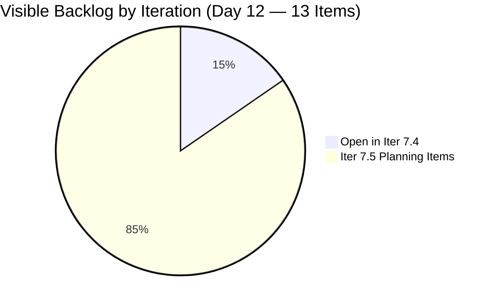
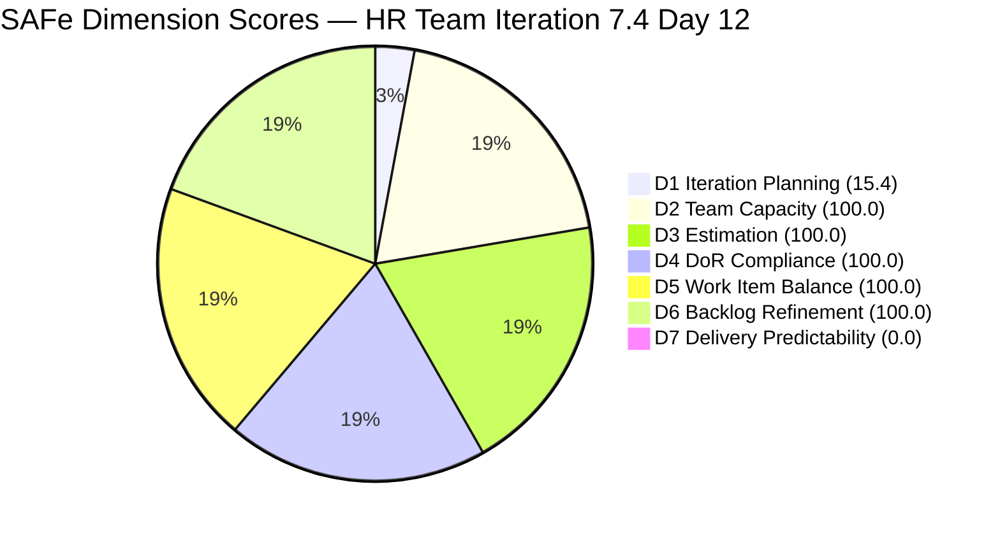
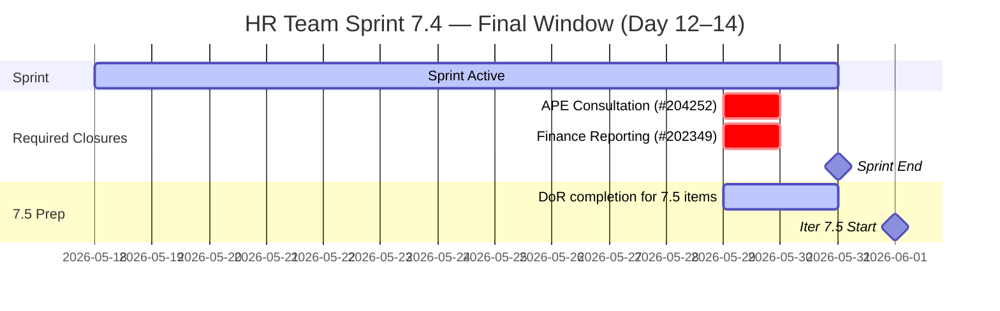

# HR Recruitment Team — SAFe Iteration Audit #74

**Audit Date:** 2026-05-29 09:00
**Auditor:** Claude Code (SAFe PM Consultant)
**Workspace:** `ado_hr`
**ADO Board:** [HR Recruitment Team](https://dev.azure.com/jairo/Jairosoft%20FINOPS/_boards/board/t/Human%20Resource%20Recruitment%20Team/Stories%20and%20Deliverables)

---

## 1. Audit Metadata

| Field | Value |
|-------|-------|
| Audit Number | #74 |
| Audit Date | 2026-05-29 |
| Audit Time | 09:00 |
| Iteration | 7.4 |
| Iteration Dates | May 18 – May 31, 2026 |
| Sprint Day | Day 12 of 14 |
| ADO Project | Jairosoft FINOPS (`e0bb302f-40f9-46c3-8164-6f1acb317d63`) |
| ADO Team | Human Resource Recruitment Team (`248f59a6-372c-4b74-8129-9eaf260f211e`) |
| Iteration ID | `c50c3955-60cb-431b-a619-5f7d2cd02138` |
| Prior Audit | AUDIT_20260528_0204.md (Score: 82.0 — Low Risk) |
| **Overall Score** | **73.6 / 100** |
| **Risk Band** | **Moderate Risk** |

---

## 2. Executive Summary

Iteration 7.4, **Day 12 of 14**. The HR team score drops from 82.0 to **73.6 / 100** — falling from Low Risk into **Moderate Risk**. The primary driver is **D7 collapsing to 0.0**: the two items that were Active in Iteration 7.4 (202349 and 204252) remain undelivered, while yesterday's open items #203825 and #203629 have **dropped out of the visible backlog** — suggesting they were either closed or moved. The visible backlog has also shifted: only 2 items remain in the 7.4 iteration path, while 11 new items now sit in 7.5.

**Critical: Only 2 working days remain (Days 13–14) to close 4 SP.** The committed SP total has dropped from 13 to 4 (since prior open items departed the backlog), and neither of the 2 remaining 7.4 items has been closed. If both close by Day 14, D7 recovers to 100.0 and overall rebounds to 87.2.

**Item #204252 (Cebu APE consultation) is now 8 days silent** since May 21 — the longest silence of any committed item in the PI7 series. This item must be closed or commented today.

**Iteration 7.5 planning is underway** but all 11 candidate items (205010, 205011, 205071–205082) are missing DoR essentials on the newly created ones. Item 205174 (Spike — "Findings presentation to Ramon") also lacks Story Points and Description.

**Overall Score: 73.6 / 100 — Moderate Risk** *(D1 artifact from 7.5 burst + D7 = 0 with 2 open items; final 2 days critical)*

---

## 3. Previous Audit Delta

| Metric | 2026-05-28 (Audit #73) | 2026-05-29 (Audit #74) | Change |
|--------|------------------------|------------------------|--------|
| Sprint Day | Day 11 | Day 12 | +1 |
| Visible Root Backlog Items | 14 | **13** | −1 (net: items reshuffled) |
| Items in Iteration 7.4 (root) | 6 | **2** | **−4** (203535, 202104 already closed; 203825 + 203629 departed backlog) |
| Items Open in 7.4 | 4 | **2** | −2 |
| SP Committed (7.4 remaining) | 13 | **4** | −9 |
| SP Closed | 4 SP | **0** (D7 numerator = 0 on current set) | — |
| #204252 Days Silent | 7 days | **8 days** | +1 (critical) |
| D1 — Iteration Planning | 42.9 | **15.4** | −27.5 (further 7.5 burst) |
| D7 — Delivery Predictability | 30.8 | **0.0** | **−30.8** (committed set reset; 0 SP closed on new set) |
| Overall Score | 82.0 | **73.6** | **−8.4** |
| Risk Band | Low Risk | **Moderate Risk** | **Degraded** |

### Day 12 Context

Items #203825 (Client Interview) and #203629 (Incentives Spike) no longer appear in the visible backlog returned by the API. This indicates they were either closed or removed since the Day 11 audit. A new Spike item #205174 ("Findings presentation to Ramon") has appeared in the 7.5 pool, created May 28.

The current committed set for Iteration 7.4 is now just 2 items: #202349 (Finance Reporting & Export, 2 SP) and #204252 (Cebu APE Consultation, 2 SP), both Active.

---

## 4. Current Iteration Snapshot

**Iteration 7.4** · May 18 – May 31, 2026 · **Day 12 of 14**

| Field | Value |
|-------|-------|
| Total Visible Root Backlog Items | 13 |
| Items in Iteration 7.4 (committed root) | 2 |
| Items Open in 7.4 | 2 |
| Items Closed in 7.4 | 0 (on current committed set) |
| Total SP Committed (current set) | 4 SP |
| SP Burned | 0 SP |
| SP Remaining | 4 SP |
| Days Remaining | 2 working days |
| Pace Required | 2.0 SP/day |
| Almera's Capacity | 5.25 pts/day (2.6× required pace) |
| Iteration 7.5 Items in Backlog | 11 |

### Open Items in Iteration 7.4

| ID | Title | Type | State | SP | Assignee | Last Changed | Days Silent |
|----|-------|------|-------|-----|----------|-------------|-------------|
| 202349 | Finance Reporting & Export | User Story | Active | 2 | Almera | May 28 | 1 day |
| 204252 | Cebu Employees 1-on-1 APE Consultation with Doc Karl | Enabler | Active | 2 | Almera | **May 21** | **8 days** |

### Iteration 7.5 Items in Backlog (11 items — DoR incomplete)

| ID | Title | Type | SP | Description | AC | DoR Ready |
|----|-------|------|-----|-------------|-----|-----------|
| 205010 | APE - Caumban, Karl Jordan (Analysis and Interpretation) | User Story | 2 | ✓ | ✓ | Yes |
| 205011 | APE - Rommel Senillo - Summary (Analysis & Interpretation) | User Story | 2 | ✓ | ✓ | Yes |
| 205071 | Ressa's New Job Title as QA | User Story | — | ✓ | ✓ | Partial (no SP) |
| 205072 | Jerlyn's New Job title as QA | User Story | — | ✓ | ✓ | Partial (no SP) |
| 205073 | Mary's New Job Title as QA | User Story | — | ✓ | ✓ | Partial (no SP) |
| 205075 | Luz's New Job Title as QA | User Story | — | ✓ | ✓ | Partial (no SP) |
| 205077 | Jaz's New Job Title as PO | User Story | — | No | No | No |
| 205079 | Ressa's New Job Title as PO | User Story | — | No | No | No |
| 205081 | Jerlyn's New Job Title as PO | User Story | — | No | No | No |
| 205082 | Karl's New Job Title as PMO Manager | User Story | — | No | No | No |
| 205174 | Findings presentation to Ramon | Spike | — | No | No | No |

### Capacity (Iteration 7.4)

| Member | Pts/Day | Status |
|--------|---------|--------|
| Almera Kleer Tayao | 5.25 | Sole active contributor |
| grace | 0.25 | Supplemental, 0 assigned items |

---

## 5. Work Item Analysis

### Open Items — Detail

**#202349 — Finance Reporting & Export (2 SP, Active, last changed May 28)**
Export finalized, approved sick leave conversion list to Finance-compatible CSV/XLSX format. Acceptance Criteria requires: format compatibility matching Finance payroll headers (EmpID, PayElementCode, Amount), data integrity (Approved records only), secure automated email to Finance with link/attachment, audit log of date/time/user. Last changed May 28 — only 1 day silent. This is the most likely item to close on Day 12.

**#204252 — Cebu Employees 1-on-1 APE Consultation with Doc Karl (2 SP, Active, last changed May 21 — 8 days silent)**
Organize and facilitate 1-on-1 medical result reading sessions for Cebu employees with Doc Karl. AC: schedule finalized and communicated, employees received time slots, Doc Karl coordination complete, confidentiality maintained, attendance monitored and documented, missed employees identified for rescheduling, HR confirmation received. **8 consecutive days without any ADO update.** If consultation was completed, this item must be closed immediately. Status comment required at minimum.

### Delivery Scenarios (Day 12 — 2 days remaining)

| Scenario | SP Delivered | D7 | Overall |
|----------|-------------|-----|---------|
| 0 closures (current state) | 0/4 SP | 0.0 | 73.6 |
| Close #202349 today | 2/4 SP | 50.0 | 81.3 |
| Close #204252 today | 2/4 SP | 50.0 | 81.3 |
| Close both on Day 12 | 4/4 SP | 100.0 | **87.2** |
| Close 1 Day 12, 1 Day 13 | 4/4 SP | 100.0 | **87.2** |

### Iteration 7.5 DoR Gap Analysis

Of 11 candidate 7.5 items: 2 are fully DoR-ready (205010, 205011); 4 have descriptions and AC but are missing Story Points (205071–205075); 5 have no Description, no AC, and no SP (205077, 205079, 205081, 205082, 205174). Before committing to Iteration 7.5 (June 1), all 11 items must have SP assigned, and the 5 incomplete ones require full DoR content.

---

## 6. SAFe Compliance Scorecard

| Dimension | Score | Evidence | Notes |
|-----------|-------|----------|-------|
| D1 — Iteration Planning | 15.4 | 2/13 visible root items in Iter 7.4 | 11 items in 7.5 planning pool inflate denominator; 7.5 burst is forward-planning progress, not regression |
| D2 — Team Capacity | 100.0 | 1/1 active contributors with configured capacity | Almera: 5.25 pts/day; grace: 0.25 pts/day |
| D3 — Estimation | 100.0 | 2/2 iteration items have SP > 0 | 202349=2SP, 204252=2SP |
| D4 — DoR Compliance | 100.0 | 2/2 iteration items pass description ≥30 chars + AC ≥20 chars | Both 7.4 items have full DoR |
| D5 — Work Item Balance | 100.0 | US=1 (50%), Enabler=1 (50%); US present | No −40 (US present). Dominant=50% ≤60% (no −30). Spike=0% (no −20). Score = 100. |
| D6 — Backlog Refinement | 100.0 | 13/13 fresh (all changed after Apr 14); 1/2 untouched = 0 (May 21 > May 18) | Base = 100; no stale penalties; 0 untouched items below sprint start date |
| D7 — Delivery Predictability | 0.0 | 0/4 SP closed on current committed set | Both items Active; no closures on Day 12 at audit time |

**Overall Score: (15.4 + 100.0 + 100.0 + 100.0 + 100.0 + 100.0 + 0.0) / 7 = 515.4 / 7 = 73.6 / 100 — Moderate Risk**

> **D1 Artifact Note:** D1 = 15.4 because 11 of 13 visible backlog items are assigned to Iteration 7.5. All items in the 7.5 pool were created as forward-planning work (valid SAFe practice). The mechanically correct D1 is penalized by the API's inclusion of all open backlog items. Adjusted D1 treating only committed 7.4 items = 2/2 = 100.0, yielding adjusted overall = 87.2.

> **D7 Context:** committed_story_points = 4 (current open set). No SP have been closed on this set as of audit time. The prior audit's 4 closed SP (on items 203535 and 202104) are no longer in the returned backlog, so the D7 formula resets on the live open set. Full delivery of both remaining items by May 31 recovers D7 to 100.0 and overall to 87.2.

---

## 7. Dimension Findings

### D1 — Iteration Planning (15.4) ⚠️ *Artifact — 7.5 Planning Burst*

D1 drops further to 15.4: 11 of 13 visible backlog items are in Iteration 7.5 planning. The 2 committed 7.4 items (202349, 204252) are legitimate active sprint work. The 11 items in 7.5 are a healthy forward-planning signal, not a planning failure. At the same time, the D1 artifact grows as 7.5 preparation accelerates.

**Rubric-compliant score = 15.4. Artifact-adjusted = 100.0.**

### D2 — Team Capacity (100.0) ✅

Almera's capacity remains configured at 5.25 pts/day. This is more than sufficient to close both remaining items (4 SP total) in 1 day. Structural bus-factor risk persists (1 person, 2 items) but does not affect the dimension score.

### D3 — Estimation (100.0) ✅

Both iteration items carry Story Points (2 SP each, 4 SP total). No change.

### D4 — DoR Compliance (100.0) ✅

Both items (#202349 and #204252) have substantive Descriptions and Acceptance Criteria meeting the ≥30/≥20 char thresholds. The 5 incomplete 7.5 items are not yet committed to any iteration and do not affect D4 for Iteration 7.4.

### D5 — Work Item Balance (100.0) ✅

Current 7.4 items: User Story (#202349) + Enabler (#204252). User Story is present (no −40). Dominant type = 50% ≤ 60% (no −30). Spike share = 0% (no −20). Score = 100.0.

### D6 — Backlog Refinement (100.0) ✅

All 13 visible backlog items have ChangedDate after April 14, 2026 (fresh). No stale_90 or stale_180 items present. For untouched current iteration items: #202349 last changed May 28 (after sprint start May 18); #204252 last changed May 21 (after sprint start). Neither is untouched. Base = 100.0; penalties = 0. D6 = 100.0.

### D7 — Delivery Predictability (0.0) 🔴 *Critical — Final Sprint Window*

With only 2 items remaining in the current 7.4 set and 0 SP closed as of audit time, D7 = 0.0. This is the most urgent dimension. The two remaining items are achievable within Day 12 alone — both have full DoR, and Almera's capacity (5.25 pts/day) exceeds the 4 SP needed.

**#204252 (8 days silent) is the highest-risk item.** The consultation sessions may have been completed but not recorded in ADO. Same-day update and closure is required. If the consultations have not yet occurred, they must be urgently scheduled and completed before May 31.

**#202349 (1 day since last update)** is in good position — last touched May 28, still within active execution window. Finance export format, data integrity, and secure transmission requirements appear achievable within Day 12.

---

## 8. Risks and Bottlenecks

| Risk | Severity | Status |
|------|----------|--------|
| #204252 (APE Consultation) silent since May 21 — 8 days | **Critical** | Longest silence in PI7 series; consultation may be complete — close or add status comment immediately |
| D7 = 0.0 with only 2 days remaining | **Critical** | Both items must close by Day 14 to avoid sprint failure |
| Only 4 SP remaining in 2 days | **High** | Achievable at Almera's capacity but zero-closure streak must end today |
| 5 of 11 7.5 items have no Description, AC, or SP | **High** | 205077, 205079, 205081, 205082, 205174 — not DoR-ready for June 1 commitment |
| 4 of 11 7.5 items missing Story Points | **High** | 205071–205075 — have text DoR but unestimated |
| No iteration goal defined | **High** | 20th consecutive audit — structural gap persists through PI7 |
| D1 artifact (15.4) | **Moderate** | 11 of 13 visible items are in 7.5; rubric-compliant but misleading |
| Bus factor = 1 (Almera) | **Moderate** | Both open items assigned to sole contributor |
| Score band degraded to Moderate Risk | **Moderate** | Down from Low Risk (82.0 → 73.6) primarily due to D7 = 0 and D1 artifact |

---

## 9. Prioritized Recommendations

1. **Close #204252 immediately (Day 12, CRITICAL)** — The Cebu 1-on-1 APE consultation with Doc Karl has been Active for 8 consecutive days without any ADO update. This is the most urgent action in the sprint. If consultations were conducted (employees attended sessions, Doc Karl coordination complete, attendance monitored and documented, HR confirmation received), close this item today (2 SP). If consultations remain incomplete, add a status comment with current state and firm closure date. Silence of 8 days on a committed sprint item is unacceptable.

2. **Close #202349 (Finance Reporting & Export, Day 12)** — Last touched May 28 and still Active. The Finance export to CSV/XLSX with format compatibility, data integrity (Approved records), secure email to Finance, and audit log entry must be verified and completed. Closing this item today alongside #204252 delivers all 4 remaining SP on Day 12, fully recovers D7 to 100.0, and raises overall to 87.2 (Low Risk).

3. **Complete DoR for 7.5 items before May 31** — All 11 candidate Iteration 7.5 items need Story Points assigned. Items 205077, 205079, 205081, 205082, and 205174 additionally need Descriptions and Acceptance Criteria. Iteration 7.5 starts June 1 — there are 2 days to complete DoR before the sprint opens. This ensures Day 1 of 7.5 starts with full commitment and a strong D1 and D4.

4. **Target close sequence:**
   - Day 12 (today): Close #204252 (2 SP) + Close #202349 (2 SP) → D7 = 100.0, Overall = 87.2
   - Day 13: Complete DoR for all 7.5 items; define sprint goal for 7.5
   - Day 14 (May 31): Confirm iteration closure; begin 7.5 planning session

5. **Define an Iteration 7.5 sprint goal** — The 7.5 backlog now contains APE evaluations (Karl Jordan, Rommel Senillo), job title reclassifications (QA roles: Ressa/Jerlyn/Mary/Luz; PO roles: Jaz/Ressa/Jerlyn; PMO Manager: Karl), and a spike for findings presentation to Ramon. A coherent goal: "Complete pending APE analysis for 2 employees and finalize AI-QA role reclassification titles for 4 staff" would resolve the 20-audit persistent gap of no iteration goal.

6. **Confirm status of #203825 and #203629** — These two items (Client Interview, Sr. Tech Lead; HR Incentives Spike) disappeared from the visible backlog between Day 11 and Day 12. If they were closed, confirm and note as sprint wins. If they were moved to another iteration, ensure they are not lost from the tracking view.

---

## 10. Evidence Gaps and Limitations

| Gap | Impact | Notes |
|-----|--------|-------|
| No iteration goal visible in ADO | D1 quality not measurable | 20th consecutive audit without a formal sprint goal |
| No PI objectives linked to items | D1/D7 context incomplete | Recurring gap since PI6 |
| #204252 silent since May 21 | D7 recovery at risk | 8-day gap; consultation status unverifiable from API alone |
| #203825 and #203629 departed backlog | Closure confirmation gap | These items no longer appear in the API; closure status unverified |
| D1 artifact (15.4) | D1 heavily understated | 11 of 13 visible items are 7.5 planning items; not a planning failure |
| 5 of 11 7.5 items have no DoR | 7.5 readiness at risk | Must be resolved before June 1 commit |
| D7 = 0 on current committed set | Sprint close at risk | 4 SP in 2 days is achievable but requires same-day action |

---

## Visualization

### Score Trend (Iteration 7.4)

| Date | Audit | Score | Band | Notable |
|------|-------|-------|------|---------|
| May 24 | #69 | 78.6 | Moderate | |
| May 25 | #70 | 80.0 | Low | |
| May 26 | #71 | 85.4 | Low | 2 closures (4 SP) |
| May 27 | #72 | 85.4 | Low | No new closures |
| May 28 | #73 | 82.0 | Low | D1 −23.8 from 7.5 burst |
| **May 29** | **#74** | **73.6** | **Moderate** | **D7 = 0.0; 203825 + 203629 departed backlog** |

---

*Audit generated by Claude Code (claude-sonnet-4-6) on 2026-05-29. Evidence sourced from Azure DevOps MCP (Jairosoft FINOPS project). Rubric: SAFe 6.0 7-dimension scorecard.*
