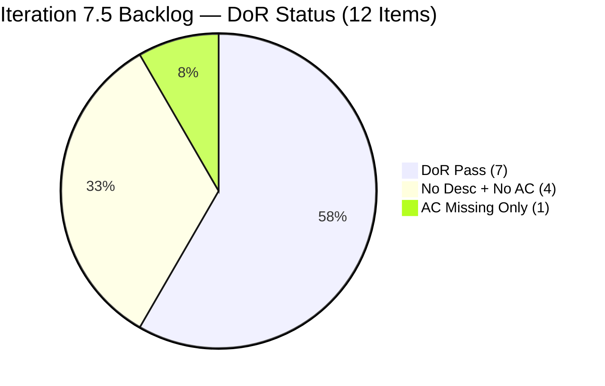
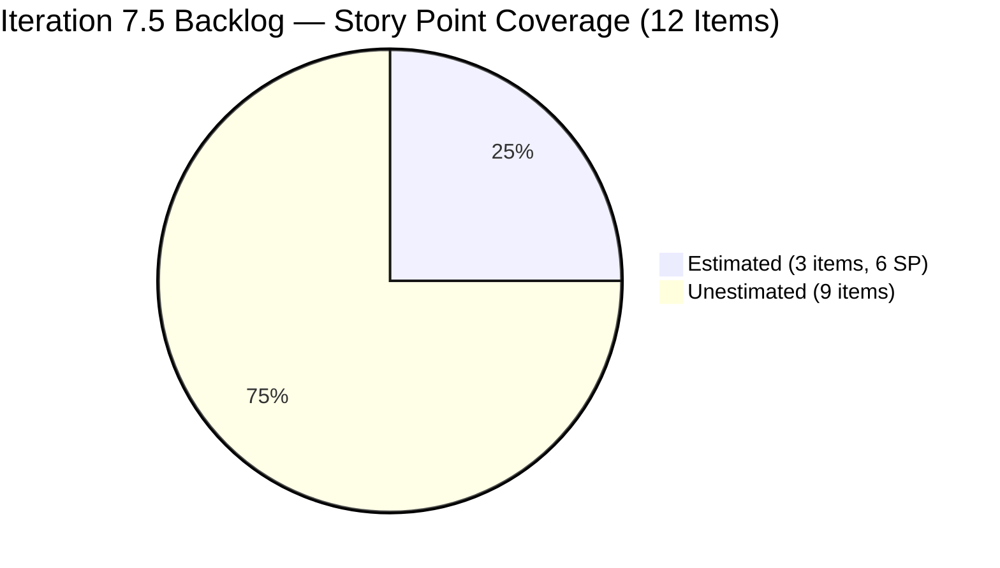
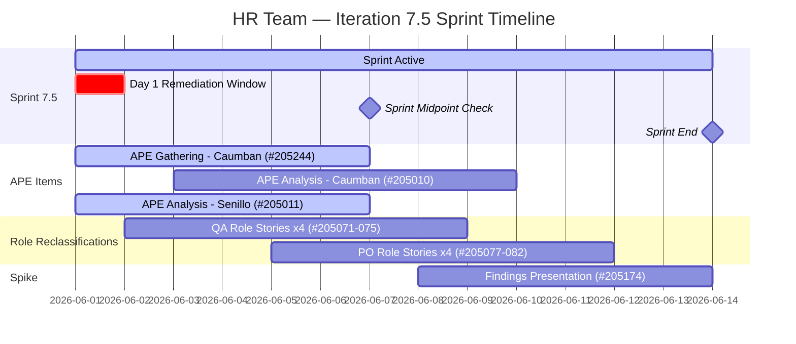
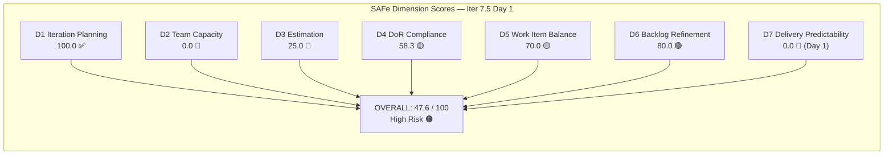

# HR Recruitment Team — SAFe Iteration Audit #76

**Audit Date:** 2026-06-01 02:03 UTC-6
**Auditor:** Claude Code (SAFe PM Consultant)
**Workspace:** `ado_hr`
**ADO Board:** [HR Recruitment Team](https://dev.azure.com/jairo/Jairosoft%20FINOPS/_boards/board/t/Human%20Resource%20Recruitment%20Team/Stories%20and%20Deliverables)

---

## 1. Audit Metadata

| Field | Value |
|-------|-------|
| Audit Number | #76 |
| Audit Date | 2026-06-01 |
| Audit Time | 02:03 UTC-6 |
| Audit Timezone | UTC-6 |
| Iteration | Iteration 7.5 |
| Iteration Dates | 2026-06-01 – 2026-06-14 |
| Sprint Day | Day 1 of 14 |
| ADO Project | Jairosoft FINOPS (`e0bb302f-40f9-46c3-8164-6f1acb317d63`) |
| ADO Team | Human Resource Recruitment Team (`248f59a6-372c-4b74-8129-9eaf260f211e`) |
| Iteration ID | `3b355811-2941-4edf-a8b1-7ffcdb478f9d` |
| Prior Audit | AUDIT_20260530_0900.md (Score: 14.3 — Critical, sprint-completion artifact) |
| **Overall Score** | **47.6 / 100** |
| **Risk Band** | **High Risk** |

---

## 2. Executive Summary

Iteration 7.5 begins today (Day 1 of 14) with 12 items committed, a visible score recovery from the prior sprint-completion artifact of 14.3 to **47.6 / 100 (High Risk)**. The team has executed a strong planning transition: all 12 backlog items are assigned to Iteration 7.5, and 7 of 12 meet full DoR criteria. Key strengths are D1 (Iteration Planning = 100.0 — full backlog committed) and D6 (Backlog Refinement = 80.0 — all items fresh, reasonable penalty for pre-sprint changes only).

Critical gaps driving the High Risk score are: **D2 Team Capacity = 0.0** (no formal capacity entered for Iter 7.5 by the HR team); **D3 Estimation = 25.0** (only 3 of 12 items have Story Points assigned); **D7 Delivery Predictability = 0.0** (Day 1 — no items closed yet, expected). The most urgent actions are setting capacity in ADO for Almera and assigning Story Points to the 9 unestimated items (#205071–205082 minus those already estimated). If capacity and SP gaps are closed today (Day 1), the team could reach Low Risk (≥80) as early as Day 2.

A new item (#205244 — APE Gathering for Karl Jordan Caumban) was added on 2026-05-31 and is fully DoR-ready at 2 SP, expanding the iteration scope to 12 committed items.

---

## 3. Previous Audit Delta

| Metric | 2026-05-30 Audit #75 | 2026-06-01 Audit #76 | Change |
|--------|----------------------|----------------------|--------|
| Iteration | 7.4 (Day 13) | **7.5 (Day 1)** | New sprint started |
| Visible Root Backlog Items | 11 | **12** | +1 (#205244 added) |
| Items in Current Iteration (CIRI) | 0 | **12** | +12 (all 12 in Iter 7.5) |
| SP Committed (estimated) | 0 | **6** | +6 |
| SP Closed | 0 | **0** | Day 1 — expected |
| DoR-Compliant Items | 0 (no current items) | **7** | +7 |
| D1 — Iteration Planning | 0.0 | **100.0** | +100.0 |
| D2 — Team Capacity | 0.0 | **0.0** | No change (no capacity set) |
| D3 — Estimation | 0.0 | **25.0** | +25.0 |
| D4 — DoR Compliance | 0.0 | **58.3** | +58.3 |
| D5 — Work Item Balance | 0.0 | **70.0** | +70.0 |
| D6 — Backlog Refinement | 100.0 | **80.0** | −20.0 (untouched penalty: all items pre-dated sprint start) |
| D7 — Delivery Predictability | 0.0 | **0.0** | No change (Day 1 — expected) |
| **Overall Score** | **14.3 (Critical — artifact)** | **47.6 (High Risk)** | **+33.3** |
| **Risk Band** | Critical (artifact) | **High Risk** | Recovered |

### Interpretation

The jump from 14.3 to 47.6 reflects the natural sprint transition: Iteration 7.5 has now started with 12 committed items, restoring D1–D5 to meaningful values. The prior 14.3 was a mechanical sprint-completion artifact (0 items in the old iteration); the current 47.6 reflects genuine planning gaps (capacity unset, 9 items unestimated). D6 declined by 20 points because all 12 items were last touched before the June 1 sprint start date, triggering the untouched penalty.

---

## 4. Current Iteration Snapshot

**Iteration 7.5** · 2026-06-01 – 2026-06-14 · **Day 1 of 14**

| Field | Value |
|-------|-------|
| Total Visible Root Backlog Items (VRBI) | 12 |
| Items in Iteration 7.5 (CIRI) | 12 |
| Items State: New | 12 |
| Items State: Active | 0 |
| Items State: Closed / Done | 0 |
| SP Committed (estimated items only) | 6 SP (#205010, #205011, #205244 at 2 SP each) |
| SP Burned | 0 SP (Day 1 — expected) |
| Distinct Assignees | 1 (Almera Kleer Tayao) |
| Formal Capacity Configured | Not set for Iter 7.5 (API returned no team capacity) |
| Sprint Day | 1 of 14 |
| Days Remaining | 13 |
| New Item Added Since Last Audit | #205244 (APE Karl — Gathering, added 2026-05-31) |

---

## 5. Work Item Analysis

All 12 items are in Iteration 7.5 state = New. DoR assessed by stripping HTML tags and counting non-whitespace characters in Description (≥30) and Acceptance Criteria (≥20).

| ID | Title | Type | State | SP | Assignee | DoR | ChangedDate |
|----|-------|------|-------|----|----------|-----|-------------|
| 205010 | APE - Caumban, Karl Jordan (Analysis and Interpretation) | User Story | New | 2 | Almera | ✅ Pass | 2026-05-25 |
| 205011 | APE - Rommel Senillo - Summary (Analysis & Interpretation) | User Story | New | 2 | Almera | ✅ Pass | 2026-05-25 |
| 205244 | APE - Caumban, Karl Jordan (Gathering of accomplished APE) | User Story | New | 2 | Almera | ✅ Pass | 2026-05-31 |
| 205071 | Ressa's New Job Title as QA | User Story | New | — | Almera | ✅ Pass | 2026-05-28 |
| 205072 | Jerlyn's New Job Title as QA | User Story | New | — | Almera | ✅ Pass | 2026-05-28 |
| 205073 | Mary's New Job Title as QA | User Story | New | — | Almera | ✅ Pass | 2026-05-28 |
| 205075 | Luz's New Job Title as QA | User Story | New | — | Almera | ✅ Pass | 2026-05-28 |
| 205077 | Jaz's New Job Title as PO | User Story | New | — | Almera | ❌ Fail (no Desc, no AC) | 2026-05-27 |
| 205079 | Ressa's New Job Title as PO | User Story | New | — | Almera | ❌ Fail (no Desc, no AC) | 2026-05-27 |
| 205081 | Jerlyn's New Job Title as PO | User Story | New | — | Almera | ❌ Fail (no Desc, no AC) | 2026-05-27 |
| 205082 | Karl's New Job Title as PMO Manager | User Story | New | — | Almera | ❌ Fail (no Desc, no AC) | 2026-05-27 |
| 205174 | Findings presentation to Ramon | Spike | New | — | Almera | ❌ Fail (Desc ✓; AC missing) | 2026-05-31 |

**DoR Summary:**
- Pass: 7 items (205010, 205011, 205244, 205071, 205072, 205073, 205075)
- Fail: 5 items (205077, 205079, 205081, 205082, 205174)

**SP Summary:**
- Estimated: 3 items (205010=2, 205011=2, 205244=2) = 6 SP total
- Unestimated: 9 items (205071–205082 minus estimated, 205174)

**Item type breakdown:**
- User Story: 11
- Spike: 1

---

## 6. SAFe Compliance Scorecard

| Dimension | Score | Evidence (Numerator / Denominator) | Notes |
|-----------|-------|------------------------------------|-------|
| D1 — Iteration Planning | **100.0** | CIRI 12 / VRBI 12 | All 12 backlog items committed to Iter 7.5 |
| D2 — Team Capacity | **0.0** | CC 0 / CW 1 | No formal capacity configured for Iter 7.5; Almera has items but no capacity entry |
| D3 — Estimation | **25.0** | ECI 3 / PECI 12 | Only 205010, 205011, 205244 have SP; 9 items unestimated |
| D4 — DoR Compliance | **58.3** | DCI 7 / CIRI 12 | 7 items fully DoR-ready; 5 missing Desc+AC or partial |
| D5 — Work Item Balance | **70.0** | Base 100; penalty B −30 | User Story present ✓; dominant type 91.7% > 60% → −30; Spike 8.3% ≤ 40% → no spike penalty |
| D6 — Backlog Refinement | **80.0** | Base 100.0; penalty −20 | All 12 fresh; 0 stale_90; 0 stale_180; untouched 12/12 (100%) > 30% → −20 |
| D7 — Delivery Predictability | **0.0** | CLSP 0 / CSP 6 | Day 1 — no closures yet; early-sprint, low delivery expected |

**Overall = (100.0 + 0.0 + 25.0 + 58.3 + 70.0 + 80.0 + 0.0) / 7 = 333.3 / 7 = 47.6 / 100 — High Risk**

---

## 7. Dimension Findings

### D1 — Iteration Planning (100.0) ✅

- VRBI = 12 (all items returned by backlog API)
- CIRI = 12 (all items have IterationPath = "Jairosoft FINOPS\2026-PI7\Iteration 7.5")
- Formula: CIRI / VRBI × 100 = 12 / 12 × 100 = **100.0**
- Interpretation: Perfect planning score. The prior sprint-completion artifact (0/11) has resolved fully with the start of Iteration 7.5. Every visible backlog item is committed to the active sprint.

### D2 — Team Capacity (0.0) 🔴

- CW (distinct non-empty assignees on CIRI) = 1 (Almera Kleer Tayao only)
- CC: work_get_team_capacity for team 248f59a6 returned "No team capacity assigned to the team" for Iter 7.5. work_get_iteration_capacities returned data for two other team IDs (not the HR team). Per rubric: CC = number of CW members with positive daily capacity OR at least one activity configured. Since no capacity is configured for Almera in this iteration, CC = 0.
- Formula: CW = 0 would score 0; CW > 0 but CC = 0 → CC/CW × 100 = 0/1 × 100 = **0.0**
- Impact: D2 = 0 contributes −14.3 points to the overall score vs. if capacity were set (100.0 would contribute +14.3 net swing of +14.3 points, lifting score to ~61.9).

### D3 — Estimation (25.0) 🔴

- PECI (User Story + Spike in CIRI) = 11 User Stories + 1 Spike = 12
- ECI (PECI with SP > 0): #205010 (2 SP), #205011 (2 SP), #205244 (2 SP) = 3 items
- Formula: ECI / PECI × 100 = 3 / 12 × 100 = **25.0**
- Gap items (9 unestimated): 205071, 205072, 205073, 205075 (QA role reclassifications — Desc+AC present but SP missing); 205077, 205079, 205081, 205082 (PO role reclassifications — no Desc/AC/SP); 205174 (Spike — Desc partial, no SP)
- If all 9 gaps were filled with Story Points, D3 would reach 100.0.

### D4 — DoR Compliance (58.3) 🟡

- CIRI = 12
- DCI = 7 (items with both Desc ≥ 30 non-whitespace chars AND AC ≥ 20 non-whitespace chars after HTML stripping)
  - PASS: #205010 (Desc ≈ 220 chars, AC ≈ 320 chars), #205011 (same structure), #205244 (same structure), #205071 (Desc ≈ 280 chars, AC ≈ 750 chars SMART format), #205072 (same SMART structure), #205073 (same), #205075 (same)
  - FAIL: #205077 — Desc = null, AC = null (0/0 chars); #205079 — same; #205081 — same; #205082 — same; #205174 — Desc = "To present the Employee benefits and incentive report." ≈ 54 chars ✓, but AC = null (0 chars) ✗
- Formula: DCI / CIRI × 100 = 7 / 12 × 100 = **58.3**

### D5 — Work Item Balance (70.0) 🟡

- CIRI = 12; User Story count = 11; Spike count = 1
- Penalty A check: User Story type present in CIRI? YES → no −40 penalty
- Penalty B check: dominant_type_share = 11/12 × 100 = 91.7% > 60% → apply −30
- Penalty C check: spike_share = 1/12 × 100 = 8.3% ≤ 40% → no −20 penalty
- Formula: max(0, 100 − 30) = **70.0**
- Note: The high User Story dominance (91.7%) is structurally expected for an HR team with a single active contributor; the penalty reflects lack of type diversity, not necessarily poor planning.

### D6 — Backlog Refinement (80.0) 🟢

- VRBI = 12
- Fresh items (ChangedDate ≥ 2026-04-17): All 12 items changed in May 2026 → fresh_VRBI = 12. Base = 12/12 × 100 = 100.0
- Stale_90 check (ChangedDate < 2026-03-03): 0 items → 0/12 = 0% ≤ 10% → no penalty
- Stale_180 check (ChangedDate < 2025-12-04): 0 items → no penalty
- Untouched current items (ChangedDate < iteration start 2026-06-01T00:00:00Z):
  - 205010: 2026-05-25 → before start ✓ untouched
  - 205011: 2026-05-25 → before start ✓ untouched
  - 205071: 2026-05-28 → before start ✓ untouched
  - 205072: 2026-05-28 → before start ✓ untouched
  - 205073: 2026-05-28 → before start ✓ untouched
  - 205075: 2026-05-28 → before start ✓ untouched
  - 205077: 2026-05-27 → before start ✓ untouched
  - 205079: 2026-05-27 → before start ✓ untouched
  - 205081: 2026-05-27 → before start ✓ untouched
  - 205082: 2026-05-27 → before start ✓ untouched
  - 205174: 2026-05-31T22:12:15Z → before start ✓ untouched
  - 205244: 2026-05-31T22:14:44Z → before start ✓ untouched
  - untouched = 12/12 = 100% > 30% → penalty −20
- Total penalties = 20
- Formula: max(0, 100.0 − 20) = **80.0**
- Note: This is a Day 1 artifact — all items were prepared before sprint start (which is correct SAFe behavior). By Day 2, as items are updated/activated, the untouched count will drop and this penalty will diminish.

### D7 — Delivery Predictability (0.0) 🔴

- CSP = sum of SP on ECI = 2+2+2 = 6 SP
- CLSP = SP on ECI items with State = Closed OR Done = 0 (all 12 items are in "New" state)
- Formula: CLSP / CSP × 100 = 0 / 6 × 100 = **0.0**
- **Early-sprint annotation (Day 1 of 14):** Zero delivery is expected on Day 1. This score will improve as items are closed throughout the iteration. With 6 committed SP (and potentially more once D3 gaps are filled), D7 should climb toward 100.0 by sprint end.

---

## 8. Risks and Bottlenecks

| Risk | Severity | Details |
|------|----------|---------|
| No capacity configured for Iter 7.5 | **CRITICAL** | D2 = 0.0; Almera's capacity must be entered in ADO today (Day 1) to restore D2 to 100.0 |
| 9 of 12 items unestimated (Story Points = null) | **CRITICAL** | D3 = 25.0; #205071–205075 missing SP; #205077–205082, #205174 missing SP + DoR content |
| 4 items have no Description or Acceptance Criteria | **HIGH** | D4 = 58.3; #205077, #205079, #205081, #205082 (PO title reclassifications) are commit-blocking |
| #205174 (Spike) missing Acceptance Criteria | **HIGH** | D4 contributing failure; Desc present (54 chars ✓) but AC null; spike must have time-box scope and deliverable defined |
| No iteration goal defined | **HIGH** | 22nd consecutive audit without a formal sprint goal; 7.5 has a clear narrative: APE completion + AI-QA role reclassifications + PO/PMO title updates |
| Bus factor = 1 (Almera) | **MODERATE** | All 12 items assigned to Almera; Grace listed on team with 0 capacity; structural single-point-of-failure |
| User Story type dominance = 91.7% | **LOW** | Triggers D5 penalty (−30); structural for HR team; acceptable as long as work is meaningful |
| D7 = 0 (Day 1 artifact) | **LOW** | Expected; will recover as items are closed during the sprint |

---

## 9. Prioritized Recommendations

1. **Set Almera's capacity in ADO for Iteration 7.5 (TODAY, Day 1 — CRITICAL)** — Navigate to ADO → HR Recruitment Team → Iteration 7.5 → Capacity. Enter Almera's daily capacity (typically 5.25 pts/day based on prior audits). This single action will restore D2 from 0.0 to 100.0, adding 14.3 points to the overall score and moving the team from High Risk (47.6) to Moderate Risk (~61.9). This is the highest-ROI action available today.

2. **Assign Story Points to all 9 unestimated items (TODAY, Day 1 — CRITICAL)** — Items needing SP: #205071 (Ressa QA), #205072 (Jerlyn QA), #205073 (Mary QA), #205075 (Luz QA) — these have full Desc+AC and should be quick to estimate (suggested: 1–2 SP each). Items #205077, #205079, #205081, #205082, #205174 also need SP but require DoR completion first (see Rec #3). Completing SP on all 9 items would lift D3 from 25.0 to 100.0, adding another 10.7 points to the overall score.

3. **Write full DoR for #205077, #205079, #205081, #205082 (TODAY, Day 1 — HIGH)** — These four PO title reclassification stories (Jaz, Ressa, Jerlyn as PO; Karl as PMO Manager) have no Description or Acceptance Criteria. Suggest using the same SMART AC template as the QA stories (#205071–205075). Add Description (~3–4 sentences in user story format) and SMART Acceptance Criteria for each. This will lift DCI from 7 to 11, pushing D4 from 58.3 toward 91.7.

4. **Add Acceptance Criteria to Spike #205174 (TODAY, Day 1 — HIGH)** — The Description is present ("To present the Employee benefits and incentive report." — 54 chars). Add AC specifying: the presentation format (slides/document), key sections to cover (benefits summary, incentive structure, recommendations), audience (Ramon), and a deliverable checkpoint. Suggested AC: "Presentation deck (min 5 slides) covering employee benefits inventory, incentive benchmarks, and 3+ actionable recommendations is reviewed and approved by Ramon within the iteration."

5. **Define an Iteration 7.5 sprint goal (TODAY, Day 1 — HIGH)** — This is the 22nd consecutive audit without a formal sprint goal. Suggested goal: *"Complete APE analysis for 2 employees (Caumban, Senillo), execute AI-augmented QA and PO role reclassifications for 8 staff, and deliver employee benefits findings to Ramon — all within PI7 Iteration 7.5."* Document in the team's iteration settings or wiki page linked to the sprint.

6. **Validate #205244 (APE Gathering — Karl Jordan Caumban) scope vs. #205010 (APE Analysis — Karl Jordan Caumban)** — Both items reference Karl Jordan Caumban's APE but cover different phases (gathering vs. analysis/interpretation). Confirm these are properly sequenced (205244 should complete before 205010), and ensure they are not duplicates. If sequencing is correct, add a dependency link in ADO between the two items.

7. **Monitor daily burn rate starting Day 2 (ONGOING)** — With 6 SP estimated (and up to potentially 15–20 SP once all items are estimated), Almera has a 5.25 pts/day capacity. Track whether items are transitioning from New → Active → Closed on a daily cadence. The Day 5 audit should show at least 1–2 items Closed to keep D7 progressing toward 50.0+.

---

## 10. Evidence Gaps and Limitations

| Gap | Impact | Notes |
|-----|--------|-------|
| No team capacity for HR team in Iter 7.5 | D2 = 0.0 forced | `work_get_team_capacity` returned "No team capacity assigned to the team." `work_get_iteration_capacities` returned capacity for two other team IDs (not 248f59a6). No capacity configuration found for Almera in this iteration. |
| 9 items have SP = null | D3 = 25.0 (not 100.0) | Items 205071–205075, 205077–205082, 205174 all have null Story Points. These are confirmed by the batch API response; values are not missing due to API error. |
| 4 items have no Desc or AC fields | D4 reduced | Items 205077, 205079, 205081, 205082 returned no Description or AcceptanceCriteria fields at all. This is confirmed data absence, not API failure. |
| #205174 AC is null | D4 contributing failure | Desc confirmed (54 chars), AC field not present in API response. |
| All 12 items pre-dated sprint start (untouched) | D6 −20 penalty | This is a Day 1 artifact reflecting proper pre-sprint preparation; penalty will dissipate from Day 2 onward as items are activated/updated. |
| D7 = 0.0 (Day 1) | Expected early-sprint state | No items closed; all in "New" state. With 6 SP committed, D7 will grow as deliverables close. Full D7 recovery depends on resolving D3 gaps (SP assignment to all 9 items). |
| No iteration goal visible in ADO | D1 quality context incomplete | Sprint goal definition is not captured in ADO iteration settings; absent for 22nd consecutive audit. |
| No PI objectives linked to items | Cross-cutting context absent | Persistent gap since PI6; items lack explicit PI objective linkage. |
| Grace team member capacity | D2 not affected | Grace (grace@jairosoft.com) appears in team roster with 0 capacity and no items assigned; correctly excluded from CW/CC counts. |
| Closed items from Iter 7.4 absent from backlog | Iter 7.4 closed SP unverifiable | #202349 and #204252 (inferred closed Day 13 of 7.4) are not returned by the backlog API, consistent with prior audit's closure inference. These items are not counted in current VRBI. |

---

## Visualization

### Dimension Score Bar Chart

### Score Trend (Iteration 7.4 → 7.5)

| Date | Audit | Score | Band | Notable |
|------|-------|-------|------|---------|
| May 24 | #69 | 78.6 | Moderate | |
| May 25 | #70 | 80.0 | Low | |
| May 26 | #71 | 85.4 | Low | 2 closures (4 SP) |
| May 27 | #72 | 85.4 | Low | |
| May 28 | #73 | 82.0 | Low | D1 −23.8 from 7.5 burst |
| May 29 | #74 | 73.6 | Moderate | D7 = 0.0; 2 items Active |
| May 30 | #75 | 14.3 | Critical | Sprint-completion artifact: 0 items in 7.4 |
| **Jun 1** | **#76** | **47.6** | **High** | **Iter 7.5 Day 1: 12 items, SP+capacity gaps** |

---

*Audit generated by Claude Code (claude-sonnet-4-6) on 2026-06-01 02:03 UTC-6. Evidence sourced from Azure DevOps MCP (Jairosoft FINOPS project). Rubric: SAFe 6.0 7-dimension scorecard v1. Iteration 7.5 is Day 1 — D7 = 0.0 is an expected early-sprint state. Target actions: set capacity + assign SP to restore score to Moderate/Low Risk range by Day 2.*
