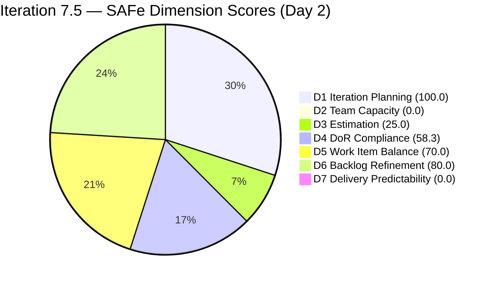
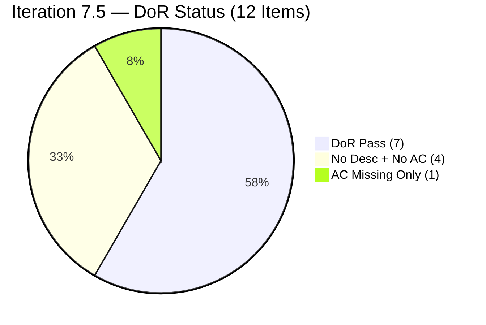
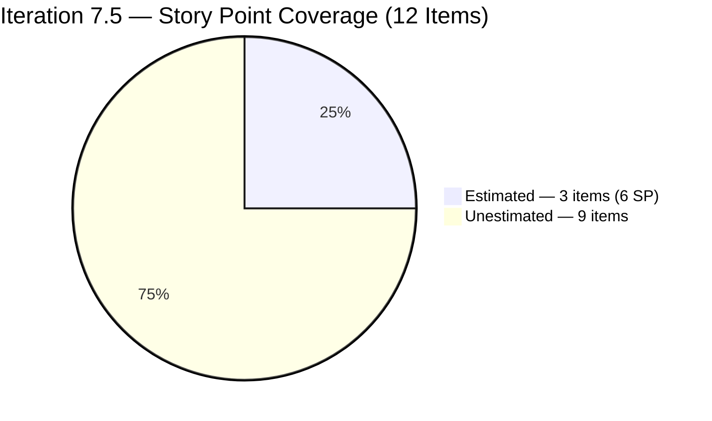
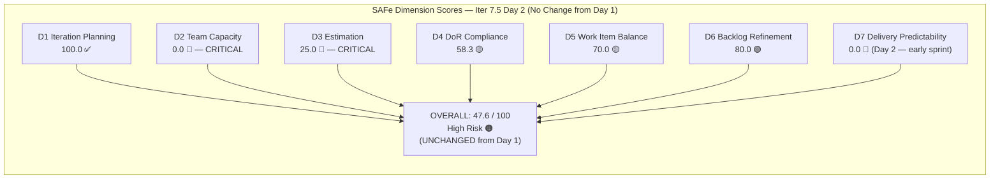

Excellent. Now I have all the data I need. Let me analyze what I found:

**Key observation:** Item #203605 ("Complete Claude CPN 4 Courses and get Certification") is a **Task** type — it is in the iteration but NOT in the backlog API response (backlog excludes Tasks). So it is a child task, not a root-level backlog item.

The backlog shows 12 root-level items (same as yesterday). The iteration query returns 13 items but #203605 is a Task — excluded from VRBI/CIRI counts per rubric.

Now let me compute all dimensions:

**Data summary:**

Root items from backlog (VRBI = 12):
1. #205174 - Spike - New - No SP - Desc: "To present the Employee benefits and incentive report." (54 chars stripped) - No AC - Changed: 2026-05-31
2. #205010 - User Story - New - 2 SP - Desc: ✅ - AC: ✅ - Changed: 2026-05-25
3. #205244 - User Story - New - 2 SP - Desc: ✅ - AC: ✅ - Changed: 2026-05-31
4. #205011 - User Story - New - 2 SP - Desc: ✅ - AC: ✅ - Changed: 2026-05-25
5. #205071 - User Story - New - No SP - Desc: ✅ - AC: ✅ - Changed: 2026-05-28
6. #205072 - User Story - New - No SP - Desc: ✅ - AC: ✅ - Changed: 2026-05-28
7. #205073 - User Story - New - No SP - Desc: ✅ - AC: ✅ - Changed: 2026-05-28
8. #205075 - User Story - New - No SP - Desc: ✅ - AC: ✅ - Changed: 2026-05-28
9. #205077 - User Story - New - No SP - No Desc - No AC - Changed: 2026-05-27
10. #205079 - User Story - New - No SP - No Desc - No AC - Changed: 2026-05-27
11. #205081 - User Story - New - No SP - No Desc - No AC - Changed: 2026-05-27
12. #205082 - User Story - New - No SP - No Desc - No AC - Changed: 2026-05-27

All 12 items have IterationPath = "Jairosoft FINOPS\2026-PI7\Iteration 7.5" → all in current iteration.

**CIRI = 12, VRBI = 12** — identical to yesterday's audit. No changes overnight.

**Capacity:** work_get_iteration_capacities returned teams a38a9c02 and 1f4b45fa — neither is 248f59a6 (HR team). Team capacity for HR = 0 configured. Same as yesterday.

**D1 — Iteration Planning:** CIRI/VRBI = 12/12 = **100.0**

**D2 — Team Capacity:** CW = 1 (Almera), CC = 0 (no capacity in HR team for iter 7.5) → **0.0**

**D3 — Estimation:** PECI = 12 (all 11 User Stories + 1 Spike), ECI = 3 (#205010, #205011, #205244 with 2SP each) → 3/12 = **25.0**

**D4 — DoR Compliance:**
- #205010: Desc ✅ (200+ chars), AC ✅ (200+ chars) → PASS
- #205011: Desc ✅, AC ✅ → PASS
- #205244: Desc ✅, AC ✅ → PASS
- #205071: Desc ✅, AC ✅ (SMART format) → PASS
- #205072: Desc ✅, AC ✅ → PASS
- #205073: Desc ✅, AC ✅ → PASS
- #205075: Desc ✅, AC ✅ → PASS
- #205077: No Desc, No AC → FAIL
- #205079: No Desc, No AC → FAIL
- #205081: No Desc, No AC → FAIL
- #205082: No Desc, No AC → FAIL
- #205174: Desc "To present the Employee benefits and incentive report." — strip HTML → ~54 chars ✅ (≥30); AC = null → FAIL
DCI = 7, CIRI = 12 → 7/12 = **58.3**

**D5 — Work Item Balance:** User Stories = 11, Spikes = 1; User Story present → no −40; dominant = 11/12 = 91.7% > 60% → −30; spike = 8.3% ≤ 40% → no −20. Score = max(0, 100−30) = **70.0**

**D6 — Backlog Refinement:**
- Fresh (ChangedDate ≥ 2026-04-18, i.e., within last 45 days from 2026-06-02): All 12 items changed in May 2026 → fresh = 12. Base = 100.0
- Stale_90 (< 2026-03-04): 0 items → 0% → no penalty
- Stale_180 (< 2025-12-04): 0 items → no penalty
- Untouched (ChangedDate < iteration start 2026-06-01): All 12 items were last changed before 2026-06-01 → untouched = 12/12 = 100% > 30% → −20
- Total penalty = 20
- Score = max(0, 100.0 − 20) = **80.0**

**D7 — Delivery Predictability:** CSP = 6 (SP on estimated items: 2+2+2), CLSP = 0 (all items New) → 0/6 = **0.0**
- Today is Day 2 of 14 — early sprint, low delivery expected.

**Overall = (100.0 + 0.0 + 25.0 + 58.3 + 70.0 + 80.0 + 0.0) / 7 = 333.3 / 7 = 47.6**

No changes from yesterday's audit (#76). The score is identical at **47.6 — High Risk**, same state persists on Day 2.

Now let me compose the full report:

# ADO SAFe Audit — HR Recruitment Team

**Audit Date:** 2026-06-02 (UTC)
**Report File:** AUDIT_20260602_0900.md
**Audit Number:** #77

---

## 1. Audit Metadata

| Field | Value |
|-------|-------|
| Audit Number | #77 |
| Audit Date | 2026-06-02 |
| Audit Time | 09:00 UTC |
| Iteration | Iteration 7.5 |
| Iteration Dates | 2026-06-01 – 2026-06-14 |
| Sprint Day | Day 2 of 14 |
| ADO Project | Jairosoft FINOPS (`e0bb302f-40f9-46c3-8164-6f1acb317d63`) |
| ADO Team | Human Resource Recruitment Team (`248f59a6-372c-4b74-8129-9eaf260f211e`) |
| Iteration ID | `3b355811-2941-4edf-a8b1-7ffcdb478f9d` |
| Iteration Path | `Jairosoft FINOPS\2026-PI7\Iteration 7.5` |
| Prior Audit | AUDIT_20260601_0203.md (Score: 47.6 — High Risk, Day 1) |
| **Overall Score** | **47.6 / 100** |
| **Risk Band** | **High Risk** |

---

## 2. Executive Summary

Iteration 7.5 is now on **Day 2 of 14** and the scorecard is **unchanged from Day 1 at 47.6 / 100 (High Risk)**. None of the three critical Day-1 remediation actions — setting Almera's capacity, assigning Story Points to 9 unestimated items, or completing DoR for 4 empty stories — have been executed. The backlog is frozen in exactly the state it was in when Audit #76 ran 31 hours ago.

The team starts the working week with the same structural gaps: **D2 Team Capacity = 0.0** (capacity not set), **D3 Estimation = 25.0** (9 of 12 items have no Story Points), **D4 DoR Compliance = 58.3** (5 items fail DoR), and **D7 Delivery Predictability = 0.0** (no items closed — expected through Day 3–4 but becoming a concern by midweek). D1 (100.0) and D6 (80.0) remain strong.

The window to remediate before the score becomes structurally locked is narrowing. With a 14-day sprint and Day 2 already passing without a single state change, the team risks entering the midpoint (Day 7) with a score still in the High Risk band. Almera should prioritize capacity entry and SP assignment today (Monday, Day 2) as the highest-ROI actions — together they can lift the score by approximately 28 points to ~75.6 (Moderate Risk boundary).

---

## 3. Previous Audit Delta

| Metric | Audit #76 (2026-06-01) | Audit #77 (2026-06-02) | Change |
|--------|------------------------|------------------------|--------|
| Sprint Day | Day 1 of 14 | **Day 2 of 14** | +1 day |
| Visible Root Backlog Items (VRBI) | 12 | **12** | No change |
| Items in Current Iteration (CIRI) | 12 | **12** | No change |
| Items State: New | 12 | **12** | No change |
| Items State: Active | 0 | **0** | No change |
| Items State: Closed / Done | 0 | **0** | No change |
| SP Committed (estimated items) | 6 SP | **6 SP** | No change |
| SP Closed | 0 SP | **0 SP** | No change |
| DoR-Compliant Items | 7 | **7** | No change |
| Capacity Configured | No | **No** | No change — CRITICAL |
| D1 — Iteration Planning | 100.0 | **100.0** | No change |
| D2 — Team Capacity | 0.0 | **0.0** | No change — CRITICAL |
| D3 — Estimation | 25.0 | **25.0** | No change — CRITICAL |
| D4 — DoR Compliance | 58.3 | **58.3** | No change |
| D5 — Work Item Balance | 70.0 | **70.0** | No change |
| D6 — Backlog Refinement | 80.0 | **80.0** | No change |
| D7 — Delivery Predictability | 0.0 | **0.0** | No change (Day 2) |
| **Overall Score** | **47.6 (High Risk)** | **47.6 (High Risk)** | **No change** |

### Interpretation

Zero progress was recorded overnight from Day 1 to Day 2. This is a complete stall: no items were updated, no capacity was entered, no Story Points were assigned, and no DoR gaps were closed. While D7 = 0.0 remains expected through early sprint days, the persistence of D2 = 0.0 and D3 = 25.0 without any remediation after explicit Day-1 recommendations is a concern. The D6 untouched penalty (−20) will persist until Almera begins actively updating items — activating even one item would start reducing that penalty.

---

## 4. Current Iteration Snapshot

**Iteration 7.5** · 2026-06-01 – 2026-06-14 · **Day 2 of 14** · 12 days remaining

| Field | Value |
|-------|-------|
| Total Visible Root Backlog Items (VRBI) | 12 |
| Items in Iteration 7.5 (CIRI) | 12 |
| Items State: New | 12 |
| Items State: Active | 0 |
| Items State: Closed / Done | 0 |
| SP Committed (estimated items only) | 6 SP (#205010, #205011, #205244 — 2 SP each) |
| SP Burned | 0 SP |
| SP Remaining (potential if all estimated) | 6 SP committed; 9 items unestimated |
| Distinct Assignees (CIRI) | 1 (Almera Kleer Tayao) |
| Formal Capacity Configured | Not set (capacity API returns no HR team entry) |
| Sprint Day | 2 of 14 |
| Days Remaining | 12 |
| Task in Iteration (excluded from rubric) | #203605 (Task type — "Complete Claude CPN 4 Courses") |

---

## 5. Work Item Analysis

All 12 root-level items remain in "New" state, unchanged from Day 1. DoR assessed by stripping HTML markup and counting non-whitespace characters (Desc ≥ 30, AC ≥ 20).

| ID | Title | Type | State | SP | Assignee | DoR | ChangedDate |
|----|-------|------|-------|----|----------|-----|-------------|
| 205010 | APE - Caumban, Karl Jordan (Analysis and Interpretation) | User Story | New | 2 | Almera | ✅ Pass | 2026-05-25 |
| 205011 | APE - Rommel Senillo - Summary (Analysis & Interpretation) | User Story | New | 2 | Almera | ✅ Pass | 2026-05-25 |
| 205244 | APE - Caumban, Karl Jordan (Gathering of accomplished APE) | User Story | New | 2 | Almera | ✅ Pass | 2026-05-31 |
| 205071 | Ressa's New Job Title as QA | User Story | New | — | Almera | ✅ Pass | 2026-05-28 |
| 205072 | Jerlyn's New Job Title as QA | User Story | New | — | Almera | ✅ Pass | 2026-05-28 |
| 205073 | Mary's New Job Title as QA | User Story | New | — | Almera | ✅ Pass | 2026-05-28 |
| 205075 | Luz's New Job Title as QA | User Story | New | — | Almera | ✅ Pass | 2026-05-28 |
| 205077 | Jaz's New Job Title as PO | User Story | New | — | Almera | ❌ Fail (no Desc, no AC) | 2026-05-27 |
| 205079 | Ressa's New Job Title as PO | User Story | New | — | Almera | ❌ Fail (no Desc, no AC) | 2026-05-27 |
| 205081 | Jerlyn's New Job Title as PO | User Story | New | — | Almera | ❌ Fail (no Desc, no AC) | 2026-05-27 |
| 205082 | Karl's New Job Title as PMO Manager | User Story | New | — | Almera | ❌ Fail (no Desc, no AC) | 2026-05-27 |
| 205174 | Findings presentation to Ramon | Spike | New | — | Almera | ❌ Fail (Desc ✅; AC missing) | 2026-05-31 |

**DoR Summary:**
- Pass: 7 items (#205010, #205011, #205244, #205071, #205072, #205073, #205075)
- Fail: 5 items (#205077, #205079, #205081, #205082 — no Desc/AC; #205174 — AC missing)

**SP Summary:**
- Estimated: 3 items (2+2+2 = 6 SP total)
- Unestimated: 9 items (#205071, #205072, #205073, #205075, #205077, #205079, #205081, #205082, #205174)

**Item Type Breakdown (CIRI):**
- User Story: 11 (91.7%)
- Spike: 1 (8.3%)

**Note on #203605:** A Task ("Complete Claude CPN 4 Courses and get Certification") appears in the iteration query but is excluded from all rubric counts as it is a Task-category item. It is assigned to Almera, state = New, changed 2026-05-28.

---

## 6. SAFe Compliance Scorecard

| Dimension | Score | Evidence (Numerator / Denominator) | Notes |
|-----------|-------|------------------------------------|-------|
| D1 — Iteration Planning | **100.0** | CIRI 12 / VRBI 12 | All 12 backlog items committed to Iter 7.5 |
| D2 — Team Capacity | **0.0** | CC 0 / CW 1 | No capacity configured for HR team in Iter 7.5; Almera has all items but no capacity entry |
| D3 — Estimation | **25.0** | ECI 3 / PECI 12 | Only #205010, #205011, #205244 have SP; 9 items still unestimated |
| D4 — DoR Compliance | **58.3** | DCI 7 / CIRI 12 | 7 items DoR-ready; 4 PO title stories (no Desc/AC) + Spike #205174 (no AC) fail |
| D5 — Work Item Balance | **70.0** | Base 100; penalty B −30 | User Story present ✅; dominant share 91.7% > 60% → −30; Spike 8.3% ≤ 40% → no −20 |
| D6 — Backlog Refinement | **80.0** | Base 100.0; penalty −20 | All 12 fresh (May 2026); 0 stale_90; 0 stale_180; untouched 12/12 (100%) > 30% → −20 |
| D7 — Delivery Predictability | **0.0** | CLSP 0 / CSP 6 | Day 2 — no closures; early-sprint, low delivery expected through Day 4 |

**Overall = (100.0 + 0.0 + 25.0 + 58.3 + 70.0 + 80.0 + 0.0) / 7 = 333.3 / 7 = 47.6 / 100 — High Risk**

---

## 7. Dimension Findings

### D1 — Iteration Planning (100.0) ✅

- VRBI = 12 (backlog API: Microsoft.RequirementCategory, 12 root-level items)
- CIRI = 12 (all items have IterationPath = "Jairosoft FINOPS\2026-PI7\Iteration 7.5")
- Formula: 12 / 12 × 100 = **100.0**
- All 12 visible backlog items are committed to the current iteration. Planning is complete; no items are sitting in the general backlog unassigned. This is the team's strongest dimension and has been at 100 since sprint start.

### D2 — Team Capacity (0.0) 🔴

- CW (distinct non-empty assignees on CIRI) = 1 (Almera Kleer Tayao only)
- CC: `work_get_iteration_capacities` for Iter 7.5 returned capacity for teams `a38a9c02` and `1f4b45fa` only — the HR team (`248f59a6`) is absent. `work_get_team_capacity` returns no capacity for the HR team. CC = 0.
- Formula: CC / CW × 100 = 0 / 1 × 100 = **0.0**
- This is the second consecutive day with no capacity entered. Setting capacity would immediately move D2 to 100.0 and lift the overall score by +14.3 points (from 47.6 to ~61.9, crossing into Moderate Risk).

### D3 — Estimation (25.0) 🔴

- PECI = 12 (11 User Stories + 1 Spike — all types that expose Story Points)
- ECI = 3 (#205010 = 2 SP, #205011 = 2 SP, #205244 = 2 SP)
- Formula: 3 / 12 × 100 = **25.0**
- The 9 unestimated items have not changed since Day 1. Items #205071–205075 (QA role stories) have full DoR content and are ready to estimate; items #205077–205082 (PO role stories) and #205174 (Spike) need both DoR content and SP assignment. Completing all 9 SP gaps would bring D3 to 100.0 (+10.7 points to overall).

### D4 — DoR Compliance (58.3) 🟡

- CIRI = 12; DCI = 7
- PASS (7): #205010, #205011, #205244 (APE stories with full Desc + 5-item AC list), #205071, #205072, #205073, #205075 (QA role stories with SMART AC format — Desc ~120 chars, AC ~600+ chars)
- FAIL (5):
  - #205077 (Jaz as PO): No Description field, no Acceptance Criteria field — both null
  - #205079 (Ressa as PO): Same — both null
  - #205081 (Jerlyn as PO): Same — both null
  - #205082 (Karl as PMO Manager): Same — both null
  - #205174 (Spike — Findings presentation): Desc = "To present the Employee benefits and incentive report." (54 chars stripped ✅); AC = null ❌
- Formula: 7 / 12 × 100 = **58.3**
- The QA role stories (#205071–205075) serve as a template: copy the SMART AC structure to the four PO stories, substituting the relevant names and PO/PMO responsibilities.

### D5 — Work Item Balance (70.0) 🟡

- CIRI = 12; User Story = 11 (91.7%); Spike = 1 (8.3%)
- Penalty A: User Story type present → no −40
- Penalty B: dominant share = 91.7% > 60% → apply −30
- Penalty C: Spike share = 8.3% ≤ 40% → no −20
- Formula: max(0, 100 − 30) = **70.0**
- The high User Story concentration is structurally expected for a single-contributor HR team. The dominant-type penalty is inherent to the team's work profile and cannot be easily diversified. Score is stable.

### D6 — Backlog Refinement (80.0) 🟢

- VRBI = 12; fresh (ChangedDate ≥ 2026-04-18) = 12 → base = 100.0
- Stale_90 (< 2026-03-04): 0 → no penalty
- Stale_180 (< 2025-12-04): 0 → no penalty
- Untouched current items (ChangedDate < 2026-06-01 iteration start): All 12 items were last touched before June 1 → untouched = 12/12 = 100% > 30% → −20
- Formula: max(0, 100.0 − 20) = **80.0**
- Note: The untouched penalty persists because no items have been activated or updated since sprint start. As soon as Almera moves even one item to Active state or updates it, the untouched ratio will decrease. By Day 3, at least 1–2 items should be Active, dropping untouched to ≤10/12 (83%) — still above 30%, so the −20 persists until at least 4 items are touched (untouched ≤ 30%).

### D7 — Delivery Predictability (0.0) 🔴

- CSP = 6 (SP on estimated items: 205010=2, 205011=2, 205244=2)
- CLSP = 0 (no items Closed or Done; all 12 in "New" state)
- Formula: 0 / 6 × 100 = **0.0**
- **Early-sprint annotation (Day 2 of 14):** Zero delivery is expected through Day 3–4. However, by Day 5 (Saturday June 6), at least one item should be transitioning to Closed to show meaningful velocity. The APE Gathering story (#205244) is the most likely first closure given its scope. If D3 gaps are not filled, D7 maximum is capped at 100.0 × (6/6) = 100.0 — but the sprint-end score will remain penalized if 9 items close with 0 SP counted.

---

## 8. Risks and Bottlenecks

| Risk | Severity | Status | Details |
|------|----------|--------|---------|
| No capacity configured for Iter 7.5 | **CRITICAL** | Unresolved (Day 2) | D2 = 0.0; Almera's capacity must be entered in ADO. Second day without action on highest-ROI fix. |
| 9 of 12 items unestimated (SP = null) | **CRITICAL** | Unresolved (Day 2) | D3 = 25.0; QA stories (#205071–205075) are DoR-ready and need SP only; PO stories and Spike need both DoR + SP. |
| 4 items have no Description or AC | **HIGH** | Unresolved (Day 2) | D4 = 58.3; #205077, #205079, #205081, #205082 are commit-blocking. QA stories serve as copy templates. |
| Spike #205174 missing Acceptance Criteria | **HIGH** | Unresolved (Day 2) | Desc present (54 chars ✅); AC null. Spike cannot be properly scoped/time-boxed without AC. |
| No items activated (all New) on Day 2 | **HIGH** | New risk | Zero velocity signal; by Day 3 at least 1–2 items should be Active or in progress. |
| D6 untouched penalty (-20) persists | **MODERATE** | Day-2 artifact | Will not resolve until ≥4 items are touched/activated (bring untouched to ≤30%). |
| No iteration goal defined | **HIGH** | Persistent (23rd audit) | No formal sprint goal for Iter 7.5; the sprint narrative is clear but not documented in ADO. |
| Bus factor = 1 (Almera only) | **MODERATE** | Structural/unchanged | All 12 items assigned to Almera; Grace has 0 capacity; single-point-of-failure. |
| D7 = 0.0 (Day 2) | **LOW** | Expected | No closures yet — acceptable through Day 4; becomes a concern from Day 5 onward. |
| User Story dominance = 91.7% | **LOW** | Structural | Triggers D5 −30 penalty; inherent to HR team profile; not actionable. |

---

## 9. Prioritized Recommendations

1. **Set Almera's capacity in ADO for Iteration 7.5 — TODAY (Day 2, CRITICAL).** This was the top recommendation on Day 1 and has not been acted on. Navigate to ADO → HR Recruitment Team → Iteration 7.5 → Capacity. Enter Almera's daily capacity (5.25 hrs/day based on prior iterations). This single action restores D2 from 0.0 to 100.0, adding 14.3 points to the overall score and pushing from High Risk (47.6) to Moderate Risk (~61.9). Zero-effort, maximum-impact action available right now.

2. **Assign Story Points to QA role stories #205071, #205072, #205073, #205075 — TODAY (Day 2, CRITICAL).** These four stories are fully DoR-ready (Desc + SMART AC both present) and only need SP. Suggested: 1–2 SP each (8 similar job-reclassification stories in PI6 averaged 1.5 SP). Completing SP on these 4 items moves ECI from 3 to 7. Combined with Rec #1, the score would reach ~69.0 (upper Moderate Risk).

3. **Write Desc + AC for #205077, #205079, #205081, #205082, then assign SP (TODAY, Day 2, CRITICAL).** The QA role stories provide a ready-made template. For each PO title story: (a) copy the Description pattern substituting "PO" role context and the employee's name; (b) copy the SMART AC structure, adjusting responsibilities to PO/PMO scope (product ownership, stakeholder liaison, backlog ownership); (c) assign SP (suggest 1–2 SP each). Completing all four would bring DCI to 11, pushing D4 to 91.7 (+11.1 points contribution).

4. **Add Acceptance Criteria to Spike #205174 (TODAY, Day 2, HIGH).** The Desc is already present (54 chars ✅). Add AC specifying: presentation format, minimum content sections, audience (Ramon), and a specific deliverable. Suggested: "Presentation (minimum 5 slides or equivalent document) covering: (1) employee benefits inventory, (2) incentive benchmarks vs. industry, (3) 3+ actionable recommendations — reviewed and signed off by Ramon within Iteration 7.5." This brings DCI to 8 immediately (before PO stories are fixed) and satisfies the spike scoping requirement.

5. **Activate at least 2 items today to begin velocity signal (Day 2, HIGH).** All 12 items remain in "New" state. Move the 2 APE stories (#205244 Gathering, #205010 Analysis — which depend on each other in sequence) to "Active" to show in-progress work. This also reduces the D6 untouched count and begins building toward D7 recovery.

6. **Define a sprint goal for Iteration 7.5 (Day 2, HIGH — 23rd consecutive audit without one).** Suggested goal: *"Complete APE documentation for Caumban and Senillo, finalize AI-augmented QA role reclassifications for 4 staff, complete PO/PMO title updates for 4 staff, and deliver employee benefits findings to Ramon — all within PI7 Iteration 7.5."* Enter in ADO iteration description or link to a wiki page.

7. **Validate dependency sequencing for #205244 → #205010 (MODERATE).** APE Gathering (#205244) must logically complete before APE Analysis (#205010) for Karl Jordan Caumban. Ensure a dependency link exists in ADO and that #205244 is prioritized first in the sprint queue.

---

## 10. Evidence Gaps and Limitations

| Gap | Impact | Notes |
|-----|--------|-------|
| No team capacity for HR team in Iter 7.5 | D2 = 0.0 forced | `work_get_iteration_capacities` returned data for teams `a38a9c02` and `1f4b45fa` only — HR team `248f59a6` absent. Same as Day 1. |
| 9 items with SP = null | D3 = 25.0 (not 100.0) | Items #205071–205075, #205077–205082, #205174: all confirmed null via batch API. |
| 4 items with no Desc or AC | D4 reduced | #205077, #205079, #205081, #205082: Description and AcceptanceCriteria fields absent from API response (not API error; fields genuinely empty). |
| #205174 AC is null | D4 contributing failure | Desc confirmed 54 chars stripped; AC field not present in response. |
| All 12 items pre-dated sprint start (untouched) | D6 −20 penalty | No items activated or modified since sprint start on 2026-06-01. Penalty will persist until ≥4 items are updated/activated. |
| D7 = 0.0 (Day 2) | Expected early-sprint state | All 12 items in "New" state. No closures. D7 recovery begins when items move to Closed/Done. |
| No iteration goal in ADO | D1 quality context incomplete | Sprint goal absent for 23rd consecutive audit. |
| No PI objectives linked | Cross-cutting context absent | Persistent since PI6. |
| #203605 (Task) in iteration | Excluded from counts | Task type excluded from VRBI/CIRI per rubric. Not a root-level backlog item. |
| Grace team member | D2 not affected | Grace listed on team with 0 capacity and no items; correctly excluded from CW/CC. |

---

## Visualizations

### Score Trend — Recent History (Iter 7.4 → 7.5)

| Date | Audit | Score | Band | Notable |
|------|-------|-------|------|---------|
| May 25 | #70 | 80.0 | Low | Sprint 7.4 peak start |
| May 26 | #71 | 85.4 | Low | 2 closures (4 SP) |
| May 28 | #73 | 82.0 | Low | D1 decline from 7.5 burst items |
| May 29 | #74 | 73.6 | Moderate | D7 = 0.0, 2 items Active |
| May 30 | #75 | 14.3 | Critical | Sprint-completion artifact |
| Jun 1 | #76 | 47.6 | High | Iter 7.5 Day 1 — planning gaps |
| **Jun 2** | **#77** | **47.6** | **High** | **Day 2 — zero remediation overnight** |

### Projected Score if Day-2 Actions Completed

| Scenario | D2 | D3 | D4 | Overall | Band |
|----------|-----|-----|-----|---------|------|
| Current (no action) | 0.0 | 25.0 | 58.3 | **47.6** | High |
| + Capacity only | 100.0 | 25.0 | 58.3 | **61.9** | Moderate |
| + Capacity + 4 QA SPs | 100.0 | 58.3 | 58.3 | **69.5** | Moderate |
| + Capacity + all 9 SPs | 100.0 | 100.0 | 58.3 | **72.6** | Moderate |
| + Full remediation (all gaps) | 100.0 | 100.0 | 91.7 | **77.4** | Moderate |
| + Full remediation + 1 item closed | 100.0 | 100.0 | 91.7 | **~82.9** | Low |

---

*Audit #77 generated by Claude Code (claude-sonnet-4-6) on 2026-06-02 09:00 UTC. Evidence sourced from Azure DevOps MCP (Jairosoft FINOPS project, team 248f59a6). Rubric: SAFe 6.0 7-dimension scorecard v1. Iteration 7.5 is Day 2 of 14 — D7 = 0.0 remains an expected early-sprint state. Score is identical to Day 1 (47.6, High Risk) due to zero remediation activity overnight. Priority actions: set capacity + assign SP + complete DoR for PO stories.*
