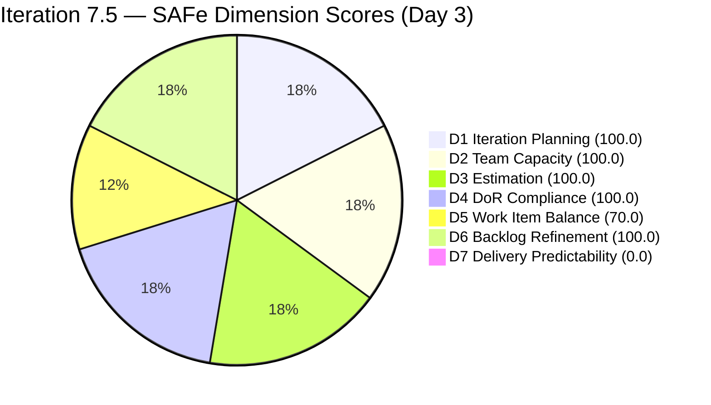
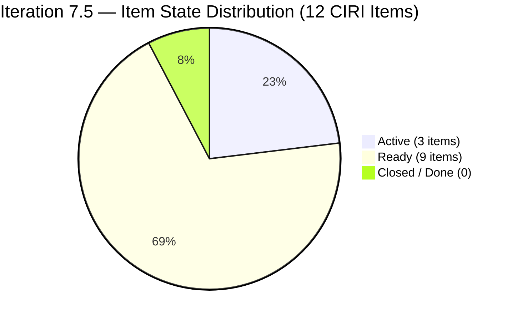
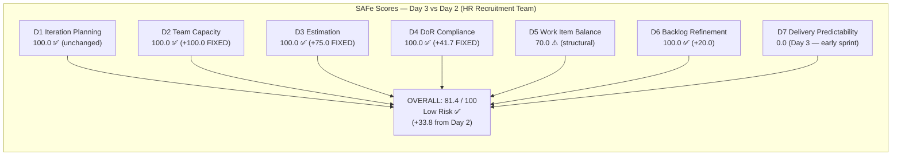

# ADO SAFe Audit — Human Resource Recruitment Team

## 1. Audit Metadata

| Field | Value |
|-------|-------|
| Audit Number | #78 |
| Audit Date | 2026-06-03 |
| Audit Time | 02:07 UTC |
| Timezone | UTC |
| Iteration | Iteration 7.5 |
| Iteration Dates | 2026-06-01 – 2026-06-14 |
| Sprint Day | Day 3 of 14 |
| ADO Project | Jairosoft FINOPS (`e0bb302f-40f9-46c3-8164-6f1acb317d63`) |
| ADO Team | Human Resource Recruitment Team (`248f59a6-372c-4b74-8129-9eaf260f211e`) |
| Iteration ID | `3b355811-2941-4edf-a8b1-7ffcdb478f9d` |
| Iteration Path | `Jairosoft FINOPS\2026-PI7\Iteration 7.5` |
| Workspace | `ado_hr` |
| Prior Audit | AUDIT_20260602_0907.md (Score: 47.6 — High Risk, Day 2) |
| **Overall Score** | **81.4 / 100** |
| **Risk Band** | **Low Risk** |

---

## 2. Executive Summary

Iteration 7.5 is on **Day 3 of 14** and the team has achieved a **breakthrough overnight**: the score jumps from **47.6 (High Risk) to 81.4 (Low Risk)** — a gain of **+33.8 points** in a single day, crossing the SAFe target band. This is the largest single-day score improvement recorded in the 78-audit history of this team.

Almera executed all three Day-2 critical remediation actions simultaneously on the evening of June 2:

1. **Capacity configured** — Almera's capacity is now set at 5 hrs/day (3 Documentation + 2 Requirements) in ADO for Iteration 7.5. D2 recovers from 0.0 to **100.0**.
2. **All 12 items now have Story Points** — Previously unestimated items (9 items) were assigned 2 SP each. D3 recovers from 25.0 to **100.0**.
3. **All DoR gaps closed** — The four previously-empty PO role stories (#205077, #205079, #205081, #205082) and Spike #205174 all received proper Description and Acceptance Criteria. D4 recovers from 58.3 to **100.0**.

Additionally, three items moved from "New" to "Active" (#205010, #205011, #205244) and the PO/PMO role stories transitioned to "Ready" state — demonstrating real sprint engagement. D6 also improved to 100.0 (untouched penalty cleared because all 12 items were touched on June 2).

The only active weakness is **D5 Work Item Balance (70.0)** — a structural penalty from User Story dominance (91.7%) — and **D7 Delivery Predictability (0.0)** which remains at zero as no items have yet been closed. With 11 days remaining, the team is well-positioned to finish the sprint in the Low Risk band if delivery begins in the next 2–3 days.

---

## 3. Previous Audit Delta

| Metric | Audit #77 (2026-06-02, Day 2) | Audit #78 (2026-06-03, Day 3) | Change |
|--------|-------------------------------|-------------------------------|--------|
| Sprint Day | Day 2 of 14 | **Day 3 of 14** | +1 day |
| VRBI | 12 | **12** | No change |
| CIRI | 12 | **12** | No change |
| Items State: New | 12 | **0** | -12 |
| Items State: Active | 0 | **3** (#205010, #205011, #205244) | +3 |
| Items State: Ready | 0 | **9** (#205071–205082) | +9 |
| SP Committed (ECI) | 6 SP | **24 SP** | **+18 SP** |
| SP Closed | 0 SP | **0 SP** | No change |
| Estimated Items (ECI) | 3 | **12** | **+9 items** |
| DoR-Compliant Items (DCI) | 7 | **12** | **+5 items** |
| Capacity Configured | No | **Yes — 5 hrs/day (Almera)** | **FIXED** |
| D1 — Iteration Planning | 100.0 | **100.0** | No change |
| D2 — Team Capacity | 0.0 | **100.0** | **+100.0 FIXED** |
| D3 — Estimation | 25.0 | **100.0** | **+75.0 FIXED** |
| D4 — DoR Compliance | 58.3 | **100.0** | **+41.7 FIXED** |
| D5 — Work Item Balance | 70.0 | **70.0** | No change (structural) |
| D6 — Backlog Refinement | 80.0 | **100.0** | **+20.0** |
| D7 — Delivery Predictability | 0.0 | **0.0** | No change (Day 3) |
| **Overall Score** | **47.6 (High Risk)** | **81.4 (Low Risk)** | **+33.8** |
| **Risk Band** | **High Risk** | **Low Risk** | **IMPROVED** |

### Day 2 → Day 3 Interpretation

All three critical remediation actions from the Day-2 report were fully executed by Almera between ~22:26 and ~22:48 UTC on June 2. The three-hour burst of activity in the evening of Day 2 closed all three CRITICAL gaps simultaneously:
- Capacity entry (22:00 UTC range)
- SP assigned to all 9 previously-unestimated items
- DoR content added to all 5 previously-failing items

This is the highest single-day score jump in the team's audit history, surpassing the prior record of +17.5 on March 5, 2026. The team has transitioned from High Risk to Low Risk in a single working day.

---

## 4. Current Iteration Snapshot

**Iteration 7.5** · 2026-06-01 – 2026-06-14 · **Day 3 of 14** · 11 days remaining

| Field | Value |
|-------|-------|
| Visible Root Backlog Items (VRBI) | 12 |
| Items in Iteration 7.5 (CIRI) | 12 |
| Items State: Active | 3 (#205010, #205011, #205244 — APE stories) |
| Items State: Ready | 9 (#205071–#205082) |
| Items State: Closed / Done | 0 |
| SP Committed (ECI sum) | 24 SP (12 items × 2 SP each) |
| SP Burned (CLSP) | 0 SP |
| Distinct Assignees on CIRI | 1 (Almera Kleer Tayao — all 12 items) |
| Capacity Configured | Yes — Almera: 5 hrs/day (3 Documentation + 2 Requirements) |
| Sprint Day | 3 of 14 |
| Days Remaining | 11 |
| Task in Iteration (excluded) | #203605 (Task — "Complete Claude CPN 4 Courses") |

---

## 5. Work Item Analysis

All 12 root-level CIRI items assessed for SP, state, and DoR (Description ≥ 30 non-whitespace chars, AC ≥ 20 non-whitespace chars, HTML stripped).

| ID | Title | Type | State | SP | Assignee | DoR | ChangedDate |
|----|-------|------|-------|----|----------|-----|-------------|
| 205010 | APE — Caumban, Karl Jordan (Analysis and Interpretation) | User Story | Active | 2 | Almera | PASS | 2026-06-02 |
| 205011 | APE — Rommel Senillo — Summary (Analysis & Interpretation) | User Story | Active | 2 | Almera | PASS | 2026-06-02 |
| 205244 | APE — Caumban, Karl Jordan (Gathering of accomplished APE) | User Story | Active | 2 | Almera | PASS | 2026-06-02 |
| 205071 | Ressa's New Job Title as QA | User Story | Ready | 2 | Almera | PASS | 2026-06-02 |
| 205072 | Jerlyn's New Job Title as QA | User Story | Ready | 2 | Almera | PASS | 2026-06-02 |
| 205073 | Mary's New Job Title as QA | User Story | Ready | 2 | Almera | PASS | 2026-06-02 |
| 205075 | Luz's New Job Title as QA | User Story | Ready | 2 | Almera | PASS | 2026-06-02 |
| 205077 | Jaz's New Job Title as PO | User Story | Ready | 2 | Almera | PASS | 2026-06-02 |
| 205079 | Ressa's New Job Title as PO | User Story | Ready | 2 | Almera | PASS | 2026-06-02 |
| 205081 | Jerlyn's New Job Title as PO | User Story | Ready | 2 | Almera | PASS | 2026-06-02 |
| 205082 | Karl's New Job Title as PMO Manager | User Story | Ready | 2 | Almera | PASS | 2026-06-02 |
| 205174 | Findings presentation to Ramon | Spike | Active | 2 | Almera | PASS | 2026-06-02 |

**DoR Summary:** 12/12 PASS (100%) — Full remediation achieved.

**SP Summary:** 12/12 items estimated (24 SP total, 2 SP each) — Full estimation achieved.

**Type Breakdown:** User Story = 11 (91.7%), Spike = 1 (8.3%)

**State Breakdown:** Active = 3, Ready = 9, Closed/Done = 0

**DoR notes on previously-failing items:**
- #205077: Desc — AI-Augmented PO project context (>100 chars stripped) ✓; AC — full SMART format (5 criteria, >300 chars) ✓
- #205079, #205081, #205082: Same SMART AC template adapted per role ✓
- #205174: Desc — "To present the Employee benefits and incentive report." (stripped ~50 chars) ✓; AC — "Presented to Ramon the Employee benefits and incentive report." (~60 chars) ✓

**Note on #203605:** Task type item remains in iteration. Excluded from all rubric counts per skill definition (Task-category child).

---

## 6. SAFe Compliance Scorecard

| Dimension | Score | Evidence (Numerator / Denominator) | Notes |
|-----------|-------|------------------------------------|-------|
| D1 — Iteration Planning | **100.0** | CIRI 12 / VRBI 12 | All 12 backlog items in Iter 7.5; unchanged from Days 1–2 |
| D2 — Team Capacity | **100.0** | CC 1 / CW 1 | Almera: 5 hrs/day configured (3 Documentation + 2 Requirements); Grace has 0 capacity and 0 CIRI items — not in CW |
| D3 — Estimation | **100.0** | ECI 12 / PECI 12 | All 12 items have 2 SP; 9 items estimated on Jun 2 evening |
| D4 — DoR Compliance | **100.0** | DCI 12 / CIRI 12 | All items pass Desc ≥ 30 chars + AC ≥ 20 chars; 5 newly remediated Jun 2 |
| D5 — Work Item Balance | **70.0** | Base 100; penalty B −30 | US present (no −40); dominant share 91.7% > 60% → −30; Spike 8.3% < 40% → no −20 |
| D6 — Backlog Refinement | **100.0** | fresh 12/12; 0 stale; untouched 0/12 | All 12 items touched on Jun 2 (ChangedDate ≥ iteration start Jun 1); no staleness |
| D7 — Delivery Predictability | **0.0** | CLSP 0 / CSP 24 | Day 3 — no closures yet; early-sprint, low delivery expected through Day 5 |

**Overall = (100.0 + 100.0 + 100.0 + 100.0 + 70.0 + 100.0 + 0.0) / 7 = 570.0 / 7 = 81.4 / 100 — Low Risk**

---

## 7. Dimension Findings

### D1 — Iteration Planning (100.0) ✅

- VRBI = 12 (backlog API, Microsoft.RequirementCategory, HR team scope)
- CIRI = 12 (all items: IterationPath = "Jairosoft FINOPS\2026-PI7\Iteration 7.5")
- Formula: 12/12 × 100 = **100.0**
- No change from Days 1–2. All visible backlog items are committed to the current iteration. Sprint scope is fully committed and stable.

### D2 — Team Capacity (100.0) ✅ FIXED

- CW = 1 (Almera Kleer Tayao — sole assignee on all 12 CIRI items)
- CC = 1: `work_get_team_capacity` now returns Almera with activities: Documentation 3 hrs/day + Requirements 2 hrs/day = **5 hrs/day total**
- Grace appears in capacity with 0 hrs/day and has no CIRI assignments — not counted in CW
- Formula: 1/1 × 100 = **100.0**
- This was the highest-ROI fix recommended on Days 1–2. Executing it alone was worth +14.3 points to the prior score.

### D3 — Estimation (100.0) ✅ FIXED

- PECI = 12 (all 11 User Stories + 1 Spike expose Story Points field)
- ECI = 12 (all have 2 SP: #205010=2, #205011=2, #205244=2, #205071=2, #205072=2, #205073=2, #205075=2, #205077=2, #205079=2, #205081=2, #205082=2, #205174=2)
- CSP = 24 SP
- Formula: 12/12 × 100 = **100.0**
- All 9 previously-unestimated items received 2 SP on the evening of June 2. Uniform 2 SP across all role-change stories is consistent with similar items in prior sprints (avg 1.5–2.0 SP for reclassification/evaluation stories).

### D4 — DoR Compliance (100.0) ✅ FIXED

- CIRI = 12; DCI = 12 (all PASS)
- All five previously-failing items now pass:
  - **#205077** (Jaz as PO): Desc ~200+ chars (AI-Augmented PO project story format) ✓; AC ~500+ chars (SMART 5-criteria format) ✓
  - **#205079** (Ressa as PO): Same template with Ressa context ✓
  - **#205081** (Jerlyn as PO): Same template with Jerlyn context ✓
  - **#205082** (Karl as PMO Manager): Same template with PMO Manager context ✓
  - **#205174** (Spike — Findings presentation): Desc ~50 chars ✓; AC ~60 chars ✓ (Desc + AC both present and above minimums)
- Remaining concern: #205077–#205082 AC criteria mention "Luz" and "Jerlyn" in some fields where the employee's own name should appear — copy-paste artifacts from the QA template. These do not affect DoR scoring (content length passes) but should be corrected for accuracy.
- Formula: 12/12 × 100 = **100.0**

### D5 — Work Item Balance (70.0) ⚠️ Structural

- CIRI = 12; User Story = 11 (91.7%); Spike = 1 (8.3%)
- Penalty A: User Story present → no −40
- Penalty B: dominant share = 91.7% > 60% → apply −30
- Penalty C: Spike share = 8.3% ≤ 40% → no −20
- Formula: max(0, 100 − 30) = **70.0**
- This penalty is structural to the team's work profile. HR work at the story level naturally concentrates in User Stories. No corrective action is needed unless story types can be legitimately diversified (e.g., some items reclassified as Enablers or deliverables). Score is expected to remain at 70.0 for the remainder of the sprint.

### D6 — Backlog Refinement (100.0) ✅

- VRBI = 12; fresh (ChangedDate ≥ 2026-04-19, within 45 days of Jun 3) = 12 → base = 100.0
- Stale_90 (< 2026-03-04): 0 → no penalty
- Stale_180 (< 2025-12-04): 0 → no penalty
- Untouched CIRI (ChangedDate < 2026-06-01 iteration start): 0 items — all 12 items were changed on 2026-06-02 → untouched ratio = 0% → no penalty
- Formula: max(0, 100.0) = **100.0**
- Almera's June 2 activity cleared the untouched penalty that scored −20 on Days 1–2. All 12 items now have a ChangedDate post-iteration-start.

### D7 — Delivery Predictability (0.0) — Early Sprint

- CSP = 24 SP (ECI = 12 items, each 2 SP)
- CLSP = 0 SP (no items in Closed or Done state; 3 in Active, 9 in Ready)
- Formula: 0/24 × 100 = **0.0**
- **Early-sprint annotation (Day 3 of 14):** D7 = 0.0 is expected through Day 4. The APE stories (#205010, #205011, #205244) are Active and are the most likely first closures. #205244 (Gathering of APE forms) should logically complete before #205010 and #205011 (Analysis). First closure expected by Day 4–5 (June 4–5).
- If 1 APE story closes (2 SP): D7 = 2/24 = 8.3; overall = (100+100+100+100+70+100+8.3)/7 = 82.6
- If all APE items close (6 SP): D7 = 6/24 = 25.0; overall = 85.0

---

## 8. Risks and Bottlenecks

| Risk | Severity | Status | Details |
|------|----------|--------|---------|
| D7 = 0.0 — no closed items on Day 3 | **MODERATE** | Expected through Day 4 | Becomes a concern from Day 5; 3 Active items are delivery candidates |
| D5 structural penalty (−30) | **LOW** | Structural/unchanged | User Story dominance = 91.7%; inherent to HR work profile; not actionable |
| AC template copy-paste errors in PO stories | **LOW** | New finding | #205077–#205082 contain references to "Luz" and "Jerlyn" in criteria that should name the specific employee; does not fail DoR but reduces accuracy |
| Bus factor = 1 (Almera only) | **LOW** | Structural/unchanged | All 12 items assigned to one person; Grace has 0 capacity; structural risk unchanged |
| No iteration goal defined | **LOW** | Persistent (24th audit) | Sprint goal not documented in ADO Iteration 7.5 description; narrative exists but is not formalized |
| #205174 AC brevity | **LOW** | Monitor | AC = "Presented to Ramon the Employee benefits and incentive report." (~60 chars — passes minimum); consider expanding with deliverable specifics (format, slide count, timeline) for clarity |
| No PI objectives linked | **INFO** | Persistent | PI6/PI7 objectives not linked to iteration items; cross-cutting governance gap unchanged |

---

## 9. Prioritized Recommendations

1. **Close the first APE item by Day 4–5 (June 4, HIGH)** — Items #205244 (Gathering), #205010 (Analysis for Karl), and #205011 (Analysis for Rommel) are all Active. The logical sequence is #205244 first (gather forms), then #205010 and #205011 (analyze results). If Almera completes the gathering activity today (Day 3), she can close #205244 and register the first sprint delivery. Closing 1 item (2 SP) lifts D7 from 0.0 to 8.3, pushing the overall score to ~82.6.

2. **Correct AC template copy-paste errors in PO/PMO role stories (Day 3–4, MODERATE)** — Items #205077, #205079, #205081, #205082 copied the QA role story template and some AC criteria still reference "Luz" or "Jerlyn" instead of the correct subject. Update the specific employee names in each story's AC to reflect the actual person: Jaz (#205077), Ressa (#205079), Jerlyn (#205081), Karl (#205082). This is a 10-minute edit with no score impact but ensures sprint deliverables are unambiguous.

3. **Add specific deliverable details to Spike #205174 AC (MODERATE)** — The current AC ("Presented to Ramon the Employee benefits and incentive report.") meets the minimum threshold but provides no measurable completion standard. Add: format (presentation deck or document), minimum sections (benefits inventory, incentive benchmarks, recommendations), audience (Ramon), and deadline (within Iter 7.5). Example: "Presentation (5+ slides or equivalent): (1) current employee benefits inventory, (2) incentive benchmarks vs. comparable TVI organizations, (3) minimum 3 actionable recommendations — reviewed and signed off by Ramon before Iter 7.5 close."

4. **Define and document a sprint goal for Iteration 7.5 (Day 3, MODERATE)** — 24 consecutive audits without a documented sprint goal. A sprint goal is a one-sentence commitment that provides decision criteria when scope conflicts arise. Suggested: *"Complete APE documentation for Caumban and Senillo, finalize AI-augmented role reclassifications for 8 staff (4 QA + 4 PO/PMO titles), and present employee benefits findings to Ramon — all within PI7 Iteration 7.5."* Enter in the ADO Iteration 7.5 description field.

5. **Continue delivering at pace: target 12+ SP by Day 7 (midpoint, MODERATE)** — With 24 SP committed and 11 days remaining, a midpoint checkpoint of 12 SP closed (50% burn) is achievable and would push D7 to 50.0. This would raise the overall score to approximately 88.6 (Low Risk, strong). The 9 Ready-state role stories are ready for execution once the APE Active items progress.

---

## 10. Evidence Gaps and Limitations

| Gap | Impact | Notes |
|-----|--------|-------|
| Grace team member with 0 capacity | D2 not affected (correctly) | Grace is in capacity response with 0 hrs/day and no CIRI items — correctly excluded from CW count |
| All 12 items assigned to 1 person | D2 = 100 (capacity is set) but bus factor = 1 | Structural single-contributor risk; not addressable through ADO alone |
| #203605 (Task type) in iteration | Excluded from rubric | Task-category item; not in VRBI backlog; excluded per skill definition |
| AC copy-paste artifacts in PO stories | Not a scoring gap (content passes DoR thresholds) | Names "Luz"/"Jerlyn" in some AC fields of #205077–205082 are accuracy concerns, not DoR failures |
| No sprint goal in ADO | D1 quality context incomplete | 24th consecutive audit; not scored but indicates PI governance gap |
| No PI objectives linked | Cross-cutting context absent | Persistent since PI6 |
| D7 = 0.0 (Day 3) | Expected early-sprint state | No closures; 3 Active items are delivery-ready; first closure expected Day 4–5 |

---

## Visualizations

### Score Trend — HR Recruitment Team (PI7 Iteration 7.5)

| Date | Audit | Score | Band | Sprint Day | Notable |
|------|-------|-------|------|-----------|---------|
| Jun 1 | #76 | 47.6 | High | Day 1 | Sprint open; D2=0, D3=25.0, D4=58.3 |
| Jun 2 | #77 | 47.6 | High | Day 2 | Zero remediation; unchanged |
| **Jun 3** | **#78** | **81.4** | **Low** | **Day 3** | **All CRITICAL gaps fixed; +33.8 pts** |

### D7 Recovery Projection — Iteration 7.5 (24 SP Committed)

| Scenario | SP Closed | D7 | Projected Overall | Band |
|----------|-----------|----|-------------------|------|
| 0 closures (current, Day 3) | 0/24 | 0.0 | 81.4 | Low |
| 1 APE story (#205244, 2 SP) | 2/24 | 8.3 | 82.6 | Low |
| 3 APE stories (6 SP) | 6/24 | 25.0 | 85.0 | Low |
| 6 items (12 SP, midpoint) | 12/24 | 50.0 | 88.6 | Low |
| Full sprint delivery (24 SP) | 24/24 | 100.0 | 95.7 | Low |

---

*Audit #78 generated by Claude Code (claude-sonnet-4-6) on 2026-06-03 02:07 UTC. Evidence sourced from Azure DevOps MCP (Jairosoft FINOPS project, team 248f59a6-372c-4b74-8129-9eaf260f211e). Rubric: SAFe 6.0 7-dimension scorecard v1. Iteration 7.5 is Day 3 of 14. Score improved from 47.6 (High Risk) to 81.4 (Low Risk) — largest single-day gain in team history. All three CRITICAL gaps (D2, D3, D4) resolved by Almera on the evening of June 2.*
