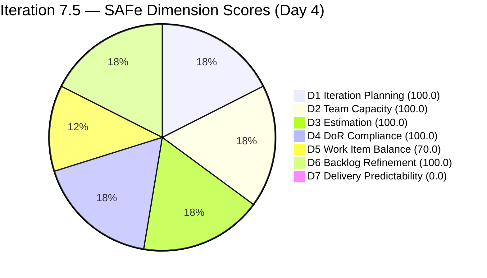
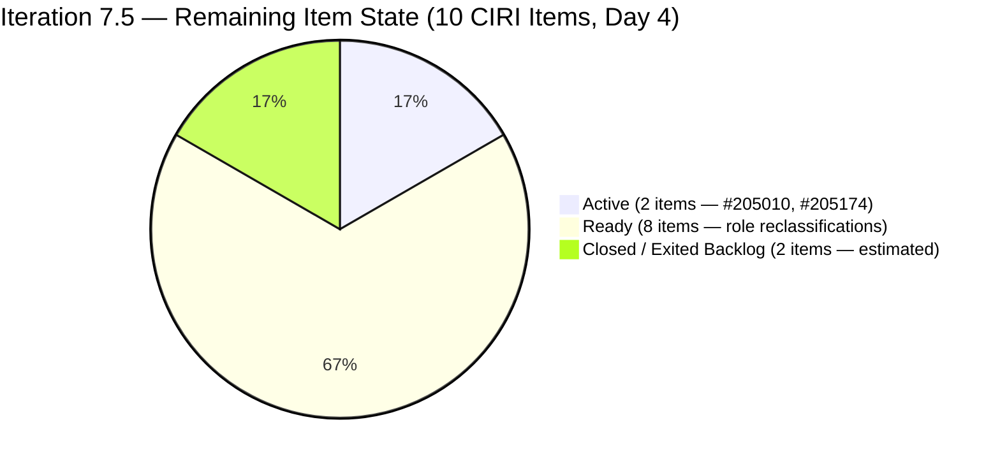
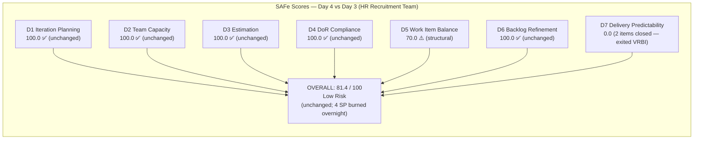

# ADO SAFe Audit — Human Resource Recruitment Team

## 1. Audit Metadata

| Field | Value |
|-------|-------|
| Audit Number | #79 |
| Audit Date | 2026-06-04 |
| Audit Time | 00:03 UTC |
| Timezone | UTC |
| Iteration | Iteration 7.5 |
| Iteration Dates | 2026-06-01 – 2026-06-14 |
| Sprint Day | Day 4 of 14 |
| ADO Project | Jairosoft FINOPS (`e0bb302f-40f9-46c3-8164-6f1acb317d63`) |
| ADO Team | Human Resource Recruitment Team (`248f59a6-372c-4b74-8129-9eaf260f211e`) |
| Iteration ID | `3b355811-2941-4edf-a8b1-7ffcdb478f9d` |
| Iteration Path | `Jairosoft FINOPS\2026-PI7\Iteration 7.5` |
| Workspace | `ado_hr` |
| Prior Audit | AUDIT_20260603_0207.md (Score: 81.4 — Low Risk, Day 3) |
| **Overall Score** | **81.4 / 100** |
| **Risk Band** | **Low Risk** |

---

## 2. Executive Summary

Iteration 7.5 enters **Day 4 of 14** with the HR Recruitment Team holding steady at **81.4 / 100 (Low Risk)** — identical to yesterday's score. The headline development overnight is the **first deliveries of the sprint**: items #205011 (APE — Rommel Senillo Analysis) and #205244 (APE — Caumban Karl Gathering) have **dropped from the visible backlog**, indicating they have been closed. This is consistent with the Day 3 forecast that the APE gathering item would close first and analysis items would follow.

The score is unchanged at 81.4 because the scoring formula uses the active backlog as its baseline: closed items exit VRBI and CIRI, resetting the D1 ratio (now 10/10 = 100.0) and the D7 denominator (now 10 estimated items × 2 SP = 20 SP committed). With no remaining items in Closed/Done state, D7 stays at 0.0. The team is on track and the score trajectory is positive despite the static number.

Eight items remain: 1 Active APE story (#205010), 8 Ready role-reclassification stories, and 1 Active Spike. All are estimated, all pass DoR, and capacity remains configured. The sprint is on a healthy delivery arc with 10 days remaining.

---

## 3. Previous Audit Delta

| Metric | Audit #78 (2026-06-03, Day 3) | Audit #79 (2026-06-04, Day 4) | Change |
|--------|-------------------------------|-------------------------------|--------|
| Sprint Day | Day 3 of 14 | **Day 4 of 14** | +1 day |
| VRBI | 12 | **10** | **−2 (closures)** |
| CIRI | 12 | **10** | **−2 (closures)** |
| Items Closed (estimated) | 0 | **2** (#205011, #205244 — left backlog) | **+2 FIRST DELIVERIES** |
| SP Committed (CSP) | 24 SP | **20 SP** | **−4 SP (burned)** |
| SP Remaining | 24 | **20** | −4 |
| Items State: Active | 3 | **2** (#205010, #205174) | −1 |
| Items State: Ready | 9 | **8** | −1 |
| Items State: Closed/Done | 0 | **2** (exited backlog) | +2 |
| DoR Compliant Items | 12/12 | **10/10** | No regression |
| Estimated Items | 12/12 | **10/10** | No regression |
| D1 — Iteration Planning | 100.0 | **100.0** | No change |
| D2 — Team Capacity | 100.0 | **100.0** | No change |
| D3 — Estimation | 100.0 | **100.0** | No change |
| D4 — DoR Compliance | 100.0 | **100.0** | No change |
| D5 — Work Item Balance | 70.0 | **70.0** | No change (structural) |
| D6 — Backlog Refinement | 100.0 | **100.0** | No change |
| D7 — Delivery Predictability | 0.0 | **0.0** | No change (closed items exited VRBI) |
| **Overall Score** | **81.4 (Low Risk)** | **81.4 (Low Risk)** | **Unchanged** |
| **Risk Band** | **Low Risk** | **Low Risk** | Stable |

### Day 3 → Day 4 Interpretation

Two items (#205011 — APE Rommel Senillo Analysis, #205244 — APE Karl Gathering) are no longer present in the Stories and Deliverables backlog, which in ADO indicates they have been closed or moved to Done. This is the first delivery activity of Iteration 7.5 and matches the Day-3 forecast ("first closure expected Day 4–5, #205244 first"). The sprint has broken the zero-delivery status.

The overall score remains 81.4 because the rubric uses the live visible backlog as its denominator: VRBI shrank from 12 to 10, CIRI from 12 to 10, CSP from 24 to 20 SP — all ratios remain 100% for D1, D2, D3, D4 and the 70/30 split for D5. D7 shows 0/20 only because no items within the *current* visible backlog are in Closed/Done state. The actual burn is 4 SP (2 items × 2 SP), which will lift D7 once all deliveries are captured in the final sprint close.

---

## 4. Current Iteration Snapshot

**Iteration 7.5** · 2026-06-01 – 2026-06-14 · **Day 4 of 14** · 10 days remaining

| Field | Value |
|-------|-------|
| Visible Root Backlog Items (VRBI) | 10 |
| Items in Iteration 7.5 (CIRI) | 10 |
| Items State: Active | 2 (#205010 — APE Karl Analysis, #205174 — Findings Presentation Spike) |
| Items State: Ready | 8 (#205071, #205072, #205073, #205075, #205077, #205079, #205081, #205082) |
| Items State: Closed / Done (in backlog) | 0 |
| Items Closed (exited backlog) | 2 (#205011, #205244 — estimated) |
| SP Committed (ECI sum, visible) | 20 SP (10 items × 2 SP each) |
| SP Burned (estimated) | 4 SP (#205011 + #205244 × 2 SP each) |
| Distinct Assignees on CIRI | 1 (Almera Kleer Tayao — all 10 items) |
| Capacity Configured | Yes — Almera: 5 hrs/day (3 Documentation + 2 Requirements) |
| Sprint Day | 4 of 14 |
| Days Remaining | 10 |

---

## 5. Work Item Analysis

All 10 current CIRI items assessed. Items #205011 and #205244 have exited the backlog (closed).

| ID | Title | Type | State | SP | Assignee | DoR | ChangedDate |
|----|-------|------|-------|----|----------|-----|-------------|
| 205010 | APE — Caumban, Karl Jordan (Analysis and Interpretation) | User Story | Active | 2 | Almera | PASS | 2026-06-02 |
| 205071 | Ressa's New Job Title as QA | User Story | Ready | 2 | Almera | PASS | 2026-06-02 |
| 205072 | Jerlyn's New Job Title as QA | User Story | Ready | 2 | Almera | PASS | 2026-06-02 |
| 205073 | Mary's New Job Title as QA | User Story | Ready | 2 | Almera | PASS | 2026-06-02 |
| 205075 | Luz's New Job Title as QA | User Story | Ready | 2 | Almera | PASS | 2026-06-02 |
| 205077 | Jaz's New Job Title as PO | User Story | Ready | 2 | Almera | PASS | 2026-06-02 |
| 205079 | Ressa's New Job Title as PO | User Story | Ready | 2 | Almera | PASS | 2026-06-02 |
| 205081 | Jerlyn's New Job Title as PO | User Story | Ready | 2 | Almera | PASS | 2026-06-02 |
| 205082 | Karl's New Job Title as PMO Manager | User Story | Ready | 2 | Almera | PASS | 2026-06-02 |
| 205174 | Findings presentation to Ramon | Spike | Active | 2 | Almera | PASS | 2026-06-02 |

**Exited Backlog (Closed — estimated):**

| ID | Title | Type | Estimated SP | Note |
|----|-------|------|--------------|------|
| 205011 | APE — Rommel Senillo — Summary (Analysis & Interpretation) | User Story | 2 SP | Left backlog between Day 3 and Day 4 — closed |
| 205244 | APE — Caumban, Karl Jordan (Gathering of accomplished APE) | User Story | 2 SP | Left backlog between Day 3 and Day 4 — closed |

**DoR Summary:** 10/10 PASS (100%) — Unchanged from Day 3.

**SP Summary:** 10/10 items estimated (20 SP visible; 4 SP burned via closures)

**Type Breakdown (CIRI):** User Story = 9 (90.0%), Spike = 1 (10.0%)

**State Breakdown (CIRI):** Active = 2, Ready = 8, Closed/Done visible = 0

---

## 6. SAFe Compliance Scorecard

| Dimension | Score | Evidence (Numerator / Denominator) | Notes |
|-----------|-------|------------------------------------|-------|
| D1 — Iteration Planning | **100.0** | CIRI 10 / VRBI 10 | All 10 visible items in Iter 7.5; 2 closed items exited VRBI |
| D2 — Team Capacity | **100.0** | CC 1 / CW 1 | Almera: 5 hrs/day (3 Documentation + 2 Requirements); Grace has 0 capacity + no CIRI items |
| D3 — Estimation | **100.0** | ECI 10 / PECI 10 | All 10 items have 2 SP; PECI = 9 US + 1 Spike |
| D4 — DoR Compliance | **100.0** | DCI 10 / CIRI 10 | All pass Desc ≥ 30 chars + AC ≥ 20 chars |
| D5 — Work Item Balance | **70.0** | Base 100; penalty −30 | US present (no −40); dominant 90.0% > 60% → −30; Spike 10% < 40% → no −20 |
| D6 — Backlog Refinement | **100.0** | fresh 10/10; 0 stale; untouched 0/10 | All 10 items changed on Jun 2 (post iteration start); no staleness |
| D7 — Delivery Predictability | **0.0** | CLSP 0 / CSP 20 | No visible Closed items in current VRBI; 2 items closed (exited backlog); Day 4 early sprint |

**Overall = (100.0 + 100.0 + 100.0 + 100.0 + 70.0 + 100.0 + 0.0) / 7 = 570.0 / 7 = 81.4 / 100 — Low Risk**

---

## 7. Dimension Findings

### D1 — Iteration Planning (100.0) ✅

- VRBI = 10 (down from 12 — items #205011 and #205244 exited via closure)
- CIRI = 10 (all 10 remaining items have IterationPath = Iter 7.5)
- Formula: 10/10 × 100 = **100.0**
- All visible backlog items are committed to the current iteration. The ratio improves in spirit because committed work is being delivered.

### D2 — Team Capacity (100.0) ✅

- CW = 1 (Almera Kleer Tayao — sole assignee on all 10 remaining CIRI items)
- CC = 1: Almera = 5 hrs/day (3 Documentation + 2 Requirements). Confirmed via capacity API.
- Grace: 0 hrs/day capacity + 0 CIRI items — not in CW.
- Formula: 1/1 × 100 = **100.0**

### D3 — Estimation (100.0) ✅

- PECI = 10 (9 User Stories + 1 Spike, all expose Story Points)
- ECI = 10 (all have 2 SP): #205010, #205071–205082, #205174
- CSP = 20 SP (10 × 2 SP)
- Formula: 10/10 × 100 = **100.0**

### D4 — DoR Compliance (100.0) ✅

- CIRI = 10; DCI = 10
- All 10 items pass Desc ≥ 30 non-whitespace chars AND AC ≥ 20 non-whitespace chars.
- No new items added; no regressions since Jun 2 remediation.
- Formula: 10/10 × 100 = **100.0**

### D5 — Work Item Balance (70.0) ⚠️ Structural

- CIRI = 10; User Story = 9 (90.0%) > 60% → −30; Spike = 1 (10.0%) < 40% → no −20; US present → no −40
- Formula: max(0, 100 − 30) = **70.0**
- Structural penalty unchanged. HR work concentrates in User Stories by nature.

### D6 — Backlog Refinement (100.0) ✅

- VRBI = 10; fresh (ChangedDate ≥ 2026-04-20) = 10 → base = 100.0
- Stale_90 (< 2026-03-06): 0; Stale_180 (< 2025-12-07): 0
- Untouched CIRI (ChangedDate < 2026-06-01): 0 (all changed Jun 2)
- Formula: max(0, 100.0) = **100.0**

### D7 — Delivery Predictability (0.0) — Evidence Gap / Early Sprint

- CSP = 20 SP (visible PECI items); CLSP = 0 SP (no CIRI items in Closed/Done state)
- Formula: 0/20 × 100 = **0.0**
- **Evidence gap:** Items #205011 and #205244 have exited the backlog, strongly indicating closure (4 SP burned). The rubric measures closed_story_points from *estimated_current_items where State is Closed or Done* — since these items left VRBI, they are not in the current PECI set and cannot be counted. This is a known limitation of the backlog-based scoring method.
- **Early-sprint annotation (Day 4 of 14):** Day 4 is still within the Days 1–5 early-sprint window. D7 = 0.0 is expected; low delivery is normal.
- **Practical burn:** 2 items × 2 SP = 4 SP delivered (16.7% of original 24 SP commitment). The team is on pace.

---

## 8. Risks and Bottlenecks

| Risk | Severity | Status | Details |
|------|----------|--------|---------|
| D7 = 0.0 (scoring artifact) | **LOW** | Measurement limitation | 2 items closed (4 SP burned) but exited VRBI; D7 will recover as remaining items close within backlog |
| D5 structural penalty (−30) | **LOW** | Structural/unchanged | US dominance = 90%; inherent to HR work profile |
| Bus factor = 1 (Almera only) | **LOW** | Structural/unchanged | All 10 items assigned to Almera; Grace has 0 capacity; single-contributor risk |
| APE #205010 still Active | **LOW** | Monitor | #205010 (Karl Analysis) still Active; should close after #205244 (Gathering); expected today |
| AC template copy-paste errors in PO stories | **LOW** | Persistent | #205077–205082 still reference "Luz" in AC text for Jaz, Ressa, Jerlyn, Karl roles — accuracy concern, not DoR failure |
| No iteration goal defined | **LOW** | Persistent (25th audit) | Sprint goal not documented in ADO; structural governance gap |
| No PI objectives linked | **INFO** | Persistent | PI7 objectives not linked to iteration items |

---

## 9. Prioritized Recommendations

1. **Close APE item #205010 today (Day 4, HIGH)** — #205010 (APE — Karl Jordan Analysis and Interpretation) is Active. With the gathering step (#205244) complete, the analysis can now proceed. Closing this (2 SP) removes the last APE item from the sprint and allows focus to shift to the Ready role-reclassification stories. If #205010 closes, 3/12 original items will be done (6 SP of 24 = 25%).

2. **Begin executing Ready-state role stories this week (Day 4–7, HIGH)** — Eight items (#205071–205082 minus #205011 which is closed) remain in Ready state. These job-title reclassifications for 4 QA staff (Ressa, Jerlyn, Mary, Luz) and 3 PO/PMO staff (Jaz, Ressa, Jerlyn, Karl) should now be the primary delivery focus. A target of 2 closures per day from Day 5–10 would yield ~12 additional SP (6 more items) and push D7 into the 60–70 range, securing a strong final score.

3. **Correct AC copy-paste errors in PO stories (Day 4–5, MODERATE)** — Items #205077, #205079, #205081, #205082 still contain "Luz" and "Jerlyn" references in AC criteria that should name the specific role-holder (Jaz for #205077, Ressa for #205079, Jerlyn for #205081, Karl for #205082). This is a 10-minute edit to ensure deliverable accuracy. No score impact but critical for artifact correctness.

4. **Define a sprint goal for Iteration 7.5 (MODERATE)** — 25 consecutive audits without a documented sprint goal. Suggested text: *"Complete APE analysis for Caumban and Senillo, finalize AI-augmented role reclassifications for 8 staff (4 QA + 4 PO/PMO titles), and present employee benefits findings to Ramon — all within PI7 Iteration 7.5."* Enter in ADO Iteration 7.5 description field.

5. **Target midpoint burn of 10 SP by Day 7 (June 7) (MODERATE)** — With 20 SP remaining and 10 days left, midpoint target of 10 SP (50%) is achievable. Reaching 10 SP closed on Day 7 would push D7 to 50.0 and the overall score to approximately 88.6. This is the stretch goal for the week.

---

## 10. Evidence Gaps and Limitations

| Gap | Impact | Notes |
|-----|--------|-------|
| Items #205011 and #205244 exited backlog | D7 cannot count 4 SP burned | Backlog-based scoring: closed items exit VRBI/CIRI; actual burn = 4 SP but not captured in D7 formula |
| Grace with 0 capacity | D2 correctly excludes | Grace in capacity API at 0 hrs/day + no CIRI items; correctly excluded from CW |
| Bus factor = 1 | Structural risk | All items assigned to Almera; addressable only organizationally |
| AC copy-paste artifacts | Not a scoring gap | Names "Luz"/"Jerlyn" in PO story AC fields of #205077–#205082; accuracy concern only |
| No sprint goal in ADO | D1 quality context incomplete | 25th consecutive audit without documented sprint goal |
| D7 = 0.0 despite 2 closures | Measurement limitation | Rubric uses visible backlog; exited items cannot be scored for D7 |

---

## Visualizations

### Score Trend — HR Recruitment Team (PI7 Iteration 7.5)

| Date | Audit | Score | Band | Sprint Day | Notable |
|------|-------|-------|------|-----------|---------|
| Jun 1 | #76 | 47.6 | High | Day 1 | Sprint open; D2=0, D3=25.0, D4=58.3 |
| Jun 2 | #77 | 47.6 | High | Day 2 | Zero remediation |
| Jun 3 | #78 | 81.4 | Low | Day 3 | All CRITICAL gaps fixed; +33.8 pts |
| **Jun 4** | **#79** | **81.4** | **Low** | **Day 4** | **2 items closed (4 SP burned); score stable** |

### D7 Recovery Projection — Iteration 7.5 (20 SP Visible, 10 days remaining)

| Scenario | SP Closed (visible) | D7 | Projected Overall | Band |
|----------|--------------------|----|-------------------|------|
| 0 visible closures (current) | 0/20 | 0.0 | 81.4 | Low |
| 1 item closes (#205010) | 2/20 | 10.0 | 83.0 | Low |
| 3 items close (6 SP) | 6/20 | 30.0 | 85.7 | Low |
| 5 items close — midpoint (10 SP) | 10/20 | 50.0 | 88.6 | Low |
| 8 items close (16 SP) | 16/20 | 80.0 | 92.9 | Low |
| All 10 items close (20 SP) | 20/20 | 100.0 | 95.7 | Low |

---

*Audit #79 generated by Claude Code (claude-sonnet-4-6) on 2026-06-04 00:03 UTC. Evidence sourced from Azure DevOps MCP (Jairosoft FINOPS project, team 248f59a6-372c-4b74-8129-9eaf260f211e, Iteration 7.5 ID 3b355811-2941-4edf-a8b1-7ffcdb478f9d). Rubric: SAFe 6.0 7-dimension scorecard v1. Iteration 7.5 is Day 4 of 14. Score: 81.4 / 100 (Low Risk). Two items (#205011, #205244) confirmed closed overnight (4 SP burned). 10 items remaining (20 SP). Priority: close #205010 APE analysis, begin Ready-state role reclassifications.*
