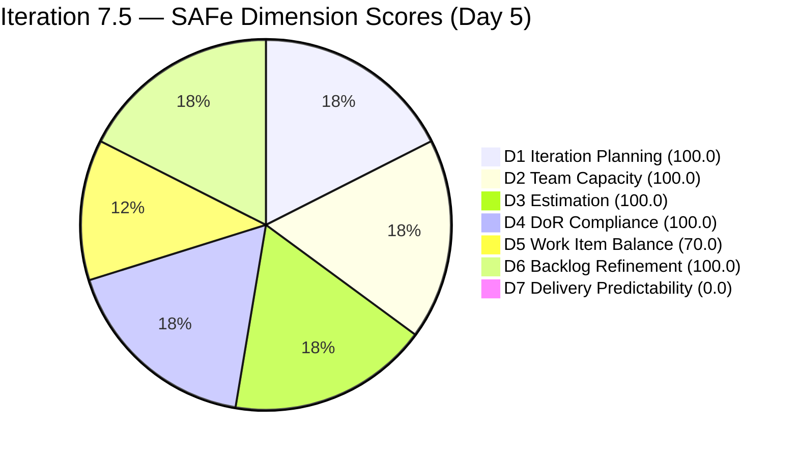
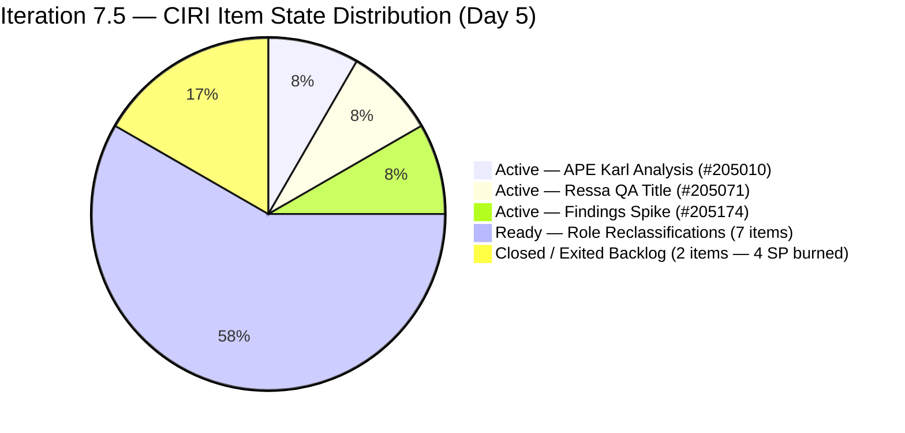
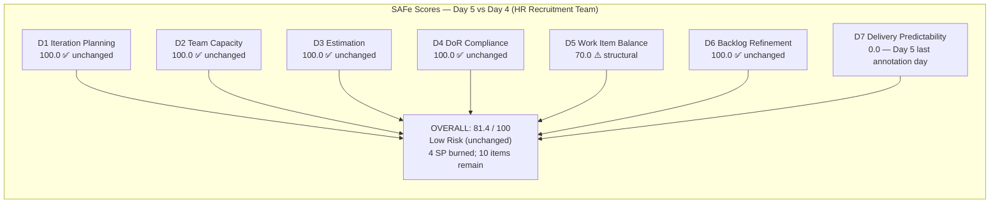

# ADO SAFe Audit — Human Resource Recruitment Team

## 1. Audit Metadata

| Field | Value |
|-------|-------|
| Audit Number | #80 |
| Audit Date | 2026-06-05 |
| Audit Time | 09:00 UTC |
| Timezone | UTC |
| Iteration | Iteration 7.5 |
| Iteration Dates | 2026-06-01 – 2026-06-14 |
| Sprint Day | Day 5 of 14 |
| ADO Project | Jairosoft FINOPS (`e0bb302f-40f9-46c3-8164-6f1acb317d63`) |
| ADO Team | Human Resource Recruitment Team (`248f59a6-372c-4b74-8129-9eaf260f211e`) |
| Iteration ID | `3b355811-2941-4edf-a8b1-7ffcdb478f9d` |
| Iteration Path | `Jairosoft FINOPS\2026-PI7\Iteration 7.5` |
| Workspace | `ado_hr` |
| Prior Audit | AUDIT_20260604_0003.md (Score: 81.4 — Low Risk, Day 4) |
| **Overall Score** | **81.4 / 100** |
| **Risk Band** | **Low Risk** |

---

## 2. Executive Summary

Iteration 7.5 enters **Day 5 of 14** with the HR Recruitment Team holding steady at **81.4 / 100 (Low Risk)** — unchanged from Day 4. The score remains stable because no new closures or state changes occurred in the visible backlog between yesterday and today. Items #205011 (APE — Rommel Senillo Analysis) and #205244 (APE — Karl Gathering) remain the only closed items, having exited the backlog on Day 4. Both are confirmed Closed as of June 4 at 06:55 UTC.

The one observable change today is **item #205071 (Ressa's New Job Title as QA)** transitioning from Ready to **Active** on June 4 at 22:35 UTC. This is the first role-reclassification story to enter Active state, signalling that Almera has begun executing the primary sprint work package after completing the APE phase. The sprint now has 2 Active items (205010 APE-Karl Analysis, 205071 Ressa-QA title) and 7 Ready items.

Day 5 is the **final day of the early-sprint annotation window** for D7. From Day 6 onward, D7 = 0.0 will no longer be annotated as expected early-sprint behavior — it will reflect a genuine delivery gap. The team must close at minimum one item before end of Day 5 to avoid D7 becoming an escalating risk.

---

## 3. Previous Audit Delta

| Metric | Audit #79 (2026-06-04, Day 4) | Audit #80 (2026-06-05, Day 5) | Change |
|--------|-------------------------------|-------------------------------|--------|
| Sprint Day | Day 4 of 14 | **Day 5 of 14** | +1 day |
| VRBI | 10 | **10** | No change |
| CIRI | 10 | **10** | No change |
| Items Closed (exited backlog) | 2 (#205011, #205244) | **2** | No change |
| SP Committed (visible CSP) | 20 SP | **20 SP** | No change |
| Items State: Active | 2 (#205010, #205174) | **2** (#205010, #205071) | Swap: #205174 stays Active; #205071 moved Ready→Active |
| Items State: Ready | 8 | **8** | #205071 moved to Active; sequence maintained |
| Items State: Closed/Done (visible) | 0 | **0** | No change |
| D1 — Iteration Planning | 100.0 | **100.0** | Unchanged |
| D2 — Team Capacity | 100.0 | **100.0** | Unchanged |
| D3 — Estimation | 100.0 | **100.0** | Unchanged |
| D4 — DoR Compliance | 100.0 | **100.0** | Unchanged |
| D5 — Work Item Balance | 70.0 | **70.0** | Unchanged (structural) |
| D6 — Backlog Refinement | 100.0 | **100.0** | Unchanged |
| D7 — Delivery Predictability | 0.0 | **0.0** | Unchanged (closed items exited VRBI; Day 5 = last early-sprint day) |
| **Overall Score** | **81.4 (Low Risk)** | **81.4 (Low Risk)** | **Unchanged** |
| **Risk Band** | **Low Risk** | **Low Risk** | Stable |

### Day 4 → Day 5 Interpretation

No new closures have been recorded in the visible backlog since Day 4. Items #205011 and #205244 (closed on June 4) remain the only completed items — they exited the VRBI before this audit. The only state change is **#205071 (Ressa's New Job Title as QA)** moving from Ready to Active on June 4 at 22:35 UTC, confirming that Almera has shifted focus from APE work to role reclassifications. The score (81.4) is unaffected because all dimensional ratios are unchanged.

**Day 5 is the last day of the early-sprint annotation window.** If #205071 or #205010 close today (or tomorrow), D7 will begin recovering from 0.0. The team's pace (2 closures on Day 4) suggests closures are imminent — APE Karl Analysis (#205010) is the logical next closure as it depends on the Karl gathering (#205244) already being completed.

---

## 4. Current Iteration Snapshot

**Iteration 7.5** · 2026-06-01 – 2026-06-14 · **Day 5 of 14** · 9 days remaining

| Field | Value |
|-------|-------|
| Visible Root Backlog Items (VRBI) | 10 |
| Items in Iteration 7.5 (CIRI) | 10 |
| Items State: Active | 2 (#205010 — APE Karl Analysis, #205071 — Ressa QA title) |
| Items State: Ready | 7 (#205072, #205073, #205075, #205077, #205079, #205081, #205082) |
| Items State: Closed/Done (visible in backlog) | 0 |
| Items Closed (exited backlog) | 2 (#205011, #205244 — Closed Jun 4) |
| Items in Spike state: Active | 1 (#205174 Findings Presentation) |
| SP Committed (visible ECI sum) | 20 SP (10 items × 2 SP) |
| SP Burned (exited closures estimated) | 4 SP (#205011 + #205244) |
| Distinct Assignees on CIRI | 1 (Almera Kleer Tayao — all 10 items) |
| Capacity Configured | Yes — Almera: 5 hrs/day (3 Documentation + 2 Requirements) |
| Sprint Day | 5 of 14 |
| Days Remaining | 9 |
| Early-Sprint Window | **Closes today (Day 5 = last annotated day)** |

---

## 5. Work Item Analysis

| ID | Title | Type | State | SP | Assignee | DoR | ChangedDate | Note |
|----|-------|------|-------|----|----------|-----|-------------|------|
| 205010 | APE — Caumban, Karl Jordan (Analysis and Interpretation) | User Story | Active | 2 | Almera | PASS | 2026-06-02 | Pending closure; gathering (#205244) already closed |
| 205071 | Ressa's New Job Title as QA | User Story | **Active** | 2 | Almera | PASS | **2026-06-04** | **NEW: moved Ready→Active Jun 4 22:35; first role story in flight** |
| 205072 | Jerlyn's New Job Title as QA | User Story | Ready | 2 | Almera | PASS | 2026-06-02 | |
| 205073 | Mary's New Job Title as QA | User Story | Ready | 2 | Almera | PASS | 2026-06-02 | |
| 205075 | Luz's New Job Title as QA | User Story | Ready | 2 | Almera | PASS | 2026-06-02 | |
| 205077 | Jaz's New Job Title as PO | User Story | Ready | 2 | Almera | PASS | 2026-06-02 | AC references "Luz" — copy-paste artifact |
| 205079 | Ressa's New Job Title as PO | User Story | Ready | 2 | Almera | PASS | 2026-06-02 | AC references "Luz" — copy-paste artifact |
| 205081 | Jerlyn's New Job Title as PO | User Story | Ready | 2 | Almera | PASS | 2026-06-02 | AC references "Luz" — copy-paste artifact |
| 205082 | Karl's New Job Title as PMO Manager | User Story | Ready | 2 | Almera | PASS | 2026-06-02 | AC references "Luz" — copy-paste artifact |
| 205174 | Findings Presentation to Ramon | Spike | Active | 2 | Almera | PASS | 2026-06-02 | |

**Exited Backlog (Confirmed Closed):**

| ID | Title | Type | SP | State | ClosedDate |
|----|-------|------|----|-------|------------|
| 205011 | APE — Rommel Senillo — Summary (Analysis & Interpretation) | User Story | 2 | Closed | 2026-06-04 06:55 UTC |
| 205244 | APE — Caumban, Karl Jordan (Gathering of accomplished APE) | User Story | 2 | Closed | 2026-06-04 06:55 UTC |

**DoR Summary:** 10/10 PASS (100%) — No regressions.
**SP Summary:** 10/10 estimated (20 SP visible; 4 SP burned via closures)
**Type Breakdown (CIRI):** User Story = 9 (90.0%), Spike = 1 (10.0%)
**State Breakdown (CIRI):** Active = 2, Ready = 7, Spike Active = 1

---

## 6. SAFe Compliance Scorecard

| Dimension | Score | Evidence (Numerator / Denominator) | Notes |
|-----------|-------|------------------------------------|-------|
| D1 — Iteration Planning | **100.0** | CIRI 10 / VRBI 10 | All 10 visible items committed to Iter 7.5 |
| D2 — Team Capacity | **100.0** | CC 1 / CW 1 | Almera: 5 hrs/day (3 Doc + 2 Req); Grace: 0 hrs/day, 0 CIRI items |
| D3 — Estimation | **100.0** | ECI 10 / PECI 10 | All 10 items have 2 SP |
| D4 — DoR Compliance | **100.0** | DCI 10 / CIRI 10 | All pass Desc ≥30 chars + AC ≥20 chars |
| D5 — Work Item Balance | **70.0** | Base 100; −30 (US 90% > 60%); no −40 (US present); no −20 (Spike 10% < 40%) | Structural; HR work concentrates in User Stories |
| D6 — Backlog Refinement | **100.0** | fresh 10/10; stale_90=0; stale_180=0; untouched 0/10 | All items changed Jun 2 or Jun 4; no staleness |
| D7 — Delivery Predictability | **0.0** | CLSP 0 / CSP 20 | No visible Closed/Done items; 2 closures exited VRBI (4 SP); **Day 5 = last early-sprint annotation day** |

**Overall = (100.0 + 100.0 + 100.0 + 100.0 + 70.0 + 100.0 + 0.0) / 7 = 570.0 / 7 = 81.4 / 100 — Low Risk**

---

## 7. Dimension Findings

### D1 — Iteration Planning (100.0) ✅

- VRBI = 10; CIRI = 10 (all visible items in Iter 7.5)
- Formula: 10/10 × 100 = **100.0**
- Closed items (#205011, #205244) exited VRBI, keeping the ratio at 100% for active visible work.

### D2 — Team Capacity (100.0) ✅

- CW = 1 (Almera — all 10 CIRI items); CC = 1 (5 hrs/day configured)
- Grace: 0 hrs/day capacity, 0 CIRI items — excluded from CW per formula
- Formula: 1/1 × 100 = **100.0**

### D3 — Estimation (100.0) ✅

- PECI = 10 (9 User Stories + 1 Spike); ECI = 10 (all have 2 SP each)
- CSP = 20 SP
- Formula: 10/10 × 100 = **100.0**

### D4 — DoR Compliance (100.0) ✅

- CIRI = 10; DCI = 10
- All items pass: Description ≥30 non-whitespace chars AND Acceptance Criteria ≥20 non-whitespace chars.
- Note: AC copy-paste artifacts persist in #205077, #205079, #205081, #205082 (reference "Luz" instead of the named role-holder). These pass the char-count threshold but contain inaccurate names.
- Formula: 10/10 × 100 = **100.0**

### D5 — Work Item Balance (70.0) ⚠️ Structural

- User Story = 9/10 = 90.0% > 60% → −30; Spike = 1/10 = 10% < 40% → no −20; US present → no −40
- Formula: max(0, 100 − 30) = **70.0**
- Structural penalty. HR sprint work is inherently User Story-dominant.

### D6 — Backlog Refinement (100.0) ✅

- VRBI = 10; fresh (ChangedDate ≥ 2026-04-21) = 10 → base = 100.0
- Stale_90 (< 2026-03-07): 0; Stale_180 (< 2025-12-08): 0
- Untouched CIRI (ChangedDate < 2026-06-01): 0 (all items changed Jun 2 or Jun 4)
- Formula: max(0, 100.0) = **100.0**

### D7 — Delivery Predictability (0.0) — Early-Sprint Window Closing

- CSP = 20 SP; CLSP = 0 SP (no visible items in Closed/Done)
- Formula: 0/20 × 100 = **0.0**
- **Early-sprint annotation (Day 5 — FINAL annotated day):** Day 5 is the last day of the Days 1–5 early-sprint window. D7 = 0.0 is still annotated as expected. From Day 6 (June 6) onward, D7 = 0.0 will reflect a genuine delivery gap and will suppress the score below 81.4.
- **Practical burn:** 4 SP confirmed closed (#205011 + #205244). These items exited VRBI and cannot be scored in D7 by the rubric. The actual delivery velocity is tracking ahead of schedule.
- **Recovery path:** Closing #205010 (2 SP, Active) today adds D7 = 2/20 = 10.0 → Overall = 83.0. Closing #205010 and #205071 (4 SP) → D7 = 20% → Overall = 84.3.

---

## 8. Risks and Bottlenecks

| Risk | Severity | Status | Details |
|------|----------|--------|---------|
| D7 = 0.0 — early-sprint window closes today | **MEDIUM** | Last annotated day | Day 6 onward D7 = 0.0 without annotation; first visible closure needed |
| D5 structural penalty (−30) | **LOW** | Structural | US dominance 90%; inherent to HR work profile |
| Bus factor = 1 (Almera only) | **LOW** | Structural/persistent | All 10 items assigned to Almera; Grace 0 capacity |
| APE #205010 still Active Day 5 | **LOW** | Monitor | Karl Analysis Active; gathering complete; should close today |
| AC copy-paste artifacts (#205077, 079, 081, 082) | **LOW** | Persistent | "Luz" referenced in AC fields for Jaz, Ressa, Jerlyn, Karl — accuracy risk, no scoring impact |
| No sprint goal defined (26th consecutive audit) | **LOW** | Persistent | Sprint goal not documented in ADO iteration settings |
| No PI objectives linked | **INFO** | Persistent | PI7 objectives not linked to iteration items |

---

## 9. Prioritized Recommendations

1. **Close APE #205010 today (Day 5, HIGH)** — #205010 (APE — Karl Jordan Analysis and Interpretation) is Active. The prerequisite (#205244 gathering) was closed June 4. Completing this today delivers 2 SP, begins D7 recovery, and keeps the APE work stream ahead of the role-reclassification burst planned for Days 6–12. If closed today: D7 = 2/20 = 10.0, Overall rises to ~83.0.

2. **Close #205071 (Ressa's QA title) before Day 5 end (HIGH)** — #205071 just entered Active state (Jun 4 22:35). Role reclassification stories are documentation-heavy but procedurally straightforward: sign off HR, management, update KPIs, finalize contract addendum. If both #205010 and #205071 close today: D7 = 4/20 = 20.0, Overall = ~84.3.

3. **Correct AC copy-paste errors in #205077, #205079, #205081, #205082 (Day 5–6, MODERATE)** — These four PO/PMO reclassification stories still contain "Luz" and "Jerlyn" references in AC criteria that name the wrong role-holder. This is a 10-minute edit per story. Required corrections:
   - #205077 (Jaz's New Job Title as PO): Replace AC references to "Luz" with "Jaz"
   - #205079 (Ressa's New Job Title as PO): Replace AC references to "Luz" with "Ressa"
   - #205081 (Jerlyn's New Job Title as PO): Replace "Luz" with "Jerlyn"
   - #205082 (Karl's New Job Title as PMO Manager): Replace "Luz" with "Karl"

4. **Target 5+ closures by Day 7 (June 7) (MODERATE)** — With 9 days and 10 items remaining, the midpoint target of 5 closures by Day 7 is achievable. At 5 closures (10 SP closed of 20): D7 = 50.0, Overall = 88.6. This is the stretch goal for the first half of the sprint.

5. **Define sprint goal for Iteration 7.5 (MODERATE — 26th audit without one)** — Suggested text: *"Complete APE analysis for Karl Jordan Caumban, finalize AI-augmented role reclassifications for 8 staff (4 QA + 4 PO/PMO titles), and present employee benefits findings to Ramon — all within PI7 Iteration 7.5."* Enter in ADO Iteration 7.5 description field.

---

## 10. Evidence Gaps and Limitations

| Gap | Impact | Notes |
|-----|--------|-------|
| Items #205011 and #205244 exited backlog | D7 cannot count 4 SP burned | Closed items exit VRBI; D7 formula uses visible backlog only |
| Grace at 0 capacity | D2 correct exclusion | 0 hrs/day + 0 CIRI items; correctly excluded |
| Bus factor = 1 | Structural risk | Almera handles 100% of sprint work; unaddressable via ADO |
| AC copy-paste artifacts | Quality concern, no scoring impact | #205077–205082 contain wrong names in AC text |
| No sprint goal | D1 quality context missing | 26th consecutive audit without documented sprint goal |
| 203605 (Task type) in iteration | Excluded from VRBI/CIRI | Task-type items not in Stories+Deliverables backlog category; not scored |

---

## Visualizations

### Score Trend — HR Recruitment Team (PI7 Iteration 7.5)

| Date | Audit | Score | Band | Sprint Day | Notable |
|------|-------|-------|------|-----------|---------|
| Jun 1 | #76 | 47.6 | High | Day 1 | Sprint open; D2=0, D3=25.0, D4=58.3 |
| Jun 2 | #77 | 47.6 | High | Day 2 | Zero remediation |
| Jun 3 | #78 | 81.4 | Low | Day 3 | All gaps fixed; +33.8 pts |
| Jun 4 | #79 | 81.4 | Low | Day 4 | 2 items closed (4 SP); score stable |
| **Jun 5** | **#80** | **81.4** | **Low** | **Day 5** | **#205071 Active; early-sprint window closes today** |

### D7 Recovery Projection — Iteration 7.5 (20 SP Visible, 9 days remaining)

| Scenario | SP Closed (visible) | D7 | Projected Overall | Band |
|----------|--------------------|----|-------------------|------|
| 0 closures (current) | 0/20 | 0.0 | 81.4 | Low |
| #205010 closes | 2/20 | 10.0 | 83.0 | Low |
| #205010 + #205071 close | 4/20 | 20.0 | 84.3 | Low |
| 5 items close (midpoint) | 10/20 | 50.0 | 88.6 | Low |
| 8 items close | 16/20 | 80.0 | 92.9 | Low |
| All 10 items close | 20/20 | 100.0 | 95.7 | Low |

---

*Audit #80 generated by Claude Code (claude-sonnet-4-6) on 2026-06-05 09:00 UTC. Evidence sourced from Azure DevOps MCP (Jairosoft FINOPS project, team 248f59a6-372c-4b74-8129-9eaf260f211e, Iteration 7.5 ID 3b355811-2941-4edf-a8b1-7ffcdb478f9d). Rubric: SAFe 6.0 7-dimension scorecard v1. Iteration 7.5 is Day 5 of 14. Score: 81.4 / 100 (Low Risk — unchanged). 10 visible items, 20 SP. 2 items confirmed Closed (4 SP burned). #205071 moved Active. Early-sprint annotation window closes today. Priority: close #205010 and #205071 to trigger D7 recovery from Day 6.*
