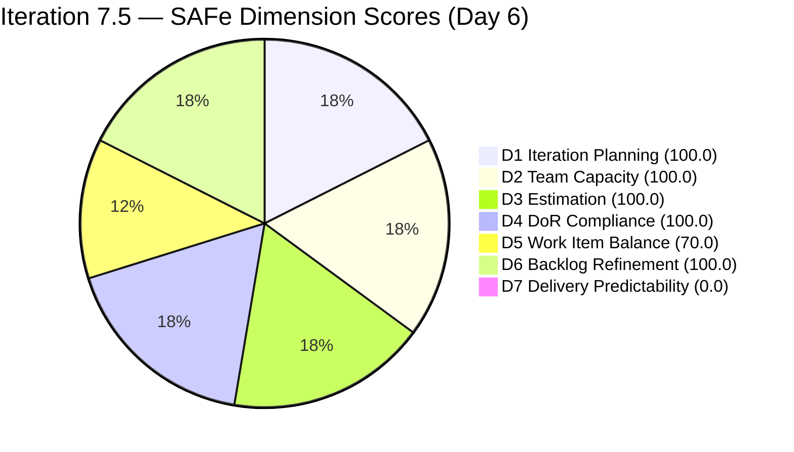
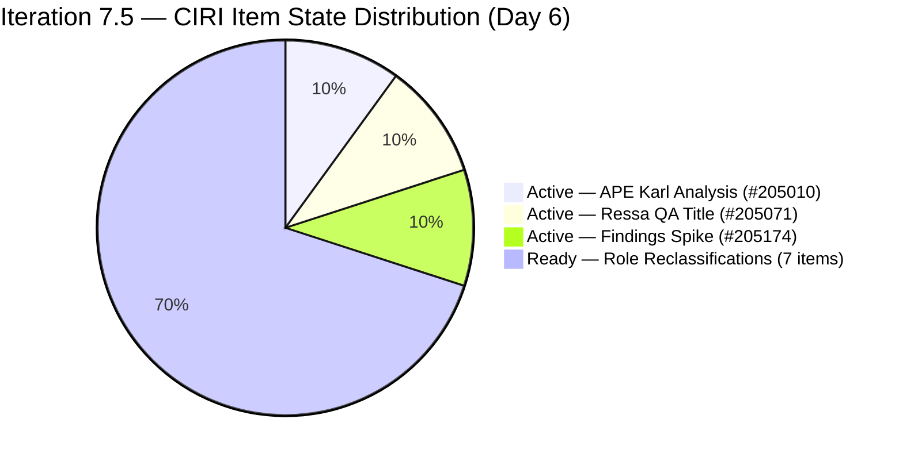
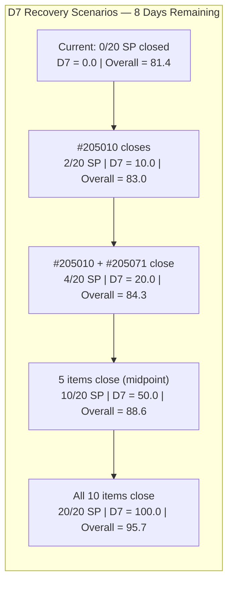

# ADO SAFe Audit — Human Resource Recruitment Team

## 1. Audit Metadata

| Field | Value |
|-------|-------|
| Audit Number | #81 |
| Audit Date | 2026-06-06 |
| Audit Time | 09:00 CST |
| Timezone | CST |
| Iteration | Iteration 7.5 |
| Iteration Dates | 2026-06-01 – 2026-06-14 |
| Sprint Day | Day 6 of 14 |
| ADO Project | Jairosoft FINOPS (`e0bb302f-40f9-46c3-8164-6f1acb317d63`) |
| ADO Team | Human Resource Recruitment Team (`248f59a6-372c-4b74-8129-9eaf260f211e`) |
| Iteration ID | `3b355811-2941-4edf-a8b1-7ffcdb478f9d` |
| Iteration Path | `Jairosoft FINOPS\2026-PI7\Iteration 7.5` |
| Workspace | `ado_hr` |
| Prior Audit | AUDIT_20260605_0900.md (Score: 81.4 — Low Risk, Day 5) |
| **Overall Score** | **81.4 / 100** |
| **Risk Band** | **Low Risk** |

---

## 2. Executive Summary

Iteration 7.5 is now on **Day 6 of 14** and the HR Recruitment Team holds at **81.4 / 100 (Low Risk)** — structurally unchanged from Day 5. However, the sprint dynamics have shifted materially: **the early-sprint annotation window for D7 has closed.** As of today (Day 6), D7 = 0.0 is no longer an expected early-sprint artifact — it is a genuine delivery gap. No visible items have moved to Closed/Done state since the sprint opened.

The backlog remains clean: all 10 visible root items are assigned to Iteration 7.5, 100% estimated (20 SP), 100% DoR-compliant, and 100% fresh (all changed in June). Almera Kleer Tayao remains the sole active contributor with 5 hrs/day capacity configured. The structural D5 penalty (User Story dominance at 90%) continues unchanged.

The most pressing issue entering Day 6 is that **#205010 (APE — Karl Jordan Analysis)** and **#205071 (Ressa's New Job Title as QA)** are both Active but remain unclosed. Item #205010's prerequisite (#205244 gathering) was closed on June 4. These two items represent 4 SP and their closure would push D7 to 20.0 and the Overall to ~84.3. Without closures by mid-sprint (Day 7), the team will fall behind the expected burn curve for a 14-day sprint.

Four AC copy-paste artifacts persist in #205077, #205079, #205081, and #205082 — still referencing "Luz" instead of the correct role-holder. These pass DoR character-count thresholds but carry a quality risk.

---

## 3. Previous Audit Delta

| Metric | Audit #80 (2026-06-05, Day 5) | Audit #81 (2026-06-06, Day 6) | Change |
|--------|-------------------------------|-------------------------------|--------|
| Sprint Day | Day 5 of 14 | **Day 6 of 14** | +1 day |
| VRBI | 10 | **10** | No change |
| CIRI | 10 | **10** | No change |
| Items Closed (exited backlog since sprint start) | 2 (#205011, #205244) | **2** | No change |
| SP Committed (visible CSP) | 20 SP | **20 SP** | No change |
| Items State: Active | 2 (#205010, #205071) + Spike #205174 | **Same** | No change |
| Items State: Ready | 7 | **7** | No change |
| Items State: Closed/Done (visible) | 0 | **0** | No change |
| D1 — Iteration Planning | 100.0 | **100.0** | Unchanged |
| D2 — Team Capacity | 100.0 | **100.0** | Unchanged |
| D3 — Estimation | 100.0 | **100.0** | Unchanged |
| D4 — DoR Compliance | 100.0 | **100.0** | Unchanged |
| D5 — Work Item Balance | 70.0 | **70.0** | Unchanged (structural) |
| D6 — Backlog Refinement | 100.0 | **100.0** | Unchanged |
| D7 — Delivery Predictability | 0.0 (annotated: early-sprint, last day) | **0.0 (GENUINE GAP — annotation window closed)** | **Annotation removed; now a real risk** |
| **Overall Score** | **81.4 (Low Risk)** | **81.4 (Low Risk)** | **Unchanged** |
| **Risk Band** | **Low Risk** | **Low Risk** | Stable |

### Day 5 → Day 6 Interpretation

No state changes were recorded in the visible backlog between June 5 and June 6. The sole observable shift is the **closure of the early-sprint annotation window**: Day 5 was the last day D7 = 0.0 could be annotated as expected early-sprint behavior. From today (Day 6) forward, D7 = 0.0 represents a genuine delivery deficit. The score of 81.4 is maintained structurally because six dimensions are at ceiling or structural plateau, but **D7's zero will suppress the Overall below 81.4 if closures do not materialize this sprint** — in a worst-case (no visible closures), the score cannot exceed 87.5 even if all other dimensions are maxed.

The confirmed 4 SP burned (items #205011 and #205244, closed June 4) are excluded from D7 by rubric definition because they exited the VRBI before this audit.

---

## 4. Current Iteration Snapshot

**Iteration 7.5** · 2026-06-01 – 2026-06-14 · **Day 6 of 14** · 8 days remaining

| Field | Value |
|-------|-------|
| Visible Root Backlog Items (VRBI) | 10 |
| Items in Iteration 7.5 (CIRI) | 10 |
| Items State: Active | 3 (#205010 APE Karl Analysis, #205071 Ressa QA title, #205174 Findings Spike) |
| Items State: Ready | 7 (#205072, #205073, #205075, #205077, #205079, #205081, #205082) |
| Items State: Closed/Done (visible in backlog) | 0 |
| Items Closed (exited backlog since sprint start) | 2 (#205011, #205244 — Closed Jun 4) |
| SP Committed (visible ECI sum) | 20 SP (10 items × 2 SP each) |
| SP Burned (exited closures) | 4 SP (#205011 + #205244 — not scorable in D7) |
| Distinct Assignees on CIRI | 1 (Almera Kleer Tayao — all 10 items) |
| Capacity Configured | Yes — Almera: 5 hrs/day (3 Documentation + 2 Requirements) |
| Sprint Day | 6 of 14 |
| Days Remaining | 8 |
| Early-Sprint Window | **Closed (Day 6 is first post-annotation day)** |

---

## 5. Work Item Analysis

| ID | Title | Type | State | SP | Assignee | DoR | ChangedDate | Note |
|----|-------|------|-------|----|----------|-----|-------------|------|
| 205010 | APE — Caumban, Karl Jordan (Analysis and Interpretation) | User Story | Active | 2 | Almera | PASS | 2026-06-02 | Active since sprint open; prerequisite #205244 closed Jun 4; overdue for closure |
| 205071 | Ressa's New Job Title as QA | User Story | Active | 2 | Almera | PASS | 2026-06-04 | Active since Jun 4; first role story in flight |
| 205072 | Jerlyn's New Job Title as QA | User Story | Ready | 2 | Almera | PASS | 2026-06-02 | |
| 205073 | Mary's New Job Title as QA | User Story | Ready | 2 | Almera | PASS | 2026-06-02 | |
| 205075 | Luz's New Job Title as QA | User Story | Ready | 2 | Almera | PASS | 2026-06-02 | |
| 205077 | Jaz's New Job Title as PO | User Story | Ready | 2 | Almera | PASS | 2026-06-02 | AC references "Luz" — copy-paste artifact persists |
| 205079 | Ressa's New Job Title as PO | User Story | Ready | 2 | Almera | PASS | 2026-06-02 | AC references "Luz" — copy-paste artifact persists |
| 205081 | Jerlyn's New Job Title as PO | User Story | Ready | 2 | Almera | PASS | 2026-06-02 | AC references "Luz" — copy-paste artifact persists |
| 205082 | Karl's New Job Title as PMO Manager | User Story | Ready | 2 | Almera | PASS | 2026-06-02 | AC references "Luz" and "AI-PO" — copy-paste artifact persists |
| 205174 | Findings Presentation to Ramon | Spike | Active | 2 | Almera | PASS | 2026-06-02 | |

**Exited Backlog (Confirmed Closed — not scored in D7):**

| ID | Title | Type | SP | State | ClosedDate |
|----|-------|------|----|-------|------------|
| 205011 | APE — Rommel Senillo — Summary (Analysis & Interpretation) | User Story | 2 | Closed | 2026-06-04 |
| 205244 | APE — Caumban, Karl Jordan (Gathering of accomplished APE) | User Story | 2 | Closed | 2026-06-04 |

**DoR Summary:** 10/10 PASS (100%) — All items have Description ≥30 and AC ≥20 non-whitespace chars.
**SP Summary:** 10/10 estimated (20 SP visible). 4 SP burned via exited closures (unscored in D7).
**Type Breakdown (CIRI):** User Story = 9 (90.0%), Spike = 1 (10.0%)
**State Breakdown (CIRI):** Active = 3, Ready = 7, Closed = 0 visible

---

## 6. SAFe Compliance Scorecard

| Dimension | Score | Evidence (Numerator / Denominator) | Notes |
|-----------|-------|------------------------------------|-------|
| D1 — Iteration Planning | **100.0** | CIRI 10 / VRBI 10 | All 10 visible items assigned to Iter 7.5 |
| D2 — Team Capacity | **100.0** | CC 1 / CW 1 | Almera: 5 hrs/day (3 Doc + 2 Req); Grace: 0 hrs/day excluded |
| D3 — Estimation | **100.0** | ECI 10 / PECI 10 | All 10 items estimated at 2 SP each; CSP = 20 |
| D4 — DoR Compliance | **100.0** | DCI 10 / CIRI 10 | All 10 pass Desc ≥30 + AC ≥20 char thresholds |
| D5 — Work Item Balance | **70.0** | Base 100; −30 (US 90% > 60%); no −40 (US present); no −20 (Spike 10% ≤ 40%) | Structural HR work profile; unchanged |
| D6 — Backlog Refinement | **100.0** | fresh 10/10; stale_90=0; stale_180=0; untouched 0/10 | All items changed Jun 2–4; zero staleness penalties |
| D7 — Delivery Predictability | **0.0** | CLSP 0 / CSP 20 | **Day 6 — early-sprint annotation closed. This is a genuine delivery gap.** |

**Overall = (100.0 + 100.0 + 100.0 + 100.0 + 70.0 + 100.0 + 0.0) / 7 = 570.0 / 7 = 81.4 / 100 — Low Risk**

---

## 7. Dimension Findings

### D1 — Iteration Planning (100.0)

- VRBI = 10; CIRI = 10. All visible root backlog items are committed to Iteration 7.5.
- Formula: 10 / 10 × 100 = **100.0**
- Exited closed items (#205011, #205244) are removed from VRBI; ratio unchanged.

### D2 — Team Capacity (100.0)

- Contributors with current work (CW): 1 — Almera Kleer Tayao (assigned to all 10 CIRI items).
- Contributors with capacity (CC): 1 — Almera has 5 hrs/day (3 Documentation + 2 Requirements), no days off.
- Grace (grace@jairosoft.com): 0 hrs/day, 0 CIRI items — correctly excluded from both CW and CC.
- Formula: 1 / 1 × 100 = **100.0**

### D3 — Estimation (100.0)

- PECI = 10 (9 User Stories + 1 Spike — both types expose Story Points field).
- ECI = 10 (all items have Story Points = 2).
- Committed Story Points (CSP) = 20 SP.
- Formula: 10 / 10 × 100 = **100.0**

### D4 — DoR Compliance (100.0)

- CIRI = 10; DCI = 10.
- All items confirmed: Description ≥30 non-whitespace chars AND Acceptance Criteria ≥20 non-whitespace chars.
- AC copy-paste artifacts persist in #205077, #205079, #205081, #205082 (Jaz/Ressa/Jerlyn/Karl PO/PMO items reference "Luz"). These pass the count threshold but are factually inaccurate.
- Formula: 10 / 10 × 100 = **100.0**

### D5 — Work Item Balance (70.0) — Structural

- User Story = 9 / 10 = 90.0% — dominant type exceeds 60% threshold → −30 penalty.
- User Stories are present → no −40 penalty.
- Spike = 1 / 10 = 10.0% — does not exceed 40% threshold → no −20 penalty.
- Formula: max(0, 100 − 30) = **70.0**
- This is a structural HR-team characteristic; the sprint work package (APE + role reclassifications) is inherently User Story-dominated.

### D6 — Backlog Refinement (100.0)

- VRBI = 10; fresh (ChangedDate ≥ 2026-04-22): all 10 items changed June 2 or June 4 → fresh = 10 → base = 100.0.
- Stale_90 (ChangedDate < 2026-03-08): 0 items → no penalty.
- Stale_180 (ChangedDate < 2025-12-09): 0 items → no penalty.
- Untouched CIRI (ChangedDate < 2026-06-01 sprint start): 0 items — all changed after sprint open → no penalty.
- Formula: max(0, 100.0 − 0) = **100.0**

### D7 — Delivery Predictability (0.0) — GENUINE DELIVERY GAP

- CSP = 20 SP (10 items × 2 SP each); CLSP = 0 SP (no visible items in Closed or Done state).
- Formula: 0 / 20 × 100 = **0.0**
- **Day 6 — the early-sprint annotation window has closed.** Days 1–5 carried the annotation "early-sprint — low delivery expected." From Day 6 onward, D7 = 0.0 is a genuine gap. The team should have at minimum 1–2 closures visible by now.
- **Context:** 4 SP (items #205011, #205244) were burned on June 4 but exited the VRBI before this audit. By rubric, D7 can only count items currently visible in the backlog. The practical velocity is non-zero, but the scoring metric cannot reflect it.
- **Recovery path:** Closing #205010 (2 SP, Active, prerequisite done) → D7 = 2/20 = 10.0, Overall = 83.0. Closing both #205010 and #205071 → D7 = 4/20 = 20.0, Overall = 84.3.

---

## 8. Risks and Bottlenecks

| Risk | Severity | Status | Details |
|------|----------|--------|---------|
| D7 = 0.0 — genuine delivery gap (Day 6) | **HIGH** | Active | Early-sprint annotation closed. No visible Closed items. #205010 and #205071 both Active but unclosed entering Day 6. |
| D5 structural penalty (−30) | **LOW** | Structural | 90% User Story dominance; inherent to HR work profile. Cannot resolve without adding different item types. |
| Bus factor = 1 (Almera only) | **LOW** | Structural/persistent | All 10 items assigned to Almera; Grace has 0 capacity allocated. |
| APE #205010 still Active — Day 6 | **MEDIUM** | Monitor | Karl Analysis Active since sprint open; gathering prerequisite (#205244) closed June 4. Overdue for closure. |
| AC copy-paste artifacts (#205077, 079, 081, 082) | **LOW** | Persistent | "Luz" referenced in AC fields for Jaz, Ressa, Jerlyn, Karl PO/PMO items. Accuracy risk, no DoR scoring impact. |
| No sprint goal defined (27th consecutive audit) | **LOW** | Persistent | Iteration 7.5 has no documented sprint goal in ADO. |
| No PI objectives linked | **INFO** | Persistent | PI7 objectives not linked to iteration items. |

---

## 9. Prioritized Recommendations

1. **Close #205010 (APE Karl Analysis) today — Day 6 (CRITICAL)** — Item #205010 is Active, its prerequisite (#205244) was closed June 4, and the analysis work should be completable in a single session. Closure delivers 2 SP, begins D7 recovery (D7 → 10.0, Overall → 83.0), and clears the APE work stream to free cognitive capacity for the role-reclassification batch. Every day this remains Active without closure widens the D7 gap.

2. **Close #205071 (Ressa's New Job Title as QA) this week (HIGH)** — Item is Active since June 4 with a solid AC framework (SMART criteria). Role reclassification requires sign-off from HR and management plus contract addendum. Target closure by Day 7 (June 7). Closing both #205010 and #205071: D7 = 4/20 = 20.0, Overall → 84.3 (Low Risk maintained with headroom).

3. **Target 5+ closures by Day 7 (midpoint target) (HIGH)** — With 8 days remaining and 10 items visible, closing 5 by Day 7 (June 7) produces D7 = 50.0, Overall = 88.6. The role-reclassification stories (#205072 Jerlyn QA, #205073 Mary QA, #205075 Luz QA) are Ready and structurally similar to #205071 — batch completion is achievable in a single focused session.

4. **Fix AC copy-paste in #205077, #205079, #205081, #205082 (MODERATE)** — These four PO/PMO reclassification stories still contain "Luz" (and in #205082, "AI-PO") in fields referring to Jaz, Ressa, Jerlyn, and Karl. Required corrections (10 min each):
   - #205077 (Jaz as PO): Replace "Luz" references with "Jaz"; update "AI-QA" context to "AI-PO."
   - #205079 (Ressa as PO): Replace "Luz" with "Ressa"; update "AI-QA" to "AI-PO."
   - #205081 (Jerlyn as PO): Replace "Luz" with "Jerlyn"; update "AI-QA" to "AI-PO."
   - #205082 (Karl as PMO Manager): Replace "Luz" with "Karl"; update "AI-PO" context to "AI-PMO."

5. **Define sprint goal for Iteration 7.5 — enter in ADO (MODERATE — 27th audit without one)** — Suggested text: *"Complete APE analysis for Karl Jordan Caumban, finalize AI-augmented role reclassifications for 8 staff (4 QA + 4 PO/PMO titles), and present employee benefits findings to Ramon — all by end of Iteration 7.5 (June 14)."*

---

## 10. Evidence Gaps and Limitations

| Gap | Impact | Notes |
|-----|--------|-------|
| Items #205011 and #205244 exited backlog | D7 cannot count 4 SP burned | Closed items exit VRBI per rubric; D7 formula uses visible backlog only. Actual velocity is non-zero. |
| Grace at 0 capacity | D2 correct exclusion | 0 hrs/day + 0 CIRI items; correctly excluded from CW and CC per formula. |
| Bus factor = 1 | Structural risk | Almera handles 100% of sprint work; unaddressable via ADO configuration. |
| AC copy-paste artifacts | Quality concern, no DoR impact | #205077–205082 contain wrong names in AC text; pass char-count threshold. |
| No sprint goal | D1 quality context missing | 27th consecutive audit without documented sprint goal in ADO iteration settings. |
| D7 exclusion of exited items | Scoring artifact | 4 SP definitively burned (June 4); rubric cannot reflect this in D7. Score of 81.4 understates practical delivery progress. |

---

## Visualizations

### Score Trend — HR Recruitment Team (PI7 Iteration 7.5)

| Date | Audit | Score | Band | Sprint Day | Notable |
|------|-------|-------|------|-----------|---------|
| Jun 1 | #76 | 47.6 | High | Day 1 | Sprint open; D2=0, D3=25.0, D4=58.3 |
| Jun 2 | #77 | 47.6 | High | Day 2 | Zero remediation |
| Jun 3 | #78 | 81.4 | Low | Day 3 | All gaps fixed; +33.8 pts |
| Jun 4 | #79 | 81.4 | Low | Day 4 | 2 items closed (4 SP burned); score stable |
| Jun 5 | #80 | 81.4 | Low | Day 5 | #205071 Active; last early-sprint annotation day |
| **Jun 6** | **#81** | **81.4** | **Low** | **Day 6** | **Early-sprint window closed; D7=0.0 is now genuine gap** |

### D7 Projection Table — Iteration 7.5 (20 SP Visible, 8 days remaining)

| Scenario | SP Closed (visible) | D7 | Projected Overall | Band |
|----------|--------------------|----|-------------------|------|
| 0 closures (current) | 0/20 | 0.0 | 81.4 | Low |
| #205010 closes | 2/20 | 10.0 | 83.0 | Low |
| #205010 + #205071 close | 4/20 | 20.0 | 84.3 | Low |
| 5 items close (midpoint) | 10/20 | 50.0 | 88.6 | Low |
| 8 items close | 16/20 | 80.0 | 92.9 | Low |
| All 10 items close | 20/20 | 100.0 | 95.7 | Low |

---

*Audit #81 generated by Claude Code (claude-sonnet-4-6) on 2026-06-06 09:00 CST. Evidence sourced from Azure DevOps MCP (Jairosoft FINOPS project, team 248f59a6-372c-4b74-8129-9eaf260f211e, Iteration 7.5 ID 3b355811-2941-4edf-a8b1-7ffcdb478f9d). Rubric: SAFe 6.0 7-dimension scorecard v1. Iteration 7.5 is Day 6 of 14. Score: 81.4 / 100 (Low Risk — unchanged). 10 visible items, 20 SP. 2 items confirmed Closed (4 SP burned — not scored in D7 per rubric). Early-sprint annotation window closed today. D7 = 0.0 is a genuine delivery gap. Priority: close #205010 immediately, then batch-close role reclassification stories.*
