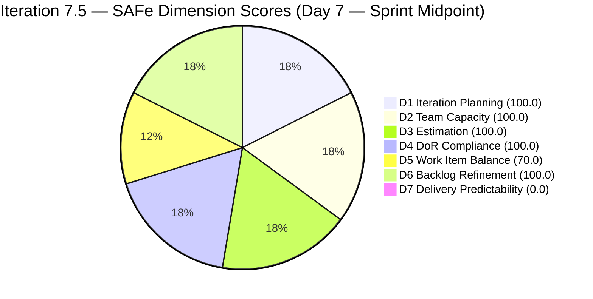
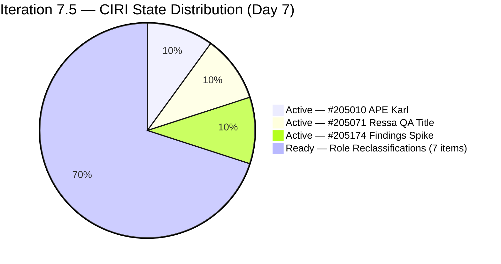
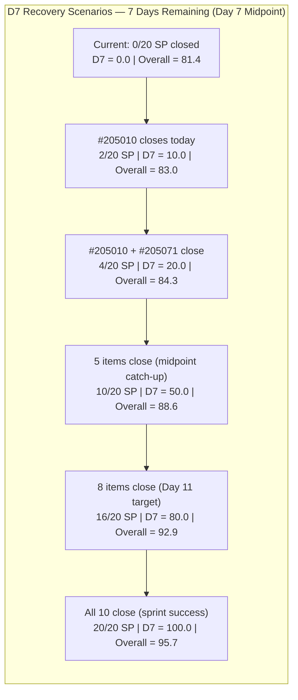

# ADO SAFe Audit — Human Resource Recruitment Team

## 1. Audit Metadata

| Field | Value |
|-------|-------|
| Audit Number | #82 |
| Audit Date | 2026-06-07 |
| Audit Time | 09:00 CST |
| Timezone | America/Chicago (CST) |
| Iteration | Iteration 7.5 |
| Iteration Dates | 2026-06-01 – 2026-06-14 |
| Sprint Day | Day 7 of 14 |
| ADO Project | Jairosoft FINOPS (`e0bb302f-40f9-46c3-8164-6f1acb317d63`) |
| ADO Team | Human Resource Recruitment Team (`248f59a6-372c-4b74-8129-9eaf260f211e`) |
| Iteration ID | `3b355811-2941-4edf-a8b1-7ffcdb478f9d` |
| Iteration Path | `Jairosoft FINOPS\2026-PI7\Iteration 7.5` |
| Workspace | `ado_hr` |
| Prior Audit | AUDIT_20260606_0900.md (Score: 81.4 — Low Risk, Day 6) |
| **Overall Score** | **81.4 / 100** |
| **Risk Band** | **Low Risk** |

---

## 2. Executive Summary

- Iteration 7.5 is now on **Day 7 of 14** — the sprint midpoint. The HR Recruitment Team holds at **81.4 / 100 (Low Risk)** for the third consecutive audit day, structurally unchanged.
- **D7 = 0.0 is a hardening delivery crisis.** No visible CIRI items moved to Closed between Day 6 and Day 7. The sprint is exactly at its midpoint with zero SP delivered in the visible backlog. The recommended Day 6 closures (#205010, #205071) did not materialize.
- A new item **#203605** ("Complete Claude CPN 4 Courses and get Certification") appears in the iteration — it is typed as **Task**, is unestimated, and has no Acceptance Criteria field. Tasks are excluded from VRBI scoring but represent an additional undocumented commitment for Almera.
- **VRBI count is unchanged at 10** (10 User Stories and 1 Spike in the Stories/Deliverables backlog). All 10 items remain in their Day 6 states: 3 Active, 7 Ready, 0 Closed visible.
- The four AC copy-paste artifacts (#205077, #205079, #205081, #205082) continue unremediated — now on Day 7 without correction.
- **Recovery arithmetic:** Closing 5 of 10 items (10 SP) in the remaining 7 days yields D7 = 50.0 and Overall = 88.6. Closing all 10 (20 SP) yields Overall = 95.7. The sprint is winnable if delivery resumes today.

---

## 3. Previous Audit Delta

| Metric | Audit #81 (2026-06-06, Day 6) | Audit #82 (2026-06-07, Day 7) | Change |
|--------|-------------------------------|-------------------------------|--------|
| Sprint Day | Day 6 of 14 | **Day 7 of 14** | +1 day |
| VRBI | 10 | **10** | No change |
| CIRI | 10 | **10** | No change |
| Items Closed (exited VRBI since sprint start) | 2 (#205011, #205244) | **2** | No new closures |
| SP Committed (visible CSP) | 20 SP | **20 SP** | No change |
| Items State: Active (CIRI) | 3 (#205010, #205071, #205174) | **3 (unchanged)** | No change |
| Items State: Ready (CIRI) | 7 | **7** | No change |
| Items State: Closed visible (CIRI) | 0 | **0** | No change |
| New item in iteration (not VRBI) | — | **#203605 (Task — Claude CPN)** | New Task observed |
| D1 — Iteration Planning | 100.0 | **100.0** | Unchanged |
| D2 — Team Capacity | 100.0 | **100.0** | Unchanged |
| D3 — Estimation | 100.0 | **100.0** | Unchanged |
| D4 — DoR Compliance | 100.0 | **100.0** | Unchanged |
| D5 — Work Item Balance | 70.0 | **70.0** | Unchanged |
| D6 — Backlog Refinement | 100.0 | **100.0** | Unchanged |
| D7 — Delivery Predictability | 0.0 (genuine gap, Day 6) | **0.0 (MIDPOINT CRISIS — Day 7)** | Third day at zero |
| **Overall Score** | **81.4 (Low Risk)** | **81.4 (Low Risk)** | **Unchanged** |

### Day 6 → Day 7 Interpretation

The sprint has reached its **exact midpoint** (Day 7 of 14) with zero visible SP delivered. The recommended closures from Day 6 — #205010 (APE Karl Analysis, Active since Day 1) and #205071 (Ressa QA Title, Active since Day 4) — did not occur. A new **Task** item (#203605, Claude CPN Courses) appeared in the iteration but is not scored; it adds undisclosed scope for Almera in the second half.

The score of 81.4 is maintained entirely by D1–D6 ceiling performance. D7's zero is now the dominant sprint risk. Each additional day without a visible closure further compresses the recovery window.

---

## 4. Current Iteration Snapshot

**Iteration 7.5** · 2026-06-01 – 2026-06-14 · **Day 7 of 14** · 7 days remaining

| Field | Value |
|-------|-------|
| Visible Root Backlog Items (VRBI) | 10 |
| Items in Iteration 7.5 (CIRI) | 10 |
| Items State: Active | 3 (#205010 APE Karl, #205071 Ressa QA, #205174 Findings Spike) |
| Items State: Ready | 7 (#205072, #205073, #205075, #205077, #205079, #205081, #205082) |
| Items State: Closed/Done (visible in backlog) | 0 |
| Items Closed (exited VRBI since sprint start) | 2 (#205011, #205244 — Closed Jun 4, not scored in D7) |
| SP Committed (visible CSP) | 20 SP |
| SP Burned (exited closures) | 4 SP (not scorable in D7) |
| Distinct Assignees on CIRI | 1 (Almera Kleer Tayao — all 10 items) |
| Capacity Configured | Almera: 5 hrs/day (3 Documentation + 2 Requirements); Grace: 0 hrs/day |
| Non-VRBI task in iteration | #203605 (Task — Claude CPN Courses, New, Almera, no SP) |
| Sprint Day | 7 of 14 — **MIDPOINT** |
| Days Remaining | 7 |

---

## 5. Work Item Analysis

| ID | Title | Type | State | SP | Assignee | DoR | ChangedDate | Note |
|----|-------|------|-------|----|----------|-----|-------------|------|
| 205010 | APE — Caumban, Karl Jordan (Analysis and Interpretation) | User Story | Active | 2 | Almera | PASS | 2026-06-02 | Active since Day 1; prerequisite #205244 closed Jun 4; overdue for closure (7 days) |
| 205071 | Ressa's New Job Title as QA | User Story | Active | 2 | Almera | PASS | 2026-06-04 | Active since Day 4; no closure in 3 days |
| 205072 | Jerlyn's New Job Title as QA | User Story | Ready | 2 | Almera | PASS | 2026-06-02 | |
| 205073 | Mary's New Job Title as QA | User Story | Ready | 2 | Almera | PASS | 2026-06-02 | |
| 205075 | Luz's New Job Title as QA | User Story | Ready | 2 | Almera | PASS | 2026-06-02 | |
| 205077 | Jaz's New Job Title as PO | User Story | Ready | 2 | Almera | PASS | 2026-06-02 | AC references "Luz" in Description — copy-paste artifact (Day 7) |
| 205079 | Ressa's New Job Title as PO | User Story | Ready | 2 | Almera | PASS | 2026-06-02 | AC references "Luz" — copy-paste artifact (Day 7) |
| 205081 | Jerlyn's New Job Title as PO | User Story | Ready | 2 | Almera | PASS | 2026-06-02 | AC references "Luz" — copy-paste artifact (Day 7) |
| 205082 | Karl's New Job Title as PMO Manager | User Story | Ready | 2 | Almera | PASS | 2026-06-02 | Description references "Luz"; AC references "AI-PO" for PMO role — copy-paste artifact (Day 7) |
| 205174 | Findings Presentation to Ramon | Spike | Active | 2 | Almera | PASS | 2026-06-02 | |

**Non-VRBI Iteration Item:**

| ID | Title | Type | State | SP | AssignedTo | DoR | Note |
|----|-------|------|-------|----|------------|-----|------|
| 203605 | Complete Claude CPN 4 Courses and get Certification | Task | New | — | Almera | n/a | Task type — excluded from VRBI/CIRI scoring. No AC field. Adds scope load to Almera. |

**Exited Backlog (Confirmed Closed — not scored in D7):**

| ID | Title | Type | SP | ClosedDate |
|----|-------|------|----|------------|
| 205011 | APE — Rommel Senillo — Summary | User Story | 2 | 2026-06-04 |
| 205244 | APE — Caumban, Karl Jordan (Gathering) | User Story | 2 | 2026-06-04 |

**DoR Summary:** 10/10 PASS (100%). All CIRI items have Description ≥ 30 and AC ≥ 20 non-whitespace chars.
**SP Summary:** 10/10 estimated (20 SP). All items 2 SP each.
**Type Breakdown (CIRI):** User Story = 9 (90.0%), Spike = 1 (10.0%)
**State Breakdown (CIRI):** Active = 3, Ready = 7, Closed = 0 visible

---

## 6. SAFe Compliance Scorecard

| Dimension | Score | Evidence (Numerator / Denominator) | Notes |
|-----------|-------|------------------------------------|-------|
| D1 — Iteration Planning | **100.0** | CIRI 10 / VRBI 10 | All 10 visible items assigned to Iter 7.5 |
| D2 — Team Capacity | **100.0** | CC 1 / CW 1 | Almera: 5 hrs/day; Grace: 0 hrs → excluded |
| D3 — Estimation | **100.0** | ECI 10 / PECI 10 | All 10 items at 2 SP; CSP = 20 |
| D4 — DoR Compliance | **100.0** | DCI 10 / CIRI 10 | All pass Desc ≥ 30 + AC ≥ 20 char thresholds |
| D5 — Work Item Balance | **70.0** | Base 100; −30 (US 90% > 60%); no −40 (US present); no −20 (Spike 10% ≤ 40%) | Structural HR work profile |
| D6 — Backlog Refinement | **100.0** | fresh 10/10; stale_90=0; stale_180=0; untouched 0/10 | All changed Jun 2–4; zero staleness |
| D7 — Delivery Predictability | **0.0** | CLSP 0 / CSP 20 | **Day 7 — Sprint midpoint. No visible closures. Third consecutive day at zero.** |

**Overall = (100.0 + 100.0 + 100.0 + 100.0 + 70.0 + 100.0 + 0.0) / 7 = 570.0 / 7 = 81.4 / 100 — Low Risk**

---

## 7. Dimension Findings

### D1 — Iteration Planning (100.0)

- VRBI = 10; CIRI = 10. All 10 visible root backlog items assigned to Iteration 7.5.
- #203605 (Task) and the two exited closed items (#205011, #205244) are in the iteration path but excluded from VRBI per type and status rules.
- Formula: 10 / 10 × 100 = **100.0**

### D2 — Team Capacity (100.0)

- CW = 1: Almera Kleer Tayao (assigned to all 10 CIRI items).
- CC = 1: Almera has 5 hrs/day (3 Documentation + 2 Requirements).
- Grace: 0 hrs/day, 0 CIRI items — excluded from both CW and CC.
- Formula: 1 / 1 × 100 = **100.0**

### D3 — Estimation (100.0)

- PECI = 10; ECI = 10. All 10 items have Story Points = 2.
- CSP = 20 SP.
- Formula: 10 / 10 × 100 = **100.0**

### D4 — DoR Compliance (100.0)

- All 10 CIRI items pass Description ≥ 30 and AC ≥ 20 non-whitespace character thresholds.
- AC copy-paste artifacts (#205077, #205079, #205081, #205082) persist — referencing wrong person names in Description/AC text. These pass character-count thresholds but contain factually wrong content. Day 7 without correction.
- Formula: 10 / 10 × 100 = **100.0**

### D5 — Work Item Balance (70.0)

- User Story = 9/10 = 90.0% → dominant type exceeds 60% threshold → −30 penalty.
- Spike = 1/10 = 10.0% → below 40% spike threshold → no −20 penalty.
- User Stories are present → no −40 penalty.
- Formula: max(0, 100 − 30) = **70.0**. Structural characteristic of HR batch work.

### D6 — Backlog Refinement (100.0)

- Fresh threshold (ChangedDate ≥ 2026-04-22): all 10 items changed 2026-06-02 or 2026-06-04 → 10/10 fresh → base = 100.0.
- Stale_90 (< 2026-03-09): 0 items.
- Stale_180 (< 2025-12-10): 0 items.
- Untouched CIRI (ChangedDate < 2026-06-01): 0 items.
- Formula: max(0, 100.0) = **100.0**

### D7 — Delivery Predictability (0.0) — MIDPOINT DELIVERY CRISIS

- CSP = 20 SP; CLSP = 0 SP.
- Formula: 0 / 20 × 100 = **0.0**
- **Day 7 = sprint midpoint.** This is the third consecutive day with D7 = 0.0 as a genuine (non-annotated) gap. Both recommended closures from Day 6 (#205010, #205071) did not occur. No new ADO state changes were detected overnight.
- **Context:** 4 SP (items #205011, #205244, closed June 4) were burned and exited the VRBI. Per rubric, D7 scores only visible items — actual velocity is non-zero but cannot be reflected.
- **Recovery projections (7 days remaining):**
  - Close #205010 (2 SP): D7 = 10.0 → Overall = 83.0
  - Close #205010 + #205071 (4 SP): D7 = 20.0 → Overall = 84.3
  - Close 5 items by Day 7 midpoint (10 SP): D7 = 50.0 → Overall = 88.6
  - Close all 10 (20 SP): D7 = 100.0 → Overall = 95.7
- The score is structurally recoverable. The sprint is not lost. But closures must begin **today**.

---

## 8. Risks and Bottlenecks

| Risk | Severity | Status | Details |
|------|----------|--------|---------|
| D7 = 0.0 — midpoint delivery crisis (Day 7) | **CRITICAL** | Escalating | No visible closures for 7 sprint days. #205010 Active since Day 1; #205071 Active since Day 4. Score locked at 81.4 without closures. |
| #205010 (APE Karl Analysis) — Day 7, Active 7 days | **CRITICAL** | No progress | Prerequisite #205244 closed June 4. Analysis should be completable in one focused session. |
| New Task #203605 (Claude CPN) — undisclosed scope | **MEDIUM** | New observation | Task type, unestimated, no AC. Adds sprint-half load to Almera without VRBI visibility. |
| AC copy-paste artifacts (#205077, 079, 081, 082) | **MEDIUM** | 7th day unremediated | Description and AC reference wrong names/roles. Passes DoR threshold but accuracy risk. |
| D5 structural penalty (−30) | **LOW** | Structural | 90% User Story dominance; inherent to HR work profile. |
| Bus factor = 1 (Almera only) | **LOW** | Structural/persistent | All 10 items assigned to Almera; Grace 0 capacity. |
| No sprint goal defined (28th consecutive audit) | **LOW** | Persistent | Iteration 7.5 has no documented sprint goal in ADO. |
| No PI objectives linked | **INFO** | Persistent | PI7 objectives not linked to iteration items. |

---

## 9. Prioritized Recommendations

1. **Close #205010 (APE Karl Analysis) today — Day 7, CRITICAL** — This item has been Active for 7 full sprint days. The prerequisite (#205244, gathering) was completed June 4. The analysis and interpretation work has had ample time. Close it today: finalize the evaluation results discussion, get Almera's sign-off, and mark Closed in ADO. This single action: D7 = 2/20 = 10.0, Overall → 83.0. Continuing to hold this Active without closing represents a process breakdown.

2. **Batch-close role reclassification stories today (HIGH)** — Items #205071 (Ressa QA, Active), #205072 (Jerlyn QA, Ready), #205073 (Mary QA, Ready), and #205075 (Luz QA, Ready) are structurally identical. If Ressa's reclassification sign-off is obtainable today, all four can follow in sequence. Closing all four: D7 = 10/20 = 50.0, Overall = 88.6. This is the fastest path to a Strong Low Risk score.

3. **Target 8+ closures by Day 11 (June 11) for sprint success (HIGH)** — With 7 days remaining and 10 items, closing 8 by Day 11 yields D7 = 80.0, Overall = 92.9 (Low Risk, strong). The PO/PMO reclassification stories (#205077 Jaz, #205079 Ressa, #205081 Jerlyn, #205082 Karl) are in Ready state — they need sign-off and documentation only.

4. **Fix AC copy-paste artifacts in #205077, 079, 081, 082 today (MODERATE)** — Now at 7 consecutive unremediated days. Required corrections (10 min each):
   - #205077 (Jaz as PO): Replace "Luz" with "Jaz" in Description and AC; update "AI-QA" context to "AI-PO."
   - #205079 (Ressa as PO): Replace "Luz" with "Ressa" in Description and AC.
   - #205081 (Jerlyn as PO): Replace "Luz" with "Jerlyn" in Description and AC.
   - #205082 (Karl as PMO Manager): Replace "Luz" with "Karl"; update "AI-PO" to "AI-PMO" context.

5. **Document Task #203605 (Claude CPN Courses) properly or move to backlog (MODERATE)** — Item #203605 is typed as a Task, has no Story Points, no Acceptance Criteria, and no parent story. It is invisible to the VRBI audit. If this is planned sprint work for Almera, it should be converted to a User Story with SP and AC, or confirmed as an off-sprint personal development activity.

6. **Define sprint goal for Iteration 7.5 (MODERATE — 28th audit without one)** — Suggested: *"Complete APE analysis for Karl Jordan Caumban, finalize AI-augmented role reclassifications for 8 staff (4 QA + 4 PO/PMO), and present employee benefits findings to Ramon — all by end of Iteration 7.5 (June 14)."*

---

## 10. Evidence Gaps and Limitations

| Gap | Impact | Notes |
|-----|--------|-------|
| #205011 and #205244 exited VRBI | D7 cannot count 4 SP burned | Closed June 4; exited backlog per rubric. Actual velocity is non-zero. |
| #203605 is Task type | Excluded from all 7 dimensions | Task items not in Stories/Deliverables backlog; adds real scope to Almera undetectable by VRBI scoring. |
| Grace at 0 capacity | D2 correct exclusion | 0 hrs/day + 0 CIRI items; excluded from CW and CC per formula. |
| AC copy-paste accuracy | Quality concern, no DoR scoring impact | #205077–205082 contain wrong names in text; pass char-count threshold. |
| Sprint goal absent | D1 quality context missing | 28th consecutive audit without sprint goal. |

---

## Visualizations

### Score Trend — HR Recruitment Team (PI7 Iteration 7.5)

| Date | Audit | Score | Band | Sprint Day | Notable |
|------|-------|-------|------|-----------|---------|
| Jun 1 | #76 | 47.6 | High | Day 1 | Sprint open; D2=0, D3=25.0, D4=58.3 |
| Jun 2 | #77 | 47.6 | High | Day 2 | Zero remediation |
| Jun 3 | #78 | 81.4 | Low | Day 3 | All gaps fixed; +33.8 pts |
| Jun 4 | #79 | 81.4 | Low | Day 4 | 2 items closed (4 SP burned); score stable |
| Jun 5 | #80 | 81.4 | Low | Day 5 | Last early-sprint annotation day |
| Jun 6 | #81 | 81.4 | Low | Day 6 | Early-sprint window closed; D7=0.0 genuine gap |
| **Jun 7** | **#82** | **81.4** | **Low** | **Day 7** | **Sprint midpoint; D7=0.0 third day; midpoint delivery crisis** |

### D7 Projection Table — Iteration 7.5 (20 SP Visible, 7 days remaining)

| Scenario | SP Closed (visible) | D7 | Projected Overall | Band |
|----------|--------------------|----|-------------------|------|
| 0 closures (current) | 0/20 | 0.0 | 81.4 | Low |
| #205010 closes | 2/20 | 10.0 | 83.0 | Low |
| #205010 + #205071 close | 4/20 | 20.0 | 84.3 | Low |
| 5 items close | 10/20 | 50.0 | 88.6 | Low |
| 8 items close (Day 11 target) | 16/20 | 80.0 | 92.9 | Low |
| All 10 items close | 20/20 | 100.0 | 95.7 | Low |

---

*Audit #82 generated by Claude Code (claude-sonnet-4-6) on 2026-06-07 09:00 CST. Evidence sourced from Azure DevOps MCP (Jairosoft FINOPS project, team 248f59a6-372c-4b74-8129-9eaf260f211e, Iteration 7.5 ID 3b355811-2941-4edf-a8b1-7ffcdb478f9d). Rubric: SAFe 6.0 7-dimension scorecard v1. Iteration 7.5 is Day 7 of 14 — sprint midpoint. Score: 81.4 / 100 (Low Risk — unchanged for 3 days). 10 visible items, 20 SP. 2 items confirmed Closed (4 SP burned — not scored in D7 per rubric). D7 = 0.0 — midpoint delivery crisis; no closures in 7 sprint days. Priority: close #205010 immediately, batch-close QA reclassification stories today.*
