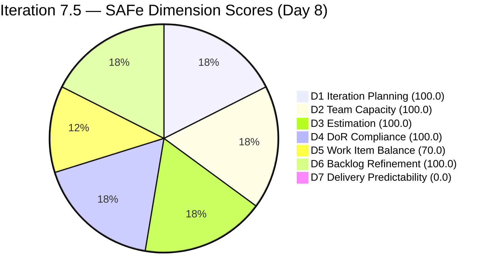
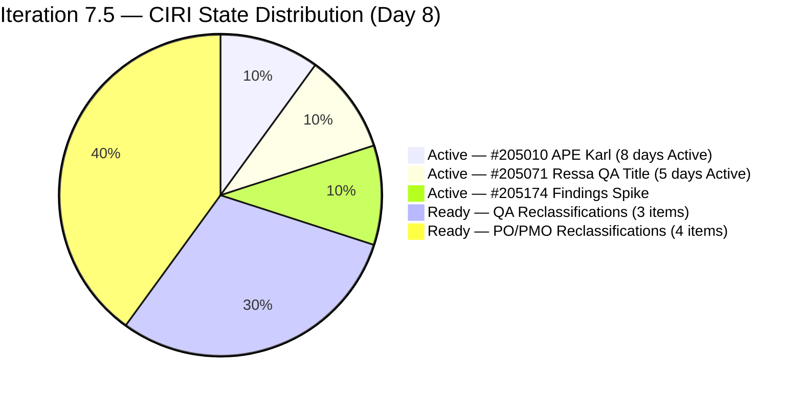
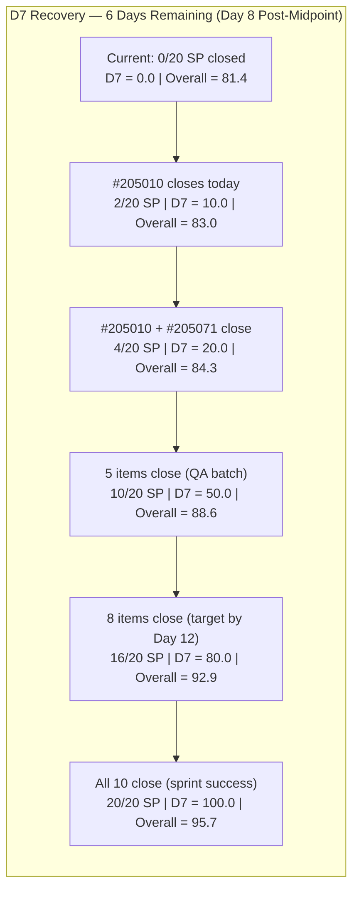

# ADO SAFe Audit — Human Resource Recruitment Team

## 1. Audit Metadata

| Field | Value |
|-------|-------|
| Audit Number | #83 |
| Audit Date | 2026-06-08 |
| Audit Time | 09:00 CST |
| Timezone | America/Chicago (CST) |
| Iteration | Iteration 7.5 |
| Iteration Dates | 2026-06-01 – 2026-06-14 |
| Sprint Day | Day 8 of 14 |
| ADO Project | Jairosoft FINOPS (`e0bb302f-40f9-46c3-8164-6f1acb317d63`) |
| ADO Team | Human Resource Recruitment Team (`248f59a6-372c-4b74-8129-9eaf260f211e`) |
| Iteration ID | `3b355811-2941-4edf-a8b1-7ffcdb478f9d` |
| Iteration Path | `Jairosoft FINOPS\2026-PI7\Iteration 7.5` |
| Workspace | `ado_hr` |
| Prior Audit | AUDIT_20260607_0900.md (Score: 81.4 — Low Risk, Day 7) |
| **Overall Score** | **81.4 / 100** |
| **Risk Band** | **Low Risk** |

---

## 2. Executive Summary

- Iteration 7.5 is now on **Day 8 of 14** — past the sprint midpoint. The HR Recruitment Team holds at **81.4 / 100 (Low Risk)** for the **fourth consecutive audit day**, structurally unchanged. All 10 visible CIRI items remain in their Day 7 states.
- **D7 = 0.0 is a critical sprint delivery failure.** No items have moved to Closed since Day 4 (June 4). The team is now on Day 8 with 6 remaining sprint days and zero visible SP burned since items #205011 and #205244 closed on June 4.
- Items #205010 (APE Karl Analysis, Active 8 days) and #205071 (Ressa QA Title, Active 5 days) continue to stall. Both recommended-for-closure items from Day 6, 7 have not moved. This is the **fourth consecutive day** without action on these items.
- The four AC copy-paste artifacts (#205077, #205079, #205081, #205082) remain unremediated — now on **Day 8** without correction.
- **Recovery window is narrowing fast.** With 6 days remaining, closing 5 of 10 items (10 SP) yields D7 = 50.0 and Overall = 88.6. The sprint is recoverable but requires closures today. Each day of inaction reduces the ceiling.

---

## 3. Previous Audit Delta

| Metric | Audit #82 (2026-06-07, Day 7) | Audit #83 (2026-06-08, Day 8) | Change |
|--------|-------------------------------|-------------------------------|--------|
| Sprint Day | Day 7 of 14 | **Day 8 of 14** | +1 day |
| VRBI | 10 | **10** | No change |
| CIRI | 10 | **10** | No change |
| Items Closed (exited VRBI since sprint start) | 2 (#205011, #205244) | **2** | No new closures |
| SP Committed (visible CSP) | 20 SP | **20 SP** | No change |
| Items State: Active (CIRI) | 3 (#205010, #205071, #205174) | **3 (unchanged)** | No change |
| Items State: Ready (CIRI) | 7 | **7** | No change |
| Items State: Closed visible (CIRI) | 0 | **0** | No change |
| D1 — Iteration Planning | 100.0 | **100.0** | Unchanged |
| D2 — Team Capacity | 100.0 | **100.0** | Unchanged |
| D3 — Estimation | 100.0 | **100.0** | Unchanged |
| D4 — DoR Compliance | 100.0 | **100.0** | Unchanged |
| D5 — Work Item Balance | 70.0 | **70.0** | Unchanged |
| D6 — Backlog Refinement | 100.0 | **100.0** | Unchanged |
| D7 — Delivery Predictability | 0.0 (Midpoint Crisis — Day 7) | **0.0 (Post-Midpoint Crisis — Day 8)** | Fourth day at zero |
| **Overall Score** | **81.4 (Low Risk)** | **81.4 (Low Risk)** | **Unchanged** |

### Day 7 → Day 8 Interpretation

Zero ADO state changes were detected overnight. The sprint has now consumed 57% of its calendar (8 of 14 days) with zero visible SP delivered. The two items recommended for immediate closure since Day 6 — #205010 (APE Karl Analysis) and #205071 (Ressa QA Title) — remain Active. The score of 81.4 is being held entirely by D1–D6 ceiling performance while D7 sits at zero for a fourth consecutive day.

The AC copy-paste artifacts (#205077, #205079, #205081, #205082) are now 8 days unremediated. These require approximately 10 minutes each to correct.

---

## 4. Current Iteration Snapshot

**Iteration 7.5** · 2026-06-01 – 2026-06-14 · **Day 8 of 14** · 6 days remaining

| Field | Value |
|-------|-------|
| Visible Root Backlog Items (VRBI) | 10 |
| Items in Iteration 7.5 (CIRI) | 10 |
| Items State: Active | 3 (#205010 APE Karl, #205071 Ressa QA, #205174 Findings Spike) |
| Items State: Ready | 7 (#205072, #205073, #205075, #205077, #205079, #205081, #205082) |
| Items State: Closed/Done (visible in backlog) | 0 |
| Items Closed (exited VRBI since sprint start) | 2 (#205011, #205244 — Closed Jun 4, not scored in D7) |
| SP Committed (visible CSP) | 20 SP |
| SP Burned (exited closures) | 4 SP (not scorable in D7) |
| Distinct Assignees on CIRI | 1 (Almera Kleer Tayao — all 10 items) |
| Capacity Configured | Almera: 5 hrs/day (3 Documentation + 2 Requirements); Grace: 0 hrs/day |
| Non-VRBI task in iteration | #203605 (Task — Claude CPN Courses, Almera) |
| Sprint Day | 8 of 14 — **Post-Midpoint, 6 days remain** |
| Days Remaining | 6 |

---

## 5. Work Item Analysis

| ID | Title | Type | State | SP | Assignee | DoR | ChangedDate | Note |
|----|-------|------|-------|----|----------|-----|-------------|------|
| 205010 | APE — Caumban, Karl Jordan (Analysis and Interpretation) | User Story | Active | 2 | Almera | PASS | 2026-06-02 | Active 8 sprint days; prerequisite #205244 closed Jun 4; overdue |
| 205071 | Ressa's New Job Title as QA | User Story | Active | 2 | Almera | PASS | 2026-06-04 | Active 5 sprint days; no progress since Jun 4 |
| 205072 | Jerlyn's New Job title as QA | User Story | Ready | 2 | Almera | PASS | 2026-06-02 | Ready — needs sign-off |
| 205073 | Mary's New Job Title as QA | User Story | Ready | 2 | Almera | PASS | 2026-06-02 | Ready — needs sign-off |
| 205075 | Luz's New Job Title as QA | User Story | Ready | 2 | Almera | PASS | 2026-06-02 | Ready — needs sign-off |
| 205077 | Jaz's New Job Title as PO | User Story | Ready | 2 | Almera | PASS | 2026-06-02 | Description references "Luz" — copy-paste artifact, Day 8 |
| 205079 | Ressa's New Job Title as PO | User Story | Ready | 2 | Almera | PASS | 2026-06-02 | Description references "Luz" — copy-paste artifact, Day 8 |
| 205081 | Jerlyn's New Job Title as PO | User Story | Ready | 2 | Almera | PASS | 2026-06-02 | Description references "Luz" — copy-paste artifact, Day 8 |
| 205082 | Karl's New Job Title as PMO Manager | User Story | Ready | 2 | Almera | PASS | 2026-06-02 | Description references "Luz", AC references "AI-PO" — copy-paste, Day 8 |
| 205174 | Findings presentation to Ramon | Spike | Active | 2 | Almera | PASS | 2026-06-02 | Active — presentation pending |

**Non-VRBI Iteration Item:**

| ID | Title | Type | State | SP | AssignedTo | Note |
|----|-------|------|-------|----|------------|------|
| 203605 | Complete Claude CPN 4 Courses and get Certification | Task | New | — | Almera | Task type — excluded from VRBI/CIRI scoring. Adds scope to Almera. |

**Exited Backlog (Confirmed Closed — not scored in D7):**

| ID | Title | Type | SP | ClosedDate |
|----|-------|------|----|------------|
| 205011 | APE — Rommel Senillo — Summary | User Story | 2 | 2026-06-04 |
| 205244 | APE — Caumban, Karl Jordan (Gathering) | User Story | 2 | 2026-06-04 |

**DoR Summary:** 10/10 PASS (100.0%). All CIRI items meet Description ≥ 30 and AC ≥ 20 non-whitespace char thresholds.
**SP Summary:** 10/10 estimated (20 SP). All items 2 SP.
**Type Breakdown (CIRI):** User Story = 9 (90.0%), Spike = 1 (10.0%)
**State Breakdown (CIRI):** Active = 3, Ready = 7, Closed = 0

---

## 6. SAFe Compliance Scorecard

| Dimension | Score | Evidence (Numerator / Denominator) | Notes |
|-----------|-------|------------------------------------|-------|
| D1 — Iteration Planning | **100.0** | CIRI 10 / VRBI 10 | All 10 visible items assigned to Iter 7.5 |
| D2 — Team Capacity | **100.0** | CC 1 / CW 1 | Almera: 5 hrs/day; Grace: 0 hrs → excluded |
| D3 — Estimation | **100.0** | ECI 10 / PECI 10 | All 10 items at 2 SP; CSP = 20 |
| D4 — DoR Compliance | **100.0** | DCI 10 / CIRI 10 | All pass Desc ≥ 30 + AC ≥ 20 char thresholds |
| D5 — Work Item Balance | **70.0** | Base 100; −30 (US 90% > 60%); no −40; no −20 | Structural HR work profile |
| D6 — Backlog Refinement | **100.0** | fresh 10/10; stale_90=0; stale_180=0; untouched 0/10 | All changed Jun 2–4; zero staleness |
| D7 — Delivery Predictability | **0.0** | CLSP 0 / CSP 20 | **Day 8 — no visible closures. Fourth consecutive day at zero.** |

**Overall = (100.0 + 100.0 + 100.0 + 100.0 + 70.0 + 100.0 + 0.0) / 7 = 570.0 / 7 = 81.4 / 100 — Low Risk**

---

## 7. Dimension Findings

### D1 — Iteration Planning (100.0)

- VRBI = 10; CIRI = 10. All 10 visible root backlog items assigned to Iteration 7.5.
- #203605 (Task) and the two exited closed items (#205011, #205244) are in the iteration path but excluded from VRBI per type and status rules.
- Formula: 10 / 10 × 100 = **100.0**

### D2 — Team Capacity (100.0)

- CW = 1: Almera Kleer Tayao (assigned to all 10 CIRI items).
- CC = 1: Almera has 5 hrs/day (3 Documentation + 2 Requirements). Grace: 0 hrs/day, 0 CIRI items → excluded.
- Formula: 1 / 1 × 100 = **100.0**

### D3 — Estimation (100.0)

- PECI = 10; ECI = 10. All 10 items carry 2 SP. CSP = 20 SP.
- Formula: 10 / 10 × 100 = **100.0**

### D4 — DoR Compliance (100.0)

- All 10 CIRI items pass Description ≥ 30 and AC ≥ 20 non-whitespace character thresholds.
- Copy-paste artifacts in #205077, #205079, #205081, #205082 persist (wrong names in Description/AC text). These pass the char-count threshold but contain inaccurate content. Now Day 8 unremediated.
- Formula: 10 / 10 × 100 = **100.0**

### D5 — Work Item Balance (70.0)

- User Story = 9/10 = 90.0% → dominant type exceeds 60% threshold → −30 penalty.
- Spike = 1/10 = 10.0% → below 40% spike threshold → no −20 penalty.
- User Stories present → no −40 penalty.
- Formula: max(0, 100 − 30) = **70.0**. Structural characteristic of HR batch work.

### D6 — Backlog Refinement (100.0)

- Fresh threshold (ChangedDate ≥ 2026-04-24): all 10 items changed 2026-06-02 or 2026-06-04 → 10/10 fresh → base = 100.0.
- Stale_90 (before 2026-03-10): 0 items. Stale_180 (before 2025-12-11): 0 items.
- Untouched CIRI (ChangedDate < 2026-06-01): 0 items.
- Formula: max(0, 100.0) = **100.0**

### D7 — Delivery Predictability (0.0) — Post-Midpoint Delivery Failure

- CSP = 20 SP; CLSP = 0 SP.
- Formula: 0 / 20 × 100 = **0.0**
- **Day 8 — 6 days remaining.** This is the fourth consecutive day with D7 = 0.0. No ADO state transitions detected overnight between Day 7 and Day 8. Neither #205010 (Active 8 days) nor #205071 (Active 5 days) have moved toward closure.
- **Context:** 4 SP (items #205011, #205244, closed June 4) were burned and exited VRBI. Per rubric, D7 scores only visible items.
- **Recovery projections (6 days remaining):**
  - Close #205010 only (2 SP): D7 = 10.0 → Overall = 83.0
  - Close #205010 + #205071 (4 SP): D7 = 20.0 → Overall = 84.3
  - Close 5 items (10 SP): D7 = 50.0 → Overall = 88.6
  - Close 8 items (16 SP): D7 = 80.0 → Overall = 92.9
  - Close all 10 (20 SP): D7 = 100.0 → Overall = 95.7

---

## 8. Risks and Bottlenecks

| Risk | Severity | Status | Details |
|------|----------|--------|---------|
| D7 = 0.0 — post-midpoint delivery failure (Day 8) | **CRITICAL** | Escalating — 4th day | Zero visible closures for 8 sprint days. Score held at 81.4 entirely by D1–D6 ceiling. 6 days left to recover. |
| #205010 (APE Karl Analysis) — Active 8 sprint days | **CRITICAL** | No progress | Prerequisite #205244 closed Jun 4. Analysis phase has had ample time. Must close today. |
| #205071 (Ressa QA Title) — Active 5 sprint days | **HIGH** | No progress since Jun 4 | Role reclassification story; should be closeable once sign-off obtained. |
| 6 Ready items stalled (QA and PO reclassifications) | **HIGH** | Untouched since Jun 2 | #205072, 073, 075 (QA), #205077, 079, 081, 082 (PO/PMO) — all in Ready state, not advancing. |
| AC copy-paste artifacts (#205077, 079, 081, 082) | **MEDIUM** | Day 8 unremediated | Description and AC reference wrong names/roles. 10 min fix each. |
| #203605 (Task — Claude CPN Courses) — undisclosed sprint load | **MEDIUM** | New in Day 7 | Unestimated, no AC, no parent story. Adds sprint commitment for Almera invisibly. |
| Bus factor = 1 (Almera only) | **LOW** | Structural/persistent | All 10 items assigned to Almera; Grace 0 capacity. |
| No sprint goal defined (29th consecutive audit) | **LOW** | Persistent | Iteration 7.5 has no documented sprint goal in ADO. |
| No PI objectives linked | **INFO** | Persistent | PI7 objectives not linked to iteration items. |

---

## 9. Prioritized Recommendations

1. **Close #205010 (APE Karl Analysis) immediately — Day 8, CRITICAL (9th escalation)** — This item has been Active for 8 full sprint days. The prerequisite (#205244) was closed June 4. The analysis, discussion of results, and documentation should have been completable in one focused session. Finalize the evaluation discussion with Almera today, document results, and mark Closed in ADO. This single action raises Overall to 83.0.

2. **Batch-close role reclassification stories today — HIGH** — Items #205071 (Ressa QA, Active since Day 4), #205072 (Jerlyn QA, Ready), #205073 (Mary QA, Ready), and #205075 (Luz QA, Ready) are structurally identical role documents. If Ressa's reclassification sign-off is obtainable today, all four can follow in sequence. Closing all four from Day 8: D7 = 10/20 = 50.0 → Overall = 88.6.

3. **Close PO/PMO reclassification stories in the second half (Days 9–12) — HIGH** — Items #205077 (Jaz PO), #205079 (Ressa PO), #205081 (Jerlyn PO), #205082 (Karl PMO). These are in Ready state with sign-off as the only remaining step. Closing all four adds another 8 SP toward D7.

4. **Fix AC copy-paste artifacts in #205077, 079, 081, 082 today — MODERATE (Day 8, 8th escalation)** — Required corrections:
   - #205077 (Jaz as PO): Replace "Luz" with "Jaz" in Description; update AC context from "AI-QA" to "AI-PO."
   - #205079 (Ressa as PO): Replace "Luz" with "Ressa" in Description.
   - #205081 (Jerlyn as PO): Replace "Luz" with "Jerlyn" in Description.
   - #205082 (Karl as PMO): Replace "Luz" with "Karl"; update "AI-PO" to "AI-PMO" context.

5. **Close or convert #203605 (Task — Claude CPN Courses) — MODERATE** — If this is planned sprint work for Almera, convert to a User Story with SP and AC. If it is personal development time, move it off the iteration board to avoid scope confusion.

6. **Define sprint goal for Iteration 7.5 — MODERATE (29th audit without one)** — Suggested: *"Complete APE analysis for Karl Jordan Caumban, finalize AI-augmented role reclassifications for 8 staff (4 QA + 4 PO/PMO), and present employee benefits findings to Ramon — all by June 14."*

---

## 10. Evidence Gaps and Limitations

| Gap | Impact | Notes |
|-----|--------|-------|
| #205011 and #205244 exited VRBI | D7 cannot count 4 SP burned | Closed June 4; exited backlog per rubric. Actual velocity is non-zero. |
| #203605 is Task type | Excluded from all 7 dimensions | Adds real scope to Almera's sprint load; invisible to VRBI scoring. |
| Grace at 0 capacity | D2 correct exclusion | 0 hrs/day + 0 CIRI items; excluded from CW and CC. |
| AC copy-paste accuracy | Quality concern only, no DoR impact | #205077–205082 contain wrong names in text; pass char-count threshold. |
| Sprint goal absent | D1 quality context missing | 29th consecutive audit without sprint goal. |

---

## Visualizations

### Score Trend — HR Recruitment Team (PI7 Iteration 7.5)

| Date | Audit | Score | Band | Sprint Day | Notable |
|------|-------|-------|------|-----------|---------|
| Jun 1 | #76 | 47.6 | High | Day 1 | Sprint open; D2=0, D3=25.0 |
| Jun 2 | #77 | 47.6 | High | Day 2 | Zero remediation |
| Jun 3 | #78 | 81.4 | Low | Day 3 | All gaps fixed; +33.8 pts |
| Jun 4 | #79 | 81.4 | Low | Day 4 | 2 items closed (4 SP burned) |
| Jun 5 | #80 | 81.4 | Low | Day 5 | Last early-sprint annotation day |
| Jun 6 | #81 | 81.4 | Low | Day 6 | D7=0.0 genuine gap |
| Jun 7 | #82 | 81.4 | Low | Day 7 | Sprint midpoint; D7=0.0 third day |
| **Jun 8** | **#83** | **81.4** | **Low** | **Day 8** | **Post-midpoint; D7=0.0 fourth day; 6 days left** |

### D7 Projection Table — Iteration 7.5 (20 SP Visible, 6 days remaining)

| Scenario | SP Closed (visible) | D7 | Projected Overall | Band |
|----------|--------------------|----|-------------------|------|
| 0 closures (current) | 0/20 | 0.0 | 81.4 | Low |
| #205010 closes | 2/20 | 10.0 | 83.0 | Low |
| #205010 + #205071 close | 4/20 | 20.0 | 84.3 | Low |
| 5 items close (QA batch) | 10/20 | 50.0 | 88.6 | Low |
| 8 items close (Day 12 target) | 16/20 | 80.0 | 92.9 | Low |
| All 10 items close | 20/20 | 100.0 | 95.7 | Low |

---

*Audit #83 generated by Claude Code (claude-sonnet-4-6) on 2026-06-08 09:00 CST. Evidence sourced from Azure DevOps MCP (Jairosoft FINOPS project, team 248f59a6-372c-4b74-8129-9eaf260f211e, Iteration 7.5 ID 3b355811-2941-4edf-a8b1-7ffcdb478f9d). Rubric: SAFe 6.0 7-dimension scorecard v1. Iteration 7.5 is Day 8 of 14 — post-midpoint. Score: 81.4 / 100 (Low Risk — unchanged for 4 days). 10 visible items, 20 SP. 2 items confirmed Closed (4 SP burned — not scored in D7). D7 = 0.0 — post-midpoint delivery crisis; fourth consecutive zero day. 6 sprint days remain. Priority: close #205010 and #205071 immediately, batch-close QA reclassification stories today.*
