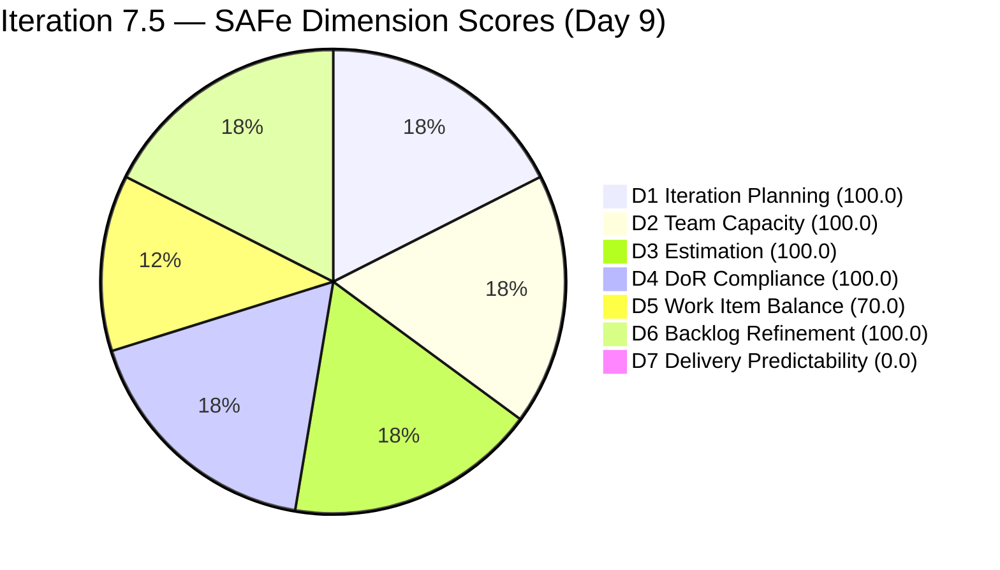
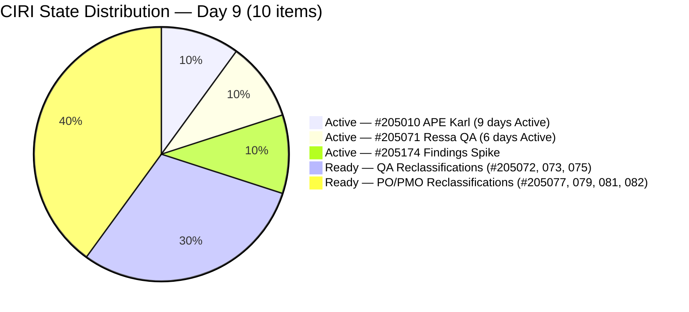
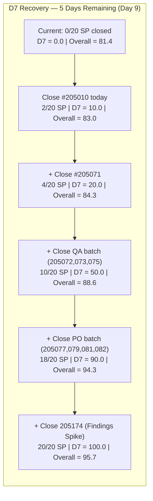

# ADO SAFe Audit — Human Resource Recruitment Team

## 1. Audit Metadata

| Field | Value |
|-------|-------|
| Audit Number | #84 |
| Audit Date | 2026-06-09 |
| Audit Time | 02:04 CST |
| Timezone | America/Chicago (CST) |
| Iteration | Iteration 7.5 |
| Iteration Dates | 2026-06-01 – 2026-06-14 |
| Sprint Day | Day 9 of 14 |
| ADO Project | Jairosoft FINOPS (`e0bb302f-40f9-46c3-8164-6f1acb317d63`) |
| ADO Team | Human Resource Recruitment Team (`248f59a6-372c-4b74-8129-9eaf260f211e`) |
| Iteration ID | `3b355811-2941-4edf-a8b1-7ffcdb478f9d` |
| Iteration Path | `Jairosoft FINOPS\2026-PI7\Iteration 7.5` |
| Workspace | `ado_hr` |
| Prior Audit | AUDIT_20260608_0900.md (Score: 81.4 — Low Risk, Day 8) |
| **Overall Score** | **81.4 / 100** |
| **Risk Band** | **Low Risk** |

---

## 2. Executive Summary

- Iteration 7.5 is now on **Day 9 of 14** — 64% of the sprint has elapsed, leaving only 5 days. The HR Recruitment Team holds at **81.4 / 100 (Low Risk)** for the **fifth consecutive audit day**, structurally unchanged in all seven dimensions.
- **Significant ADO activity detected on Day 8 (June 8):** All 10 VRBI items show `ChangedDate = 2026-06-08`, confirming Almera performed widespread edits. Despite this activity, no state transitions occurred — #205010 (APE Karl Analysis) and #205071 (Ressa QA Title) remain Active; all 7 Ready items remain Ready.
- **D7 = 0.0 — fifth consecutive zero delivery day.** No VRBI items have entered Closed state. Items #205011 and #205244 closed on June 4 but have exited the VRBI and cannot contribute to D7.
- **Copy-paste artifacts persist.** Items #205077 (Jaz as PO), #205079 (Ressa as PO), #205081 (Jerlyn as PO), #205082 (Karl as PMO) still contain "Luz" references in their descriptions despite Day 8 edits.
- **5 days remain.** The scoring ceiling from this point: if all 10 VRBI items close → D7=100.0 → Overall=95.7. Minimum for Low Risk exit (>80): current score is already Low Risk. Recovery to SAFe target (≥80) is maintained but the trend of zero delivery days is deeply concerning for actual sprint outcomes.

---

## 3. Previous Audit Delta

| Metric | Audit #83 (2026-06-08, Day 8) | Audit #84 (2026-06-09, Day 9) | Change |
|--------|-------------------------------|-------------------------------|--------|
| Sprint Day | Day 8 of 14 | **Day 9 of 14** | +1 day |
| VRBI | 10 | **10** | No change |
| CIRI | 10 | **10** | No change |
| Items Closed (exited VRBI since sprint start) | 2 | **2** | No new closures |
| ADO Activity (ChangedDate updates) | Jun 2–4 edits only | **All 10 items updated Jun 8** | Widespread edits (no state change) |
| Items State: Active (CIRI) | 3 | **3 (unchanged)** | No state transitions |
| Items State: Ready (CIRI) | 7 | **7** | No change |
| Items State: Closed/Done (CIRI) | 0 | **0** | No change |
| SP Committed (CSP) | 20 SP | **20 SP** | No change |
| D1 — Iteration Planning | 100.0 | **100.0** | Unchanged |
| D2 — Team Capacity | 100.0 | **100.0** | Unchanged |
| D3 — Estimation | 100.0 | **100.0** | Unchanged |
| D4 — DoR Compliance | 100.0 | **100.0** | Unchanged |
| D5 — Work Item Balance | 70.0 | **70.0** | Unchanged |
| D6 — Backlog Refinement | 100.0 | **100.0** | Unchanged |
| D7 — Delivery Predictability | 0.0 | **0.0** | Fifth day at zero |
| **Overall Score** | **81.4 (Low Risk)** | **81.4 (Low Risk)** | **Unchanged** |

### Day 8 → Day 9 Interpretation

All 10 VRBI items were modified on June 8 (yesterday) — revisions incremented across all items. This confirms Almera was actively working in ADO. However, no items moved from Active or Ready to Closed. The Active items (#205010 APE Karl — now Active for 9 sprint days, #205071 Ressa QA — Active for 6 sprint days, #205174 Findings Spike) remain open. The 7 Ready items (reclassification stories) remain untouched in state.

Despite this ADO editing activity, the copy-paste artifacts in #205077, #205079, #205081, #205082 persist as of the June 8 edits — descriptions continue to reference "Luz" instead of the correct subject names. The content quality issue is now confirmed Day 9 unremediated despite editing activity.

---

## 4. Current Iteration Snapshot

**Iteration 7.5** · 2026-06-01 – 2026-06-14 · **Day 9 of 14** · 5 days remaining

| Field | Value |
|-------|-------|
| Visible Root Backlog Items (VRBI) | 10 |
| Items in Iteration 7.5 (CIRI) | 10 |
| Items State: Active | 3 (#205010 APE Karl, #205071 Ressa QA, #205174 Findings Spike) |
| Items State: Ready | 7 (#205072, #205073, #205075, #205077, #205079, #205081, #205082) |
| Items State: Closed/Done (CIRI) | 0 |
| Items Closed (exited VRBI since sprint start) | 2 (#205011, #205244 — Closed Jun 4, exited VRBI) |
| SP Committed (CSP visible) | 20 SP |
| SP Burned (exited closures, not in VRBI) | 4 SP |
| Distinct Assignees on CIRI | 1 (Almera Kleer Tayao — all 10 items) |
| Capacity Configured | Almera: 5 hrs/day (3 Documentation + 2 Requirements); Grace: 0 hrs/day |
| Non-VRBI task in iteration | #203605 (Task — Claude CPN Courses, Almera) |
| Days Remaining | 5 |
| ADO Activity (Day 8 → Day 9) | All 10 items touched (Jun 8 edits), zero state transitions |

---

## 5. Work Item Analysis

| ID | Title | Type | State | SP | Assignee | DoR | ChangedDate | Note |
|----|-------|------|-------|----|----------|-----|-------------|------|
| 205010 | APE — Caumban, Karl Jordan (Analysis and Interpretation) | User Story | Active | 2 | Almera | PASS | 2026-06-08 | Active 9 sprint days; prerequisite closed Jun 4; must close today |
| 205071 | Ressa's New Job Title as QA | User Story | Active | 2 | Almera | PASS | 2026-06-08 | Active 6 sprint days; updated Jun 8 but no state change |
| 205072 | Jerlyn's New Job title as QA | User Story | Ready | 2 | Almera | PASS | 2026-06-08 | Updated Jun 8; Ready — sign-off still pending |
| 205073 | Mary's New Job Title as QA | User Story | Ready | 2 | Almera | PASS | 2026-06-08 | Updated Jun 8; Ready — sign-off pending |
| 205075 | Luz's New Job Title as QA | User Story | Ready | 2 | Almera | PASS | 2026-06-08 | Updated Jun 8; Ready — sign-off pending |
| 205077 | Jaz's New Job Title as PO | User Story | Ready | 2 | Almera | PASS | 2026-06-08 | Updated Jun 8; Description still references "Luz" — artifact persists |
| 205079 | Ressa's New Job Title as PO | User Story | Ready | 2 | Almera | PASS | 2026-06-08 | Updated Jun 8; Description still references "Luz" — artifact persists |
| 205081 | Jerlyn's New Job Title as PO | User Story | Ready | 2 | Almera | PASS | 2026-06-08 | Updated Jun 8; Description still references "Luz" — artifact persists |
| 205082 | Karl's New Job Title as PMO Manager | User Story | Ready | 2 | Almera | PASS | 2026-06-08 | Updated Jun 8; Description references "Luz"; AC references "AI-PO" — artifact persists |
| 205174 | Findings presentation to Ramon | Spike | Active | 2 | Almera | PASS | 2026-06-08 | Active; updated Jun 8 — presentation still pending |

**Exited Backlog (Confirmed Closed — not in VRBI, not scored in D7):**

| ID | Title | Type | SP | ClosedDate |
|----|-------|------|----|------------|
| 205011 | APE — Rommel Senillo — Summary | User Story | 2 | 2026-06-04 |
| 205244 | APE — Caumban, Karl Jordan (Gathering) | User Story | 2 | 2026-06-04 |

**Non-VRBI Iteration Item:**

| ID | Title | Type | State | SP | Note |
|----|-------|------|-------|----|------|
| 203605 | Complete Claude CPN 4 Courses and get Certification | Task | New | — | Task type — excluded from VRBI/CIRI. Adds scope to Almera. Unestimated, no AC. |

**DoR Summary:** 10/10 PASS (100.0%). All CIRI items meet Description ≥ 30 and AC ≥ 20 non-whitespace char thresholds. Content quality issues (copy-paste "Luz" references in #205077–205082) persist but do not break char-count threshold.

**SP Summary:** 10/10 estimated (20 SP). All items carry 2 SP each.

**Type Breakdown (CIRI):** User Story = 9 (90.0%), Spike = 1 (10.0%)

**State Breakdown (CIRI):** Active = 3, Ready = 7, Closed = 0

---

## 6. SAFe Compliance Scorecard

| Dimension | Score | Evidence (Numerator / Denominator) | Notes |
|-----------|-------|------------------------------------|-------|
| D1 — Iteration Planning | **100.0** | CIRI 10 / VRBI 10 | All 10 visible items assigned to Iter 7.5 |
| D2 — Team Capacity | **100.0** | CC 1 / CW 1 | Almera: 5 hrs/day; Grace: 0 hrs → excluded |
| D3 — Estimation | **100.0** | ECI 10 / PECI 10 | All 10 items at 2 SP; CSP = 20 |
| D4 — DoR Compliance | **100.0** | DCI 10 / CIRI 10 | All pass Desc ≥ 30 + AC ≥ 20 char thresholds |
| D5 — Work Item Balance | **70.0** | Base 100; −30 (US 90% > 60%); no −40; no −20 | Structural HR work profile |
| D6 — Backlog Refinement | **100.0** | fresh 10/10; stale_90=0; stale_180=0; untouched 0/10 | All changed Jun 8; zero staleness |
| D7 — Delivery Predictability | **0.0** | CLSP 0 / CSP 20 | Day 9 — no visible closures. Fifth consecutive day at zero. |

**Overall = (100.0 + 100.0 + 100.0 + 100.0 + 70.0 + 100.0 + 0.0) / 7 = 570.0 / 7 = 81.4 / 100 — Low Risk**

---

## 7. Dimension Findings

### D1 — Iteration Planning (100.0)

- VRBI = 10; CIRI = 10. All 10 visible root backlog items assigned to Iteration 7.5.
- #203605 (Task) and the two exited closed items (#205011, #205244) are in the iteration path but excluded from VRBI per type and status rules.
- Formula: 10 / 10 × 100 = **100.0**

### D2 — Team Capacity (100.0)

- CW = 1: Almera Kleer Tayao (assigned to all 10 CIRI items).
- CC = 1: Almera has 5 hrs/day (3 Documentation + 2 Requirements). Grace: 0 hrs/day, 0 CIRI items → excluded.
- Formula: 1 / 1 × 100 = **100.0**

### D3 — Estimation (100.0)

- PECI = 10; ECI = 10. All 10 items carry 2 SP. CSP = 20 SP.
- Formula: 10 / 10 × 100 = **100.0**

### D4 — DoR Compliance (100.0)

- All 10 CIRI items pass Description ≥ 30 and AC ≥ 20 non-whitespace character thresholds.
- Items #205077, #205079, #205081, #205082 were edited on June 8 but still contain copy-paste artifacts (descriptions reference "Luz" instead of Jaz/Ressa/Jerlyn/Karl). These pass the char-count threshold but carry inaccurate content. Now **Day 9** unremediated despite editing activity.
- Formula: 10 / 10 × 100 = **100.0**

### D5 — Work Item Balance (70.0)

- User Story = 9/10 = 90.0% → dominant type exceeds 60% threshold → −30 penalty.
- Spike = 1/10 = 10.0% → below 40% spike threshold → no −20 penalty.
- User Stories present → no −40 penalty.
- Formula: max(0, 100 − 30) = **70.0**. Structural characteristic of HR batch work.

### D6 — Backlog Refinement (100.0)

- Fresh threshold (ChangedDate ≥ 2026-04-24): all 10 items changed **2026-06-08** → 10/10 fresh → base = 100.0.
- Stale_90 (before 2026-03-10): 0 items. Stale_180 (before 2025-12-11): 0 items.
- Untouched CIRI (ChangedDate < 2026-06-01): 0 items.
- Formula: max(0, 100.0) = **100.0**

### D7 — Delivery Predictability (0.0) — Day 9 Delivery Crisis

- CSP = 20 SP; CLSP = 0 SP.
- Formula: 0 / 20 × 100 = **0.0**
- **Day 9 — 5 days remaining.** This is the fifth consecutive day with D7 = 0.0. Almera performed ADO edits on all 10 items on June 8 but no state transitions occurred. #205010 (APE Karl Analysis, Active 9 days) and #205071 (Ressa QA Title, Active 6 days) are the most overdue.
- **Recovery projections (5 days remaining):**
  - Close #205010 (2 SP): D7 = 10.0 → Overall = 83.0
  - Close #205010 + #205071 (4 SP): D7 = 20.0 → Overall = 84.3
  - Close 5 items (10 SP): D7 = 50.0 → Overall = 88.6
  - Close 8 items (16 SP): D7 = 80.0 → Overall = 92.9
  - Close all 10 (20 SP): D7 = 100.0 → Overall = 95.7

---

## 8. Risks and Bottlenecks

| Risk | Severity | Status | Details |
|------|----------|--------|---------|
| D7 = 0.0 — 5 days remain (Day 9, 5th zero-day) | **CRITICAL** | Escalating | 64% of sprint elapsed; zero visible SP delivered. ADO activity without closures on Day 8 is concerning. |
| #205010 (APE Karl Analysis) — Active 9 sprint days | **CRITICAL** | No closure despite Day 8 edits | Prerequisite #205244 closed Jun 4. Analysis must be complete. Must close today, Day 9. |
| #205071 (Ressa QA Title) — Active 6 sprint days | **HIGH** | No state change Day 8 | Item edited Jun 8 but still Active. Sign-off needed. |
| 7 Ready items untouched in state (Jun 2) | **HIGH** | Pattern concern | All edited Jun 8 but remained in Ready — no items moved toward Closed. |
| Copy-paste artifacts #205077, 079, 081, 082 | **MEDIUM** | Day 9 after Jun 8 edits | Items were edited on Jun 8 but artifacts persist. Almera edited these items and did not fix the content. |
| #203605 (Task — Claude CPN Courses) — undisclosed load | **MEDIUM** | Ongoing | Task in iteration; no SP, no AC. Adds Almera sprint load invisibly. |
| Bus factor = 1 (Almera only) | **LOW** | Structural/persistent | All 10 items assigned to Almera; Grace at 0 capacity. |
| No sprint goal (30th consecutive audit without one) | **LOW** | Persistent | Iteration 7.5 has no documented sprint goal. |

---

## 9. Prioritized Recommendations

1. **Close #205010 (APE Karl Analysis) today — CRITICAL (10th escalation, Day 9):** This item has been Active for 9 sprint days. The prerequisite gathering (#205244) was closed June 4. The analysis discussion with the supervisor must have occurred. Finalize the evaluation write-up, document results, mark Closed in ADO today. Single action: D7 → 10.0, Overall → 83.0.

2. **Close #205071 (Ressa QA Title) today — HIGH:** The item was edited on June 8 with no state change. If the sign-off documentation is complete, there is no reason this should not move to Closed. Batch-close with #205010 → D7 = 20.0, Overall = 84.3.

3. **Batch-close QA reclassification stories (Days 9–10) — HIGH:** Items #205072 (Jerlyn), #205073 (Mary), #205075 (Luz) are in Ready state. These are structurally identical role documents awaiting sign-off. If the sign-off process is the same for all three, handle them in sequence today. Closing all three adds 6 SP → D7 = 50.0, Overall = 88.6.

4. **Fix copy-paste artifacts in #205077, 079, 081, 082 — MODERATE (Day 9 — artifacts survived Jun 8 editing session):**
   - #205077 (Jaz as PO): Replace "Luz" with "Jaz" in Description; update AC [S] from "AI-PO...communicated to Luz" → "...to Jaz."
   - #205079 (Ressa as PO): Replace "Luz" with "Ressa" in Description.
   - #205081 (Jerlyn as PO): Replace "Luz" with "Jerlyn" in Description.
   - #205082 (Karl as PMO): Replace "Luz" with "Karl" in Description; update AC [S] from "AI-PO" to "AI-PMO."
   These are 2-minute fixes. They persisted through a full ADO editing session on June 8.

5. **Close or convert #203605 (Task — Claude CPN Courses) — MODERATE:** If Almera is spending sprint capacity on this, convert to a User Story with SP and AC. If personal development, move off the iteration board.

6. **Define sprint goal for Iteration 7.5 — MODERATE (30th audit without one):** Suggested: *"Complete APE analysis for Karl Jordan, finalize AI-augmented role reclassifications for 8 staff (4 QA + 4 PO/PMO), and deliver benefits findings to Ramon — all by June 14."*

---

## 10. Evidence Gaps and Limitations

| Gap | Impact | Notes |
|-----|--------|-------|
| #205011 and #205244 exited VRBI | D7 cannot count 4 SP burned | Closed June 4; exited backlog. Actual velocity = 4 SP delivered. Not visible to D7 formula. |
| #203605 is Task type | Excluded from all 7 dimensions | Adds real scope to Almera's sprint load; invisible to VRBI scoring. |
| Grace at 0 capacity | D2 correct exclusion | 0 hrs/day + 0 CIRI items; excluded from CW and CC. |
| Copy-paste accuracy (Day 9 after editing) | Quality concern only | #205077–205082 contain wrong names post-Jun 8 edit; pass char-count threshold. |
| Sprint goal absent | D1 quality gap | 30th consecutive audit without sprint goal. |
| Reason for Day 8 ADO edits unknown | Context gap | All 10 items changed Jun 8 without state change; nature of edits unclear from API data. |

---

## Visualizations

### Score Trend — HR Recruitment Team (PI7 Iteration 7.5)

| Date | Audit | Score | Band | Sprint Day | Notable |
|------|-------|-------|------|-----------|---------|
| Jun 1 | #76 | 47.6 | High | Day 1 | Sprint open; D2=0, D3=25.0 |
| Jun 2 | #77 | 47.6 | High | Day 2 | Zero remediation |
| Jun 3 | #78 | 81.4 | Low | Day 3 | All gaps fixed; +33.8 pts |
| Jun 4 | #79 | 81.4 | Low | Day 4 | 2 items closed (4 SP burned, exited VRBI) |
| Jun 5 | #80 | 81.4 | Low | Day 5 | Early-sprint annotation last day |
| Jun 6 | #81 | 81.4 | Low | Day 6 | D7=0.0 genuine gap begins |
| Jun 7 | #82 | 81.4 | Low | Day 7 | Sprint midpoint; D7=0.0 third day |
| Jun 8 | #83 | 81.4 | Low | Day 8 | Post-midpoint; fourth zero day |
| **Jun 9** | **#84** | **81.4** | **Low** | **Day 9** | **All 10 items edited Jun 8; no closures; fifth zero D7 day; 5 days left** |

### D7 Projection Table — Iteration 7.5 (5 Days Remaining)

| Scenario | SP Closed (visible) | D7 | Projected Overall | Band |
|----------|--------------------|----|-------------------|------|
| No closures (current) | 0/20 | 0.0 | 81.4 | Low |
| #205010 closes | 2/20 | 10.0 | 83.0 | Low |
| #205010 + #205071 | 4/20 | 20.0 | 84.3 | Low |
| 5 items (QA batch) | 10/20 | 50.0 | 88.6 | Low |
| 9 items (QA + PO) | 18/20 | 90.0 | 94.3 | Low |
| All 10 items close | 20/20 | 100.0 | 95.7 | Low |

---

*Audit #84 generated by Claude Code (claude-sonnet-4-6) on 2026-06-09 02:04 CST. Evidence sourced from Azure DevOps MCP (Jairosoft FINOPS project `e0bb302f-40f9-46c3-8164-6f1acb317d63`, team `248f59a6-372c-4b74-8129-9eaf260f211e`, Iteration 7.5 ID `3b355811-2941-4edf-a8b1-7ffcdb478f9d`). Rubric: SAFe 6.0 7-dimension scorecard v1. Iteration 7.5 is Day 9 of 14 (64% elapsed); 5 days remain. Score: 81.4 / 100 (Low Risk — unchanged for 5 consecutive audit days). 10 visible items, 20 SP. 2 items confirmed Closed (4 SP burned — not scored in D7, exited VRBI). D7 = 0.0 — fifth consecutive zero delivery day. All 10 items received ADO edits on June 8 (no state transitions). Priority: close #205010 and #205071 immediately; batch-close QA reclassification stories today.*
