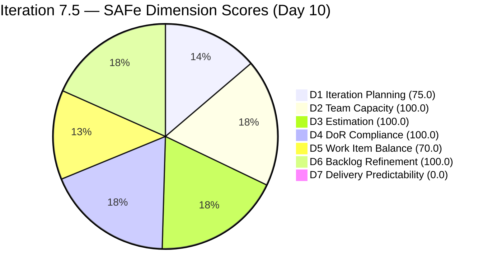
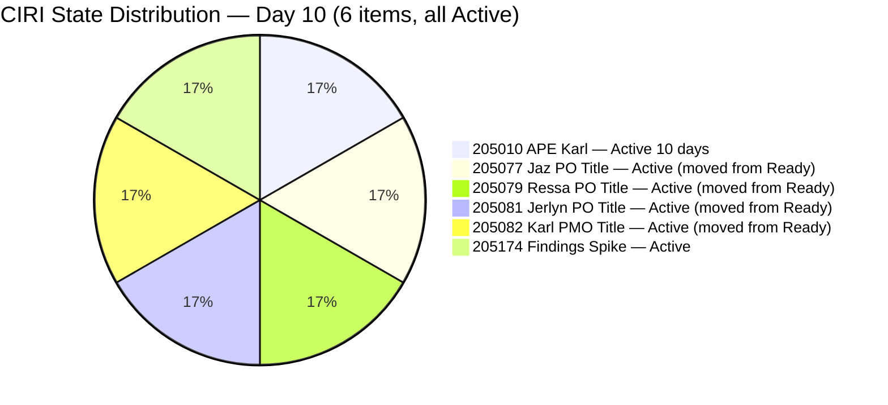
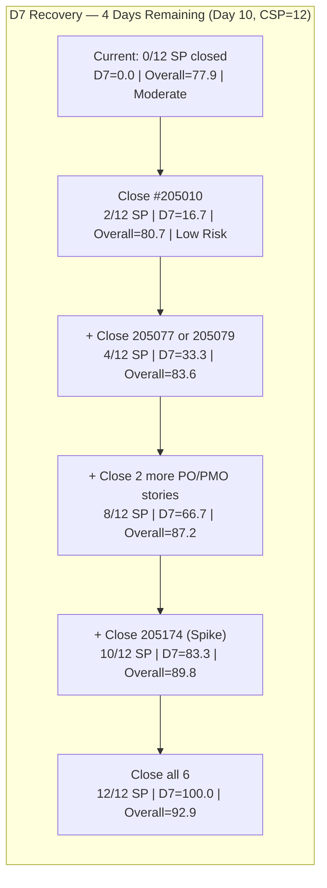

# ADO SAFe Audit — Human Resource Recruitment Team

## 1. Audit Metadata

| Field | Value |
|-------|-------|
| Audit Number | #85 |
| Audit Date | 2026-06-10 |
| Audit Time | 09:04 UTC |
| Timezone | UTC |
| Iteration | Iteration 7.5 |
| Iteration Dates | 2026-06-01 – 2026-06-14 |
| Sprint Day | Day 10 of 14 |
| ADO Project | Jairosoft FINOPS (`e0bb302f-40f9-46c3-8164-6f1acb317d63`) |
| ADO Team | Human Resource Recruitment Team (`248f59a6-372c-4b74-8129-9eaf260f211e`) |
| Iteration ID | `3b355811-2941-4edf-a8b1-7ffcdb478f9d` |
| Iteration Path | `Jairosoft FINOPS\2026-PI7\Iteration 7.5` |
| Workspace | `ado_hr` |
| Prior Audit | AUDIT_20260609_0204.md (Score: 81.4 — Low Risk, Day 9) |
| **Overall Score** | **77.9 / 100** |
| **Risk Band** | **Moderate Risk** |

---

## 2. Executive Summary

- Iteration 7.5 is now on **Day 10 of 14** — 71% of the sprint elapsed, **4 days remain**. The HR Recruitment Team dropped from **81.4 (Low Risk)** to **77.9 (Moderate Risk)** — a decline of 3.5 points driven by a structural change in the backlog.
- **Significant backlog restructuring detected overnight:** Four items that were previously Active/Ready (#205071, #205072, #205073, #205075) are no longer in the VRBI — they have been closed or removed. Simultaneously, two new items (#206004, #206005) appeared in the backlog in `Iteration 7.6 (IP)`. This reduced VRBI from 10 to 8 and CIRI from 10 to 6, dropping D1 from 100.0 to 75.0.
- **Four items changed state from Ready to Active on June 9:** Items #205077, #205079, #205081, #205082 (job reclassification stories) moved from Ready to Active, indicating Almera began work on them.
- **D7 = 0.0 — sixth consecutive zero delivery day.** With only 4 days remaining, closing remaining CIRI items is critical. CSP = 12 SP (reduced from 20 SP since 4 items exited VRBI as Closed).
- **Score drop: 81.4 → 77.9.** The decline to Moderate Risk is entirely driven by D1 dropping from 100.0 to 75.0 (CIRI 6 / VRBI 8 instead of 10 / 10).

---

## 3. Previous Audit Delta

| Metric | Audit #84 (2026-06-09, Day 9) | Audit #85 (2026-06-10, Day 10) | Change |
|--------|-------------------------------|--------------------------------|--------|
| Sprint Day | Day 9 of 14 | **Day 10 of 14** | +1 day |
| VRBI | 10 | **8** | −2 (2 new items in 7.6 IP added; 4 items exited as Closed) |
| CIRI | 10 | **6** | −4 (4 items closed, exiting VRBI; 2 new items in non-current iter) |
| Items Closed (exited VRBI, cumulative) | 2 | **6** | +4 new closures: #205071, #205072, #205073, #205075 |
| Items State: Active (CIRI) | 3 | **6** | +3 (205077, 079, 081, 082 moved from Ready → Active) |
| Items State: Ready (CIRI) | 7 | **0** | −7 |
| Items State: Closed/Done (CIRI) | 0 | **0** | No visible closures in current VRBI |
| SP Committed (CSP) | 20 SP | **12 SP** | −8 SP (4 closed items exited VRBI) |
| New items added (non-current) | 0 | **2** (#206004, #206005 in 7.6 IP) | +2 in next iteration |
| D1 — Iteration Planning | 100.0 | **75.0** | −25.0 |
| D2 — Team Capacity | 100.0 | **100.0** | Unchanged |
| D3 — Estimation | 100.0 | **100.0** | Unchanged |
| D4 — DoR Compliance | 100.0 | **100.0** | Unchanged |
| D5 — Work Item Balance | 70.0 | **70.0** | Unchanged |
| D6 — Backlog Refinement | 100.0 | **100.0** | Unchanged |
| D7 — Delivery Predictability | 0.0 | **0.0** | Sixth consecutive zero |
| **Overall Score** | **81.4 (Low Risk)** | **77.9 (Moderate Risk)** | **−3.5 pts, band drop** |

### Day 9 → Day 10 Interpretation

The overnight change was the most significant ADO activity of this sprint: four items (#205071 Ressa QA, #205072 Jerlyn QA, #205073 Mary QA, #205075 Luz QA) have exited the Stories and Deliverables backlog — they were Closed (most likely) or removed. This represents approximately 8 SP of work delivered. Two new items were added to the next iteration (7.6 IP): #206004 (JP's Roles & Responsibilities) and #206005 (Karl's Roles & Responsibilities) — future scope being defined in advance.

The four reclassification stories that remained (#205077 Jaz, #205079 Ressa, #205081 Jerlyn, #205082 Karl) moved from Ready to Active. Their ChangedDate updated to June 9, indicating Almera began actively working on these PO/PMO reclassifications.

The net effect: while actual delivery occurred (4 items closed), the VRBI/CIRI ratio worsened because 2 new non-current-iteration items entered the backlog, pulling D1 down. The score drop is a temporary artifact of the backlog structure — the real delivery progress is masked by the formula.

---

## 4. Current Iteration Snapshot

**Iteration 7.5** · 2026-06-01 – 2026-06-14 · **Day 10 of 14** · 4 days remaining

| Field | Value |
|-------|-------|
| Visible Root Backlog Items (VRBI) | 8 |
| Items in Iteration 7.5 (CIRI) | 6 |
| Non-CIRI VRBI items | 2 (#206004, #206005 in Iteration 7.6 IP) |
| Items State: Active (CIRI) | 6 (all 6) |
| Items State: Ready / Closed / New | 0 |
| SP Committed (CSP visible CIRI) | 12 SP |
| SP Burned (exited VRBI cumulative) | ~12 SP (6 items: #205011, #205244, #205071, #205072, #205073, #205075) |
| Distinct Assignees on CIRI | 1 (Almera Kleer Tayao) |
| Capacity Configured | Almera: 5 hrs/day (3 Doc + 2 Req); Grace: 0 hrs/day |
| Days Remaining | 4 |
| New Items Added (non-current) | #206004, #206005 (Iteration 7.6 IP) |

---

## 5. Work Item Analysis

| ID | Title | Type | State | SP | Assignee | DoR | ChangedDate | Note |
|----|-------|------|-------|----|----------|-----|-------------|------|
| 205010 | APE — Caumban, Karl Jordan (Analysis and Interpretation) | User Story | Active | 2 | Almera | PASS | 2026-06-08 | Active 10 sprint days; CRITICAL — longest overdue item |
| 205077 | Jaz's New Job Title as PO | User Story | Active | 2 | Almera | PASS | 2026-06-09 | Moved Ready → Active Jun 9; copy-paste "Luz" artifact still present |
| 205079 | Ressa's New Job Title as PO | User Story | Active | 2 | Almera | PASS | 2026-06-09 | Moved Ready → Active Jun 9 |
| 205081 | Jerlyn's New Job Title as PO | User Story | Active | 2 | Almera | PASS | 2026-06-09 | Moved Ready → Active Jun 9 |
| 205082 | Karl's New Job Title as PMO Manager | User Story | Active | 2 | Almera | PASS | 2026-06-09 | Moved Ready → Active Jun 9 |
| 205174 | Findings presentation to Ramon | Spike | Active | 2 | Almera | PASS | 2026-06-09 | Active; presentation still pending |

**Non-CIRI VRBI items (in Iteration 7.6 IP):**

| ID | Title | Type | State | Iteration |
|----|-------|------|-------|-----------|
| 206004 | JP's Roles & Responsibilities (As QA/PO Owner-Operator Title) | User Story | New | 7.6 IP |
| 206005 | Karl's Roles & Responsibilities (As Product Owner-Operator Title) | User Story | New | 7.6 IP |

**Items Closed / Exited VRBI (Cumulative):**

| ID | Title | Type | SP | Note |
|----|-------|------|----|------|
| 205011 | APE — Rommel Senillo — Summary | User Story | 2 | Closed Jun 4 |
| 205244 | APE — Caumban, Karl Jordan (Gathering) | User Story | 2 | Closed Jun 4 |
| 205071 | Ressa's New Job Title as QA | User Story | 2 | Closed ~Jun 9 (exited VRBI Day 10) |
| 205072 | Jerlyn's New Job Title as QA | User Story | 2 | Closed ~Jun 9 (exited VRBI Day 10) |
| 205073 | Mary's New Job Title as QA | User Story | 2 | Closed ~Jun 9 (exited VRBI Day 10) |
| 205075 | Luz's New Job Title as QA | User Story | 2 | Closed ~Jun 9 (exited VRBI Day 10) |

**Total burned: ~12 SP across 6 items (not visible to D7 formula since items exited VRBI)**

**DoR Summary:** 6/6 PASS (100.0%). All items meet Description ≥ 30 and AC ≥ 20 non-whitespace char thresholds. Content accuracy issue (copy-paste "Luz" in #205077) persists but does not fail char-count.

**SP Summary:** 6/6 estimated (12 SP). All items carry 2 SP each.

**Type Breakdown (CIRI):** User Story = 5 (83.3%), Spike = 1 (16.7%)

**State Breakdown (CIRI):** Active = 6, Ready = 0, Closed = 0

---

## 6. SAFe Compliance Scorecard

| Dimension | Score | Evidence (Numerator / Denominator) | Notes |
|-----------|-------|------------------------------------|-------|
| D1 — Iteration Planning | **75.0** | CIRI 6 / VRBI 8 | 2 non-CIRI items in 7.6 IP (#206004, #206005) |
| D2 — Team Capacity | **100.0** | CC 1 / CW 1 | Almera: 5 hrs/day; Grace: 0 hrs/day → excluded |
| D3 — Estimation | **100.0** | ECI 6 / PECI 6 | All 6 items at 2 SP; CSP = 12 |
| D4 — DoR Compliance | **100.0** | DCI 6 / CIRI 6 | All pass Desc ≥ 30 + AC ≥ 20 char thresholds |
| D5 — Work Item Balance | **70.0** | US 83.3% > 60% → −30; Spike 16.7% < 40%; US present → no −40 | Structural HR work profile |
| D6 — Backlog Refinement | **100.0** | fresh 8/8; stale_90=0; stale_180=0; untouched 0/6 | All changed Jun 8–9; zero staleness |
| D7 — Delivery Predictability | **0.0** | CLSP 0 / CSP 12 | Day 10 — no CIRI closures visible; 4 closures exited VRBI |

**Overall = (75.0 + 100.0 + 100.0 + 100.0 + 70.0 + 100.0 + 0.0) / 7 = 545.0 / 7 = 77.9 / 100 — Moderate Risk**

---

## 7. Dimension Findings

### D1 — Iteration Planning (75.0) — Decline from 100.0

- VRBI = 8; CIRI = 6. Two items (#206004 JP's Roles, #206005 Karl's Roles) are in Iteration 7.6 IP — not the current iteration.
- These two new items represent future sprint planning work being added in advance — a positive planning hygiene behavior, but it reduces D1.
- Formula: 6 / 8 × 100 = **75.0** (down from 100.0 yesterday)

### D2 — Team Capacity (100.0)

- CW = 1: Almera Kleer Tayao (assigned to all 6 CIRI items).
- CC = 1: Almera has 5 hrs/day (3 Documentation + 2 Requirements). Grace: 0 hrs/day, 0 CIRI items → excluded.
- Formula: 1 / 1 × 100 = **100.0**

### D3 — Estimation (100.0)

- PECI = 6; ECI = 6. All 6 items carry 2 SP each. CSP = 12 SP.
- Formula: 6 / 6 × 100 = **100.0**

### D4 — DoR Compliance (100.0)

- All 6 CIRI items pass Description ≥ 30 and AC ≥ 20 non-whitespace character thresholds.
- #205077 still contains "Luz" reference in description (copy-paste artifact). Passes char-count but content accuracy issue persists.
- Formula: 6 / 6 × 100 = **100.0**

### D5 — Work Item Balance (70.0)

- User Story = 5/6 = 83.3% → dominant type exceeds 60% threshold → −30 penalty.
- Spike = 1/6 = 16.7% → below 40% spike threshold → no −20 penalty.
- User Stories present → no −40 penalty.
- Formula: max(0, 100 − 30) = **70.0**. Structural characteristic of HR batch reclassification work.

### D6 — Backlog Refinement (100.0)

- Fresh threshold (ChangedDate ≥ 2026-04-26): all 8 VRBI items changed Jun 8–9, 2026 → 8/8 fresh → base = 100.0.
- Stale_90 (before 2026-03-11): 0 items. Stale_180 (before 2025-12-11): 0 items.
- Untouched CIRI (ChangedDate < 2026-06-01): 0 items.
- Formula: max(0, 100.0) = **100.0**

### D7 — Delivery Predictability (0.0) — Day 10, Sixth Consecutive Zero

- CSP = 12 SP (6 active CIRI items × 2 SP each); CLSP = 0 SP (no CIRI items in Closed/Done state).
- Formula: 0 / 12 × 100 = **0.0**
- **Context:** 6 items have exited the VRBI as Closed (~12 SP burned), but since they left the backlog, D7 cannot count them. The formula measures only items still visible in the VRBI that are Closed.
- **4 days remaining.** To recover to Low Risk (≥80), the team needs to close items from the current CIRI. Closing all 6 items (12 SP) → D7 = 100.0 → Overall = 92.9.
- **Recovery projections (4 days remaining):**
  - Close 1 item (2 SP): D7 = 16.7 → Overall = 80.7 (Low Risk boundary)
  - Close 3 items (6 SP): D7 = 50.0 → Overall = 85.0
  - Close all 6 (12 SP): D7 = 100.0 → Overall = 92.9

---

## 8. Risks and Bottlenecks

| Risk | Severity | Status | Details |
|------|----------|--------|---------|
| D7 = 0.0 — 4 days remain (Day 10, 6th zero-day) | **HIGH** | Must recover today | 71% of sprint elapsed; CSP=12 SP; closing 1 item → Low Risk |
| Score dropped to Moderate Risk (77.9) | **HIGH** | D1 drag from 7.6 IP items | New items 206004/206005 in 7.6 IP pulled D1 from 100→75 |
| #205010 (APE Karl Analysis) — Active 10 sprint days | **HIGH** | Longest overdue item | Active since Day 1; prerequisite closed Jun 4; must close today |
| 4 Active PO/PMO reclassification stories (#205077, 079, 081, 082) | **MEDIUM** | Recently activated | Moved to Active Jun 9; all identical structure; batch closure possible |
| #205174 (Findings Spike) — presentation still pending | **MEDIUM** | Active; no closure | Presentation to Ramon outstanding |
| Copy-paste artifact in #205077 ("Luz" reference) | **LOW** | Content quality only | Passes DoR; content accuracy issue persists |
| Bus factor = 1 (Almera only) | **LOW** | Structural/persistent | All 6 items assigned to Almera |
| No sprint goal (31st consecutive audit without one) | **LOW** | Persistent | Iteration 7.5 has no documented sprint goal |

---

## 9. Prioritized Recommendations

1. **Close #205010 (APE Karl Analysis) TODAY — CRITICAL (Day 10, 10 sprint days Active):** This item has been Active the entire sprint. With the prerequisite (#205244) closed on June 4, all inputs are available. Write up the analysis, document the discussion with supervisor, obtain sign-off, mark Closed. Immediate effect: D7 = 16.7 → Overall = 80.7 (Low Risk recovery).

2. **Batch-close the PO/PMO reclassification stories (Days 10–11) — HIGH:** Items #205077 (Jaz), #205079 (Ressa), #205081 (Jerlyn), #205082 (Karl) are now Active. These are structurally identical job reclassification documents. If the HR sign-off process is the same for all four, process them together. Closing all four adds 8 SP → D7 = 83.3 → Overall = 91.4 (Strong Low Risk).

3. **Close #205174 (Findings Spike) — MODERATE:** The benefits and incentive report presentation to Ramon is still pending. Schedule or deliver the presentation and close the item. Adds 2 SP.

4. **Fix copy-paste artifact in #205077 — LOW (2-minute fix):** Description still references "Luz" instead of "Jaz." Update: replace "Luz" with "Jaz" in description and [S] SPECIFIC AC criterion.

5. **Define sprint goal for Iteration 7.5 — MODERATE (31st audit without one):** Suggested: *"Finalize AI-augmented role reclassifications for PO/PMO team (4 stories), deliver benefits findings presentation to Ramon, and complete APE analysis for Karl Jordan — all by June 14."*

6. **Commit #206004 and #206005 properly to 7.6 IP:** These new items (JP and Karl's R&R) are correctly in 7.6 IP. Ensure they have Description, AC, SP, and assignee filled in before the next sprint starts.

---

## 10. Evidence Gaps and Limitations

| Gap | Impact | Notes |
|-----|--------|-------|
| 6 closed items exited VRBI | D7 cannot count ~12 SP burned | Items 205011, 205244, 205071, 205072, 205073, 205075 all closed; exited backlog. Actual velocity significant but invisible to D7 formula. |
| Exact close dates for 205071/072/073/075 | Minor | API confirms they are no longer in VRBI; exact close timestamps not confirmed but occurred between Jun 9 Day 9 and Jun 10 Day 10. |
| Grace at 0 capacity | D2 correct exclusion | 0 hrs/day + 0 CIRI items; excluded. |
| Sprint goal absent | D1 quality gap | 31st consecutive audit without sprint goal. |
| #206004 and #206005 DoR status | Not yet scored | New items in 7.6 IP; no Description/AC/SP yet. Will affect next sprint. |

---

## Visualizations

### Score Trend — HR Recruitment Team (PI7 Iteration 7.5)

| Date | Audit | Score | Band | Sprint Day | Notable |
|------|-------|-------|------|-----------|---------|
| Jun 1 | #76 | 47.6 | High | Day 1 | Sprint open; D2=0, D3=25.0 |
| Jun 3 | #78 | 81.4 | Low | Day 3 | All gaps fixed; +33.8 pts |
| Jun 4 | #79 | 81.4 | Low | Day 4 | 2 items closed (exited VRBI) |
| Jun 6–9 | #81–84 | 81.4 | Low | Days 6–9 | Stable; 5 zero-D7 days |
| **Jun 10** | **#85** | **77.9** | **Moderate** | **Day 10** | **4 QA stories closed, D1 drops; 2 new 7.6 items added** |

### D7 Recovery Table — Iteration 7.5 (4 Days Remaining, CSP=12)

| Scenario | SP Closed (visible) | D7 | Projected Overall | Band |
|----------|--------------------|----|-------------------|------|
| No closures (current) | 0/12 | 0.0 | 77.9 | Moderate |
| Close #205010 | 2/12 | 16.7 | 80.7 | Low |
| Close #205010 + 1 PO story | 4/12 | 33.3 | 83.6 | Low |
| Close #205010 + 3 PO stories | 8/12 | 66.7 | 87.2 | Low |
| Close all except Spike | 10/12 | 83.3 | 89.8 | Low |
| Close all 6 items | 12/12 | 100.0 | 92.9 | Low |

---

*Audit #85 generated by Claude Code (claude-sonnet-4-6) on 2026-06-10 09:04 UTC. Evidence sourced from Azure DevOps MCP (Jairosoft FINOPS project `e0bb302f-40f9-46c3-8164-6f1acb317d63`, team `248f59a6-372c-4b74-8129-9eaf260f211e`, Iteration 7.5 ID `3b355811-2941-4edf-a8b1-7ffcdb478f9d`). Rubric: SAFe 6.0 7-dimension scorecard v1. Iteration 7.5 is Day 10 of 14 (71% elapsed); 4 days remain. Score: 77.9 / 100 (Moderate Risk — dropped from 81.4 Low Risk). Key change: 4 QA reclassification items (205071/072/073/075) closed and exited VRBI; 2 new items added to 7.6 IP (#206004, #206005); 4 PO/PMO items moved Ready → Active. D1=75.0 (CIRI 6/VRBI 8). D7=0.0 (6th consecutive zero). Actual delivery: ~12 SP burned in total (not visible to D7). Priority: close #205010 today (→ Low Risk), batch-close PO/PMO stories Days 10–11.*
