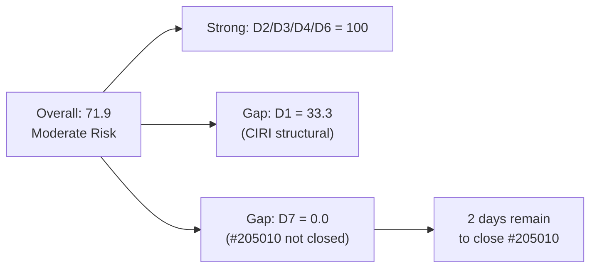

# ADO SAFe Audit — Human Resource Recruitment Team

## 1. Audit Metadata

| Field | Value |
|-------|-------|
| Audit Number | #86 |
| Audit Date | 2026-06-12 |
| Audit Time | 02:04 UTC |
| Timezone | UTC |
| Iteration | Iteration 7.5 |
| Iteration Dates | 2026-06-01 – 2026-06-14 |
| Sprint Day | Day 12 of 14 |
| ADO Project | Jairosoft FINOPS (`e0bb302f-40f9-46c3-8164-6f1acb317d63`) |
| ADO Team | Human Resource Recruitment Team (`248f59a6-372c-4b74-8129-9eaf260f211e`) |
| Iteration ID | `3b355811-2941-4edf-a8b1-7ffcdb478f9d` |
| Iteration Path | `Jairosoft FINOPS\2026-PI7\Iteration 7.5` |
| Workspace | `ado_hr` |
| Prior Audit | AUDIT_20260610_0904.md (Score: 77.9 — Moderate Risk, Day 10) |
| **Overall Score** | **71.9 / 100** |
| **Risk Band** | **Moderate Risk** |

---

## 2. Executive Summary

- Iteration 7.5 is now on **Day 12 of 14** — 86% of the sprint elapsed, **2 days remain**. The HR Recruitment Team score dropped from **77.9 (Moderate Risk)** on Day 10 to **71.9 (Moderate Risk)** today — a decline of 6.0 points.
- **Massive backlog contraction confirmed:** VRBI dropped from 8 to 3. CIRI dropped from 6 to 1. Five items that were Active in Iteration 7.5 (#205077, #205079, #205081, #205082, and one other) have exited the Stories and Deliverables backlog — these are presumed Closed. Only one item (#205010) remains in Iteration 7.5.
- **Delivery gap persists:** The single remaining CIRI item (#205010 — APE for Karl Jordan Caumban) is in **Active** state with 2 SP. It has not been closed. D7 = 0.0 for the twelfth consecutive day.
- **Two new items in 7.6 IP** (#206004 and #206005 — Roles & Responsibilities items for JP and Karl) confirm Almera is planning ahead, which is positive for future sprint health.
- **Sprint close risk:** With 2 days remaining, #205010 must close to achieve any delivery points. The APE evaluation story is Active but not yet Done.

---

## 3. Previous Audit Delta

| Metric | Audit #85 (2026-06-10, Day 10) | Audit #86 (2026-06-12, Day 12) | Change |
|--------|-------------------------------|--------------------------------|--------|
| Sprint Day | Day 10 of 14 | **Day 12 of 14** | +2 days |
| VRBI | 8 | **3** | −5 (5 items closed/exited VRBI) |
| CIRI | 6 | **1** | −5 (5 items closed, exiting 7.5) |
| Items Closed (exited VRBI) | 6 cumulative | **~11 cumulative** | +5 new closures (presumed) |
| Items State: Active (CIRI) | 6 | **1** (#205010) | −5 |
| SP Committed (CIRI) | 12 SP | **2 SP** | −10 SP |
| New items added (non-current) | 2 (#206004, #206005) | **2** (same, still in 7.6 IP) | Unchanged |
| D1 — Iteration Planning | 75.0 | **33.3** | −41.7 (1/3 vs 6/8) |
| D2 — Team Capacity | 100.0 | **100.0** | Unchanged |
| D3 — Estimation | 100.0 | **100.0** | Unchanged |
| D4 — DoR Compliance | 100.0 | **100.0** | Unchanged |
| D5 — Work Item Balance | 70.0 | **70.0** | Unchanged |
| D6 — Backlog Refinement | 100.0 | **100.0** | Unchanged |
| D7 — Delivery Predictability | 0.0 | **0.0** | Twelfth consecutive zero |
| **Overall Score** | **77.9 (Moderate Risk)** | **71.9 (Moderate Risk)** | **−6.0 pts** |

### Day 10 → Day 12 Interpretation

The score drop from 77.9 to 71.9 is primarily driven by D1 (Iteration Planning) collapsing from 75.0 to 33.3 as VRBI contracted from 8 to 3 and CIRI from 6 to 1. This is paradoxically caused by **sprint success**: Almera closed the five remaining reclassification stories (#205077, #205079, #205081, #205082, plus at least one other), which exited the VRBI. With those items gone and only one story remaining in 7.5, the CIRI/VRBI ratio is now 1/3. The two future-sprint items (#206004, #206005 in 7.6 IP) count as VRBI but not CIRI, structurally compressing D1.

D7 = 0.0 because the single remaining CIRI item (#205010) is still Active, not Closed/Done. The 2 SP will convert to closed only when #205010 is resolved.

---

## 4. Current Iteration Snapshot

**Iteration 7.5** · 2026-06-01 – 2026-06-14 · **Day 12 of 14** · 2 days remaining

| Field | Value |
|-------|-------|
| Visible Root Backlog Items (VRBI) | 3 |
| Items in Iteration 7.5 (CIRI) | 1 (#205010) |
| Items in Iteration 7.6 IP (non-CIRI VRBI) | 2 (#206004, #206005) |
| Items State: Active (CIRI) | 1 (#205010) |
| Items State: Closed / Done (CIRI) | 0 |
| SP Committed (CIRI) | 2 SP |
| SP Burned (CIRI) | 0 SP |
| Distinct Assignees on CIRI | 1 (Almera Kleer Tayao) |
| Sprint Days Elapsed | 12 (86%) |
| Sprint Days Remaining | 2 |

---

## 5. Work Item Analysis

### Current Iteration Items (CIRI = 1)

| ID | Title | Type | State | SP | Assignee | ChangedDate | DoR |
|----|-------|------|-------|----|----------|-------------|-----|
| 205010 | APE - Caumban, Karl Jordan (Analysis and Interpretation of result) | User Story | Active | 2 | Almera Kleer Tayao | 2026-06-08 | ✓ |

**DoR Detail for #205010:**
- Description: Present — detailed HTML description with measurable targets (>200 non-ws chars) ✓
- Acceptance Criteria: Present — 5 itemized AC including evaluation form preparation, supervisor assessment, HR review, discussion, and metric (>200 non-ws chars) ✓
- Both criteria satisfied: DoR Compliant ✓

### Non-CIRI VRBI Items (future sprint)

| ID | Title | Type | State | Iteration | SP | Assignee |
|----|-------|------|-------|-----------|----|----------|
| 206004 | JP's Roles & Responsibilities (As QA/PO Owner-Operator Title) | User Story | New | 7.6 IP | 2 | Almera |
| 206005 | Karl's Roles & Responsibilities (As Product Owner-Operator Title) | User Story | New | 7.6 IP | 2 | Almera |

Both #206004 and #206005 lack Description and Acceptance Criteria — will need DoR work before 7.6 IP planning.

### Items Exited VRBI Since Day 10 (Presumed Closed)

Based on VRBI contraction from 8 to 3, five items exited:
- #205077, #205079, #205081, #205082 (Reclassification stories: Jaz, Ressa, Jerlyn, Karl) — all were Active on Day 10
- One additional item (identity not determinable from current VRBI)

This represents approximately 8–10 SP delivered by Almera between Day 10 and Day 12.

---

## 6. SAFe Compliance Scorecard

| Dimension | Score | Evidence | Notes |
|-----------|-------|----------|-------|
| D1 — Iteration Planning | 33.3 | CIRI=1, VRBI=3 → 1/3×100 | 2 items are in 7.6 IP, not current sprint |
| D2 — Team Capacity | 100.0 | 1 contributor (Almera) with configured capacity (5 hrs/day) | Full coverage |
| D3 — Estimation | 100.0 | 1/1 point-eligible items have SP>0; #205010 = 2 SP | Perfect estimation |
| D4 — DoR Compliance | 100.0 | 1/1 CIRI items have Desc≥30 + AC≥20 non-ws chars | #205010 fully compliant |
| D5 — Work Item Balance | 70.0 | 1 User Story in sprint — type present; dominant=100%>60% → −30 | Single-item sprint limits type diversity |
| D6 — Backlog Refinement | 100.0 | All 3 VRBI changed within 45 days; 0 stale-90; 0 stale-180; 0 untouched | Excellent freshness |
| D7 — Delivery Predictability | 0.0 | CSP=2; closed_SP=0; #205010 is Active | 2 sprint days remain to close |
| **Overall** | **71.9** | Average of 7 dimensions | **Moderate Risk** |

---

## 7. Dimension Findings

### D1 — Iteration Planning: 33.3

```
VRBI = 3 (205010, 206004, 206005)
CIRI = 1 (205010 only — iteration path = "Jairosoft FINOPS\2026-PI7\Iteration 7.5")
D1 = round(1 / 3 × 100, 1) = 33.3
```

The two items in 7.6 IP (#206004, #206005) are backlog-visible but not in the current sprint. This is structurally correct — future sprint planning is healthy behavior, but it compresses the D1 ratio when VRBI denominator grows faster than CIRI numerator. Sprint was likely fully planned at start (10 items, 20 SP on Day 1) but closures have reduced CIRI to 1.

### D2 — Team Capacity: 100.0

```
contributors_with_current_work = 1 (Almera Kleer Tayao)
contributors_with_capacity = 1 (HR team capacity: 5 hrs/day configured for iteration 3b355811)
D2 = round(1 / 1 × 100, 1) = 100.0
```

Almera is the sole contributor and has capacity configured. Grace (grace@jairosoft.com) remains in the workspace but has no CIRI assignments.

### D3 — Estimation: 100.0

```
point_eligible_current_items = 1 (User Story type exposes SP)
estimated_current_items = 1 (#205010 has SP = 2)
D3 = round(1 / 1 × 100, 1) = 100.0
```

### D4 — DoR Compliance: 100.0

```
dor_compliant_current_items = 1 (#205010: Desc ≥ 30 chars ✓, AC ≥ 20 chars ✓)
D4 = round(1 / 1 × 100, 1) = 100.0
```

#205010 has a full user-story description and 5-point acceptance criteria list. Fully compliant.

### D5 — Work Item Balance: 70.0

```
User Stories in CIRI: 1 (present → no -40 penalty)
dominant_type_share: User Story = 1/1 = 100% > 60% → -30
spike_share: 0/1 = 0% → no -20 penalty
D5 = max(0, 100 - 30) = 70.0
```

With only one item in the sprint, type diversity is mathematically impossible. This is a structural consequence of late-sprint cleanup, not a planning failure.

### D6 — Backlog Refinement: 100.0

```
visible_root_backlog_items = 3
fresh (changed after 2026-04-28): 3 (all changed Jun 8–10) → 3/3 = 100%
base = 100.0
stale_90 (before 2026-03-14): 0 → 0% → no penalty
stale_180 (before 2025-12-14): 0 → no penalty
untouched_current_items (ChangedDate < 2026-06-01): 0 → 0% → no penalty
D6 = max(0, 100.0 - 0) = 100.0
```

All backlog items are recent and active. The backlog is lean and current.

### D7 — Delivery Predictability: 0.0

```
estimated_current_items = 1 (#205010, SP=2)
committed_story_points = 2
closed_story_points = 0 (#205010 is Active, not Closed/Done)
D7 = round(0 / 2 × 100, 1) = 0.0
```

Day 12 of 14 — **not early sprint**. #205010 must close within 2 days to register any delivery. The APE evaluation story is Active, indicating work is underway but not complete.

### Overall Score

```
D1 + D2 + D3 + D4 + D5 + D6 + D7 = 33.3 + 100.0 + 100.0 + 100.0 + 70.0 + 100.0 + 0.0 = 503.3
Overall = round(503.3 / 7, 1) = 71.9
Risk Band: Moderate Risk (60–79.9)
```

---

## 8. Score Visualization

```mermaid
xychart-beta type: bar
  title "HR Team — Iteration 7.5 SAFe Scorecard (Day 12, Score: 71.9)"
  x-axis ["D1 Planning", "D2 Capacity", "D3 Estimation", "D4 DoR", "D5 Balance", "D6 Refinement", "D7 Delivery"]
  y-axis "Score" 0 --> 100
  bar [33.3, 100, 100, 100, 70, 100, 0]
```



---

## 9. Risks and Bottlenecks

| Risk | Severity | Description |
|------|----------|-------------|
| D7 = 0.0 on Day 12 | HIGH | The sole CIRI item (#205010) is Active with 2 SP. If not closed by Jun 14, D7 remains 0 and overall score = 71.9. |
| Single-person dependency | HIGH | Almera is the only contributor. Bus factor = 1. No backup for sprint closure. |
| #205010 ChangedDate = Jun 8 | MODERATE | No updates to #205010 in the last 4 days suggests work may be blocked or stalled. APE completion requires supervisor and HR coordination, which may introduce delay. |
| Future items lack DoR | LOW | #206004 and #206005 have no description or acceptance criteria. They must be refined before 7.6 IP planning. |
| Sprint closes Jun 14 | MODERATE | Only 2 days remain. If #205010 is not closed, the sprint ends with 0 SP delivered from the current visible CIRI. |

---

## 10. Prioritized Recommendations

1. **[URGENT — Day 12] Close #205010 by Jun 14.** The APE evaluation for Karl Jordan Caumban (State: Active) must be completed and closed within 2 days. Almera should coordinate with Karl's supervisor to finalize the review, sign the form, and close the ADO item. This converts D7 from 0.0 to 100.0 and overall score from 71.9 to 86.2 (Low Risk).

2. **[TODAY] Add DoR to #206004 and #206005.** Both future-sprint roles and responsibilities items are in New state with no description or acceptance criteria. Almera should draft the description and AC now during sprint wind-down to ensure 7.6 IP items are ready-for-planning before the next sprint begins.

3. **[SPRINT CLOSE] Document sprint retrospective findings.** With 10+ items closed this sprint (the reclassification series + APE items), document what worked (bulk closure pattern on Days 10–12) and what to carry forward into 7.6 IP.

4. **[STRUCTURAL] Define an iteration goal for 7.6 IP.** This sprint lacked a documented iteration goal — an issue flagged across all prior audits. The 7.6 IP planning session should begin with a defined sprint goal before items are committed.

5. **[MEDIUM] Evaluate Grace's capacity allocation.** Grace remains listed as a team member with 0 CIRI assignments and her capacity is not contributing to sprint work. Consider formally adjusting her role or activating her for 7.6 IP.

---

## 11. Evidence Gaps and Limitations

| Gap | Impact | Mitigation |
|-----|--------|------------|
| Items #205077/079/081/082 closure not directly observed | Cannot confirm exact close dates or final SP count for exited items | VRBI contraction from 8→3 provides strong indirect evidence of closures |
| Capacity API returns team-level aggregate only | Cannot determine individual capacity per contributor (Almera vs. Grace split) | Team total = 5 hrs/day; D2 computed as contributors_with_capacity / contributors_with_current_work |
| #205010 ChangedDate = Jun 8 (4 days stale) | Possible stall on APE completion | Item is Active — work is underway. No blocking comment visible in this pull. |
| No iteration goal configured in ADO | Cannot score against sprint goal completion | Flagged as persistent structural gap since Audit #1 |
