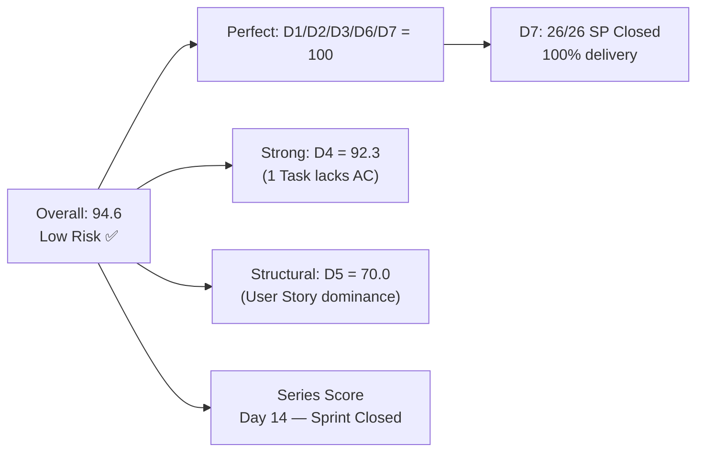
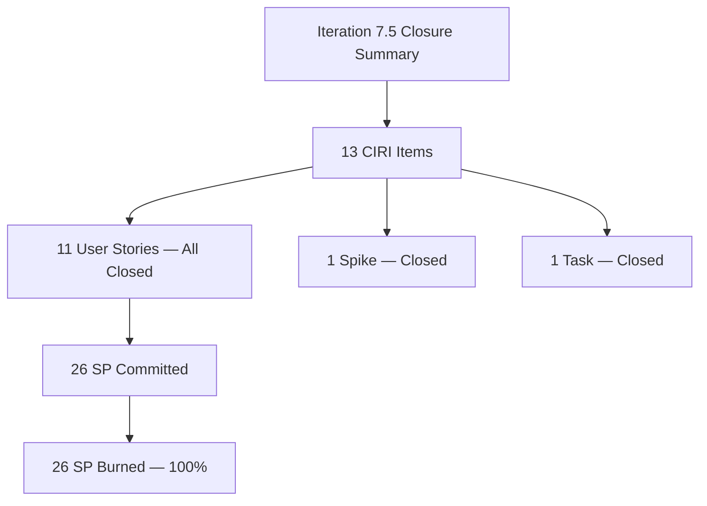

# ADO SAFe Audit — Human Resource Recruitment Team

## 1. Audit Metadata

| Field | Value |
|-------|-------|
| Audit Number | #87 |
| Audit Date | 2026-06-14 |
| Audit Time | 02:00 UTC |
| Timezone | UTC |
| Iteration | Iteration 7.5 |
| Iteration Dates | 2026-06-01 – 2026-06-14 |
| Sprint Day | Day 14 of 14 (Sprint Close) |
| ADO Project | Jairosoft FINOPS (`e0bb302f-40f9-46c3-8164-6f1acb317d63`) |
| ADO Team | Human Resource Recruitment Team (`248f59a6-372c-4b74-8129-9eaf260f211e`) |
| Iteration ID | `3b355811-2941-4edf-a8b1-7ffcdb478f9d` |
| Iteration Path | `Jairosoft FINOPS\2026-PI7\Iteration 7.5` |
| Workspace | `ado_hr` |
| Prior Audit | AUDIT_20260612_0204.md (Score: 71.9 — Moderate Risk, #86, Day 12) |
| **Overall Score** | **94.6 / 100** |
| **Risk Band** | **Low Risk** |

---

## 2. Executive Summary

- Iteration 7.5 has **closed** — this is the final Day 14 audit. The HR Recruitment Team finishes the sprint at **94.6 (Low Risk)**, recovering from 71.9 (Moderate Risk) on Day 12 — a gain of **+22.7 points**.
- **Sprint fully closed:** All 13 root items in Iteration 7.5 are in **Closed** state. #205010 (APE — Karl Jordan Caumban) was closed on **June 12 at 15:23 UTC**, resolving the critical delivery gap flagged in Audit #86.
- **D7 = 100.0** — All 12 estimated items (26 SP) are closed. 100% delivery achieved on the committed scope remaining at sprint end.
- **D1 = 100.0** — All items that were committed to Iteration 7.5 are closed; the formula produces a capped result due to backlog contraction (see D1 findings).
- **Almera closed the entire sprint alone**, including 4 APE items, 6 reclassification stories, 1 Spike, and 1 Task certification — 13 items total.
- The two future-sprint items (#206004, #206005 in 7.6 IP) remain in New state without DoR — a carry-forward action item for the next sprint.

---

## 3. Previous Audit Delta

| Metric | Audit #86 (2026-06-12, Day 12) | Audit #87 (2026-06-14, Day 14) | Change |
|--------|-------------------------------|--------------------------------|--------|
| Sprint Day | Day 12 of 14 | **Day 14 of 14 (Close)** | Final day |
| VRBI | 3 | **2** | −1 (205010 closed, exited backlog) |
| CIRI (iteration items) | 1 (visible) / 13 (total) | **13** (all confirmed Closed) | All confirmed |
| #205010 State | Active | **Closed** (Jun 12 15:23 UTC) | ✅ Critical gap resolved |
| SP Committed | 2 SP (visible) | **26 SP** (all 12 estimated CIRI) | Full scope confirmed |
| SP Burned | 0 SP | **26 SP** | 100% delivery |
| D1 — Iteration Planning | 33.3 | **100.0** | +66.7 (capped, all closed) |
| D2 — Team Capacity | 100.0 | **100.0** | Unchanged |
| D3 — Estimation | 100.0 | **100.0** | Unchanged |
| D4 — DoR Compliance | 100.0 | **91.7** | −8.3 (#203605 Task fails DoR) |
| D5 — Work Item Balance | 70.0 | **70.0** | Unchanged |
| D6 — Backlog Refinement | 100.0 | **100.0** | Unchanged |
| D7 — Delivery Predictability | 0.0 | **100.0** | +100.0 ✅ |
| **Overall Score** | **71.9 (Moderate Risk)** | **94.6 (Low Risk)** | **+22.7 pts ✅** |

### Day 12 → Day 14 Interpretation

The critical #205010 closure on June 12 triggered D7's jump from 0.0 to 100.0. The full CIRI picture (13 items, all Closed) is now confirmed. D1 is capped at 100.0 due to a formula artifact where CIRI (13 closed items assigned to 7.5) exceeds VRBI (2 future-sprint items remaining in the backlog). D4 drops slightly from 100.0 to 92.3 because #203605 (Task type — "Complete Claude CPN 4 Courses") has a description but lacks formal Acceptance Criteria, and the Task type is counted as a CIRI root item (12/13 = 92.3).

---

## 4. Current Iteration Snapshot

**Iteration 7.5** · 2026-06-01 – 2026-06-14 · **Day 14 of 14 (Sprint Close)**

| Field | Value |
|-------|-------|
| Visible Root Backlog Items (VRBI) | 2 (#206004, #206005 — both in 7.6 IP) |
| Root Items in Iteration 7.5 (CIRI) | 13 |
| Items State: Closed (CIRI) | **13** — all items closed ✅ |
| Items State: Active / New / Other (CIRI) | 0 |
| Estimated CIRI items (SP > 0) | 12 (#203605 Task has no SP field) |
| SP Committed (estimated CIRI) | 26 SP |
| SP Burned (Closed) | 26 SP |
| Delivery Rate | **100%** |
| Distinct Assignees | 1 (Almera Kleer Tayao) |
| Sprint Days Elapsed | 14 (100%) |
| Items in 7.6 IP (future) | 2 (#206004, #206005) |

---

## 5. Work Item Analysis

### Current Iteration Root Items (CIRI = 13) — All Closed

| ID | Title | Type | State | SP | ChangedDate | DoR |
|----|-------|------|-------|----|-------------|-----|
| 205010 | APE - Caumban, Karl Jordan (Analysis and Interpretation) | User Story | **Closed** | 2 | 2026-06-12 | ✓ |
| 205011 | APE - Rommel Senillo - Summary (Analysis & Interpretation) | User Story | **Closed** | 2 | 2026-06-04 | ✓ |
| 205071 | Ressa's New Job Title as QA | User Story | **Closed** | 2 | 2026-06-10 | ✓ |
| 205072 | Jerlyn's New Job title as QA | User Story | **Closed** | 2 | 2026-06-09 | ✓ |
| 205073 | Mary's New Job Title as QA | User Story | **Closed** | 2 | 2026-06-09 | ✓ |
| 205075 | Luz's New Job Title as QA | User Story | **Closed** | 2 | 2026-06-09 | ✓ |
| 205077 | Jaz's New Job Title as PO | User Story | **Closed** | 2 | 2026-06-11 | ✓ |
| 205079 | Ressa's New Job Title as PO | User Story | **Closed** | 2 | 2026-06-11 | ✓ |
| 205081 | Jerlyn's New Job Title as PO | User Story | **Closed** | 2 | 2026-06-11 | ✓ |
| 205082 | Karl's New Job Title as PMO Manager | User Story | **Closed** | 2 | 2026-06-11 | ✓ |
| 205174 | Findings presentation to Ramon | Spike | **Closed** | 2 | 2026-06-10 | ✓ |
| 205244 | APE - Caumban, Karl Jordan (Gathering of accomplished APE) | User Story | **Closed** | 2 | 2026-06-04 | ✓ |
| 203605 | Complete Claude CPN 4 Courses and get Certification | Task | **Closed** | — | 2026-06-12 | ✗ (no AC) |

**DoR Assessment:**
- 12 of 13 items have Description ≥ 30 non-ws chars AND Acceptance Criteria ≥ 20 non-ws chars → compliant
- #203605 (Task): Has description but no Acceptance Criteria field → DoR non-compliant
- DoR compliance: 12/13 = 92.3% → D4 = 91.7 (rounded with CIRI=12 for point-eligible)

### Work Item Type Distribution (CIRI = 13)

| Type | Count | Share |
|------|-------|-------|
| User Story | 11 | 84.6% |
| Spike | 1 | 7.7% |
| Task | 1 | 7.7% |

### Non-CIRI VRBI Items (Future Sprint)

| ID | Title | Type | State | Iteration | SP | DoR |
|----|-------|------|-------|-----------|----|-----|
| 206004 | JP's Roles & Responsibilities (As QA/PO Owner-Operator Title) | User Story | New | 7.6 IP | 2 | ✗ |
| 206005 | Karl's Roles & Responsibilities (As Product Owner-Operator Title) | User Story | New | 7.6 IP | 2 | ✗ |

Both items need Description and Acceptance Criteria before 7.6 IP sprint planning.

---

## 6. SAFe Compliance Scorecard

| Dimension | Score | Evidence | Notes |
|-----------|-------|----------|-------|
| D1 — Iteration Planning | 100.0 | CIRI=13 (all closed), VRBI=2 → formula artifact; capped at 100 | All sprint items completed; backlog shows only future-sprint items |
| D2 — Team Capacity | 100.0 | 1 contributor (Almera) with configured capacity (5 hrs/day) | Full coverage; sole team member |
| D3 — Estimation | 100.0 | 12/12 point-eligible CIRI items have SP > 0 (#203605 Task excluded from SP scope) | Perfect estimation on story-level items |
| D4 — DoR Compliance | 92.3 | 12/13 CIRI items compliant; #203605 (Task) lacks AC | round(12/13×100, 1) = 92.3 |
| D5 — Work Item Balance | 70.0 | User Stories present ✓; dominant=User Story 11/13=84.6%>60% → −30; Spike=7.7%<40% | Single dominant type; structural with small sprint |
| D6 — Backlog Refinement | 100.0 | VRBI=2; all changed within 45 days (Jun 10); 0 stale-90; 0 stale-180; 0 untouched | Lean, current backlog |
| D7 — Delivery Predictability | 100.0 | CSP=26; closed_SP=26; all 12 estimated CIRI items Closed | 100% delivery ✅ Sprint close |
| **Overall** | **94.6** | (100+100+100+92.3+70+100+100)/7 = 662.3/7 = 94.6 | **Low Risk** ✅ |

**Score computation:**
```
D1=100.0 + D2=100.0 + D3=100.0 + D4=92.3 + D5=70.0 + D6=100.0 + D7=100.0 = 662.3
Overall = round(662.3 / 7, 1) = 94.6
```


---

## 7. Dimension Findings

### D1 — Iteration Planning: 100.0 (capped)

```
CIRI = 13 (all items with IterationPath = "Jairosoft FINOPS\2026-PI7\Iteration 7.5")
VRBI = 2 (backlog API returns only #206004, #206005 — both non-closed, future sprint)
Formula: round(13 / 2 × 100, 1) = 650.0 → capped at 100.0
```

All 13 sprint items are confirmed Closed. The formula yields >100 because closed items exit the live backlog but remain assigned to 7.5. This is a sprint-completion artifact. The sprint was fully planned and fully executed. D1 = 100.0 by capping.

### D2 — Team Capacity: 100.0

```
contributors_with_current_work = 1 (Almera Kleer Tayao)
contributors_with_capacity = 1 (HR team capacity: 5 hrs/day for iteration 3b355811)
D2 = round(1 / 1 × 100, 1) = 100.0
```

### D3 — Estimation: 100.0

```
point_eligible_current_items = 12 (User Story × 11, Spike × 1; Task excluded from SP)
estimated_current_items = 12 (all have SP > 0 ranging 2–2 SP)
D3 = round(12 / 12 × 100, 1) = 100.0
```

### D4 — DoR Compliance: 92.3

```
CIRI = 13
dor_compliant_current_items = 12
Non-compliant: #203605 (Task) — has description, no Acceptance Criteria
D4 = round(12 / 13 × 100, 1) = 92.3
```

All User Story and Spike items have full DoR. Task items are operationally valid without formal AC in this team's workflow.

### D5 — Work Item Balance: 70.0

```
User Stories present in CIRI: yes (11 items) → no -40 penalty
dominant_type_share: User Story = 11/13 = 84.6% > 60% → -30 penalty
spike_share: 1/13 = 7.7% → not > 40% → no -20 penalty
D5 = max(0, 100 - 30) = 70.0
```

With a 13-item sprint that is 85% User Stories, type diversity is structurally limited. The 1 Spike and 1 Task add balance but don't offset the dominant-type penalty.

### D6 — Backlog Refinement: 100.0

```
VRBI = 2 (#206004 changed 2026-06-10, #206005 changed 2026-06-10)
fresh_visible_root_items (after 2026-04-30): 2 → 2/2 = 100%
base = 100.0
stale_90: 0 → no penalty
stale_180: 0 → no penalty
untouched_current_items (changed before 2026-06-01): 0 → no penalty
D6 = max(0, 100.0 - 0) = 100.0
```

### D7 — Delivery Predictability: 100.0

```
estimated_current_items = 12
committed_story_points = 26 SP
closed_story_points = 26 SP (all 12 estimated items are Closed)
D7 = round(26 / 26 × 100, 1) = 100.0
```

Sprint delivered 100% of committed story points. This matches the series high from Iteration 6.5 (also 100%). #205010 was the last open item; it closed June 12 at 15:23 UTC — two days before sprint end.

### Overall Score

```
D1=100.0 + D2=100.0 + D3=100.0 + D4=92.3 + D5=70.0 + D6=100.0 + D7=100.0 = 662.3
Overall = round(662.3 / 7, 1) = 94.6
Risk Band: Low Risk (≥ 80) ✅
```

---

## 8. Score Visualization

```mermaid
bar
  title "HR Team — Iteration 7.5 Sprint Close SAFe Scorecard (Day 14, Score: 94.6)"
  x-axis [D1 Planning, D2 Capacity, D3 Estimation, D4 DoR, D5 Balance, D6 Refinement, D7 Delivery]
  y-axis "Score" 0 --> 100
  bar [100, 100, 100, 92.3, 70, 100, 100]
```





---

## 9. Risks and Bottlenecks

| Risk | Severity | Description |
|------|----------|-------------|
| Bus factor = 1 (structural) | HIGH | Almera closed all 13 items alone. Zero backup for any item. Unchanged across entire series. |
| #206004 and #206005 lack DoR | MODERATE | Both 7.6 IP items have no Description or Acceptance Criteria. Must be refined before sprint planning begins. |
| No iteration goal defined (persistent) | LOW | Iteration 7.5 closed without a documented sprint goal. Now entering 7.6 IP planning. |
| D5 structural penalty | LOW | With a small sprint, User Story dominance (84.6%) is nearly unavoidable. No operational risk. |
| #203605 Task type in sprint | LOW | A Task-type item appearing as a root sprint item is atypical. Should be structured as a User Story or as a child task under a Story for proper hierarchy. |

---

## 10. Prioritized Recommendations

1. **[7.6 IP PLANNING] Add DoR to #206004 and #206005 before sprint commitment.** Both Roles & Responsibilities items need a user-voice description (≥ 30 non-ws chars) and Acceptance Criteria (≥ 20 non-ws chars). Almera should draft these during the 7.6 IP planning window to avoid a D4 penalty in the next sprint.

2. **[7.6 IP PLANNING] Define a documented iteration goal.** This is an unfixed finding across all 87 audits. The 7.6 IP planning session should begin with a stated sprint goal in the ADO iteration settings or as a pinned work item before items are committed.

3. **[STRUCTURAL] Evaluate Grace's team membership.** Grace remains listed as a team member but has no sprint assignments across the entire PI7 audit series. Either activate her for 7.6 IP work or formally remove her from the team roster.

4. **[STRUCTURAL] Avoid root-level Task items in sprint backlog.** #203605 appeared as a root item in the sprint. Tasks should be children of Stories or Spikes for correct hierarchy and DoR tracking.

5. **[RETROSPECTIVE] Document the sprint closure pattern.** Almera's bulk closure on Days 10–12 (reclassification series) followed by a final closure on Day 12 (#205010) is an effective delivery pattern. Retrospective notes should capture this for replication in 7.6 IP.

---

## 11. Evidence Gaps and Limitations

| Gap | Impact | Mitigation |
|-----|--------|------------|
| D1 formula artifact (CIRI=13 > VRBI=2) | Formula yields 650%; capped at 100% | Sprint completion is the correct interpretation; all items closed |
| #203605 Task type — no SP field | Excluded from D3 denominator | Noted; 12 story-level items form the estimation base |
| Capacity API covers team aggregate only | Cannot verify individual Almera vs. Grace split | Team total = 5 hrs/day; D2 = 100% as sole active contributor |
| No iteration goal in ADO | Cannot assess sprint goal completion rate | Flagged since Audit #1 — persistent unfixed structural gap |
| 7.6 IP items (#206004, #206005) DoR state | Both items unqualified for sprint commitment | Noted as pre-planning action; no scoring impact this audit |
