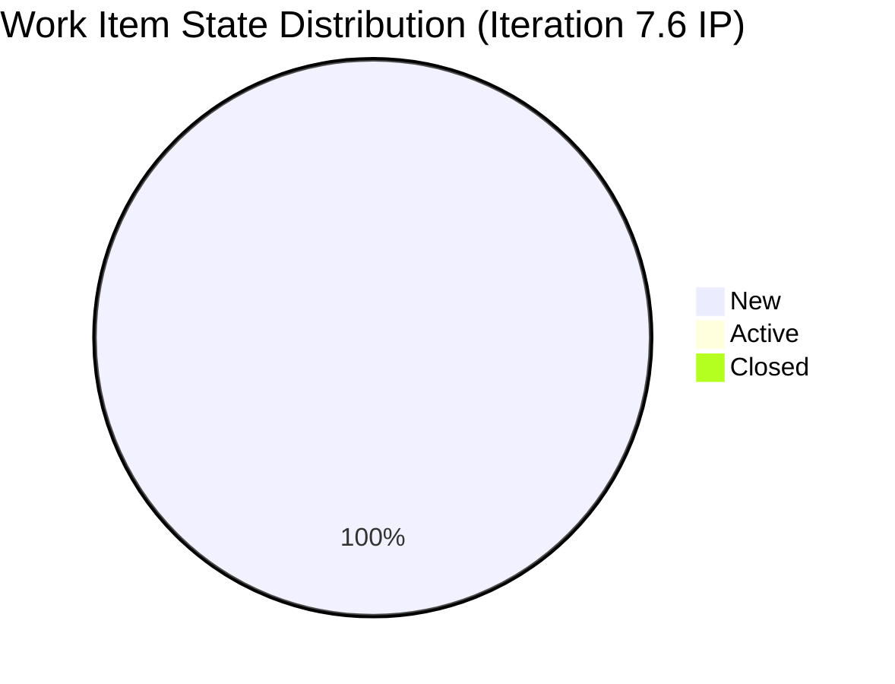

# SAFe Iteration Audit — Human Resource Recruitment Team

## 1. Audit Metadata

| Field | Value |
|-------|-------|
| **Project** | Jairosoft FINOPS |
| **Team** | Human Resource Recruitment Team |
| **Workspace** | `ado_hr` |
| **Iteration** | Iteration 7.6 (IP) — Innovation & Planning |
| **Iteration Dates** | 2026-06-15 to 2026-06-28 |
| **Audit Date** | 2026-06-15 (PHT, UTC+8) |
| **Prior Audit Reference** | None in `audit/` folder (CLAUDE.md history: AUDIT_2026-03-22_2329.md — 8.0/10) |
| **Overall Score** | **64.3 / 100** |
| **Risk Band** | MODERATE (Yellow) |

---

## 2. Executive Summary

The HR Recruitment Team opens Iteration 7.6 (IP) — the Innovation & Planning iteration for PI7 — with a minimal two-item commitment. Both items are User Stories assigned to Almera Kleer Tayao, continuing the single-contributor pattern that has persisted across the entire audit series. This is **Day 1** of the iteration.

The overall score of **64.3** (Moderate) represents a significant drop from the series high of **80.0** recorded at the end of Iteration 6.5. The regression is primarily driven by three factors: (1) both items are missing Description and Acceptance Criteria in ADO, triggering a DoR failure; (2) Delivery Predictability is 0 as expected on Day 1 of an IP iteration; and (3) neither item was touched after the iteration started (both last modified June 10, five days before the iteration opened). The core structural risks — bus factor of 1, no iteration goal, no PI objectives linked — remain unresolved.

---

## 3. Previous Audit Delta

| Dimension | Prior (AUDIT_2026-03-22_2329) | Current | Delta |
|-----------|-------------------------------|---------|-------|
| Iteration Planning | ~90.0 (18/18 in sprint) | 100.0 | +10.0 |
| Team Capacity | ~100.0 | 100.0 | 0.0 |
| Estimation | 100.0 (18/18 estimated) | 100.0 | 0.0 |
| DoR Compliance | 100.0 (18/18 compliant) | 0.0 | **-100.0** |
| Work Item Balance | ~70.0 | 70.0 | ~0.0 |
| Backlog Refinement | ~80.0 | 80.0 | ~0.0 |
| Delivery Predictability | 100.0 (34/34 SP burned) | 0.0 | -100.0 (Day 1) |
| **Overall** | **80.0** | **64.3** | **-15.7** |

**Key regressions:**
- DoR Compliance collapsed from 100 to 0 — both new stories are missing Description and Acceptance Criteria fields in ADO.
- Delivery Predictability at 0 is expected on Day 1 of an IP iteration (no sprint goal progress yet).
- No iteration goal has been defined for 7.6 (IP) — unfixed across all 13 audits in the series.

---

## 4. Current Iteration Snapshot

| Field | Value |
|-------|-------|
| **Iteration** | 7.6 (IP) — Innovation & Planning |
| **Start Date** | 2026-06-15 |
| **End Date** | 2026-06-28 |
| **Duration** | 14 days |
| **Total Root Items in Iteration** | 2 |
| **User Stories** | 2 |
| **Story Points Committed** | 4 SP |
| **Story Points Closed** | 0 SP |
| **Iteration Goal** | Not defined |
| **PI Objectives Linked** | None |
| **Team Capacity** | 5 pts/day (team-level from ADO) |

---

## 5. Work Item Analysis

| ID | Title | Type | State | SP | Assignee | DoR | Last Changed |
|----|-------|------|-------|----|----------|-----|--------------|
| 206004 | JP's Roles & Responsibilities (As QA/PO Owner-Operator Title) | User Story | New | 2 | Almera Tayao | FAIL | 2026-06-10 |
| 206005 | Karl's Roles & Responsibilities (As Product Owner-Operator Title) | User Story | New | 2 | Almera Tayao | FAIL | 2026-06-10 |

**DoR Assessment:** Both stories returned no Description or Acceptance Criteria fields from the ADO API. Under the audit rubric (Description ≥30 non-whitespace chars AND AcceptanceCriteria ≥20 non-whitespace chars), both items fail DoR. This must be addressed immediately.

**Untouched Items:** Both items were last modified on June 10 — five days before the iteration start date (June 15). Both qualify as untouched at iteration open.

**Ownership:** Almera Kleer Tayao owns 100% of committed work. Grace (grace@jairosoft.com) has 0 capacity and 0 items.

---

## 6. SAFe Compliance Scorecard

| # | Dimension | Score | Evidence | Notes |
|---|-----------|-------|----------|-------|
| 1 | Iteration Planning | **100.0** | 2/2 visible root items in current iteration | Perfect commitment ratio |
| 2 | Team Capacity | **100.0** | 1 contributor with work; team capacity = 5 pts/day configured | Almera sole active contributor |
| 3 | Estimation | **100.0** | 2/2 User Stories have Story Points (both = 2 SP) | All items estimated |
| 4 | DoR Compliance | **0.0** | 0/2 items have Description + Acceptance Criteria in ADO | Critical gap — must fix Day 1 |
| 5 | Work Item Balance | **70.0** | Has User Stories ✓; 100% User Story type > 60% dominant (-30) | Single type dominance penalty |
| 6 | Backlog Refinement | **80.0** | 2/2 fresh (Jun 10, within 45d); 0 stale; untouched=2/2 (100% > 30%) | -20 for untouched at iter open |
| 7 | Delivery Predictability | **0.0** | 0/4 SP closed; Day 1 of IP iteration — no delivery expected yet | Early-sprint — low delivery expected |
| | **Overall** | **64.3** | Average of 7 dimensions | Moderate Risk |

---

## 7. Dimension Findings

### 7.1 Iteration Planning (100.0)
All 2 visible root backlog items are committed to Iteration 7.6 (IP). The team's practice of committing the full backlog to the current iteration continues from prior sprints. The IP iteration typically has a reduced and specialized scope (innovation, planning, retrospectives) — 2 items reflects an appropriately light commitment for this iteration type.

### 7.2 Team Capacity (100.0)
Almera Kleer Tayao is the sole active contributor. ADO iteration capacity shows 5 pts/day for the HR team as a whole. Grace continues to have zero allocated capacity. While the score is 100, the structural bus factor risk remains — Almera carries all delivery responsibility alone.

### 7.3 Estimation (100.0)
Both User Stories are estimated at 2 SP each (4 SP total). This is a marked improvement from early in the series where many items lacked estimates. This practice has held firm since March 2026.

### 7.4 DoR Compliance (0.0)
**Critical finding.** Neither story (206004, 206005) has a Description or Acceptance Criteria entered in ADO. The ADO API returned these multiline fields as absent. For an IP iteration focused on planning quality, missing DoR is especially problematic — these items define roles and responsibilities for two people (JP and Karl), and without documented AC, there is no agreed definition of "done." This must be filled in before sprint end.

### 7.5 Work Item Balance (70.0)
All 2 items are User Stories, which is correct work item type for the Stories & Deliverables backlog. The 100% User Story concentration triggers the dominant-type penalty (>60% share = -30). No spikes or tasks are present at root level. The team should consider adding at least one other type (e.g., a planning enabler) to diversify the portfolio, though for a 2-item IP this may be structurally unavoidable.

### 7.6 Backlog Refinement (80.0)
Both items were created and last modified on June 9–10, just before the iteration opened June 15. They are fresh by the 45-day recency rule. However, since ChangedDate (June 10) precedes the iteration start (June 15), both qualify as untouched at iteration open (100% > 30% threshold = -20 penalty). No stale items in the backlog (no items older than 90 or 180 days exist).

### 7.7 Delivery Predictability (0.0)
No story points have been closed. This is Day 1 of a 14-day IP iteration. **Early-sprint — low delivery expected.** Historical context: the prior sprint (6.5) achieved 100% burndown (34/34 SP), so delivery capability is strong. This score will need to be re-evaluated at sprint close.

---

## 8. Risks and Bottlenecks

| Risk | Severity | Status |
|------|----------|--------|
| DoR Compliance = 0% — no Description or AC on either story | Critical | New |
| Bus factor = 1 (Almera sole active contributor) | High | Persistent (13+ audits) |
| No iteration goal defined for 7.6 (IP) | High | Persistent (13+ audits) |
| No PI objectives linked to any story | High | Persistent (13+ audits) |
| Both items untouched at iteration open | Moderate | New |
| Grace has 0 capacity allocation | Moderate | Persistent |

---

## 9. Prioritized Recommendations

1. **[IMMEDIATE — Today]** Add Description (≥30 chars) and Acceptance Criteria (≥20 chars) to both stories 206004 and 206005 in ADO. Without these, both items fail DoR and cannot be considered sprint-ready.

2. **[Day 1-2]** Define an iteration goal for 7.6 (IP) and add it to the iteration configuration in ADO. This has been flagged as missing in every audit since February 2026. The IP iteration is the ideal time to formalize this — the goal could be "Define roles and responsibilities for JP and Karl as Owner-Operators."

3. **[This Sprint]** Link both stories to their parent PI objectives. Even if PI objectives are informal, creating the link in ADO provides traceability and supports downstream portfolio reporting.

4. **[This Sprint]** Activate both items (move to Active state) once DoR is satisfied. Items created June 9-10 and still in New state suggest the IP sprint started without proper kickoff.

5. **[Strategic]** Begin cross-training or delegation planning to reduce bus factor. Almera has carried 100% of HR delivery through 13+ sprints. Even partial knowledge transfer to Grace or another team member is essential for continuity.

6. **[Post-Sprint]** At sprint close, conduct a retrospective focused on DoR enforcement — establish a gate that no item enters an iteration without both Description and AC fields completed.

---

## 10. Evidence Gaps and Limitations

| Gap | Impact |
|-----|--------|
| Description and AcceptanceCriteria multiline fields not returned by `wit_get_work_item` API (empty) | Forced to score DoR as 0. If fields are populated in the ADO UI but the API returned null, the DoR score may be understated. Recommend manual verification in the ADO board. |
| No prior audit files exist in `ado_hr/audit/` folder | CLAUDE.md references prior audits but none were found via Glob. Delta comparison is based on CLAUDE.md narrative, not file content. |
| Grace's individual capacity record not accessible via `work_get_iteration_capacities` | Team-level capacity (5 pts/day) confirmed; individual allocation unknown beyond CLAUDE.md note of "0 capacity." |
| Iteration goal field not retrievable via standard ADO iteration API | Confirmed absent from team settings; manual check in ADO recommended. |

---

## Appendix: Score Breakdown Diagram

```mermaid
bar
    title SAFe Compliance Scorecard — HR Team — Iteration 7.6 (IP)
    x-axis [Iter Planning, Team Capacity, Estimation, DoR Compliance, Work Bal, Backlog Ref, Delivery Pred]
    y-axis "Score (0-100)" 0 --> 100
    bar [100, 100, 100, 0, 70, 80, 0]
```


