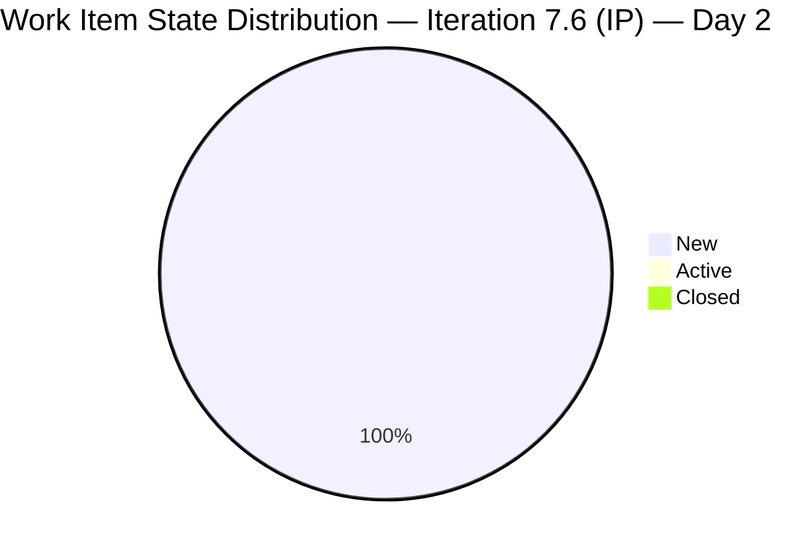
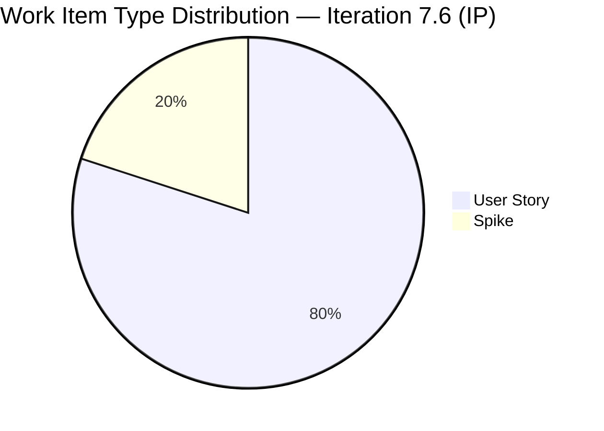
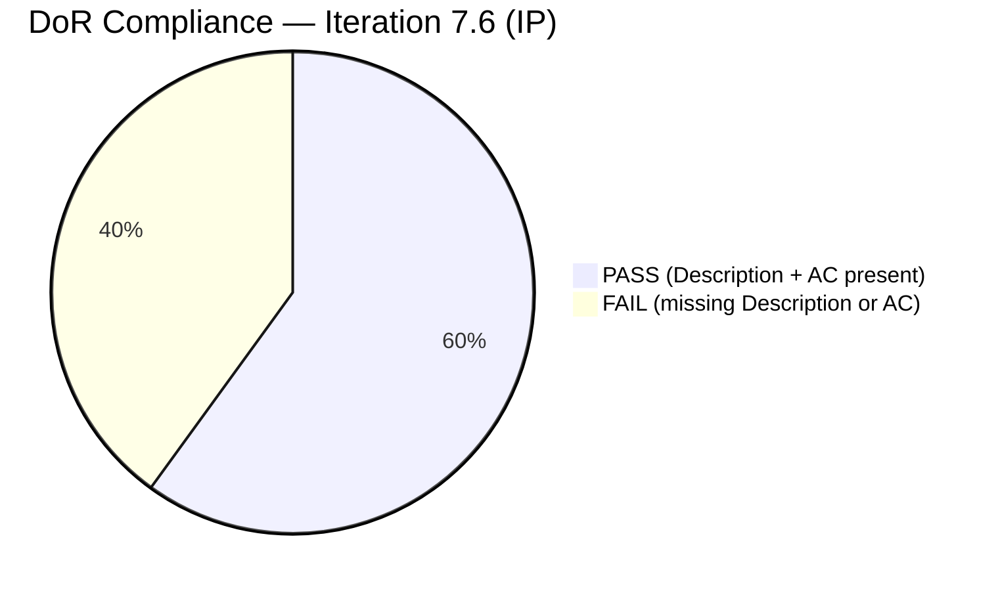
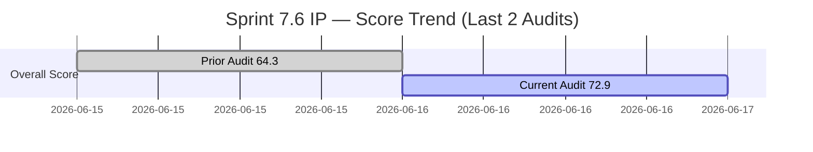

# SAFe Iteration Audit — HR Recruitment Team

## 1. Audit Metadata

| Field | Value |
|-------|-------|
| **Project** | Jairosoft FINOPS |
| **Team** | HR Recruitment Team |
| **Workspace** | `ado_hr` |
| **Iteration** | Iteration 7.6 (IP) — Innovation & Planning |
| **Iteration Dates** | 2026-06-15 to 2026-06-28 |
| **Audit Date** | 2026-06-16 (PHT, UTC+8) |
| **Prior Audit Reference** | `AUDIT_20260615_0200.md` — Score 64.3 / Moderate |
| **Overall Score** | **72.9 / 100** |
| **Risk Band** | MODERATE (Yellow) |

---

## 2. Executive Summary

The HR Recruitment Team opened Day 2 of Iteration 7.6 (IP) with a significantly expanded sprint commitment. Three new User Stories were added on June 15 (206394, 206401, 206402), growing the backlog from 2 items to 5 and committed story points from 4 SP to 8 SP. Critically, the DoR defect identified in yesterday's audit was partially remediated: items 206004, 206005, and 206394 now have complete Descriptions and Acceptance Criteria in ADO, resolving the most urgent finding. However, two new items (206401 and 206402) were added bare — no Description, no AC, and 206401 has no Story Points — partially offsetting that progress.

The overall score of **72.9** (Moderate) represents a meaningful improvement of +8.6 points over yesterday's 64.3. The gains came from DoR Compliance recovering from 0 to 60, Backlog Refinement rising to 100 (all items fresh, no untouched items at Day 2), and Estimation improving to 80 (4/5 estimated). Delivery Predictability remains 0 on Day 2 of a 14-day sprint, which is expected. Structural risks — bus factor of 1, no iteration goal, no PI objectives — persist unchanged.

---

## 3. Previous Audit Delta

| Dimension | Prior (2026-06-15) | Current (2026-06-16) | Delta |
|-----------|---------------------|----------------------|-------|
| Iteration Planning | 100.0 | 100.0 | 0.0 |
| Team Capacity | 100.0 | 100.0 | 0.0 |
| Estimation | 100.0 | 80.0 | **-20.0** |
| DoR Compliance | 0.0 | 60.0 | **+60.0** |
| Work Item Balance | 70.0 | 70.0 | 0.0 |
| Backlog Refinement | 80.0 | 100.0 | **+20.0** |
| Delivery Predictability | 0.0 | 0.0 | 0.0 |
| **Overall** | **64.3** | **72.9** | **+8.6** |

**Key improvements:**
- DoR Compliance +60: Items 206004, 206005, and 206394 all received Description and AC on June 15 — direct response to yesterday's critical finding.
- Backlog Refinement +20: With 3 new items added June 15 (all fresh), all untouched items from yesterday's audit are now touched. Untouched penalty eliminated.
- Score correction on 206004: ADO type is now confirmed as **Spike** (not User Story as shown in yesterday's audit). This is not a change — it was always a Spike; the API returned different field sets yesterday vs. today.

**Regressions:**
- Estimation -20: Item 206401 was added with no Story Points — 4/5 estimated rather than 5/5.
- Two new stub items (206401, 206402) both fail DoR — cap the DoR recovery at 60 instead of 100.

**Persistent issues:**
- No iteration goal defined (13th+ audit with this finding).
- No PI objectives linked.
- Bus factor = 1 (Almera sole active contributor, Grace at 0 capacity).

---

## 4. Current Iteration Snapshot

| Field | Value |
|-------|-------|
| **Iteration** | 7.6 (IP) — Innovation & Planning |
| **Start Date** | 2026-06-15 |
| **End Date** | 2026-06-28 |
| **Day in Sprint** | Day 2 of 14 |
| **Total Root Items in Iteration** | 5 |
| **Spikes** | 1 (206004) |
| **User Stories** | 4 (206005, 206394, 206401, 206402) |
| **Story Points Committed** | 8 SP (4 estimated items × avg 2 SP) |
| **Story Points Closed** | 0 SP |
| **Iteration Goal** | Not defined |
| **PI Objectives Linked** | None |
| **Team Capacity** | 5 pts/day (team-level, GUID 248f59a6) |
| **Net Change from Yesterday** | +3 items, +4 SP |

---

## 5. Work Item Analysis

| ID | Title | Type | State | SP | Assignee | DoR | Last Changed |
|----|-------|------|-------|----|----------|-----|--------------|
| 206004 | JP's Roles & Responsibilities (As QA/PO Owner-Operator Title) | Spike | New | 2 | Almera Tayao | **PASS** | 2026-06-15 |
| 206005 | Role Documentation: Karl's Roles & Responsibilities (As Product Owner-Operator Title) | User Story | New | 2 | Almera Tayao | **PASS** | 2026-06-15 |
| 206394 | Onboarding of Shy as JIT-Trainee | User Story | New | 2 | Almera Tayao | **PASS** | 2026-06-15 |
| 206401 | Jerlyn's New Role (QA/PO) | User Story | New | — | Almera Tayao | **FAIL** | 2026-06-15 |
| 206402 | Ressa's New Role as PO/QA | User Story | New | 2 | Almera Tayao | **FAIL** | 2026-06-15 |

**DoR Assessment:**
- 206004: Rich user-voice Description + bulleted AC with ✅ checkmarks. **PASS**
- 206005: Detailed Description + Given/When/Then AC covering 9 acceptance points. **PASS**
- 206394: Strong As-HR-Officer narrative + 7-point bulleted AC. **PASS**
- 206401: No Description, no AC, no Story Points. Bare title stub — **FAIL**
- 206402: SP=2 but no Description, no AC. **FAIL**

**Ownership:** Almera Kleer Tayao owns 100% of all 5 items. Grace has no items and 0 capacity. Bus factor = 1 remains structural.

**All items in New state.** No items moved to Active or Closed as of Day 2.

---

## 6. SAFe Compliance Scorecard

| # | Dimension | Score | Evidence | Notes |
|---|-----------|-------|----------|-------|
| 1 | Iteration Planning | **100.0** | 5/5 visible root items in current iteration | All backlog items committed to 7.6 IP |
| 2 | Team Capacity | **100.0** | 1 contributor with work; capacity 5 pts/day confirmed (GUID 248f59a6) | Almera sole active contributor |
| 3 | Estimation | **80.0** | 4/5 items have SP > 0; 206401 has no SP | New stub item dragged estimation down |
| 4 | DoR Compliance | **60.0** | 3/5 items pass (Description ≥30 chars + AC ≥20 chars); 206401 and 206402 fail | Partial recovery from yesterday's 0.0 |
| 5 | Work Item Balance | **70.0** | Has User Stories ✓; 4/5 = 80% User Story dominance > 60% → -30 | Spike (1/5) present but not >40% |
| 6 | Backlog Refinement | **100.0** | 5/5 fresh (all June 15); 0 stale; untouched=0/5 (0%) | Full score — all items touched on iteration start |
| 7 | Delivery Predictability | **0.0** | 0/8 SP closed; Day 2 of 14-day sprint | Early-sprint — low delivery expected |
| | **Overall** | **72.9** | Average of 7 dimensions | Moderate Risk |

---

## 7. Dimension Findings

### 7.1 Iteration Planning (100.0)
All 5 visible root backlog items are assigned to Iteration 7.6 (IP). The team continues its practice of full-backlog commitment. For an IP iteration, 5 items (8 SP) is an appropriate light load — IP iterations are designed for retrospectives, innovation, and planning, not maximum delivery.

### 7.2 Team Capacity (100.0)
ADO confirms 5 pts/day for the HR team in this iteration. Almera Kleer Tayao is the sole contributor. Grace remains at 0 capacity. While the dimension scores perfectly, the structural bus-factor risk is not captured by this metric — the team is one person deep.

### 7.3 Estimation (80.0)
Four of five items carry Story Points (all at 2 SP). Item 206401 ("Jerlyn's New Role") was added as a bare stub with no SP. This is a regression from the 100% estimation rate achieved in the prior PI. The fix is simple: add SP to 206401 today.

### 7.4 DoR Compliance (60.0)
Significant improvement from yesterday's 0.0. Items 206004, 206005, and 206394 received full DoR content on June 15:
- 206004 has a user-voice narrative and bulleted AC with ✅ checkboxes
- 206005 has a paragraph description and a structured Given/When/Then AC listing 9 points
- 206394 has a "So that" framing and 7-point AC covering contracts, accounts, equipment, and onboarding checklist

Items 206401 and 206402 were added as stubs on June 15 and have no Description or AC in ADO. These must be completed before the team can claim sprint readiness.

### 7.5 Work Item Balance (70.0)
Four User Stories + one Spike yields an 80% User Story concentration, triggering the dominant-type penalty (-30). The Spike (206004 — JP's Roles & Responsibilities) is a legitimate IP iteration item for investigating/defining a role. Diversifying item types is structurally constrained in a 5-item IP iteration; the penalty is expected.

### 7.6 Backlog Refinement (100.0)
All five items were created or updated on June 15 (iteration Day 1), making them fully fresh within the 45-day recency window. No items are stale (oldest = June 15). No items are untouched at Day 2 — the team updated all three new items on the same day they were added. No stale_90 or stale_180 penalties apply. This is a perfect score for backlog freshness.

### 7.7 Delivery Predictability (0.0)
No story points have been closed. All 5 items remain in New state. This is expected behavior for Day 2 of a 14-day IP iteration — IP sprints focus on planning, retrospectives, and innovation, not delivery throughput. **Early-sprint — low delivery expected.** Historical context: the prior sprint (6.5) delivered 100% (34/34 SP), so delivery capability is proven.

---

## 8. Risks and Bottlenecks

| Risk | Severity | Status |
|------|----------|--------|
| Items 206401 and 206402 have no Description or AC — fail DoR | High | New (added 2026-06-15 without DoR) |
| Item 206401 has no Story Points | Moderate | New |
| Bus factor = 1 — Almera sole active contributor | High | Persistent (14+ audits) |
| No iteration goal defined for 7.6 (IP) | High | Persistent (14+ audits) |
| No PI objectives linked to any story | High | Persistent (14+ audits) |
| Grace has 0 capacity — never contributed | Moderate | Persistent |
| All 5 items in New state, none Activated on Day 2 | Moderate | New — needs attention by Day 3 |
| Spike 206004 categorized correctly — was misidentified as User Story in yesterday's audit | Low | Resolved (data artifact from yesterday) |

---

## 9. Prioritized Recommendations

1. **[Today — High Priority]** Add Description (≥30 chars) and Acceptance Criteria (≥20 chars) to items 206401 (Jerlyn's New Role) and 206402 (Ressa's New Role as PO/QA). These are DoR failures blocking sprint readiness.

2. **[Today]** Add Story Points to item 206401. Suggested: 2 SP (consistent with similar role documentation items in this iteration).

3. **[By Day 3]** Activate all sprint items — move at least 206004, 206005, and 206394 to Active state. All items remaining in New state by Day 3 signals that IP sprint work has not started.

4. **[This Week]** Define an iteration goal for 7.6 (IP) and add it to the iteration settings in ADO. Suggested goal: "Define and document roles and responsibilities for JP, Karl, Jerlyn, and Ressa; complete Shy's onboarding."

5. **[This Sprint]** Link all five items to their parent PI objectives in ADO. Even informal PI objectives referenced by number provide traceability for portfolio reporting.

6. **[Strategic]** Begin capacity planning for Grace (grace@jairosoft.com). She has been on the team roster for 14+ sprints with zero capacity allocation. Either assign her work and capacity for Sprint 8.1, or formally remove her from the team to prevent misleading capacity data.

7. **[Post-Sprint]** At sprint close, institute a DoR gate: no item may be added to an iteration without Title + Description + AC + SP completed at time of creation. Items 206401 and 206402 were added within the sprint window as stubs — the process needs a guardrail.

---

## 10. Evidence Gaps and Limitations

| Gap | Impact |
|-----|--------|
| `wit_list_backlog_work_items` confirmed 5 items; all match `wit_get_work_items_batch_by_ids` results | No scoring impact — data is complete |
| Capacity API returns team-level (5 pts/day for GUID 248f59a6) but not individual allocations | Team Capacity score (100.0) is based on team-level evidence; individual capacity breakdown not available |
| Iteration goal field not exposed via ADO API | Confirmed absent through audit series; recommend manual check in ADO sprint settings |
| Grace's individual days-off and capacity not queryable | Cannot audit individual allocation; team-level 5 pts/day confirmed |
| 206004 was classified as User Story in yesterday's audit — today confirmed as Spike | Scoring correction applied; no re-scoring of prior report needed (Spike carries SP and is scored identically here) |

---

## Appendix: Score Diagrams

