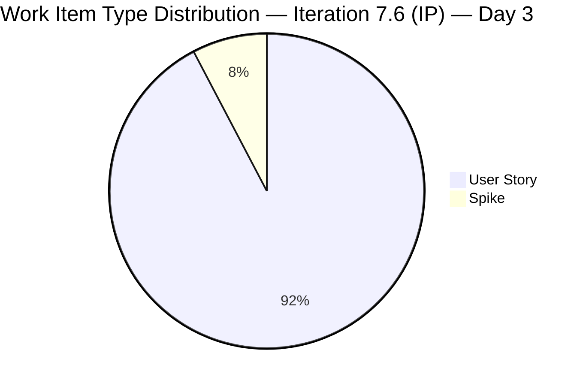
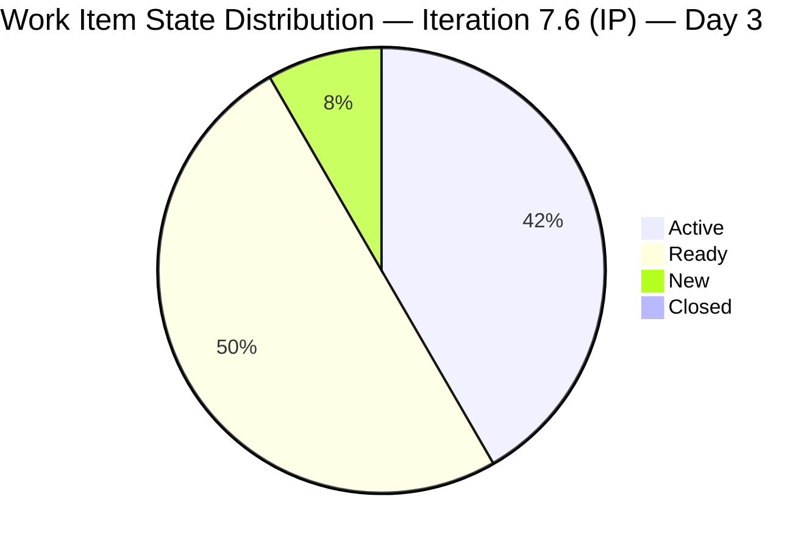
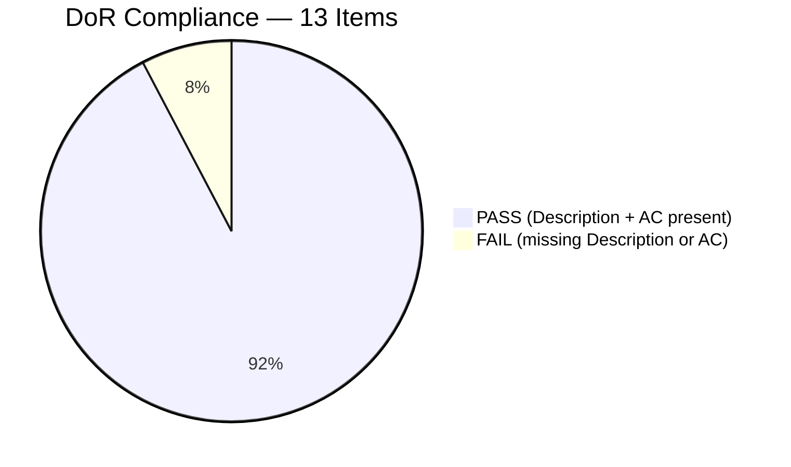
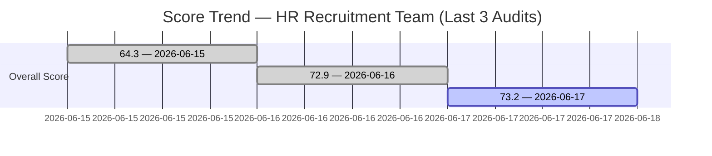
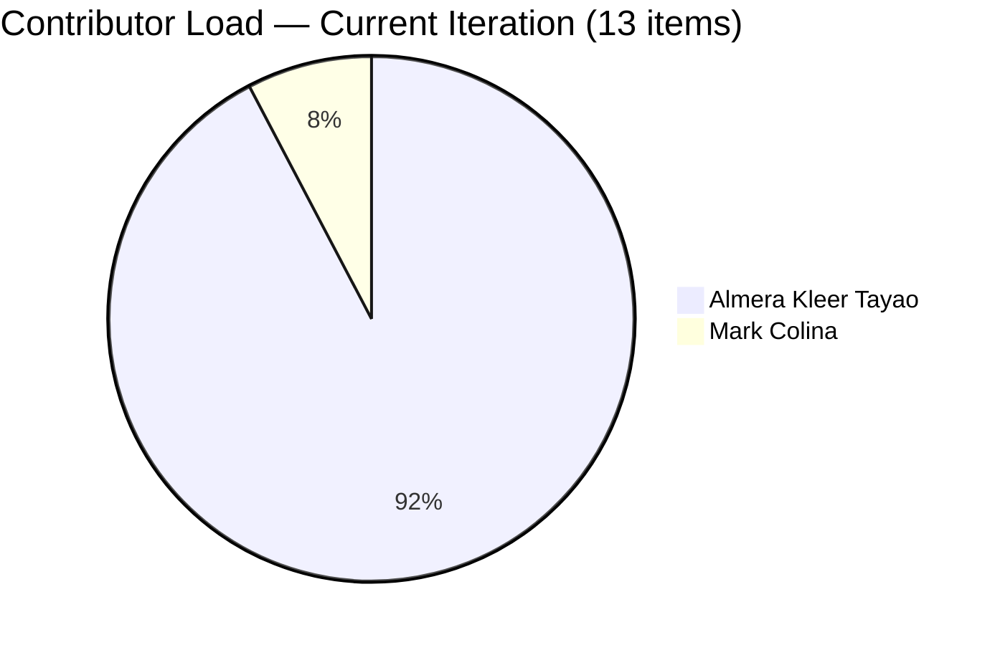

# SAFe Iteration Audit — HR Recruitment Team

## 1. Audit Metadata

| Field | Value |
|-------|-------|
| **Project** | Jairosoft FINOPS |
| **Team** | Human Resource Recruitment Team |
| **Workspace** | `ado_hr` |
| **Iteration** | Iteration 7.6 (IP) — Innovation & Planning |
| **Iteration Dates** | 2026-06-15 to 2026-06-28 |
| **Audit Date** | 2026-06-17 (PHT, UTC+8) |
| **Prior Audit Reference** | `AUDIT_20260616_0209.md` — Score 72.9 / Moderate |
| **Overall Score** | **73.2 / 100** |
| **Risk Band** | MODERATE (Yellow) |

---

## 2. Executive Summary

The HR Recruitment Team continues its IP iteration with strong momentum on Day 3. The backlog grew significantly from 5 items (yesterday) to **13 items (26 SP)**, with 8 new User Stories added on June 16, all fully DoR-compliant at time of creation. Yesterday's two DoR-failing stubs (206401, 206402) were fully remediated — both now carry rich descriptions and detailed acceptance criteria. A second contributor (Mark Colina) was added to the team via item 206583, a new User Story about drug-testing clinic canvassing.

The overall score of **73.2** (Moderate) is essentially flat vs. yesterday's 72.9 (+0.3). Gains from DoR improvement (+32.3) and Estimation improvement (+20.0) are nearly offset by a new Team Capacity penalty (-50.0): Mark Colina is assigned work but has zero configured capacity in ADO, dropping the Team Capacity dimension from 100 to 50. This is the primary remediation priority for today.

Structural risks persist: no iteration goal defined (15th+ consecutive audit), no PI objectives linked, Almera remains the effective sole delivery contributor with Mark Colina's capacity unconfigured.

---

## 3. Previous Audit Delta

| Dimension | Prior (2026-06-16) | Current (2026-06-17) | Delta |
|-----------|---------------------|----------------------|-------|
| Iteration Planning | 100.0 | 100.0 | 0.0 |
| Team Capacity | 100.0 | 50.0 | **-50.0** |
| Estimation | 80.0 | 100.0 | **+20.0** |
| DoR Compliance | 60.0 | 92.3 | **+32.3** |
| Work Item Balance | 70.0 | 70.0 | 0.0 |
| Backlog Refinement | 100.0 | 100.0 | 0.0 |
| Delivery Predictability | 0.0 | 0.0 | 0.0 |
| **Overall** | **72.9** | **73.2** | **+0.3** |

**Key improvements:**
- DoR Compliance +32.3: Items 206401 and 206402 (yesterday's two stubs) were both completed with full descriptions and AC on June 16. All 8 newly added items also carried DoR content at creation.
- Estimation +20.0: 206401 received Story Points (2 SP) on June 16. Now 13/13 items estimated (100%).

**Regressions:**
- Team Capacity -50.0: Mark Colina (mcolina@jairosoft.com) is assigned item 206583 but has no capacity configured in ADO for Iteration 7.6 (IP). The capacity API confirms only Almera (5 pts/day) and Grace (0 pts/day). Mark's addition as an assignee without corresponding capacity configuration is an ADO process gap.
- 206583 still fails DoR — no description, no acceptance criteria. This is the sole DoR failure.

**Persistent issues:**
- No iteration goal defined (15+ audits).
- No PI objectives linked.
- Grace has 0 capacity allocation across all iterations.

---

## 4. Current Iteration Snapshot

| Field | Value |
|-------|-------|
| **Iteration** | 7.6 (IP) — Innovation & Planning |
| **Start Date** | 2026-06-15 |
| **End Date** | 2026-06-28 |
| **Day in Sprint** | Day 3 of 14 |
| **Root Items in Iteration** | 13 |
| **Spikes** | 1 (206004) |
| **User Stories** | 12 |
| **Story Points Committed** | 25 SP (all 13 items estimated) |
| **Story Points Closed** | 0 SP |
| **Active Contributors** | 2 (Almera Kleer Tayao, Mark Colina) |
| **Configured Capacity** | 5 pts/day (Almera only; Grace=0, Mark=not configured) |
| **Iteration Goal** | Not defined |
| **Net Change from Yesterday** | +8 items, +17 SP |

---

## 5. Work Item Analysis

| ID | Title | Type | State | SP | Assignee | DoR | Last Changed |
|----|-------|------|-------|----|----------|-----|--------------|
| 206004 | Research & Blueprint AI-Augmented Engineering Role Framework (Benchmark: JP) | Spike | Ready | 2 | Almera | PASS | 2026-06-16 |
| 206005 | Design AI-Augmented Owner-Operator Framework for Karl (PMO Evolution) | User Story | Ready | 2 | Almera | PASS | 2026-06-16 |
| 206394 | Onboarding of Shy as JIT-Trainee | User Story | Active | 2 | Almera | PASS | 2026-06-16 |
| 206401 | Role Transition: Design AI-Augmented QA/PO Framework for Jerlyn | User Story | Active | 2 | Almera | PASS | 2026-06-16 |
| 206402 | Role Transition: Design AI-Augmented PO/QA Framework for Ressa | User Story | Ready | 2 | Almera | PASS | 2026-06-17 |
| 206553 | Role Transition: Design AI-Augmented QA/PO Framework for Cindy | User Story | Active | 2 | Almera | PASS | 2026-06-16 |
| 206562 | Role Transition: Design AI-Augmented QA/PO Framework for Mary | User Story | Active | 2 | Almera | PASS | 2026-06-16 |
| 206570 | Role Transition: Design AI-Augmented QA/PO Framework for Bon | User Story | Ready | 2 | Almera | PASS | 2026-06-16 |
| 206571 | Design Feasible Individual Attendance Incentives for Front-Liners | User Story | Ready | 2 | Almera | PASS | 2026-06-16 |
| 206575 | Incentive Implementation & Budget Roadmap | User Story | Ready | 2 | Almera | PASS | 2026-06-16 |
| 206579 | Attendance Benchmark Analysis | User Story | Ready | 2 | Almera | PASS | 2026-06-16 |
| 206583 | Summary of canvassed Clinic for Drug-testing presentation | User Story | New | 1 | **Mark Colina** | **FAIL** | 2026-06-16 |
| 206593 | Role Transition: Design AI-Augmented QA/PO Framework for Luzmibel | User Story | Active | 2 | Almera | PASS | 2026-06-17 |

**DoR Assessment:**
- Items 206004–206593 (excluding 206583): All have user-voice or first-person narrative descriptions of 30+ non-whitespace characters AND structured acceptance criteria of 20+ non-whitespace characters. **PASS (12/13)**
- 206583: No Description field, no Acceptance Criteria. Bare title stub added by Mark Colina. **FAIL**

**State distribution:** Active (5), Ready (6), New (1), Closed (0)

**Notable:** The role transition items (206401, 206402, 206553, 206562, 206570, 206593) share near-identical description and AC templates. This is copy-paste pattern with name substitution — expedient but may reduce story quality. Each is technically DoR-compliant by character count.

**Attendance incentive cluster (206571, 206575, 206579):** Well-formed user stories covering feasibility assessment, benchmark analysis, and budget roadmap — represent a cohesive IP initiative around front-liner attendance improvement.

---

## 6. SAFe Compliance Scorecard

| # | Dimension | Score | Evidence | Notes |
|---|-----------|-------|----------|-------|
| 1 | Iteration Planning | **100.0** | 13/13 visible root items in Iteration 7.6 (IP) | Full backlog committed to current sprint |
| 2 | Team Capacity | **50.0** | 1/2 contributors with configured capacity; Mark Colina has no ADO capacity entry | Almera=5pts/day; Grace=0; Mark=not configured |
| 3 | Estimation | **100.0** | 13/13 point-eligible items have SP > 0 (25 SP total) | Perfect estimation — all items sized |
| 4 | DoR Compliance | **92.3** | 12/13 items pass (Description ≥30 chars + AC ≥20 chars); 206583 fails | One bare stub remains |
| 5 | Work Item Balance | **70.0** | Has User Stories ✓; User Story dominant at 12/13 = 92.3% > 60% → -30; Spike 1/13 = 7.7% < 40% | Expected in an IP iteration with role documentation work |
| 6 | Backlog Refinement | **100.0** | 13/13 fresh (all changed 2026-06-15 to 2026-06-17); 0 stale; untouched=0/13 | Perfect — all items touched within sprint window |
| 7 | Delivery Predictability | **0.0** | 0/25 SP closed; Day 3 of 14-day sprint | Early-sprint — low delivery expected |
| | **Overall** | **73.2** | (100+50+100+92.3+70+100+0)/7 | Moderate Risk |

---

## 7. Dimension Findings

### 7.1 Iteration Planning (100.0)
All 13 root-level items in the visible backlog are committed to Iteration 7.6 (IP). The team expanded from 5 to 13 items between Day 2 and Day 3 — an 8-item burst, likely from a planning session on June 16. For an IP sprint, 13 items at 25 SP is a healthy but ambitious commitment for a single active contributor. All items align with IP objectives: role framework documentation, attendance incentive analysis, onboarding, and research spikes.

### 7.2 Team Capacity (50.0)
Almera Kleer Tayao is configured at 5 pts/day (3 Documentation + 2 Requirements). Grace retains 0 capacity. Mark Colina was added as assignee on item 206583 but has no ADO capacity entry for this iteration. The rubric requires `contributors_with_capacity / contributors_with_current_work = 1/2 = 50.0`. This is a fixable ADO administrative issue — adding Mark's capacity to the iteration settings would restore this dimension to 100.

At 25 SP over 14 days with a 5 pt/day capacity ceiling (Almera only), the team velocity implies ~5 SP/day × 10 working days = 50 SP theoretical maximum — well above commitment. Delivery is feasible if items are activated and progressed daily.

### 7.3 Estimation (100.0)
All 13 items carry Story Points. The distribution is 12 × 2 SP + 1 × 1 SP = 25 SP total. The 1 SP for item 206583 (drug-testing clinic canvass summary) is appropriately scoped for a documentation deliverable. The 2 SP average is consistent with the team's historical sizing across PI7.

### 7.4 DoR Compliance (92.3)
Twelve of 13 items fully comply with DoR. Notable compliance highlights:
- **206004 (Spike):** Five-checkbox AC with ✅ workflow mapping, competency matrix, elimination strategy, stakeholder alignment, and HR repository lodging.
- **206571 (Incentives — feasibility):** Checkbox-based AC covering feasibility assessment, policy framework, and risk mapping.
- **206579 (Benchmark analysis):** Three-point AC with case study, success factor documentation, and replicable strategy extraction.

Item **206583** (Mark Colina's drug-testing clinic summary) has no description and no AC — must be remediated before Day 5. The story is small (1 SP) and the title is self-explanatory, but DoR compliance requires explicit Description and AC fields in ADO.

**Copy-paste risk:** Items 206553, 206562, 206570, 206593 share near-identical descriptions with only the target employee name changed. The AC are also templated. While technically compliant, these items may not reflect the unique scope of each person's role transition. Recommend individualizing the AC for each person before closure.

### 7.5 Work Item Balance (70.0)
One Spike (206004) and twelve User Stories. User Stories dominate at 92.3%, triggering the dominant-type penalty (-30). The spike ratio at 7.7% is well below the 40% spike penalty threshold. The item mix is appropriate for an IP iteration (role documentation, research, onboarding, planning deliverables) — the Work Item Balance penalty reflects rubric preference for mixed types rather than a true sprint health issue.

### 7.6 Backlog Refinement (100.0)
All 13 items have ChangedDate of 2026-06-15 or later, placing them fully within the 45-day freshness window (since 2026-05-03). No items date before 2026-03-19 (90-day staleness threshold). No items are untouched from before the iteration start date. This is a clean, fully-refined backlog for Day 3.

### 7.7 Delivery Predictability (0.0)
Zero committed story points have reached Closed or Done state. Five items are in Active state (one step from Ready/Closed), which indicates work is underway. This dimension will improve significantly as items complete — estimated first closures around Day 5–7 based on team historical patterns. **Early-sprint (Day 3 of 14) — low delivery expected.** Historical baseline: PI6 Sprint 6.5 achieved 100% (34/34 SP) at close; this team has a proven delivery track record.

---

## 8. Risks and Bottlenecks

| Risk | Severity | Status |
|------|----------|--------|
| Mark Colina has no ADO capacity configured — Team Capacity drops to 50 | High | New — opened 2026-06-16 |
| Item 206583 fails DoR — no description or AC | High | New (added without DoR on 2026-06-16) |
| Bus factor = 1 — Almera is effective sole active contributor | High | Persistent (15+ audits) |
| No iteration goal defined for 7.6 (IP) | High | Persistent (15+ audits) |
| No PI objectives linked to any story | High | Persistent (15+ audits) |
| Role transition items (206553, 206562, 206570, 206593) use copy-paste templates | Moderate | New finding — may reduce item clarity at closure |
| 25 SP commitment vs. 5 pt/day capacity (Almera) = tight delivery window | Moderate | Risk if Mark Colina remains non-contributing |
| Grace has 0 capacity — no active contribution in 15+ sprints | Moderate | Persistent |
| All Active items still in "Active" state (none Ready/Closed on Day 3) | Low | Monitor |

---

## 9. Prioritized Recommendations

1. **[Today — Critical]** Configure Mark Colina's capacity in ADO for Iteration 7.6 (IP). Navigate to the sprint capacity settings and add his capacity (suggest 2–3 pts/day for documentation tasks). This single fix restores Team Capacity from 50 to 100 and eliminates the dimension's scoring drag.

2. **[Today — High]** Add Description (≥30 chars) and Acceptance Criteria (≥20 chars) to item 206583 ("Summary of canvassed Clinic for Drug-testing presentation"). The story is minor (1 SP) and easy to document: describe the clinic canvassing objective and what constitutes a complete summary.

3. **[By Day 5]** Define an Iteration Goal for 7.6 (IP). Suggested: "Design AI-Augmented role frameworks for JP, Karl, Jerlyn, Ressa, Cindy, Mary, Bon, and Luzmibel; complete Shy's onboarding; analyze and document attendance incentive strategy."

4. **[This Sprint]** Individualize the acceptance criteria for the six copy-paste role transition items (206553, 206562, 206570, 206593, 206401, 206402). Each person's role evolution has distinct scope — Cindy's QA-to-PO path differs from Bon's or Mary's. Generic AC risks item being accepted without validating the named person's specific deliverable.

5. **[This Sprint]** Link all 13 items to PI7 PI objectives in ADO (even as informal references). The attendance incentive cluster (206571, 206575, 206579) maps directly to workforce engagement objectives. Role transition items map to organizational AI transformation objectives.

6. **[Day 5–7]** Begin closing completed role framework items. The Spike (206004 — JP framework) is the dependency anchor — once it closes, the role transition User Stories can also progress to closed as their frameworks are finalized.

7. **[Strategic]** With 13 items and only 1 active contributor (Almera), consider whether Mark Colina can take on 2–3 of the role transition items in Active state (Cindy, Mary, or Bon frameworks) to reduce single-contributor concentration. His capacity as "documentation" contributor is compatible with the task type.

---

## 10. Evidence Gaps and Limitations

| Gap | Impact |
|-----|--------|
| Mark Colina not found in team capacity API response | Scored as unconfigured; Team Capacity = 50. Manual verification in ADO sprint settings recommended to confirm his capacity is absent (not a display artifact). |
| Iteration goal field not exposed via ADO MCP API | Confirmed absent across all 15+ audits in this series; recommend direct ADO check in iteration settings. |
| 206583 has no description or AC in ADO fields | Confirmed FAIL. AC may exist in linked work items or comments — not visible to audit. Scoring stands as FAIL. |
| Grace (grace@jairosoft.com) capacity = 0 | Has 0 pt/day across all activities — consistent with 15+ audits. Not scored as active contributor. |
| Copy-paste pattern in 206553, 206562, 206570, 206593 | All technically DoR-compliant by character count. Quality signal only — no scoring impact. |

---

## Appendix: Score Diagrams

