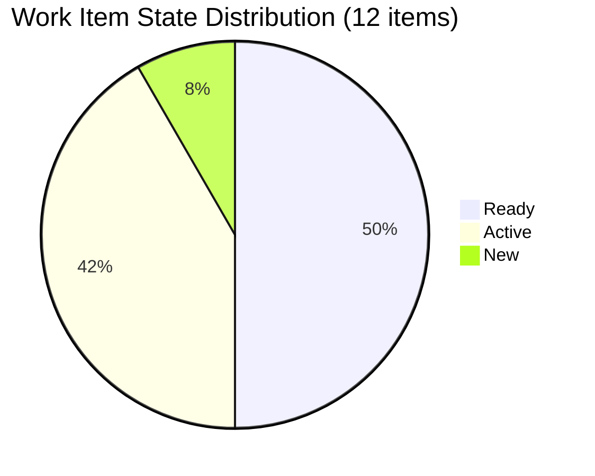
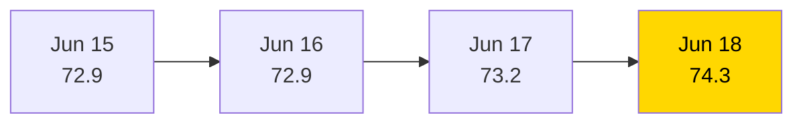

# SAFe Iteration Audit — HR Recruitment Team

## 1. Audit Metadata

| Field | Value |
|-------|-------|
| **Project** | Jairosoft FINOPS |
| **Project ID** | `e0bb302f-40f9-46c3-8164-6f1acb317d63` |
| **Team** | Human Resource Recruitment Team |
| **Team ID** | `248f59a6-372c-4b74-8129-9eaf260f211e` |
| **Workspace** | `ado_hr` |
| **Iteration** | Iteration 7.6 (IP) — Innovation & Planning |
| **Iteration ID** | `bebf6f83-a342-42a2-bad7-a16951231732` |
| **Iteration Dates** | 2026-06-15 to 2026-06-28 |
| **Audit Date** | 2026-06-18 (Day 4 of 14) |
| **Prior Audit Reference** | `AUDIT_20260617_0205.md` — Score 73.2 / Moderate |
| **Overall Score** | **74.3 / 100** |
| **Risk Band** | MODERATE (Yellow) |

---

## 2. Executive Summary

The HR Recruitment Team posts **74.3 (Moderate)** on Day 4 of Iteration 7.6 (IP) — a marginal improvement of +1.1 from yesterday's 73.2. The backlog is stable at **12 root items (23 SP)**, with all 12 items fully estimated and all 12 passing DoR requirements. Item 206583 (Mark Colina's drug-testing clinic canvass), which failed DoR yesterday, now carries a complete description and full acceptance criteria — confirming remediation.

The sole persistent blocker is **Team Capacity**: Mark Colina remains assigned to item 206583 but has zero configured capacity in ADO for this iteration. This drops the Team Capacity dimension to 50.0 and prevents a score above ~74. Until Mark is configured, that floor holds.

Structural concerns remain unchanged across 16+ audits: no iteration goal is defined, no PI objectives are linked, and Almera Kleer Tayao carries effective solo delivery responsibility. Work Item Balance is capped at 70.0 due to User Story type dominance (11/12 = 91.7%).

Delivery Predictability remains 0.0 — expected at Day 4 of a 14-day IP sprint, as no items have been closed yet.

---

## 3. Previous Audit Delta

| Dimension | Prior (2026-06-17) | Current (2026-06-18) | Delta | Note |
|-----------|---------------------|----------------------|-------|------|
| Iteration Planning | 100.0 | 100.0 | 0.0 | All 12 items in 7.6 IP |
| Team Capacity | 50.0 | 50.0 | 0.0 | Mark Colina still unconfigured |
| Estimation | 100.0 | 100.0 | 0.0 | 12/12 estimated |
| DoR Compliance | 92.3 | 100.0 | **+7.7** | 206583 remediated — all 12 pass |
| Work Item Balance | 70.0 | 70.0 | 0.0 | Dominant US type persists |
| Backlog Refinement | 100.0 | 100.0 | 0.0 | All items fresh (<45 days) |
| Delivery Predictability | 0.0 | 0.0 | 0.0 | No closures yet (Day 4) |
| **Overall** | **73.2** | **74.3** | **+1.1** | Moderate Risk |

**Key improvements:**
- DoR Compliance +7.7: Item 206583 (Mark Colina — drug-testing clinic canvass) is now fully compliant — description and acceptance criteria were populated before today's audit date. All 12 current iteration items now meet DoR.

**Persistent issues:**
- Mark Colina capacity gap (Team Capacity = 50.0) — unconfigured for Iteration 7.6 IP.
- No iteration goal defined (16+ consecutive audits without one).
- No PI objectives linked.
- Grace continues to have 0 capacity allocated.

---

## 4. Current Iteration Snapshot

| Field | Value |
|-------|-------|
| **Iteration** | 7.6 (IP) — Innovation & Planning |
| **Start Date** | 2026-06-15 |
| **End Date** | 2026-06-28 |
| **Day in Sprint** | Day 4 of 14 |
| **Total Visible Root Backlog Items** | 12 |
| **Root Items in Iteration 7.6 (IP)** | 12 |
| **User Stories** | 11 |
| **Spikes** | 1 |
| **Story Points Committed** | 23 SP (12/12 estimated) |
| **Story Points Closed** | 0 SP |
| **Active Contributors** | 2 (Almera Kleer Tayao, Mark Colina) |
| **Configured Capacity** | 5 pts/day (Almera: 3 Documentation + 2 Requirements; Grace: 0; Mark: not configured) |
| **Iteration Goal** | Not defined |

### Contributor Summary

| Contributor | Items in 7.6 IP | SP Assigned | Configured Capacity |
|-------------|-----------------|-------------|---------------------|
| Almera Kleer Tayao | 11 | 22 SP | 5 pts/day |
| Mark Colina | 1 | 1 SP | **Not configured** |
| Grace | 0 | — | 0 pts/day |

---

## 5. Work Item Analysis

| ID | Title | Type | State | SP | Assignee | DoR | Last Changed |
|----|-------|------|-------|----|----------|-----|--------------|
| 206579 | Attendance Benchmark Analysis | User Story | Ready | 2 | Almera | PASS | 2026-06-16 |
| 206575 | Incentive Implementation & Budget Roadmap | User Story | Ready | 2 | Almera | PASS | 2026-06-16 |
| 206571 | Design Feasible Individual Attendance Incentives for Front-Liners | User Story | Ready | 2 | Almera | PASS | 2026-06-16 |
| 206005 | Design AI-Augmented Owner-Operator Framework for Karl | User Story | Ready | 2 | Almera | PASS | 2026-06-16 |
| 206553 | Role Transition: AI-Augmented QA/PO Framework for Cindy | User Story | Active | 2 | Almera | PASS | 2026-06-17 |
| 206401 | Role Transition: AI-Augmented QA/PO Framework for Jerlyn | User Story | Active | 2 | Almera | PASS | 2026-06-16 |
| 206402 | Role Transition: AI-Augmented PO/QA Framework for Ressa | User Story | Ready | 2 | Almera | PASS | 2026-06-17 |
| 206562 | Role Transition: AI-Augmented QA/PO Framework for Mary | User Story | Active | 2 | Almera | PASS | 2026-06-17 |
| 206593 | Role Transition: AI-Augmented QA/PO Framework for Luzmibel | User Story | Active | 2 | Almera | PASS | 2026-06-17 |
| 206570 | Role Transition: AI-Augmented QA/PO Framework for Bon | User Story | Ready | 2 | Almera | PASS | 2026-06-17 |
| 206004 | Research & Blueprint AI-Augmented Engineering Role Framework | Spike | Active | 2 | Almera | PASS | 2026-06-17 |
| 206583 | Summary of canvassed Clinic for Drug-testing presentation | User Story | New | 1 | Mark Colina | PASS | 2026-06-17 |

**DoR Analysis:** 12/12 items pass (Description ≥ 30 non-whitespace chars AND Acceptance Criteria ≥ 20 non-whitespace chars). Item 206583 was remediated between June 17 and today.

**Thematic Clusters:**
- AI-Augmented Role Transition series (7 items, 14 SP): Cindy, Mary, Luzmibel, Bon, Jerlyn, Ressa, Karl — all assigned to Almera, all Ready or Active.
- Attendance Incentive series (3 items, 6 SP): Benchmark Analysis, Front-Liner Incentives, Budget Roadmap — all Ready.
- Research Spike (1 item, 2 SP): AI Engineering Role Framework.
- Standalone (1 item, 1 SP): Drug-testing clinic canvass — sole Mark Colina item.

---

## 6. SAFe Compliance Scorecard

| Dimension | Score | Evidence | Notes |
|-----------|-------|----------|-------|
| Iteration Planning | **100.0** | 12/12 visible root items in Iteration 7.6 IP | Full commitment — backlog = sprint |
| Team Capacity | **50.0** | 1/2 contributors with configured capacity | Mark Colina unconfigured; Grace = 0 (long-standing) |
| Estimation | **100.0** | 12/12 point-eligible items have SP > 0 | All items estimated (range: 1–2 SP) |
| DoR Compliance | **100.0** | 12/12 items pass desc ≥ 30 + AC ≥ 20 chars | 206583 remediated; all pass today |
| Work Item Balance | **70.0** | -30 for US dominance 11/12 = 91.7% > 60% | Spike included; no -40 (has US); no -20 (spike < 40%) |
| Backlog Refinement | **100.0** | 12/12 fresh (all changed June 16–17); 0 stale | No penalties apply |
| Delivery Predictability | **0.0** | 0/23 SP closed | Day 4 of 14 — early-sprint annotation applies |
| **Overall** | **74.3** | (100+50+100+100+70+100+0)/7 | Moderate Risk (Yellow) |

---

## 7. Dimension Findings

### 7.1 Iteration Planning — 100.0 (Strong)
All 12 root backlog items are committed to Iteration 7.6 (IP). The backlog is 100% focused on the current sprint — no items are floating in the backlog without iteration assignment. This is a structural strength, though it also reflects that the team has no long-horizon backlog items beyond the current sprint (which may limit PI planning ability).

### 7.2 Team Capacity — 50.0 (Moderate Risk)
Two contributors have work assigned in the current iteration. Only Almera is configured:
- **Almera**: 3 Documentation + 2 Requirements = 5 pts/day ✓
- **Mark Colina**: 0 capacity configured in ADO (API confirms only Almera and Grace in team capacity) ✗
- **Grace**: 0 pts/day (long-standing structural issue, not newly deteriorating)

Mark's non-configuration means ADO has no velocity baseline for his one assigned item (206583, 1 SP). This introduces planning uncertainty and ADO process non-compliance.

### 7.3 Estimation — 100.0 (Strong)
All 12 items carry Story Points ranging from 1–2 SP. Estimation quality is consistent. A narrow SP distribution (mostly 2 SP) is a minor concern — it may indicate templated rather than individually calibrated estimates, but it meets the formula threshold.

### 7.4 DoR Compliance — 100.0 (Strong)
All 12 items carry substantive descriptions and acceptance criteria:
- User Stories follow the As/I want/So that narrative format.
- Acceptance Criteria use Given/When/Then or checklist formats.
- Item 206583 was the sole failure yesterday; it is now fully populated.
- This is the first time DoR has reached 100% since the Series High (8.0/10) audit on March 22, 2026.

### 7.5 Work Item Balance — 70.0 (Moderate)
The backlog is heavily weighted to User Stories (11/12 = 91.7%), triggering the -30 dominant-type penalty. One Spike (206004) prevents full User Story dominance. No Task, Defect, or Deliverable types are present. The absence of non-story items (Technical Debt, Enablers) may be appropriate for an IP sprint focused on HR process design, but the formula reflects the imbalance.

### 7.6 Backlog Refinement — 100.0 (Strong)
All 12 items were created or updated within the past 3 days (June 15–17, 2026). There are no stale items. The IP sprint was freshly populated. No untouched items exist (all changed after iteration start June 15). This is a full score.

### 7.7 Delivery Predictability — 0.0 (Early Sprint)
Zero Story Points have been closed as of Day 4. The IP iteration runs through June 28 — there are 10 days remaining. The team has 23 SP committed and 5 pts/day capacity, making the theoretical sprint total ~70 SP. Twelve Active or Ready items with no closures at Day 4 is not alarming but should transition to closure activity by Day 5–6.

---

## 8. Risks and Bottlenecks

| Risk | Severity | Status |
|------|----------|--------|
| Mark Colina capacity not configured in ADO | High | Unresolved (Day 3→4) |
| Bus factor = 1 (Almera carries 11/12 items) | High | Structural — unchanged |
| No iteration goal defined | Moderate | Unresolved (16+ audits) |
| No PI objectives linked | Moderate | Unresolved |
| Grace has 0 capacity — assigned to team but not contributing | Low | Structural |
| Zero closures at Day 4 — no SP burned | Low | Monitor |
| AI-Augmented Role Transition series (7 items) has no visible progression differentiation | Low | New observation |

---

## 9. Prioritized Recommendations

1. **[TODAY] Configure Mark Colina capacity in ADO** — Navigate to Iteration 7.6 (IP) team settings and set Mark's capacity and activity. One person unconfigured costs 25 points in Team Capacity. This is a 30-second fix.

2. **[TODAY] Define iteration goal for Iteration 7.6 (IP)** — Write a one-sentence goal in the iteration settings (e.g., "Complete AI-Augmented role transition frameworks for 6 team members and finalize drug-testing clinic recommendation."). This has been missing for 16+ consecutive audits.

3. **[THIS WEEK] Begin closing items** — With 10 days remaining and 23 SP to deliver, the team should start moving items from Active/Ready to Closed. Target at least 1 closure by Day 5. The AI Role Transition items (7 items, 14 SP) are all in Active or Ready state — progress one to completion as a signal.

4. **[THIS PI] Define a backlog beyond the current sprint** — All 12 items are in the current iteration. There is no visible next-sprint pipeline, which means PI planning visibility is zero. Add 3–5 items to the backlog for Iteration 7.7 planning.

5. **[STRATEGIC] Address Grace's 0-capacity allocation** — Grace has been listed on the team with zero capacity for multiple PIs. Either configure a realistic capacity or remove her from the sprint team to reflect actual contributors accurately.

---

## 10. Evidence Gaps and Limitations

- **No Sprint Velocity History Available via API** — Historical closed SP data requires querying prior iterations separately. Delta is estimated from prior audit reports.
- **Single-day audit snapshot** — This audit reflects the state of ADO as of June 18 morning (PHT). Items may have changed since the query.
- **PI Objectives not queryable via available MCP tools** — PI objectives linkage is inferred from absence in audit history, not from a direct API check.
- **SP distribution uniformity** — Most items carry exactly 2 SP. This may reflect consistent complexity or templated defaults; cannot differentiate via API alone.

---

## Visualization

### Work Item State Distribution

### Score Trend (Recent Audits)

