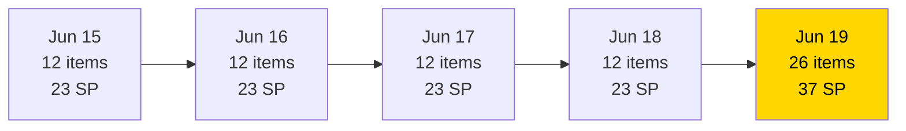
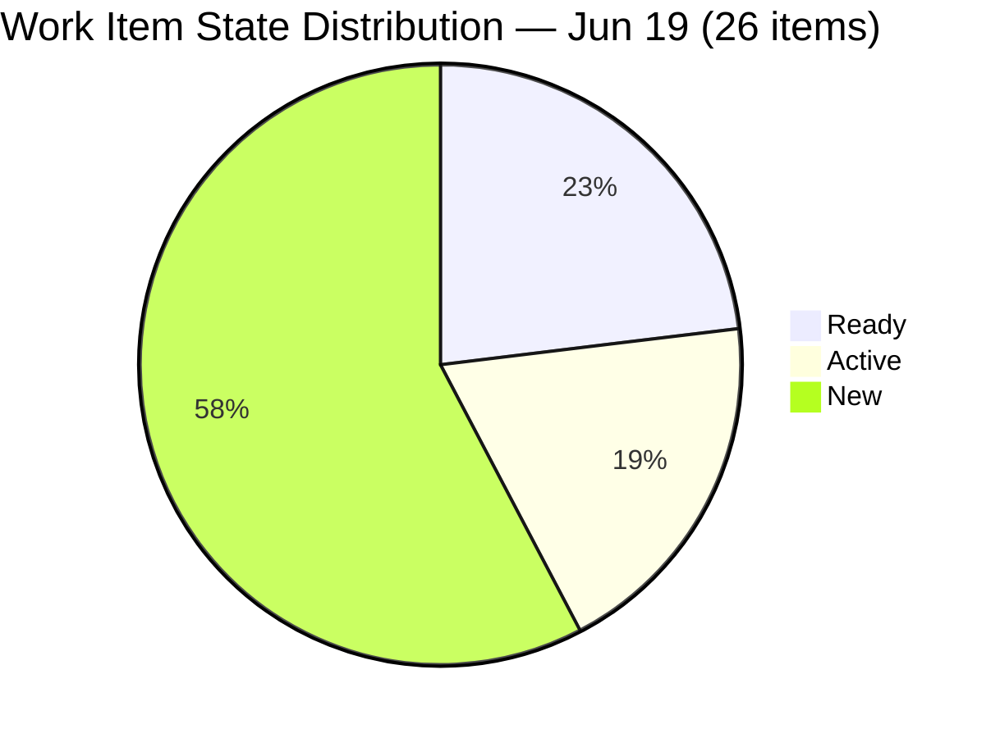
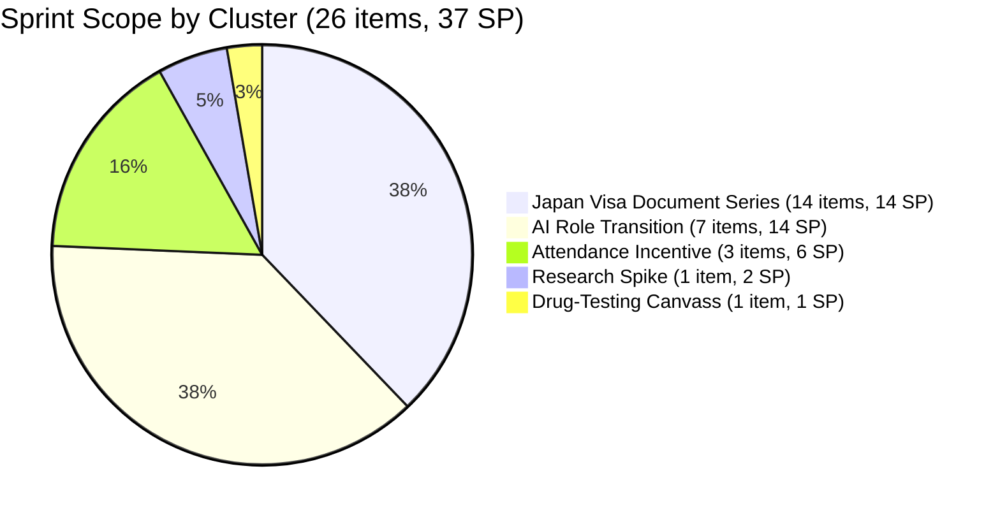
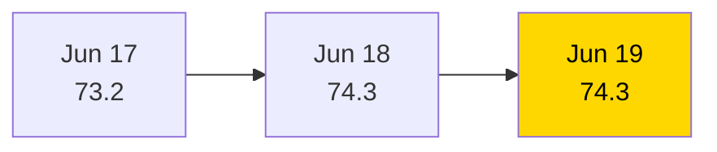

# SAFe Iteration Audit — HR Recruitment Team

## 1. Audit Metadata

| Field | Value |
|-------|-------|
| **Project** | Jairosoft FINOPS |
| **Project ID** | `e0bb302f-40f9-46c3-8164-6f1acb317d63` |
| **Team** | Human Resource Recruitment Team |
| **Team ID** | `248f59a6-372c-4b74-8129-9eaf260f211e` |
| **Workspace** | `ado_hr` |
| **Iteration** | Iteration 7.6 (IP) — Innovation & Planning |
| **Iteration ID** | `bebf6f83-a342-42a2-bad7-a16951231732` |
| **Iteration Dates** | 2026-06-15 to 2026-06-28 |
| **Audit Date** | 2026-06-19 (Day 5 of 14) |
| **Prior Audit Reference** | `AUDIT_20260618_0204.md` — Score 74.3 / Moderate |
| **Overall Score** | **74.3 / 100** |
| **Risk Band** | MODERATE (Yellow) |

---

## 2. Executive Summary

The HR Recruitment Team holds at **74.3 (Moderate)** on Day 5 of Iteration 7.6 (IP) — unchanged from yesterday despite a significant backlog expansion. Today's most notable event is the addition of **14 new User Stories** (206892–206907) all scoped to Jove's Japan Visa Application, expanding the committed scope from 12 to 26 items and from 23 SP to 37 SP. The new items are all assigned to Almera Kleer Tayao, all estimated (1 SP each), and all pass DoR review — a strong intake hygiene signal.

The score stabilizes at 74.3 because the formula denominators and numerators scale proportionally: 100% Iteration Planning, 100% Estimation, 100% DoR, and 100% Backlog Refinement all hold at their ceiling, while Team Capacity remains locked at 50.0 (Mark Colina still unconfigured) and Delivery Predictability remains 0.0 (Day 5, no closures yet). The Work Item Balance penalty (-30) applies identically as User Story dominance increases to 25/26 = 96.2%.

The first closure signal is urgently needed. At Day 5 with 37 SP committed across 9 remaining days, the team needs to begin burning SP this week.

---

## 3. Previous Audit Delta

| Dimension | Prior (2026-06-18) | Current (2026-06-19) | Delta | Note |
|-----------|---------------------|----------------------|-------|------|
| Iteration Planning | 100.0 | 100.0 | 0.0 | 26/26 — backlog expanded from 12→26 items, all in sprint |
| Team Capacity | 50.0 | 50.0 | 0.0 | Mark Colina still unconfigured |
| Estimation | 100.0 | 100.0 | 0.0 | 26/26 estimated (14 new items all have 1 SP) |
| DoR Compliance | 100.0 | 100.0 | 0.0 | All 26 pass — new items DoR-compliant on entry |
| Work Item Balance | 70.0 | 70.0 | 0.0 | US dominance now 25/26 = 96.2% — penalty unchanged |
| Backlog Refinement | 100.0 | 100.0 | 0.0 | All 26 items fresh (created/changed Jun 15–18) |
| Delivery Predictability | 0.0 | 0.0 | 0.0 | 0/37 SP closed — Day 5, early sprint |
| **Overall** | **74.3** | **74.3** | **0.0** | Moderate Risk — stable |

**Key developments today:**
- **14 new items added** (206892–206907): Jove's Japan Visa Application document series — Japanese visa application form, passport, photos, ITR, SEC & GIS, employment certificate, business registration, bank certificate, guarantee letter, invitation letter, travel itinerary, and dispatch letter. All assigned to Almera, 1 SP each, all DoR-compliant.
- **Item 206394** (Onboarding of Shy as JIT-Trainee) is Closed — not counted in active visible backlog (appears in iteration path but closed, excluded from formula per backlog API scope).

**Persistent issues:**
- Mark Colina capacity gap (Team Capacity = 50.0) — now Day 5 unresolved.
- No iteration goal defined (17+ consecutive audits).
- No SP burned (Day 5 of 14).

---

## 4. Current Iteration Snapshot

| Field | Value |
|-------|-------|
| **Iteration** | 7.6 (IP) — Innovation & Planning |
| **Start Date** | 2026-06-15 |
| **End Date** | 2026-06-28 |
| **Day in Sprint** | Day 5 of 14 |
| **Total Visible Root Backlog Items** | 26 |
| **Root Items in Current Iteration** | 26 |
| **User Stories** | 25 |
| **Spikes** | 1 |
| **Story Points Committed** | 37 SP (26/26 estimated) |
| **Story Points Closed** | 0 SP |
| **Active Contributors** | 2 (Almera Kleer Tayao, Mark Colina) |
| **Configured Capacity** | 5 pts/day (Almera only; Mark: not configured; Grace: 0) |
| **Iteration Goal** | Not defined |

### Contributor Summary

| Contributor | Items in 7.6 IP | SP Assigned | Configured Capacity |
|-------------|-----------------|-------------|---------------------|
| Almera Kleer Tayao | 25 | 36 SP | 5 pts/day |
| Mark Colina | 1 | 1 SP | **Not configured** |
| Grace | 0 | — | 0 pts/day |

---

## 5. Work Item Analysis

### 5.1 Existing Items (from prior sprint — unchanged)

| ID | Title | Type | State | SP | DoR |
|----|-------|------|-------|----|-----|
| 206579 | Attendance Benchmark Analysis | User Story | Ready | 2 | PASS |
| 206575 | Incentive Implementation & Budget Roadmap | User Story | Ready | 2 | PASS |
| 206571 | Design Feasible Individual Attendance Incentives for Front-Liners | User Story | Ready | 2 | PASS |
| 206005 | Design AI-Augmented Owner-Operator Framework for Karl | User Story | Ready | 2 | PASS |
| 206553 | Role Transition: AI-Augmented QA/PO Framework for Cindy | User Story | Active | 2 | PASS |
| 206401 | Role Transition: AI-Augmented QA/PO Framework for Jerlyn | User Story | Active | 2 | PASS |
| 206402 | Role Transition: AI-Augmented PO/QA Framework for Ressa | User Story | Ready | 2 | PASS |
| 206562 | Role Transition: AI-Augmented QA/PO Framework for Mary | User Story | Active | 2 | PASS |
| 206593 | Role Transition: AI-Augmented QA/PO Framework for Luzmibel | User Story | Active | 2 | PASS |
| 206570 | Role Transition: AI-Augmented QA/PO Framework for Bon | User Story | Ready | 2 | PASS |
| 206004 | Research & Blueprint AI-Augmented Engineering Role Framework | Spike | Active | 2 | PASS |
| 206583 | Summary of canvassed Clinic for Drug-testing presentation | User Story | New | 1 | PASS |

### 5.2 New Items Added 2026-06-18 (Jove's Japan Visa Application Series)

| ID | Title | Type | State | SP | DoR |
|----|-------|------|-------|----|-----|
| 206907 | Jairosoft's Business Permit (Mayor's Permit) | User Story | New | 1 | PASS |
| 206906 | Jove's Philippine Passport | User Story | New | 1 | PASS |
| 206905 | Invitation Letter for Jove | User Story | New | 1 | PASS |
| 206904 | Guarantee Letter | User Story | New | 1 | PASS |
| 206902 | Jairosoft's Bank Certificate w/ ADB | User Story | New | 1 | PASS |
| 206901 | Jairosoft's Business Registration (SEC) | User Story | New | 1 | PASS |
| 206900 | Employment Certificate | User Story | New | 1 | PASS |
| 206899 | SEC & GIS | User Story | New | 1 | PASS |
| 206898 | Jove's Copy of Latest ITR | User Story | New | 1 | PASS |
| 206897 | Jove's Travel Order/Dispatch Letter | User Story | New | 1 | PASS |
| 206896 | Jove's Japan Visa Application Form | User Story | New | 1 | PASS |
| 206895 | Jove's Travel Itinerary | User Story | New | 1 | PASS |
| 206894 | Jove's Passport Picture | User Story | New | 1 | PASS |
| 206892 | Jove's Japan Visa Application | User Story | New | 1 | PASS |

**DoR Assessment (all 26 items):** All items carry substantive As/I want/So that narratives (≥ 30 non-whitespace chars) and structured acceptance criteria (≥ 20 non-whitespace chars). DoR = 26/26 = 100%.

**Thematic Clusters:**
- Jove's Japan Visa Application document series (14 items, 14 SP) — New items, all New state, all Almera.
- AI-Augmented Role Transition series (7 items, 14 SP) — Cindy, Mary, Luzmibel, Bon, Jerlyn, Ressa, Karl.
- Attendance Incentive series (3 items, 6 SP) — Benchmark, Front-Liner Incentives, Budget Roadmap.
- Research Spike (1 item, 2 SP) — AI Engineering Role Framework.
- Drug-testing clinic canvass (1 item, 1 SP) — Mark Colina.

---

## 6. SAFe Compliance Scorecard

| Dimension | Score | Evidence | Notes |
|-----------|-------|----------|-------|
| Iteration Planning | **100.0** | 26/26 visible backlog items in Iteration 7.6 IP | Full commitment — expanded backlog still 100% focused |
| Team Capacity | **50.0** | 1/2 contributors with configured capacity | Mark Colina unconfigured; Grace = 0 (structural) |
| Estimation | **100.0** | 26/26 point-eligible items have SP > 0 | All items estimated (1–2 SP range) |
| DoR Compliance | **100.0** | 26/26 items pass desc ≥ 30 + AC ≥ 20 chars | New items entered compliant; all pass |
| Work Item Balance | **70.0** | -30: US dominance 25/26 = 96.2% > 60% | 1 Spike; no -40 (has US); no -20 (spike < 40%) |
| Backlog Refinement | **100.0** | 26/26 fresh (all changed Jun 15–18); 0 stale | No penalties; no untouched items |
| Delivery Predictability | **0.0** | 0/37 SP closed; Day 5 of 14 | Early-sprint annotation; 9 days remain |
| **Overall** | **74.3** | (100+50+100+100+70+100+0)/7 = 520/7 | Moderate Risk (Yellow) |

---

## 7. Dimension Findings

### 7.1 Iteration Planning — 100.0 (Strong)
All 26 active backlog items are assigned to Iteration 7.6 (IP). The 14 new visa application items were added directly to the current iteration upon creation — correct sprint commitment practice. The backlog is fully focused on the current sprint with no orphaned or floating items.

### 7.2 Team Capacity — 50.0 (Moderate Risk)
Capacity configuration remains unchanged from Day 1. Mark Colina holds item 206583 (1 SP) but has no configured capacity. This is now Day 5 with no remediation. The capacity mismatch means ADO has no velocity baseline for Mark's work. Almera's configured 5 pts/day against 36 committed SP gives a sprint throughput ceiling of ~45 SP (5 × 9 remaining days) — sufficient if all Almera items close but tight given the expanded scope.

### 7.3 Estimation — 100.0 (Strong)
All 26 items carry Story Points. The Jove's Japan Visa series uses uniform 1 SP estimates — consistent with their nature as document-sourcing tasks (single-action items). The AI Role Transition and Attendance Incentive series use 2 SP. The Spike carries 2 SP. Estimation is complete and proportionate.

### 7.4 DoR Compliance — 100.0 (Strong)
All 26 items pass DoR on both dimensions. The new Jove's Japan Visa series was created with As/I want/So that narratives and "Submitted to the agency for visa processing" acceptance criteria. While the AC is brief (single criterion), it exceeds the 20-character non-whitespace threshold. This is the second consecutive day at 100% DoR — a sustained quality signal.

### 7.5 Work Item Balance — 70.0 (Moderate)
The User Story concentration increased to 25/26 = 96.2% with the addition of 14 new User Stories. The -30 penalty for dominant type share applies. One Spike (206004) is the sole non-User-Story item. The IP sprint context (innovation & planning) partly explains the User Story concentration, but the visa application document series could alternatively be modeled as Tasks under a single parent User Story, which would improve balance.

### 7.6 Backlog Refinement — 100.0 (Strong)
All 26 items were created or updated on June 15–18, 2026. No stale items. No untouched items (all changed after or on the iteration start date of June 15). The backlog was freshly populated and expanded within the sprint window, meeting all refinement thresholds.

### 7.7 Delivery Predictability — 0.0 (Early Sprint)
Zero Story Points closed as of Day 5. With 9 days remaining and 37 SP committed, the theoretical burn rate required is ~4.1 SP/day. Almera's configured capacity is 5 pts/day. The math supports delivery if Almera begins closing items in the AI Role Transition and Attendance Incentive clusters (14 SP + 6 SP = 20 SP). The Japan Visa document series (14 SP) depends on external parties (agency submission), which may delay closure. The first closure by Day 6 is critical to establish predictability evidence.

---

## 8. Risks and Bottlenecks

| Risk | Severity | Status |
|------|----------|--------|
| Mark Colina capacity not configured (Day 5, unresolved) | High | Escalate |
| No SP closed as of Day 5 — delivery window narrowing | High | Monitor (Moderate → High) |
| Bus factor = 1 (Almera carries 25/26 items) | High | Structural |
| Japan Visa series (14 items) depends on external agency — not fully in team's control | Moderate | New risk today |
| No iteration goal defined (17+ consecutive audits) | Moderate | Persistent |
| No PI objectives linked | Moderate | Persistent |
| User Story over-concentration (96.2%) — IP sprint lacks innovation/research diversity | Moderate | New pattern (14 new items all US) |
| Grace has 0 capacity — team member with no contribution | Low | Structural |

---

## 9. Prioritized Recommendations

1. **[TODAY — Day 5] Configure Mark Colina capacity** — Navigate to Iteration 7.6 (IP) capacity settings and enter Mark's capacity and activity type. Five days unresolved; this is a 30-second fix that restores +25 points in Team Capacity (50.0 → 75.0+).

2. **[TODAY — Day 5] Begin closures on AI Role Transition series** — The 4 Active items (206553 Cindy, 206401 Jerlyn, 206562 Mary, 206593 Luzmibel) are in progress. Move at least one to Closed today. Each closure signals velocity and begins Delivery Predictability recovery.

3. **[TODAY] Define iteration goal** — Write a one-sentence goal covering both workstreams: "Complete AI-Augmented role transition frameworks for 6 team members, finalize the Japan Visa application document package for Jove, and deliver the drug-testing clinic recommendation." This has been absent for 17+ consecutive audits.

4. **[THIS WEEK] Assess Japan Visa series (14 items) feasibility within IP sprint** — All 14 items are New state and depend on document sourcing/agency submission. If agency submission timelines extend beyond June 28, consider de-committing items to PI8 to protect sprint integrity and prevent artificial 0-SP closure at sprint end.

5. **[STRATEGIC] Consolidate Japan Visa document stories under a parent User Story** — The 14 individual 1-SP items (passport copy, photos, ITR, SEC, etc.) could be modeled as Tasks under a single "Jove's Japan Visa Application Package" User Story. This reduces the User Story type dominance penalty and creates a cleaner product hierarchy.

---

## 10. Evidence Gaps and Limitations

- **Item 206394 (Closed)** — Appears in the iteration path but is Closed and excluded from the active backlog API. Not counted in formula metrics. Represents 2 SP of already-delivered work that does not appear in Delivery Predictability calculation.
- **Mark Colina capacity** — Confirmed absent via capacity API (only Almera and Grace appear for this team in the iteration). Not an inference.
- **Japan Visa document sourcing timelines** — Whether items 206892–206907 can realistically close within the IP sprint depends on external agency responsiveness. ADO data cannot reflect this external constraint.
- **No PI Objectives API** — PI objectives linkage inferred from audit history absence, not from a direct query.

---

## Visualization

### Backlog Expansion Day-over-Day

### Work Item State Distribution (26 items)

### Work Item Thematic Clusters

### SAFe Score Trend

