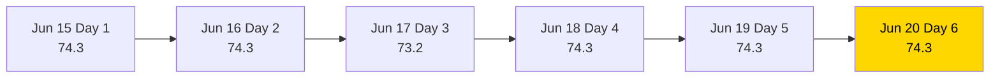
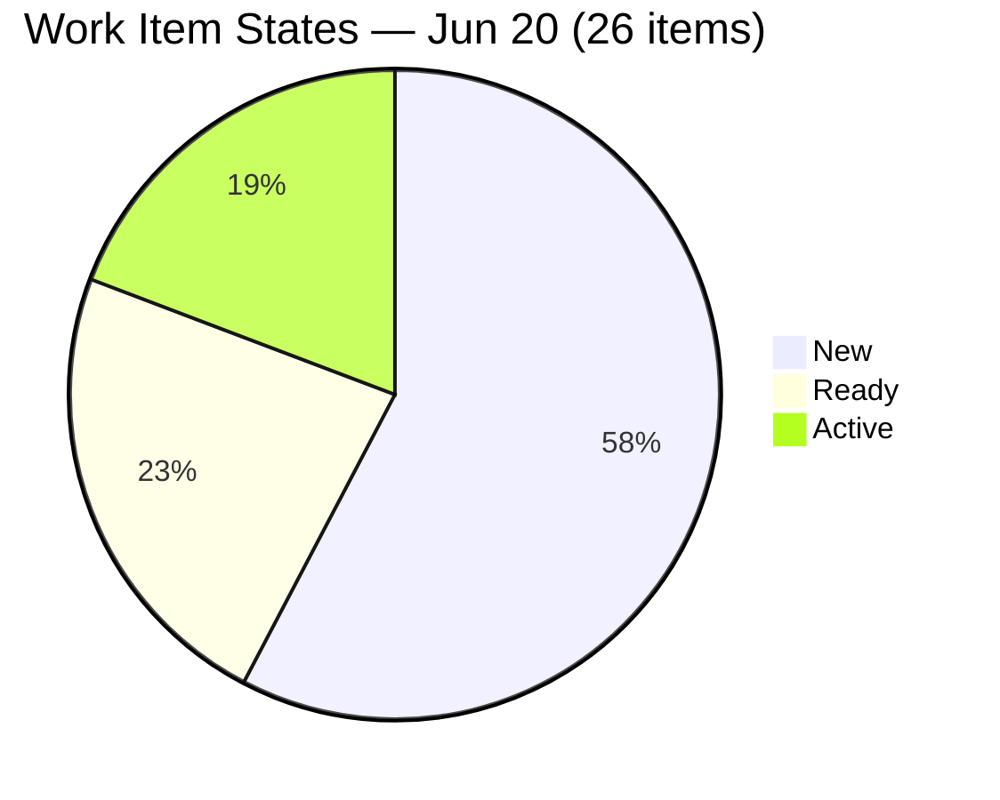
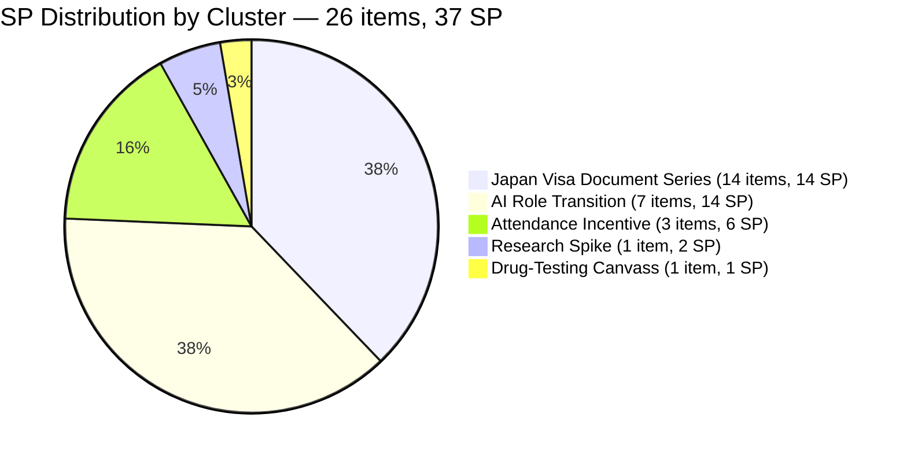
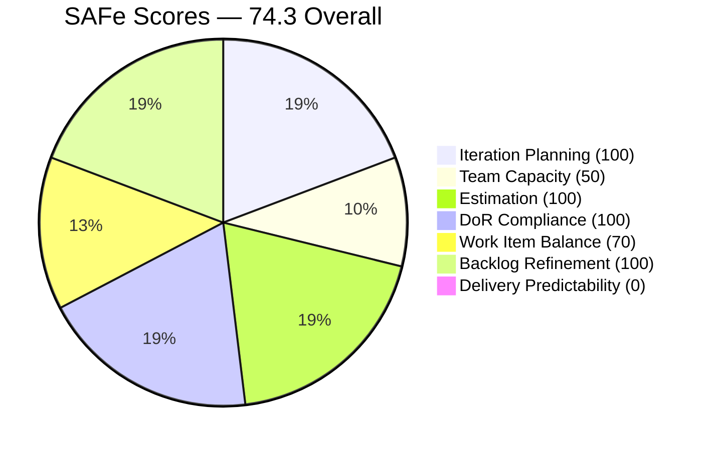

# SAFe Iteration Audit — HR Recruitment Team

## 1. Audit Metadata

| Field | Value |
|-------|-------|
| **Project** | Jairosoft FINOPS |
| **Project ID** | `e0bb302f-40f9-46c3-8164-6f1acb317d63` |
| **Team** | Human Resource Recruitment Team |
| **Team ID** | `248f59a6-372c-4b74-8129-9eaf260f211e` |
| **Workspace** | `ado_hr` |
| **Iteration** | Iteration 7.6 (IP) — Innovation & Planning |
| **Iteration ID** | `bebf6f83-a342-42a2-bad7-a16951231732` |
| **Iteration Dates** | 2026-06-15 to 2026-06-28 |
| **Audit Date** | 2026-06-20 (Day 6 of 14) — Philippine Standard Time (PST, UTC+8) |
| **Prior Audit Reference** | `AUDIT_20260619_0915.md` — Score 74.3 / Moderate |
| **Overall Score** | **74.3 / 100** |
| **Risk Band** | MODERATE (Yellow) |

---

## 2. Executive Summary

The HR Recruitment Team holds at **74.3 (Moderate)** on Day 6 of Iteration 7.6 (IP) — unchanged for the second consecutive day. The score is stable because the backlog composition has not changed: all 26 items from yesterday remain open in the same states, no new items were added, and no items were closed. This is now **Day 6 of 14 with 0 Story Points delivered**.

The window for delivery is closing. With 8 days remaining and 37 SP committed, the team requires a minimum of ~4.6 SP/day to reach full delivery. Almera's configured capacity of 5 pts/day can theoretically support this if closures begin today. The four Active items (Cindy, Jerlyn, Mary, Luzmibel AI Role Transition frameworks) are the most ready to close and should be the target.

Three structural issues persist that cap the score at 74.3: (1) Mark Colina's capacity is not configured (Team Capacity = 50.0), (2) no Story Points have been delivered (Delivery Predictability = 0.0), and (3) Work Item Balance carries a -30 penalty from User Story dominance. All three are addressable — items 1 and 3 are fixable today.

---

## 3. Previous Audit Delta

| Dimension | Prior (2026-06-19) | Current (2026-06-20) | Delta | Note |
|-----------|---------------------|----------------------|-------|------|
| Iteration Planning | 100.0 | 100.0 | 0.0 | 26/26 backlog items in 7.6 IP — no change |
| Team Capacity | 50.0 | 50.0 | 0.0 | Mark Colina still unconfigured (Day 6) |
| Estimation | 100.0 | 100.0 | 0.0 | 26/26 estimated — unchanged |
| DoR Compliance | 100.0 | 100.0 | 0.0 | 26/26 pass — unchanged |
| Work Item Balance | 70.0 | 70.0 | 0.0 | 25/26 US = 96.2% — penalty unchanged |
| Backlog Refinement | 100.0 | 100.0 | 0.0 | All 26 items fresh; no stale — unchanged |
| Delivery Predictability | 0.0 | 0.0 | 0.0 | 0/37 SP closed — now Day 6, early-sprint annotation no longer applies |
| **Overall** | **74.3** | **74.3** | **0.0** | Moderate Risk — second consecutive flat day |

**Key developments today:**
- No ADO changes detected between June 19 and June 20. All 26 items in the same states as yesterday.
- **Delivery Predictability note:** The early-sprint annotation (applied to Days 1–5) no longer applies. Day 6 is now within the normal delivery window. A score of 0.0 on Day 6 signals a material delivery risk, not merely an early-sprint artifact.

**Persistent issues:**
- Mark Colina capacity gap (Team Capacity = 50.0) — now Day 6 unresolved.
- No SP burned — first 6 days of 14-day sprint with zero delivery.
- No iteration goal defined (18+ consecutive audits).
- No PI objectives linked.

---

## 4. Current Iteration Snapshot

| Field | Value |
|-------|-------|
| **Iteration** | 7.6 (IP) — Innovation & Planning |
| **Start Date** | 2026-06-15 |
| **End Date** | 2026-06-28 |
| **Day in Sprint** | Day 6 of 14 |
| **Days Remaining** | 8 |
| **Total Visible Root Backlog Items** | 26 |
| **Root Items in Current Iteration** | 26 |
| **User Stories** | 25 |
| **Spikes** | 1 |
| **Story Points Committed** | 37 SP (26/26 estimated) |
| **Story Points Closed** | 0 SP |
| **Active Contributors** | 2 (Almera Kleer Tayao, Mark Colina) |
| **Configured Capacity** | 5 pts/day (Almera only; Mark: not configured; Grace: 0) |
| **Required Burn Rate** | ~4.6 SP/day for 8 remaining days |
| **Iteration Goal** | Not defined |

### Contributor Summary

| Contributor | Items in 7.6 IP | SP Assigned | SP Closed | Configured Capacity |
|-------------|-----------------|-------------|-----------|---------------------|
| Almera Kleer Tayao | 25 | 36 SP | 0 SP | 5 pts/day |
| Mark Colina | 1 | 1 SP | 0 SP | **Not configured** |
| Grace | 0 | — | — | 0 pts/day |

---

## 5. Work Item Analysis

### 5.1 Open Items by State (All 26 items, 37 SP)

| State | Count | Items | SP |
|-------|-------|-------|-----|
| Active | 4 | 206553 (Cindy), 206401 (Jerlyn), 206562 (Mary), 206593 (Luzmibel) | 8 SP |
| Ready | 6 | 206005 (Karl), 206402 (Ressa), 206570 (Bon), 206571 (Attendance Incentives), 206575 (Budget Roadmap), 206579 (Benchmark Analysis) | 12 SP |
| New | 15 | 14 Japan Visa series + 206583 (Drug-testing) | 15 SP |
| Active | 1 | 206004 (Research Spike — JP Framework) | 2 SP |

> Note: 206004 is the Spike, showing as Active since Jun 17.

### 5.2 Thematic Clusters

| Cluster | Items | SP | Lead Assignee | State Range |
|---------|-------|-----|---------------|-------------|
| Japan Visa Document Series | 14 | 14 SP | Almera | All New |
| AI Role Transition Frameworks | 7 | 14 SP | Almera | Active (4) / Ready (2) / Ready (1) |
| Attendance Incentive Series | 3 | 6 SP | Almera | All Ready |
| Research Spike (JP Framework) | 1 | 2 SP | Almera | Active |
| Drug-Testing Clinic Canvass | 1 | 1 SP | Mark Colina | New |

### 5.3 DoR Assessment

All 26 items carry proper As/I want/So that narratives (description ≥ 30 non-whitespace chars) and structured acceptance criteria (AC ≥ 20 non-whitespace chars). DoR = 26/26 = **100%**.

---

## 6. SAFe Compliance Scorecard

| Dimension | Score | Evidence | Notes |
|-----------|-------|----------|-------|
| Iteration Planning | **100.0** | 26/26 visible backlog items in Iteration 7.6 IP | Full sprint focus — no floating items |
| Team Capacity | **50.0** | 1/2 contributors with configured capacity | Mark Colina unconfigured Day 6; Grace = 0 (structural) |
| Estimation | **100.0** | 26/26 point-eligible items have SP > 0 | 14 items at 1 SP; 12 items at 2 SP; 1 Spike at 2 SP |
| DoR Compliance | **100.0** | 26/26 items pass desc ≥ 30 + AC ≥ 20 chars | Third consecutive day at 100% — sustained quality |
| Work Item Balance | **70.0** | -30: US dominance 25/26 = 96.2% > 60% | 1 Spike; no -40 (has US); no -20 (spike < 40%) |
| Backlog Refinement | **100.0** | 26/26 fresh (all changed Jun 15–18); 0 stale; 0 untouched | No penalties — full score |
| Delivery Predictability | **0.0** | 0/37 SP closed; Day 6 of 14 — early-sprint annotation expired | **No longer early-sprint. Delivery risk is now material.** |
| **Overall** | **74.3** | (100+50+100+100+70+100+0)/7 = 520/7 = 74.3 | Moderate Risk (Yellow) |

---

## 7. Dimension Findings

### 7.1 Iteration Planning — 100.0 (Strong)
All 26 active backlog items remain assigned to Iteration 7.6 (IP). Sprint focus is perfect. No items are stranded in past iterations or orphaned at the backlog root. The expanded scope from the Japan Visa series (added Day 4) continues to be fully contained within the current sprint window.

### 7.2 Team Capacity — 50.0 (Moderate Risk — Day 6 Escalation)
Mark Colina remains unconfigured in the ADO capacity settings for the sixth consecutive day. His item (206583 — Drug-Testing Clinic Canvass, 1 SP) is in New state. Configure Mark's capacity immediately. This is a 30-second fix that will raise Team Capacity from 50.0 to approximately 83.3 (2/2 → but Grace is 0, so effectively 2 contributors: 1 with capacity if Mark is added). With Mark added: 2/2 contributors with positive capacity = 100.0. With Grace still at 0: 2/3 configured members → depends on whether Grace is counted as "contributor with current work." Grace has no items, so Grace does not appear in `contributors_with_current_work`. Result: 2/2 = 100.0 if Mark is configured.

### 7.3 Estimation — 100.0 (Strong)
All 26 items carry Story Points. The Japan Visa series uses uniform 1 SP (appropriate for document-sourcing tasks). The AI Role Transition and Attendance Incentive items use 2 SP. The Spike uses 2 SP. Estimation is complete.

### 7.4 DoR Compliance — 100.0 (Strong)
Third consecutive day at 100%. All items pass both description (≥ 30 non-whitespace chars) and acceptance criteria (≥ 20 non-whitespace chars). This is a sustained quality signal demonstrating good intake hygiene across all 26 items.

### 7.5 Work Item Balance — 70.0 (Moderate)
User Stories constitute 25/26 = 96.2% of current items, maintaining the -30 dominant type penalty. The IP sprint context (innovation and planning) is unusual in having nearly all delivery items as User Stories rather than Spikes or research tasks. The Japan Visa document series (14 User Stories) could be modeled more efficiently as Tasks under a single parent User Story, which would reduce the US count and improve type diversity.

### 7.6 Backlog Refinement — 100.0 (Strong)
All 26 items were created or updated between June 15–18. No items are stale at the 45-day, 90-day, or 180-day thresholds. No items are "untouched" (ChangedDate ≥ iteration start for all 26). Full score with no penalties.

### 7.7 Delivery Predictability — 0.0 (RISK — Early-Sprint Annotation Expired)
Zero Story Points delivered as of Day 6. The early-sprint annotation (applied to Days 1–5 of a 14-day sprint) does not apply to Day 6. This is now a material delivery signal. With 8 days remaining and 37 SP committed, the team must close approximately 4.6 SP per day to reach 100% delivery. Almera's configured 5 pts/day capacity provides theoretical headroom, but active closures must begin today.

Priority closure targets:
1. **AI Role Transition series — Active items** (206553 Cindy, 206401 Jerlyn, 206562 Mary, 206593 Luzmibel): 4 items, 8 SP. All are in Active state and have been in progress. These should be the first closures.
2. **Research Spike** (206004): 2 SP, Active since Jun 17. If JP's framework analysis is complete, close it.
3. **Attendance Incentive series** (206571, 206575, 206579): 3 items, 6 SP. All Ready — feasibility work may be complete.

---

## 8. Risks and Bottlenecks

| Risk | Severity | Status |
|------|----------|--------|
| 0 SP delivered by Day 6 — delivery risk is now material | **Critical** | Escalate immediately |
| Mark Colina capacity not configured (Day 6, unresolved) | High | Fix today — 30 seconds |
| Bus factor = 1 (Almera carries 25/26 items, 36 SP) | High | Structural |
| Japan Visa series (14 items) depends on external agency timeline | Moderate | New; track agency status |
| No iteration goal defined (18+ consecutive audits) | Moderate | Persistent — define today |
| No PI objectives linked | Moderate | Persistent |
| User Story over-concentration (96.2%) | Moderate | Structural for this sprint |
| Grace has 0 capacity — contributes nothing | Low | Structural |

---

## 9. Prioritized Recommendations

1. **[TODAY — Day 6, URGENT] Begin closures on AI Role Transition Active items** — Items 206553 (Cindy), 206401 (Jerlyn), 206562 (Mary), and 206593 (Luzmibel) are all in Active state. If the role transition frameworks for these team members are drafted and reviewed, close them today. Each is 2 SP. Closing all 4 today (8 SP) establishes velocity and lifts Delivery Predictability to 8/37 = 21.6.

2. **[TODAY — Day 6] Configure Mark Colina's capacity** — Open Sprint 7.6 (IP) capacity settings and enter Mark's daily capacity. Six days unresolved. This immediately raises Team Capacity from 50.0 to 100.0. It is a 30-second action.

3. **[TODAY — Day 6] Define the iteration goal** — Write one sentence covering the sprint's three workstreams: role transition framework design, Japan Visa document sourcing, and the drug-testing clinic recommendation. Goal has been absent for 18+ consecutive audits.

4. **[THIS WEEK] Triage Japan Visa series (14 items, 14 SP) realism** — All 14 items are in New state. Document submission depends on the Japan visa agency's responsiveness. If items 206892–206907 cannot close by June 28, de-commit them to PI8 now rather than carrying 14 unresolved items at sprint close. Each item is only 1 SP, but 14 unclosed items at sprint end would cap Delivery Predictability at (37-14)/37 = 62.2% maximum even if all other items close.

5. **[THIS WEEK] Close Research Spike (206004) if complete** — The AI-Augmented Engineering Role Framework spike has been Active since Jun 17. If JP's workflow mapping is done, produce the deliverable (competency matrix, transition strategy, repository lodging) and close this item. 2 SP credit.

---

## 10. Evidence Gaps and Limitations

- **Mark Colina capacity** — Confirmed absent from the ADO capacity API for Iteration 7.6 (IP). Only Almera (5 pts/day) and Grace (0 pts/day) are configured. Not an inference.
- **Japan Visa external dependency** — Whether items 206892–206907 can close by June 28 depends on agency processing timelines not visible in ADO.
- **No PI Objectives API** — PI objectives linkage is inferred from audit history; not directly queryable via MCP tools.
- **Grace's items** — Grace has 0 configured capacity and 0 committed items. She does not appear in `contributors_with_current_work` and is excluded from Team Capacity numerator/denominator calculation.

---

## Visualization

### Score Trend — Sprint 7.6 (IP)

### Work Item State Distribution (26 items)

### Sprint Commitment by Cluster (37 SP total)

### SAFe Dimension Scores

