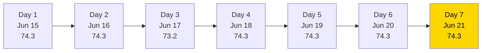
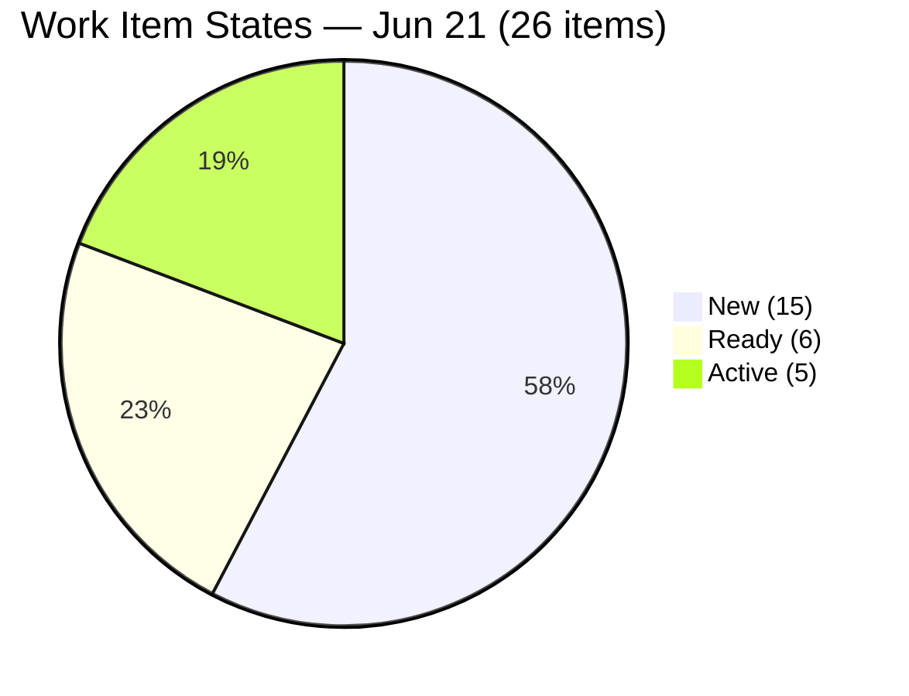
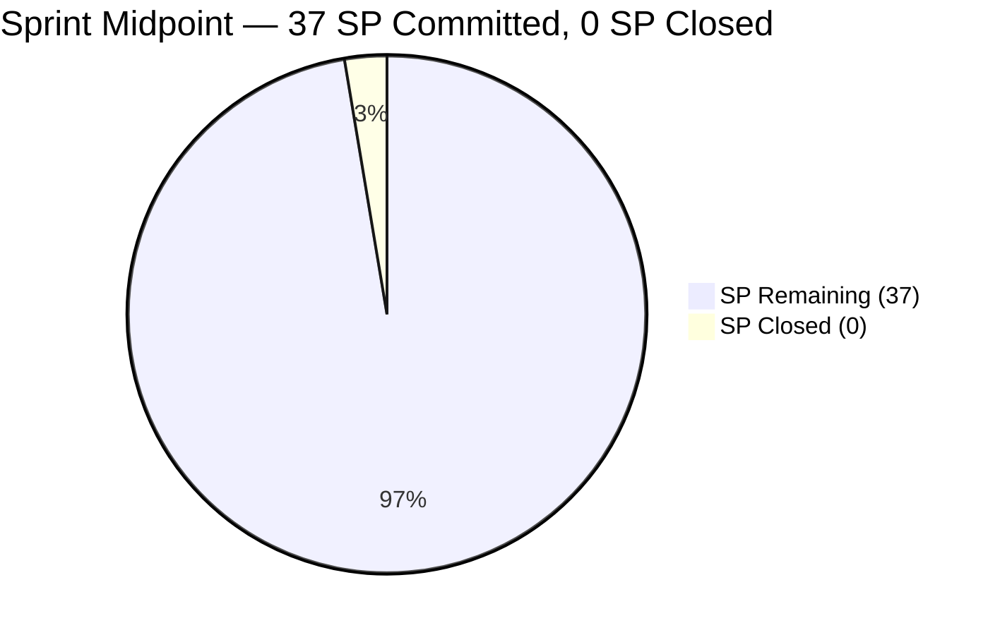
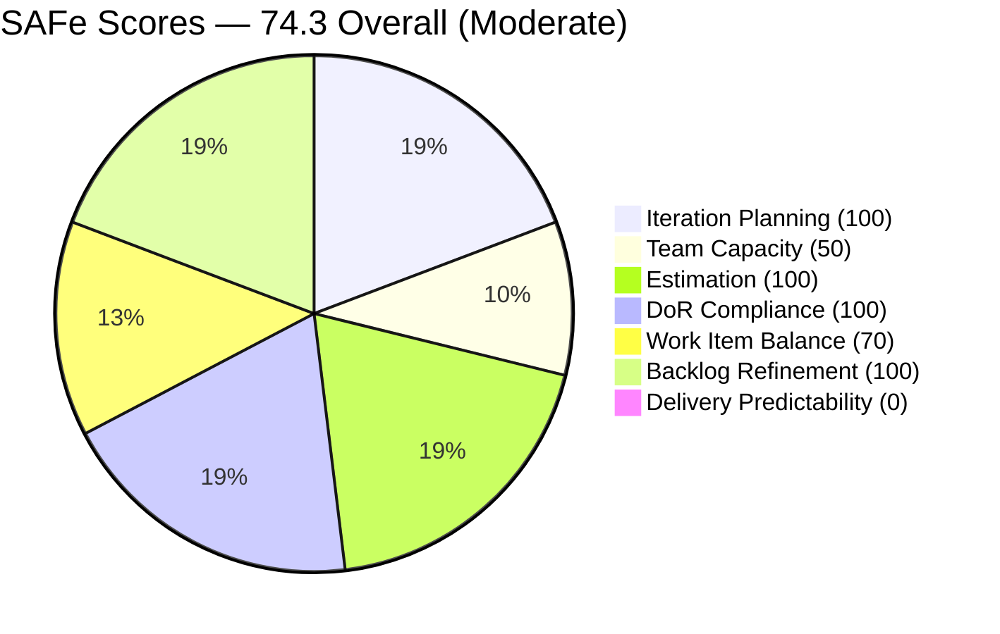

# SAFe Iteration Audit — HR Recruitment Team

## 1. Audit Metadata

| Field | Value |
|-------|-------|
| **Project** | Jairosoft FINOPS |
| **Project ID** | `e0bb302f-40f9-46c3-8164-6f1acb317d63` |
| **Team** | Human Resource Recruitment Team |
| **Team ID** | `248f59a6-372c-4b74-8129-9eaf260f211e` |
| **Workspace** | `ado_hr` |
| **Iteration** | Iteration 7.6 (IP) — Innovation & Planning |
| **Iteration ID** | `bebf6f83-a342-42a2-bad7-a16951231732` |
| **Iteration Dates** | 2026-06-15 to 2026-06-28 |
| **Audit Date** | 2026-06-21 (Day 7 of 14) — Philippine Standard Time (PST, UTC+8) |
| **Prior Audit Reference** | `AUDIT_20260620_0915.md` — Score 74.3 / Moderate |
| **Overall Score** | **74.3 / 100** |
| **Risk Band** | MODERATE (Yellow) |

---

## 2. Executive Summary

The HR Recruitment Team holds at **74.3 (Moderate)** on Day 7 of Iteration 7.6 (IP) — unchanged for the **third consecutive day**. The score remains stable because no ADO changes occurred between June 20 and June 21. All 26 items remain in the same states; no items have been closed; no capacity changes have been made.

**Day 7 of 14 is the midpoint of the sprint.** With exactly 7 days remaining and 37 SP committed but 0 delivered, the team has now consumed half the sprint window with zero output. The mathematical requirement is now 5.3 SP/day for the remaining 7 days — exceeding Almera's configured 5 pts/day capacity. If no closures begin today, full delivery becomes mathematically impossible with the current single-contributor capacity.

Three structural issues continue to suppress the score: (1) Mark Colina's capacity remains unconfigured — now Day 7, (2) Delivery Predictability = 0.0 is now a critical delivery failure signal at sprint midpoint, and (3) Work Item Balance carries a persistent -30 penalty from User Story over-concentration. Items 1 and 3 have straightforward fixes; item 2 requires actual work closure.

---

## 3. Previous Audit Delta

| Dimension | Prior (2026-06-20) | Current (2026-06-21) | Delta | Note |
|-----------|---------------------|----------------------|-------|------|
| Iteration Planning | 100.0 | 100.0 | 0.0 | 26/26 backlog items in 7.6 IP — no change |
| Team Capacity | 50.0 | 50.0 | 0.0 | Mark Colina still unconfigured — Day 7 |
| Estimation | 100.0 | 100.0 | 0.0 | 26/26 estimated — unchanged |
| DoR Compliance | 100.0 | 100.0 | 0.0 | 26/26 pass — unchanged |
| Work Item Balance | 70.0 | 70.0 | 0.0 | 25/26 US = 96.2% — penalty unchanged |
| Backlog Refinement | 100.0 | 100.0 | 0.0 | All 26 items fresh; no stale — unchanged |
| Delivery Predictability | 0.0 | 0.0 | 0.0 | 0/37 SP closed — **Sprint midpoint: critical** |
| **Overall** | **74.3** | **74.3** | **0.0** | Moderate Risk — third consecutive flat day |

**Key developments today:**
- No ADO changes detected between June 20 and June 21. All 26 items remain in identical states.
- **Midpoint alert:** Day 7 marks the sprint midpoint. Zero delivery at the midpoint is a critical delivery risk signal. Almera's 5 pts/day capacity is now insufficient to close 37 SP in 7 remaining days (requires 5.3 SP/day).

**Persistent issues (escalation level):**
- Mark Colina capacity gap — Day 7, seventh consecutive day unresolved.
- 0 SP burned — 7 of 14 days consumed with zero delivery.
- No iteration goal defined — 19+ consecutive audits.
- No PI objectives linked.

---

## 4. Current Iteration Snapshot

| Field | Value |
|-------|-------|
| **Iteration** | 7.6 (IP) — Innovation & Planning |
| **Start Date** | 2026-06-15 |
| **End Date** | 2026-06-28 |
| **Day in Sprint** | Day 7 of 14 (Sprint Midpoint) |
| **Days Remaining** | 7 |
| **Total Visible Root Backlog Items** | 26 |
| **Root Items in Current Iteration** | 26 |
| **User Stories** | 25 |
| **Spikes** | 1 |
| **Story Points Committed** | 37 SP (26/26 estimated) |
| **Story Points Closed** | 0 SP |
| **Required Burn Rate** | 5.3 SP/day (exceeds configured capacity of 5 pts/day) |
| **Active Contributors** | 2 (Almera Kleer Tayao, Mark Colina) |
| **Configured Capacity** | 5 pts/day (Almera only; Mark: not configured; Grace: 0) |
| **Iteration Goal** | Not defined |

### Contributor Summary

| Contributor | Items in 7.6 IP | SP Assigned | SP Closed | Configured Capacity |
|-------------|-----------------|-------------|-----------|---------------------|
| Almera Kleer Tayao | 25 | 36 SP | 0 SP | 5 pts/day (Documentation: 3, Requirements: 2) |
| Mark Colina | 1 | 1 SP | 0 SP | **Not configured — Day 7** |
| Grace | 0 | — | — | 0 pts/day |

---

## 5. Work Item Analysis

### 5.1 Open Items by State (All 26 items, 37 SP)

| State | Count | Key Items | SP |
|-------|-------|-----------|-----|
| New | 15 | 14 Japan Visa series (206892–206907) + 206583 (Drug-testing) | 15 SP |
| Ready | 6 | 206005 (Karl), 206402 (Ressa), 206570 (Bon), 206571 (Attendance Incentives), 206575 (Budget Roadmap), 206579 (Benchmark Analysis) | 12 SP |
| Active | 5 | 206553 (Cindy), 206401 (Jerlyn), 206562 (Mary), 206593 (Luzmibel), 206004 (Research Spike) | 10 SP |

### 5.2 Thematic Clusters

| Cluster | Items | SP | Lead | State |
|---------|-------|-----|------|-------|
| Japan Visa Document Series | 14 | 14 SP | Almera | All New |
| AI Role Transition Frameworks | 7 | 14 SP | Almera | Active (4) / Ready (3) |
| Attendance Incentive Series | 3 | 6 SP | Almera | All Ready |
| Research Spike (JP Framework) | 1 | 2 SP | Almera | Active |
| Drug-Testing Clinic Canvass | 1 | 1 SP | Mark Colina | New |

### 5.3 DoR Assessment

All 26 items carry user-voice narratives ("As the HR PO, I want to...") and structured acceptance criteria. Japan Visa series items have compact but valid ACs ("Submitted to the agency for visa processing." ≥ 20 chars). AI Role Transition and Attendance items carry multi-point ACs well above threshold. DoR = 26/26 = **100%**.

### 5.4 Midpoint Delivery Risk Calculation

| Scenario | SP Deliverable | Delivery % | Condition |
|----------|---------------|------------|-----------|
| Best case (all 4 AI Active close + Spike) | 10 SP | 27.0% | If Active items close by Day 8 |
| Realistic (Active + Ready, excl. Japan Visa) | 22 SP | 59.5% | If Japan Visa de-committed |
| Full delivery | 37 SP | 100.0% | Requires 5.3 SP/day — exceeds configured capacity |

The Japan Visa series (14 items, 14 SP) is the key constraint: if these cannot close before June 28, full delivery is unattainable even at maximum configured capacity.

---

## 6. SAFe Compliance Scorecard

| Dimension | Score | Evidence | Notes |
|-----------|-------|----------|-------|
| Iteration Planning | **100.0** | 26/26 visible backlog items in Iteration 7.6 IP | Full sprint focus — no floating items |
| Team Capacity | **50.0** | 1/2 contributors with configured capacity | Mark Colina unconfigured Day 7; Grace = 0 (structural) |
| Estimation | **100.0** | 26/26 point-eligible items have SP > 0 | 14 items at 1 SP; 11 items at 2 SP; 1 Spike at 2 SP |
| DoR Compliance | **100.0** | 26/26 items pass desc ≥ 30 + AC ≥ 20 chars | All Japan Visa items pass compact but valid AC threshold |
| Work Item Balance | **70.0** | -30: US dominance 25/26 = 96.2% > 60% threshold | 1 Spike; no -40 (has US); no -20 (spike = 3.8% < 40%) |
| Backlog Refinement | **100.0** | 26/26 fresh (all changed Jun 15–18); 0 stale; 0 untouched | No penalties — full score |
| Delivery Predictability | **0.0** | 0/37 SP closed; Day 7 of 14 — **sprint midpoint** | Critical delivery failure signal at midpoint |
| **Overall** | **74.3** | (100+50+100+100+70+100+0)/7 = 520/7 = 74.3 | Moderate Risk (Yellow) |

---

## 7. Dimension Findings

### 7.1 Iteration Planning — 100.0 (Strong)
All 26 items remain assigned to Iteration 7.6 (IP). Sprint focus is perfect. No items are stranded in past iterations or orphaned at the backlog root. The Japan Visa series (added Day 4) continues to be fully contained within the current sprint window.

### 7.2 Team Capacity — 50.0 (Moderate Risk — Day 7 Escalation)
Mark Colina remains unconfigured in ADO capacity for the **seventh consecutive day**. His item (206583 — Drug-Testing Clinic Canvass, 1 SP, New) remains unstarted. Configuring Mark's capacity is a 30-second fix that raises Team Capacity from 50.0 to 100.0 (Mark and Almera both configured; Grace has items = 0, not in contributors_with_current_work). This issue has persisted across 7 audit cycles without resolution.

### 7.3 Estimation — 100.0 (Strong)
All 26 items carry Story Points. Japan Visa series: 14 items × 1 SP each (appropriate for document-sourcing tasks). AI Role Transition and Attendance: 2 SP each. Spike: 2 SP. Estimation is complete and well-calibrated.

### 7.4 DoR Compliance — 100.0 (Strong)
All 26 items pass both description (≥ 30 non-whitespace chars) and acceptance criteria (≥ 20 non-whitespace chars). Japan Visa items have minimalist ACs ("Submitted to the agency for visa processing.") which are valid at 42+ non-whitespace chars. Fourth consecutive day at 100% DoR — sustained intake quality.

### 7.5 Work Item Balance — 70.0 (Moderate)
User Stories = 25/26 = 96.2%, triggering the -30 dominant-type penalty. The IP sprint context is unusual in that nearly all work is User Stories rather than Spikes/research tasks. The Japan Visa series (14 User Stories) could be modeled more efficiently as Tasks under a single parent User Story, which would reduce the US count and improve type diversity.

### 7.6 Backlog Refinement — 100.0 (Strong)
All 26 items were created or updated between June 15–18, well within the 45-day freshness window. No items are stale at any threshold. Untouched count (ChangedDate before June 15): 0 items → 0% → no penalty. Full score maintained.

### 7.7 Delivery Predictability — 0.0 (CRITICAL — Sprint Midpoint)
**Zero Story Points delivered at the sprint midpoint.** With 7 days remaining and 37 SP committed, the required burn rate of 5.3 SP/day exceeds Almera's configured capacity of 5 pts/day. This means full delivery is mathematically impossible without either (a) de-committing scope or (b) Mark Colina contributing meaningful velocity.

The four Active items (206553 Cindy, 206401 Jerlyn, 206562 Mary, 206593 Luzmibel — 8 SP total) are the most ready to close and must be the first target today. If the AI Role Transition frameworks for these four individuals are drafted and peer-reviewed, they should be closed immediately.

---

## 8. Risks and Bottlenecks

| Risk | Severity | Status |
|------|----------|--------|
| 0 SP at sprint midpoint — full delivery now mathematically requires >configured capacity | **Critical** | Immediate action required |
| Mark Colina capacity not configured — Day 7, seventh consecutive audit | High | Fix today |
| Bus factor = 1 (Almera carries 25/26 items, 36 SP) | High | Structural |
| Japan Visa series (14 items, 14 SP) depends on external agency timeline | High | Assess agency status today |
| Required burn rate (5.3/day) exceeds configured capacity (5/day) | High | De-commit or configure Mark |
| No iteration goal defined (19+ consecutive audits) | Moderate | Persistent |
| No PI objectives linked | Moderate | Persistent |
| User Story over-concentration (96.2%) | Moderate | Structural for this sprint |

---

## 9. Prioritized Recommendations

1. **[TODAY — Day 7, URGENT] Close AI Role Transition Active items** — Items 206553 (Cindy), 206401 (Jerlyn), 206562 (Mary), and 206593 (Luzmibel) are in Active state. If the role transition frameworks are drafted, close all 4 today (8 SP). This delivers 8/37 = 21.6% and establishes velocity. Also close Research Spike 206004 if JP's workflow mapping deliverable is complete (2 SP). Combined: 10 SP in one day = Delivery Predictability lifts to 27.0%.

2. **[TODAY — Day 7, URGENT] Triage Japan Visa series** — With 7 days remaining, determine whether the Japan visa agency can process all 14 document items by June 28. If the agency timeline extends beyond this sprint, de-commit all 14 items to PI8 immediately. This reduces committed SP from 37 to 23, making full delivery achievable at 23 SP / 7 days = 3.3 SP/day (within Almera's capacity).

3. **[TODAY — Day 7] Configure Mark Colina's capacity** — Seven days unresolved. Open Iteration 7.6 (IP) capacity settings, add Mark with his daily capacity. This raises Team Capacity from 50.0 to 100.0 in 30 seconds.

4. **[TODAY — Day 7] Define the iteration goal** — Write one sentence: "Deliver AI-Augmented role transition frameworks for 7 team members, complete Japan Visa document sourcing for Jove, and finalize attendance incentive proposals." This has been absent for 19+ consecutive audits.

5. **[THIS WEEK] Close Ready items in sequence** — After Active closures, move to Ready items: 206005 (Karl), 206402 (Ressa), 206570 (Bon) — 3 AI Role Transition items, 6 SP. Then Attendance Incentive series: 206571, 206575, 206579 — 3 items, 6 SP. These 6 items represent 12 SP that can be closed before end of week if work is complete.

---

## 10. Evidence Gaps and Limitations

- **Mark Colina capacity** — Confirmed absent from the ADO capacity API. Only Almera (5 pts/day) and Grace (0 pts/day) are in the capacity settings. Not an inference.
- **Japan Visa external dependency** — Whether items 206892–206907 can close by June 28 depends on the Japan visa agency's processing timeline. This is not visible in ADO.
- **No PI Objectives API** — PI objectives linkage cannot be directly queried via available MCP tools.
- **Grace's role** — Grace has 0 configured capacity and 0 items in the current iteration. She does not appear in `contributors_with_current_work` and is excluded from Team Capacity calculation.
- **Delivery Predictability denominator** — committed_story_points = 37 (all 26 items estimated with SP > 0). closed_story_points = 0 (no items in Closed or Done state).

---

## Visualization

### Score Trend — Sprint 7.6 (IP), Days 1–7

### Work Item State Distribution (26 items)

### Sprint Burn Requirement vs. Configured Capacity

### SAFe Dimension Scores — Jun 21

