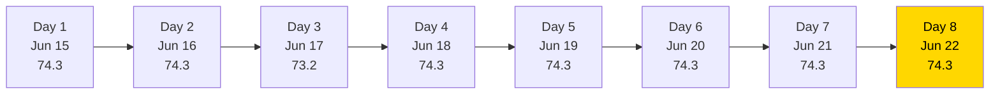
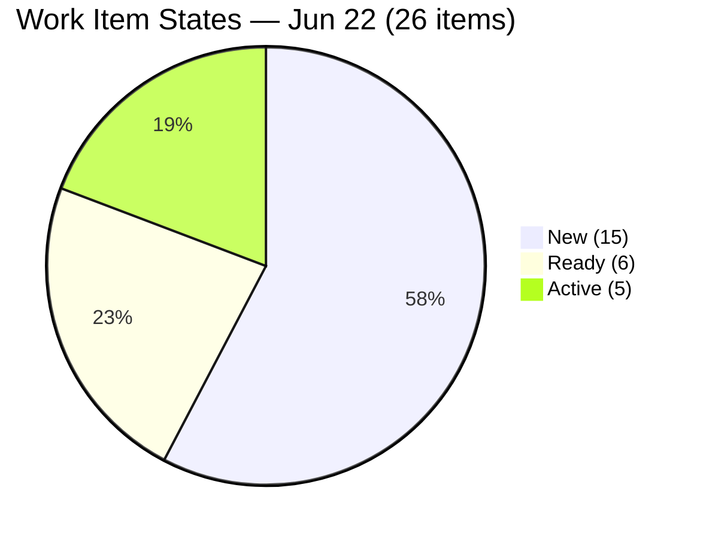
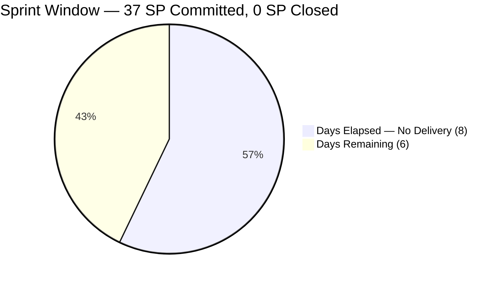
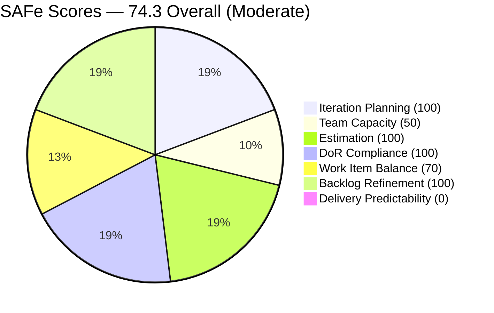

# SAFe Iteration Audit — HR Recruitment Team

## 1. Audit Metadata

| Field | Value |
|-------|-------|
| **Project** | Jairosoft FINOPS |
| **Project ID** | `e0bb302f-40f9-46c3-8164-6f1acb317d63` |
| **Team** | Human Resource Recruitment Team |
| **Team ID** | `248f59a6-372c-4b74-8129-9eaf260f211e` |
| **Workspace** | `ado_hr` |
| **Iteration** | Iteration 7.6 (IP) — Innovation & Planning |
| **Iteration ID** | `bebf6f83-a342-42a2-bad7-a16951231732` |
| **Iteration Dates** | 2026-06-15 to 2026-06-28 |
| **Audit Date** | 2026-06-22 (Day 8 of 14) — Philippine Standard Time (PST, UTC+8) |
| **Prior Audit Reference** | `AUDIT_20260621_0915.md` — Score 74.3 / Moderate |
| **Overall Score** | **74.3 / 100** |
| **Risk Band** | MODERATE (Yellow) |

---

## 2. Executive Summary

The HR Recruitment Team remains at **74.3 (Moderate)** on Day 8 of Iteration 7.6 (IP) — flat for the **fourth consecutive day** and the eighth consecutive day with zero Story Points delivered. No ADO changes were detected between June 21 and June 22: all 26 items remain in identical states, no items have been closed, and no capacity changes have been made.

**Day 8 of 14 is now critical.** With 6 days remaining and 37 SP committed but 0 delivered, the required burn rate has increased to 6.2 SP/day — exceeding Almera's configured 5 pts/day capacity by 24%. Full delivery is no longer mathematically possible at configured capacity without either de-committing scope or engaging Mark Colina as a meaningful contributor.

The scorecard is held down by two fixable issues (Mark Colina's unconfigured capacity, raising Team Capacity from 50.0 to 100.0) and one structural delivery failure (Delivery Predictability = 0.0, Day 8). The Japan Visa series (14 items, 14 SP) remains the primary risk: these items depend on an external agency timeline and may not be closeable within the sprint window.

---

## 3. Previous Audit Delta

| Dimension | Prior (2026-06-21) | Current (2026-06-22) | Delta | Note |
|-----------|---------------------|----------------------|-------|------|
| Iteration Planning | 100.0 | 100.0 | 0.0 | 26/26 backlog items in 7.6 IP — unchanged |
| Team Capacity | 50.0 | 50.0 | 0.0 | Mark Colina still unconfigured — Day 8 |
| Estimation | 100.0 | 100.0 | 0.0 | 26/26 estimated — unchanged |
| DoR Compliance | 100.0 | 100.0 | 0.0 | 26/26 pass — unchanged |
| Work Item Balance | 70.0 | 70.0 | 0.0 | US dominance 25/26 = 96.2% — unchanged |
| Backlog Refinement | 100.0 | 100.0 | 0.0 | All 26 fresh; 0 stale; 0 untouched — unchanged |
| Delivery Predictability | 0.0 | 0.0 | 0.0 | 0/37 SP closed — **Day 8: Critical** |
| **Overall** | **74.3** | **74.3** | **0.0** | Moderate Risk — fourth consecutive flat day |

**Key observations today:**
- No ADO changes detected between June 21 and June 22. All 26 items remain in identical states (New=15, Ready=6, Active=5).
- **Day 8 escalation:** The sprint has now consumed 57% of available time with 0% delivery. Required burn rate = 37 SP / 6 remaining days = 6.2 SP/day, exceeding Almera's configured 5 pts/day by 24%.
- Japan Visa series (14 items, 14 SP) status unknown — external agency dependency unresolved.

**Persistent issues (now critical):**
- Mark Colina capacity gap — Day 8, eighth consecutive day unresolved.
- 0 SP burned — 8 of 14 days consumed with zero delivery.
- No iteration goal defined — 20+ consecutive audits.
- No PI objectives linked.

---

## 4. Current Iteration Snapshot

| Field | Value |
|-------|-------|
| **Iteration** | 7.6 (IP) — Innovation & Planning |
| **Start Date** | 2026-06-15 |
| **End Date** | 2026-06-28 |
| **Day in Sprint** | Day 8 of 14 |
| **Days Remaining** | 6 |
| **Total Visible Root Backlog Items** | 26 |
| **Root Items in Current Iteration** | 26 |
| **User Stories** | 25 |
| **Spikes** | 1 |
| **Story Points Committed** | 37 SP (26/26 estimated) |
| **Story Points Closed** | 0 SP |
| **Required Burn Rate** | 6.2 SP/day (exceeds configured capacity of 5 pts/day) |
| **Active Contributors** | 2 (Almera Kleer Tayao, Mark Colina) |
| **Configured Capacity** | 5 pts/day (Almera only; Mark: not configured; Grace: 0) |
| **Iteration Goal** | Not defined |

### Contributor Summary

| Contributor | Items in 7.6 IP | SP Assigned | SP Closed | Configured Capacity |
|-------------|-----------------|-------------|-----------|---------------------|
| Almera Kleer Tayao | 25 | 36 SP | 0 SP | 5 pts/day (Documentation: 3, Requirements: 2) |
| Mark Colina | 1 | 1 SP | 0 SP | **Not configured — Day 8** |
| Grace | 0 | — | — | 0 pts/day |

---

## 5. Work Item Analysis

### 5.1 Current Items by State (All 26 items, 37 SP)

| State | Count | Items (IDs) | SP |
|-------|-------|-------------|-----|
| New | 15 | 206892–206907 (Japan Visa: 14×1 SP) + 206583 (Drug-testing: 1 SP) | 15 SP |
| Ready | 6 | 206005 (Karl), 206402 (Ressa), 206570 (Bon), 206571 (Attendance Incentives), 206575 (Budget Roadmap), 206579 (Benchmark Analysis) | 12 SP |
| Active | 5 | 206553 (Cindy), 206401 (Jerlyn), 206562 (Mary), 206593 (Luzmibel), 206004 (Research Spike) | 10 SP |

### 5.2 Thematic Clusters

| Cluster | Items | SP | Lead | State |
|---------|-------|-----|------|-------|
| Japan Visa Document Series | 14 | 14 SP | Almera | All New |
| AI Role Transition Frameworks | 7 | 14 SP | Almera | Active (4) / Ready (3) |
| Attendance Incentive Series | 3 | 6 SP | Almera | All Ready |
| Research Spike (JP Framework) | 1 | 2 SP | Almera | Active |
| Drug-Testing Clinic Canvass | 1 | 1 SP | Mark Colina | New |

### 5.3 DoR Assessment

All 26 items carry user-voice narratives ("As the HR PO/Officer, I want to...") and structured acceptance criteria. Japan Visa items have compact but valid ACs ("Submitted to the agency for visa processing." = 42+ non-whitespace chars). AI Role Transition and Attendance items carry multi-point ACs well above threshold. DoR = 26/26 = **100%**.

### 5.4 Delivery Risk Calculation (Day 8)

| Scenario | SP Deliverable | Delivery % | Condition |
|----------|---------------|------------|-----------|
| Best case — Active items + Spike close first | 10 SP | 27.0% | All 5 Active items close by Day 9 |
| Realistic — Active + Ready (excl. Japan Visa) | 22 SP | 59.5% | Japan Visa de-committed; all non-visa close |
| Full delivery | 37 SP | 100.0% | Requires 6.2 SP/day — mathematically impossible at 5/day |

Required burn rate (6.2 SP/day) now exceeds configured capacity (5 pts/day). Full delivery without scope de-commitment or Mark Colina activation is not achievable.

---

## 6. SAFe Compliance Scorecard

| Dimension | Score | Evidence | Notes |
|-----------|-------|----------|-------|
| Iteration Planning | **100.0** | 26/26 visible backlog items in Iteration 7.6 IP | Full sprint focus — no floating items |
| Team Capacity | **50.0** | 1/2 contributors with configured capacity | Mark Colina unconfigured Day 8; Grace = 0 (structural) |
| Estimation | **100.0** | 26/26 point-eligible items have SP > 0 | 14 items at 1 SP; 11 items at 2 SP; 1 Spike at 2 SP |
| DoR Compliance | **100.0** | 26/26 items pass desc ≥ 30 + AC ≥ 20 chars | Compact Japan Visa ACs valid; AI Role ACs detailed |
| Work Item Balance | **70.0** | -30: US dominance 25/26 = 96.2% > 60% threshold | 1 Spike; no -40 (has US); no -20 (spike = 3.8% < 40%) |
| Backlog Refinement | **100.0** | 26/26 fresh (all changed Jun 15–18); 0 stale; 0 untouched | No penalties — full score |
| Delivery Predictability | **0.0** | 0/37 SP closed; Day 8 of 14 — **Critical** | Zero delivery in 8 days; 6 days remain |
| **Overall** | **74.3** | (100+50+100+100+70+100+0)/7 = 520/7 = 74.3 | Moderate Risk (Yellow) |

---

## 7. Dimension Findings

### 7.1 Iteration Planning — 100.0 (Strong)
All 26 items remain assigned to Iteration 7.6 (IP). Sprint focus is perfect. No items are stranded in past iterations or orphaned at the backlog root.

### 7.2 Team Capacity — 50.0 (High Risk — Day 8 Escalation)
Mark Colina remains unconfigured in ADO capacity for the **eighth consecutive day**. His item (206583 — Drug-Testing Clinic Canvass, 1 SP, New) remains unstarted. Configuring Mark's capacity is a 30-second fix that raises Team Capacity from 50.0 to 100.0. This issue has persisted across 8 audit cycles without resolution — it should be treated as a process failure requiring PO escalation.

### 7.3 Estimation — 100.0 (Strong)
All 26 items carry Story Points. Japan Visa series: 14 items × 1 SP each. AI Role Transition and Attendance: 2 SP each. Spike: 2 SP. Estimation is complete and well-calibrated.

### 7.4 DoR Compliance — 100.0 (Strong)
All 26 items pass both description (≥ 30 non-whitespace chars) and acceptance criteria (≥ 20 non-whitespace chars). Fifth consecutive day at 100% DoR — sustained intake quality.

### 7.5 Work Item Balance — 70.0 (Moderate)
User Stories = 25/26 = 96.2%, triggering the -30 dominant-type penalty. The IP sprint context is unusual in that nearly all work is User Stories rather than innovation Spikes/research tasks. The Japan Visa series (14 User Stories) could be modeled more efficiently as Tasks under a single parent User Story, which would reduce the US count and improve type diversity.

### 7.6 Backlog Refinement — 100.0 (Strong)
All 26 items were created or updated between June 15–18, well within the 45-day freshness window. No items exceed any stale threshold. Zero untouched items (ChangedDate before iteration start June 15). Full score maintained — excellent backlog hygiene.

### 7.7 Delivery Predictability — 0.0 (CRITICAL — Day 8)
**Zero Story Points delivered at Day 8 of 14.** The required burn rate of 6.2 SP/day now exceeds Almera's configured capacity of 5 pts/day. The mathematical case for full delivery has closed. The team must prioritize immediate closures starting today.

The four Active items (206553 Cindy, 206401 Jerlyn, 206562 Mary, 206593 Luzmibel — 8 SP total) remain the most actionable. If these AI Role Transition frameworks are drafted and peer-reviewed, they should be closed immediately. The Research Spike (206004, 2 SP, Active) should close alongside these if JP's workflow mapping is complete.

---

## 8. Risks and Bottlenecks

| Risk | Severity | Status |
|------|----------|--------|
| 0 SP at Day 8 — full delivery requires >configured capacity | **Critical** | Immediate PO action required |
| Required burn rate (6.2 SP/day) now exceeds configured capacity (5 pts/day) | **Critical** | De-commit scope or activate Mark |
| Mark Colina capacity not configured — Day 8, eighth consecutive audit | High | Fix today — 8 consecutive misses |
| Japan Visa series (14 items, 14 SP) — external agency dependency | High | Assess agency status and de-commit if needed |
| Bus factor = 1 (Almera carries 25/26 items, 36 SP) | High | Structural |
| No iteration goal defined (20+ consecutive audits) | Moderate | Persistent |
| No PI objectives linked | Moderate | Persistent |
| User Story over-concentration (96.2%) | Moderate | Structural for this sprint |

---

## 9. Prioritized Recommendations

1. **[TODAY — Day 8, URGENT] Close AI Role Transition Active items** — Items 206553 (Cindy), 206401 (Jerlyn), 206562 (Mary), and 206593 (Luzmibel) are in Active state with complete DoR. If the role transition frameworks are drafted, close all 4 today (8 SP). Also close Research Spike 206004 if JP's workflow mapping deliverable is complete (2 SP). Combined: 10 SP in one day lifts Delivery Predictability to 27.0%.

2. **[TODAY — Day 8, URGENT] Triage Japan Visa series — De-commit if agency cannot deliver by June 28** — Contact the Japan visa agency today. If the 14 visa documents (14 SP) cannot be sourced and submitted by June 28, de-commit all 14 items to PI8 immediately. Removing 14 SP from scope reduces the required burn rate from 6.2 to 3.8 SP/day — achievable within Almera's capacity.

3. **[TODAY — Day 8] Configure Mark Colina's capacity** — Eight days unresolved. Open Iteration 7.6 (IP) capacity settings, add Mark with his daily capacity. This raises Team Capacity from 50.0 to 100.0. Have Mark begin work on 206583 (Drug-Testing Clinic Canvass, 1 SP) today.

4. **[TODAY — Day 8] Define the iteration goal** — Write one sentence in ADO: "Deliver AI-Augmented role transition frameworks for 7 team members, complete Japan Visa document sourcing for Jove (if feasible), and finalize attendance incentive proposals." This has been absent for 20+ consecutive audits.

5. **[TODAY — Day 8] Close Ready items immediately after Active** — After Active closures, move to Ready items: 206005 (Karl), 206402 (Ressa), 206570 (Bon) — 6 SP. Then Attendance Incentive series: 206571, 206575, 206579 — 6 SP. These 6 items represent 12 SP achievable by Day 10 at Almera's pace.

---

## 10. Evidence Gaps and Limitations

- **Mark Colina capacity** — Confirmed absent from ADO capacity API. Only Almera (5 pts/day) and Grace (0 pts/day) are in capacity settings. Not an inference.
- **Japan Visa external dependency** — Whether items 206892–206907 can close by June 28 depends on the Japan visa agency's processing timeline. Not visible in ADO.
- **No PI Objectives API** — PI objectives linkage cannot be directly queried via available MCP tools.
- **Grace's role** — Grace has 0 configured capacity and 0 items in the current iteration. She does not appear in `contributors_with_current_work` and is excluded from Team Capacity calculation.
- **No ADO changes detected today** — All 26 items confirmed in same states as June 21. ChangedDate data validates this (latest change: June 18 for Japan Visa series; June 17 for most other items).

---

## Visualization

### Score Trend — Sprint 7.6 (IP), Days 1–8

### Work Item State Distribution (26 items)

### Sprint Burn Window — Day 8 of 14

### SAFe Dimension Scores — Jun 22

