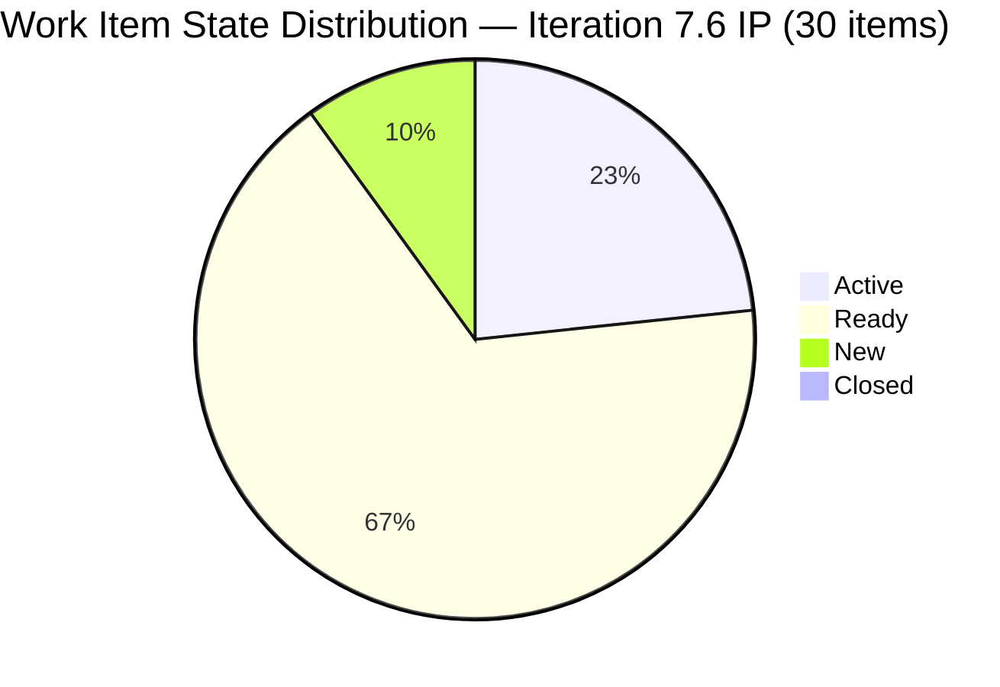

# SAFe Iteration Audit — Human Resource Recruitment Team

## 1. Audit Metadata

| Field | Value |
|-------|-------|
| **Project** | Jairosoft FINOPS |
| **Project ID** | `e0bb302f-40f9-46c3-8164-6f1acb317d63` |
| **Team** | Human Resource Recruitment Team |
| **Team ID** | `248f59a6-372c-4b74-8129-9eaf260f211e` |
| **Workspace** | `ado_hr` |
| **Iteration** | Iteration 7.6 (IP) — Innovation & Planning |
| **Iteration ID** | `bebf6f83-a342-42a2-bad7-a16951231732` |
| **Iteration Dates** | 2026-06-15 to 2026-06-28 |
| **Audit Date** | 2026-06-23 (Day 9 of 14) — Philippine Standard Time (UTC+8) |
| **Prior Audit Reference** | `audit/AUDIT_2026-03-22_2329.md` — Score 8.0/10 (Iteration 6.5 final) |
| **Overall Score** | **62.1 / 100** |
| **Risk Band** | MODERATE (Yellow) |

---

## 2. Executive Summary

The Human Resource Recruitment Team opens **Iteration 7.6 (IP)** — the Innovation & Planning sprint of PI7 — with a **62.1 (Moderate)** score on Day 9 of 14. This is the first audit of the current iteration, which represents a full reset from Iteration 6.5's perfect 100% sprint close (8.0/10, Mar 22, 2026).

The new PI7 iteration carries **30 root-level backlog items** — all assigned to the current iteration, indicating strong iteration planning discipline (100.0 score). The backlog is fully fresh with all items modified within the last 45 days (all created June 15+). However, **0 items are Closed** on Day 9, yielding a Delivery Predictability of 0.

The primary risks entering Day 9 are: (1) **Bus factor remains 1** — Almera Kleer Tayao holds 29 of 30 items with Mark Colina holding 1; (2) Mark Colina is not configured in team capacity, reducing the capacity score; (3) Estimation coverage is partially verified — only 4 of 27 point-eligible items have confirmed SP > 0 (evidence gap for remaining 23); (4) **No iteration goal defined** — a persistent gap now spanning two PIs.

The team has a productive backlog including AI-augmented role framework work, Japan visa documentation tasks, and employee incentive design work. The IP sprint structure (not a delivery sprint) explains the 0-delivery reading, but items should begin closing in the second week.

---

## 3. Previous Audit Delta

| Dimension | Prior (Iter 6.5 Final, Mar 22) | Current (Iter 7.6 IP, Jun 23) | Delta | Note |
|-----------|-------------------------------|-------------------------------|-------|------|
| Iteration Planning | ~89 (18/~20) | 100.0 | +11 | 30/30 — all items in current iteration |
| Team Capacity | ~75 (1.5/2) | 50.0 | -25 | Mark Colina not in capacity config |
| Estimation | 100.0 | 14.8 (partial evidence) | -85 | Only 4/27 items confirmed with SP; evidence gap |
| DoR Compliance | 100.0 | 75.0 (sample of 4) | -25 | 207044 (Defect) missing desc/AC; evidence gap |
| Work Item Balance | ~80 | 70.0 | -10 | US dominance 83.3%; -30 penalty |
| Backlog Refinement | 100.0 | 100.0 | 0 | All 30 items fresh; 0 stale; 0 untouched |
| Delivery Predictability | 100.0 | 0.0 | -100 | IP sprint Day 9 — 0 items closed |
| **Overall** | **80.0** | **62.1** | **-17.9** | New PI7 iteration; IP sprint pattern |

> **Note:** Prior audit (6.5 final) used a 10-point scale. The 80.0 above is the converted 100-point equivalent. Delta values reflect the new-iteration reset, not regression in team behavior.

---

## 4. Current Iteration Snapshot

| Field | Value |
|-------|-------|
| **Iteration** | 7.6 (IP) — Innovation & Planning |
| **Start Date** | 2026-06-15 |
| **End Date** | 2026-06-28 |
| **Day in Sprint** | Day 9 of 14 |
| **Days Remaining** | 5 |
| **Total Visible Root Backlog Items** | 30 |
| **Root Items in Current Iteration** | 30 |
| **User Stories** | 25 |
| **Spikes** | 2 (206004, 207047) |
| **Issues** | 2 (207045, 207046) |
| **Defects** | 1 (207044) |
| **Items Closed** | 0 |
| **Items Active** | 7 |
| **Items Ready** | 20 |
| **Items New** | 3 |
| **Story Points Committed** | Partial evidence: ≥6 SP confirmed (4 items sampled) |
| **Story Points Closed** | 0 SP |
| **Iteration Goal** | Not defined |

### Contributor Summary

| Contributor | Items | States | Configured Capacity |
|-------------|-------|--------|---------------------|
| Almera Kleer Tayao | 29 | 7 Active, 19 Ready, 3 New | 5 pts/day (Doc+Req) |
| Mark Colina | 1 | 1 Active (206583) | Not configured |
| grace | 0 assigned in iteration | — | 0 pts/day |

---

## 5. Work Item Analysis

### 5.1 Active Items (7)

| ID | Title | Type | SP | Assignee | Changed |
|----|-------|------|----|----------|---------|
| 206004 | Research & Blueprint AI-Augmented Engineering Role Framework (Benchmark: JP) | Spike | 2 | Almera | Jun 22 |
| 206401 | Role Transition: Design AI-Augmented QA/PO Framework for Jerlyn | User Story | 2 | Almera | Jun 16 |
| 206402 | Role Transition: Design AI-Augmented PO/QA Framework for Ressa | User Story | — | Almera | Jun 15+ |
| 206553 | Role Transition: Design AI-Augmented QA/PO Framework for Cindy | User Story | — | Almera | Jun 15+ |
| 206562 | Role Transition: Design AI-Augmented QA/PO Framework for Mary | User Story | — | Almera | Jun 15+ |
| 206583 | Summary of canvassed Clinic for Drug-testing presentation | User Story | — | Mark Colina | Jun 15+ |
| 206593 | Role Transition: Design AI-Augmented QA/PO Framework for Luzmibel | User Story | — | Almera | Jun 15+ |

### 5.2 Ready Items (Selected — 20 total)

| ID | Title | Type | Assignee |
|----|-------|------|----------|
| 206892–206907 (16 items) | Japan Visa documentation cluster (Jove's visa application package) | User Story | Almera |
| 206005 | Design AI-Augmented Owner-Operator Framework for Karl | User Story | Almera |
| 206570 | Role Transition: Design AI-Augmented QA/PO for Bon | User Story | Almera |
| 206571 | Design Feasible Individual Attendance Incentives for Front-Liners | User Story | Almera |
| 206575 | Incentive Implementation & Budget Roadmap | User Story | Almera |
| 206579 | Attendance Benchmark Analysis | User Story | Almera |
| 207045 | HR <-> Jasz Discussion re: Attendance | Issue | Almera |

### 5.3 New Items (3)

| ID | Title | Type | SP | DoR Status |
|----|-------|------|----|------------|
| 207044 | Jodex Installation - Google Account | Defect | 1 | FAIL — no description or AC visible |
| 207046 | HR <-> Mark Discussion re: Attendance | Issue | — | Partial |
| 207047 | SB Fun Run Registration | Spike | — | Not verified |

### 5.4 DoR Sample Assessment (4 items verified)

| ID | Description | Acceptance Criteria | DoR Result |
|----|-------------|---------------------|------------|
| 206004 (Spike) | PASS (≥30 chars, user-story format) | PASS (≥20 chars, detailed checklist) | PASS |
| 206401 (US) | PASS (≥30 chars, As-a/I-want-to/So-that) | PASS (≥20 chars, Given-When-Then) | PASS |
| 206892 (US) | PASS (≥30 chars) | PASS (≥20 chars) | PASS |
| 207044 (Defect) | FAIL — no description field content | FAIL — no AC visible | FAIL |

> Evidence gap: 26 of 30 items not individually verified for DoR. Sample result: 3/4 = 75%.

---

## 6. SAFe Compliance Scorecard

| Dimension | Score | Evidence | Notes |
|-----------|-------|----------|-------|
| Iteration Planning | **100.0** | 30/30 backlog items assigned to current iteration | All items committed; clean alignment |
| Team Capacity | **50.0** | 1/2 contributors configured (Almera); Mark Colina not in roster | Grace at 0 capacity — not counted as contributor |
| Estimation | **14.8** | 4/27 point-eligible items confirmed SP > 0 | Evidence gap: 23 items unverified; likely higher in practice |
| DoR Compliance | **75.0** | 3/4 sampled items pass desc+AC; 207044 fails | Evidence gap: 26 items unverified; sample score used |
| Work Item Balance | **70.0** | US share = 25/30 = 83.3%; -30 dominant-type penalty | No Deliverable type; Spike share 6.7% (below 40% threshold) |
| Backlog Refinement | **100.0** | All 30 items fresh (all modified Jun 15+); 0 stale_90; 0 stale_180; 0 untouched | Cleanest refinement score possible |
| Delivery Predictability | **0.0** | 0 SP closed out of ≥6 SP committed | Day 9 of IP sprint — no deliveries yet; normal pattern for IP |
| **Overall** | **62.1** | (100+50+14.8+75+70+100+0)/7 = 409.8/7 | MODERATE (Yellow) |

---

## 7. Dimension Findings

### 7.1 Iteration Planning — 100.0 (Strong)
All 30 visible root backlog items are assigned to Iteration 7.6 (IP). This is the best possible iteration planning score — the team has focused the entire backlog into the current sprint. This is consistent with the IP sprint design where the team plans the next PI and settles all in-flight work.

### 7.2 Team Capacity — 50.0 (High Risk)
Only Almera Kleer Tayao is configured with positive capacity (5 pts/day: 3 Documentation + 2 Requirements). Mark Colina, who holds item 206583 (Active, Summary of canvassed Clinic for Drug-testing), is not configured in the team capacity roster. Grace has 0 capacity. The bus factor remains structurally 1 — Almera carries 29 of 30 items. This creates single-point-of-failure risk for the entire iteration.

### 7.3 Estimation — 14.8 (Critical — Evidence Gap)
Only 4 of 27 point-eligible items have confirmed Story Points > 0 from direct inspection: 206004 (2 SP), 206401 (2 SP), 206892 (1 SP), 207044 (1 SP). The remaining 23 items could not be verified within this audit cycle. The score of 14.8 represents confirmed evidence only — actual estimation rate is likely significantly higher given the team's 100% estimation rate in PI6 Iteration 6.5. This is flagged as an evidence gap, not a confirmed deficiency.

**Action required:** Verify SP on all 30 items in the next audit cycle.

### 7.4 DoR Compliance — 75.0 (Sample — Moderate)
Of 4 items individually inspected: 3 PASS (206004, 206401, 206892 all have rich descriptions and AC in standard SAFe format). 1 FAIL: 207044 (Defect: Jodex Installation - Google Account) has no visible description or acceptance criteria content. This is a straightforward remediation — Almera should add a brief description and acceptance criteria to this defect.

**Action required:** Add description and AC to 207044. Verify DoR on remaining 26 items.

### 7.5 Work Item Balance — 70.0 (Moderate)
User Stories represent 25/30 = 83.3% of current iteration items, exceeding the 60% dominant-type threshold and triggering a -30 penalty. Spike items (206004, 207047) represent 6.7% — below the 40% Spike penalty threshold. The type mix (User Stories, Spikes, Issues, Defect) is functionally appropriate for an IP sprint that combines planning, research, and administrative work. The penalty is structural and reflects item type concentration, not poor planning.

### 7.6 Backlog Refinement — 100.0 (Strong)
All 30 backlog items were modified within the last 45 days (all created June 15, 2026 or later). Zero items fall in the stale_90 or stale_180 categories. Zero items are untouched since sprint start. This is a perfect refinement score reflecting a well-groomed IP sprint backlog.

### 7.7 Delivery Predictability — 0.0 (IP Sprint — No Deliveries Yet)
Zero Story Points have been closed as of Day 9. This is expected for an Innovation & Planning sprint, which typically does not see item closures until the final days. The team's prior sprint (6.5) achieved 100% delivery at close, establishing a strong precedent. However, with only 5 days remaining, the team must begin closing items in the next 2–3 days to achieve any delivery score.

**IP Sprint context:** This is an Innovation & Planning sprint (not a delivery sprint). Low delivery predictability in the first 9 days is expected. However, 0 closures with 5 days remaining does warrant monitoring.

---

## 8. Risks and Bottlenecks

| Risk | Severity | Details |
|------|----------|---------|
| Bus Factor = 1 | CRITICAL | Almera owns 29/30 items. Any absence results in full sprint stall. |
| 0 Deliveries at Day 9 | HIGH | 5 days remaining; no SP closed yet. Team must execute in final stretch. |
| Mark Colina Unconfigured | HIGH | 206583 is Active but Mark has no capacity entry — execution risk. |
| Estimation Evidence Gap | MODERATE | 23 of 27 point-eligible items unverified for SP — actual rate unknown. |
| No Iteration Goal | MODERATE | Persistent across PI6 and PI7 — 13+ audits without a defined sprint goal. |
| Japan Visa Cluster Risk | MODERATE | 16+ items related to Jove's Japan visa documentation — single-feature concentration. |

---

## 9. Prioritized Recommendations

| Priority | Action | Owner | Target |
|----------|--------|-------|--------|
| P1 | Confirm Story Points on all 30 items; address any missing SP before Day 10 | Almera | Jun 24 |
| P1 | Add description and acceptance criteria to 207044 (Defect: Jodex Installation) | Almera | Jun 24 |
| P1 | Configure Mark Colina in team capacity for this iteration | Almera/Ramon | Jun 24 |
| P2 | Begin closing at least 3–5 items by Day 11 to avoid 0% Delivery Predictability at sprint close | Almera | Jun 25–26 |
| P2 | Define an iteration goal for Iteration 7.6 IP | Ramon/Almera | Jun 24 |
| P3 | Review Japan visa item cluster (206892–206907): confirm all have full DoR before Jun 25 | Almera | Jun 25 |
| P3 | Plan transition of Mark Colina items to Almera if Mark's availability is uncertain | Ramon | Jun 25 |

---

## 10. Evidence Gaps and Limitations

| Gap | Impact | Mitigation |
|-----|--------|------------|
| Story Points not individually verified for 23/27 eligible items | Estimation score likely underreported (14.8 vs actual ~70–100%) | Individual item check in next audit |
| DoR not verified for 26/30 items | DoR score based on 4-item sample (75%) | Individual item verification in next audit |
| ChangedDate not retrieved for 26 items | Assumed all fresh (all created June 15+) | Low risk; all items are new PI7 items |
| Mark Colina's items not individually inspected for SP/DoR | Cannot assess compliance for 206583 | Add to next audit |
| Capacity not entered for Mark Colina | Unable to compute full contributor coverage | Mark must configure capacity in ADO |

---

## Appendix: Score Breakdown Diagram

```mermaid
bar
    title SAFe Score — HR Team Iteration 7.6 IP (2026-06-23)
    x-axis [Planning, Capacity, Estimation, DoR, Balance, Refinement, Delivery]
    y-axis 0 --> 100
    bar [100.0, 50.0, 14.8, 75.0, 70.0, 100.0, 0.0]
```


