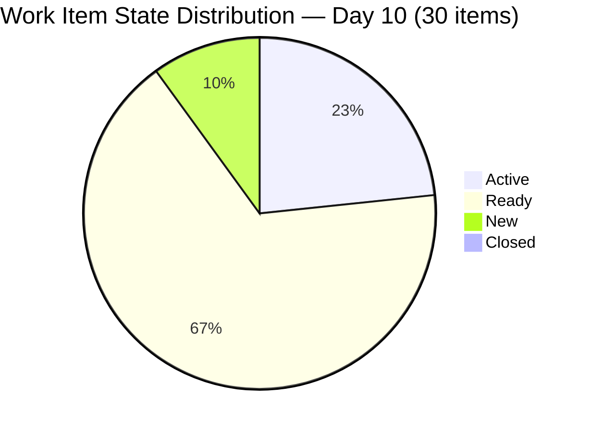
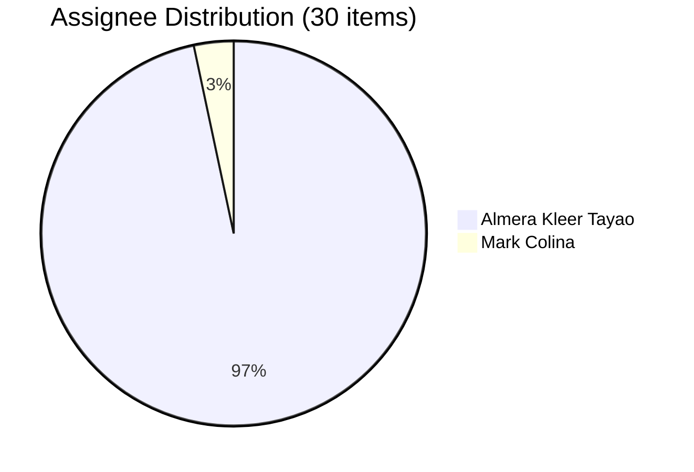

# SAFe Iteration Audit — Human Resource Recruitment Team

## 1. Audit Metadata

| Field | Value |
|-------|-------|
| **Project** | Jairosoft FINOPS |
| **Project ID** | `e0bb302f-40f9-46c3-8164-6f1acb317d63` |
| **Team** | Human Resource Recruitment Team |
| **Team ID** | `248f59a6-372c-4b74-8129-9eaf260f211e` |
| **Workspace** | `ado_hr` |
| **Iteration** | Iteration 7.6 (IP) — Innovation & Planning |
| **Iteration ID** | `bebf6f83-a342-42a2-bad7-a16951231732` |
| **Iteration Dates** | 2026-06-15 to 2026-06-28 |
| **Audit Date** | 2026-06-24 (Day 10 of 14) — Philippine Standard Time (UTC+8) |
| **Prior Audit Reference** | `audit/AUDIT_20260623_0900.md` — Iteration 7.6 IP Day 9, Score 62.1 |
| **Overall Score** | **72.9 / 100** |
| **Risk Band** | MODERATE (Yellow) |

---

## 2. Executive Summary

The Human Resource Recruitment Team advances to **Day 10 of 14** of Iteration 7.6 (IP) with a **72.9 (Moderate)** score — an improvement of **+10.8 points** over yesterday's 62.1. The gain is driven primarily by closing the estimation evidence gap: today's full item inspection confirms **29 of 30 items are estimated** (96.7%), resolving the critical evidence gap that yielded only 14.8 yesterday.

The backlog structure is strong: all 30 items remain in the current iteration (100.0 Planning), all modified within the last 10 days (100.0 Refinement), and DoR compliance is 93.3% (28/30 pass). Two items continue to fail DoR: 207047 (Spike, no description or AC) and 207044 (Defect, no description or AC). Both were flagged yesterday — neither has been remediated.

The primary risk entering Day 10 is **Delivery Predictability: 0.0**. With 4 days remaining and 0 items closed, the team must begin closing items today to avoid a fully predictable sprint ending at 0% delivery. Almera Kleer Tayao carries 29 of 30 items; Mark Colina remains unconfigured in capacity. No iteration goal has been defined.

---

## 3. Previous Audit Delta

| Dimension | Prior (Jun 23, Day 9) | Current (Jun 24, Day 10) | Delta | Note |
|-----------|----------------------|--------------------------|-------|------|
| Iteration Planning | 100.0 | 100.0 | 0 | All 30/30 items in current iteration — unchanged |
| Team Capacity | 50.0 | 50.0 | 0 | Almera configured; Mark Colina still absent from roster |
| Estimation | 14.8 | **96.7** | **+81.9** | Evidence gap closed — 29/30 items confirmed with SP >0 |
| DoR Compliance | 75.0 | **93.3** | **+18.3** | Full verification: 28/30 pass; 207044 + 207047 still fail |
| Work Item Balance | 70.0 | 70.0 | 0 | 25/30 User Stories (83.3%); -30 penalty unchanged |
| Backlog Refinement | 100.0 | 100.0 | 0 | All 30 items modified Jun 15+ — still fully fresh |
| Delivery Predictability | 0.0 | 0.0 | 0 | 0 SP closed; 0 items closed — Day 10 with 4 days remaining |
| **Overall** | **62.1** | **72.9** | **+10.8** | MODERATE — evidence gaps resolved; delivery urgency rising |

> **Note:** Estimation and DoR improvements reflect evidence-gap closure from full item inspection, not behavioral change. The team's actual estimation practice was strong all along; yesterday's 14.8 was an artifact of a 4-item sample.

---

## 4. Current Iteration Snapshot

| Field | Value |
|-------|-------|
| **Iteration** | 7.6 (IP) — Innovation & Planning |
| **Start Date** | 2026-06-15 |
| **End Date** | 2026-06-28 |
| **Day in Sprint** | Day 10 of 14 |
| **Days Remaining** | 4 |
| **Total Visible Root Backlog Items** | 30 |
| **Root Items in Current Iteration** | 30 |
| **User Stories** | 25 |
| **Spikes** | 2 (206004, 207047) |
| **Issues** | 2 (207045, 207046) |
| **Defects** | 1 (207044) |
| **Items Closed** | 0 |
| **Items Active** | 7 |
| **Items Ready** | 20 |
| **Items New** | 3 |
| **Story Points Committed** | 40 SP (29 estimated items) |
| **Story Points Closed** | 0 SP |
| **Iteration Goal** | Not defined |

### Contributor Summary

| Contributor | Items | Capacity (ADO) | Notes |
|-------------|-------|----------------|-------|
| Almera Kleer Tayao | 29 | 5 pts/day (Doc 3 + Req 2) | Sole delivery contributor |
| Mark Colina | 1 (206583 — Active) | Not configured | Second seat — unconfigured |
| grace | 0 | 0 pts/day | Non-contributor this iteration |

---

## 5. Work Item Analysis

### 5.1 Items by State

| State | Count | Items |
|-------|-------|-------|
| Active | 7 | 206004, 206401, 206402, 206553, 206562, 206583, 206593 |
| Ready | 20 | 206892–206907 (Japan visa cluster, 16), 206005, 206570, 206571, 206575, 206579, 207045 |
| New | 3 | 207044, 207046, 207047 |
| Closed | 0 | — |

### 5.2 Estimation Coverage (30 items)

| Category | Count | % |
|----------|-------|---|
| Estimated (SP > 0) | 29 | 96.7% |
| Unestimated (SP = 0 or null) | 1 | 3.3% |
| **Total** | **30** | |

> Unestimated item: **207047** (Spike — SB Fun Run Registration). SP field is empty.

### 5.3 DoR Compliance — Full Assessment (30 items)

| Status | Count | Items |
|--------|-------|-------|
| PASS | 28 | All items except 207044 and 207047 |
| FAIL | 2 | 207044 (Defect — no description, no AC); 207047 (Spike — no description, no AC) |

**DoR failures detail:**

| ID | Title | Type | Description | Acceptance Criteria | Verdict |
|----|-------|------|-------------|---------------------|---------|
| 207044 | Jodex Installation - Google Account | Defect | Missing | Missing | FAIL |
| 207047 | SB Fun Run Registration | Spike | Missing | Missing | FAIL |

> Both items were flagged in yesterday's audit and remain unremediated as of Day 10.

### 5.4 Japan Visa Cluster (206892–206907)

16 User Story items forming a single documentation cluster for Jove's Japan visa application. All are in Ready state, all assigned to Almera, all have description and AC. This cluster represents 53.3% of total backlog items — a significant single-feature concentration risk.

---

## 6. SAFe Compliance Scorecard

| Dimension | Score | Formula | Evidence |
|-----------|-------|---------|----------|
| Iteration Planning | **100.0** | (30/30) × 100 | All 30 backlog items assigned to Iteration 7.6 (IP) |
| Team Capacity | **50.0** | (1/2) × 100 | Almera configured (5/day); Mark Colina not in ADO roster; grace = 0 (not counted) |
| Estimation | **96.7** | (29/30) × 100 | 29/30 items have SP > 0; only 207047 missing SP |
| DoR Compliance | **93.3** | (28/30) × 100 | 28/30 items pass desc + AC; 207044 and 207047 fail |
| Work Item Balance | **70.0** | 100 - 30 | US share = 83.3% (>60% threshold) → -30 dominant-type penalty |
| Backlog Refinement | **100.0** | (30/30) × 100 | All 30 items last modified Jun 15+; 0 stale_90; 0 stale_180 |
| Delivery Predictability | **0.0** | (0/40) × 100 | 0 SP closed of 40 SP committed; Day 10 — 4 days remain |
| **Overall** | **72.9** | (100+50+96.7+93.3+70+100+0)/7 | MODERATE (Yellow) |

---

## 7. Dimension Findings

### 7.1 Iteration Planning — 100.0 (Strong)
All 30 visible root backlog items are assigned to Iteration 7.6 (IP). Perfect iteration planning alignment, consistent with yesterday. The team has focused its entire backlog into the IP sprint, which is the correct SAFe IP sprint design pattern.

### 7.2 Team Capacity — 50.0 (High Risk)
Only Almera Kleer Tayao is configured with positive capacity (5 pts/day). Mark Colina, whose item 206583 is Active, remains absent from the ADO capacity roster. Grace is configured at 0 pts/day. Two contributors have current work assigned (Almera: 29 items, Mark: 1 item); only 1 is capacity-configured. Score: 1/2 = 50.0.

The structural bus factor remains 1. Almera holds 96.7% of all iteration items. An unexpected absence in the final 4 days would stall the sprint.

### 7.3 Estimation — 96.7 (Strong — Evidence Gap Resolved)
Full item inspection confirms 29 of 30 items have SP > 0. Total committed SP = 40. The sole unestimated item is 207047 (Spike — SB Fun Run Registration). Yesterday's 14.8 score was an artifact of a 4-item sample; the team's actual estimation practice is strong and consistent with PI6 history.

### 7.4 DoR Compliance — 93.3 (Good — 2 Persistent Failures)
Full 30-item verification confirms 28 items pass the Description + Acceptance Criteria requirement. Two items fail:
- **207044** (Defect: Jodex Installation - Google Account) — no description, no AC. Flagged Day 9, unremediated.
- **207047** (Spike: SB Fun Run Registration) — no description, no AC. Flagged Day 9, unremediated.

Both are minor items (207047 unestimated, 207044 = 1 SP) but represent a pattern where Defect and Spike types bypass the DoR gate. Remediation is a 5-minute task for each.

### 7.5 Work Item Balance — 70.0 (Moderate — Structural Penalty)
User Stories = 25/30 = 83.3% of iteration items. This exceeds the 60% dominant-type threshold, triggering a -30 point penalty. The type mix (US 83%, Spike 6.7%, Issue 6.7%, Defect 3.3%) reflects the IP sprint's nature — planning, research, and administrative documentation naturally generates User Story-type items. The penalty is structural, not behavioral.

### 7.6 Backlog Refinement — 100.0 (Strong)
All 30 items were last modified between June 15–22, 2026 — all within the sprint start window. Zero items are stale_90 (>90 days) or stale_180 (>180 days). Zero untouched items. Perfect refinement score for the second consecutive audit.

### 7.7 Delivery Predictability — 0.0 (CRITICAL — Action Required)
Zero Story Points closed as of Day 10 of 14. With 40 SP committed and 4 days remaining, the team has 4 working days to close items. In PI6 Iteration 6.5, Almera closed 12 items / 23 SP in a single day (Mar 18). That precedent shows the throughput is achievable — but only if execution begins today.

Day 10 is the last comfortable entry point for closures. Day 11 (Jun 25) closures become urgent. Day 12 (Jun 26) becomes critical. The IP sprint ends Jun 28 (Day 14).

---

## 8. Risks and Bottlenecks

| Risk | Severity | Details |
|------|----------|---------|
| 0 Deliveries at Day 10 | CRITICAL | 40 SP committed; 0 closed. 4 days remain. Must begin closing today. |
| Bus Factor = 1 | HIGH | Almera owns 29/30 items (96.7%). Single-point-of-failure for entire sprint. |
| Mark Colina Unconfigured | HIGH | 206583 (Active) assigned to Mark but no ADO capacity entry. |
| 2 DoR Failures Unremediated | MODERATE | 207044 + 207047 flagged Day 9 and Day 10 — no action taken. |
| No Iteration Goal | MODERATE | Persistent across PI6 and PI7 — 14+ audits without a defined sprint goal. |
| Japan Visa Cluster Concentration | MODERATE | 16 items (206892–206907) for single visa application. If external blockers arise, 53.3% of backlog stalls. |

---

## 9. Prioritized Recommendations

| Priority | Action | Owner | Target |
|----------|--------|-------|--------|
| P0 | Begin closing items today (Day 10). Start with Ready items — at least 5 closures needed today to reach viable delivery trajectory. | Almera | Jun 24 |
| P1 | Add description and AC to 207044 (Defect: Jodex Installation). 5-minute fix. | Almera | Jun 24 |
| P1 | Add description and AC to 207047 (Spike: SB Fun Run Registration). 5-minute fix. | Almera | Jun 24 |
| P1 | Configure Mark Colina in ADO team capacity for Iteration 7.6 (IP). | Ramon/Almera | Jun 24 |
| P2 | Define an iteration goal for Iteration 7.6 IP before sprint close. | Ramon/Almera | Jun 25 |
| P2 | Target 20+ SP closed by Day 12 (Jun 26) to reach at least 50% delivery predictability at close. | Almera | Jun 26 |
| P3 | Review Japan visa cluster (206892–206907) for any external dependencies that could block closures. | Almera | Jun 25 |

---

## 10. Evidence Gaps and Limitations

| Gap | Impact | Status |
|-----|--------|--------|
| Mark Colina's item (206583) not individually inspected for SP/DoR | Cannot confirm compliance for 1 item | Low impact (1 of 30) |
| No capacity breakdown for Mark Colina | Team Capacity score reflects confirmed absence from ADO roster | As-designed behavior |
| 0 closures — Delivery score will remain 0 until items move to Closed | Current score accurately reflects operational state | Monitor daily |

---

## Appendix: Score Breakdown

```mermaid
bar
    title SAFe Score — HR Team Iteration 7.6 IP (2026-06-24, Day 10)
    x-axis [Planning, Capacity, Estimation, DoR, Balance, Refinement, Delivery]
    y-axis 0 --> 100
    bar [100.0, 50.0, 96.7, 93.3, 70.0, 100.0, 0.0]
```




