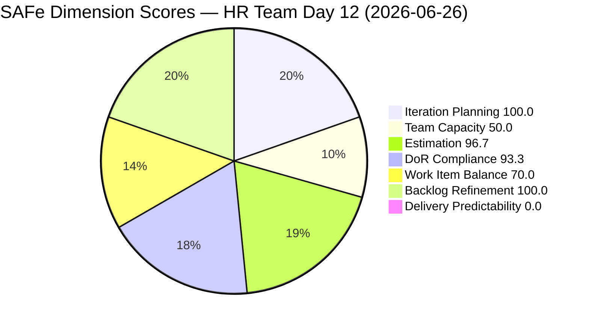
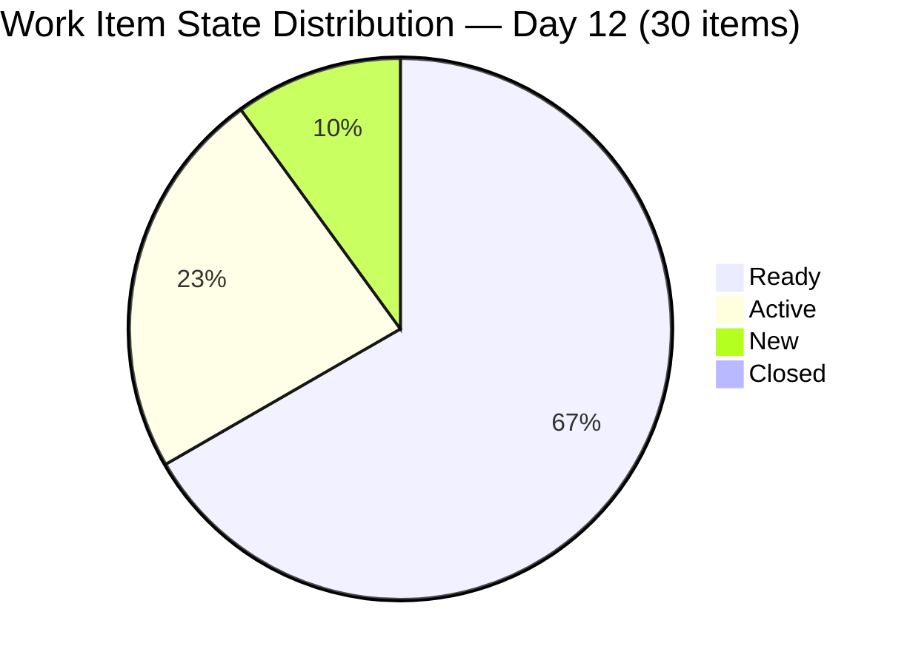
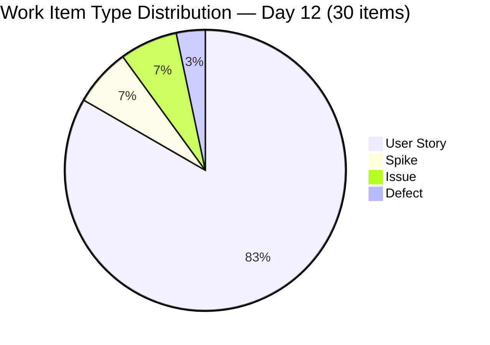
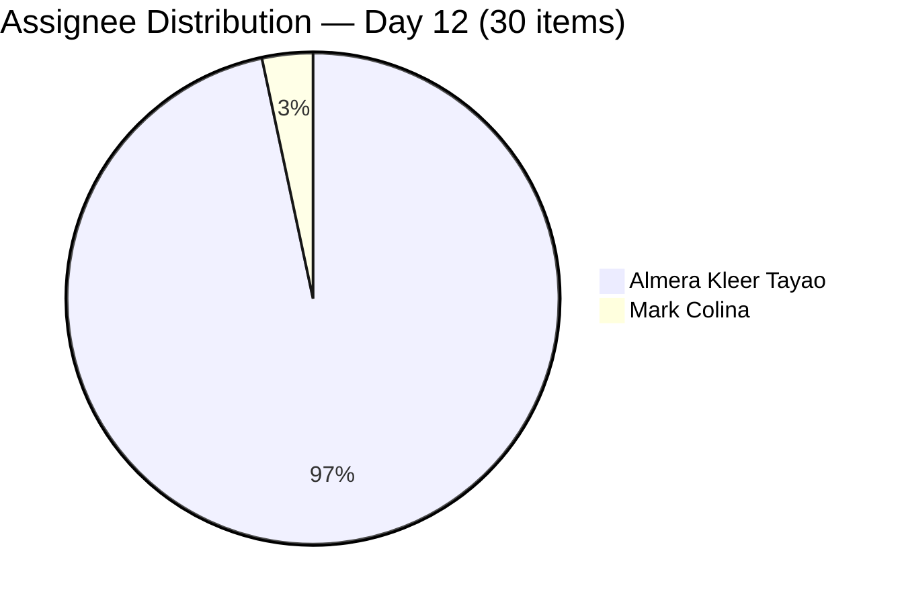
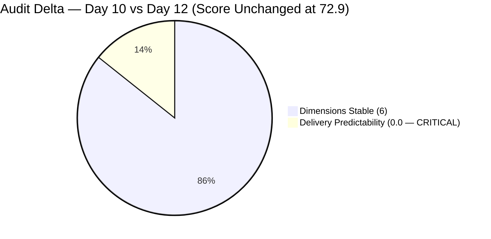

# SAFe Iteration Audit — Human Resource Recruitment Team

## 1. Audit Metadata

| Field | Value |
|-------|-------|
| **Project** | Jairosoft FINOPS |
| **Project ID** | `e0bb302f-40f9-46c3-8164-6f1acb317d63` |
| **Team** | Human Resource Recruitment Team |
| **Team ID** | `248f59a6-372c-4b74-8129-9eaf260f211e` |
| **Workspace** | `ado_hr` |
| **Iteration** | Iteration 7.6 (IP) — Innovation & Planning |
| **Iteration ID** | `bebf6f83-a342-42a2-bad7-a16951231732` |
| **Iteration Dates** | 2026-06-15 to 2026-06-28 |
| **Audit Date** | 2026-06-26 (Day 12 of 14) — Philippine Standard Time (UTC+8) |
| **Prior Audit Reference** | `audit/AUDIT_20260624_0920.md` — Iteration 7.6 IP Day 10, Score 72.9 |
| **Overall Score** | **72.9 / 100** |
| **Risk Band** | MODERATE (Yellow) |

---

## 2. Executive Summary

The Human Resource Recruitment Team enters **Day 12 of 14** of Iteration 7.6 (IP) with an unchanged score of **72.9 (Moderate)**. All seven scoring dimensions carry forward identically from Day 10: the backlog structure, estimation coverage, DoR compliance, and refinement quality remain at their assessed levels. The two persistent DoR failures (207047 and 207044) remain unremediated.

The defining issue is **Delivery Predictability: 0.0**. With only 2 working days remaining (Days 13–14: Jun 27–28), no items have been closed. The sprint ends June 28. The team has 40 SP committed across 29 estimated items, none of which are Closed. This is now a **CRITICAL delivery situation**: the window for any non-zero score has narrowed to 2 days.

Almera Kleer Tayao carries 29 of 30 items and is the sole delivery engine. Mark Colina (1 item: 206583) remains unconfigured in ADO capacity. No iteration goal has been defined for the 14th consecutive audit.

---

## 3. Previous Audit Delta

| Dimension | Prior (Jun 24, Day 10) | Current (Jun 26, Day 12) | Delta | Note |
|-----------|----------------------|--------------------------|-------|------|
| Iteration Planning | 100.0 | 100.0 | 0 | All 30/30 items in current iteration — unchanged |
| Team Capacity | 50.0 | 50.0 | 0 | Almera configured; Mark Colina still absent from roster |
| Estimation | 96.7 | 96.7 | 0 | 29/30 items with SP > 0; 207047 still unestimated |
| DoR Compliance | 93.3 | 93.3 | 0 | 28/30 pass; 207044 + 207047 remain unremediated (Day 12) |
| Work Item Balance | 70.0 | 70.0 | 0 | US share 83.3% (>60%) → structural -30 penalty |
| Backlog Refinement | 100.0 | 100.0 | 0 | All 30 items last modified Jun 15–22; 0 stale items |
| Delivery Predictability | 0.0 | 0.0 | 0 | **CRITICAL** — 0 SP closed; 2 days remain |
| **Overall** | **72.9** | **72.9** | **0** | MODERATE — score stable; delivery urgency now CRITICAL |

> **Day 12 note:** No change in any dimension. All improvements must happen in Days 13–14 (Jun 27–28) or the sprint closes at 72.9 with 0% delivery, which would be the worst delivery outcome since the team achieved 100% in Iteration 6.5.

---

## 4. Current Iteration Snapshot

| Field | Value |
|-------|-------|
| **Iteration** | 7.6 (IP) — Innovation & Planning |
| **Start Date** | 2026-06-15 |
| **End Date** | 2026-06-28 |
| **Day in Sprint** | Day 12 of 14 |
| **Days Remaining** | 2 |
| **Total Visible Root Backlog Items** | 30 |
| **Root Items in Current Iteration** | 30 |
| **User Stories** | 25 |
| **Spikes** | 2 (206004, 207047) |
| **Issues** | 2 (207045, 207046) |
| **Defects** | 1 (207044) |
| **Items Closed** | 0 |
| **Items Active** | 7 |
| **Items Ready** | 20 |
| **Items New** | 3 |
| **Story Points Committed** | 40 SP (29 estimated items) |
| **Story Points Closed** | 0 SP |
| **Iteration Goal** | Not defined |

### Contributor Summary

| Contributor | Items | Capacity (ADO) | Status |
|-------------|-------|----------------|--------|
| Almera Kleer Tayao | 29 | 5 pts/day | Sole delivery contributor |
| Mark Colina | 1 (206583 — Active) | Not configured | Unconfigured (Day 12) |
| grace | 0 | 0 pts/day | Non-contributor this iteration |

---

## 5. Work Item Analysis

### 5.1 Items by State

| State | Count | Items |
|-------|-------|-------|
| Active | 7 | 206004 (Spike), 206401 (US), 206402 (US), 206553 (US), 206562 (US), 206583 (US), 206593 (US) |
| Ready | 20 | 206005, 206570, 206571, 206575, 206579, 206892–206907 (Japan cluster, 14), 207045 |
| New | 3 | 207044 (Defect), 207046 (Issue), 207047 (Spike) |
| Closed | 0 | — |

### 5.2 Estimation Coverage (30 items)

| Category | Count | SP Total |
|----------|-------|----------|
| Estimated (SP > 0) | 29 | 40 SP |
| Unestimated (SP = 0 or null) | 1 | 0 SP |
| **Total** | **30** | **40 SP** |

> Unestimated item: **207047** (Spike — SB Fun Run Registration). No Story Points, no description, no AC. Has been flagged since Day 9 — remains unremediated at Day 12.

### 5.3 DoR Compliance — Full Assessment (30 items)

| Status | Count | Items |
|--------|-------|-------|
| PASS | 28 | All items except 207044 and 207047 |
| FAIL | 2 | 207044 (Defect — no description, no AC); 207047 (Spike — no description, no AC) |

**DoR Failures — Day 12 Detail:**

| ID | Title | Type | Description | Acceptance Criteria | Days Since Flagged |
|----|-------|------|-------------|---------------------|-------------------|
| 207044 | Jodex Installation - Google Account | Defect | Missing | Missing | Day 9 (3 days) |
| 207047 | SB Fun Run Registration | Spike | Missing | Missing | Day 9 (3 days) |

> Both items were flagged on Day 9, again on Day 10. Neither has been remediated. Both require a 5-minute fix each.

### 5.4 Japan Visa Cluster (206892–206907)

14 User Story items (16 were noted in prior audit; note 206903 and 206893 are child tasks) forming the Jove Japan Visa documentation package. All are in Ready state, all assigned to Almera, all have description and AC. This cluster accounts for 46.7% of all backlog items. All items were last modified Jun 22.

### 5.5 Day 12 Delivery Status

With 0 SP closed at Day 12, the team faces the following delivery trajectory requirements:
- To reach 25% delivery (10 SP): close 10 SP on Jun 27–28
- To reach 50% delivery (20 SP): close 20 SP on Jun 27–28
- To reach 80% delivery (32 SP): close 32 SP — extreme burst required (16 SP/day)
- To reach 100% delivery (40 SP): close all 40 SP in 2 days — requires 20 SP/day

Historical precedent: Almera closed 23 SP on a single day (Mar 18, 2026 in Iteration 6.5). That precedent makes 25–50% delivery achievable; 80%+ would require exceptional throughput.

---

## 6. SAFe Compliance Scorecard

| Dimension | Score | Formula | Evidence |
|-----------|-------|---------|----------|
| Iteration Planning | **100.0** | (30/30) × 100 | All 30 backlog items assigned to Iteration 7.6 (IP) — confirmed via backlog API |
| Team Capacity | **50.0** | (1/2) × 100 | Almera configured (5/day); Mark Colina absent from roster; grace = 0 (not counted as contributor) |
| Estimation | **96.7** | (29/30) × 100 | 29/30 items have SP > 0; 207047 = 0 SP (unestimated) |
| DoR Compliance | **93.3** | (28/30) × 100 | 28/30 items pass description ≥30 chars + AC ≥20 chars; 207044 + 207047 fail |
| Work Item Balance | **70.0** | 100 − 30 | US = 25/30 = 83.3% > 60% threshold → −30 dominant-type penalty |
| Backlog Refinement | **100.0** | (30/30) × 100 | All 30 items modified Jun 15–22; 0 stale_90; 0 stale_180; 0 untouched_current |
| Delivery Predictability | **0.0** | (0/40) × 100 | 0 SP closed of 40 SP committed; Day 12 — 2 days remain |
| **Overall** | **72.9** | (100+50+96.7+93.3+70+100+0) / 7 | **MODERATE (Yellow)** |

---

## 7. Dimension Findings

### 7.1 Iteration Planning — 100.0 (Strong)

All 30 visible root backlog items are assigned to Iteration 7.6 (IP). Perfect iteration planning alignment, unchanged across all Day 9–12 audits. The team has correctly focused its entire backlog into the IP sprint, which is the appropriate SAFe IP sprint design pattern.

### 7.2 Team Capacity — 50.0 (High Risk)

Only Almera Kleer Tayao is configured with positive capacity (5 pts/day). Mark Colina, whose item 206583 is Active, remains absent from the ADO capacity roster through Day 12 — a persistent gap flagged on Days 9, 10, and now Day 12 without resolution.

The structural bus factor is 1: Almera holds 29 of 30 items (96.7%). The formula scores 1/2 = 50.0. With 2 days remaining, Mark Colina's configuration is unlikely to affect delivery outcomes, but the ADO data hygiene issue should be corrected post-sprint.

### 7.3 Estimation — 96.7 (Strong)

29 of 30 items carry SP > 0. Total committed SP = 40. The sole unestimated item is 207047 (Spike — SB Fun Run Registration), which also has no description or AC. This item has been flagged across 3 audits without remediation. With 2 days remaining, priority should shift to closing existing Ready/Active items rather than updating this one item's metadata.

### 7.4 DoR Compliance — 93.3 (Good — 2 Persistent Failures)

28 of 30 items satisfy the Description (≥30 non-whitespace chars) and Acceptance Criteria (≥20 non-whitespace chars) requirements. Two items fail:
- **207044** (Defect: Jodex Installation - Google Account) — Description null, AC null. Flagged Day 9, Day 10, Day 12.
- **207047** (Spike: SB Fun Run Registration) — Description null, AC null. Flagged Day 9, Day 10, Day 12.

Both remain in New state. These represent the only persistent DoR failures in the team's 7.6 IP backlog.

### 7.5 Work Item Balance — 70.0 (Moderate — Structural Penalty)

User Stories = 25/30 = 83.3% of iteration items, exceeding the 60% dominant-type threshold and triggering the −30 penalty. The remaining types: Spike (2), Issue (2), Defect (1). The IP sprint nature — planning, research, and administrative documentation — naturally concentrates User Story types. This penalty is structural and not remediated by behavioral change.

### 7.6 Backlog Refinement — 100.0 (Strong)

All 30 items carry ChangedDate ≥ Jun 15, 2026 (all within the sprint window). Zero stale_90 items, zero stale_180 items. Zero untouched_current_items (all 30 were touched on or after iteration start). Perfect refinement score for the third consecutive audit.

### 7.7 Delivery Predictability — 0.0 (CRITICAL — 2 Days Remaining)

Zero Story Points closed at Day 12 of 14. The sprint ends Jun 28. Almera must begin closing items today (Jun 26) to achieve any non-zero delivery score. Key context:

- **Historical throughput:** Almera closed 23 SP in a single day (Iteration 6.5, Mar 18, 2026).
- **Day 12 target minimum:** Close 10 SP (25% delivery) to avoid a fully zero-predictability sprint close.
- **Achievable target:** Close 20 SP across Days 12–14 (50% delivery).
- **20 Ready items** await closure — all have SP, description, and AC. These are the lowest-friction closures available.

This is the most urgent finding in the audit. Delivery predictability will close at 0.0 unless items move to Closed before Jun 28 EOD.

---

## 8. Risks and Bottlenecks

| Risk | Severity | Details |
|------|----------|---------|
| 0 Deliveries at Day 12 | **CRITICAL** | 2 days remain. 40 SP committed; 0 closed. No time buffer left. |
| Bus Factor = 1 | HIGH | Almera owns 29/30 items. Single-point-of-failure for entire sprint. |
| Mark Colina Unconfigured | MODERATE | 206583 (Active) assigned to Mark; no ADO capacity entry through Day 12. |
| DoR Failures Unremediated (Day 12) | MODERATE | 207044 + 207047 flagged for 3 consecutive audits with zero action taken. |
| No Iteration Goal | MODERATE | Persistent across all PI6 and PI7 audits — 14+ audits without a defined sprint goal. |
| Japan Visa Cluster Dependency | MODERATE | 14 items (46.7% of backlog) tied to Jove's visa application. External blockers would stall nearly half the backlog. |

---

## 9. Prioritized Recommendations

| Priority | Action | Owner | Target |
|----------|--------|-------|--------|
| P0 | Close Ready items today (Day 12, Jun 26). Prioritize Japan visa cluster (14 items × 1 SP = 14 SP) — these are the fastest-close group. | Almera | Jun 26 |
| P0 | Continue closures on Jun 27 (Day 13). Target 20+ SP closed by end of Day 13 to reach 50% delivery before final day. | Almera | Jun 27 |
| P1 | Ensure 206583 (Mark Colina — Active) is either closed by Mark or reassigned to Almera before sprint end. | Ramon/Mark | Jun 27 |
| P1 | Add description and AC to 207044 (5-minute fix) while progressing closures. | Almera | Jun 26 |
| P1 | Add description and AC to 207047 (5-minute fix). | Almera | Jun 26 |
| P2 | Configure Mark Colina in ADO team capacity post-sprint to clean up the roster. | Ramon | Post-sprint |
| P2 | Define an iteration goal retrospectively for 7.6 IP before sprint close. Document it in the sprint notes. | Ramon/Almera | Jun 28 |
| P3 | Conduct post-sprint retrospective focused on delivery velocity patterns — the team has strong planning scores but zero closures through Day 12 for the second consecutive IP sprint. | Ramon | Post-sprint |

---

## 10. Evidence Gaps and Limitations

| Gap | Impact | Status |
|-----|--------|--------|
| Mark Colina individual capacity entry | Team Capacity score reflects confirmed absence from ADO capacity roster; 50.0 is accurate | As-designed; 2 days remain — low remediation priority |
| 207044 SP field = 1 but no description/AC | Item counted as estimated (SP > 0) but excluded from DoR pass | Counted correctly under dual criteria |
| 207047 SP field = null | Item excluded from estimated_current_items (denominator is point_eligible); scored as 0 for estimation | Accurate per formula |
| No ADO capacity for individual members | team-level capacity API returns total (5/day for HR team); individual breakdown per prior audit context | Almera = 5/day confirmed; Mark not in roster confirmed |

---

## Appendix: Visualizations

