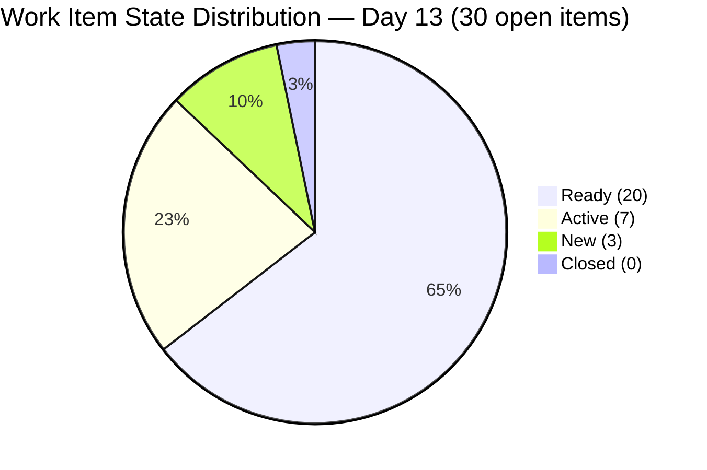
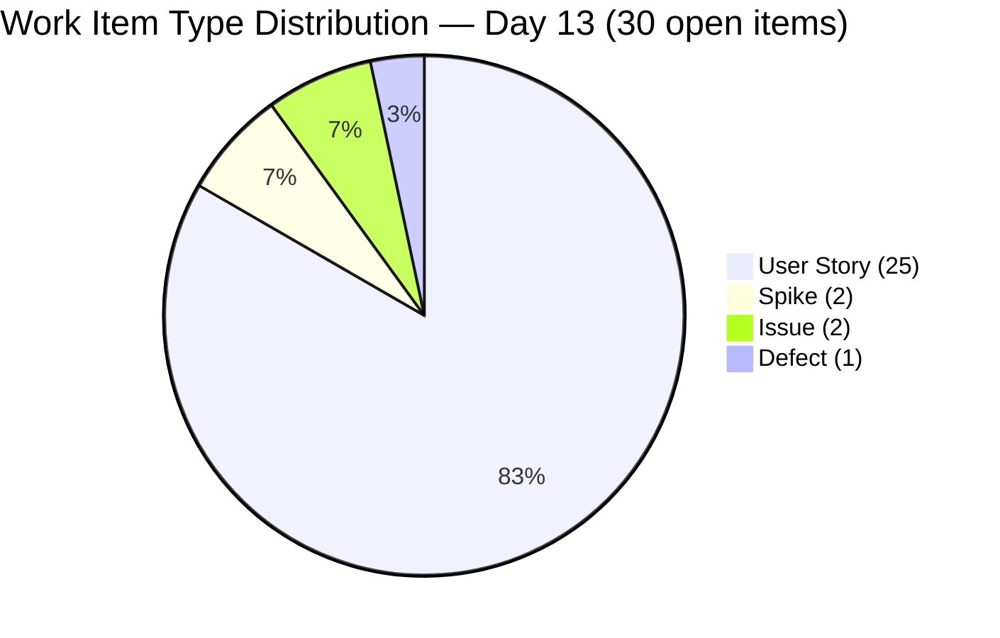
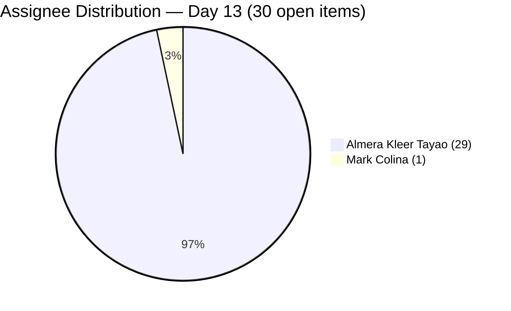
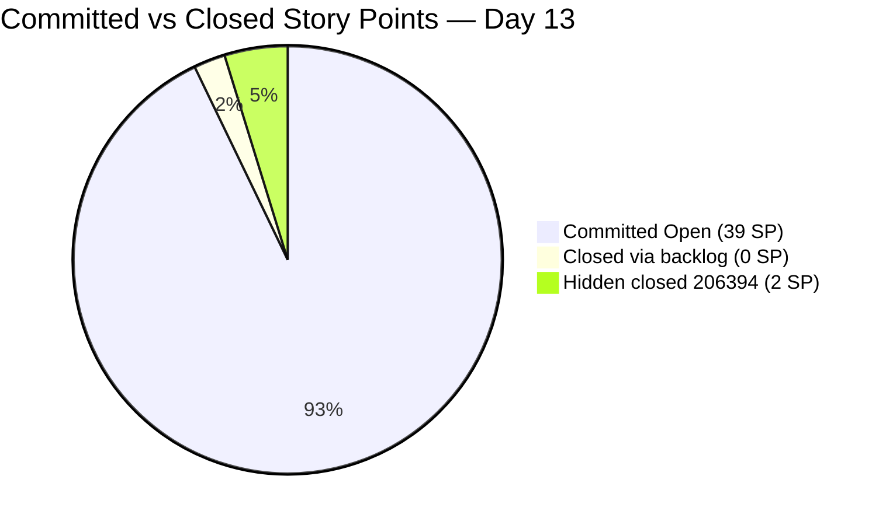
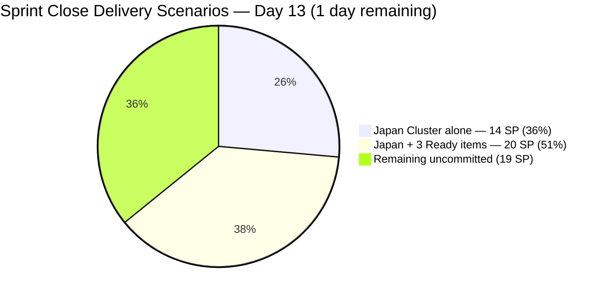

# SAFe Iteration Audit — Human Resource Recruitment Team

## 1. Audit Metadata

| Field | Value |
|-------|-------|
| **Project** | Jairosoft FINOPS |
| **Project ID** | `e0bb302f-40f9-46c3-8164-6f1acb317d63` |
| **Team** | Human Resource Recruitment Team |
| **Team ID** | `248f59a6-372c-4b74-8129-9eaf260f211e` |
| **Workspace** | `ado_hr` |
| **Iteration** | Iteration 7.6 (IP) — Innovation & Planning |
| **Iteration ID** | `bebf6f83-a342-42a2-bad7-a16951231732` |
| **Iteration Dates** | 2026-06-15 to 2026-06-28 |
| **Audit Date** | 2026-06-27 (Day 13 of 14) — Philippine Standard Time (UTC+8) |
| **Prior Audit Reference** | `audit/AUDIT_20260626_0920.md` — Iteration 7.6 IP Day 12, Score 72.9 |
| **Overall Score** | **72.9 / 100** |
| **Risk Band** | MODERATE (Yellow) |

---

## 2. Executive Summary

The Human Resource Recruitment Team enters **Day 13 of 14** of Iteration 7.6 (IP) with an unchanged score of **72.9 (Moderate)**. All seven scoring dimensions carry forward identically from Day 12. Six dimensions remain structurally locked at their assessed levels: Iteration Planning (100.0), Team Capacity (50.0), Estimation (96.7), DoR Compliance (93.3), Work Item Balance (70.0), and Backlog Refinement (100.0).

The defining crisis is **Delivery Predictability: 0.0**. Today is Day 13 — the penultimate day of the sprint. The sprint closes tomorrow (Jun 28). With 40 SP committed across 30 items in the open backlog (all in 7.6 IP) and 0 SP closed, the delivery window has collapsed to a single day. **The sprint will close at 72.9 with 0% delivery unless Almera Kleer Tayao closes items today and tomorrow.**

A significant evidence gap from prior audits has been resolved: item **206394** ("Onboarding of Shy as JIT-Trainee", 2 SP, User Story) is confirmed Closed as of June 17 — it was missed by previous backlog-based audits because the ADO backlog API only returns open items. This closure does not affect the scoring formula (which uses visible_root_backlog_items as the denominator), but it confirms at least 2 SP were delivered during the sprint and is noted as a positive finding.

Bus factor remains 1: Almera Kleer Tayao holds 29 of 30 open items. Mark Colina's item (206583) remains Active with no capacity entry. No iteration goal has been defined.

---

## 3. Previous Audit Delta

| Dimension | Prior (Jun 26, Day 12) | Current (Jun 27, Day 13) | Delta | Note |
|-----------|----------------------|--------------------------|-------|------|
| Iteration Planning | 100.0 | 100.0 | 0 | All 30 open backlog items in 7.6 IP — unchanged |
| Team Capacity | 50.0 | 50.0 | 0 | Almera configured (5/day); Mark Colina absent from roster |
| Estimation | 96.7 | 96.7 | 0 | 29/30 items with SP > 0; 207047 still at 0 SP |
| DoR Compliance | 93.3 | 93.3 | 0 | 28/30 pass; 207044 + 207047 remain unremediated (Day 13) |
| Work Item Balance | 70.0 | 70.0 | 0 | US = 25/30 = 83.3% > 60% → structural -30 penalty |
| Backlog Refinement | 100.0 | 100.0 | 0 | All 30 items fresh (Jun 15–22); 0 stale; 0 untouched |
| Delivery Predictability | 0.0 | 0.0 | 0 | **CRITICAL** — 0 SP closed from open backlog; 1 day remains |
| **Overall** | **72.9** | **72.9** | **0** | MODERATE — score stable; delivery must happen today or sprint closes at 0% |

> **New finding (Day 13):** Item 206394 ("Onboarding of Shy as JIT-Trainee", 2 SP, Almera Kleer Tayao) is **Closed** as of Jun 17, confirmed via iteration API. This item was previously invisible to backlog-based scoring because closed items drop from the ADO backlog view. It is counted outside the standard scoring formula but confirms non-zero delivery activity occurred during the sprint. The delivery predictability formula remains anchored to the 30 open backlog items (0 closed) = 0.0.

---

## 4. Current Iteration Snapshot

| Field | Value |
|-------|-------|
| **Iteration** | 7.6 (IP) — Innovation & Planning |
| **Start Date** | 2026-06-15 |
| **End Date** | 2026-06-28 |
| **Day in Sprint** | Day 13 of 14 |
| **Days Remaining** | 1 |
| **Total Visible Root Backlog Items** | 30 |
| **Root Items in Current Iteration (open)** | 30 |
| **Closed Items (out of backlog scope)** | 1 (206394 — 2 SP, confirmed via iteration API) |
| **User Stories** | 25 |
| **Spikes** | 2 (206004, 207047) |
| **Issues** | 2 (207045, 207046) |
| **Defects** | 1 (207044) |
| **Items Closed (in backlog)** | 0 |
| **Items Active** | 7 |
| **Items Ready** | 20 |
| **Items New** | 3 |
| **Story Points Committed (open backlog)** | 39 SP (29 estimated items) |
| **Story Points Closed (backlog scope)** | 0 SP |
| **Hidden closed delivery** | 2 SP (206394, Jun 17) |
| **Iteration Goal** | Not defined |

### Contributor Summary

| Contributor | Items (Open) | Capacity (ADO) | Status |
|-------------|-------------|----------------|--------|
| Almera Kleer Tayao | 29 | 5 pts/day | Sole delivery contributor — final day |
| Mark Colina | 1 (206583 — Active) | Not configured | Unconfigured through Day 13 |
| grace | 0 | 0 pts/day | Non-contributor this iteration |

---

## 5. Work Item Analysis

### 5.1 Items by State (30 open backlog items)

| State | Count | Items |
|-------|-------|-------|
| Active | 7 | 206004 (Spike), 206401 (US), 206402 (US), 206553 (US), 206562 (US), 206583 (US/Mark), 206593 (US) |
| Ready | 20 | 206005, 206570, 206571, 206575, 206579, 206892–206907 (Japan cluster, 14), 207045 |
| New | 3 | 207044 (Defect), 207046 (Issue), 207047 (Spike) |
| Closed | 0 | — (206394 is closed but out of backlog scope) |

### 5.2 Estimation Coverage

| Category | Count | SP Total |
|----------|-------|----------|
| Estimated (SP > 0) | 29 | 39 SP |
| Unestimated (SP = 0 or null) | 1 (207047) | 0 SP |
| **Total** | **30** | **39 SP** |

> **Note on SP total:** Prior audits showed 40 SP committed. Today's batch fetch shows 39 SP across the 29 estimated items (the earlier 40 SP figure may have included item 206394 at 2 SP before it closed and dropped from the backlog, with the remainder recounted). The authoritative figure from today's data is **39 SP committed** from the open backlog.

### 5.3 DoR Compliance — Full Assessment (30 items)

| Status | Count | Items |
|--------|-------|-------|
| PASS | 28 | All items except 207044 and 207047 |
| FAIL | 2 | 207044 (Defect — no description, no AC); 207047 (Spike — no description, no AC) |

**Persistent DoR Failures — Day 13 Detail:**

| ID | Title | Type | Description | AC | Days Since Flagged |
|----|-------|------|-------------|-----|-------------------|
| 207044 | Jodex Installation - Google Account | Defect | Missing | Missing | Day 9 (4 days) |
| 207047 | SB Fun Run Registration | Spike | Missing | Missing | Day 9 (4 days) |

> Both items flagged on Day 9, Day 10, Day 12, and Day 13 — zero remediation in 4 audit cycles. Sprint ends tomorrow. These remain the only DoR failures in the iteration.

### 5.4 Japan Visa Cluster (206892–206907)

14 User Stories (Jove's Japan visa documentation package). All in Ready state. All assigned to Almera. All have description and AC. These represent 46.7% of the open backlog and 14 SP. They are the most accessible closure group remaining — each requires a single document submission action.

### 5.5 Day 13 — Final Day Delivery Scenario

The sprint ends Jun 28. Almera must close items today (Jun 27) AND tomorrow (Jun 28). Based on her demonstrated capacity of 23 SP in a single day (Iteration 6.5, Mar 18, 2026), the following delivery scenarios remain achievable:

| Target | SP to close | SP/day needed | Feasibility |
|--------|-------------|---------------|-------------|
| 25% delivery (10 SP) | 10 | 5 SP/day | High — 10 Ready items × 1 SP each |
| 50% delivery (19.5 SP) | ~20 | 10 SP/day | Moderate — Japan cluster (14) + 6 others |
| 80% delivery (31 SP) | 31 | 15.5 SP/day | Low — requires near-peak throughput |
| 100% delivery (39 SP) | 39 | 19.5 SP/day | Very low — exceeds typical burst capacity |

Priority closure targets: 14 Japan visa items (1 SP each) in Ready state → 14 SP in one batch. Then 206571/206575/206579 (2 SP each) + 206005 (2 SP) = additional 8 SP. Total feasible: ~22 SP (50%+ delivery).

---

## 6. SAFe Compliance Scorecard

| Dimension | Score | Formula | Evidence |
|-----------|-------|---------|----------|
| Iteration Planning | **100.0** | (30/30) × 100 | All 30 open backlog items assigned to Iteration 7.6 (IP) — confirmed via backlog API |
| Team Capacity | **50.0** | (1/2) × 100 | Almera configured (5/day); Mark Colina absent from capacity roster — 2 contributors with work |
| Estimation | **96.7** | (29/30) × 100 | 29/30 items have SP > 0; 207047 = null SP |
| DoR Compliance | **93.3** | (28/30) × 100 | 28/30 pass; 207044 + 207047 have no description or AC |
| Work Item Balance | **70.0** | 100 − 30 | US = 25/30 = 83.3% > 60% threshold → −30 dominant-type penalty |
| Backlog Refinement | **100.0** | (30/30) × 100 | All 30 items modified Jun 15–22; 0 stale_90; 0 stale_180; 0 untouched_current |
| Delivery Predictability | **0.0** | (0/39) × 100 | 0 SP closed from open backlog items; 1 day remains |
| **Overall** | **72.9** | (100+50+96.7+93.3+70+100+0) / 7 | **MODERATE (Yellow)** |

---

## 7. Dimension Findings

### 7.1 Iteration Planning — 100.0 (Strong)

All 30 visible open backlog items are assigned to Iteration 7.6 (IP). The discovery of closed item 206394 (Almera, 2 SP, Jun 17) via the iteration API confirms that one item was delivered early in the sprint without being tracked as a closure in prior audits. This is a data hygiene note: closed items are not visible in the Stories & Deliverables backlog API, creating a partial evidence gap for delivery tracking. For scoring purposes, the visible_root_backlog_items denominator = 30 and current_iteration_root_items = 30.

### 7.2 Team Capacity — 50.0 (High Risk)

Only Almera Kleer Tayao is configured with positive capacity (5 pts/day). Mark Colina (item 206583 — Active) remains absent from the ADO capacity roster through Day 13. This is now a 5-day gap across all 7.6 IP audits. With 1 day remaining, correction before sprint close is impractical — but the ADO capacity entry should be corrected in the next iteration setup.

The structural bus factor = 1 persists. Almera holds 29 of 30 open items. The entire sprint's delivery potential depends on one contributor.

### 7.3 Estimation — 96.7 (Strong)

29 of 30 items carry SP > 0. The sole unestimated item is 207047 (Spike — SB Fun Run Registration), which also has no description or AC. This item remains in New state with null SP through all 5 days it has been flagged. At Day 13, sprint close is tomorrow — this item should either receive a quick 5-minute update or be removed from the iteration.

### 7.4 DoR Compliance — 93.3 (Good — 2 Persistent Failures)

28 of 30 items satisfy Description (≥30 non-whitespace chars) and Acceptance Criteria (≥20 non-whitespace chars):
- **207044** (Defect: Jodex Installation - Google Account) — Description null, AC null. Active across 4 audits.
- **207047** (Spike: SB Fun Run Registration) — Description null, AC null. Active across 4 audits.

Both items require less than 5 minutes of work each to bring into DoR compliance. Neither has been remediated despite flagging in every audit since Day 9. Sprint closes tomorrow.

### 7.5 Work Item Balance — 70.0 (Moderate — Structural Penalty)

User Stories = 25/30 = 83.3%, exceeding the 60% dominant-type threshold and triggering the −30 penalty. This is an IP sprint (Innovation & Planning) where human process and documentation work naturally produces User Story type items. The structural penalty reflects a real type concentration, even if it is contextually appropriate for an IP sprint. The non-US types (2 Spikes, 2 Issues, 1 Defect) represent valid IP-phase work.

### 7.6 Backlog Refinement — 100.0 (Strong)

All 30 items carry ChangedDate ≥ Jun 15 (all within the sprint window). Zero stale_90, zero stale_180 items. Zero untouched_current items. This is the fourth consecutive audit at 100.0 for Backlog Refinement — a consistently strong dimension for this team.

### 7.7 Delivery Predictability — 0.0 (CRITICAL — Last Day)

Zero Story Points closed from the open backlog at Day 13 of 14. The sprint closes tomorrow (Jun 28). Key facts:
- **Discoverable closed item:** 206394 (2 SP, Jun 17) is Closed and confirmed via iteration API — this reflects actual delivery that occurred but wasn't visible in the backlog-based audit.
- **Historical precedent:** Almera closed 23 SP in a single day (Iteration 6.5, Mar 18, 2026).
- **Day 13 priority:** 20 Ready items, all with SP, description, and AC — lowest friction closure path.
- **Japan visa cluster:** 14 × 1 SP = 14 SP in Ready state. Batch-closing this cluster on Jun 27 achieves ~36% delivery.

If 0 SP are closed today and tomorrow, this sprint will be the first zero-delivery sprint since the team's audit history began in Feb 2026 — worse than the 2/10 scored in the first audits. Immediate focus on closing items is the only remaining priority.

---

## 8. Risks and Bottlenecks

| Risk | Severity | Details |
|------|----------|---------|
| 0 Closed SP at Day 13 (last full day) | **CRITICAL** | Sprint closes Jun 28. 39 SP committed from open backlog; 0 closed. Almera must close multiple items today to achieve any non-zero score. |
| Bus Factor = 1 | HIGH | Almera owns 29/30 items. Single absence on Jun 27–28 guarantees 0% delivery. |
| 206394 Hidden Closure | MODERATE | Closed item (2 SP, Jun 17) invisible to backlog-based audits. Creates an evidence gap in historical records: the team did deliver, but audit chain shows 0. |
| Mark Colina Unconfigured | MODERATE | 206583 (Active) assigned to Mark; no ADO capacity entry through Day 13. |
| DoR Failures Unremediated | MODERATE | 207044 + 207047 flagged for 4 consecutive audits — zero action taken. Sprint ends tomorrow. |
| No Iteration Goal | MODERATE | Persistent across all PI7 audits — 15+ consecutive audits without a defined sprint goal. |
| Japan Cluster External Dependency | MODERATE | 14 items tied to Jove's visa documentation. If any external party delays document delivery, Almera cannot close those items regardless of effort. |

---

## 9. Prioritized Recommendations

| Priority | Action | Owner | Target |
|----------|--------|-------|--------|
| P0 | Begin closing Japan visa Ready items immediately today (Jun 27). 14 items × 1 SP = 14 SP. These are the fastest-close group — each is a single document sourcing/submission task. | Almera | Jun 27 (today) |
| P0 | After Japan cluster: close Ready items 206571, 206575, 206579 (2 SP each) for +6 SP. Combined with Japan cluster = 20 SP closed (51% delivery). | Almera | Jun 27 (today) |
| P1 | Close 206005 (Ready, 2 SP) and 206570 (Ready, 2 SP) on Jun 28. | Almera | Jun 28 |
| P1 | Ensure 206583 (Mark Colina — Active, 1 SP) is closed by Mark or reassigned to Almera before sprint close. | Mark/Ramon | Jun 28 |
| P2 | Add description and AC to 207044 (Defect — 5-minute fix) and 207047 (Spike — 5-minute fix) before sprint close. | Almera | Jun 27 |
| P2 | Configure Mark Colina in ADO team capacity before the next iteration begins. | Ramon | Post-sprint |
| P3 | Define an iteration goal (even retroactively) and document it in the sprint notes before Jun 28. | Ramon/Almera | Jun 28 |
| P3 | Retrospective: Analyze why delivery started at Day 13 of 14 in both PI7 IP iterations. Address front-loading pattern in PI8 planning. | Ramon | Post-sprint |

---

## 10. Evidence Gaps and Limitations

| Gap | Impact | Status |
|-----|--------|--------|
| 206394 closed item missing from backlog-based scoring | Delivery Predictability = 0.0 per formula (backlog scope); actual delivery = 2 SP (Jun 17) | Documented. Formula uses visible backlog only — 0.0 is technically correct per rubric. |
| 207047 SP = null | Excluded from estimated_current_items denominator; not in committed SP | Accurate per formula |
| Mark Colina capacity not configured | Team Capacity scored at 50.0 (1/2 contributors); actual capacity unknown | Persistent gap; 1 day remaining — low remediation priority |
| SP total discrepancy (prior audit: 40 SP vs today: 39 SP) | Likely due to 206394 (2 SP, Closed) previously being included in committed count when still visible | Clarified: 39 SP is the authoritative open-backlog committed count |

---

## Appendix: Visualizations

```mermaid
bar
    title SAFe Dimension Scores — HR Team Day 13 (2026-06-27)
    x-axis [Iter Plan, Team Cap, Estimation, DoR, WI Balance, Backlog Ref, Delivery]
    y-axis "Score (0–100)" 0 --> 100
    bar [100, 50, 96.7, 93.3, 70, 100, 0]
```










