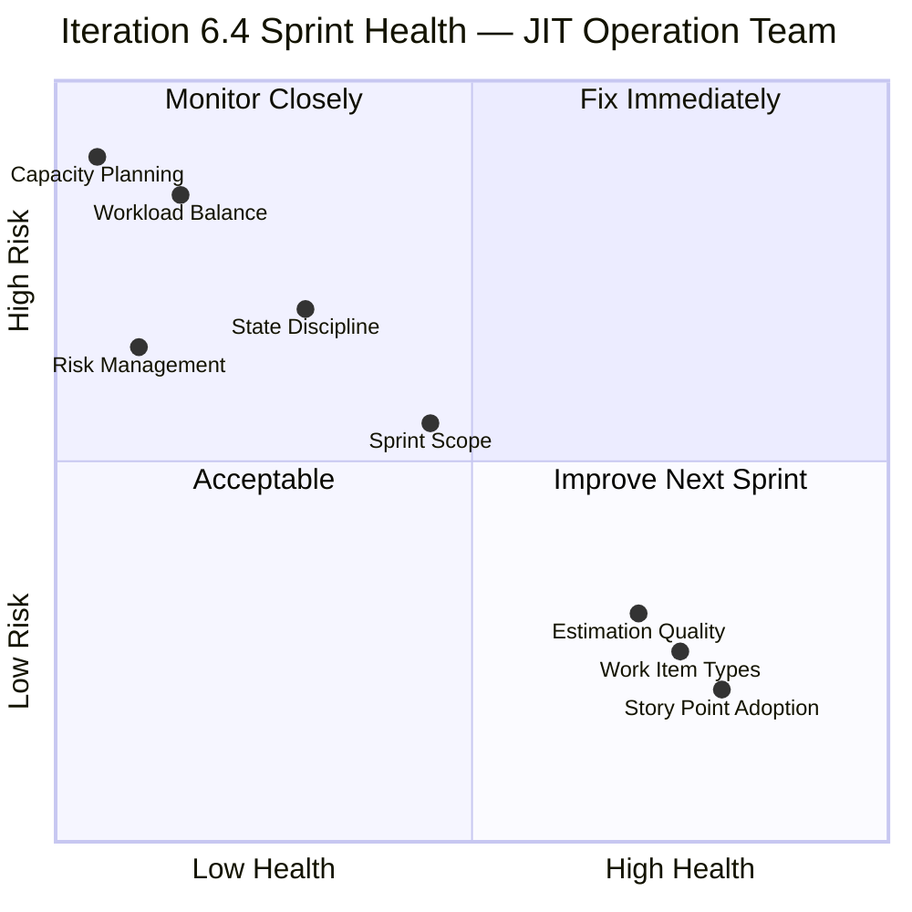
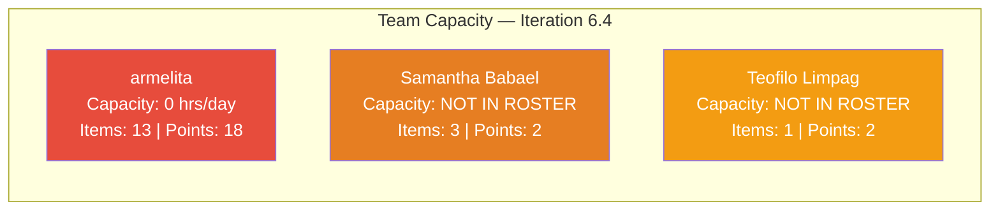
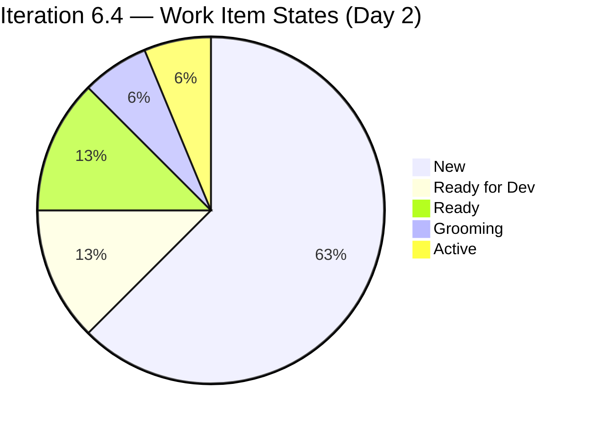
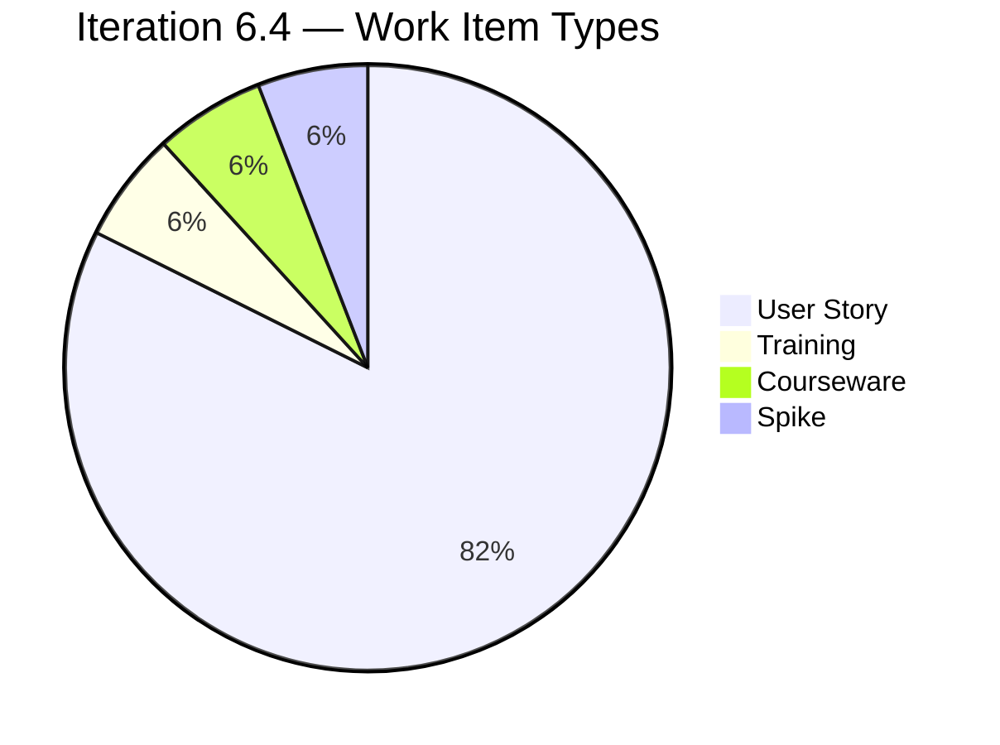
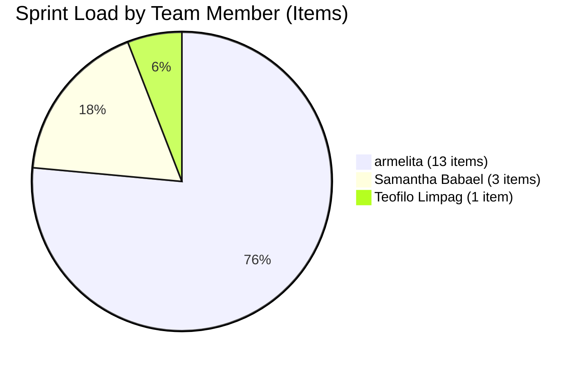
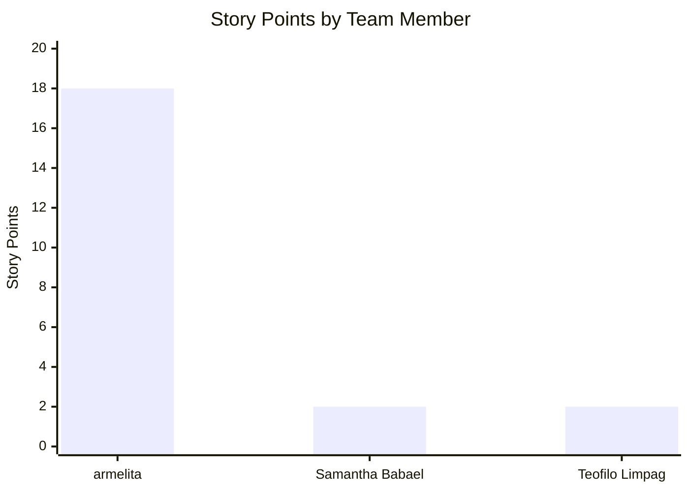
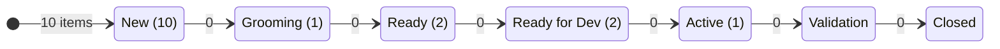
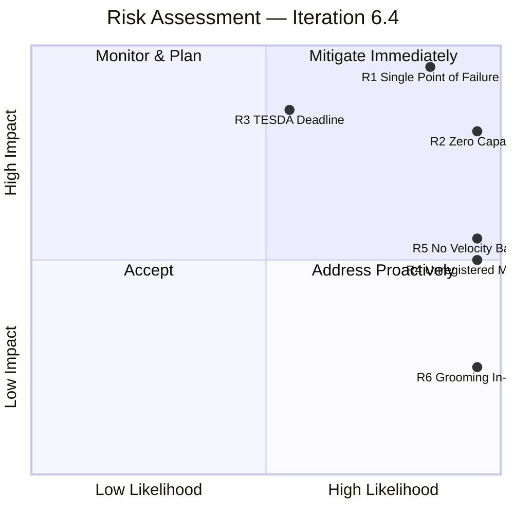
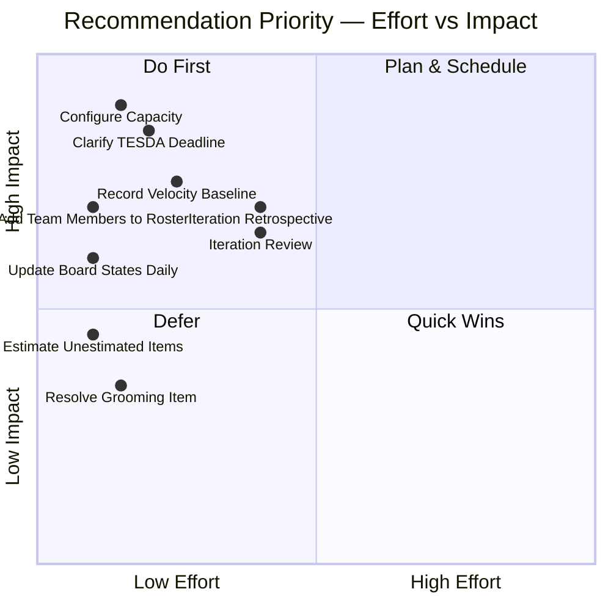

# SAFe Iteration Audit Report — JIT Operation Team, Iteration 6.4

**Audit Date:** 2026-02-24
**Auditor:** Claude AI (Agile PM Consultant, 10+ years SAFe experience)
**Framework:** Scaled Agile Framework (SAFe) 6.0
**Organization:** Jairosoft LLC (`dev.azure.com/jairo`)
**Project:** Jairosoft Portfolio
**Team:** JIT Operation Team
**Scope:** Iteration 6.4 (February 23 – March 8, 2026)
**PI Context:** 2026-PI6, Final Iteration (4 of 4)

---

## 1. Executive Summary

This audit examines **Iteration 6.4** of the JIT Operation Team — the current and final sprint of PI 6. The team is on **Day 2 of a 14-day sprint** with 17 work items committed totaling 23 story points.

The sprint demonstrates strong fundamentals — story-driven delivery (82% User Stories), proper estimation (88% of items sized), and right-sized work items (1–3 points). However, critical process gaps in capacity planning, workload balance, and risk management severely undermine execution predictability.

### Iteration Health Scorecard

| Dimension | Score | Rating |
|---|---|---|
| Capacity Planning | 1/10 | Critical |
| Workload Balance | 2/10 | Critical |
| Risk Management | 1/10 | Critical |
| State Discipline | 4/10 | Poor |
| Sprint Scope | 5/10 | Moderate |
| Estimation Quality | 7/10 | Good |
| Work Item Types | 8/10 | Strong |
| Story Point Adoption | 8/10 | Strong |

**Overall Iteration Score: 4.5 / 10 — Needs Significant Improvement**

---

## 2. Sprint Metrics

| Metric | Value | SAFe Benchmark | Assessment |
|---|---|---|---|
| Sprint Window | Feb 23 – Mar 8, 2026 | 2-week cadence | Compliant |
| Total Work Items | 17 | 8–12 per team | **Over-committed** |
| Total Story Points | 23 | Based on velocity | Unknown (no baseline) |
| Items Estimated | 15 of 17 (88%) | 100% | Good but incomplete |
| Unestimated Items | 2 | 0 | Gap |
| Team Capacity | 0 hrs/day | Must be >0 | **Not configured** |
| Risks Logged | 0 | Track actively | **Critical gap** |
| Items in "New" (Day 2) | 10 of 17 (59%) | <20% by Day 2 | **Poor flow** |
| Items "Active" | 1 of 17 (6%) | 20–40% | **Stalled** |

---

## 3. Team Capacity

### 3.1 Configured Capacity

| Member | Capacity/Day | Days Off | Sprint Items | Story Points |
|---|---|---|---|---|
| armelita | **0 hrs** | 0 | 13 | 18 |
| grace | **0 hrs** | 0 | 0 | 0 |
| Samantha Babael | **Not in roster** | -- | 3 | 2 |
| Teofilo Limpag | **Not in roster** | -- | 1 | 2 |
| **Team Total** | **0 hrs/day** | **0** | **17** | **23** |

### 3.2 Cross-Team Comparison (Iteration 6.4)

| Team | Capacity/Day | Days Off |
|---|---|---|
| Colina Health Product Team | 14.5 hrs | 2 |
| JIT Site eLMS Product Team | 48 hrs | 0 |
| **JIT Operation Team** | **0 hrs** | **0** |

### 3.3 Findings

- **Zero capacity configured for all members.** The JIT Operation Team is the only team at zero among those active in Iteration 6.4.
- **2 contributors are not in the team roster.** Samantha Babael and Teofilo Limpag have sprint items but are invisible to Azure DevOps capacity tracking.
- **grace is registered but has zero sprint items** — either not contributing this sprint or work is untracked.
- **Burndown charts are non-functional** — no capacity baseline means no progress tracking.
- **Sprint commitment is unvalidated** — there is no way to know if 23 points is achievable for this team.

---

## 4. Sprint Backlog

### 4.1 Full Inventory

| #   | ID     | Type       | Title                                                    | State         | Assigned To     | Pts |
| --- | ------ | ---------- | -------------------------------------------------------- | ------------- | --------------- | --- |
| 1   | 199246 | User Story | Duplicate eLMS COC 1                                     | **Active**    | Teofilo Limpag  | 2   |
| 2   | 197617 | User Story | Signing of Agreement on SK Buhangin Partnership          | Ready for Dev | armelita        | 1   |
| 3   | 198612 | User Story | Follow up Sam Application as Trainer                     | Ready for Dev | armelita        | 1   |
| 4   | 198630 | Training   | Markdown Training for the Employees                      | Ready         | Samantha Babael | --  |
| 5   | 199221 | Courseware | ChatGPT Courseware                                       | Ready         | Samantha Babael | --  |
| 6   | 198637 | User Story | Markdown Training Dry-run                                | **Grooming**  | Samantha Babael | 1   |
| 7   | 198615 | User Story | Awarding of CSS NC II Certificates                       | New           | armelita        | 2   |
| 8   | 199092 | User Story | Submit TESDA Career Guidance Semestral Report CY 2026    | New           | armelita        | 2   |
| 9   | 199489 | User Story | Interview and Onboard Cor Jesu Interns                   | New           | armelita        | 2   |
| 10  | 199496 | User Story | CSS NC II CTC SO Certificate                             | New           | armelita        | 1   |
| 11  | 199498 | User Story | Get Copy of Lacking Admin Docs from Ma'am Grace          | New           | armelita        | 1   |
| 12  | 199499 | User Story | Update Company Profile for AC Compliance                 | New           | armelita        | 1   |
| 13  | 199500 | User Story | Get Notarized Contract of Employees for AC Compliance    | New           | armelita        | 1   |
| 14  | 199501 | User Story | Get Copy of Building Layout, Shop Layout, and Floor Plan | New           | armelita        | 1   |
| 15  | 199502 | User Story | Accomplish Checklist F04 AC Compliance                   | New           | armelita        | 1   |
| 16  | 199503 | User Story | Repackage AC Compliance                                  | New           | armelita        | 2   |
| 17  | 199505 | User Story | Contact Inquirers for their downpayment                  | New           | armelita        | 3   |

### 4.2 State Distribution

| State | Count | % | Assessment |
|---|---|---|---|
| New | 10 | 59% | Work has not entered the workflow — signals late planning or items added without commitment |
| Ready for Dev | 2 | 12% | Refined and ready to be picked up |
| Ready | 2 | 12% | Prepped but not yet pulled |
| Grooming | 1 | 6% | **SAFe violation** — items should meet Definition of Ready before entering an iteration |
| Active | 1 | 6% | Only 1 item has actual work in progress |

### 4.3 Type Distribution

| Type | Count | Points | % of Sprint |
|---|---|---|---|
| User Story | 14 | 21 | 82% |
| Training | 1 | -- | 6% |
| Courseware | 1 | -- | 6% |
| Spike | 1 | -- | 6% |
| **Total** | **17** | **23** | **100%** |

**Positive Finding:** User Stories account for **82% of the sprint** — the team is properly using User Stories as the primary vehicle for value delivery, which is a SAFe best practice.

---

## 5. Workload Distribution

### 5.1 Load by Team Member

| Team Member | Items | Story Points | % Load | Item States |
|---|---|---|---|---|
| **armelita** | **13** | **18 pts** | **76%** | 10 New, 2 Ready for Dev, 1 New |
| Samantha Babael | 3 | 2 pts | 18% | 1 Ready, 1 Grooming, 1 Ready |
| Teofilo Limpag | 1 | 2 pts | 6% | 1 Active |
| **Total** | **17** | **23 pts** | **100%** | |

### 5.2 Story Points by Team Member

### 5.3 Finding — Critical Workload Imbalance

**armelita carries 76% of all sprint work (13 items, 18 of 23 story points).** This is the single most critical finding in this audit.

| Risk Factor | Detail |
|---|---|
| **Bus Factor** | If armelita is unavailable for even 2–3 days, 76% of the sprint is at risk |
| **Bottleneck** | All 10 "New" items are hers — nothing moves until she starts them |
| **Burnout Risk** | 18 story points in 10 working days = ~1.8 pts/day sustained |
| **Quality Risk** | High volume + single person = reduced time for thorough work |

**SAFe Guidance:** SAFe recommends work be distributed across team members to promote collective ownership and reduce dependency risk. No single team member should own more than 30–40% of a sprint's committed work.

---

## 6. Sprint Theme Analysis

The 17 work items cluster into **4 strategic themes**:

```mermaid
graph TD
    subgraph "Theme 1: TESDA AC Compliance"
        direction TB
        T1H["7 items | 9 pts | ALL armelita | ALL New"]
        A1["199499 · Update Company Profile"]
        A2["199500 · Notarized Contracts"]
        A3["199501 · Building Layouts & Floor Plan"]
        A4["199502 · Checklist F04"]
        A5["199503 · Repackage AC Compliance"]
        A6["199496 · CSS NC II CTC SO Certificate"]
        A7["199498 · Get Admin Docs from Grace"]
        T1H --- A1 & A2 & A3 & A4 & A5 & A6 & A7
    end
    subgraph "Theme 2: Training & Courseware"
        direction TB
        T2H["3 items | 1 pt | Samantha Babael"]
        B1["198630 · Markdown Training"]
        B2["198637 · Markdown Dry-run"]
        B3["199221 · ChatGPT Courseware"]
        T2H --- B1 & B2 & B3
    end
    subgraph "Theme 3: Partnerships & Onboarding"
        direction TB
        T3H["4 items | 7 pts | armelita"]
        C1["197617 · SK Buhangin Agreement"]
        C2["199489 · Cor Jesu Interns"]
        C3["198612 · Sam Trainer Application"]
        C4["199505 · Contact Inquirers for Downpayment"]
        T3H --- C1 & C2 & C3 & C4
    end
    subgraph "Theme 4: Certification & Reporting"
        direction TB
        T4H["3 items | 6 pts | Mixed"]
        D1["198615 · CSS NC II Certificates"]
        D2["199092 · TESDA Semestral Report"]
        D3["199246 · Duplicate eLMS COC 1"]
        T4H --- D1 & D2 & D3
    end
    style T1H fill:#e74c3c,color:#fff
    style T2H fill:#3498db,color:#fff
    style T3H fill:#2ecc71,color:#fff
    style T4H fill:#9b59b6,color:#fff
```

| Theme | Items | Points | Owner(s) | Risk Level |
|---|---|---|---|---|
| TESDA AC Compliance | 7 (41%) | 9 | armelita (100%) | **High** — regulatory, all "New" |
| Training & Courseware | 3 (18%) | 1 | Samantha Babael | Low |
| Partnerships & Onboarding | 4 (24%) | 7 | armelita (100%) | Medium |
| Certification & Reporting | 3 (18%) | 6 | Mixed | Medium |

**Key Insight:** The sprint is dominated by **TESDA Assessment Center compliance** (41% of items). These 7 items form a dependency cluster — they all relate to preparing documentation for regulatory compliance. If there is a hard TESDA deadline, these should be prioritized above all other work. Currently, all 7 are in "New" state on Day 2.

---

## 7. State Flow Assessment

### 7.1 Workflow States in This Sprint

### 7.2 Findings

**Day 2 Sprint Health:**

- **59% of items (10/17) are in "New"** — they have not entered the team's workflow
- **Only 1 item (6%) is "Active"** — actual work in progress
- **0 items have moved between states** since sprint start — no flow is occurring

**SAFe Violation:** Item 198637 ("Markdown Training Dry-run") is in **Grooming** state inside an active sprint. Per SAFe, work entering an iteration should meet the team's Definition of Ready. Grooming should happen during backlog refinement *before* sprint planning, not during the sprint.

---

## 8. Estimation Quality

| Metric | Value | Assessment |
|---|---|---|
| Items with Story Points | 15 of 17 (88%) | Good |
| Items without Story Points | 2 (Training + Courseware) | Gap — all sprint items should be estimated |
| Point range | 1–3 pts | Healthy — small, right-sized stories |
| Average points per item | 1.5 pts | Low complexity work |
| Total sprint commitment | 23 pts | Unknown if achievable (no velocity baseline) |

**Positive:** Story point adoption is high at 88%. Most items are sized at 1–2 points, indicating they are properly decomposed.

**Gap:** The 2 unestimated items (Training and Courseware types) suggest the team does not estimate non-User Story types, which creates blind spots in velocity tracking.

---

## 9. Risk Register

| # | Risk | Likelihood | Impact | Mitigation |
|---|---|---|---|---|
| **R1** | **Single point of failure** — armelita owns 76% of sprint work (13 items, 18 pts) | High | Critical | Redistribute work; cross-train Samantha and Teofilo |
| **R2** | **Zero capacity configured** — sprint commitment is unvalidated | Confirmed | High | Configure capacity for all active team members immediately |
| **R3** | **TESDA AC Compliance deadline risk** — 7 regulatory items all "New" on Day 2 | Medium | High | Clarify TESDA deadline; prioritize if time-bound |
| **R4** | **Unregistered team members** — Samantha Babael and Teofilo Limpag not in ADO roster | Confirmed | Medium | Add them to the JIT Operation Team in ADO settings |
| **R5** | **No velocity baseline** — team cannot assess if 23 pts is achievable | Confirmed | Medium | Track this sprint's actual completion to establish baseline |
| **R6** | **Grooming in-sprint** — item 198637 is not ready for development | Confirmed | Low | Complete grooming or remove from sprint |

---

## 10. SAFe Compliance — Iteration Practices

| Practice | Status | Evidence |
|---|---|---|
| Iteration Planning | Partial | Items assigned to sprint, but capacity = 0 and 59% items are "New" — suggests items were added without a formal planning ceremony |
| Definition of Ready | Not Enforced | 1 item in "Grooming" state is in the sprint |
| Capacity-Based Planning | Not Implemented | 0 hrs/day configured for all members |
| WIP Limits | Not Visible | No evidence of WIP limits on the board |
| Story Point Estimation | Mostly Implemented | 88% estimated (15 of 17 items) |
| ROAM Risk Management | Not Implemented | 0 risks/impediments logged |
| Daily Stand-up | Unknown | Not tracked in ADO |
| Iteration Review/Demo | Unknown | Sprint ends Mar 8 — no evidence of scheduling |
| Iteration Retrospective | Unknown | No evidence in ADO |

---

## 11. Recommendations

### 11.1 Immediate Actions (This Week — Days 2–5)

| # | Action | Owner | Priority |
|---|---|---|---|
| 1 | **Configure team capacity** for armelita, Samantha Babael, and Teofilo Limpag with actual hours/day | Scrum Master / Team Lead | Critical |
| 2 | **Add Samantha Babael and Teofilo Limpag** to the JIT Operation Team roster in Azure DevOps | Project Admin | Critical |
| 3 | **Clarify TESDA AC compliance deadline** — if there is a hard regulatory date, the 7 compliance items (IDs: 199496–199503) must be prioritized above all other work | armelita | High |
| 4 | **Resolve item 198637** (Markdown Training Dry-run) — complete grooming and move to "Ready" or defer to next sprint | Samantha Babael | Medium |
| 5 | **Estimate 2 unestimated items** (198630 Markdown Training, 199221 ChatGPT Courseware) | Team | Medium |
| 6 | **Move "New" items to "Active"** as work begins — update board states daily to reflect actual progress | All team members | Medium |

### 11.2 Before Sprint End (March 8, 2026)

| # | Action | Owner | Priority |
|---|---|---|---|
| 7 | **Record sprint actuals** — document how many of the 23 story points were completed; this becomes the team's first velocity baseline | Scrum Master | High |
| 8 | **Conduct Iteration Review** — demo completed work to stakeholders, especially TESDA compliance deliverables | Team | Medium |
| 9 | **Conduct Iteration Retrospective** — key topics: Why is capacity not configured? Is the workload sustainable? Are items entering sprints in "Ready" state? | Team | Medium |

### 11.3 Recommendation Priority Matrix

---

## 12. Conclusion

Iteration 6.4 reveals a team with **good agile instincts but critical process gaps**:

**What's working:**

- **82% User Stories** — story-driven delivery is strong
- **88% estimated** — the team values sizing their work
- **Right-sized items (1–3 pts)** — work is properly decomposed
- **Clear thematic focus** — TESDA compliance, training, partnerships, and certification

**What must be fixed:**

- **Zero capacity configured** — burndown and commitment validation are impossible
- **76% workload on one person** — armelita is a single point of failure carrying 18 of 23 story points
- **59% of items still "New" on Day 2** — work is not flowing through the board
- **Zero risks logged** — the team is blind to impediments
- **2 active contributors not in the team roster** — their work is invisible to ADO tracking

The fix is straightforward: **configure capacity, register team members, and start moving items through the board daily.** These are low-effort, high-impact actions that can be completed within this sprint.

---

*Audit report generated by Claude AI Agile PM Consultant on 2026-02-24. Data sourced live from Azure DevOps (`dev.azure.com/jairo`, Jairosoft Portfolio project, JIT Operation Team, Iteration 6.4 — Day 2 of 14). Based on SAFe 6.0 framework standards from [ScaledAgileFramework.com](https://ScaledAgileFramework.com).*
