# SAFe Audit Report — Jairosoft Portfolio

**Audit Date:** 2026-02-25
**Auditor:** Claude AI (Agile PM Consultant)
**Framework:** Scaled Agile Framework (SAFe) 6.0
**Organization:** Jairosoft LLC (`dev.azure.com/jairo`)
**Project:** Jairosoft Portfolio

---

## 1. Executive Summary

The Jairosoft Portfolio project is a multi-team, multi-product initiative managed through Azure DevOps with SAFe-aligned practices. The project spans 21 teams organized across Agile Release Trains (ARTs), with work structured through Program Increments (PIs). The portfolio currently operates across two primary product domains — **Colina Health** and **Sitecore** — alongside training, marketing, and operational functions delivered through the **Jairo Institute of Technology (JIT)**.

### Overall SAFe Maturity Assessment

| Dimension | Score | Rating |
|---|---|---|
| Team Organization | 7/10 | Good |
| PI Cadence & Iterations | 8/10 | Strong |
| Backlog Hierarchy | 8/10 | Strong |
| Work Item Discipline | 5/10 | Needs Improvement |
| CI/CD Pipeline Health | 6/10 | Moderate |
| Lean Portfolio Management | 7/10 | Good |

**Overall Score: 6.8 / 10 — Moderate SAFe Maturity**

---

## 2. Organizational Structure

The project has **21 teams**, which maps well to a SAFe Agile Release Train (ART) structure.

### Team Categories

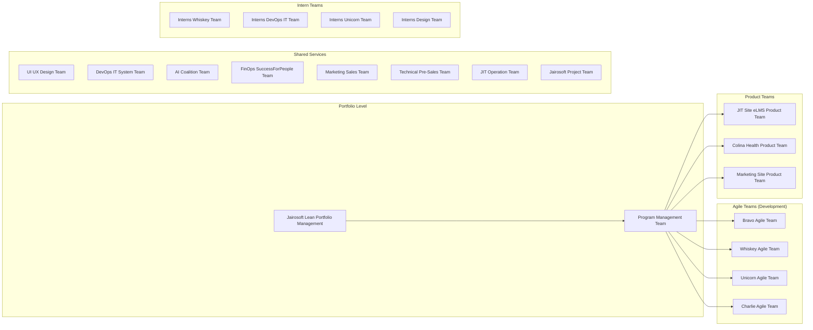

### Findings — Team Organization

**Strengths:**

- Clear SAFe hierarchy with a **Lean Portfolio Management** team at the top, which is a SAFe best practice for portfolio-level governance.
- **Program Management Team** exists to coordinate across ARTs.
- Named Agile teams (Bravo, Whiskey, Unicorn, Charlie) suggest structured team identity — a hallmark of healthy SAFe adoption.
- Dedicated **Product Teams** for each value stream (JIT eLMS, Colina Health, Marketing Site).
- **Shared Services** teams (DevOps IT, AI Coalition, UI/UX Design) properly support cross-cutting concerns.

**Concerns:**

- **21 teams is high** for a single ART. SAFe recommends 5–12 teams per ART. Consider whether this portfolio should be restructured into **2–3 ARTs** (e.g., Colina Health ART, JIT/Education ART, Marketing/Sales ART).
- **4 Intern teams** may create coordination overhead. Consider embedding interns within established Agile teams rather than maintaining separate teams.
- Several teams lack descriptions, making it hard to understand their scope and charter.

---

## 3. PI Cadence & Iteration Structure

The portfolio follows a well-defined PI cadence with the following timeline:

### PI Timeline

| PI | Start Date | End Date | Duration | Status |
|---|---|---|---|---|
| PI 0 | Sep 16, 2024 | Dec 29, 2024 | ~15 weeks | Completed |
| PI 1 | Dec 30, 2024 | Mar 23, 2025 | ~12 weeks | Completed |
| PI 2 | Mar 24, 2025 | Jun 15, 2025 | ~12 weeks | Completed |
| PI 3 | Jun 16, 2025 | Sep 07, 2025 | ~12 weeks | Completed |
| PI 4 | Sep 08, 2025 | Nov 30, 2025 | ~12 weeks | Completed |
| PI 5 | Dec 01, 2025 | Feb 22, 2026 | ~12 weeks | **Just Completed** |

### PI 3 Iteration Breakdown (Detail Available)

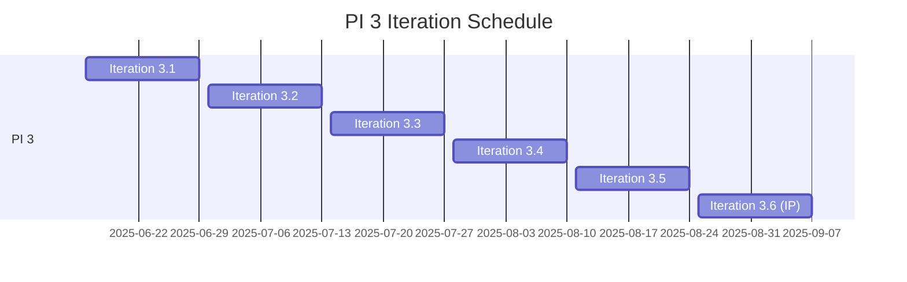

### Findings — PI Cadence

**Strengths:**

- Consistent **12-week PI cadence** from PI 1 onward (PI 0 was a 15-week onboarding/setup PI, which is acceptable).
- PI 3 shows proper **2-week iteration cadence** with 5 development iterations + 1 Innovation & Planning (IP) iteration — this is textbook SAFe.
- The IP iteration (3.6) is correctly labeled and positioned at the end of the PI.
- **6 PIs completed** in ~17 months demonstrates commitment and velocity.

**Concerns:**

- As of Feb 25, 2026, PI 5 just ended (Feb 22). No PI 6 iteration structure is visible — this suggests **PI Planning may be delayed** or hasn't been configured yet in ADO.
- PI 0 was 3 weeks longer than subsequent PIs. While acceptable for a launch PI, the variance should be documented.
- Only PI 3 has visible sub-iterations; PIs 0, 1, 2, 4, and 5 do not show iteration breakdowns at the portfolio level.

**Recommendation:** Ensure PI 6 planning is scheduled immediately. The 3-day gap between PIs should be used for Inspect & Adapt (I&A) and PI Planning events.

---

## 4. Backlog Hierarchy & Work Item Types

The portfolio uses a customized SAFe backlog hierarchy:

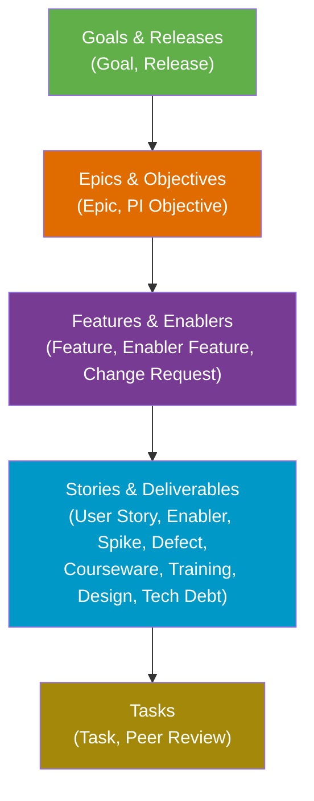

### Findings — Backlog Hierarchy

**Strengths:**

- **5-level hierarchy** aligns well with SAFe's portfolio, large solution, program, and team levels.
- Custom work item types like **Courseware**, **Training**, and **Design** show thoughtful adaptation of SAFe to the organization's domain (education/training).
- **PI Objective** as a work item type at the Epic level is a strong SAFe practice.
- **Risks and Impediments** backlog (Issue, Risk) is defined — this supports ROAM risk management.
- **Peer Review** as a task type promotes quality practices.

**Concerns:**

- The **Features and Enablers** and **Stories and Deliverables** backlogs are marked as **hidden** (`isHidden: true`). This could mean teams aren't using the board views at these levels, losing visibility.
- The **Risks and Impediments** backlog is also hidden — risk management visibility may be lacking.
- **8 work item types** at the Story level is high. Consider whether Spike, Courseware, Training, and Design could be consolidated or tracked via tags instead.

---

## 5. Work Item Health Analysis

Based on the 50 sampled work items:

### State Distribution

| State | Count | % |
|---|---|---|
| Closed | 30 | 60% |
| New | 8 | 16% |
| Blocked | 3 | 6% |
| Removed | 3 | 6% |
| Requirements Gathering | 4 | 8% |
| Grooming | 1 | 2% |
| Other | 1 | 2% |

### Work Item Type Distribution

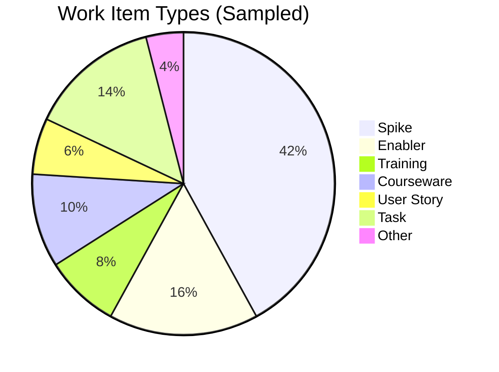

### Key Team Members

| Team Member | Work Items | Primary Types |
|---|---|---|
| <armelita@jairosoft.com> | 13 | Training, Enabler, Courseware |
| Jeffrey Avila | 7 | Spike (Marketing) |
| Roche Casipong | 7 | Spike (Registration/Sales) |
| <grace@jairosoft.com> | 5 | User Story, Courseware |
| Elmer Joseph Cutin | 3 | Spike (Marketing) |
| Vicsante Aseniero | 3 | Spike, Enabler |
| Ramon Aseniero | 2 | Spike, User Story |

### Findings — Work Items

**Strengths:**

- **60% closure rate** on sampled items shows work is getting done.
- Clear ownership — most work items have assigned team members.
- Work spans multiple domains: marketing, training/courseware development, product development (Colina Health), and operations.

**Critical Concerns:**

- **Spikes dominate at 42%** of all work items. SAFe recommends spikes as time-boxed research activities, not the primary work type. This suggests the organization may be over-using Spikes instead of proper User Stories with acceptance criteria.
- **User Stories are only 6%** of sampled work — this is alarmingly low. Value delivery should be primarily tracked through User Stories.
- **3 Blocked items (6%)** with no visible resolution path. Blocked items tagged "OnHold" suggest systemic impediments that aren't being actively resolved.
- **3 Removed items (6%)** indicate scope instability or poor backlog refinement.
- **Items in "Requirements Gathering" and "Grooming" states** suggest some work items are languishing in pre-development stages.
- **No Story Points visible** on any sampled work items — velocity tracking may not be active.

---

## 6. CI/CD Pipeline Health

### Pipeline Inventory (13 Pipelines)

| Pipeline | Domain | Last Build | Status |
|---|---|---|---|
| BEColinaHealth.git Backend CICD | Colina Health | Feb 9, 2026 | Success |
| colinahealth.git FrontEnd CICD | Colina Health | Feb 5, 2026 | Success |
| Colina BE Docker Image | Colina Health | Mar 10, 2025 | Success |
| Colina FE Docker Image | Colina Health | Mar 11, 2025 | Success |
| ColinaHealth-API_Golang_Build | Colina Health | Mar 6, 2025 | Success |
| colinahealth.git | Colina Health | Feb 5, 2025 | Success |
| Sitecore Environment Creation | Sitecore | Aug 14, 2025 | Success |
| Sitecore Environment Deletion | Sitecore | Aug 14, 2025 | **Partial Failure** |
| Sitecore-CD Repository Creation | Sitecore | Aug 14, 2025 | Success |
| Sitecore-CM Repository Creation | Sitecore | Aug 14, 2025 | Success |
| Sitecore Repository Deletion | Sitecore | Aug 14, 2025 | Success |
| Sitecore | Sitecore | Jul 9, 2025 | Success |
| SugConPH | Sitecore | Aug 15, 2025 | Success |

### Pipeline Activity Timeline

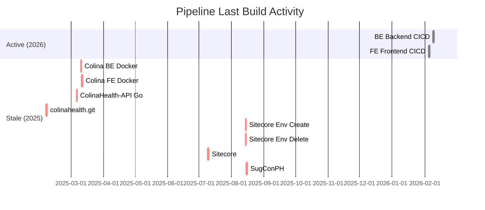

### Findings — CI/CD

**Strengths:**

- **13 pipelines** across two product domains shows CI/CD investment.
- The two most recent builds (Feb 2026) are for Colina Health, indicating active development on that product.
- All builds except one show successful status.

**Concerns:**

- **11 of 13 pipelines haven't been triggered since 2025** — this means 85% of pipelines are stale. Either the codebases are dormant or builds aren't being triggered regularly.
- **Sitecore pipelines** last ran in Aug 2025 (6+ months ago) — if Sitecore is still an active product, this is a red flag for continuous integration practices.
- The **Sitecore Environment Deletion** pipeline shows a partial failure that was never addressed.
- Only **Colina Health Backend and Frontend** pipelines show recent (2026) activity, suggesting development effort is concentrated on a single product.

---

## 7. Repository Analysis

### Repository Inventory (9 Repos)

| Repository | Size | Domain |
|---|---|---|
| Sitecore-CD | 236 MB | Sitecore |
| Sitecore-CM | 187 MB | Sitecore |
| BEColinaHealth-GO | 42 MB | Colina Health |
| SugConPH | 31 MB | Sitecore |
| colinahealth.git | 30 MB | Colina Health |
| FEColinaHealth-GO | 19 MB | Colina Health |
| BEColinaHealth.git | 3.5 MB | Colina Health |
| Sitecore | 2.6 MB | Sitecore |
| JairoDevOps | <1 KB | DevOps |

### Findings — Repositories

- **Sitecore repos are the largest** (423 MB combined) but show no recent pipeline activity — potential tech debt accumulation.
- **Colina Health** has both legacy (.git suffix) and newer (GO suffix) repos, suggesting a technology migration from one stack to Go.
- **JairoDevOps** repo is essentially empty (723 bytes) — should be cleaned up or documented.

---

## 8. SAFe Compliance Assessment

### SAFe Core Values Alignment

| SAFe Core Value | Status | Evidence |
|---|---|---|
| **Alignment** | Partial | PI cadence exists; PI Objectives are defined as work item types. However, no visible Strategic Themes or portfolio Kanban flow. |
| **Built-in Quality** | Needs Improvement | Peer Review task type exists, but no evidence of Definition of Done, automated testing metrics, or code review policies. |
| **Transparency** | Partial | Work items are tracked, but key backlogs (Features, Stories, Risks) are hidden from board views. |
| **Program Execution** | Good | 6 PIs completed with consistent cadence. Teams are structured and work is assigned. |

### SAFe Essential Practices Checklist

| Practice | Implemented? | Notes |
|---|---|---|
| PI Planning | Likely | PI structure exists, but no formal PI Planning artifacts visible |
| Iteration Planning | Partial | Only PI 3 shows sub-iterations |
| Iteration Review/Demo | Unknown | No evidence in ADO |
| Iteration Retrospective | Unknown | No evidence in ADO |
| PI System Demo | Unknown | No evidence in ADO |
| Inspect & Adapt | Unknown | No formal I&A artifacts visible |
| Backlog Refinement | Partial | Items in "Grooming" state suggest some refinement |
| Continuous Integration | Partial | Pipelines exist but most are stale |
| Continuous Deployment | Partial | Docker-based pipelines suggest CD capability for Colina Health |
| PI Objectives | Yes | PI Objective work item type defined at Epic level |
| WSJF Prioritization | Unknown | No business value or time criticality data visible on items |

---

## 9. Recommendations

### Immediate Actions (This PI)

1. **Plan PI 6 immediately.** PI 5 ended Feb 22 — schedule PI Planning within the next week to avoid losing momentum.
2. **Address 3 Blocked work items.** Conduct an impediment removal session; items tagged "OnHold" need executive escalation or formal removal.
3. **Unhide Feature and Story backlogs.** Teams need board-level visibility at these levels for proper flow management.

### Short-Term (Next 1–2 PIs)

1. **Reduce Spike usage.** Convert ongoing research activities into proper User Stories with acceptance criteria. Target <15% Spikes in the backlog.
2. **Implement Story Points.** Without velocity data, predictability and capacity planning are impossible.
3. **Reactivate or archive stale pipelines.** 11 dormant pipelines create confusion; either trigger regular builds or formally decommission them.
4. **Restructure into 2–3 ARTs.** With 21 teams, consider splitting into Colina Health ART, JIT/Education ART, and Marketing/Operations ART.

### Long-Term (Next 2–4 PIs)

1. **Implement WSJF prioritization.** Add Business Value and Time Criticality fields to Features and Enablers.
2. **Embed interns into existing teams.** Reduce the 4 separate intern teams to improve mentoring and reduce coordination overhead.
3. **Establish Inspect & Adapt cadence.** Formalize I&A ceremonies at the end of each PI with documented improvement backlog.
4. **Clean up repository landscape.** Archive or document the empty JairoDevOps repo; assess whether legacy Colina Health repos (non-GO) should be deprecated.

---

## 10. Summary Scorecard

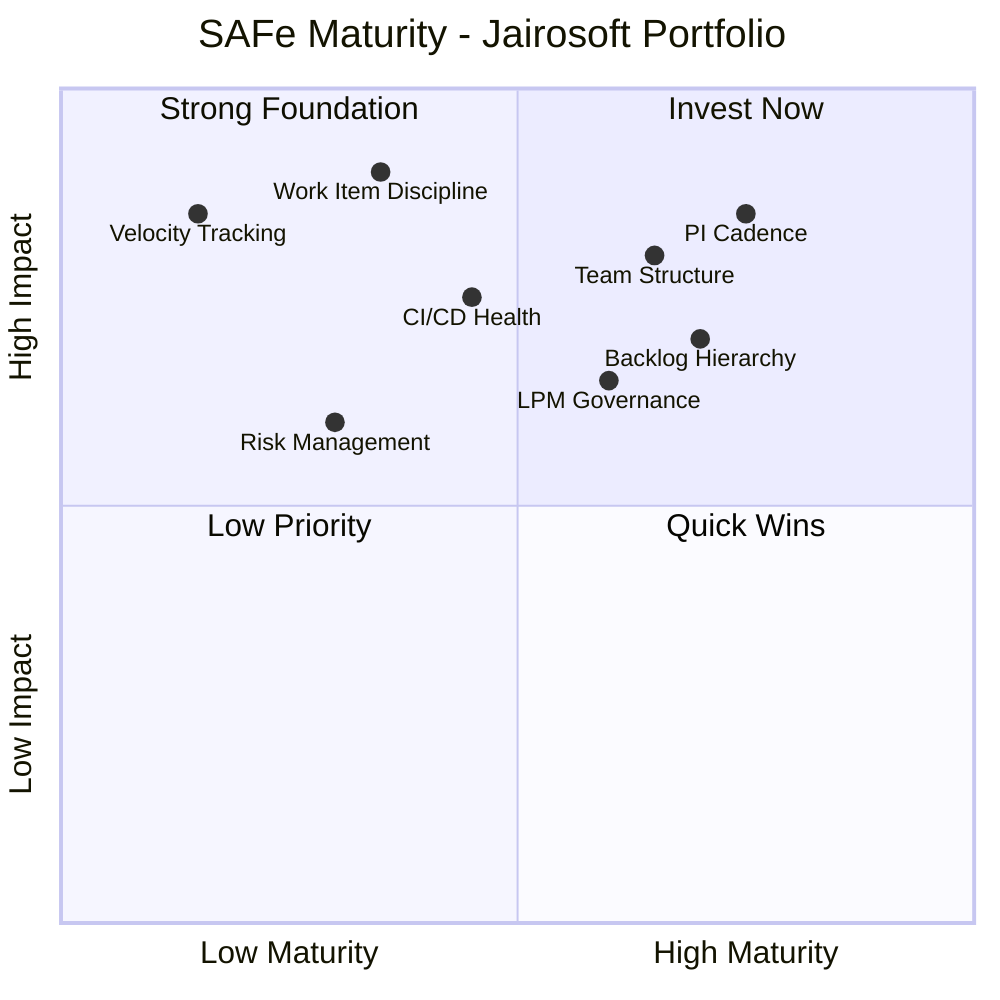

---

## 11. Deep-Dive Audit: JIT Operation Team — Iteration 6.4

**Audit Focus:** JIT Operation Team, Iteration 6.4 (current sprint)
**Sprint Window:** February 23, 2026 – March 8, 2026 (2 weeks)
**Audit Date:** February 24, 2026 (Day 2 of Sprint)
**PI Context:** 2026-PI6, Iteration 4 of 4

---

### 11.1 Sprint Overview

| Metric | Value | SAFe Benchmark | Status |
|---|---|---|---|
| Total Work Items | 17 | 8–12 per team per sprint | Over-committed |
| Total Story Points | 23 pts (15 of 17 items estimated) | Based on team velocity | Unknown (no historical velocity) |
| Team Members with Work | 3 (armelita, Samantha Babael, Teofilo Limpag) | 5–9 per agile team | Understaffed |
| Configured Capacity | **0 hrs/day** | >0 required for burndown | Not configured |
| Days Off Planned | 0 | -- | -- |
| Risks/Impediments Logged | 0 | Track actively | Gap |

### 11.2 Capacity Analysis

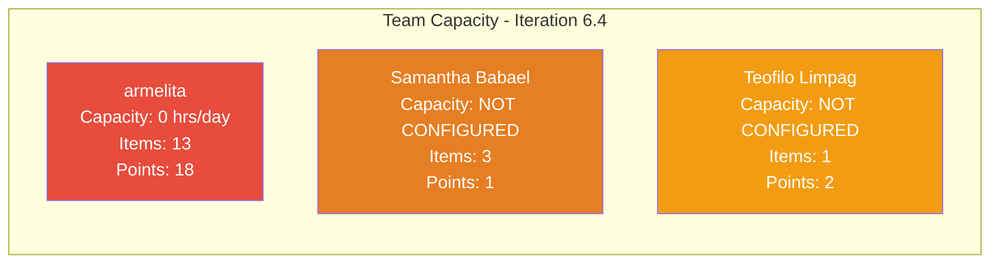

**Critical Finding:** Team capacity is configured at **0 hours/day for all members**. Only 2 members (armelita and grace) are registered as team members in Azure DevOps, yet grace has zero items in this sprint. Samantha Babael and Teofilo Limpag are contributing work but are **not registered as team members** — their capacity is invisible to the system.

This means:

- **Burndown charts are non-functional** (no capacity baseline)
- **Sprint planning was done without capacity data**
- **Predictability is impossible** — the team cannot measure if they are over- or under-committed

---

### 11.3 Sprint Backlog — Full Inventory

#### Work Items by State

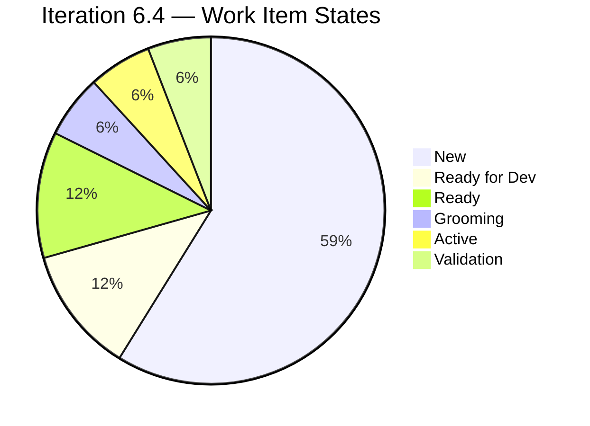

| # | ID | Type | Title | State | Assigned To | Points |
|---|---|---|---|---|---|---|
| 1 | 199246 | User Story | Duplicate eLMS COC 1 | **Active** | Teofilo Limpag | 2 |
| 2 | 197617 | User Story | Signing of Agreement on SK Buhangin Partnership | Ready for Dev | armelita | 1 |
| 3 | 198612 | User Story | Follow up Sam Application as Trainer | Ready for Dev | armelita | 1 |
| 4 | 198630 | Training | Markdown Training for the Employees | Ready | Samantha Babael | -- |
| 5 | 199221 | Courseware | ChatGPT Courseware | Ready | Samantha Babael | -- |
| 6 | 198637 | User Story | Markdown Training Dry-run | Grooming | Samantha Babael | 1 |
| 7 | 198990 | Spike | Social Media Post for SOCOTECH Intern | Validation | Samantha Babael | 1 |
| 8 | 198615 | User Story | Awarding of CSS NC II Certificates | New | armelita | 2 |
| 9 | 199092 | User Story | Submit TESDA Career Guidance Semestral Report CY 2026 | New | armelita | 2 |
| 10 | 199489 | User Story | Interview and Onboard Cor Jesu Interns | New | armelita | 2 |
| 11 | 199496 | User Story | CSS NC II CTC SO Certificate | New | armelita | 1 |
| 12 | 199498 | User Story | Get Copy of Lacking Admin Docs from Ma'am Grace | New | armelita | 1 |
| 13 | 199499 | User Story | Update Company Profile for AC Compliance | New | armelita | 1 |
| 14 | 199500 | User Story | Get Notarized Contract of Employees for AC Compliance | New | armelita | 1 |
| 15 | 199501 | User Story | Get Copy of Building Layout, Shop Layout, and Floor Plan | New | armelita | 1 |
| 16 | 199502 | User Story | Accomplish Checklist F04 AC Compliance | New | armelita | 1 |
| 17 | 199503 | User Story | Repackage AC Compliance | New | armelita | 2 |

> **Note:** Work item 199505 ("Contact Inquirers for their downpayment", 3 pts, armelita) and 198990 ("Social Media Post for SOCOTECH Intern", 1 pt, Samantha Babael) were also found in the Stories backlog assigned to Iteration 6.4 but 199505 did not appear in the iteration work items API query — this may indicate it was added after sprint start or has an iteration path mismatch.

---

### 11.4 Work Item Type Distribution

| Type | Count | Story Points | % of Sprint |
|---|---|---|---|
| User Story | 13 | 19 | 76% |
| Training | 1 | -- | 6% |
| Courseware | 1 | -- | 6% |
| Spike | 1 | 1 | 6% |
| **Total** | **17** | **23** | **100%** |

**Positive trend:** User Stories make up **76% of the sprint** — a significant improvement over the portfolio-wide 6% observed in the general audit (Section 5). This suggests the JIT Operation Team is better aligned with SAFe story-driven delivery practices.

---

### 11.5 Workload Distribution

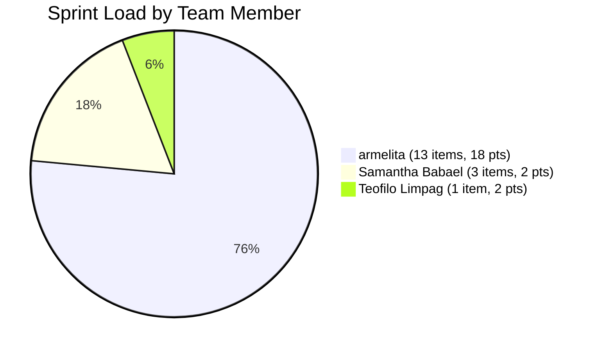

| Team Member | Items | Story Points | % of Sprint Load | States |
|---|---|---|---|---|
| **armelita** | 13 | 18 pts | **76%** | 10 New, 2 Ready for Dev, 1 New |
| Samantha Babael | 3 | 2 pts | 18% | 1 Ready, 1 Grooming, 1 Validation |
| Teofilo Limpag | 1 | 2 pts | 6% | 1 Active |

**Finding:** armelita is carrying **76% of the sprint** with **18 of 23 story points**. Of her 13 items, **10 are still in "New" state** on Day 2 of the sprint. This creates:

1. **Bus factor risk** — if armelita is unavailable, 76% of the sprint is blocked
2. **Flow bottleneck** — no work can progress through the board without her
3. **Potential over-commitment** — 18 points for a single person in 2 weeks, especially without historical velocity data

---

### 11.6 Sprint Theme Analysis

The 17 work items cluster into 4 distinct themes:

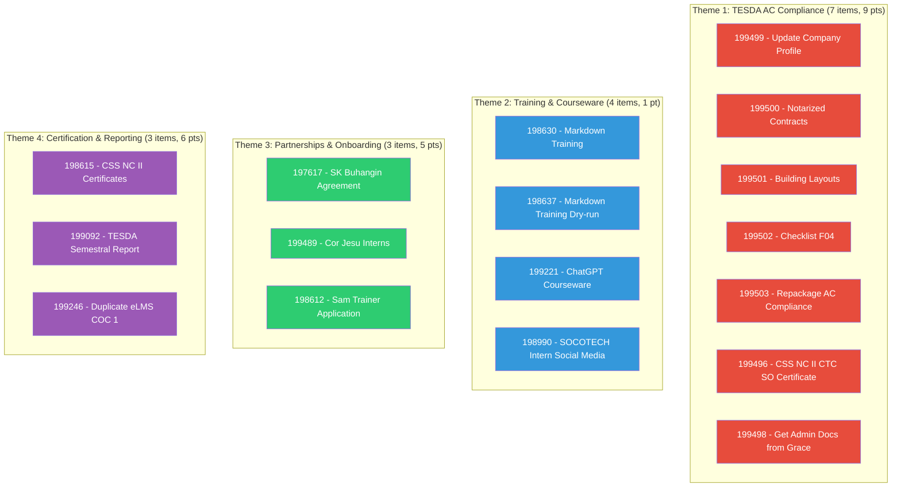

**Observation:** The sprint is dominated by **TESDA Assessment Center (AC) compliance work** — 7 of 17 items (41%) are administrative/regulatory tasks for AC compliance. These are all assigned to armelita and all in "New" state. This represents a **regulatory deadline risk** if this compliance work has a hard due date.

---

### 11.7 State Flow Assessment

```mermaid
stateDiagram-v2
    direction LR
    [*] --> New : 10 items
    New --> Grooming : 0 in transit
    Grooming --> Ready : 0 in transit
    Ready --> ReadyForDev : 0 in transit
    ReadyForDev --> Active : 0 in transit
    Active --> Validation : 0 in transit
    Validation --> Closed : 0 in transit

    state "New (10)" as New
    state "Grooming (1)" as Grooming
    state "Ready (2)" as Ready
    state "Ready for Dev (2)" as ReadyForDev
    state "Active (1)" as Active
    state "Validation (1)" as Validation
```

**Day 2 Sprint Health:**

- **59% of items (10/17) are still in "New"** — they have not entered the team's workflow
- **Only 1 item (6%) is "Active"** — actual work in progress
- **1 item is in "Validation"** — nearing completion
- **1 item is in "Grooming"** — should not be in the sprint if not yet groomed (SAFe: items entering a sprint should be "Ready")

**SAFe Violation:** Item 198637 ("Markdown Training Dry-run") is in **Grooming** state inside an active sprint. Per SAFe, work entering an iteration should meet the team's Definition of Ready. Grooming should happen during backlog refinement *before* sprint planning, not during the sprint.

---

### 11.8 Estimation Quality

| Metric | Value | Assessment |
|---|---|---|
| Items with Story Points | 15 of 17 (88%) | Good |
| Items without Story Points | 2 (Training + Courseware) | Gap — all sprint items should be estimated |
| Point range | 1–3 pts | Healthy — small, right-sized stories |
| Average points per item | 1.5 pts | Low complexity work |
| Total sprint commitment | 23 pts | Unknown if achievable (no velocity baseline) |

**Positive:** Story point adoption is much higher in this sprint (88%) compared to the broader portfolio. Most items are sized at 1–2 points, indicating they are properly decomposed.

**Gap:** The 2 unestimated items (Training and Courseware types) suggest the team does not estimate non-User Story types, which creates blind spots in velocity tracking.

---

### 11.9 SAFe Iteration Compliance Scorecard

| SAFe Practice | Status | Evidence |
|---|---|---|
| **Iteration Planning** | Partial | Items are assigned to the iteration, but capacity is 0 and 59% of items are "New" — suggests items were added without a planning ceremony |
| **Definition of Ready** | Not Enforced | 1 item in "Grooming" state is in the sprint; 10 items in "New" have not been pulled |
| **Capacity-Based Planning** | Not Implemented | All team members show 0 hrs/day capacity |
| **WIP Limits** | Not Visible | No evidence of WIP limits on the board |
| **Daily Stand-up** | Unknown | No ADO evidence (expected — stand-ups are ceremonies, not tracked in ADO) |
| **Iteration Review/Demo** | Unknown | Sprint ends Mar 8 — no demo scheduled visible in ADO |
| **Story Point Estimation** | Mostly Implemented | 88% of items have estimates — good but should be 100% |
| **Acceptance Criteria** | Unknown | Not visible from backlog query — would need item-level detail |
| **Burndown Tracking** | Non-Functional | Capacity = 0 means burndown chart has no baseline |
| **ROAM Risk Management** | Not Implemented | 0 risks/impediments logged for this team |

---

### 11.10 Iteration 6.4 — Risk Register

| # | Risk | Likelihood | Impact | Mitigation |
|---|---|---|---|---|
| R1 | **Single point of failure (armelita)** — 76% of sprint depends on one person | High | Critical | Redistribute work; cross-train team members; add capacity |
| R2 | **No capacity configured** — sprint commitment cannot be validated against available hours | Confirmed | High | Configure capacity for all active team members immediately |
| R3 | **TESDA AC Compliance deadline** — 7 compliance items all in "New" on Day 2 | Medium | High | Clarify regulatory deadline; prioritize if time-bound |
| R4 | **Grooming in-sprint** — item 198637 is not ready for development | Confirmed | Low | Complete grooming or remove from sprint |
| R5 | **No velocity baseline** — team cannot assess if 23 pts is achievable | Confirmed | Medium | Track this sprint's actual completion to establish baseline |
| R6 | **Unregistered team members** — Samantha Babael and Teofilo Limpag not in team roster | Confirmed | Medium | Add them to the JIT Operation Team in ADO settings |

---

### 11.11 Recommendations — Iteration 6.4 Specific

#### Immediate (This Week)

1. **Configure team capacity.** Add armelita, Samantha Babael, and Teofilo Limpag with actual hours/day so the burndown chart becomes functional.
2. **Add Samantha Babael and Teofilo Limpag to the team roster** in Azure DevOps so their work is properly tracked.
3. **Resolve item 198637 (Markdown Training Dry-run).** Either complete grooming and move to "Ready" or remove from the sprint and place it in the next iteration.
4. **Estimate the 2 unestimated items** (198630 - Markdown Training, 199221 - ChatGPT Courseware) to get a complete sprint commitment.
5. **Clarify TESDA AC compliance deadline.** If there is a hard regulatory date, the 7 compliance items should be prioritized above other work.

#### Before Sprint End (Mar 8)

1. **Track completion rate.** At sprint close, record how many of the 23 story points were completed — this becomes the team's first velocity data point.
2. **Conduct Iteration Review.** Demo completed work to stakeholders, especially the TESDA compliance deliverables.
3. **Conduct Iteration Retrospective.** Key topics should include:
   - Why was capacity not configured?
   - Is the workload distribution sustainable?
   - Are items entering sprints in a "Ready" state?

#### For Next Sprint (PI 7 Planning or Iteration 7.1)

1. **Redistribute workload.** Target no single team member owning more than 40% of sprint items.
2. **Establish velocity baseline.** Use this sprint's actual completion as the starting point for future capacity planning.
3. **Log risks formally.** The Risks and Impediments backlog exists but has 0 items — start using it.

---

### 11.12 Iteration 6.4 Health Summary

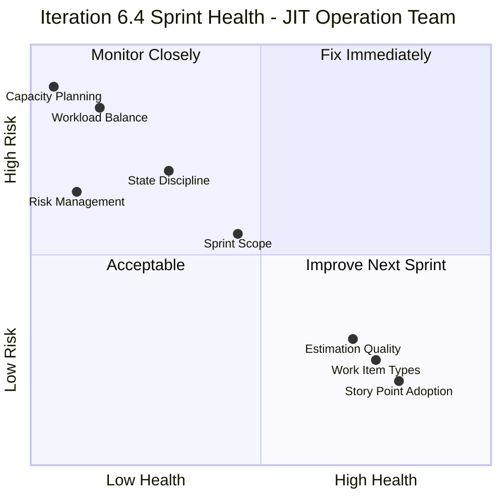

| Dimension | Score | Rating |
|---|---|---|
| Capacity Planning | 1/10 | Critical — not configured |
| Workload Balance | 2/10 | Critical — 76% on one person |
| State Discipline | 4/10 | Poor — 59% still "New" on Day 2 |
| Risk Management | 1/10 | Critical — zero risks logged |
| Sprint Scope | 5/10 | Moderate — 17 items may be over-committed |
| Story Point Adoption | 8/10 | Strong — 88% estimated |
| Work Item Types | 8/10 | Strong — 76% User Stories |
| Estimation Quality | 7/10 | Good — right-sized at 1–3 pts |

**Iteration 6.4 Overall Score: 4.5 / 10 — Needs Significant Improvement**

The sprint has good fundamentals (story-driven, well-estimated, small items) but critical process gaps (no capacity, extreme workload imbalance, no risk tracking) undermine execution predictability.

---

*Section 11 audited by Claude AI Agile PM Consultant on 2026-02-24. Iteration 6.4 is in progress (Day 2 of 14). Data sourced live from Azure DevOps (`dev.azure.com/jairo`, Jairosoft Portfolio project, JIT Operation Team). Based on SAFe 6.0 framework standards from [ScaledAgileFramework.com](https://ScaledAgileFramework.com).*

---

*Report generated by Claude AI Agile PM Consultant on 2026-02-25. Updated 2026-02-24 with Iteration 6.4 deep-dive audit (Section 11). Based on SAFe 6.0 framework standards from [ScaledAgileFramework.com](https://ScaledAgileFramework.com).*
