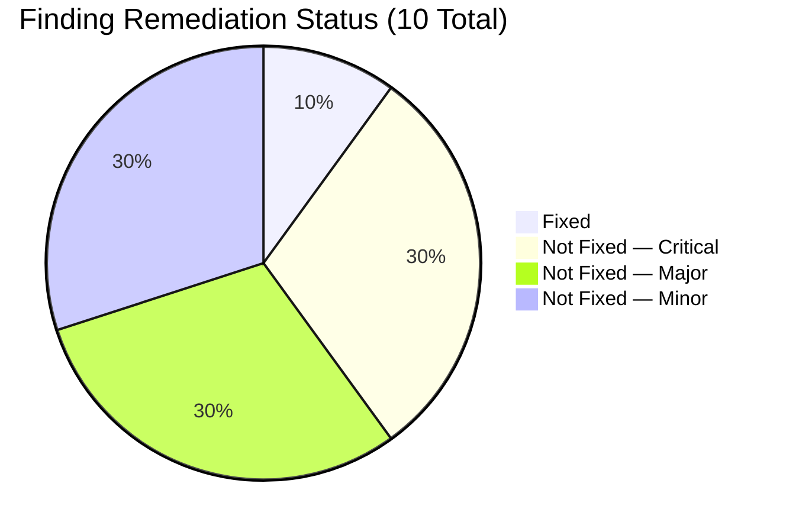
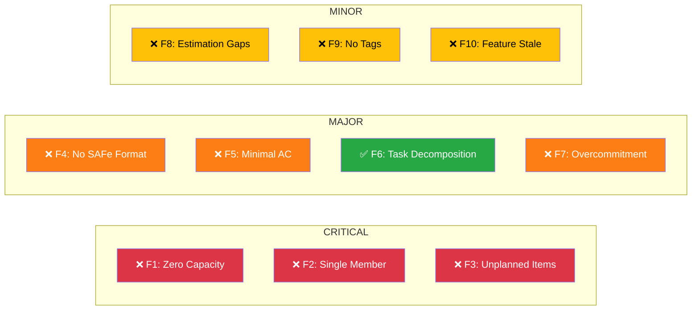
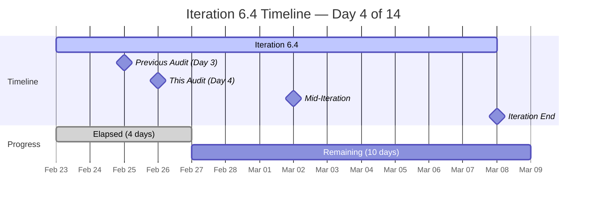
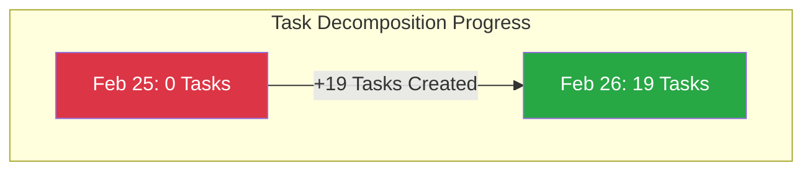
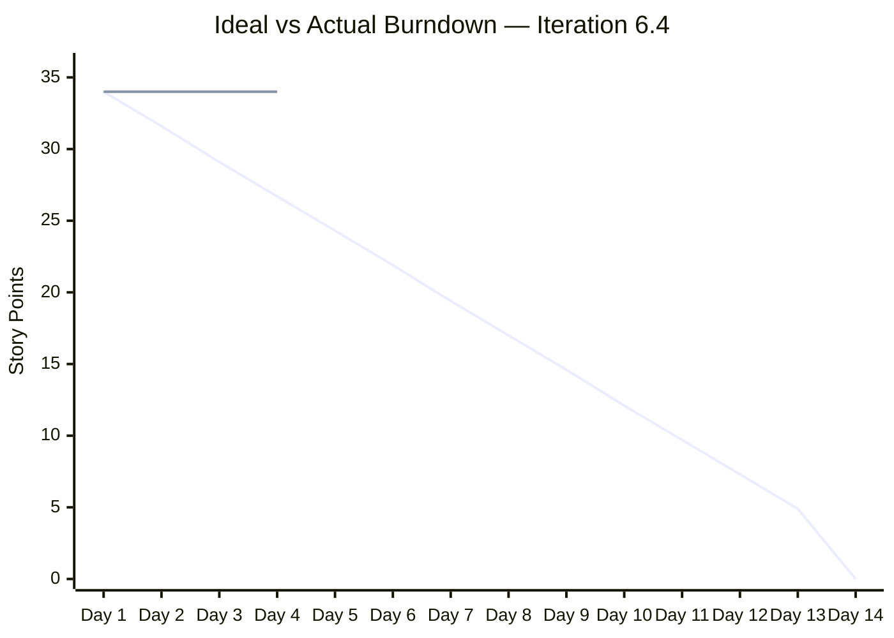
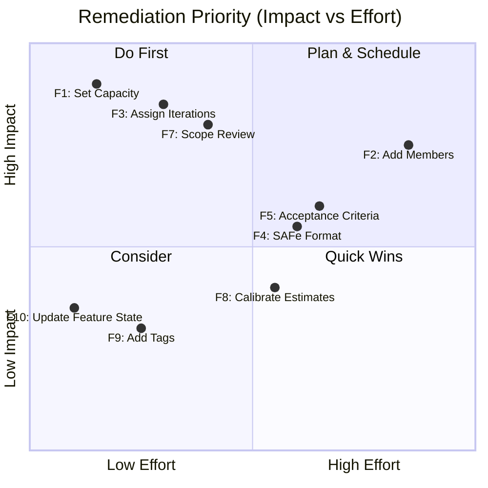

# SAFe Audit Follow-Up Report
## Jairosoft FINOPS — Finance Team — Iteration 6.4

| Field | Value |
|---|---|
| **Date** | February 26, 2026 |
| **Auditor** | Claude (AI Agile Consultant) |
| **Framework** | SAFe 6.0 |
| **Organization** | dev.azure.com/jairo |
| **Project** | Jairosoft FINOPS |
| **Team** | Finance Team |
| **Iteration** | Iteration 6.4 (Feb 23 – Mar 8, 2026) |
| **Iteration Day** | Day 4 of 14 |
| **Previous Audit** | AUDIT_2026-02-25_0700.md (Overall Score: 35/100) |
| **Report Type** | Follow-Up / Remediation Tracking |

---

## 1. Executive Summary

This report tracks the remediation status of **10 findings** identified in the February 25, 2026 SAFe audit of the Finance Team's Iteration 6.4. After one day of remediation opportunity, **1 of 10 findings has been resolved**, while **9 remain open**. The overall health score has improved marginally from **35/100 to 38/100**, driven entirely by the addition of task decomposition across all stories.

A new work item (#199722) was also observed, appearing to be a SAFe format template or learning exercise, which signals positive intent toward process improvement but does not yet constitute systemic adoption of SAFe practices.

---

## 2. Remediation Summary Dashboard

---

## 3. Iteration Snapshot — Changes Since Last Audit

| Metric | Feb 25 (Day 3) | Feb 26 (Day 4) | Change |
|---|---|---|---|
| Total Stories in Iteration | 15 | 16 | +1 (new #199722) |
| Total Story Points | 34 SP | 34 SP | No change |
| Child Tasks | 0 | 19 | **+19** ✅ |
| Active Stories | 4 | 4 | No change |
| New Stories | 11 | 12 | +1 |
| Resolved/Closed Stories | 0 | 0 | No change |
| Team Members | 1 (Grace) | 1 (Grace) | No change |
| Capacity Configured | 0 hrs/day | 0 hrs/day | No change |
| Unplanned Backlog Items | 8 | 8 | No change |
| SP Completed (Burndown) | 0 SP | 0 SP | No change |

---

## 4. Detailed Finding Remediation Status

### Finding 1 — CRITICAL — Zero Capacity Configured
**Status: ❌ NOT FIXED**

| Aspect | Details |
|---|---|
| Original Finding | Team capacity set to 0 hours/day for all members |
| Current State | Capacity remains at **0 hrs/day** (Documentation activity) for Grace |
| Impact | Burndown chart, velocity tracking, and capacity-based planning are non-functional |
| Days Open | 2 |

**SAFe Reference:** Capacity-based planning is foundational to iteration execution (SAFe Iteration Planning). Without configured capacity, the team cannot establish a realistic iteration commitment or track progress against available hours.

**Recommendation (URGENT):** Configure Grace's daily capacity immediately (typically 5-6 hrs/day for focused work). This is a 2-minute fix that unlocks all planning and tracking features.

---

### Finding 2 — CRITICAL — Single Team Member
**Status: ❌ NOT FIXED**

| Aspect | Details |
|---|---|
| Original Finding | Only one team member (Grace) assigned to the Finance Team |
| Current State | Still only Grace; no additional members added |
| Impact | 34 SP committed to a single person creates a bus-factor of 1 and eliminates collaboration benefits |
| Days Open | 2 |

**SAFe Reference:** SAFe emphasizes cross-functional Agile Teams of 5-11 members (SAFe Team). A single-member "team" cannot practice pair programming, peer review, or knowledge sharing.

**Recommendation:** Evaluate whether additional finance/operations staff should be onboarded to the team, or whether the iteration scope should be reduced to match single-person capacity.

---

### Finding 3 — CRITICAL — 8 Items Missing Iteration Assignment
**Status: ❌ NOT FIXED**

| Aspect | Details |
|---|---|
| Original Finding | 8 work items at root "Jairosoft FINOPS" iteration path instead of Iteration 6.4 |
| Current State | All 8 items remain at root iteration path |
| Affected Items | #198639, #199347, #199350, #199469, #198611, #198635, #198645, #198647 |
| Impact | Items invisible to iteration board, excluded from burndown, untracked progress |
| Days Open | 2 |

**SAFe Reference:** All committed work must be visible on the iteration board (SAFe Team Backlog). Items without proper iteration assignment represent hidden work that distorts velocity and planning accuracy.

**Recommendation:** Assign all 8 items to Iteration 6.4 or explicitly defer them to the team backlog. Additionally, #198647 (AFS Submission) remains unassigned — it needs an owner.

---

### Finding 4 — MAJOR — Stories Lack SAFe User Story Format
**Status: ❌ NOT FIXED (Positive Signal Detected)**

| Aspect | Details |
|---|---|
| Original Finding | Stories use simple titles without "As a [role], I want [goal], so that [benefit]" format |
| Current State | Original 15 stories unchanged; however, **new item #199722 ("test") uses SAFe format** |
| New Item #199722 | Title: "test" — Description contains: "As a [type of user], I want [an action] so that [a benefit/a value]" with structured acceptance criteria |
| Impact | Stories lack role context, goal clarity, and business value articulation |
| Days Open | 2 |

**Positive Signal:** The creation of #199722 with a proper SAFe user story template suggests the team is learning and experimenting with the format. This is an encouraging step that should be expanded to all stories.

**SAFe Reference:** User Stories should follow the standard format to ensure clear communication of user needs and business value (SAFe Story).

**Recommendation:** Use #199722 as a template to retroactively update the 15 existing stories. Prioritize the 4 Active stories first.

---

### Finding 5 — MAJOR — Minimal Acceptance Criteria
**Status: ❌ NOT FIXED**

| Aspect | Details |
|---|---|
| Original Finding | Stories contain single-line acceptance criteria lacking testable conditions |
| Current State | Acceptance criteria remain single-line across all original stories |
| Exception | #199722 contains structured AC with Given/When/Then format (template) |
| Impact | No clear definition of "done" for quality assurance or stakeholder validation |
| Days Open | 2 |

**SAFe Reference:** Acceptance criteria should be specific, measurable, and testable conditions that define when a story is complete (SAFe Story > Acceptance Criteria).

**Recommendation:** Adopt Given/When/Then (Gherkin) format from the #199722 template for all stories. Each story should have 2-4 testable acceptance criteria.

---

### Finding 6 — MAJOR — No Task Decomposition
**Status: ✅ FIXED**

| Aspect | Details |
|---|---|
| Original Finding | Zero child Tasks existed for any of the 15 stories |
| Current State | **19 child Tasks created** across all 15 original stories |
| Impact | Task-level tracking now possible; daily progress visibility improved |
| Resolution Date | Between Feb 25-26, 2026 |

**Examples of New Tasks Created:**

| Task ID | Title | Parent Story |
|---|---|---|
| #199708 | Prepare Cashnet for Payroll | #199222 |
| #199710 | Deploy new Cashnet interface | #199351 |
| #199711 | Migrate old transactions | #199351 |
| #199712 | User training for new Cashnet | #199351 |

**Commendation:** The team responded promptly to the audit finding by creating task decomposition within 24 hours. This demonstrates responsiveness to process feedback and enables daily standup tracking.

**Remaining Gap:** Tasks should include effort estimates (hours) once capacity is configured (Finding 1).

---

### Finding 7 — MAJOR — Overcommitment Risk
**Status: ❌ NOT FIXED**

| Aspect | Details |
|---|---|
| Original Finding | 34 Story Points committed to single team member with zero capacity configured |
| Current State | Still 34 SP, 1 person, 0 configured capacity |
| Burndown | 0 SP completed after 4 days (29% of iteration elapsed) |
| Impact | High risk of unfinished work, potential velocity distortion |
| Days Open | 2 |

**SAFe Reference:** Teams should commit to work that fits within their demonstrated velocity and available capacity (SAFe Iteration Planning). A flat burndown line through Day 4 indicates either no work is completing or work items aren't being updated.

**Recommendation:** Conduct an immediate scope review. With 10 days remaining and 34 SP untouched, the team should identify which stories are achievable and defer the rest to the next iteration.

---

### Finding 8 — MINOR — Inconsistent Story Point Estimation
**Status: ❌ NOT FIXED**

| Aspect | Details |
|---|---|
| Original Finding | Non-Fibonacci story points, same-size estimates across different complexity stories |
| Current State | Same estimation pattern persists; new item #199722 has 0 SP |
| Impact | Reduces accuracy of velocity metrics and forecasting |
| Days Open | 2 |

**Recommendation:** Conduct a story point calibration session using Planning Poker before Iteration 6.5.

---

### Finding 9 — MINOR — No Tags or Labels
**Status: ❌ NOT FIXED**

| Aspect | Details |
|---|---|
| Original Finding | No work items use tags for categorization |
| Current State | Still no tags applied to any items |
| Impact | Cannot filter, report, or analyze work by category |
| Days Open | 2 |

**Recommendation:** Implement a minimal tag taxonomy (e.g., "compliance", "migration", "BAU", "training") during backlog refinement.

---

### Finding 10 — MINOR — Feature #197084 Stale in "Approved" State
**Status: ❌ NOT FIXED**

| Aspect | Details |
|---|---|
| Original Finding | Feature #197084 remains in "Approved" state despite having active child stories |
| Current State | Feature still in "Approved" — not transitioned to "Active" |
| Impact | Portfolio-level Kanban inaccurate; stakeholders see feature as not started |
| Days Open | 2 |

**SAFe Reference:** Feature states should reflect actual execution progress. When child stories move to Active, the parent Feature should transition accordingly (SAFe Portfolio Kanban).

**Recommendation:** Transition Feature #197084 to "Active" to align with the reality that child stories are in progress.

---

## 5. New Observations

### 5.1 New Work Item #199722 — "test"

A new story (#199722) was added to Iteration 6.4 since the last audit. While titled "test", it contains a properly structured SAFe user story template:

- **User Story Format:** "As a [type of user], I want [an action] so that [a benefit/a value]"
- **Acceptance Criteria:** Structured with Given/When/Then format
- **Story Points:** 0 (unestimated)
- **Assigned To:** Unassigned
- **State:** New

**Assessment:** This appears to be a learning/template exercise, which is a positive indicator of the team's willingness to adopt SAFe practices. However, it should be either converted into a real story with proper title and estimates, or removed from the iteration to avoid inflating item counts.

### 5.2 Sub-Finding: #198647 Still Unassigned

Work item #198647 (AFS Submission) continues to have no assignee. Given the single-member team, this is likely Grace's work, but it should be formally assigned for accountability and tracking.

---

## 6. Remediation Priority Matrix

### Recommended Remediation Order (Day 4-5):

1. **F1 — Set Capacity** (2 minutes) → Unlocks burndown and planning tools
2. **F3 — Assign Iteration Paths** (10 minutes) → Makes all work visible on board
3. **F10 — Transition Feature to Active** (1 minute) → Aligns portfolio view
4. **F7 — Scope Review** (30 minutes) → Realistic commitment for remaining 10 days
5. **F9 — Add Tags** (15 minutes) → Enables categorized reporting
6. **F4 & F5 — Update Story Format & AC** (1-2 hours) → Quality improvement for current stories

---

## 7. Updated Health Score

| Dimension | Weight | Previous Score | Current Score | Change | Notes |
|---|---|---|---|---|---|
| Iteration Planning | 20% | 3/10 | 3/10 | — | Capacity still unconfigured |
| Work Item Quality | 20% | 3/10 | 3.5/10 | +0.5 | Template item shows progress |
| Team Structure | 15% | 2/10 | 2/10 | — | Still single member |
| Task Management | 15% | 1/10 | 6/10 | **+5.0** | 19 tasks created |
| Backlog Health | 15% | 4/10 | 4/10 | — | 8 items still unplanned |
| Process Compliance | 15% | 4/10 | 4.5/10 | +0.5 | SAFe template experiment |

**Previous Overall Score: 35/100**
**Current Overall Score: 38/100** (+3 points)

```mermaid
xychart-beta
    title "Health Score by Dimension"
    x-axis ["Iter Planning","Work Item Quality","Team Structure","Task Mgmt","Backlog Health","Process Compliance"]
    y-axis "Score (out of 10)" 0 --> 10
    bar "Feb 25" [3,3,2,1,4,4]
    bar "Feb 26" [3,4,2,6,4,5]
```

---

## 8. Risk Register

| Risk | Severity | Likelihood | Trend | Mitigation |
|---|---|---|---|---|
| Iteration failure (0 SP completed at Day 4) | Critical | High | ↑ Increasing | Immediate scope review; focus on 2-3 stories |
| Single point of failure (Grace) | Critical | High | → Stable | Document processes; cross-train if possible |
| Hidden work (8 unplanned items) | High | Certain | → Stable | Assign iteration paths immediately |
| Inaccurate portfolio view | Medium | Certain | → Stable | Update Feature #197084 state |
| Velocity data corruption | Medium | High | → Stable | Configure capacity; update states as work completes |

---

## 9. Conclusion

The Finance Team has demonstrated responsiveness by addressing **Finding 6 (Task Decomposition)** within 24 hours — adding 19 child tasks across all stories. The creation of a SAFe-formatted template story (#199722) also signals positive intent toward process improvement.

However, with **9 of 10 findings still open** and **zero story points completed through Day 4** of a 14-day iteration, the team faces a critical juncture. The most impactful actions the team can take today are:

1. **Configure capacity** (Finding 1) — a 2-minute fix that enables all planning tools
2. **Assign iteration paths** (Finding 3) — makes all work visible and trackable
3. **Conduct a scope review** (Finding 7) — with 71% of the iteration remaining but 100% of work untouched, the team must identify a realistic subset of stories to complete

The next follow-up audit should be scheduled for **March 2, 2026 (Day 8 — Mid-Iteration)** to assess progress before the iteration closes on March 8.

---

*Report generated: February 26, 2026 | SAFe 6.0 Framework | Jairosoft FINOPS — Finance Team*
*Previous Audit: AUDIT_2026-02-25_0700.md (Score: 35/100)*
*This Audit: AUDIT_2026-02-26_0700.md (Score: 38/100)*
