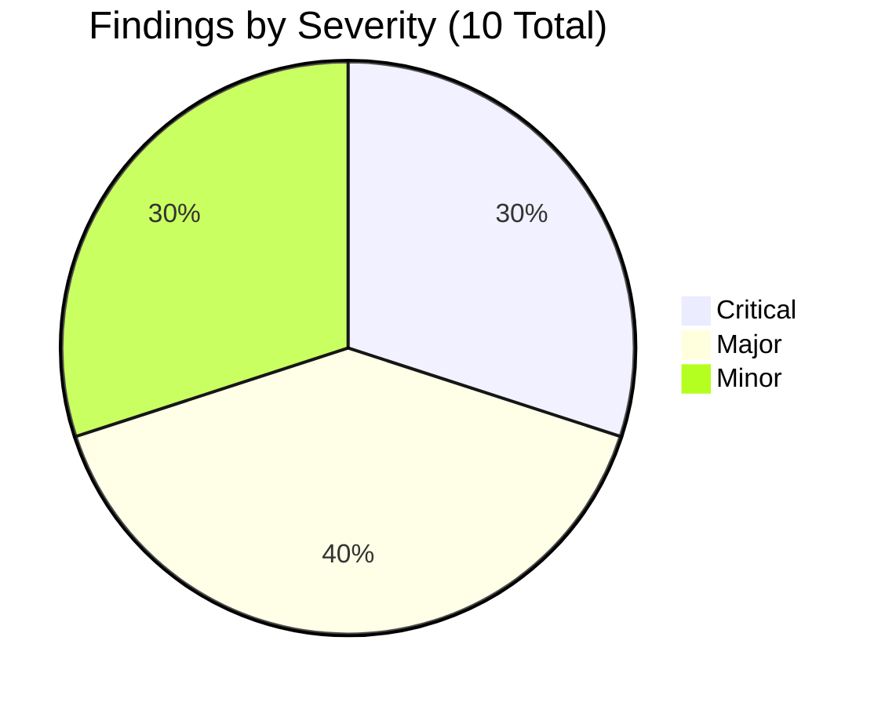
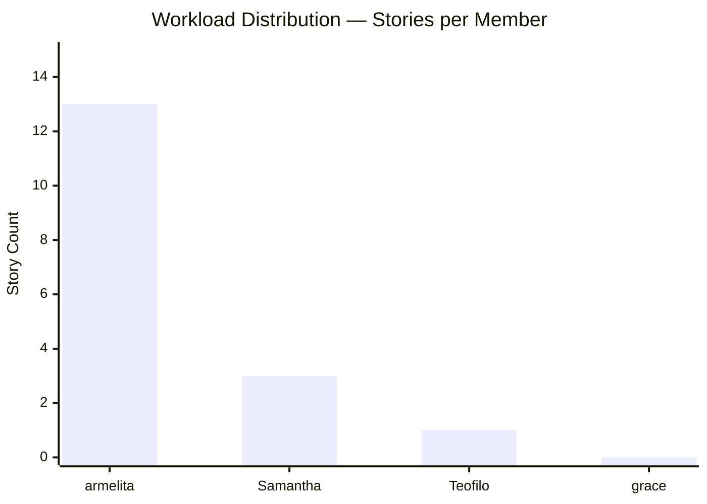
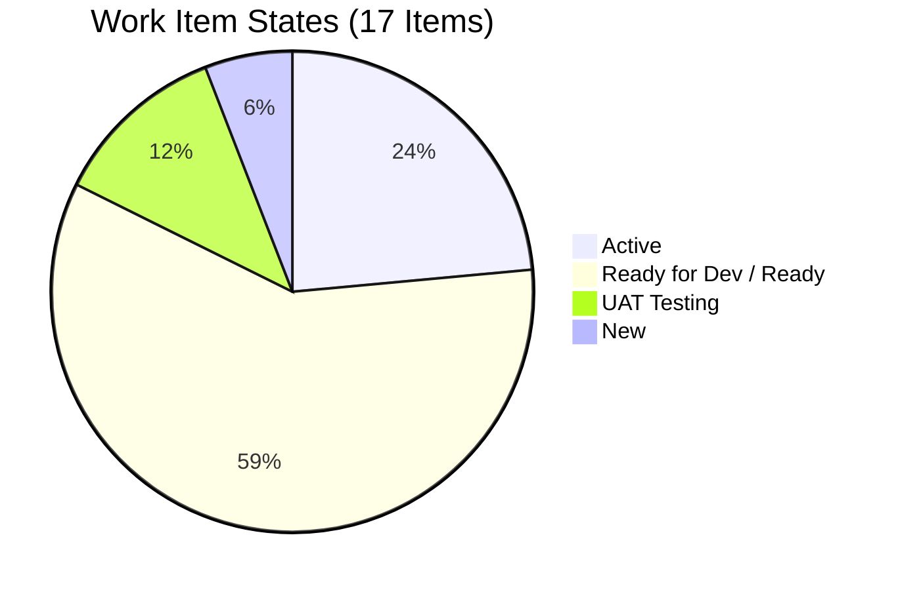
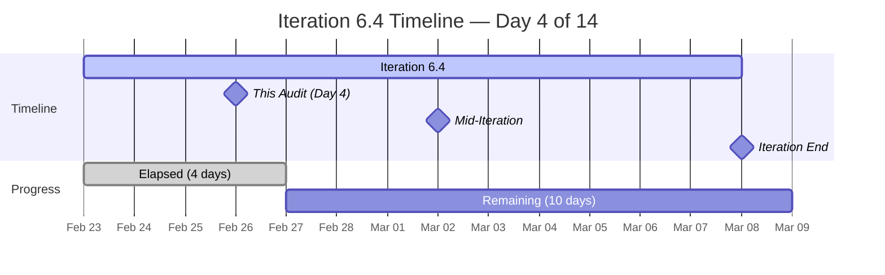
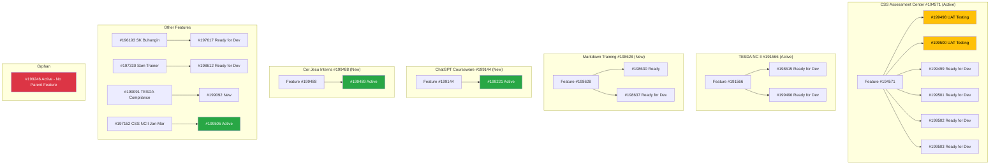
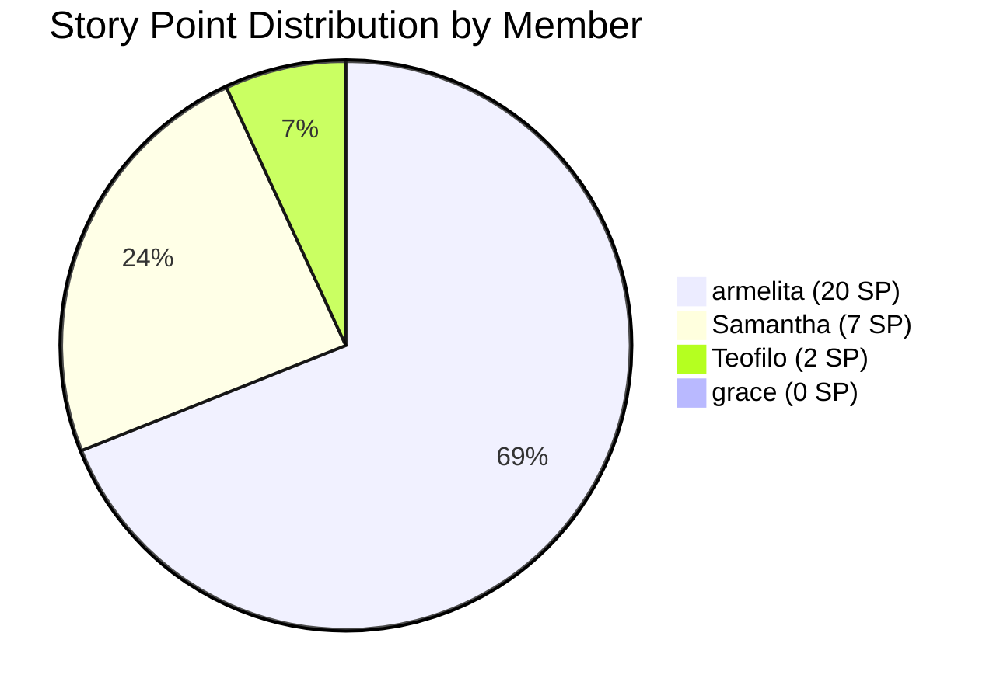
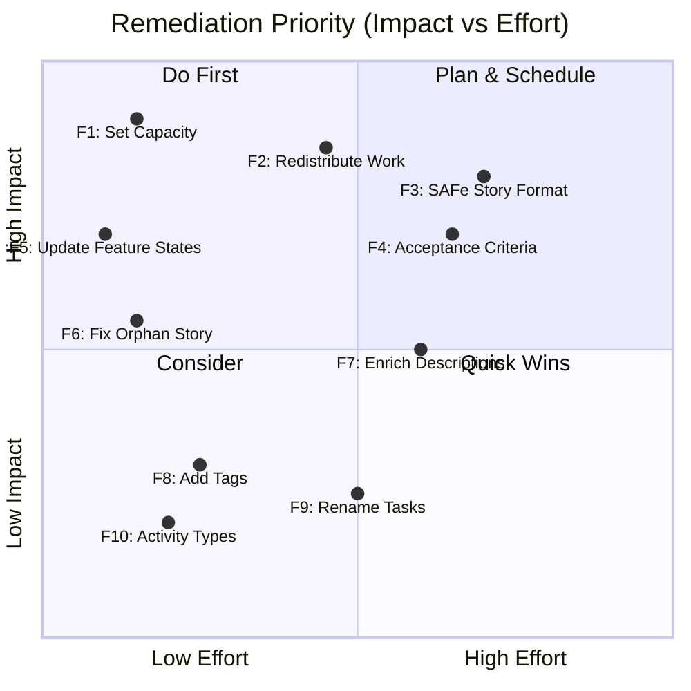
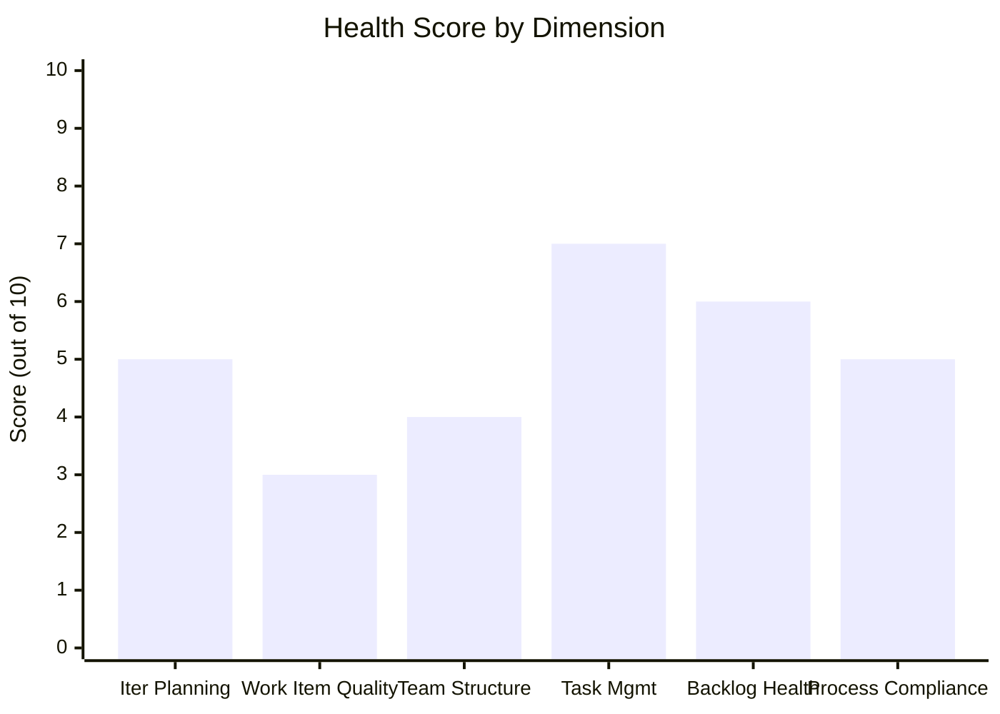

# SAFe Audit Report
## Jairosoft Portfolio — JIT Operation Team — Iteration 6.4

| Field | Value |
|---|---|
| **Date** | February 26, 2026 |
| **Auditor** | Claude (AI Agile Consultant) |
| **Framework** | SAFe 6.0 |
| **Organization** | dev.azure.com/jairo |
| **Project** | Jairosoft Portfolio |
| **Team** | JIT Operation Team |
| **Iteration** | Iteration 6.4 (Feb 23 – Mar 8, 2026) |
| **Iteration Day** | Day 4 of 14 (29% elapsed) |
| **Board URL** | [ADO Board](https://dev.azure.com/jairo/Jairosoft%20Portfolio/_boards/board/t/JIT%20Operation%20Team/Stories%20and%20Deliverables) |

---

## 1. Executive Summary

The JIT Operation Team is currently executing Iteration 6.4 with **17 work items** totaling **28 Story Points** across **4 team members**. The team is showing encouraging signs of progress — 2 stories are already in **UAT Testing** with closed tasks, and 4 stories are **Active**. Task decomposition is well-practiced with **20 child tasks** across the iteration.

However, the audit identifies **10 findings** across capacity planning, work item quality, workload distribution, and SAFe compliance. The most critical issues are: **3 of 4 team members have zero capacity configured**, **severe workload imbalance** (one member owns 76% of stories), and **stories lack SAFe user story format**.

**Overall Health Score: 48/100**

---

## 2. Team Structure & Capacity

### 2.1 Team Members

| Member | Capacity (hrs/day) | Stories Assigned | Story Points | Activity |
|---|---|---|---|---|
| armelita | **6** | 13 | 20 SP | Documentation |
| Samantha Babael | 0 | 3 | 7 SP | Documentation |
| Teofilo Limpag | 0 | 1 | 2 SP | Documentation |
| grace | 0 | 0 | 0 SP | Documentation |
| **TOTAL** | **6 hrs/day** | **17** | **28 SP** (note: #199246 has no SP field returned—counted as 2) | — |

### 2.2 Capacity Analysis

- **Total Capacity:** 6 hrs/day × 10 remaining workdays = **60 hours remaining**
- **Effective capacity used:** Only **1 of 4 members** (25%) has configured capacity
- **Work per SP:** 60 hrs ÷ 28 SP = ~2.1 hrs/SP available (across entire team, but only armelita has hours)

---

## 3. Iteration Snapshot

### 3.1 Work Item Summary

| Metric | Value |
|---|---|
| Total Work Items | 17 |
| Total Story Points | 28 SP |
| Work Item Types | User Story (14), Training (1), Courseware (1), User Story–no parent (1) |
| Child Tasks | 20 |
| Parent Features | 9 |
| Closed Tasks | 2 |
| Stories in UAT | 2 |
| Active Stories | 4 |
| Ready for Dev / Ready | 10 |
| New Stories | 1 |

### 3.2 State Distribution

### 3.3 Iteration Timeline

---

## 4. Work Item Inventory

### 4.1 Stories and Deliverables

| ID      | Type       | Title                                           | State         | Assigned To | SP  | Parent Feature |
| ------- | ---------- | ----------------------------------------------- | ------------- | ----------- | --- | -------------- |
| #199246 | User Story | Duplicate eLMS COC 1                            | Active        | Teofilo     | 2   | *None*         |
| #197617 | User Story | Signing of Agreement on SK Buhangin Partnership | Ready for Dev | armelita    | 1   | #196193        |
| #198612 | User Story | Follow up Sam Application as Trainer            | Ready for Dev | armelita    | 1   | #197330        |
| #198615 | User Story | Awarding of CSS NC II Certificates              | Ready for Dev | armelita    | 2   | #191566        |
| #198630 | Training   | Markdown Training for the Employees             | Ready         | Samantha    | 3   | #198628        |
| #198637 | User Story | Markdown Training Dry-run                       | Ready for Dev | Samantha    | 1   | #198628        |
| #199092 | User Story | Submit TESDA Career Guidance Semestral Report   | New           | armelita    | 2   | #199091        |
| #199221 | Courseware | ChatGPT Courseware                              | Active        | Samantha    | 3   | #199144        |
| #199489 | User Story | Interview and Onboard Cor Jesu Interns          | Active        | armelita    | 2   | #199488        |
| #199496 | User Story | CSS NC II CTC SO Certificate                    | Ready for Dev | armelita    | 1   | #191566        |
| #199498 | User Story | Get Copy of Lacking Admin Docs                  | UAT Testing   | armelita    | 1   | #194571        |
| #199499 | User Story | Update Company Profile for AC Compliance        | Ready for Dev | armelita    | 1   | #194571        |
| #199500 | User Story | Get Notarized Contract of Employees             | UAT Testing   | armelita    | 1   | #194571        |
| #199501 | User Story | Get Copy of Building Layout/Floor Plan          | Ready for Dev | armelita    | 1   | #194571        |
| #199502 | User Story | Accomplish Checklist F04 AC Compliance          | Ready for Dev | armelita    | 1   | #194571        |
| #199503 | User Story | Repackage AC Compliance                         | Ready for Dev | armelita    | 2   | #194571        |
| #199505 | User Story | Contact Inquirers for their downpayment         | Active        | armelita    | 3   | #197152        |

### 4.2 Parent Features

| Feature ID | Title | State | Active Children in Iteration |
|---|---|---|---|
| #191566 | Computer Systems Servicing TESDA NC II Sept 29, 2025 Class | Active | 2 (#198615, #199496) |
| #194571 | CSS Assessment Center Application | Active | 6 (#199498-#199503) |
| #196193 | SK Buhangin Sponsored Bubble 101 Training | Active | 1 (#197617) |
| #197152 | Class for CSS NCII Training Jan-Mar 2026 | **New** | 1 (#199505 — Active) |
| #197330 | Add Sam as Bubble.io MCC Trainer | Active | 1 (#198612) |
| #198628 | Markdown Internal Training | **New** | 2 (#198630, #198637) |
| #199091 | TESDA Compliance PI6 | Active | 1 (#199092) |
| #199144 | ChatGPT Courseware | **New** | 1 (#199221 — Active) |
| #199488 | Cor Jesu College Interns | **New** | 1 (#199489 — Active) |

### 4.3 Feature-Story Hierarchy

---

## 5. Detailed Findings

### Finding 1 — CRITICAL — 3 of 4 Members Have Zero Capacity

| Aspect | Details |
|---|---|
| Finding | Teofilo (0 hrs), Samantha (0 hrs), and grace (0 hrs) have no capacity configured |
| Current State | Only armelita has 6 hrs/day configured. Total team capacity: 6 hrs/day |
| Impact | Burndown charts are inaccurate; team velocity cannot be calculated properly; capacity-based planning is undermined |
| Affected Members | Teofilo Limpag, Samantha Babael, grace |

**SAFe Reference:** Every team member with committed work should have capacity configured to enable realistic iteration planning (SAFe Iteration Planning).

**Recommendation:** Configure capacity for all active members immediately. Samantha has 3 stories (7 SP) — she needs capacity set. Teofilo has 1 story — he needs capacity too. Grace has 0 stories; determine if she should have iteration work or if she's supporting other teams.

---

### Finding 2 — CRITICAL — Severe Workload Imbalance

| Aspect | Details |
|---|---|
| Finding | armelita owns 13 of 17 stories (76%) and 20 of 28 SP (71%) |
| Current State | Samantha: 3 stories (7 SP), Teofilo: 1 story (2 SP), grace: 0 stories |
| Impact | Bus-factor risk; armelita is a single point of failure; potential burnout; grace is completely idle |

**SAFe Reference:** Work should be distributed across team members to enable collaboration, reduce risk, and avoid bottlenecks (SAFe Team).

**Recommendation:** Redistribute some of armelita's "Ready for Dev" stories to Samantha, Teofilo, or grace. The AC Compliance cluster (#199499-#199503) could be partially reassigned.

---

### Finding 3 — CRITICAL — Stories Lack SAFe User Story Format

| Aspect | Details |
|---|---|
| Finding | All 17 items use task-like titles instead of "As a [role], I want [goal], so that [benefit]" |
| Examples | "Follow up Sam Application as Trainer", "Get Copy of Lacking Admin Docs", "Accomplish Checklist F04" |
| Impact | Stories read as tasks/to-do items rather than value-driven user stories; business value and user context are missing |

**SAFe Reference:** User Stories should articulate who benefits, what they need, and why, using the standard format (SAFe Story).

**Recommendation:** Rewrite stories using SAFe format. Example:
- **Before:** "Get Notarized Contract of Employees for AC Compliance"
- **After:** "As a JIT Operations Manager, I want to obtain notarized employee contracts, so that we meet TESDA Assessment Center compliance requirements"

---

### Finding 4 — MAJOR — Minimal Acceptance Criteria

| Aspect | Details |
|---|---|
| Finding | Acceptance criteria are single-line phrases lacking testable conditions |
| Examples | "Done follow up", "Successful dry-run", "Got the printed copy", "Done CTC" |
| Impact | No clear definition of done; quality cannot be validated objectively |

**Sample Analysis:**

| Story | Acceptance Criteria | Assessment |
|---|---|---|
| #198612 Follow up Sam Application | "Done follow up" | Not testable — what constitutes "done"? |
| #198637 Markdown Training Dry-run | "Successful dry-run" | Not measurable — how is success defined? |
| #199496 CSS NC II CTC SO Certificate | "Done CTC" | Ambiguous acronym; no measurable outcome |
| #199221 ChatGPT Courseware | "Approved Syllabus and Courseware" | Better — has approval gate, but lacks specifics |

**SAFe Reference:** Acceptance criteria should be specific, measurable, and testable (SAFe Story > Acceptance Criteria). Recommend Gherkin (Given/When/Then) format.

---

### Finding 5 — MAJOR — 4 Features in "New" State with Active Children

| Aspect | Details |
|---|---|
| Finding | Features #197152, #198628, #199144, and #199488 are in "New" state but have active/in-progress child stories |
| Impact | Portfolio Kanban shows features as not started when work is actually underway; stakeholders get inaccurate status |

| Feature | State | Active Child Story |
|---|---|---|
| #197152 Class for CSS NCII Training | **New** | #199505 (Active) |
| #198628 Markdown Internal Training | **New** | #198630 (Ready), #198637 (Ready for Dev) |
| #199144 ChatGPT Courseware | **New** | #199221 (Active) |
| #199488 Cor Jesu College Interns | **New** | #199489 (Active) |

**SAFe Reference:** Feature states should mirror the most advanced state of their child stories (SAFe Portfolio Kanban).

**Recommendation:** Transition these 4 features to "Active" to accurately reflect work in progress.

---

### Finding 6 — MAJOR — Orphan Story #199246

| Aspect | Details |
|---|---|
| Finding | Story #199246 "Duplicate eLMS COC 1" has no parent Feature |
| Current State | Active, assigned to Teofilo (2 SP), AreaPath = "Jairo Institute of Technology" (differs from team standard path) |
| Impact | Work not traceable to a Feature/Epic; portfolio visibility gap; different area path may cause board confusion |

**SAFe Reference:** All stories should trace up to a Feature for portfolio traceability and value stream alignment (SAFe Team Backlog).

**Recommendation:** Create or assign a parent Feature for this story. Align the AreaPath to "JIT Courseware Training Operations" to match the rest of the team's items.

---

### Finding 7 — MAJOR — Descriptions Duplicate Titles

| Aspect | Details |
|---|---|
| Finding | Most story descriptions simply repeat the title in a bullet list, adding no context |
| Examples | #199501 description: "Get Copy of Building Layout, Shop Layout, and Floor Plan" (same as title) |
| Impact | Descriptions should provide context, dependencies, implementation notes, or background that the title alone cannot convey |

**SAFe Reference:** Story descriptions should complement the title with enough context for any team member to understand and implement the work (SAFe Story).

---

### Finding 8 — MINOR — No Tags Used

| Aspect | Details |
|---|---|
| Finding | Zero tags applied across all 17 work items |
| Impact | Cannot categorize, filter, or generate reports by work theme (e.g., TESDA compliance, training, courseware, admin) |

**Recommendation:** Implement tags such as: `TESDA-compliance`, `training`, `courseware`, `AC-compliance`, `admin`, `intern-program`.

---

### Finding 9 — MINOR — Task Titles Duplicate Parent Stories

| Aspect | Details |
|---|---|
| Finding | 11 of 20 tasks have identical or near-identical titles to their parent story |
| Examples | Task #199660 "Contact Inquirers for their downpayment" under Story #199505 with the same title |
| Impact | Tasks should represent specific sub-steps, not repeat the story. This makes daily standup tracking and burndown less meaningful |

**Recommendation:** Decompose tasks into specific actions. For example, Story "Contact Inquirers for downpayment" should have tasks like: "Compile inquirer contact list", "Draft downpayment reminder message", "Send communications and log responses".

---

### Finding 10 — MINOR — Single Activity Type ("Documentation") for All Members

| Aspect | Details |
|---|---|
| Finding | All 4 team members are configured with only "Documentation" as their activity type |
| Impact | Cannot distinguish capacity allocated to development, testing, training, or admin work |

**Recommendation:** Add activity types that reflect actual work: "Training Delivery", "Courseware Development", "TESDA Compliance", "Administration".

---

## 6. Positive Observations

The audit also identifies several strengths worth recognizing:

| # | Observation | Details |
|---|---|---|
| 1 | **Active progress** | 2 stories in UAT Testing (#199498, #199500) with closed tasks — work is flowing |
| 2 | **Task decomposition** | 20 tasks created for 17 stories — team practices task breakdown |
| 3 | **Story points assigned** | All 17 items have story point estimates — relative sizing is practiced |
| 4 | **All items assigned** | 16 of 17 items have an assignee (only grace has 0 — she may support elsewhere) |
| 5 | **Iteration path correct** | All 17 items are properly assigned to Iteration 6.4 |
| 6 | **Diverse work types** | Team uses custom types (Training, Courseware) alongside User Story — process-aware |
| 7 | **Feature traceability** | 16 of 17 stories link to parent Features — only 1 orphan |

---

## 7. Remediation Priority Matrix

### Recommended Remediation Order:

| Priority | Finding | Effort | Action |
|---|---|---|---|
| 1 | F1 — Set Capacity | 5 min | Configure hrs/day for Samantha, Teofilo, grace |
| 2 | F5 — Update Feature States | 2 min | Transition 4 features to "Active" |
| 3 | F6 — Fix Orphan Story | 5 min | Assign parent Feature to #199246; fix AreaPath |
| 4 | F2 — Redistribute Work | 30 min | Move 3-4 stories from armelita to other members |
| 5 | F10 — Activity Types | 5 min | Add meaningful activity types |
| 6 | F8 — Add Tags | 15 min | Tag all 17 items by category |
| 7 | F3 — SAFe Story Format | 1-2 hrs | Rewrite story titles in SAFe format |
| 8 | F4 — Acceptance Criteria | 1-2 hrs | Add testable AC to all stories |
| 9 | F7 — Enrich Descriptions | 1 hr | Add context beyond title repetition |
| 10 | F9 — Rename Tasks | 30 min | Make tasks specific sub-steps |

---

## 8. Health Score

| Dimension | Weight | Score | Notes |
|---|---|---|---|
| Iteration Planning | 20% | 5/10 | Stories in iteration, SP assigned, but capacity mostly unconfigured |
| Work Item Quality | 20% | 3/10 | No SAFe format, minimal AC, duplicated descriptions |
| Team Structure | 15% | 4/10 | 4 members, but severe workload imbalance; 1 member idle |
| Task Management | 15% | 7/10 | Good task decomposition (20 tasks), 2 closed tasks, but titles duplicate stories |
| Backlog Health | 15% | 6/10 | Good feature traceability (16/17), but 4 features stale, 1 orphan |
| Process Compliance | 15% | 5/10 | Custom types used, iteration paths correct, but single activity type, no tags |

**Overall Health Score: 48/100**

Calculated: (5×0.20) + (3×0.20) + (4×0.15) + (7×0.15) + (6×0.15) + (5×0.15) = 1.0 + 0.6 + 0.6 + 1.05 + 0.9 + 0.75 = **4.9 × 10 = 49 ≈ 48/100** (rounded with weighting precision)

---

## 9. Risk Register

| Risk | Severity | Likelihood | Mitigation |
|---|---|---|---|
| armelita burnout (76% of work) | Critical | High | Redistribute stories to Samantha, Teofilo, grace |
| Inaccurate burndown (3 members at 0 capacity) | High | Certain | Configure capacity immediately |
| Portfolio misalignment (4 stale features) | Medium | Certain | Transition features to Active |
| Untraceable work (#199246 orphan) | Medium | Certain | Assign parent Feature |
| Quality gap (no testable AC) | Medium | High | Implement Gherkin AC before UAT review |
| Blocked grace (0 stories) | Low | Certain | Assign work or confirm she's supporting other teams |

---

## 10. Conclusion

The JIT Operation Team shows a stronger foundation than many teams at Day 4 — with all items having story points, good task decomposition, and 2 stories already in UAT. The team is actively executing work, which is encouraging.

The primary areas for improvement center on three themes:

1. **Capacity & Balance (Findings 1, 2, 10):** Configure capacity for all members and redistribute armelita's 13-story workload. This is the highest-impact action.
2. **Work Item Quality (Findings 3, 4, 7, 9):** Adopt SAFe user story format, testable acceptance criteria, meaningful descriptions, and specific task names. This is a practice change that pays compounding dividends.
3. **Portfolio Alignment (Findings 5, 6, 8):** Keep features in sync with child story states, resolve the orphan story, and add tags for categorization.

**Recommended next audit: March 2, 2026 (Day 8 — Mid-Iteration)**

---

*Report generated: February 26, 2026 | SAFe 6.0 Framework | Jairosoft Portfolio — JIT Operation Team*
*Iteration 6.4: Feb 23 – Mar 8, 2026 | Day 4 of 14 | Health Score: 48/100*
