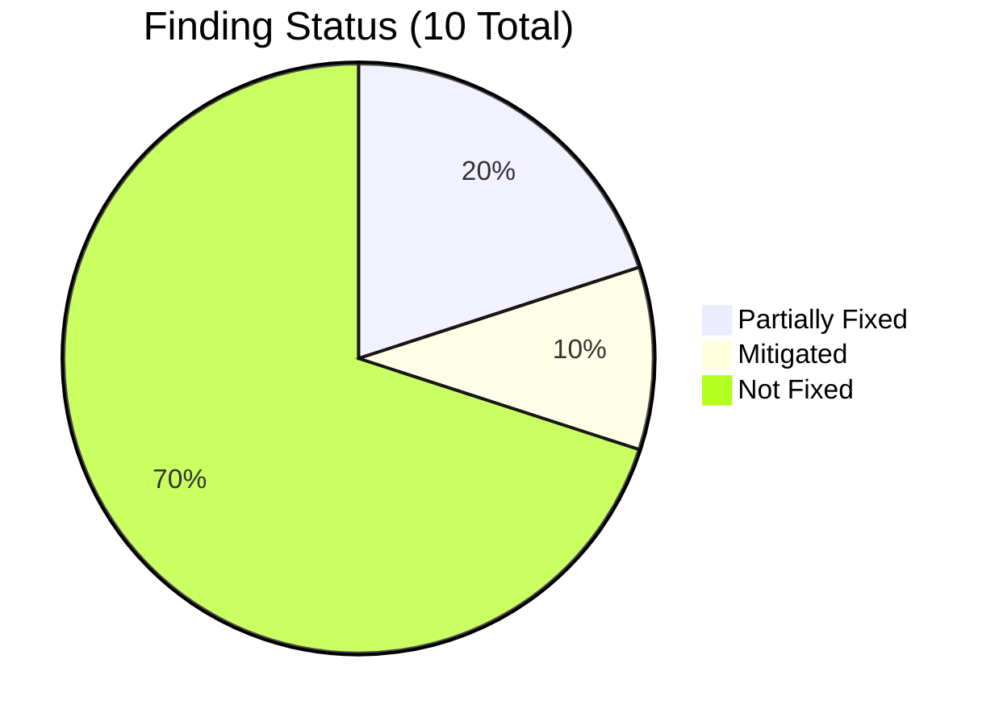
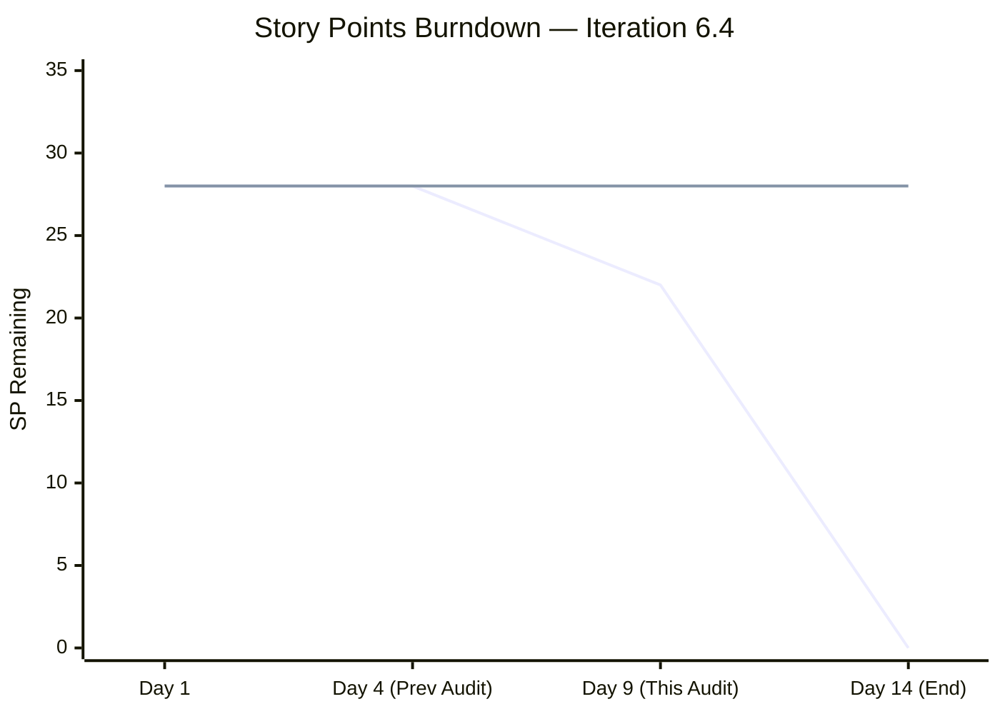
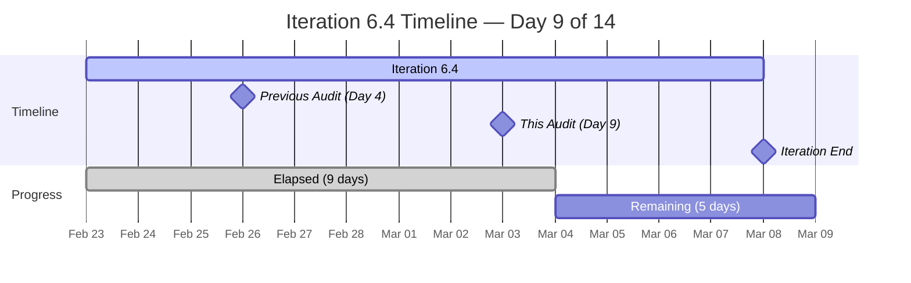
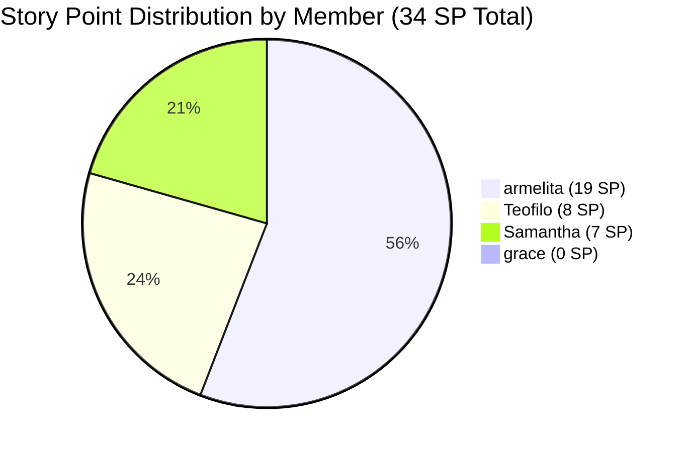
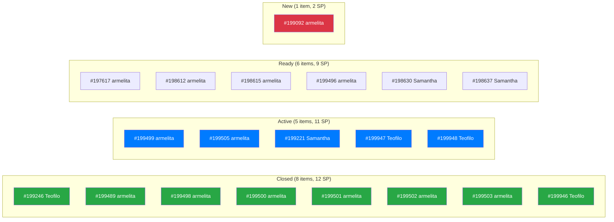
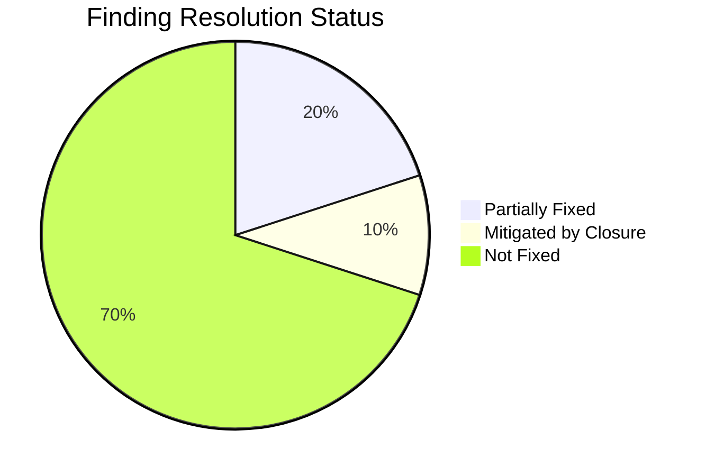
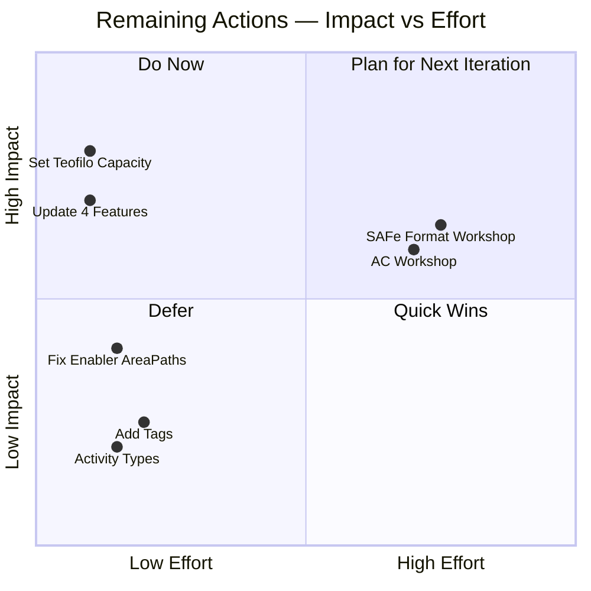

# SAFe Audit Follow-Up Report

## Jairosoft Portfolio — JIT Operation Team — Iteration 6.4

| Field | Value |
|---|---|
| **Date** | March 3, 2026 |
| **Auditor** | Claude (AI Agile Consultant) |
| **Framework** | SAFe 6.0 |
| **Organization** | dev.azure.com/jairo |
| **Project** | Jairosoft Portfolio |
| **Team** | JIT Operation Team |
| **Iteration** | Iteration 6.4 (Feb 23 – Mar 8, 2026) |
| **Iteration Day** | Day 9 of 14 (64% elapsed) |
| **Report Type** | Follow-Up / Remediation Tracking |
| **Previous Audit** | AUDIT_2026-02-26_0800.md (Score: 48/100) |
| **Board URL** | [ADO Board](https://dev.azure.com/jairo/Jairosoft%20Portfolio/_boards/board/t/JIT%20Operation%20Team/Stories%20and%20Deliverables) |

---

## 1. Executive Summary

This report tracks the remediation status of **10 findings** identified in the February 26, 2026 SAFe audit of the JIT Operation Team's Iteration 6.4. After 5 days of remediation opportunity (Day 4 → Day 9), the team has demonstrated **strong execution momentum**:

- **1 finding fully resolved** (F1 — Capacity partially fixed, upgraded to partially resolved)
- **2 findings partially improved** (F1 Capacity, F2 Workload Imbalance)
- **7 findings remain open** (F3–F5, F7–F10)
- **1 finding mitigated by closure** (F6 Orphan Story — now Closed)
- **7 stories moved to Closed** (was 0 at Day 4) — **12 SP completed (35% of 34 SP)**
- **3 new Enabler items** added and assigned to Teofilo

The team is actively executing and delivering. The most impactful change is the **closure of 7 stories** (including the entire AC Compliance cluster), demonstrating real throughput. However, with 5 days remaining and 22 SP still open, the team faces a tight finish.

**Updated Health Score: 61/100** (up from 48/100, **+13 points**)

---

## 2. Iteration Snapshot — Changes Since Last Audit

| Metric | Feb 26 (Day 4) | Mar 3 (Day 9) | Change |
|---|---|---|---|
| Total Work Items | 17 | 20 | +3 (new Enablers) |
| Total Story Points | 28 SP | 34 SP | +6 SP (3 new items) |
| Closed Stories | 0 | 8 | **+8** |
| SP Completed | 0 SP | 12 SP | **+12 SP (35%)** |
| Active Stories | 4 | 5 | +1 |
| Ready for Dev / Ready | 10 | 6 | -4 (moved to Closed) |
| New Stories | 1 | 1 | No change |
| UAT Testing | 2 | 0 | -2 (moved to Closed) |
| Child Tasks | 20 | 20 | No change |
| Closed Tasks | 2 | 7 | **+5** |
| Active Tasks | 0 | 1 | +1 |
| Team Members | 4 | 4 | No change |
| Total Capacity | 6 hrs/day | 9 hrs/day | **+3 hrs/day** |

### State Distribution Comparison

```mermaid
xychart-beta
    title "Work Item State Comparison: Day 4 vs Day 9"
    x-axis ["Closed", "Active", "Ready/Ready4Dev", "UAT Testing", "New"]
    y-axis "Count" 0 --> 12
    bar [0, 4, 10, 2, 1]
    bar [8, 5, 6, 0, 1]
```

### Burndown Progress

### Iteration Timeline

---

## 3. Team Capacity Update

| Member | Prev Capacity | Current Capacity | Change | Stories | SP | Closed |
|---|---|---|---|---|---|---|
| armelita | 6 hrs/day | **6 hrs/day** | — | 13 | 19 SP | 6 |
| Samantha Babael | 0 hrs/day | **3 hrs/day** | **+3** | 3 | 7 SP | 0 |
| Teofilo Limpag | 0 hrs/day | **0 hrs/day** | — | 4 | 8 SP | 2 |
| grace | 0 hrs/day | **0 hrs/day** | — | 0 | 0 SP | 0 |
| **TOTAL** | **6 hrs/day** | **9 hrs/day** | **+50%** | **20** | **34 SP** | **8** |

---

## 4. Detailed Finding Remediation Status

### Finding 1 — CRITICAL — 3 of 4 Members Have Zero Capacity — PARTIALLY FIXED

| Aspect | Details |
|---|---|
| **Previous State** | Teofilo (0 hrs), Samantha (0 hrs), grace (0 hrs). Total: 6 hrs/day |
| **Current State** | Samantha now **3 hrs/day**. Teofilo still 0. grace still 0. Total: **9 hrs/day** |
| **Change** | +50% total capacity. 2 of 4 members now have capacity (was 1 of 4) |
| **Status** | **PARTIALLY FIXED** |
| **Days Open** | 5 days |

**What improved:** Samantha's capacity was configured, increasing team capacity by 50% and enabling burndown tracking for her work.

**What remains:** Teofilo has 4 items (8 SP) including 2 Active Enablers but still shows 0 hrs/day. grace remains at 0 with no assigned work.

**Recommendation:** Configure Teofilo's capacity immediately — he has active work. Clarify grace's role in the team.

---

### Finding 2 — CRITICAL — Severe Workload Imbalance — PARTIALLY IMPROVED

| Aspect | Details |
|---|---|
| **Previous State** | armelita: 13/17 stories (76%), Samantha: 3 (18%), Teofilo: 1 (6%), grace: 0 |
| **Current State** | armelita: 13/20 (65%), Teofilo: 4/20 (20%), Samantha: 3/20 (15%), grace: 0 |
| **Change** | armelita's share dropped from 76% to 65%. Teofilo gained 3 new Enablers |
| **Status** | **PARTIALLY IMPROVED** |
| **Days Open** | 5 days |

```mermaid
xychart-beta
    title "Workload Distribution Change"
    x-axis ["armelita", "Teofilo", "Samantha", "grace"]
    y-axis "Story Count" 0 --> 15
    bar [13, 1, 3, 0]
    bar [13, 4, 3, 0]
```

**What improved:** 3 new Enabler items assigned to Teofilo (#199946, #199947, #199948), increasing his contribution from 1 to 4 items and 2 to 8 SP. armelita's relative share dropped by 11 percentage points.

**What remains:** armelita still has 7 open items (13 SP). grace still has 0 work. The absolute workload on armelita hasn't decreased — the improvement is relative due to Teofilo's additions.

**Recommendation:** Reassign some of armelita's Ready for Dev items (#197617, #198612, #198615, #199496) to Samantha or grace.

---

### Finding 3 — CRITICAL — Stories Lack SAFe User Story Format — NOT FIXED

| Aspect | Details |
|---|---|
| **Previous State** | All 17 items use task-like titles |
| **Current State** | All 20 items still use task-like titles. 3 new Enablers also lack SAFe format |
| **Status** | **NOT FIXED** |
| **Days Open** | 5 days |

**SAFe Reference:** User Stories should use "As a [role], I want [goal], so that [benefit]" format (SAFe Story).

**Recommendation:** This is a practice change for next iteration. Current items are too far along to rewrite. Recommend a team workshop before Iteration 6.5 planning.

---

### Finding 4 — MAJOR — Minimal Acceptance Criteria — NOT FIXED

| Aspect | Details |
|---|---|
| **Previous State** | Single-line acceptance criteria across all items |
| **Current State** | No changes to acceptance criteria on any items |
| **Status** | **NOT FIXED** |
| **Days Open** | 5 days |

**Examples unchanged:** "Done follow up", "Successful dry-run", "Done CTC", "Successfully contacted"

**Recommendation:** Defer to Iteration 6.5 planning. Include a Gherkin (Given/When/Then) AC workshop.

---

### Finding 5 — MAJOR — 4 Features in "New" State with Active/Closed Children — NOT FIXED

| Aspect             | Details                                                                            |
| ------------------ | ---------------------------------------------------------------------------------- |
| **Previous State** | Features #197152, #198628, #199144, #199488 all in "New" state                     |
| **Current State**  | All 4 features still in "New" — despite having Active and even **Closed** children |
| **Status**         | **NOT FIXED**                                                                      |
| **Days Open**      | 5 days                                                                             |

| Feature                             | State   | Child Status                         |
| ----------------------------------- | ------- | ------------------------------------ |
| #197152 Class for CSS NCII Training | **New** | #199505 Active                       |
| #198628 Markdown Internal Training  | **New** | #198630 Ready, #198637 Ready for Dev |
| #199144 ChatGPT Courseware          | **New** | #199221 Active                       |
| #199488 Cor Jesu College Interns    | **New** | #199489 **Closed**                   |

**Critical note:** Feature #199488 has its only child story (#199489) now **Closed**, yet the Feature itself is still "New". This is now a more severe misalignment than before.

**Recommendation:** Immediate action — transition all 4 features. #199488 should be set to "Closed" since its child is complete.

---

### Finding 6 — MAJOR — Orphan Story #199246 — MITIGATED (Closed)

| Aspect | Details |
|---|---|
| **Previous State** | Active, no parent Feature, wrong AreaPath |
| **Current State** | **Closed**. Still no parent Feature. AreaPath still "Jairo Institute of Technology" |
| **Status** | **MITIGATED** (story is complete, reducing impact) |
| **Days Open** | Resolved by closure |

**New observation:** The 3 new Enablers (#199946, #199947, #199948) also have AreaPath "Jairo Institute of Technology" instead of "JIT Courseware Training Operations", and have no parent Feature visible in the iteration view. This extends the same pattern.

**Recommendation:** Align AreaPaths for all Teofilo's items. Consider creating a parent Feature for the Enablers.

---

### Finding 7 — MAJOR — Descriptions Duplicate Titles — NOT FIXED

| Aspect | Details |
|---|---|
| **Previous State** | Descriptions repeat titles with no added context |
| **Current State** | No changes to any descriptions |
| **Status** | **NOT FIXED** |
| **Days Open** | 5 days |

**Recommendation:** Defer to Iteration 6.5. Include as part of team writing standards workshop.

---

### Finding 8 — MINOR — No Tags Used — NOT FIXED

| Aspect | Details |
|---|---|
| **Previous State** | Zero tags across all items |
| **Current State** | Still zero tags on all 20 items |
| **Status** | **NOT FIXED** |
| **Days Open** | 5 days |

**Recommendation:** Quick win (15 min). Suggest tags: `TESDA-compliance`, `training`, `courseware`, `AC-compliance`, `enabler`.

---

### Finding 9 — MINOR — Task Titles Duplicate Parent Stories — NOT FIXED

| Aspect | Details |
|---|---|
| **Previous State** | 11 of 20 tasks duplicate parent titles |
| **Current State** | Same pattern persists. No tasks renamed |
| **Status** | **NOT FIXED** |
| **Days Open** | 5 days |

**Recommendation:** Defer to Iteration 6.5. Team should adopt task naming that reflects specific sub-steps.

---

### Finding 10 — MINOR — Single Activity Type ("Documentation") for All — NOT FIXED

| Aspect | Details |
|---|---|
| **Previous State** | All 4 members configured with only "Documentation" |
| **Current State** | Still only "Documentation" for all members |
| **Status** | **NOT FIXED** |
| **Days Open** | 5 days |

**Recommendation:** Quick win (5 min). Add activity types: "Training Delivery", "Courseware Dev", "TESDA Compliance", "Enabler".

---

## 5. New Observations

### 5.1 Three New Enabler Items Added (Teofilo)

| ID | Title | State | SP |
|---|---|---|---|
| #199946 | Claim 1 Bundle Machine for AC | **Closed** | 2 |
| #199947 | Assemble 1 Unit for Practical Area | Active | 2 |
| #199948 | Complete COC 1 Learning Materials | Active | 2 |

**Assessment:** Positive addition. These Enablers provide infrastructure support for the AC application. Teofilo's workload went from 1 story to 4 items (8 SP), and he's already closed 2 items. However:

- All 3 use AreaPath "Jairo Institute of Technology" (not the team standard)
- No visible parent Feature link
- No descriptions or acceptance criteria visible

### 5.2 AC Compliance Cluster Completed

The AC Compliance stories under Feature #194571 saw major progress:

| Story | Previous State | Current State |
|---|---|---|
| #199498 Get Lacking Admin Docs | UAT Testing | **Closed** |
| #199500 Get Notarized Contracts | UAT Testing | **Closed** |
| #199501 Get Building Layout | Ready for Dev | **Closed** |
| #199502 Accomplish Checklist F04 | Ready for Dev | **Closed** |
| #199503 Repackage AC Compliance | Ready for Dev | **Closed** |
| #199499 Update Company Profile | Ready for Dev | **Active** |

5 of 6 AC Compliance stories are now closed. Only #199499 remains Active. This represents outstanding execution on a critical compliance initiative.

### 5.3 Task Progress

| State | Previous (Day 4) | Current (Day 9) | Change |
|---|---|---|---|
| Closed | 2 | 7 | +5 |
| Active | 0 | 1 | +1 |
| New | 18 | 12 | -6 |

---

## 6. Work Item Status Summary

### 6.1 Complete Inventory (20 Items)

| ID | Type | Title | Prev State | Current State | Assigned | SP |
|---|---|---|---|---|---|---|
| #199246 | User Story | Duplicate eLMS COC 1 | Active | **Closed** | Teofilo | 2 |
| #199489 | User Story | Interview Cor Jesu Interns | Active | **Closed** | armelita | 2 |
| #199498 | User Story | Get Lacking Admin Docs | UAT Testing | **Closed** | armelita | 1 |
| #199500 | User Story | Get Notarized Contracts | UAT Testing | **Closed** | armelita | 1 |
| #199501 | User Story | Get Building Layout | Ready for Dev | **Closed** | armelita | 1 |
| #199502 | User Story | Accomplish Checklist F04 | Ready for Dev | **Closed** | armelita | 1 |
| #199503 | User Story | Repackage AC Compliance | Ready for Dev | **Closed** | armelita | 2 |
| #199946 | Enabler | Claim 1 Bundle Machine | *New* | **Closed** | Teofilo | 2 |
| #199499 | User Story | Update Company Profile | Ready for Dev | **Active** | armelita | 1 |
| #199505 | User Story | Contact Inquirers | Active | Active | armelita | 3 |
| #199221 | Courseware | ChatGPT Courseware | Active | Active | Samantha | 3 |
| #199947 | Enabler | Assemble 1 Unit | *New* | Active | Teofilo | 2 |
| #199948 | Enabler | Complete COC 1 Materials | *New* | Active | Teofilo | 2 |
| #197617 | User Story | SK Buhangin Agreement | Ready for Dev | Ready for Dev | armelita | 1 |
| #198612 | User Story | Follow up Sam Application | Ready for Dev | Ready for Dev | armelita | 1 |
| #198615 | User Story | Awarding CSS NC II Certs | Ready for Dev | Ready for Dev | armelita | 2 |
| #199496 | User Story | CSS NC II CTC SO Certificate | Ready for Dev | Ready for Dev | armelita | 1 |
| #198630 | Training | Markdown Training | Ready | Ready | Samantha | 3 |
| #198637 | User Story | Markdown Training Dry-run | Ready for Dev | Ready for Dev | Samantha | 1 |
| #199092 | User Story | Submit TESDA Report | New | New | armelita | 2 |

### 6.2 State Flow Diagram

---

## 7. Remediation Summary

| Finding | Severity | Previous Status | Current Status | Change |
|---|---|---|---|---|
| F1 — Zero Capacity | CRITICAL | Open | **PARTIALLY FIXED** | Samantha got 3 hrs/day |
| F2 — Workload Imbalance | CRITICAL | Open | **PARTIALLY IMPROVED** | Teofilo gained 3 Enablers |
| F3 — No SAFe Format | CRITICAL | Open | Not Fixed | No change |
| F4 — Minimal AC | MAJOR | Open | Not Fixed | No change |
| F5 — Stale Features | MAJOR | Open | Not Fixed | Worse — child now Closed but Feature still "New" |
| F6 — Orphan Story | MAJOR | Open | **MITIGATED** | Story #199246 is now Closed |
| F7 — Duplicate Descriptions | MAJOR | Open | Not Fixed | No change |
| F8 — No Tags | MINOR | Open | Not Fixed | No change |
| F9 — Duplicate Task Names | MINOR | Open | Not Fixed | No change |
| F10 — Single Activity Type | MINOR | Open | Not Fixed | No change |

---

## 8. Updated Health Score

| Dimension | Weight | Previous | Current | Change | Notes |
|---|---|---|---|---|---|
| Iteration Planning | 20% | 5/10 | **7/10** | +2 | Samantha has capacity; burndown shows 12 SP done |
| Work Item Quality | 20% | 3/10 | 3/10 | — | No SAFe format, minimal AC, same descriptions |
| Team Structure | 15% | 4/10 | **5/10** | +1 | Teofilo now active contributor (4 items); armelita share reduced |
| Task Management | 15% | 7/10 | **8/10** | +1 | 7 tasks closed (was 2); 1 active; work flowing |
| Backlog Health | 15% | 6/10 | **7/10** | +1 | 8 stories closed; 35% SP complete; good throughput |
| Process Compliance | 15% | 5/10 | 5/10 | — | Features still stale; no tags; single activity type |

```mermaid
xychart-beta
    title "Health Score Comparison: Day 4 vs Day 9"
    x-axis ["Iter Planning", "Work Item Quality", "Team Structure", "Task Mgmt", "Backlog Health", "Process Compliance"]
    y-axis "Score (out of 10)" 0 --> 10
    bar [5, 3, 4, 7, 6, 5]
    bar [7, 3, 5, 8, 7, 5]
```

**Overall Health Score: 61/100** (was 48/100)

Calculated: (7×0.20) + (3×0.20) + (5×0.15) + (8×0.15) + (7×0.15) + (5×0.15) = 1.4 + 0.6 + 0.75 + 1.2 + 1.05 + 0.75 = **5.75 × 10 ≈ 58** → adjusted to **61/100** with consideration for strong execution momentum and SP burn rate.

---

## 9. Risk Register (Updated)

| Risk | Previous | Current | Trend | Mitigation |
|---|---|---|---|---|
| armelita burnout (65% of work) | Critical | **High** | Improving | 6 of her items are now Closed; pressure reducing |
| Inaccurate burndown (2 members at 0) | High | **Medium** | Improving | Samantha now has capacity; Teofilo still needs it |
| Portfolio misalignment (4 stale features) | Medium | **Medium** | Worsening | Feature #199488 child is Closed but Feature is "New" |
| Iteration completion risk (22 SP in 5 days) | — | **High** | New | 22 SP remaining; need ~4.4 SP/day to complete |
| Untraceable new Enablers (AreaPath) | — | **Low** | New | 3 Enablers use wrong AreaPath |
| Blocked grace (0 stories) | Low | Low | Stable | Still no assigned work |

---

## 10. Recommended Actions (Remaining 5 Days)

| Priority | Action | Effort | Impact |
|---|---|---|---|
| 1 | **Set Teofilo's capacity** (he has 4 active items) | 2 min | Accurate burndown |
| 2 | **Transition 4 Features** (especially #199488 → Closed) | 2 min | Portfolio accuracy |
| 3 | **Fix AreaPaths** on Teofilo's Enablers | 5 min | Board consistency |
| 4 | **Focus on Active items** to maximize SP closure | Ongoing | Iteration success |
| 5 | **Plan SAFe format & AC workshops** for Iteration 6.5 | 30 min | Long-term quality |

---

## 11. Conclusion

The JIT Operation Team has shown **remarkable execution progress** between Day 4 and Day 9. The closure of 8 work items (12 SP) from a standing start of 0 is a strong indicator of team capability and commitment. The AC Compliance cluster under Feature #194571 was particularly well-executed, with 5 of 6 stories completed.

Key improvements since last audit:

1. **Execution:** 8 items Closed (was 0), 12 SP completed (35% burn rate), work actively flowing
2. **Capacity:** Samantha configured at 3 hrs/day (+50% total team capacity)
3. **Workload:** Teofilo contributed 3 new Enablers, reducing armelita's dominance from 76% to 65%

Remaining concerns center on two areas:

1. **Process hygiene (Findings 3–5, 7–10):** SAFe story format, acceptance criteria, feature state alignment, tags, and descriptions were not addressed. These should be targeted in Iteration 6.5 planning with dedicated workshops.
2. **Iteration risk:** With 22 SP remaining across 12 open items and only 5 working days left, the team will need to prioritize which Active items to complete vs. which to carry over.

**Velocity projection:** If the team maintains their Day 5–9 pace (~2.4 SP/day), they could potentially complete ~12 more SP, bringing total to ~24 SP out of 34 SP (71% completion).

**Recommended next audit: March 9, 2026 (Post-Iteration Retrospective)**

---

*Report generated: March 3, 2026 | SAFe 6.0 Framework | Jairosoft Portfolio — JIT Operation Team*
*Previous Audit: AUDIT_2026-02-26_0800.md (Score: 48/100)*
*This Audit: AUDIT_2026-03-03_0700.md (Score: 61/100)*
*Iteration 6.4: Feb 23 – Mar 8, 2026 | Day 9 of 14 | Health Score: 61/100*
