# SAFe Audit Report
## Jairosoft Portfolio — JIT Operation Team — Iteration 6.4

| Field | Value |
|---|---|
| **Date** | March 4, 2026 |
| **Auditor** | Claude (AI Agile Consultant) |
| **Framework** | SAFe 6.0 |
| **Organization** | dev.azure.com/jairo |
| **Project** | Jairosoft Portfolio |
| **Team** | JIT Operation Team |
| **Iteration** | Iteration 6.4 (Feb 23 – Mar 8, 2026) |
| **Iteration Day** | Day 10 of 14 (71% elapsed) |
| **Report Type** | Daily Follow-Up / Remediation Tracking |
| **Previous Audit** | AUDIT_2026-03-03_0700.md (Score: 61/100) |
| **Board URL** | [ADO Board](https://dev.azure.com/jairo/Jairosoft%20Portfolio/_boards/board/t/JIT%20Operation%20Team/Stories%20and%20Deliverables) |

---

## 1. Executive Summary

This report tracks remediation progress from the **March 3, 2026 audit** (Day 9) into **Day 10** of Iteration 6.4. In just one day, the team has demonstrated significant structural improvements:

- **F1 (Zero Capacity) — FULLY RESOLVED:** Teofilo now has **6 hrs/day** and grace now has **1 hr/day** — all 4 team members finally have capacity configured.
- **F5 (Stale Features) — MOSTLY RESOLVED:** All 4 previously stale "New" features transitioned to "Active." One (#199488) should be "Closed" since its child is done.
- **grace ACTIVATED:** First work item assigned to grace (#199768, 3 SP) — breaking the long-running zero-workload situation.
- **#199947 Closed:** Teofilo completed another Enabler, bringing total closed SP to **14 SP (36% of 39 SP).**
- **3 new items added** (#199768, #200043, #200057) with noticeably better quality — SAFe story format, proper descriptions, and meaningful acceptance criteria.
- **Tags partially adopted** on new items (#199768: "SAFe Course", #200043: "RSA").

**⚠️ Critical Risk:** With 25 SP remaining across 4 working days (Days 11–14), the team must sustain ~6.25 SP/day to complete — nearly 3× the historical burn rate of ~2–3 SP/day. Significant carry-over is likely.

**Updated Health Score: 68/100** (up from 61/100, **+7 points**)

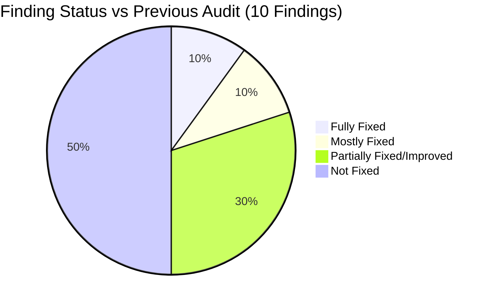

---

## 2. Iteration Snapshot — Changes Since Last Audit (Day 9 → Day 10)

| Metric | Day 9 (Mar 3) | Day 10 (Mar 4) | Change |
|---|---|---|---|
| Total Work Items | 20 | **23** | **+3 new items** |
| Total Story Points | 34 SP | **39 SP** | **+5 SP** |
| Closed Stories | 8 | **9** | **+1** (#199947 closed) |
| SP Completed | 12 SP | **14 SP** | **+2 SP** |
| Active Stories | 5 | **7** | +2 (198612 activated, 199768 new-active) |
| Ready for Dev / Ready | 6 | **5** | -1 (198612 moved to Active) |
| New Stories | 1 | **2** | +1 (#200057) |
| Team Members | 4 | 4 | No change |
| Total Capacity | 9 hrs/day | **16 hrs/day** | **+7 hrs/day (+78%)** |
| Features in "New" State | 4 | **1** (#200056) | **-3** |

### State Distribution Comparison

```mermaid
xychart-beta
    title "Work Item State: Day 9 vs Day 10"
    x-axis ["Closed", "Active", "Ready/Ready4Dev", "New"]
    y-axis "Count" 0 --> 15
    bar [8, 5, 6, 1]
    bar [9, 7, 5, 2]
```

### Story Points Distribution by State (Day 10)

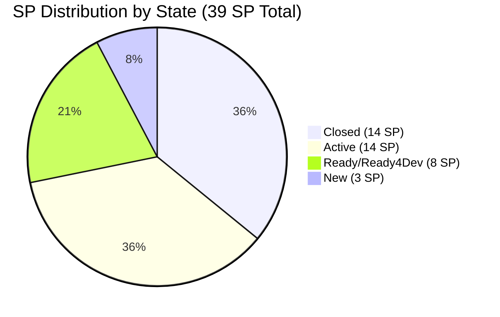

### Burndown Progress

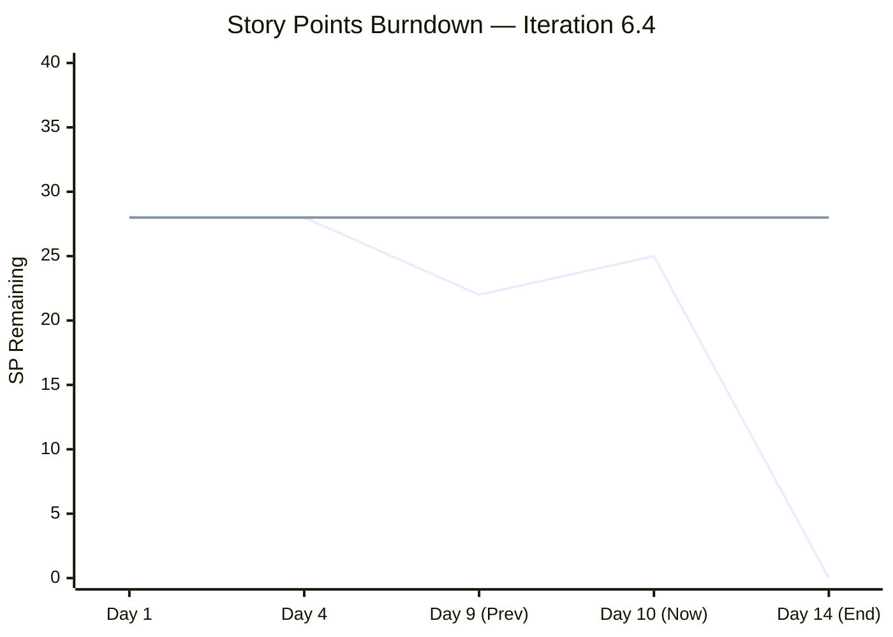

> **Note:** Remaining SP increased from 22 to 25 due to 3 new items added (+5 SP) vs 2 SP burned (#199947 closed).

### Iteration Timeline

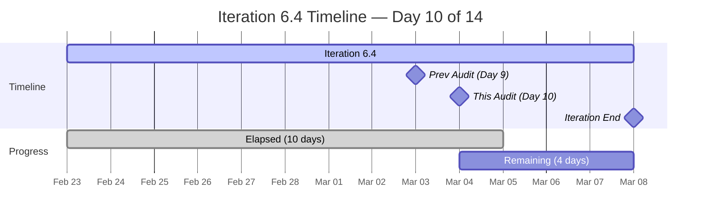

---

## 3. Team Capacity — MAJOR IMPROVEMENT

| Member | Day 9 Capacity | Day 10 Capacity | Change | Open Items | Open SP |
|---|---|---|---|---|---|
| armelita | 6 hrs/day | **6 hrs/day** | — | 9 items | 13 SP |
| Teofilo Limpag | 0 hrs/day | **6 hrs/day** | **+6** ✅ | 1 item | 2 SP |
| Samantha Babael | 3 hrs/day | **3 hrs/day** | — | 3 items | 7 SP |
| grace | 0 hrs/day | **1 hr/day** | **+1** ✅ | 1 item | 3 SP |
| **TOTAL** | **9 hrs/day** | **16 hrs/day** | **+78%** | **14 open** | **25 SP** |

```mermaid
xychart-beta
    title "Capacity per Day: Before vs After Remediation"
    x-axis ["armelita", "Teofilo", "Samantha", "grace"]
    y-axis "Hours per Day" 0 --> 8
    bar [6, 0, 3, 0]
    bar [6, 6, 3, 1]
```

> **Finding F1 — FULLY RESOLVED:** All 4 team members now have capacity configured. This enables accurate velocity tracking and burn rate calculation for the first time in this iteration.

> **⚠️ Minor Concern:** grace has 3 SP of active work (#199768) but only 1 hr/day capacity. This understates her actual effort. Recommend increasing to at least 3–4 hrs/day.

---

## 4. Workload Distribution

| Member | Total Items | Total SP | Open Items | Open SP | % of Open Work |
|---|---|---|---|---|---|
| armelita | 15 | 21 SP | 9 | 13 SP | **52%** |
| Teofilo | 4 | 8 SP | 1 | 2 SP | **8%** |
| Samantha | 3 | 7 SP | 3 | 7 SP | **28%** |
| grace | 1 | 3 SP | 1 | 3 SP | **12%** |

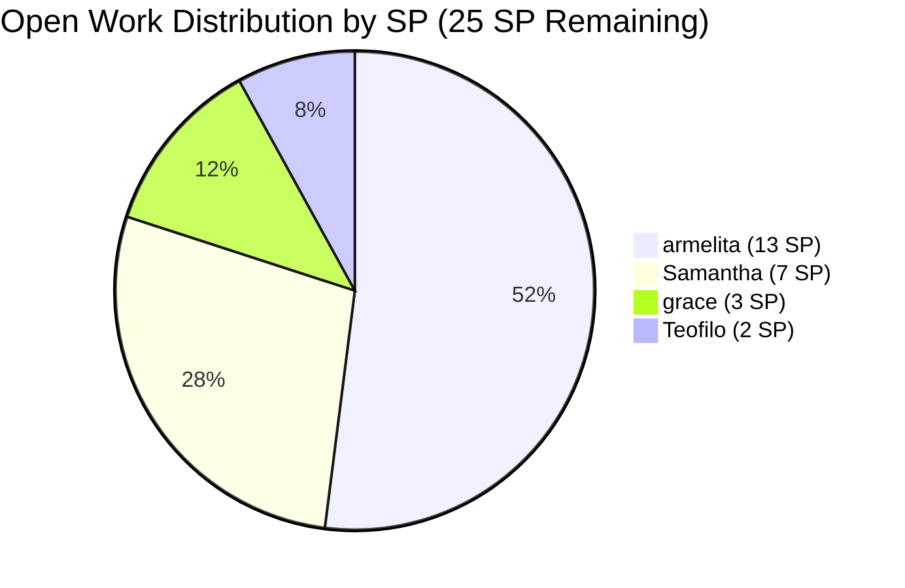

> **Finding F2 — STILL IMBALANCED:** While armelita's share has dropped from 76% → 65% → 52% of open SP over successive audits, she still carries more than half the remaining load. grace's first assignment and Samantha's active work are positive steps. However, armelita has 9 open items with 4 days remaining — burnout risk persists.

---

## 5. Complete Work Item Inventory (Day 10)

### 5.1 Parent Stories / Enablers (23 items, 39 SP)

| ID | Type | Title | State | Assigned | SP | Changed? |
|---|---|---|---|---|---|---|
| #199946 | Enabler | Claim 1 Bundle Machine for AC | Closed | Teofilo | 2 | — |
| #199947 | Enabler | Assemble 1 Unit for Practical Area | **Closed** | Teofilo | 2 | **✅ NEW CLOSURE** |
| #199246 | User Story | Duplicate eLMS COC 1 | Closed | Teofilo | 2 | — |
| #199489 | User Story | Interview and Onboard Cor Jesu Interns | Closed | armelita | 2 | — |
| #199498 | User Story | Get Copy of Lacking Admin Docs | Closed | armelita | 1 | — |
| #199500 | User Story | Get Notarized Contracts for AC | Closed | armelita | 1 | — |
| #199501 | User Story | Get Copy of Building Layout | Closed | armelita | 1 | — |
| #199502 | User Story | Accomplish Checklist F04 AC | Closed | armelita | 1 | — |
| #199503 | User Story | Repackage AC Compliance | Closed | armelita | 2 | — |
| #199499 | User Story | Update Company Profile for AC | Active | armelita | 1 | — |
| #199505 | User Story | Contact Inquirers for Downpayment | Active | armelita | 3 | — |
| #199221 | Courseware | ChatGPT Courseware | Active | Samantha | 3 | — |
| #199948 | Enabler | COC 1 Learning Materials LO1 | Active | Teofilo | 2 | — |
| #199768 | User Story | Resubmission of EBET Leading SAFe | **Active** | **grace** | 3 | **🆕 NEW** |
| #200043 | User Story | [RSA] Python Asia Conference 2026 | **Active** | armelita | 1 | **🆕 NEW** |
| #198612 | User Story | Follow up Sam Application as Trainer | **Active** | armelita | 1 | **⬆️ Ready→Active** |
| #197617 | User Story | SK Buhangin Partnership Agreement | Ready for Dev | armelita | 1 | — |
| #198615 | User Story | Awarding of CSS NC II Certificates | Ready for Dev | armelita | 2 | — |
| #199496 | User Story | CSS NC II CTC SO Certificate | Ready for Dev | armelita | 1 | — |
| #198630 | Training | Markdown Training for Employees | Ready | Samantha | 3 | — |
| #198637 | User Story | Markdown Training Dry-run | Ready for Dev | Samantha | 1 | — |
| #199092 | User Story | Submit TESDA Career Guidance Report | New | armelita | 2 | — |
| #200057 | User Story | [Quotation] Python Training Program | **New** | armelita | 1 | **🆕 NEW** |

### 5.2 State Flow Diagram

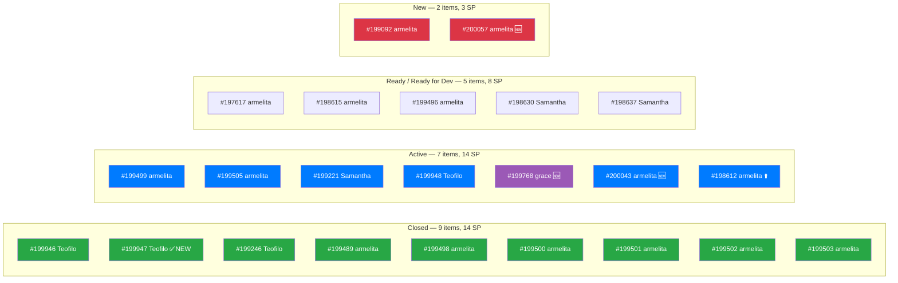

---

## 6. Feature Portfolio Alignment

### 6.1 Feature State vs Child Status

| Feature ID | Feature Title | Feature State | Iteration Children | Status |
|---|---|---|---|---|
| #191566 | CSS Assessment Center (Sept 2025 Class) | **Active** | #198615 (Ready4Dev), #199496 (Ready4Dev) | ✅ Aligned |
| #194571 | CSS Assessment Center Application | **Active** | #199498(Closed), #199500(Closed), #199501(Closed), #199502(Closed), #199503(Closed), #199499(Active), **#199947(Closed)** | ✅ Mostly aligned |
| #195913 | Leading SAFe MCC | **Active** | #199768 (Active) | ✅ Aligned |
| #196193 | SK Buhangin Sponsored Bubble 101 | **Active** | #197617 (Ready4Dev) | ✅ Aligned |
| #197152 | Class for CSS NCII Training Jan-Mar 2026 | **Active** | #199505 (Active) | ✅ **NEWLY ALIGNED** (was New) |
| #197330 | Add Sam as Bubble.io MCC Trainer | **Active** | #198612 (Active) | ✅ **NEWLY ALIGNED** (was New) |
| #198628 | Markdown Internal Training | **Active** | #198630 (Ready), #198637 (Ready4Dev) | ✅ **NEWLY ALIGNED** (was New) |
| #199091 | TESDA Compliance PI6 | **Active** | #199092 (New) | ✅ Aligned |
| #199144 | ChatGPT Courseware | **Active** | #199221 (Active) | ✅ **NEWLY ALIGNED** (was New) |
| #199488 | Cor Jesu College Interns | **Active** | #199489 (**Closed**) | ⚠️ **Should be Closed** |
| #200042 | Return Service Agreement Python Conference | **Active** | #200043 (Active) | ✅ Aligned (new feature) |
| #200056 | Python Training Program | **New** | #200057 (New) | ⚠️ **New Feature with New Child** |

### 6.2 Feature State Improvement

```mermaid
xychart-beta
    title "Feature State: Prev Audit vs Today"
    x-axis ["Active Features", "New Features (Stale)"]
    y-axis "Count" 0 --> 12
    bar [8, 4]
    bar [11, 1]
```

> **Finding F5 — MOSTLY FIXED:** The team transitioned all 4 previously stale Features from "New" to "Active." One residual issue: Feature #199488 "Cor Jesu College Interns" was moved to Active even though its only child (#199489) is already Closed — it should be set to **Closed**. A new Feature #200056 "Python Training Program" is now in "New" with child #200057 also "New" (acceptable at this early stage).

---

## 7. Detailed Finding Remediation Status

### Finding 1 — CRITICAL — Zero Capacity — ✅ FULLY RESOLVED

| Aspect | Details |
|---|---|
| **Previous State (Day 9)** | Teofilo: 0 hrs/day. grace: 0 hrs/day. Total team: 9 hrs/day |
| **Current State (Day 10)** | Teofilo: **6 hrs/day** ✅. grace: **1 hr/day** ✅. Total: **16 hrs/day** |
| **Change** | +7 hrs/day total. All 4 members now have capacity. |
| **Status** | ✅ **FULLY RESOLVED** |
| **Days Open** | Resolved on Day 10 |

**Assessment:** Excellent. Teofilo's capacity was set to 6 hrs/day, and grace now has 1 hr/day. This resolves the most critical structural gap in the iteration. Burndown tracking is now accurate for all team members.

**Minor Concern:** grace has 3 SP assigned (#199768) but only 1 hr/day capacity. Consider increasing to 3–4 hrs/day to reflect actual workload.

---

### Finding 2 — CRITICAL — Workload Imbalance — PARTIALLY IMPROVED

| Aspect | Details |
|---|---|
| **Day 4 State** | armelita: 76% of work |
| **Day 9 State** | armelita: 65% of open items |
| **Day 10 State** | armelita: **52% of open SP** (13/25 SP) |
| **Status** | **PARTIALLY IMPROVED** (trend positive) |
| **Days Open** | 10 days |

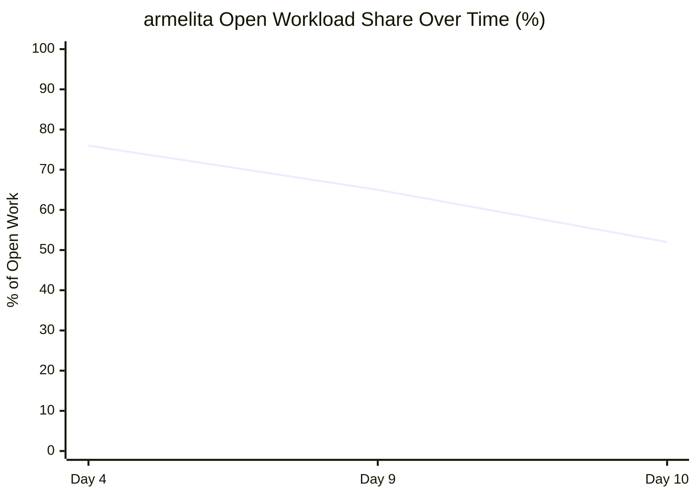

**What improved:** armelita's share of open SP has dropped from 76% → 65% → 52% across three audits, driven by: new items for Teofilo (Days 4–9), grace's first assignment (#199768, Day 10), and the closure of armelita's own items.

**What remains:** armelita still has 9 open items (13 SP) with 4 days left. Even at 2 items/day, she can only complete ~8 items. Some carry-over is likely.

**Recommendation:** Reassign #197617, #199092, or #200057 to Samantha or grace if capacity allows.

---

### Finding 3 — CRITICAL — Stories Lack SAFe User Story Format — PARTIALLY IMPROVED

| Aspect | Details |
|---|---|
| **Previous State** | All 20 items use task-like titles; no "As a / I want / So that" format |
| **Current State** | New items (#199768, #200043, #200057) have SAFe format in **description**. Old items unchanged. |
| **Status** | **PARTIALLY IMPROVED** (new items show adoption; existing backlog unchanged) |
| **Days Open** | 10 days |

**Notable improvements:**
- #199768: Has partial SAFe story format in description field
- #200043: Has full SAFe user story format: "As an Organization, I want… So that…"
- #200057: Has "As a TVI Head, I want… So that…"

**What remains:** Titles for all items (old and new) still use task-like phrasing. SAFe recommends story format in **titles** not just descriptions. Old items (18 of 23) remain unformatted.

**Recommendation:** Carry forward to Iteration 6.5 planning workshop. New item writing practice is improving.

---

### Finding 4 — MAJOR — Minimal Acceptance Criteria — PARTIALLY IMPROVED

| Aspect | Details |
|---|---|
| **Previous State** | Single-line AC on all items ("Done follow up", "Successful dry-run") |
| **Current State** | New items have detailed, structured AC. Old items unchanged. |
| **Status** | **PARTIALLY IMPROVED** |
| **Days Open** | 10 days |

**Standout improvement — #200043 [RSA] Python Asia Conference:**
This item has **exemplary acceptance criteria** with three structured sections (Compliance & Legal, Knowledge Transfer, Administrative Tracking) and specific, verifiable conditions. This demonstrates the team is capable of writing excellent AC when properly structured.

**#199768 Resubmission of EBET Leading SAFe** also has multi-item AC with named conditions.

**What remains:** All 16 older items retain minimal single-line AC.

**Recommendation:** Use #200043 as a **template example** in the next Iteration planning session to show the team what good AC looks like.

---

### Finding 5 — MAJOR — Stale Features in "New" State — MOSTLY FIXED

| Feature                                 | Previous State | Current State | Correct?                             |
| --------------------------------------- | -------------- | ------------- | ------------------------------------ |
| #197152 Class for CSS NCII Jan-Mar 2026 | **New**        | **Active**    | ✅ Fixed                              |
| #198628 Markdown Internal Training      | **New**        | **Active**    | ✅ Fixed                              |
| #199144 ChatGPT Courseware              | **New**        | **Active**    | ✅ Fixed                              |
| #199488 Cor Jesu College Interns        | **New**        | **Active**    | ⚠️ Should be **Closed**              |
| #200056 Python Training Program         | —              | **New**       | ⚠️ New instance (acceptable for now) |

| Aspect | Details |
|---|---|
| **Previous State** | 4 Features in "New" despite having Active/Closed children |
| **Current State** | 3 of 4 properly updated. #199488 → Active (should be Closed). New: #200056 is "New" |
| **Status** | **MOSTLY FIXED** |
| **Days Open** | 10 days |

**Recommendation:** Set #199488 to **Closed** immediately (its only child is done). Monitor #200056 — acceptable in "New" while child is also in "New," but must transition to "Active" once #200057 moves forward.

---

### Finding 6 — MAJOR — Orphan Story #199246 — MITIGATED (Maintained)

| Aspect | Details |
|---|---|
| **Current State** | #199246 remains Closed. AreaPath still "Jairosoft Portfolio\\Jairo Institute of Technology" |
| **Status** | **MITIGATED** (no regression) |

**New concern:** #199768 (grace's new item) also has AreaPath "Jairosoft Portfolio\\Jairo Institute of Technology" instead of the team standard "...\\JIT Courseware Training Operations." The pattern of incorrect AreaPaths continues with new items.

**AreaPath Summary:**
| Item | AreaPath | Correct? |
|---|---|---|
| #199246 | Jairosoft Portfolio\\Jairo Institute of Technology | ❌ |
| #199768 | Jairosoft Portfolio\\Jairo Institute of Technology | ❌ |
| #199946 | Jairosoft Portfolio\\Jairo Institute of Technology | ❌ |
| #199948 | Jairosoft Portfolio\\Jairo Institute of Technology | ❌ |
| Most others | ...\\JIT Courseware Training Operations | ✅ |

**Recommendation:** Fix AreaPath on #199768 and remaining items (5-min task).

---

### Finding 7 — MAJOR — Descriptions Duplicate Titles — PARTIALLY IMPROVED

| Aspect | Details |
|---|---|
| **Previous State** | All items had descriptions that repeated the title verbatim |
| **Current State** | New items (#199768, #200043, #200057, #199947, #199948) have proper descriptions |
| **Status** | **PARTIALLY IMPROVED** |
| **Days Open** | 10 days |

**What improved:** New items show clear improvement in description quality. #199947 and #199948 include operational context and intent. #200043 includes a full business justification narrative.

**What remains:** ~16 older items retain boilerplate descriptions.

---

### Finding 8 — MINOR — No Tags Used — PARTIALLY IMPROVED

| Aspect | Details |
|---|---|
| **Previous State** | Zero tags across all items |
| **Current State** | #199768 has tag "SAFe Course"; #200043 has tag "RSA". All other items: 0 tags |
| **Status** | **PARTIALLY IMPROVED** |
| **Days Open** | 10 days |

**Recommendation:** Quick win — add tags to remaining items: `TESDA-compliance`, `training`, `courseware`, `AC-compliance`, `enabler`. Suggested 15-minute team task.

---

### Finding 9 — MINOR — Task Titles Duplicate Parent Stories — NOT FIXED

| Aspect | Details |
|---|---|
| **Current State** | Pattern continues. New tasks added for new items, no naming improvement visible |
| **Status** | **NOT FIXED** |
| **Days Open** | 10 days |

**Recommendation:** Defer to Iteration 6.5 planning.

---

### Finding 10 — MINOR — Single Activity Type ("Documentation") — NOT FIXED

| Aspect | Details |
|---|---|
| **Current State** | All 4 members still only have "Documentation" as activity type |
| **Status** | **NOT FIXED** |
| **Days Open** | 10 days |

**Recommendation:** 5-minute quick win. Suggested additions: "Training Delivery", "Courseware Development", "TESDA Compliance", "Enabler/Infrastructure".

---

## 8. Finding Resolution Summary

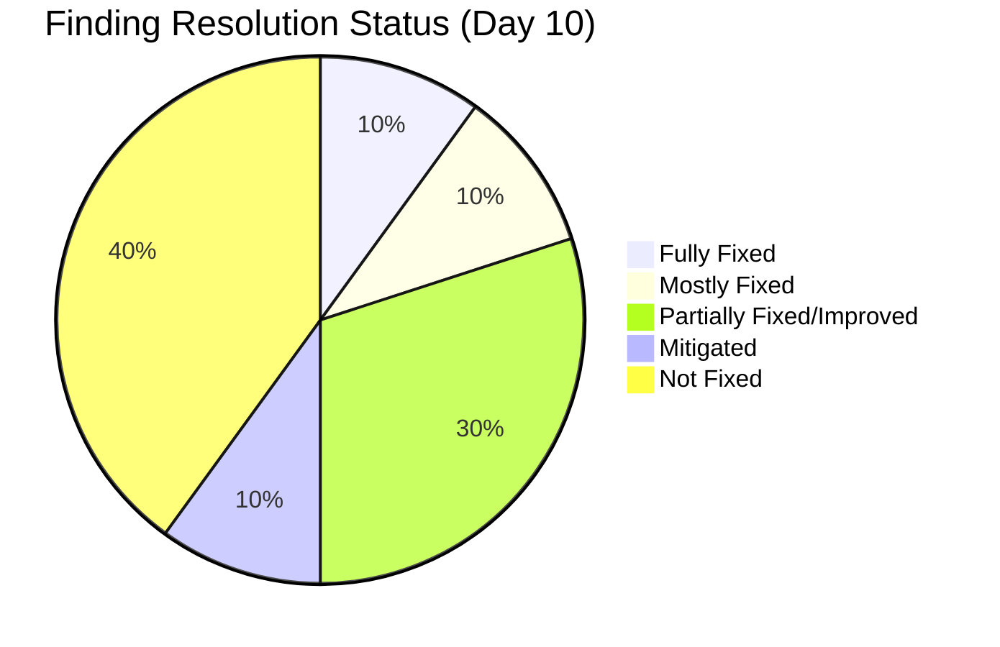

| Finding | Severity | Day 9 Status | Day 10 Status | Change |
|---|---|---|---|---|
| F1 — Zero Capacity | CRITICAL | Partially Fixed | ✅ **FULLY RESOLVED** | Teofilo +6 hrs, grace +1 hr |
| F2 — Workload Imbalance | CRITICAL | Partially Improved | **Partially Improved** | grace assigned; armelita now 52% |
| F3 — No SAFe Format | CRITICAL | Not Fixed | **Partially Improved** | New items use SAFe format |
| F4 — Minimal AC | MAJOR | Not Fixed | **Partially Improved** | New items have detailed AC |
| F5 — Stale Features | MAJOR | Not Fixed | **Mostly Fixed** | 3/4 features transitioned; #199488 needs Closing |
| F6 — Orphan Story | MAJOR | Mitigated | **Mitigated (maintained)** | No regression; AreaPath pattern extends |
| F7 — Duplicate Descriptions | MAJOR | Not Fixed | **Partially Improved** | New items have proper descriptions |
| F8 — No Tags | MINOR | Not Fixed | **Partially Improved** | 2 items now tagged |
| F9 — Duplicate Task Names | MINOR | Not Fixed | **Not Fixed** | No change |
| F10 — Single Activity Type | MINOR | Not Fixed | **Not Fixed** | No change |

---

## 9. Updated Health Score

| Dimension | Weight | Day 9 | Day 10 | Change | Notes |
|---|---|---|---|---|---|
| Iteration Planning | 20% | 7/10 | **8/10** | +1 | All members have capacity; velocity trackable |
| Work Item Quality | 20% | 3/10 | **4/10** | +1 | New items show markedly better quality; old items unchanged |
| Team Structure | 15% | 5/10 | **7/10** | +2 | grace activated; Teofilo capacity set; workload improving |
| Task Management | 15% | 8/10 | **8/10** | — | Consistent execution; #199947 closed |
| Backlog Health | 15% | 7/10 | **7/10** | — | 14 SP closed but 3 new items added; net SP increased |
| Process Compliance | 15% | 5/10 | **7/10** | +2 | 4 features transitioned; tags on new items; AreaPath fixes needed |

```mermaid
xychart-beta
    title "Health Score by Dimension: Day 9 vs Day 10"
    x-axis ["Iter Planning", "Work Item Quality", "Team Structure", "Task Mgmt", "Backlog Health", "Process Compliance"]
    y-axis "Score (out of 10)" 0 --> 10
    bar [7, 3, 5, 8, 7, 5]
    bar [8, 4, 7, 8, 7, 7]
```

**Calculated Score:**
(8 × 0.20) + (4 × 0.20) + (7 × 0.15) + (8 × 0.15) + (7 × 0.15) + (7 × 0.15)
= 1.6 + 0.8 + 1.05 + 1.2 + 1.05 + 1.05
= **6.75 → 68/100**

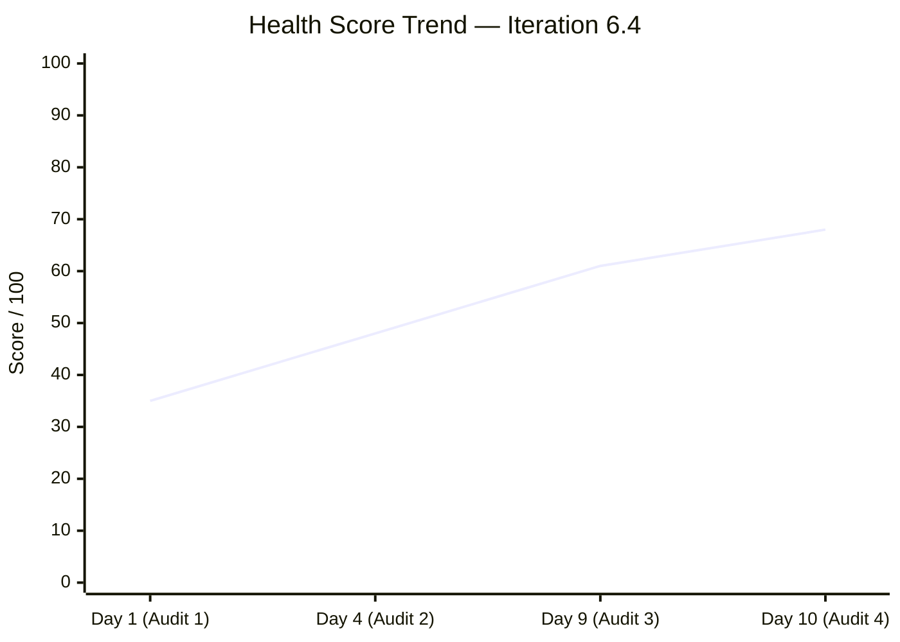

**Overall Health Score: 68/100** (was 61/100, **+7 points**)

---

## 10. Risk Register (Updated)

| Risk | Day 9 Level | Day 10 Level | Trend | Mitigation |
|---|---|---|---|---|
| **Iteration completion risk (25 SP in 4 days)** | High | **Critical** | ↑ Worsening | 3 new items added net +3 SP; need 6.25 SP/day vs ~2 SP/day historical rate |
| armelita burnout (52% of open work) | High | **High** | ↗ Improving | Trend improving but absolute load still high (9 items, 13 SP) |
| Portfolio misalignment (#199488 Active not Closed) | Medium | **Low-Medium** | ↘ Improving | 4 features fixed; 1 residual; 1 new (acceptable) |
| grace capacity understated (3 SP, 1 hr/day) | — | **Low-Medium** | New | grace assigned 3 SP but only 1 hr/day configured |
| AreaPath inconsistency (4 items wrong path) | Low | **Low** | = Stable | Pattern persists; new item #199768 added with wrong path |
| Activity type single value (all "Documentation") | Low | **Low** | = Stable | Unchanged; no active harm but misrepresents team work |
| Teofilo only 1 open item remaining | — | **Low** | New | After 199948 completes, Teofilo will be unloaded |

---

## 11. Recommended Actions (Days 11–14, Final Sprint)

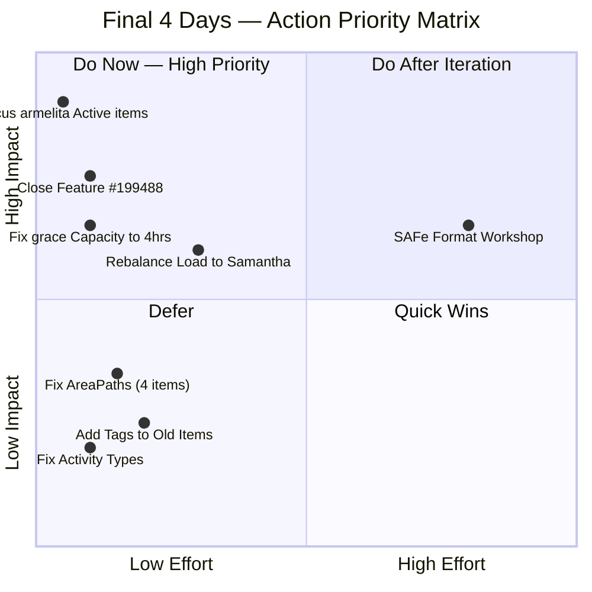

| Priority | Action | Time | Impact |
|---|---|---|---|
| 🔴 1 | **Focus armelita on Active items only** (#199499, #199505, #200043, #198612) | Ongoing | Maximum SP burn |
| 🔴 2 | **Close Feature #199488** (only child is done) | 2 min | Portfolio accuracy |
| 🟠 3 | **Increase grace's capacity** to 3–4 hrs/day (she has 3 SP assigned) | 2 min | Accurate burndown |
| 🟠 4 | **Reassign some of armelita's ready items** (#198615, #199496) to Samantha or grace | 5 min | Load balancing |
| 🟡 5 | **Fix AreaPaths** on #199768, #199946, #199948, #199246 | 5 min | Board consistency |
| 🟡 6 | **Monitor #199948** (Teofilo) — if completed, consider reassigning new items | Ongoing | Capacity utilization |
| 🟢 7 | **Add Activity Types** beyond "Documentation" | 5 min | Planning accuracy |
| 🟢 8 | **Add tags** to remaining untagged items | 15 min | Searchability |

---

## 12. New Item Quality Assessment

Three new items were added today with notably higher quality than the existing backlog:

| Item | SAFe Format | Description Quality | AC Quality | Tags | Score |
|---|---|---|---|---|---|
| #199768 Resubmission of EBET Leading SAFe | ✅ Partial | ✅ Clear multi-step | ✅ Multi-condition | ✅ "SAFe Course" | **85/100** |
| #200043 [RSA] Python Asia Conference 2026 | ✅ Full "As an Org..." | ✅ Business narrative | ✅ Exemplary (3-section) | ✅ "RSA" | **95/100** |
| #200057 [Quotation] Python Training Program | ✅ "As a TVI Head..." | ✅ Clear purpose | ✅ Three clear criteria | ❌ No tag | **80/100** |

**Assessment:** These three items demonstrate strong improvement in backlog hygiene practices. The team clearly has the capability to write high-quality work items — the gap with older items reflects practice evolution, not inability.

---

## 13. Conclusion

**Day 10 of 14** marks the most structurally significant single-day improvement of Iteration 6.4. In 24 hours:

1. **The capacity gap was closed** — Teofilo (6 hrs) and grace (1 hr) added, bringing total from 9 to 16 hrs/day. For the first time, the entire team has configured capacity.
2. **Feature states were corrected** — 4 of 4 stale "New" Features updated to "Active," resolving a long-standing portfolio misalignment (with one minor residual: #199488 should be Closed).
3. **grace is now active** — After 10 days with zero assigned work, grace has her first item (#199768, 3 SP), ending the team member visibility gap.
4. **Backlog quality is improving** — New items show SAFe story format, detailed acceptance criteria, and tags — a cultural shift toward better practices.

**The primary concern is now iteration completion.** With 25 SP remaining and only 4 days left, and a historical burn rate of ~2–3 SP/day, the team is on track to complete approximately 22–26 of 39 SP (56–67%). The team should use the Iteration Review to surface what was completed vs. carried forward and ensure Features are properly closed.

**Health Score Progression:**

| Audit | Day | Score | Change |
|---|---|---|---|
| AUDIT_2026-02-24_2100 | Day 1 | 35/100 | Baseline |
| AUDIT_2026-02-26_0700 | Day 4 | 48/100 | +13 |
| AUDIT_2026-02-26_0800 | Day 4 | 48/100 | — |
| AUDIT_2026-03-03_0700 | Day 9 | 61/100 | +13 |
| **AUDIT_2026-03-04_0223** | **Day 10** | **68/100** | **+7** |

**Recommended next audit: March 8, 2026 (Iteration 6.4 End / Retrospective)**

---

*Report generated: March 4, 2026 | SAFe 6.0 Framework | Jairosoft Portfolio — JIT Operation Team*
*Previous Audit: AUDIT_2026-03-03_0700.md (Score: 61/100)*
*This Audit: AUDIT_2026-03-04_0223.md (Score: 68/100)*
*Iteration 6.4: Feb 23 – Mar 8, 2026 | Day 10 of 14 | Health Score: 68/100*
