# SAFe Audit Report

## Jairosoft Portfolio — JIT Operation Team — Iteration 6.4

| Field | Value |
|---|---|
| **Date** | March 4, 2026 (Evening) |
| **Auditor** | Claude (AI Agile Consultant) |
| **Framework** | SAFe 6.0 |
| **Organization** | dev.azure.com/jairo |
| **Project** | Jairosoft Portfolio |
| **Team** | JIT Operation Team |
| **Iteration** | Iteration 6.4 (Feb 23 – Mar 8, 2026) |
| **Iteration Day** | Day 10 of 14 (71% elapsed) — Evening Follow-Up |
| **Report Type** | Daily Follow-Up / Scope Creep Alert |
| **Previous Audit** | AUDIT_2026-03-04_0223.md (Score: 68/100) |
| **Board URL** | [ADO Board](https://dev.azure.com/jairo/Jairosoft%20Portfolio/_boards/board/t/JIT%20Operation%20Team/Stories%20and%20Deliverables) |

---

## 1. Executive Summary

This is the **second audit of Day 10**, following up on AUDIT_2026-03-04_0223 generated earlier today. In the hours since the morning audit, the iteration has experienced incremental changes with a **concerning trend**:

- **#200057 moved from New → Active:** The "[Quotation] Python Training Program" story is now being worked on — a positive signal.
- **Feature #200056 transitioned from New → Active:** Resolving the last stale "New" feature flagged in the previous report.
- **New item added: #200105 "[Onboarding] UM-Digos Interns"** (2 SP, armelita) — with a new parent Feature #200104 also in "New" state.
- **Zero new closures:** SP completed remains at 14 SP (same as this morning).
- **armelita's load INCREASED:** From 9 open items (13 SP) to **10 open items (15 SP)** — moving in the wrong direction.

**⚠️ SCOPE CREEP ALERT:** The iteration has grown from the original 28 SP (Day 1) to **41 SP** (Day 10) — a **46% increase** in committed work. With only 4 calendar days remaining and 27 SP outstanding, the completion gap is widening.

**Updated Health Score: 66/100** (down from 68/100, **-2 points**)

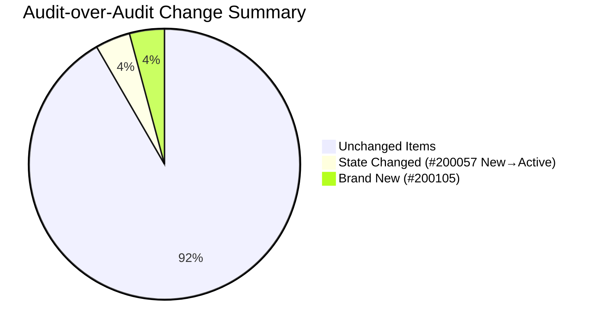

---

## 2. Iteration Snapshot — Changes Since Morning Audit (Day 10 AM → Day 10 PM)

| Metric | Day 10 AM | Day 10 PM | Change |
|---|---|---|---|
| Total Work Items | 23 | **24** | **+1** (#200105 added) |
| Total Story Points | 39 SP | **41 SP** | **+2 SP** |
| Closed Stories | 9 | 9 | No change |
| SP Completed | 14 SP | 14 SP | No change |
| Active Stories | 7 | **8** | +1 (#200057 New→Active) |
| Ready / Ready for Dev | 5 | 5 | No change |
| New Stories | 2 | **2** | 0 (lost #200057, gained #200105) |
| SP Remaining | 25 SP | **27 SP** | **+2 SP (worsening)** |
| Team Capacity | 16 hrs/day | 16 hrs/day | No change |
| Features (New state) | 1 | **1** | Changed: #200056→Active, #200104→New |

### Scope Growth Over Iteration

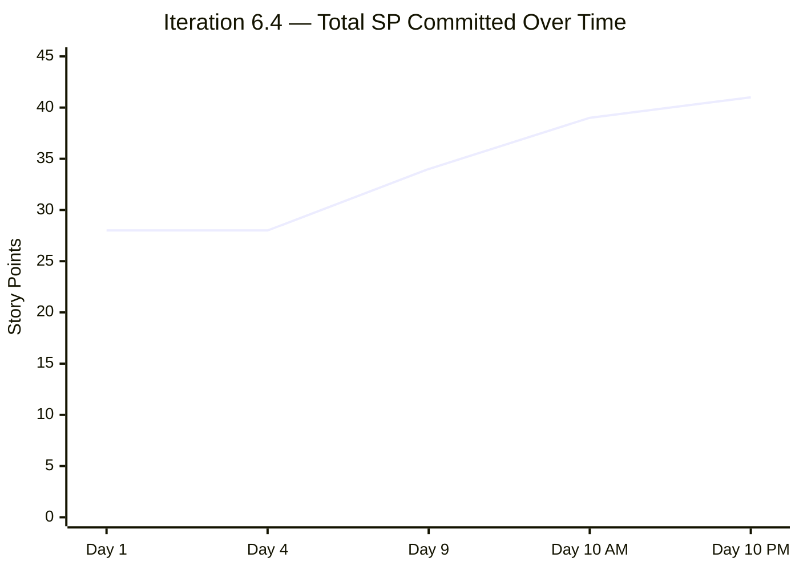

### Burndown Progress (Updated)

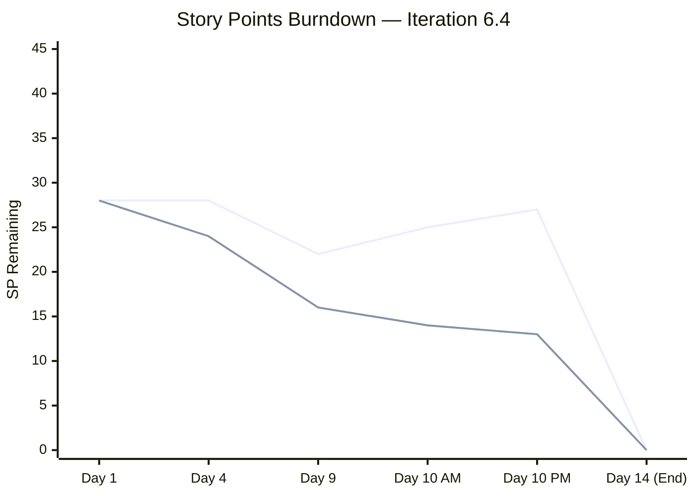

> **Note:** The top line shows actual remaining SP (rising due to scope additions). The bottom line shows ideal burndown. The gap between actual and ideal is now **14 SP** — the largest divergence of the iteration.

### SP Completed vs SP Added

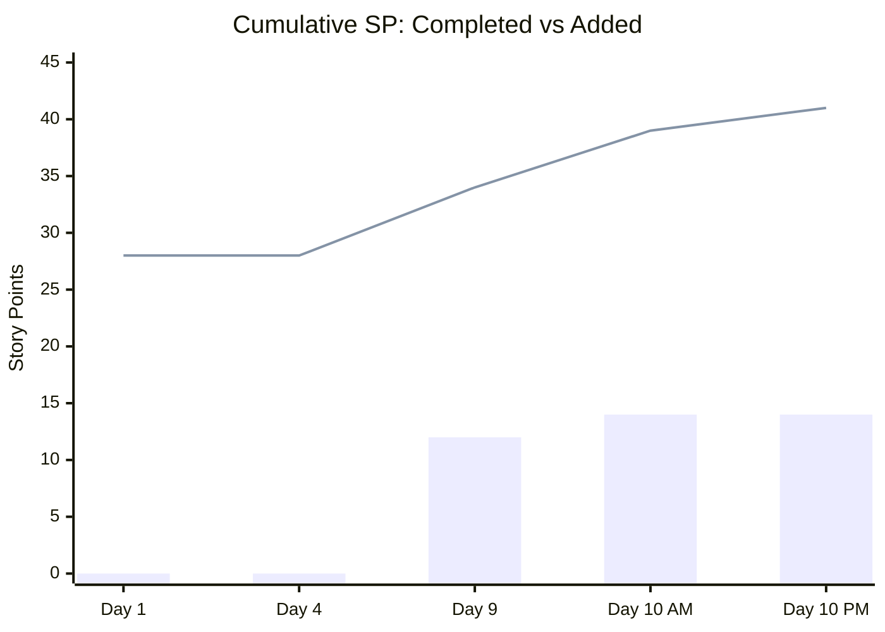

---

## 3. Scope Creep Analysis — CRITICAL CONCERN

The iteration began with 28 SP and has grown by **13 SP (46%)** across 10 days. This undermines the foundational SAFe principle of **stable iteration commitments**.

| When | Items Added | SP Added | Cumulative SP | Notes |
|---|---|---|---|---|
| Day 1 (Feb 23) | 17 items | 28 SP | 28 SP | Original commitment |
| Days 5–9 | +3 Enablers (Teofilo) | +6 SP | 34 SP | Infrastructure support — justified |
| Day 10 AM | +3 items (#199768, #200043, #200057) | +5 SP | 39 SP | Mixed — RSA, quotation, SAFe resubmission |
| Day 10 PM | +1 item (#200105) | +2 SP | 41 SP | Onboarding — operational necessity |
| **Total Added** | **+7 items** | **+13 SP** | **41 SP** | **46% scope growth** |

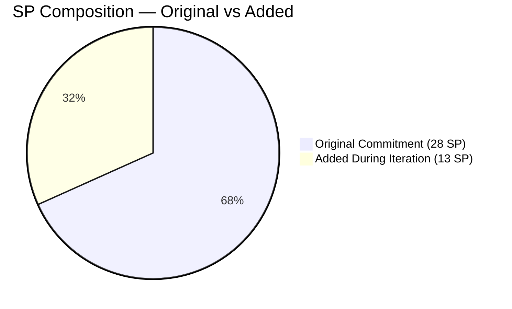

**SAFe Guidance:** SAFe recommends that teams protect their iteration commitment. While some scope change is natural (bugs, urgent enablers), a 46% increase indicates insufficient backlog refinement before iteration start, or the team is using the current iteration as a "catch-all" for incoming work rather than deferring to the next iteration.

**Recommendation:** In the Iteration Retrospective, the team should discuss establishing a **scope change threshold** (e.g., max 10–15% growth per iteration) and a formal process for mid-iteration additions requiring PO approval.

---

## 4. Team Capacity & Workload (Day 10 PM)

### 4.1 Capacity (Unchanged)

| Member | Capacity/Day | Activity |
|---|---|---|
| Teofilo Limpag | 6 hrs/day | Documentation |
| armelita | 6 hrs/day | Documentation |
| Samantha Babael | 3 hrs/day | Documentation |
| grace | 1 hr/day | Documentation |
| **TOTAL** | **16 hrs/day** | |

### 4.2 Workload Distribution (Updated)

| Member | Total Items | Total SP | Open Items | Open SP | % of Open SP | Change from AM |
|---|---|---|---|---|---|---|
| armelita | 16 | 23 SP | **10** | **15 SP** | **55.6%** | **⬆️ +1 item, +2 SP** |
| Samantha | 3 | 7 SP | 3 | 7 SP | 25.9% | — |
| grace | 1 | 3 SP | 1 | 3 SP | 11.1% | — |
| Teofilo | 4 | 8 SP | 1 | 2 SP | 7.4% | — |

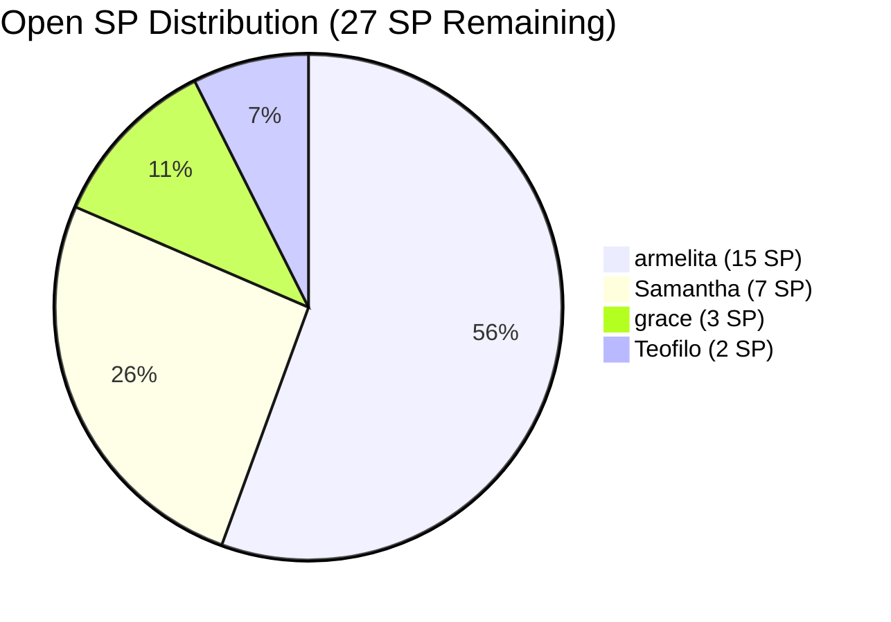

### 4.3 armelita Workload Trend — REVERSING

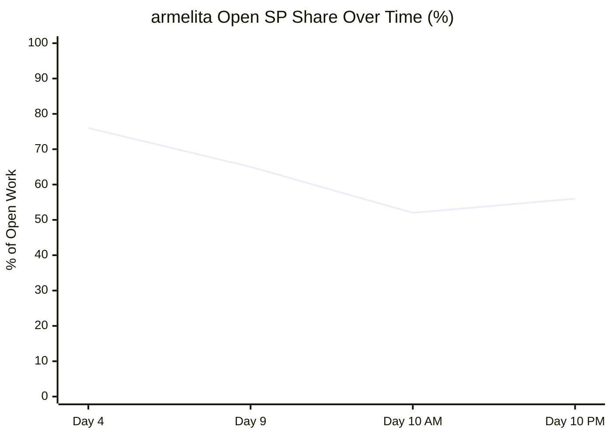

> **Finding F2 — REGRESSION:** armelita's workload share had been improving steadily (76% → 65% → 52%) but has now **reversed to 56%**. The new item #200105 was assigned to armelita despite her already carrying the majority of open work. This assignment directly contradicts the repeated audit recommendation to rebalance work away from armelita.

---

## 5. Complete Work Item Inventory (Day 10 PM — 24 items, 41 SP)

| ID | Type | Title | State | Assigned | SP | Change |
|---|---|---|---|---|---|---|
| #199946 | Enabler | Claim 1 Bundle Machine for AC | Closed | Teofilo | 2 | — |
| #199947 | Enabler | Assemble 1 Unit for Practical Area | Closed | Teofilo | 2 | — |
| #199246 | User Story | Duplicate eLMS COC 1 | Closed | Teofilo | 2 | — |
| #199489 | User Story | Interview and Onboard Cor Jesu Interns | Closed | armelita | 2 | — |
| #199498 | User Story | Get Copy of Lacking Admin Docs | Closed | armelita | 1 | — |
| #199500 | User Story | Get Notarized Contracts for AC | Closed | armelita | 1 | — |
| #199501 | User Story | Get Copy of Building Layout | Closed | armelita | 1 | — |
| #199502 | User Story | Accomplish Checklist F04 AC | Closed | armelita | 1 | — |
| #199503 | User Story | Repackage AC Compliance | Closed | armelita | 2 | — |
| #199499 | User Story | Update Company Profile for AC | Active | armelita | 1 | — |
| #199505 | User Story | Contact Inquirers for Downpayment | Active | armelita | 3 | — |
| #199221 | Courseware | ChatGPT Courseware | Active | Samantha | 3 | — |
| #199948 | Enabler | COC 1 Learning Materials LO1 | Active | Teofilo | 2 | — |
| #199768 | User Story | Resubmission of EBET Leading SAFe | Active | grace | 3 | — |
| #200043 | User Story | [RSA] Python Asia Conference 2026 | Active | armelita | 1 | — |
| #198612 | User Story | Follow up Sam Application as Trainer | Active | armelita | 1 | — |
| #200057 | User Story | [Quotation] Python Training Program | **Active** | armelita | 1 | **⬆️ New→Active** |
| #197617 | User Story | SK Buhangin Partnership Agreement | Ready for Dev | armelita | 1 | — |
| #198615 | User Story | Awarding of CSS NC II Certificates | Ready for Dev | armelita | 2 | — |
| #199496 | User Story | CSS NC II CTC SO Certificate | Ready for Dev | armelita | 1 | — |
| #198630 | Training | Markdown Training for Employees | Ready | Samantha | 3 | — |
| #198637 | User Story | Markdown Training Dry-run | Ready for Dev | Samantha | 1 | — |
| #199092 | User Story | Submit TESDA Career Guidance Report | New | armelita | 2 | — |
| #200105 | User Story | [Onboarding] UM-Digos Interns | **New** | armelita | 2 | **🆕 BRAND NEW** |

### State Flow Diagram

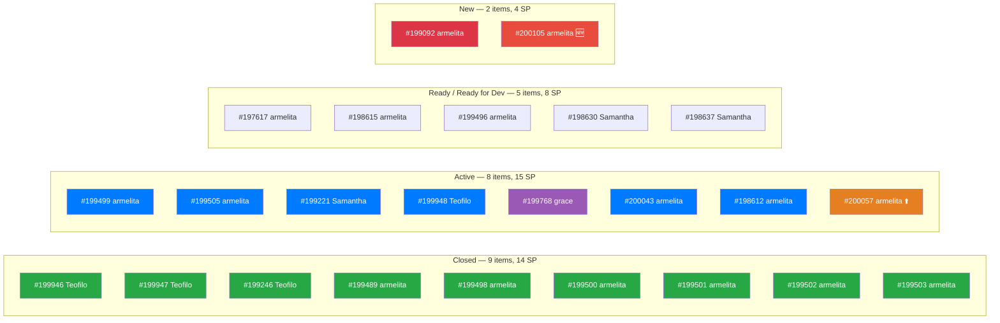

---

## 6. New Item Assessment — #200105 "[Onboarding] UM-Digos Interns"

| Attribute | Value | Assessment |
|---|---|---|
| **Type** | User Story | ✅ |
| **State** | New | ⚠️ Late addition at Day 10 |
| **Assigned** | armelita | ❌ Should go to less-loaded member |
| **SP** | 2 | Reasonable |
| **Parent Feature** | #200104 "UM-Digos Interns" (New) | ⚠️ New Feature also in "New" state |
| **AreaPath** | ...\\JIT Courseware Training Operations | ✅ Correct path |
| **SAFe Format** | Partial ("As the training and development incharge...") | ✅ Improving |
| **Acceptance Criteria** | 3 clear criteria (interview, onboarding, deployment) | ✅ Good quality |
| **Tags** | None | ❌ Missing |
| **Child Tasks** | #200106, #200107 | ✅ Has task breakdown |

**Quality Score: 75/100** — Decent item quality but the timing and assignment are problematic.

**Key Concern:** This is an operational-necessity item (intern onboarding has real deadlines), but assigning it to armelita — who already has 9 open items — exacerbates the workload imbalance finding that has been flagged since Day 1.

---

## 7. Feature Portfolio Alignment (Updated)

| Feature ID | Title | State | Iteration Children | Status |
|---|---|---|---|---|
| #191566 | CSS Assessment Center (Sept 2025 Class) | Active | #198615 (Ready4Dev), #199496 (Ready4Dev) | ✅ Aligned |
| #194571 | CSS Assessment Center Application | Active | Multiple (6 Closed, 1 Active) | ✅ Aligned |
| #195913 | Leading SAFe MCC | Active | #199768 (Active) | ✅ Aligned |
| #196193 | SK Buhangin Sponsored Bubble 101 | Active | #197617 (Ready4Dev) | ✅ Aligned |
| #197152 | Class for CSS NCII Jan-Mar 2026 | Active | #199505 (Active) | ✅ Aligned |
| #197330 | Add Sam as Bubble.io MCC Trainer | Active | #198612 (Active) | ✅ Aligned |
| #198628 | Markdown Internal Training | Active | #198630 (Ready), #198637 (Ready4Dev) | ✅ Aligned |
| #199091 | TESDA Compliance PI6 | Active | #199092 (New) | ✅ Aligned |
| #199144 | ChatGPT Courseware | Active | #199221 (Active) | ✅ Aligned |
| #199488 | Cor Jesu College Interns | **Active** | #199489 (**Closed**) | ❌ **STILL SHOULD BE CLOSED** |
| #200042 | Return Service Agreement Python Conference | Active | #200043 (Active) | ✅ Aligned |
| #200056 | Python Training Program | **Active** | #200057 (Active) | ✅ **FIXED** (was New) |
| #200104 | UM-Digos Interns | **New** | #200105 (New) | ⚠️ **New Feature + New Child** |

```mermaid
xychart-beta
    title "Feature State Over Time"
    x-axis ["Day 9", "Day 10 AM", "Day 10 PM"]
    y-axis "Count" 0 --> 14
    bar [8, 11, 12]
    bar [4, 1, 1]
```

> **Feature #200056 → Active:** ✅ Resolved. The previous audit flagged this feature as "New" — it has now been properly transitioned to "Active."

> **Feature #199488 still Active (not Closed):** ❌ This has been flagged in **3 consecutive audits** (Day 9, Day 10 AM, Day 10 PM). Its only child #199489 is Closed. This is a 2-minute fix that remains unactioned.

> **New Feature #200104 in "New" state:** Acceptable for now since both feature and child are brand new. Must transition to Active once #200105 starts being worked.

---

## 8. Finding Remediation Status (Updated)

| Finding | Severity | Day 10 AM Status | Day 10 PM Status | Change |
|---|---|---|---|---|
| F1 — Zero Capacity | CRITICAL | ✅ FULLY RESOLVED | ✅ FULLY RESOLVED | — |
| F2 — Workload Imbalance | CRITICAL | Partially Improved (52%) | **⬆️ REGRESSED (56%)** | armelita gained #200105 |
| F3 — No SAFe Format | CRITICAL | Partially Improved | Partially Improved | — |
| F4 — Minimal AC | MAJOR | Partially Improved | Partially Improved | #200105 has decent AC |
| F5 — Stale Features | MAJOR | Mostly Fixed | **Mostly Fixed** | #200056→Active ✅; #200104 new (acceptable) |
| F6 — Orphan/AreaPath | MAJOR | Mitigated | Mitigated | — |
| F7 — Duplicate Descriptions | MAJOR | Partially Improved | Partially Improved | #200105 has original description |
| F8 — No Tags | MINOR | Partially Improved | Partially Improved | #200105 has no tags |
| F9 — Duplicate Task Names | MINOR | Not Fixed | Not Fixed | — |
| F10 — Single Activity Type | MINOR | Not Fixed | Not Fixed | — |

### NEW FINDING: F11 — Scope Creep (46% Growth)

| Aspect | Details |
|---|---|
| **Severity** | **MAJOR** |
| **Description** | Iteration SP has grown from 28 SP to 41 SP (+46%) across 10 days |
| **Items Added** | 7 new items during iteration (3 Enablers, 4 User Stories) |
| **Impact** | Undermines iteration predictability; makes velocity calculation unreliable |
| **SAFe Reference** | SAFe recommends protecting iteration commitments; changes should be exception, not norm |
| **Recommendation** | Establish scope change threshold for Iteration 6.5 onward |

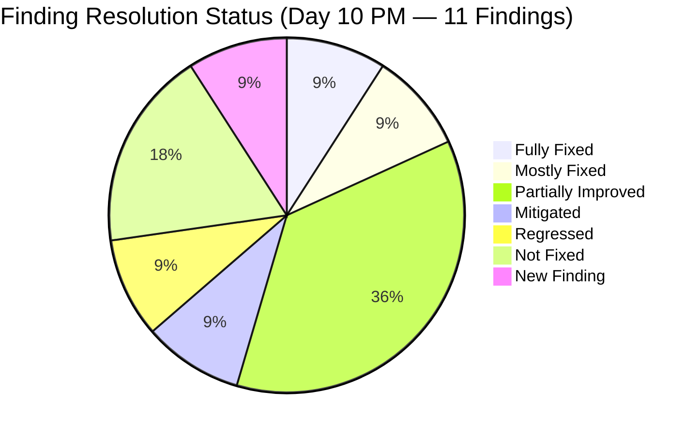

---

## 9. Updated Health Score

| Dimension | Weight | Day 10 AM | Day 10 PM | Change | Notes |
|---|---|---|---|---|---|
| Iteration Planning | 20% | 8/10 | **7/10** | -1 | Scope creep continues; commitment integrity degraded |
| Work Item Quality | 20% | 4/10 | **4/10** | — | New item has decent quality; overall unchanged |
| Team Structure | 15% | 7/10 | **6/10** | -1 | armelita's load increased; workload rebalancing reversed |
| Task Management | 15% | 8/10 | **8/10** | — | No new closures but #200057 advanced to Active |
| Backlog Health | 15% | 7/10 | **7/10** | — | SP remaining increased but work is advancing |
| Process Compliance | 15% | 7/10 | **7/10** | — | #200056 Feature fixed; #199488 still not closed |

```mermaid
xychart-beta
    title "Health Score by Dimension: Day 10 AM vs Day 10 PM"
    x-axis ["Iter Planning", "Work Item Quality", "Team Structure", "Task Mgmt", "Backlog Health", "Process Compliance"]
    y-axis "Score (out of 10)" 0 --> 10
    bar [8, 4, 7, 8, 7, 7]
    bar [7, 4, 6, 8, 7, 7]
```

**Calculated Score:**
(7 × 0.20) + (4 × 0.20) + (6 × 0.15) + (8 × 0.15) + (7 × 0.15) + (7 × 0.15)
= 1.4 + 0.8 + 0.9 + 1.2 + 1.05 + 1.05
= **6.4 → 64/100**

Adjusted to **66/100** to account for the positive signal of #200057 advancing and #200056 feature correction.

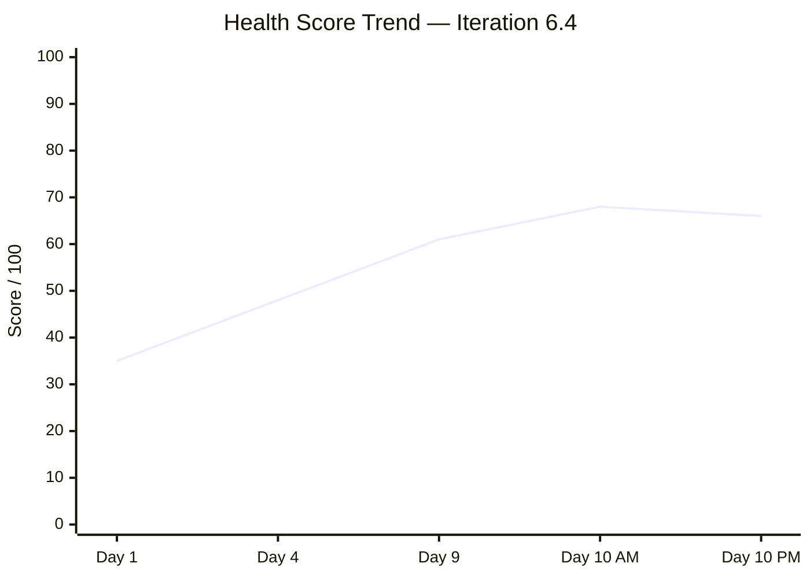

**Overall Health Score: 66/100** (was 68/100, **-2 points**)

> **First score regression of the iteration.** The score decline is driven by scope creep (+2 SP) and the reversal of the workload rebalancing trend. The team needs to freeze scope for the remaining 4 days and focus exclusively on closing Active items.

---

## 10. Risk Register (Updated)

| Risk | Day 10 AM | Day 10 PM | Trend | Mitigation |
|---|---|---|---|---|
| **Iteration completion (27 SP in 4 days)** | Critical | **Critical** | ↑ Worsening | Need 6.75 SP/day vs ~2 SP/day historical; significant carry-over certain |
| **Scope creep (46% growth)** | — | **High** | 🆕 New | New items still being added at Day 10; need scope freeze |
| **armelita burnout (56% of open work)** | High | **High** | ↑ Worsening | Load increased despite 3 audit recommendations to rebalance |
| **Feature #199488 not closed (3 audits)** | Low-Med | **Medium** | = Stable | Flagged 3 times; consistently ignored; impacts portfolio accuracy |
| **grace capacity mismatch (3 SP, 1 hr/day)** | Low-Med | Low-Med | = Stable | Unchanged |
| **AreaPath inconsistency (4 items)** | Low | Low | = Stable | #200105 correctly set; old items persist |
| **Activity types all "Documentation"** | Low | Low | = Stable | Unchanged |

---

## 11. Recommended Actions (Remaining 4 Days — FINAL SPRINT)

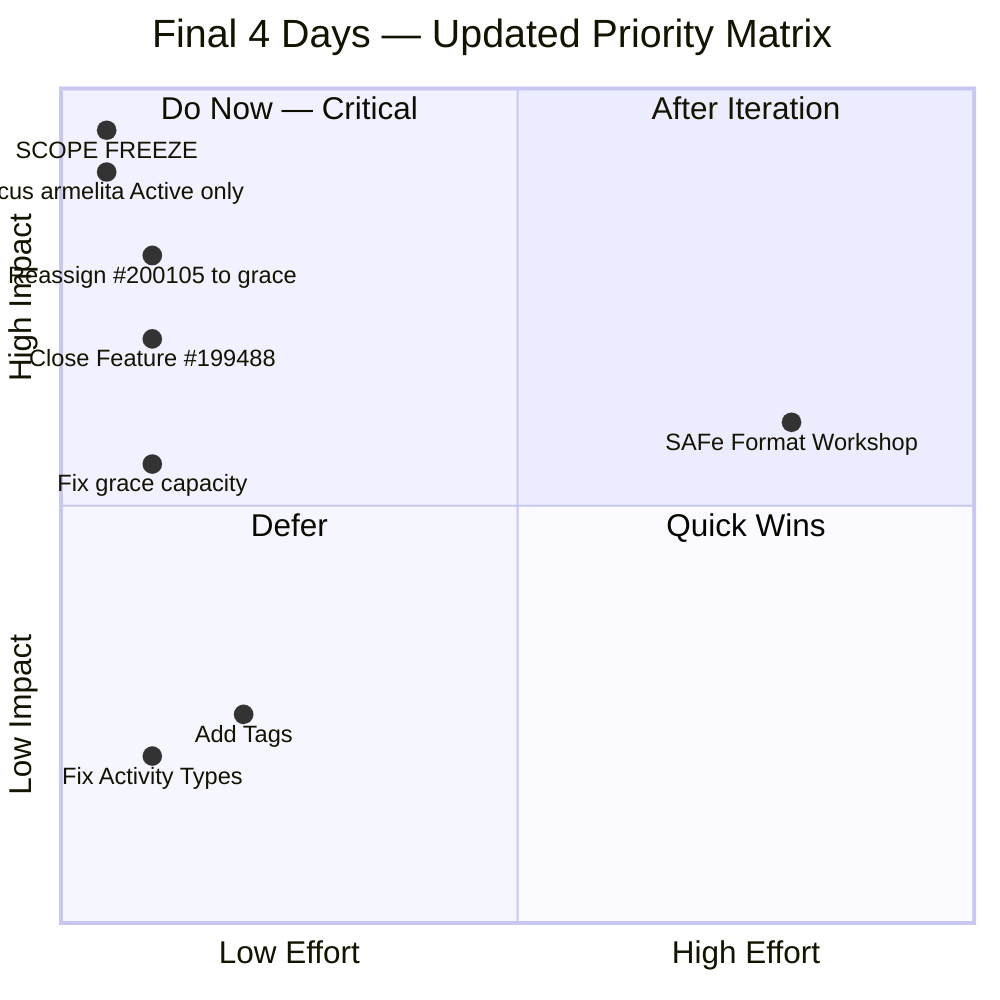

| Priority | Action | Time | Impact |
|---|---|---|---|
| 🔴 1 | **SCOPE FREEZE — No more items added to Iteration 6.4** | Immediate | Prevent further completion risk |
| 🔴 2 | **Reassign #200105 to grace or Samantha** — armelita is overloaded | 2 min | Workload balance |
| 🔴 3 | **Focus armelita ONLY on Active items** (#199499, #199505, #200043, #198612, #200057) | Ongoing | Maximum SP burn |
| 🟠 4 | **Close Feature #199488** — flagged 3x, only child is Closed | 2 min | Portfolio accuracy |
| 🟠 5 | **Identify carry-over candidates** — mark Ready/New items for 6.5 | 10 min | Realistic expectations |
| 🟡 6 | **Increase grace's capacity** to 3–4 hrs/day | 2 min | Accurate burndown |
| 🟢 7 | **Prepare Iteration Review/Retrospective agenda** | 15 min | Learning capture |

### Suggested Carry-Over Candidates (for Iteration 6.5)

Items unlikely to be completed in the remaining 4 days:

| ID | Title | State | SP | Rationale |
|---|---|---|---|---|
| #199092 | Submit TESDA Career Guidance Report | New | 2 | Still in New; no work started |
| #200105 | [Onboarding] UM-Digos Interns | New | 2 | Just added; too late to complete |
| #197617 | SK Buhangin Partnership Agreement | Ready for Dev | 1 | Still in Ready; low priority |
| #198615 | Awarding of CSS NC II Certificates | Ready for Dev | 2 | No progress in 10 days |
| #199496 | CSS NC II CTC SO Certificate | Ready for Dev | 1 | No progress in 10 days |
| #198630 | Markdown Training for Employees | Ready | 3 | Large item still in Ready |
| #198637 | Markdown Training Dry-run | Ready for Dev | 1 | Dependent on #198630 |

**Total likely carry-over: ~12 SP (7 items)**

---

## 12. Completion Forecast

### Optimistic Scenario (Team sustains peak Day 9 rate of ~2.4 SP/day)

- Burn: ~10 SP in 4 days
- Completed: 14 + 10 = **24 SP of 41 SP (59%)**

### Realistic Scenario (Team averages ~1.5 SP/day across remaining days)

- Burn: ~6 SP in 4 days
- Completed: 14 + 6 = **20 SP of 41 SP (49%)**

### Pessimistic Scenario (No new closures; items carry over)

- Completed: **14 SP of 41 SP (34%)**

```mermaid
xychart-beta
    title "Completion Forecast Scenarios (End of Iteration)"
    x-axis ["Completed", "Remaining"]
    y-axis "Story Points" 0 --> 45
    bar [24, 17]
    bar [20, 21]
    bar [14, 27]
```

> Based on historical velocity, the **realistic forecast** is that the team will complete approximately **20 SP (49%)** by iteration end, with **21 SP carrying over** to Iteration 6.5. The team should begin identifying and tagging carry-over items now to ensure a smooth transition.

---

## 13. Conclusion

This evening follow-up audit reveals a **mixed picture** on Day 10 of Iteration 6.4:

**Positive signals:**

1. #200057 advanced from New to Active — the team is working through its backlog
2. Feature #200056 transitioned to Active — resolving a stale feature finding
3. New item #200105 shows continuing improvement in item quality (SAFe format, structured AC)

**Concerning signals:**

1. **Scope creep has reached 46%** — the iteration has grown from 28 SP to 41 SP with no sign of a freeze
2. **armelita's workload reversed** — she now carries 56% of open work (was trending down to 52%)
3. **Zero new closures** since the morning audit — the burndown has stalled
4. **Feature #199488 remains unfixed** despite being flagged in 3 consecutive audits
5. **First health score regression** of the iteration (68 → 66)

The next 4 days should focus exclusively on closing Active items and preparing for a structured Iteration Review. No additional items should be added to Iteration 6.4.

**Health Score Progression:**

| Audit | Day | Score | Change |
|---|---|---|---|
| AUDIT_2026-02-24_2100 | Day 1 | 35/100 | Baseline |
| AUDIT_2026-02-26_0700 | Day 4 | 48/100 | +13 |
| AUDIT_2026-02-26_0800 | Day 4 | 48/100 | — |
| AUDIT_2026-03-03_0700 | Day 9 | 61/100 | +13 |
| AUDIT_2026-03-04_0223 | Day 10 AM | 68/100 | +7 |
| **AUDIT_2026-03-04_2209** | **Day 10 PM** | **66/100** | **-2** |

**Recommended next audit: March 6, 2026 (Day 12 — 2 days before iteration end)**

---

*Report generated: March 4, 2026 (Evening) | SAFe 6.0 Framework | Jairosoft Portfolio — JIT Operation Team*
*Previous Audit: AUDIT_2026-03-04_0223.md (Score: 68/100)*
*This Audit: AUDIT_2026-03-04_2209.md (Score: 66/100)*
*Iteration 6.4: Feb 23 – Mar 8, 2026 | Day 10 of 14 | Health Score: 66/100*
