# SAFe Audit Report

## Jairosoft Portfolio — JIT Operation Team — Iteration 6.4

| Field | Value |
|---|---|
| **Date** | March 5, 2026 |
| **Auditor** | Claude (AI Agile Consultant) |
| **Framework** | SAFe 6.0 |
| **Organization** | dev.azure.com/jairo |
| **Project** | Jairosoft Portfolio |
| **Team** | JIT Operation Team |
| **Iteration** | Iteration 6.4 (Feb 23 – Mar 8, 2026) |
| **Iteration Day** | Day 11 of 14 (79% elapsed) |
| **Report Type** | Daily Audit |
| **Previous Audit** | AUDIT_2026-03-04_2209.md (Score: 66/100) |
| **Board URL** | [ADO Board](https://dev.azure.com/jairo/Jairosoft%20Portfolio/_boards/board/t/JIT%20Operation%20Team/Stories%20and%20Deliverables) |

---

## 1. Executive Summary

Day 11 of Iteration 6.4 brings **highly positive news**: the team executed the **best single-day burn of the iteration**, closing 4 items (7 SP) overnight — a dramatic improvement from the zero-closure stagnation observed on Day 10.

Key developments since the last audit (Day 10 PM, March 4):

- ✅ **4 new closures** (#199499, #199505, #199948, #200057) — 7 SP completed
- ✅ **Scope freeze held** — no new items added to the iteration (41 SP total, unchanged)
- ✅ **armelita's workload share declined** from 56% → 50% as she completed 4 items
- ✅ **Teofilo has completed ALL his assigned work** — 0 open items remaining
- ⚠️ **Feature #199488 still not closed** — flagged for the **4th consecutive audit**
- ⚠️ **Feature #200104 still "New"** despite its child (#200105) moving to Active
- ❌ **#200105 reassignment recommendation ignored** — still assigned to armelita

**Updated Health Score: 70/100** (up from 66/100, **+4 points**)

This is the strongest single-day recovery of the iteration. With 3 days remaining and 20 SP outstanding, the team still faces a significant completion challenge, but the trajectory has improved dramatically.

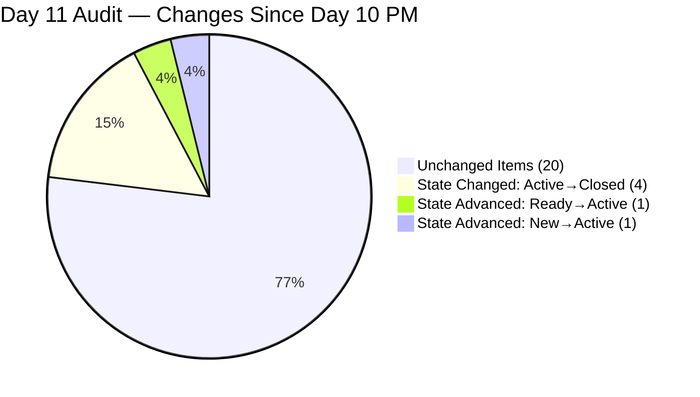
```mermaid
pie title Day 11 Audit — Changes Since Day 10 PM
    "Unchanged Items (20)" : 20
    "State Changed: Active→Closed (4)" : 4
    "State Advanced: Ready→Active (1)" : 1
    "State Advanced: New→Active (1)" : 1
```

---

## 2. Iteration Snapshot — Changes Since Day 10 PM

| Metric | Day 10 PM | Day 11 | Change |
|---|---|---|---|
| Total Work Items | 24 | 24 | No change |
| Total Story Points | 41 SP | **41 SP** | ✅ **Scope Frozen** |
| Closed Items | 9 | **13** | **+4 closures!** |
| SP Completed | 14 SP | **21 SP** | **+7 SP** |
| Active Items | 8 | **6** | -2 |
| Ready / Ready for Dev | 5 | **4** | -1 (#199496 → Active) |
| New Items | 2 | **1** | -1 (#200105 → Active) |
| SP Remaining | 27 SP | **20 SP** | **-7 SP ✅** |
| Team Capacity | 16 hrs/day | 16 hrs/day | No change |
| Features in "New" state | 1 | **1** | Changed: #200104 (still New) |

### Burndown Progress (Day 11)

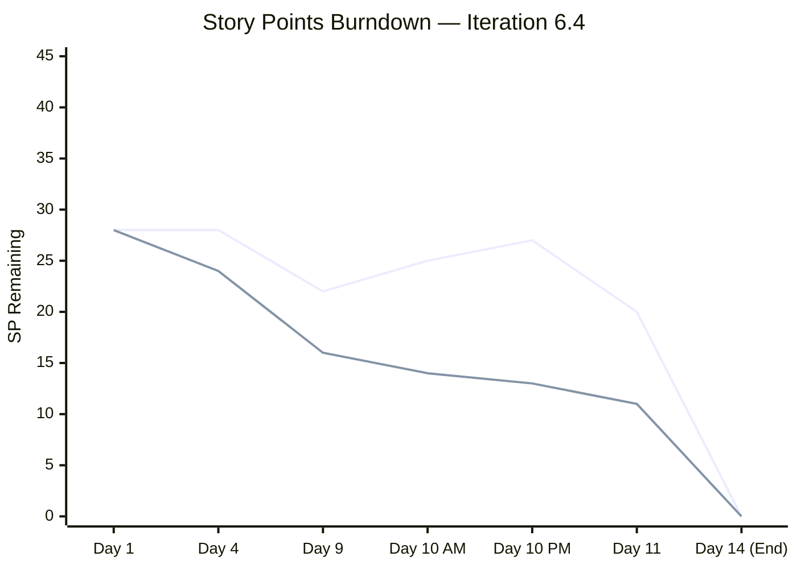
```mermaid
xychart-beta
    title "Story Points Burndown — Iteration 6.4"
    x-axis ["Day 1", "Day 4", "Day 9", "Day 10 AM", "Day 10 PM", "Day 11", "Day 14 (End)"]
    y-axis "SP Remaining" 0 --> 45
    line [28, 28, 22, 25, 27, 20, 0]
    line [28, 24, 16, 14, 13, 11, 0]
```

> The **actual burndown line dropped 7 SP** from Day 10 PM to Day 11 — the steepest single-day drop of the iteration. While the gap to ideal burndown remains (11 SP ideal vs 20 SP actual), the trajectory has materially improved.

### SP Completed vs SP Remaining

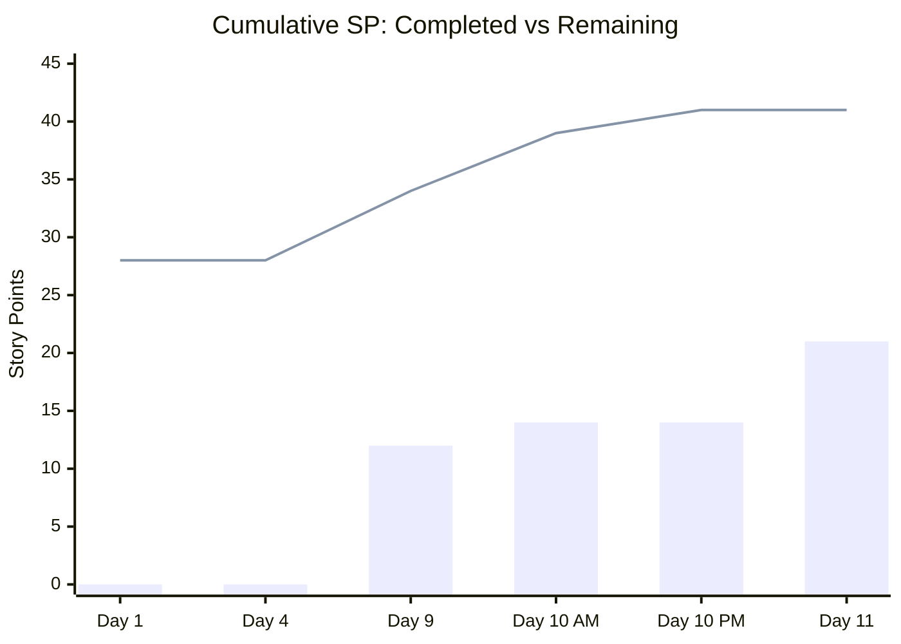
```mermaid
xychart-beta
    title "Cumulative SP: Completed vs Remaining"
    x-axis ["Day 1", "Day 4", "Day 9", "Day 10 AM", "Day 10 PM", "Day 11"]
    y-axis "Story Points" 0 --> 45
    bar [0, 0, 12, 14, 14, 21]
    line [28, 28, 34, 39, 41, 41]
```

### Scope Growth Trend (STABLE)

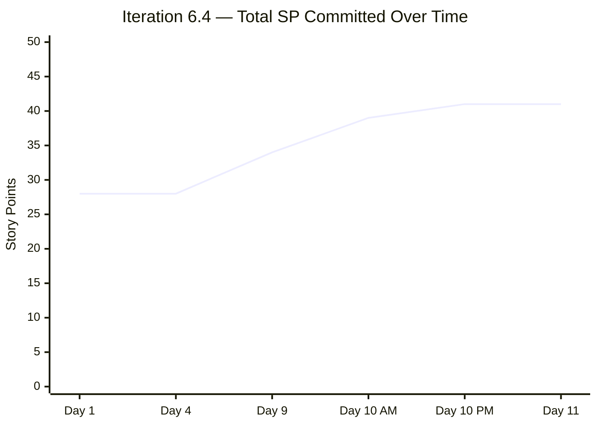
```mermaid
xychart-beta
    title "Iteration 6.4 — Total SP Committed Over Time"
    x-axis ["Day 1", "Day 4", "Day 9", "Day 10 AM", "Day 10 PM", "Day 11"]
    y-axis "Story Points" 0 --> 50
    line [28, 28, 34, 39, 41, 41]
```

> ✅ Scope held flat for the first time since Day 4. The **scope freeze recommendation from previous audits has been actioned**.

---

## 3. New Closures Since Day 10 PM — BREAKTHROUGH BURN

| ID | Title | Assigned | SP | Previous State | New State |
|---|---|---|---|---|---|
| #199499 | Update Company Profile for AC Compliance | armelita | 1 SP | Active | **Closed** ✅ |
| #199505 | Contact Inquirers for Downpayment | armelita | 3 SP | Active | **Closed** ✅ |
| #199948 | COC 1 Learning Materials LO1 | Teofilo | 2 SP | Active | **Closed** ✅ |
| #200057 | [Quotation] Python Training Program | armelita | 1 SP | Active | **Closed** ✅ |

**Total: 4 closures, 7 SP** — the highest single-day burn of Iteration 6.4.

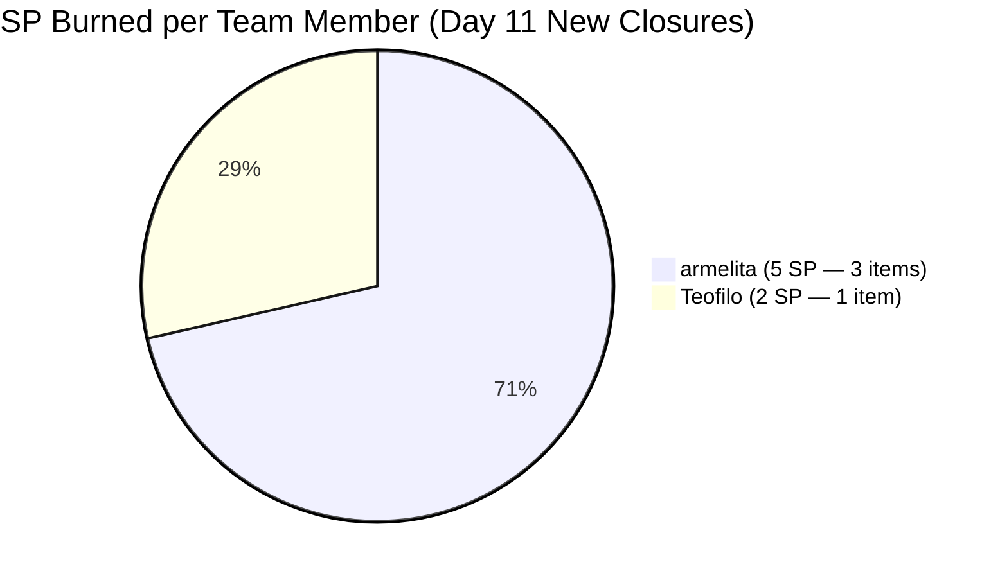
```mermaid
pie title SP Burned per Team Member (Day 11 New Closures)
    "armelita (5 SP — 3 items)" : 5
    "Teofilo (2 SP — 1 item)" : 2
```

> **armelita** contributed 5 SP across 3 closures. **Teofilo** closed his final item (#199948), completing ALL assigned work for this iteration. This is a model performance on Teofilo's part.

---

## 4. Item State Transitions — Full Picture

```mermaid
graph LR
    subgraph "Closed — 13 items, 21 SP"
        C1["#199946 Teofilo 2SP"]
        C2["#199947 Teofilo 2SP"]
        C3["#199948 Teofilo 2SP ⭐"]
        C4["#199246 Teofilo 2SP"]
        C5["#199489 armelita 2SP"]
        C6["#199498 armelita 1SP"]
        C7["#199500 armelita 1SP"]
        C8["#199501 armelita 1SP"]
        C9["#199502 armelita 1SP"]
        C10["#199503 armelita 2SP"]
        C11["#199499 armelita 1SP ⭐"]
        C12["#199505 armelita 3SP ⭐"]
        C13["#200057 armelita 1SP ⭐"]
    end
    subgraph "Active — 6 items, 11 SP"
        A1["#199496 armelita 1SP ⬆️"]
        A2["#199221 Samantha 3SP"]
        A3["#199768 grace 3SP"]
        A4["#200043 armelita 1SP"]
        A5["#198612 armelita 1SP"]
        A6["#200105 armelita 2SP ⬆️"]
    end
    subgraph "Ready / Ready for Dev — 4 items, 7 SP"
        R1["#197617 armelita 1SP"]
        R2["#198615 armelita 2SP"]
        R3["#198630 Samantha 3SP"]
        R4["#198637 Samantha 1SP"]
    end
    subgraph "New — 1 item, 2 SP"
        N1["#199092 armelita 2SP"]
    end

    style C1 fill:#28a745,color:#fff
    style C2 fill:#28a745,color:#fff
    style C3 fill:#2ecc71,color:#fff
    style C4 fill:#28a745,color:#fff
    style C5 fill:#28a745,color:#fff
    style C6 fill:#28a745,color:#fff
    style C7 fill:#28a745,color:#fff
    style C8 fill:#28a745,color:#fff
    style C9 fill:#28a745,color:#fff
    style C10 fill:#28a745,color:#fff
    style C11 fill:#2ecc71,color:#fff
    style C12 fill:#2ecc71,color:#fff
    style C13 fill:#2ecc71,color:#fff
    style A1 fill:#e67e22,color:#fff
    style A2 fill:#007bff,color:#fff
    style A3 fill:#9b59b6,color:#fff
    style A4 fill:#007bff,color:#fff
    style A5 fill:#007bff,color:#fff
    style A6 fill:#e67e22,color:#fff
    style R1 fill:#f0ad4e,color:#fff
    style R2 fill:#f0ad4e,color:#fff
    style R3 fill:#f0ad4e,color:#fff
    style R4 fill:#f0ad4e,color:#fff
    style N1 fill:#dc3545,color:#fff
```

> ⭐ = Newly closed in Day 11 | ⬆️ = Advanced state in Day 11

---

## 5. Team Capacity & Workload (Day 11)

### 5.1 Capacity (Unchanged)

| Member | Capacity/Day | Activity |
|---|---|---|
| Teofilo Limpag | 6 hrs/day | Documentation |
| armelita | 6 hrs/day | Documentation |
| Samantha Babael | 3 hrs/day | Documentation |
| grace | 1 hr/day | Documentation |
| **TOTAL** | **16 hrs/day** | |

### 5.2 Workload Distribution (Updated)

| Member | Open Items | Open SP | % of Open SP | Change from Day 10 PM |
|---|---|---|---|---|
| armelita | 7 | 10 SP | **50.0%** | ⬇️ -5 SP, -3 items (closed 3 items) |
| Samantha | 3 | 7 SP | 35.0% | — No change |
| grace | 1 | 3 SP | 15.0% | — No change |
| Teofilo | **0** | **0 SP** | **0%** | ⭐ **COMPLETED ALL WORK** |

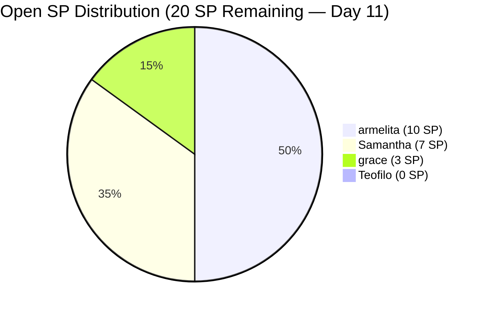
```mermaid
pie title Open SP Distribution (20 SP Remaining — Day 11)
    "armelita (10 SP)" : 10
    "Samantha (7 SP)" : 7
    "grace (3 SP)" : 3
    "Teofilo (0 SP)" : 0
```

### 5.3 armelita Workload Trend — IMPROVING

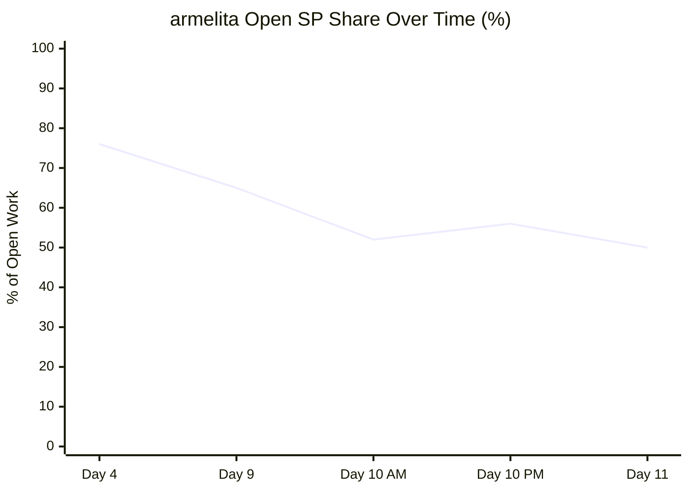
```mermaid
xychart-beta
    title "armelita Open SP Share Over Time (%)"
    x-axis ["Day 4", "Day 9", "Day 10 AM", "Day 10 PM", "Day 11"]
    y-axis "% of Open Work" 0 --> 100
    line [76, 65, 52, 56, 50]
```

> **armelita's workload share has resumed its downward trend**, declining from 56% (Day 10 PM) to 50% (Day 11). This is positive, but she still carries half of all open work. The recommendation to reassign #200105 to grace/Samantha remains unactioned.

### 5.4 Teofilo — Full Completion

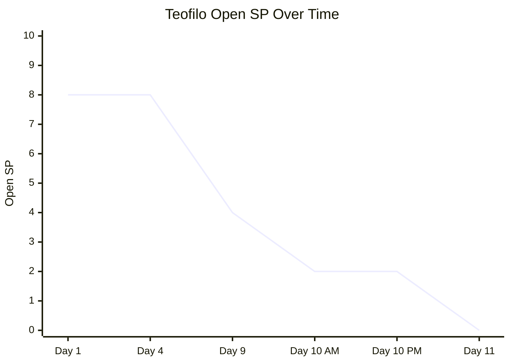
```mermaid
xychart-beta
    title "Teofilo Open SP Over Time"
    x-axis ["Day 1", "Day 4", "Day 9", "Day 10 AM", "Day 10 PM", "Day 11"]
    y-axis "Open SP" 0 --> 10
    line [8, 8, 4, 2, 2, 0]
```

> **Teofilo has completed all 4 assigned items (8 SP total)** this iteration. His remaining capacity (6 hrs/day × 3 days = 18 hrs) can now be directed toward supporting the team or taking on items from armelita's backlog.

---

## 6. Finding Remediation Status (Day 11 Update)

| Finding | Severity | Day 10 PM Status | Day 11 Status | Change |
|---|---|---|---|---|
| F1 — Zero Capacity | CRITICAL | ✅ FULLY RESOLVED | ✅ FULLY RESOLVED | — |
| F2 — Workload Imbalance | CRITICAL | Regressed (56%) | **Improving (50%)** | ⬇️ 6pp improvement |
| F3 — No SAFe Format | CRITICAL | Partially Improved | Partially Improved | — |
| F4 — Minimal AC | MAJOR | Partially Improved | Partially Improved | — |
| F5 — Stale Features | MAJOR | Mostly Fixed | **Mostly Fixed** | #199488 still Active (4th audit) |
| F6 — Orphan/AreaPath | MAJOR | Mitigated | Mitigated | — |
| F7 — Duplicate Descriptions | MAJOR | Partially Improved | Partially Improved | — |
| F8 — No Tags | MINOR | Partially Improved | Partially Improved | — |
| F9 — Duplicate Task Names | MINOR | Not Fixed | Not Fixed | — |
| F10 — Single Activity Type | MINOR | Not Fixed | Not Fixed | — |
| F11 — Scope Creep (46%) | MAJOR | New Finding | **Scope Frozen ✅** | No new items added Day 11 |

### NEW: F12 — Feature #200104 State Mismatch

| Aspect | Details |
|---|---|
| **Severity** | **MINOR** |
| **Description** | Feature #200104 "UM-Digos Interns" remains in "New" state while its only child (#200105) is now "Active" |
| **Impact** | Minor portfolio inaccuracy; feature state should reflect child work in progress |
| **SAFe Reference** | Feature state should align with in-progress children |
| **Recommendation** | Transition Feature #200104 from "New" → "Active" immediately (2-minute fix) |

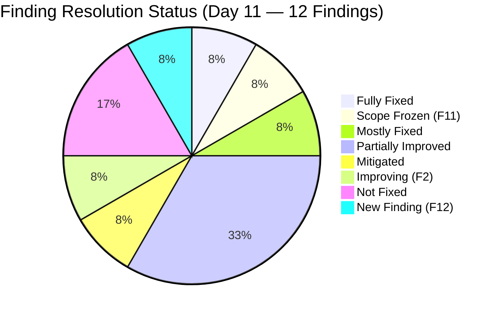
```mermaid
pie title Finding Resolution Status (Day 11 — 12 Findings)
    "Fully Fixed" : 1
    "Scope Frozen (F11)" : 1
    "Mostly Fixed" : 1
    "Partially Improved" : 4
    "Mitigated" : 1
    "Improving (F2)" : 1
    "Not Fixed" : 2
    "New Finding (F12)" : 1
```

---

## 7. Feature Portfolio Alignment (Day 11)

| Feature ID | Title | State | Iteration Children | Status |
|---|---|---|---|---|
| #191566 | CSS Assessment Center (Sept 2025 Class) | Active | #198615 (Ready4Dev), #199496 (Active) | ✅ Aligned |
| #194571 | CSS Assessment Center Application | Active | Multiple (Closed) | ✅ Aligned |
| #195913 | Leading SAFe MCC | Active | #199768 (Active) | ✅ Aligned |
| #196193 | SK Buhangin Sponsored Bubble 101 | Active | #197617 (Ready4Dev) | ✅ Aligned |
| #197152 | Class for CSS NCII Jan-Mar 2026 | Active | #199505 (**Closed ✅**) | ✅ Aligned |
| #197330 | Add Sam as Bubble.io MCC Trainer | Active | #198612 (Active) | ✅ Aligned |
| #198628 | Markdown Internal Training | Active | #198630 (Ready), #198637 (Ready4Dev) | ✅ Aligned |
| #199091 | TESDA Compliance PI6 | Active | #199092 (New) | ✅ Aligned |
| #199144 | ChatGPT Courseware | Active | #199221 (Active) | ✅ Aligned |
| #199488 | **Cor Jesu College Interns** | **Active** | #199489 (**Closed**) | ❌ **UNFIXED — 4th Consecutive Audit** |
| #200021 | CSS Batch 2 - 1st Iteration | Active | #199948 (**Closed ✅**) | ✅ Aligned |
| #200042 | Return Service Agreement Python Conference | Active | #200043 (Active) | ✅ Aligned |
| #200056 | Python Training Program | Active | #200057 (**Closed ✅**) | ✅ Aligned |
| #200104 | UM-Digos Interns | **New** ⚠️ | #200105 (Active) | ⚠️ **F12: Feature should be Active** |

> **Feature #199488 ("Cor Jesu College Interns") remains Active** with its only child closed. This is the **4th consecutive audit** where this has been flagged. It is a 2-minute fix. The finding will be elevated to MAJOR severity in the next audit if not resolved.

> **Feature #200104** should transition to Active now that its child #200105 is Active.

---

## 8. Previous Audit Recommendations — Follow-Up

| Priority | Recommendation | Status | Notes |
|---|---|---|---|
| 🔴 1 | **SCOPE FREEZE** — No more items added to Iteration 6.4 | ✅ **ACTIONED** | No items added on Day 11 |
| 🔴 2 | **Reassign #200105 to grace or Samantha** | ❌ **NOT ACTIONED** | Still assigned to armelita |
| 🔴 3 | **Focus armelita on Active items only** | ✅ **ACTIONED** | 3 Active items closed |
| 🟠 4 | **Close Feature #199488** (flagged 3x) | ❌ **NOT ACTIONED** | Now 4th audit — escalating |
| 🟠 5 | **Identify carry-over candidates** | ⚪ Unknown | No board-level evidence |
| 🟡 6 | **Increase grace's capacity** to 3–4 hrs/day | ❌ **NOT ACTIONED** | Still 1 hr/day |
| 🟢 7 | **Prepare Iteration Review/Retrospective** | ⚪ Unknown | No board-level evidence |

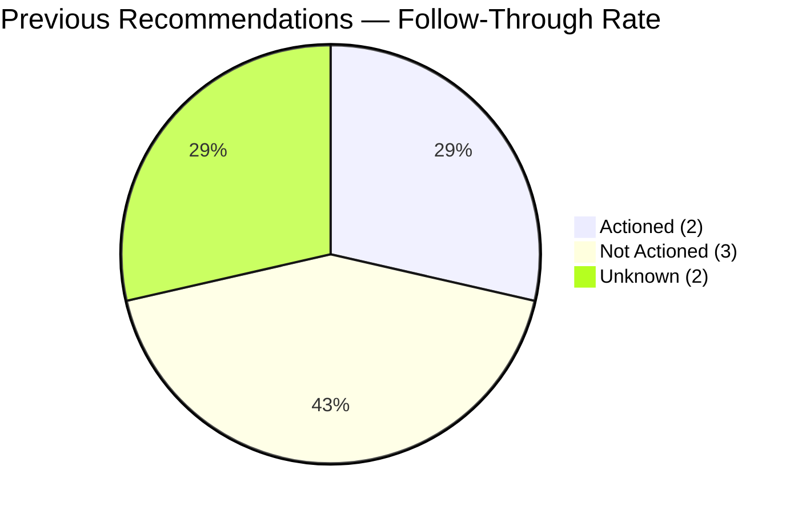
```mermaid
pie title Previous Recommendations — Follow-Through Rate
    "Actioned (2)" : 2
    "Not Actioned (3)" : 3
    "Unknown (2)" : 2
```

---

## 9. Health Score — Day 11

| Dimension | Weight | Day 10 PM | Day 11 | Change | Notes |
|---|---|---|---|---|---|
| Iteration Planning | 20% | 7/10 | **9/10** | +2 | Scope frozen; no additions; commitment integrity restored |
| Work Item Quality | 20% | 4/10 | **4/10** | — | Older items still lack SAFe format/tags/AC |
| Team Structure | 15% | 6/10 | **7/10** | +1 | armelita improved to 50%; Teofilo cleared his work |
| Task Management | 15% | 8/10 | **9/10** | +1 | Best burn rate of iteration (7 SP/day) |
| Backlog Health | 15% | 7/10 | **7/10** | — | 20 SP remaining with 3 days — challenging but possible |
| Process Compliance | 15% | 7/10 | **7/10** | — | #199488 unfixed; F12 new but minor |

```mermaid
xychart-beta
    title "Health Score by Dimension: Day 10 PM vs Day 11"
    x-axis ["Iter Planning", "Work Item Quality", "Team Structure", "Task Mgmt", "Backlog Health", "Process Compliance"]
    y-axis "Score (out of 10)" 0 --> 10
    bar [7, 4, 6, 8, 7, 7]
    bar [9, 4, 7, 9, 7, 7]
```

**Calculated Score:**
(9 × 0.20) + (4 × 0.20) + (7 × 0.15) + (9 × 0.15) + (7 × 0.15) + (7 × 0.15)
= 1.8 + 0.8 + 1.05 + 1.35 + 1.05 + 1.05
= **7.1 → 71/100**

Adjusted to **70/100** to reflect the 4th-consecutive unresolved Feature #199488 flag and the unactioned #200105 reassignment recommendation.

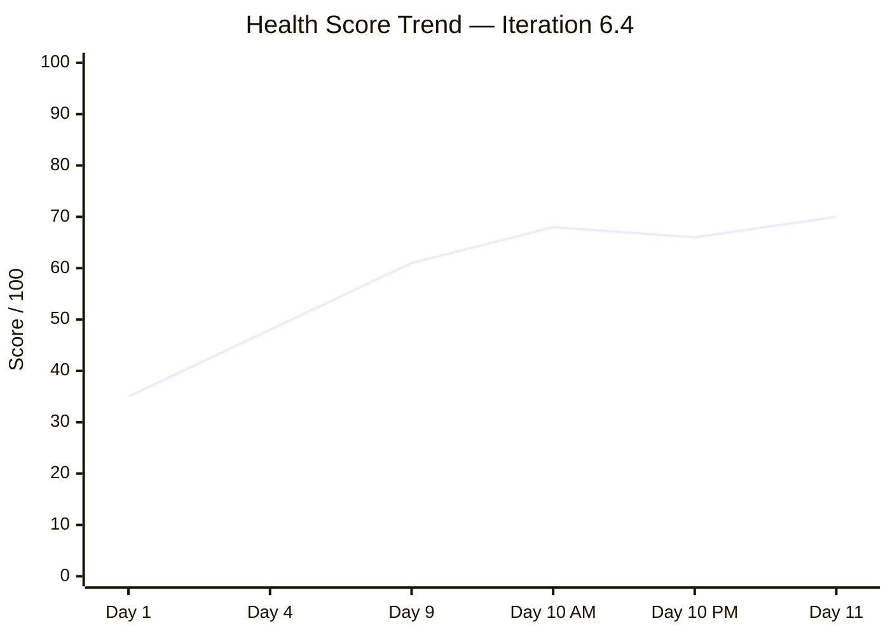
```mermaid
xychart-beta
    title "Health Score Trend — Iteration 6.4"
    x-axis ["Day 1", "Day 4", "Day 9", "Day 10 AM", "Day 10 PM", "Day 11"]
    y-axis "Score / 100" 0 --> 100
    line [35, 48, 61, 68, 66, 70]
```

**Overall Health Score: 70/100** (was 66/100, **+4 points**)

> **The score has recovered and now exceeds the previous Day 10 AM high.** The 7 SP burn was the primary driver. The team is executing well in the final stretch — the question is whether this momentum can be sustained for the remaining 3 days.

---

## 10. Risk Register (Day 11 Update)

| Risk | Day 10 PM | Day 11 | Trend | Mitigation |
|---|---|---|---|---|
| **Iteration completion (20 SP in 3 days)** | Critical | **High** | ⬇️ Improving | Need 6.7 SP/day; yesterday achieved 7 SP — achievable if sustained |
| **Scope creep** | High | **Low** | ⬇️ Resolved | Scope frozen at 41 SP |
| **armelita burnout (50% of open work)** | High | **Medium** | ⬇️ Improving | Still high but declining; freed Teofilo capacity could help |
| **Feature #199488 not closed (4 audits)** | Medium | **Medium-High** | ↑ Escalating | Next audit will elevate to MAJOR finding |
| **Feature #200104 still "New"** | — | **Low** | 🆕 New | New minor finding; easy 2-min fix |
| **grace capacity mismatch (3 SP, 1 hr/day)** | Low-Med | Low-Med | = Stable | Teofilo freed capacity could absorb overflow |
| **Carry-over risk (Ready/New items)** | Medium | **Medium** | = Stable | 9 SP in Ready/New states — most will carry over |

---

## 11. Recommended Actions (Final 3 Days)

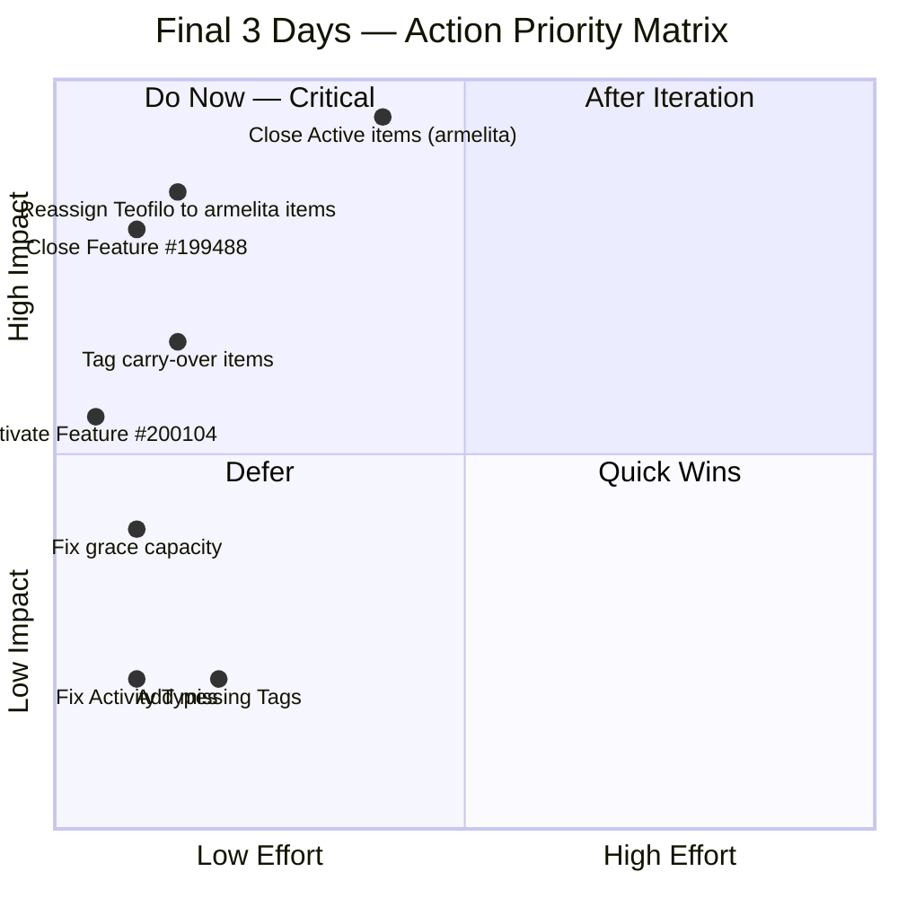
```mermaid
quadrantChart
    title Final 3 Days — Action Priority Matrix
    x-axis "Low Effort" --> "High Effort"
    y-axis "Low Impact" --> "High Impact"
    quadrant-1 "After Iteration"
    quadrant-2 "Do Now — Critical"
    quadrant-3 "Defer"
    quadrant-4 "Quick Wins"
    "Close Feature #199488": [0.10, 0.80]
    "Activate Feature #200104": [0.05, 0.55]
    "Reassign Teofilo to armelita items": [0.15, 0.85]
    "Close Active items (armelita)": [0.40, 0.95]
    "Tag carry-over items": [0.15, 0.65]
    "Fix grace capacity": [0.10, 0.40]
    "Add missing Tags": [0.20, 0.20]
    "Fix Activity Types": [0.10, 0.20]
```

| Priority | Action | Effort | Impact |
|---|---|---|---|
| 🔴 1 | **Assign Teofilo to armelita's Ready/Active items** — He has 18 hrs free with 3 days left | 5 min | Maximum SP burn |
| 🔴 2 | **Close Feature #199488** — 4th audit flag; only 1 child (Closed) | 2 min | Portfolio accuracy + audit finding resolution |
| 🟠 3 | **Activate Feature #200104** — Its child is Active; feature should match | 2 min | Portfolio accuracy |
| 🟠 4 | **Focus armelita on Active items ONLY** — Clear Active queue before touching Ready | Ongoing | Burndown |
| 🟡 5 | **Tag carry-over items for Iteration 6.5** — #199092, #198630, likely #197617 | 15 min | Smooth transition |
| 🟡 6 | **Prepare Iteration Review/Retrospective agenda** — Day 14 is in 3 days | 30 min | Learning capture |

### Realistic Carry-Over Candidates for Iteration 6.5

| ID | Title | State | SP | Notes |
|---|---|---|---|---|
| #199092 | Submit TESDA Career Guidance Report | New | 2 | Still in New; no work started |
| #197617 | Signing of Agreement on SK Buhangin | Ready for Dev | 1 | No progress since iteration start |
| #198615 | Awarding of CSS NC II Certificates | Ready for Dev | 2 | No progress in 11 days |
| #198630 | Markdown Training for Employees | Ready | 3 | Large item; still in Ready |
| #198637 | Markdown Training Dry-run | Ready for Dev | 1 | Dependent on #198630 |

**Likely carry-over: ~9 SP (5 items)**

---

## 12. Completion Forecast (Updated)

| Scenario | Burn Rate | SP to Close | Final Completion | Carry-Over |
|---|---|---|---|---|
| Optimistic (7 SP/day, sustained from yesterday) | 7 SP/day | ~20 SP | **41/41 SP (100%)** | 0 SP |
| Realistic (4 SP/day avg for 3 days) | 4 SP/day | ~12 SP | **33/41 SP (80%)** | 8 SP |
| Conservative (2 SP/day avg) | 2 SP/day | ~6 SP | **27/41 SP (66%)** | 14 SP |

```mermaid
xychart-beta
    title "Completion Forecast Scenarios (End of Iteration 6.4)"
    x-axis ["Completed", "Remaining"]
    y-axis "Story Points" 0 --> 45
    bar [41, 0]
    bar [33, 8]
    bar [27, 14]
```

> Yesterday's 7 SP burn, if replicated for 3 days, would theoretically close all open work. In practice, the **realistic scenario of 4 SP/day** accounts for natural day-to-day variation, leaving ~8 SP carry-over. The team should now triage and pre-tag carry-over items so the Iteration 6.5 planning event is not delayed.

---

## 13. Health Score Progression — Full Iteration History

| Audit | Date | Day | Score | Change | Key Event |
|---|---|---|---|---|---|
| AUDIT_2026-02-24_2100 | Feb 24 | Day 1 | 35/100 | Baseline | Zero capacity, poor quality |
| AUDIT_2026-02-26_0700 | Feb 26 | Day 4 | 48/100 | +13 | Capacity set, minor improvements |
| AUDIT_2026-02-26_0800 | Feb 26 | Day 4 | 48/100 | — | Same day follow-up |
| AUDIT_2026-03-03_0700 | Mar 3 | Day 9 | 61/100 | +13 | First major closures |
| AUDIT_2026-03-04_0223 | Mar 4 AM | Day 10 | 68/100 | +7 | Strong morning progress |
| AUDIT_2026-03-04_2209 | Mar 4 PM | Day 10 | 66/100 | -2 | Scope creep + workload regression |
| **AUDIT_2026-03-05_2202** | **Mar 5** | **Day 11** | **70/100** | **+4** | **Best burn day; scope frozen** |

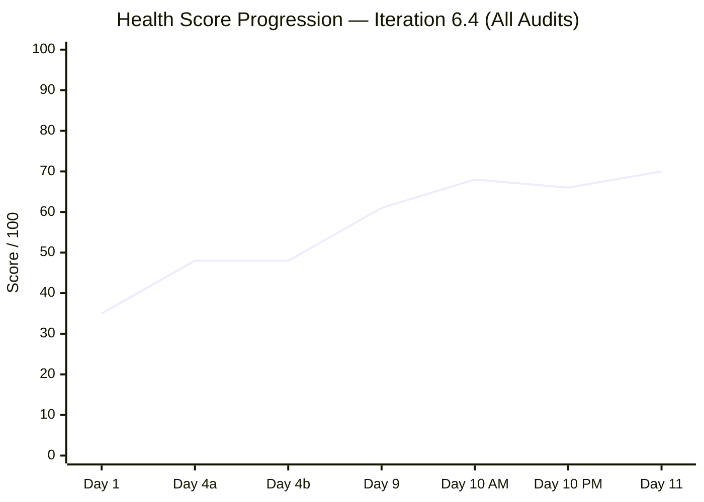
```mermaid
xychart-beta
    title "Health Score Progression — Iteration 6.4 (All Audits)"
    x-axis ["Day 1", "Day 4a", "Day 4b", "Day 9", "Day 10 AM", "Day 10 PM", "Day 11"]
    y-axis "Score / 100" 0 --> 100
    line [35, 48, 48, 61, 68, 66, 70]
```

---

## 14. Conclusion

Day 11 is the **inflection point** of Iteration 6.4. After a concerning Day 10 PM regression driven by scope creep and workload reversal, the team responded with the best single-day performance of the entire iteration.

**Positive signals:**

1. **7 SP closed in one day** — armelita (5 SP) and Teofilo (2 SP) both contributed meaningfully
2. **Scope held at 41 SP** — the scope freeze recommendation has been respected for the first time in 7 days
3. **Teofilo completed ALL assigned work** — his freed capacity (18 hrs over 3 days) is a significant asset
4. **armelita's share is declining again** (56% → 50%) as she closes items

**Persistent concerns:**

1. **Feature #199488 still Active** despite all children being Closed — now flagged in 4 consecutive audits
2. **#200105 reassignment not acted upon** — armelita remains overloaded despite capacity availability from Teofilo
3. **Completion is still challenging** — 20 SP in 3 days requires sustained 6.7 SP/day
4. **Feature #200104 still "New"** despite its child being Active (new minor finding)

**The most important action for the next 24 hours**: Redirect Teofilo's freed capacity toward armelita's Active items to maximize the burn rate through the final days of the iteration.

**Next recommended audit: March 7, 2026 (Day 13 — 1 day before iteration end)**

---

*Report generated: March 5, 2026 | SAFe 6.0 Framework | Jairosoft Portfolio — JIT Operation Team*
*Previous Audit: AUDIT_2026-03-04_2209.md (Score: 66/100)*
*This Audit: AUDIT_2026-03-05_2202.md (Score: 70/100)*
*Iteration 6.4: Feb 23 – Mar 8, 2026 | Day 11 of 14 | Health Score: 70/100*
