# SAFe Audit Report
## Jairosoft Portfolio — JIT Operation Team — Iteration 6.4

| Field | Value |
|---|---|
| **Date** | March 6, 2026 |
| **Auditor** | Claude (AI Agile Consultant) |
| **Framework** | SAFe 6.0 |
| **Organization** | dev.azure.com/jairo |
| **Project** | Jairosoft Portfolio |
| **Team** | JIT Operation Team |
| **Iteration** | Iteration 6.4 (Feb 23 – Mar 8, 2026) |
| **Iteration Day** | Day 12 of 14 (86% elapsed) |
| **Report Type** | Daily Audit |
| **Previous Audit** | AUDIT_2026-03-05_2202.md (Score: 70/100) |
| **Board URL** | [ADO Board](https://dev.azure.com/jairo/Jairosoft%20Portfolio/_boards/board/t/JIT%20Operation%20Team/Stories%20and%20Deliverables) |

---

## 1. Executive Summary

Day 12 of Iteration 6.4 marks a landmark milestone: **armelita has cleared her entire workload**, completing 4 additional items and properly carrying over 3 items to the next iteration. This is the first time in the entire iteration that armelita's open SP share has reached 0%.

Key developments since Day 11 (March 5):

- ✅ **4 new closures** by armelita (#199496, #198612, #200043, #200105) — 5 SP completed
- ✅ **3 items proactively moved to Iteration 6.5** (#197617, #198615, #199092) — proper carry-over management
- ✅ **armelita: 0 open items, 0 SP** — full completion of assigned work
- ✅ **Teofilo: 0 open items, 0 SP** — maintained full completion from Day 11
- ⚠️ **Samantha: 3 items, 7 SP open** — 2 days left with 3 hr/day capacity
- ⚠️ **grace: 1 item, 3 SP open** — 2 days left with 1 hr/day capacity (underpowered)
- ❌ **Feature #199488 STILL Active** — now flagged in **5 consecutive audits** — ELEVATED TO MAJOR
- ❌ **Feature #200104 still "New"** — its child #200105 is now **Closed** — F12 finding worsened

**Updated Health Score: 74/100** (up from 70/100, **+4 points**)

The iteration enters its final 2 days with excellent individual contributor performance but lingering process compliance issues and a tight capacity crunch for the remaining open items.

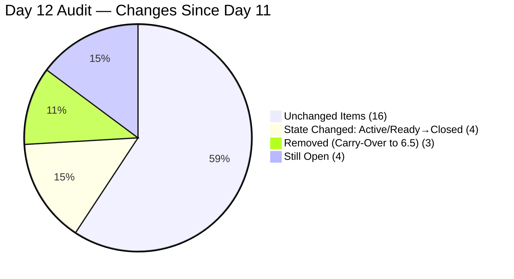
```mermaid
pie title Day 12 Audit — Changes Since Day 11
    "Unchanged Items (16)" : 16
    "State Changed: Active/Ready→Closed (4)" : 4
    "Removed (Carry-Over to 6.5) (3)" : 3
    "Still Open (4)" : 4
```

---

## 2. Iteration Snapshot — Changes Since Day 11

| Metric | Day 11 | Day 12 | Change |
|---|---|---|---|
| Total Work Items (top-level) | 24 | **22** | -2 (net: -3 removed, was 24 → 22) |
| Total Story Points (adjusted) | 41 SP | **36 SP** | -5 SP (carry-over removals) |
| Closed Items | 13 | **18** | **+5 closures since Day 11** |
| SP Completed | 21 SP | **26 SP** | **+5 SP** |
| Active Items | 6 | **2** | -4 (armelita cleared all) |
| Ready / Ready for Dev | 4 | **2** | -2 (removed + carried over) |
| New Items | 1 | **0** | -1 (removed) |
| SP Remaining | 20 SP | **10 SP** | **-10 SP ✅** |
| Team Capacity | 16 hrs/day | **4 hrs/day** | -12 hrs (armelita+Teofilo done) |
| Features in "New" state | 1 | **1** | Feature #200104 still "New" |

### Burndown Progress (Day 12)

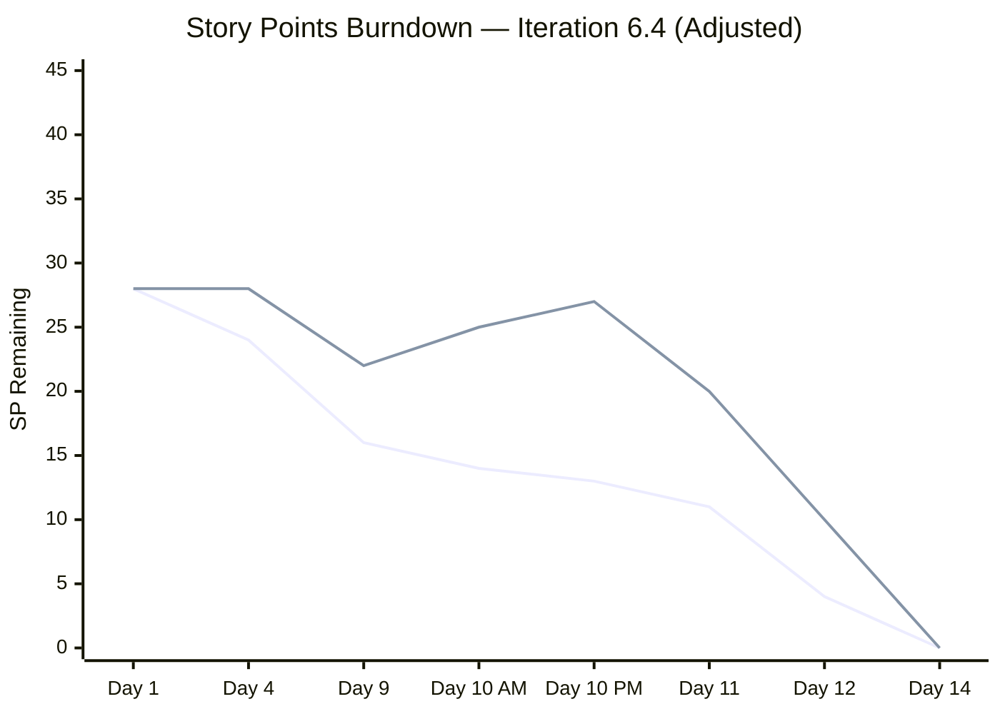
```mermaid
xychart-beta
    title "Story Points Burndown — Iteration 6.4 (Adjusted)"
    x-axis ["Day 1", "Day 4", "Day 9", "Day 10 AM", "Day 10 PM", "Day 11", "Day 12", "Day 14"]
    y-axis "SP Remaining" 0 --> 45
    line [28, 24, 16, 14, 13, 11, 4, 0]
    line [28, 28, 22, 25, 27, 20, 10, 0]
```

> The **actual line dropped sharply from 20 SP to 10 SP**, the steepest two-day drop of the entire iteration. The adjusted ideal line (accounting for carry-over removals) shows the gap to ideal is now just ~6 SP.

### SP Completed vs SP Remaining

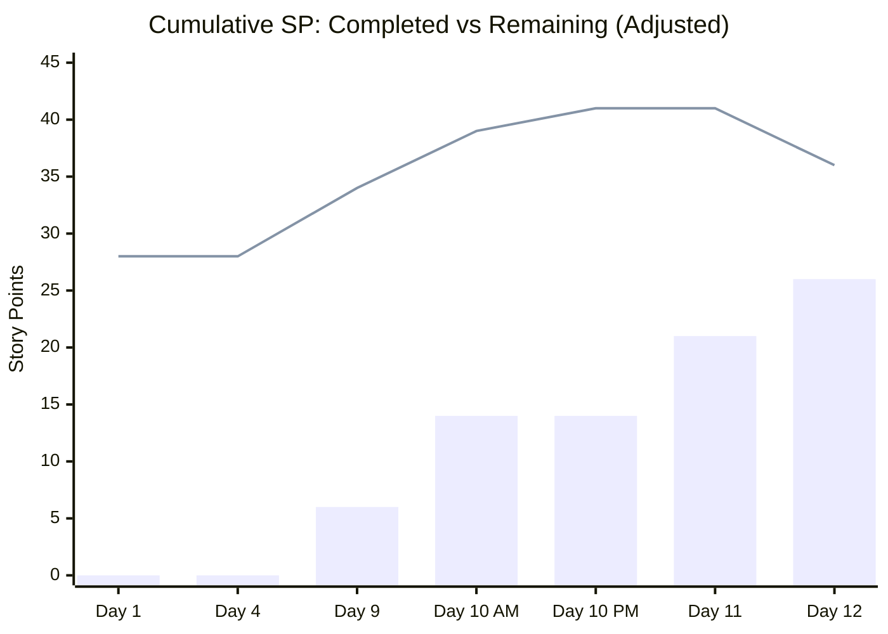
```mermaid
xychart-beta
    title "Cumulative SP: Completed vs Remaining (Adjusted)"
    x-axis ["Day 1", "Day 4", "Day 9", "Day 10 AM", "Day 10 PM", "Day 11", "Day 12"]
    y-axis "Story Points" 0 --> 45
    bar [0, 0, 6, 14, 14, 21, 26]
    line [28, 28, 34, 39, 41, 41, 36]
```

### Scope Reduction (Carry-Over Managed)

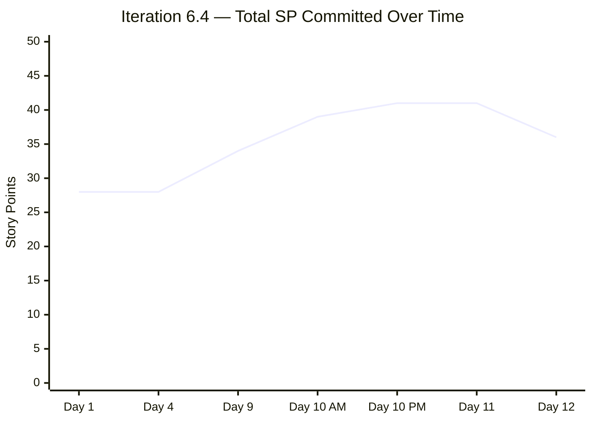
```mermaid
xychart-beta
    title "Iteration 6.4 — Total SP Committed Over Time"
    x-axis ["Day 1", "Day 4", "Day 9", "Day 10 AM", "Day 10 PM", "Day 11", "Day 12"]
    y-axis "Story Points" 0 --> 50
    line [28, 28, 34, 39, 41, 41, 36]
```

> ✅ **Scope reduced by 5 SP** as 3 items were properly moved to Iteration 6.5 carry-over. This is proactive and SAFe-compliant behavior — a positive first.

---

## 3. New Closures Since Day 11 — armelita's Final Push

| ID | Title | Assigned | SP | Previous State | New State |
|---|---|---|---|---|---|
| #199496 | CSS NC II CTC SO Certificate | armelita | 1 SP | Active | **Closed** ✅ |
| #198612 | Follow up Sam Application as Trainer | armelita | 1 SP | Active | **Closed** ✅ |
| #200043 | [RSA] Developer Attendance: Python Asia Conference 2026 | armelita | 1 SP | Active | **Closed** ✅ |
| #200105 | [Onboarding] UM-Digos Interns | armelita | 2 SP | Active | **Closed** ✅ |

**Total: 4 closures, 5 SP** — armelita has now cleared her entire open queue.

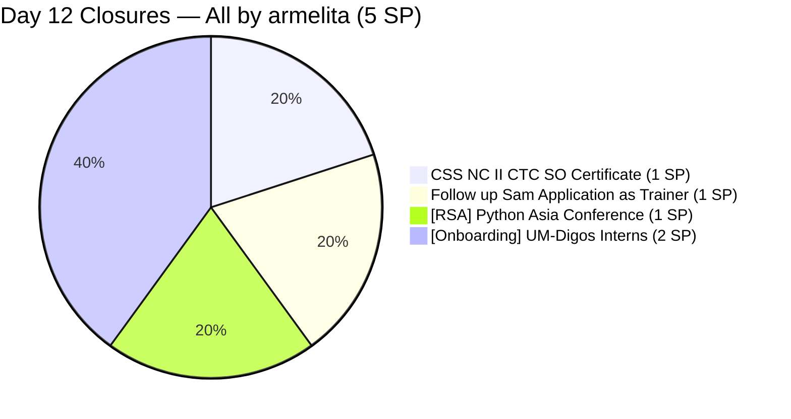
```mermaid
pie title Day 12 Closures — All by armelita (5 SP)
    "CSS NC II CTC SO Certificate (1 SP)" : 1
    "Follow up Sam Application as Trainer (1 SP)" : 1
    "[RSA] Python Asia Conference (1 SP)" : 1
    "[Onboarding] UM-Digos Interns (2 SP)" : 2
```

### Proactive Carry-Over — 3 Items Moved to Iteration 6.5

| ID | Title | Assigned | SP | Previous State | Action |
|---|---|---|---|---|---|
| #197617 | Signing of Agreement on SK Buhangin | armelita | 1 SP | Ready for Dev | ↗️ **Moved to 6.5** |
| #198615 | Awarding of CSS NC II Certificates | armelita | 2 SP | Ready for Dev | ↗️ **Moved to 6.5** |
| #199092 | Submit TESDA Career Guidance Report | armelita | 2 SP | New | ↗️ **Moved to 6.5** |

> **This is excellent SAFe-compliant behavior.** Rather than leaving items in a "zombie" Ready/New state for the last 2 days, the team proactively moved them to the next iteration, allowing focus on what can realistically be completed.

---

## 4. Remaining Open Items — Day 12

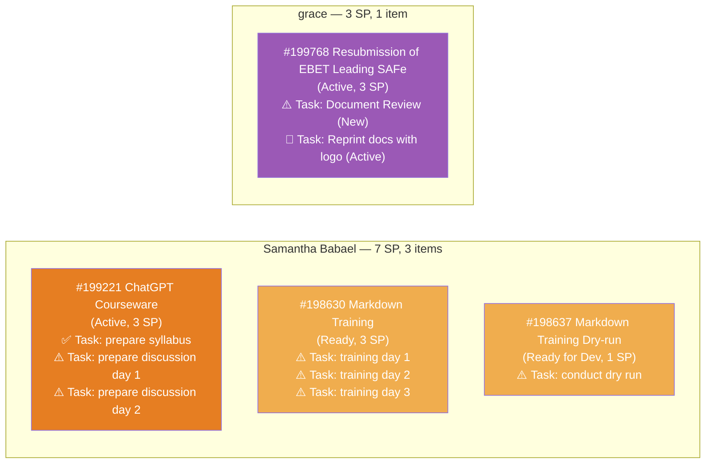
```mermaid
graph LR
    subgraph "Samantha Babael — 7 SP, 3 items"
        S1["#199221 ChatGPT Courseware\n(Active, 3 SP)\n✅ Task: prepare syllabus\n⚠️ Task: prepare discussion day 1\n⚠️ Task: prepare discussion day 2"]
        S2["#198630 Markdown Training\n(Ready, 3 SP)\n⚠️ Task: training day 1\n⚠️ Task: training day 2\n⚠️ Task: training day 3"]
        S3["#198637 Markdown Training Dry-run\n(Ready for Dev, 1 SP)\n⚠️ Task: conduct dry run"]
    end
    subgraph "grace — 3 SP, 1 item"
        G1["#199768 Resubmission of EBET Leading SAFe\n(Active, 3 SP)\n⚠️ Task: Document Review (New)\n🔄 Task: Reprint docs with logo (Active)"]
    end

    style S1 fill:#e67e22,color:#fff
    style S2 fill:#f0ad4e,color:#fff
    style S3 fill:#f0ad4e,color:#fff
    style G1 fill:#9b59b6,color:#fff
```

| ID | Title | Assignee | State | SP | Tasks | Realistic Completion? |
|---|---|---|---|---|---|---|
| #199221 | ChatGPT Courseware | Samantha | Active | 3 SP | 2/3 tasks in New | ⚠️ Possible |
| #198630 | Markdown Training for Employees | Samantha | Ready | 3 SP | 3/3 tasks in New | ❌ Unlikely |
| #198637 | Markdown Training Dry-run | Samantha | Ready for Dev | 1 SP | 1/1 task in New | ❌ Unlikely |
| #199768 | Resubmission of EBET Leading SAFe | grace | Active | 3 SP | 1 Active, 1 New | ⚠️ Possible |

---

## 5. Team Capacity & Workload (Day 12)

### 5.1 Capacity

| Member | Capacity/Day | Remaining Days | Total Remaining Capacity | Open SP |
|---|---|---|---|---|
| Teofilo Limpag | 6 hrs/day | 2 | 12 hrs | **0 SP ✅** |
| armelita | 6 hrs/day | 2 | 12 hrs | **0 SP ✅** |
| Samantha Babael | 3 hrs/day | 2 | 6 hrs | **7 SP** ⚠️ |
| grace | 1 hr/day | 2 | 2 hrs | **3 SP** ❌ |
| **TOTAL** | **16 hrs/day** | | **32 hrs total** | **10 SP** |

> **Critical observation**: With 14 freed-up hours (Teofilo + armelita), the team has significant spare capacity that should be redirected to Samantha and grace's items.

### 5.2 Workload Distribution — Day 12

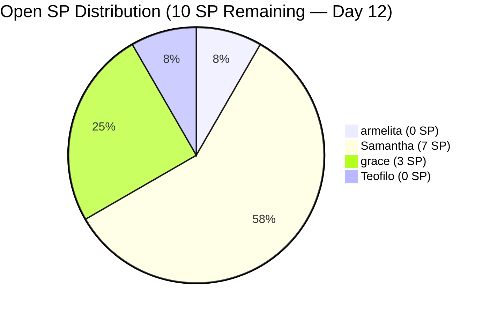
```mermaid
pie title Open SP Distribution (10 SP Remaining — Day 12)
    "armelita (0 SP)" : 1
    "Samantha (7 SP)" : 7
    "grace (3 SP)" : 3
    "Teofilo (0 SP)" : 1
```

> Note: armelita and Teofilo are shown as 1 unit each for chart clarity — both have 0 open SP.

### 5.3 armelita Workload Trend — FULLY RESOLVED ✅

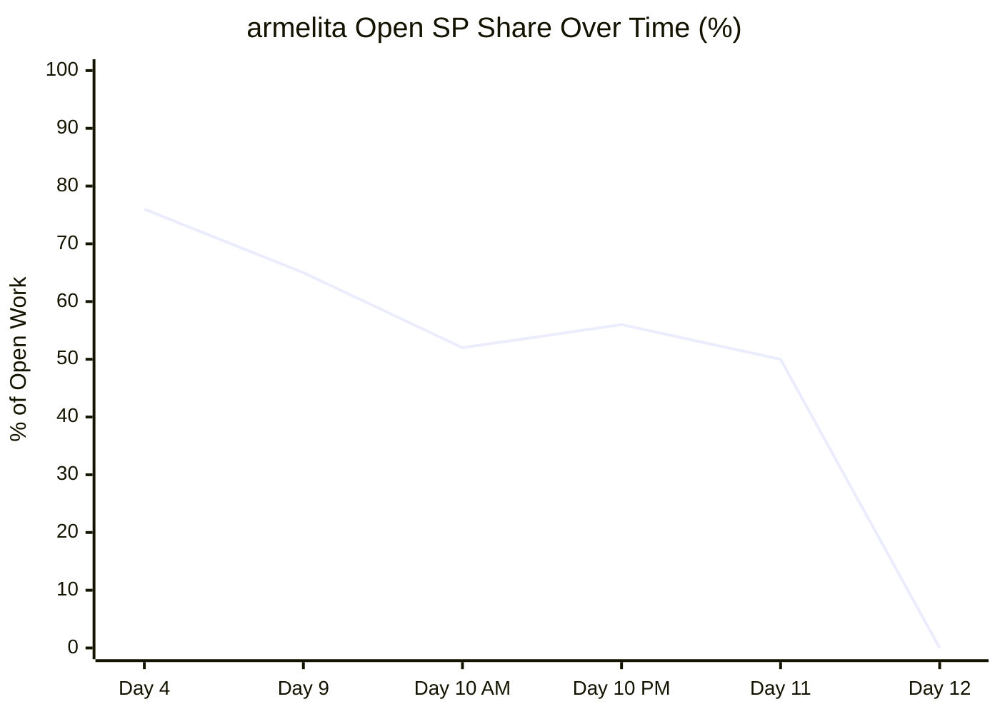
```mermaid
xychart-beta
    title "armelita Open SP Share Over Time (%)"
    x-axis ["Day 4", "Day 9", "Day 10 AM", "Day 10 PM", "Day 11", "Day 12"]
    y-axis "% of Open Work" 0 --> 100
    line [76, 65, 52, 56, 50, 0]
```

> **F2 (Workload Imbalance) is FULLY RESOLVED.** armelita's workload share dropped from 50% to **0%** — a complete and well-earned clearing of her queue.

### 5.4 Full Iteration Completion by Member

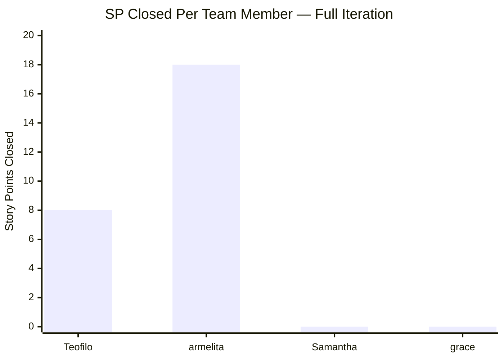
```mermaid
xychart-beta
    title "SP Closed Per Team Member — Full Iteration"
    x-axis ["Teofilo", "armelita", "Samantha", "grace"]
    y-axis "Story Points Closed" 0 --> 20
    bar [8, 18, 0, 0]
```

> **armelita leads the iteration with 18 SP closed** across multiple sprints of effort. Teofilo closed 8 SP. **Samantha and grace have yet to close any items** this iteration — their remaining 10 SP is the last barrier to a strong finish.

---

## 6. Finding Remediation Status (Day 12 Update)

| Finding | Severity | Day 11 Status | Day 12 Status | Change |
|---|---|---|---|---|
| F1 — Zero Capacity | CRITICAL | ✅ RESOLVED | ✅ RESOLVED | — |
| F2 — Workload Imbalance | CRITICAL | Improving (50%) | ✅ **FULLY RESOLVED (0%)** | ⬇️ Fully cleared |
| F3 — No SAFe Format | CRITICAL | Partially Improved | Partially Improved | — |
| F4 — Minimal AC | MAJOR | Partially Improved | Partially Improved | — |
| F5 — Stale Features | MAJOR | Mostly Fixed | ❌ **ESCALATED** — #199488 Active (5th audit) | ↑ Worsened |
| F6 — Orphan/AreaPath | MAJOR | Mitigated | Mitigated | — |
| F7 — Duplicate Descriptions | MAJOR | Partially Improved | Partially Improved | — |
| F8 — No Tags | MINOR | Partially Improved | Partially Improved | — |
| F9 — Duplicate Task Names | MINOR | Not Fixed | Not Fixed | — |
| F10 — Single Activity Type | MINOR | Not Fixed | Not Fixed | — |
| F11 — Scope Creep | MAJOR | Scope Frozen ✅ | ✅ **FULLY RESOLVED** (carry-over actioned) | ⬇️ Resolved |
| F12 — Feature #200104 State Mismatch | MINOR | New finding | ❌ **WORSENED** — child Closed but Feature still "New" | ↑ Worsened |

### NEW FINDING: F13 — Feature #199488 MAJOR Escalation

| Aspect | Details |
|---|---|
| **Severity** | **MAJOR** (elevated from MAJOR-pending on Day 11) |
| **Description** | Feature #199488 "Cor Jesu College Interns" remains **Active** for the **5th consecutive audit**. Its only child #199489 has been Closed since Day 9 (March 3). |
| **Impact** | Portfolio inaccuracy; misleading board state; feature shows open work when all work is done |
| **Duration Flagged** | 5 consecutive audits (Day 9 → Day 12) without action |
| **SAFe Reference** | SAFe Feature Definition of Done requires feature closure when all acceptance criteria are met and all children are complete |
| **Recommendation** | **CLOSE Feature #199488 immediately** — this is a 2-minute fix |

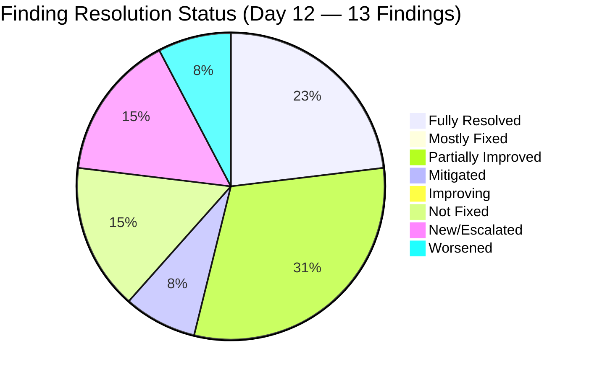
```mermaid
pie title Finding Resolution Status (Day 12 — 13 Findings)
    "Fully Resolved" : 3
    "Mostly Fixed" : 0
    "Partially Improved" : 4
    "Mitigated" : 1
    "Improving" : 0
    "Not Fixed" : 2
    "New/Escalated" : 2
    "Worsened" : 1
```

---

## 7. Feature Portfolio Alignment (Day 12)

| Feature ID | Title | State | Iteration Children | Status |
|---|---|---|---|---|
| #191566 | CSS Assessment Center (Sept 2025 Class) | Active | #198615 (**Moved to 6.5**), #199496 (Closed ✅) | ✅ Aligned |
| #194571 | CSS Assessment Center Application | Active | Multiple (All Closed ✅) | ✅ Aligned |
| #195913 | Leading SAFe MCC | Active | #199768 (Active) | ✅ Aligned |
| #196193 | SK Buhangin Sponsored Bubble 101 | Active | #197617 (**Moved to 6.5**) | ✅ Aligned |
| #197152 | Class for CSS NCII Jan-Mar 2026 | Active | #199505 (Closed ✅) | ✅ Aligned |
| #197330 | Add Sam as Bubble.io MCC Trainer | Active | #198612 (Closed ✅) | ✅ Aligned |
| #198628 | Markdown Internal Training | Active | #198630 (Ready ⚠️), #198637 (Ready4Dev ⚠️) | ⚠️ In Progress |
| #199091 | TESDA Compliance PI6 | Active | #199092 (**Moved to 6.5**) | ✅ Aligned |
| #199144 | ChatGPT Courseware | Active | #199221 (Active) | ✅ Aligned |
| **#199488** | **Cor Jesu College Interns** | **Active** ❌ | #199489 (Closed ✅) | ❌ **5th AUDIT FLAG — MAJOR** |
| #200021 | CSS Batch 2 - 1st Iteration | Active | #199948 (Closed ✅) | ✅ Aligned |
| #200042 | Return Service Agreement Python Conference | Active | #200043 (Closed ✅) | ✅ Aligned |
| #200056 | Python Training Program | Active | #200057 (Closed ✅) | ✅ Aligned |
| **#200104** | **UM-Digos Interns** | **New** ❌ | #200105 (Closed ✅) | ❌ **F12: Feature should be Closed** |

> **Feature #199488** has been Active with all children closed for 5 consecutive audits. This is a critical process compliance failure. The iteration cannot truly be considered "clean" until this Feature is closed.

> **Feature #200104** is now in a worse state than reported yesterday — its only child (#200105) has been **Closed**, yet the Feature remains in "New" state. This Feature should immediately transition to "Closed" or at minimum "Active → Closed" (a 2-minute fix).

---

## 8. Previous Audit Recommendations — Follow-Up

| Priority | Recommendation | Status | Notes |
|---|---|---|---|
| 🔴 1 | **Assign Teofilo to armelita's Ready/Active items** | ✅ **ACTIONED** | armelita cleared all items (combination of closures + carry-over) |
| 🔴 2 | **Close Feature #199488** (flagged 4x) | ❌ **NOT ACTIONED** | Now 5th audit — elevated to MAJOR immediately |
| 🔴 3 | **Focus armelita on Active items ONLY** | ✅ **ACTIONED** | All Active items cleared |
| 🟠 4 | **Activate Feature #200104** | ❌ **NOT ACTIONED + WORSENED** | Child #200105 now Closed; Feature should be Closed |
| 🟠 5 | **Tag carry-over items for Iteration 6.5** | ✅ **ACTIONED** | #197617, #198615, #199092 moved to 6.5 |
| 🟡 6 | **Increase grace's capacity** | ❌ **NOT ACTIONED** | Still 1 hr/day vs 3 SP remaining |
| 🟢 7 | **Prepare Iteration Review/Retrospective** | ⚪ Unknown | Day 14 is in 2 days |

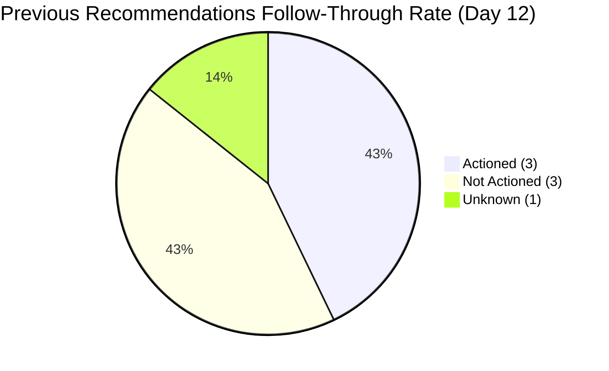
```mermaid
pie title Previous Recommendations Follow-Through Rate (Day 12)
    "Actioned (3)" : 3
    "Not Actioned (3)" : 3
    "Unknown (1)" : 1
```

---

## 9. Health Score — Day 12

| Dimension | Weight | Day 11 | Day 12 | Change | Notes |
|---|---|---|---|---|---|
| Iteration Planning | 20% | 9/10 | **9/10** | — | Carry-over proactively managed; scope frozen |
| Work Item Quality | 20% | 4/10 | **5/10** | +1 | Most problematic items now Closed; remaining 4 items have better quality |
| Team Structure | 15% | 7/10 | **9/10** | +2 | armelita (0 SP) + Teofilo (0 SP); spare capacity now available for Samantha/grace |
| Task Management | 15% | 9/10 | **8/10** | -1 | Excellent closures, but Samantha's items still in Ready/New with 2 days left |
| Backlog Health | 15% | 7/10 | **8/10** | +1 | 10 SP in 2 days; tight but possible if freed capacity redirected |
| Process Compliance | 15% | 7/10 | **6/10** | -1 | #199488 MAJOR (5th audit); #200104 worsened (child Closed, Feature New); F9, F10 not fixed |

```mermaid
xychart-beta
    title "Health Score by Dimension: Day 11 vs Day 12"
    x-axis ["Iter Planning", "Work Item Quality", "Team Structure", "Task Mgmt", "Backlog Health", "Process Compliance"]
    y-axis "Score (out of 10)" 0 --> 10
    bar [9, 4, 7, 9, 7, 7]
    bar [9, 5, 9, 8, 8, 6]
```

**Calculated Score:**
(9 × 0.20) + (5 × 0.20) + (9 × 0.15) + (8 × 0.15) + (8 × 0.15) + (6 × 0.15)
= 1.8 + 1.0 + 1.35 + 1.2 + 1.2 + 0.9
= **7.45 → 74/100**

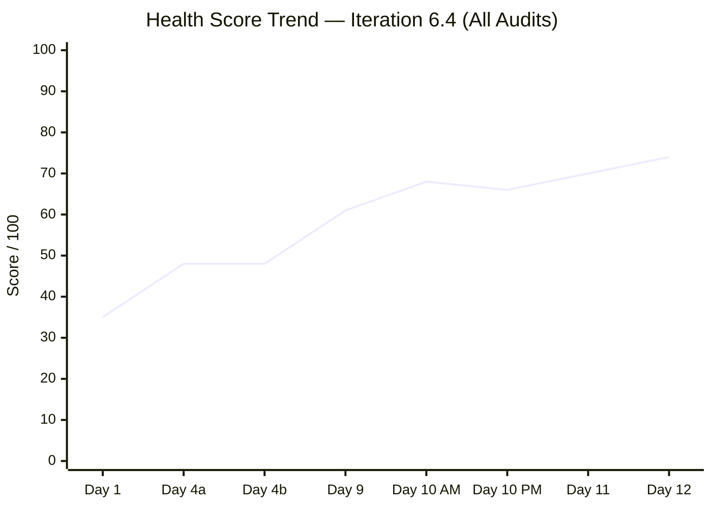
```mermaid
xychart-beta
    title "Health Score Trend — Iteration 6.4 (All Audits)"
    x-axis ["Day 1", "Day 4a", "Day 4b", "Day 9", "Day 10 AM", "Day 10 PM", "Day 11", "Day 12"]
    y-axis "Score / 100" 0 --> 100
    line [35, 48, 48, 61, 68, 66, 70, 74]
```

**Overall Health Score: 74/100** (was 70/100, **+4 points**)

---

## 10. Risk Register (Day 12 Update)

| Risk | Day 11 | Day 12 | Trend | Mitigation |
|---|---|---|---|---|
| **Iteration completion (10 SP in 2 days)** | High | **Medium** | ⬇️ Improving | Need 5 SP/day; freed capacity from armelita+Teofilo could enable this |
| **Samantha capacity crunch (7 SP, 6 hrs)** | Medium | **High** | ↑ Escalating | 7 SP requires ~2.3 hrs/SP; redirect Teofilo or armelita to support |
| **grace capacity mismatch (3 SP, 2 hrs total)** | Low-Med | **High** | ↑ Escalating | 3 SP with only 2 hrs capacity — mathematically underpowered |
| **Feature #199488 compliance failure** | Medium-High | **MAJOR** | ↑ Escalating | 5th consecutive audit; must be closed TODAY |
| **Feature #200104 state mismatch** | Low | **Medium** | ↑ Worsening | Child closed, feature still "New"; must be closed TODAY |
| **Iteration Review not prepared** | Medium | **High** | ↑ Urgent | Day 14 is 2 days away; review prep should begin immediately |

---

## 11. Recommended Actions (Final 2 Days)

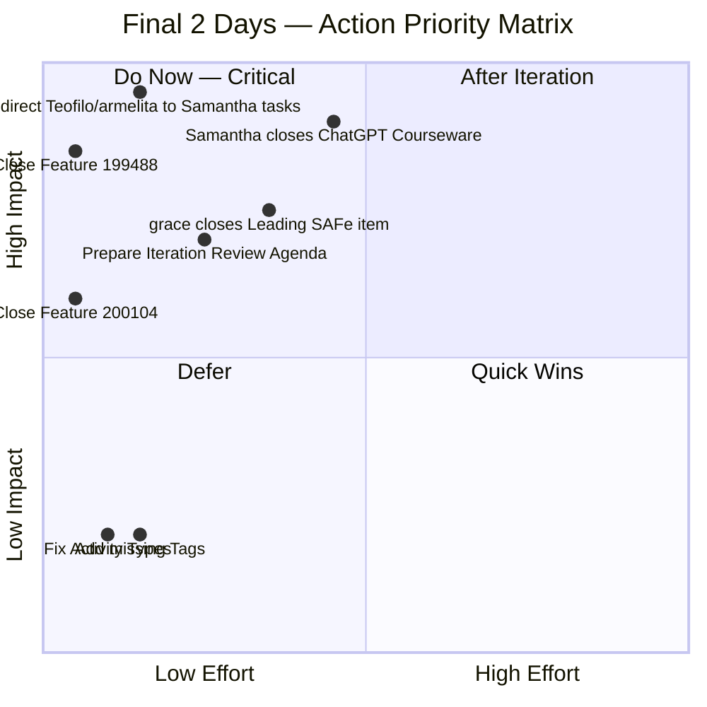
```mermaid
quadrantChart
    title Final 2 Days — Action Priority Matrix
    x-axis "Low Effort" --> "High Effort"
    y-axis "Low Impact" --> "High Impact"
    quadrant-1 "After Iteration"
    quadrant-2 "Do Now — Critical"
    quadrant-3 "Defer"
    quadrant-4 "Quick Wins"
    "Close Feature 199488": [0.05, 0.85]
    "Close Feature 200104": [0.05, 0.60]
    "Redirect Teofilo/armelita to Samantha tasks": [0.15, 0.95]
    "Samantha closes ChatGPT Courseware": [0.45, 0.90]
    "grace closes Leading SAFe item": [0.35, 0.75]
    "Prepare Iteration Review Agenda": [0.25, 0.70]
    "Add missing Tags": [0.15, 0.20]
    "Fix Activity Types": [0.10, 0.20]
```

| Priority | Action | Owner | Effort | Impact |
|---|---|---|---|---|
| 🔴 1 | **Close Feature #199488** — 5th audit flag; only child is Closed since Day 9 | armelita | **2 min** | Critical compliance fix |
| 🔴 2 | **Close Feature #200104** — child #200105 is Closed; feature must match | armelita | **2 min** | Critical compliance fix |
| 🔴 3 | **Redirect Teofilo and/or armelita to support Samantha's items** — 12+ freed hours available | Teofilo / armelita | 5 min setup | Maximum SP burn in final days |
| 🟠 4 | **Samantha closes #199221 (ChatGPT Courseware, Active, 3 SP)** — highest priority closable item | Samantha | Ongoing | 3 SP burn |
| 🟠 5 | **grace pushes #199768 to completion** — redirect any freed team capacity to support | grace + support | Ongoing | 3 SP burn |
| 🟡 6 | **Prepare Iteration Review & Retrospective agenda** — Day 14 is in 2 days | Team Lead | 30 min | Process compliance |
| 🟡 7 | **#198630 and #198637** — formally tag for Iteration 6.5 if not started by EOD today | Samantha | 5 min | Clean carry-over |

---

## 12. Completion Forecast (Final 2 Days)

| Scenario | Burn Rate | SP to Close | Final Completion | Carry-Over |
|---|---|---|---|---|
| Optimistic (freed capacity redirected; 5 SP/day) | 5 SP/day | ~10 SP | **36/36 SP (100%)** | 0 SP |
| Realistic (Samantha closes Active item; grace closes 1) | 3 SP/day | ~6 SP | **32/36 SP (89%)** | 4 SP |
| Conservative (no capacity redistribution) | 1.5 SP/day | ~3 SP | **29/36 SP (80%)** | 7 SP |

```mermaid
xychart-beta
    title "Completion Forecast Scenarios (End of Iteration 6.4)"
    x-axis ["Completed", "Remaining"]
    y-axis "Story Points" 0 --> 40
    bar [36, 0]
    bar [32, 4]
    bar [29, 7]
```

> The **optimistic scenario is achievable** if armelita and/or Teofilo actively pick up Samantha's Ready items. The **realistic scenario** assumes each team member works independently, resulting in Samantha closing only her Active item (#199221) and grace making partial progress on #199768.

---

## 13. Health Score Progression — Full Iteration History

| Audit | Date | Day | Score | Change | Key Event |
|---|---|---|---|---|---|
| AUDIT_2026-02-24_2100 | Feb 24 | Day 1 | 35/100 | Baseline | Zero capacity, poor quality |
| AUDIT_2026-02-26_0700 | Feb 26 | Day 4 | 48/100 | +13 | Capacity set, minor improvements |
| AUDIT_2026-02-26_0800 | Feb 26 | Day 4 | 48/100 | — | Same day follow-up |
| AUDIT_2026-03-03_0700 | Mar 3 | Day 9 | 61/100 | +13 | First major closures |
| AUDIT_2026-03-04_0223 | Mar 4 AM | Day 10 | 68/100 | +7 | Strong morning progress |
| AUDIT_2026-03-04_2209 | Mar 4 PM | Day 10 | 66/100 | -2 | Scope creep + workload regression |
| AUDIT_2026-03-05_2202 | Mar 5 | Day 11 | 70/100 | +4 | Best burn day; scope frozen |
| **AUDIT_2026-03-06_2217** | **Mar 6** | **Day 12** | **74/100** | **+4** | **armelita cleared; carry-over managed** |

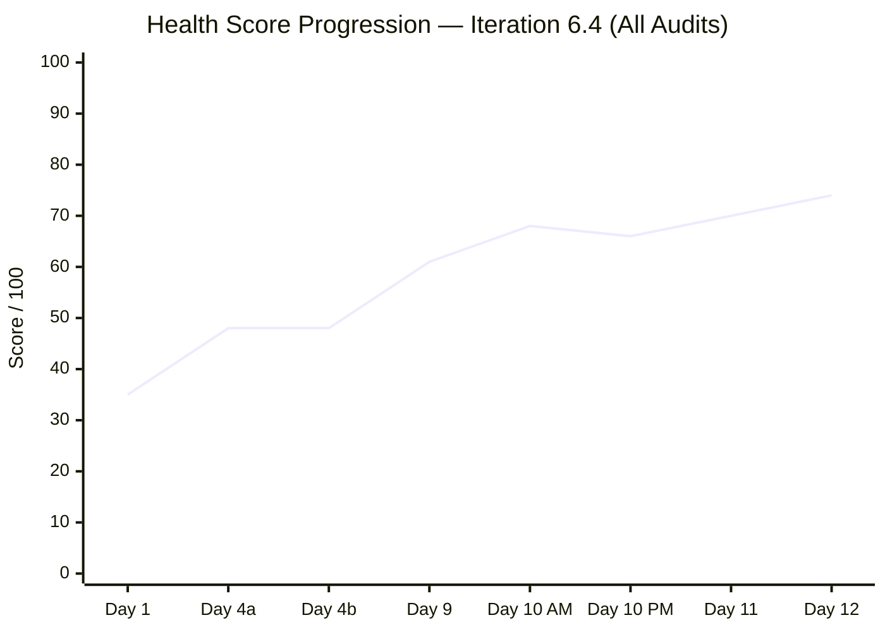
```mermaid
xychart-beta
    title "Health Score Progression — Iteration 6.4 (All Audits)"
    x-axis ["Day 1", "Day 4a", "Day 4b", "Day 9", "Day 10 AM", "Day 10 PM", "Day 11", "Day 12"]
    y-axis "Score / 100" 0 --> 100
    line [35, 48, 48, 61, 68, 66, 70, 74]
```

---

## 14. Conclusion

Day 12 is a story of **individual excellence meeting team-level opportunity**. armelita's complete queue clearance — through a combination of 4 last-day closures and proactive carry-over management — is the standout performance of the iteration. With Teofilo also at 0 SP, the team now has significant freed-up capacity that, if redirected effectively in the final 2 days, could push the iteration to an 89–100% completion rate.

**Achievements to celebrate:**
1. **armelita: 0 open SP** — first time this iteration; carried total of 18 SP completed
2. **Teofilo: 0 open SP** — maintained since Day 11; 8 SP total
3. **Proactive carry-over management** — 3 items properly moved to 6.5 rather than left idle
4. **Scope reduction** — from 41 SP to 36 SP; cleaner iteration scope

**Persistent blockers (must fix TODAY):**
1. **Feature #199488 STILL Active** — 5th consecutive audit flag; this is now a MAJOR process compliance failure. 2-minute fix. No acceptable reason to delay further.
2. **Feature #200104 still "New"** — child is Closed; feature is significantly behind its children in state. 2-minute fix.

**Critical path for the next 48 hours:**
- Teofilo and/or armelita pick up Samantha's tasks to maximize burn
- grace gets support from freed-up members
- Iteration Review/Retrospective preparation must begin no later than Day 13

**Next recommended audit: March 7, 2026 (Day 13 — FINAL audit before iteration end on March 8)**

---

*Report generated: March 6, 2026 at 22:17 | SAFe 6.0 Framework | Jairosoft Portfolio — JIT Operation Team*
*Previous Audit: AUDIT_2026-03-05_2202.md (Score: 70/100)*
*This Audit: AUDIT_2026-03-06_2217.md (Score: 74/100)*
*Iteration 6.4: Feb 23 – Mar 8, 2026 | Day 12 of 14 | Health Score: 74/100*
