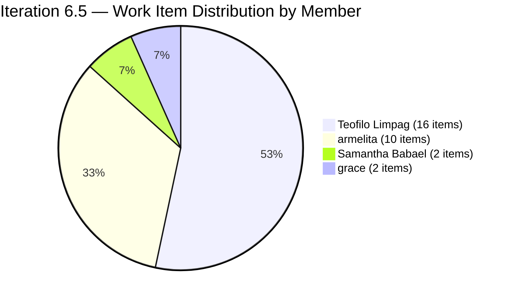
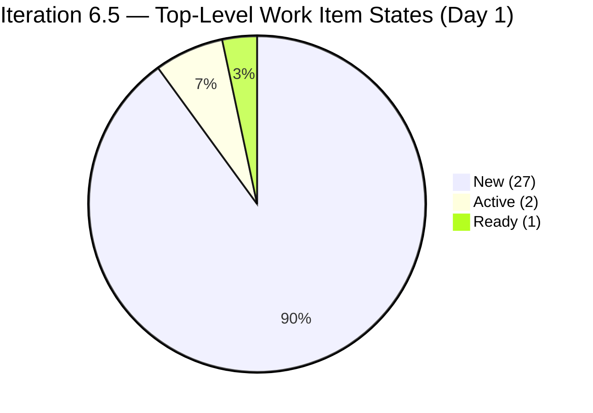
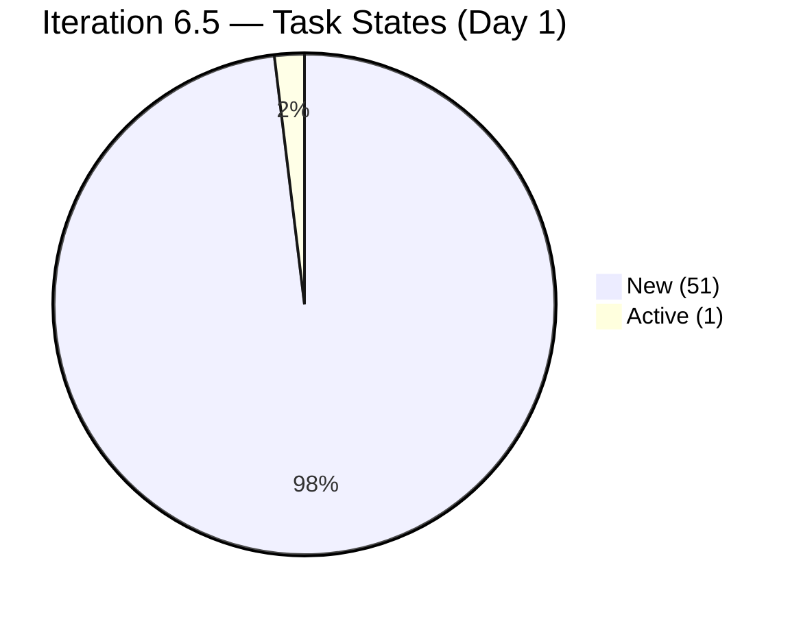
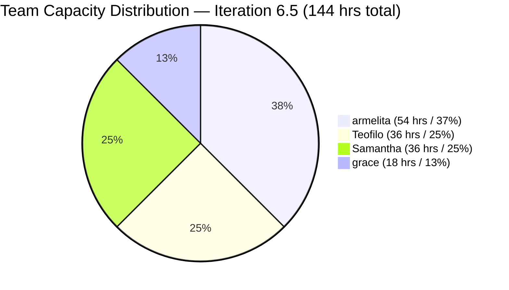
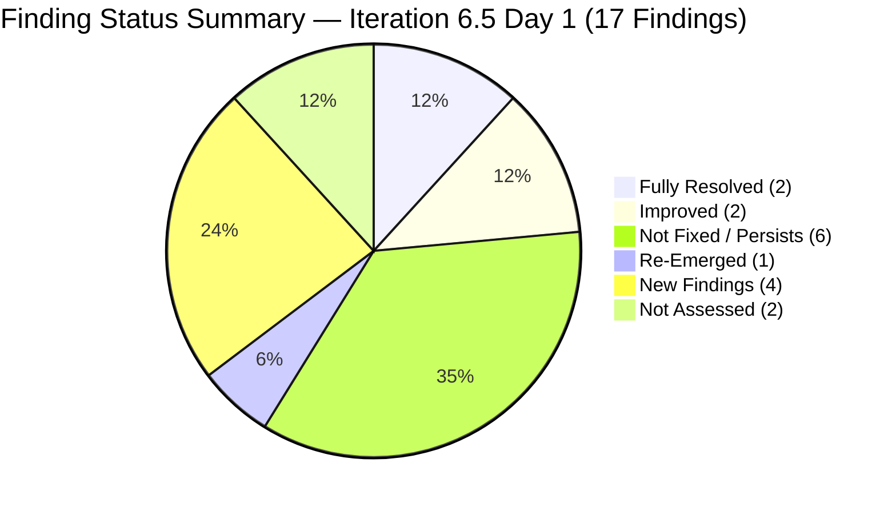
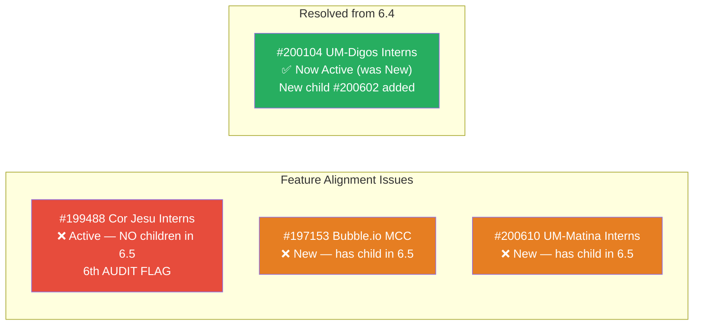
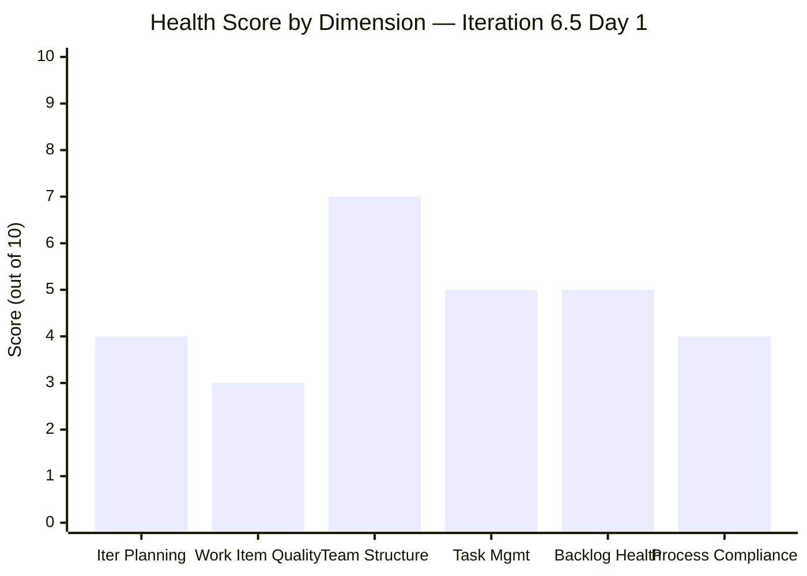
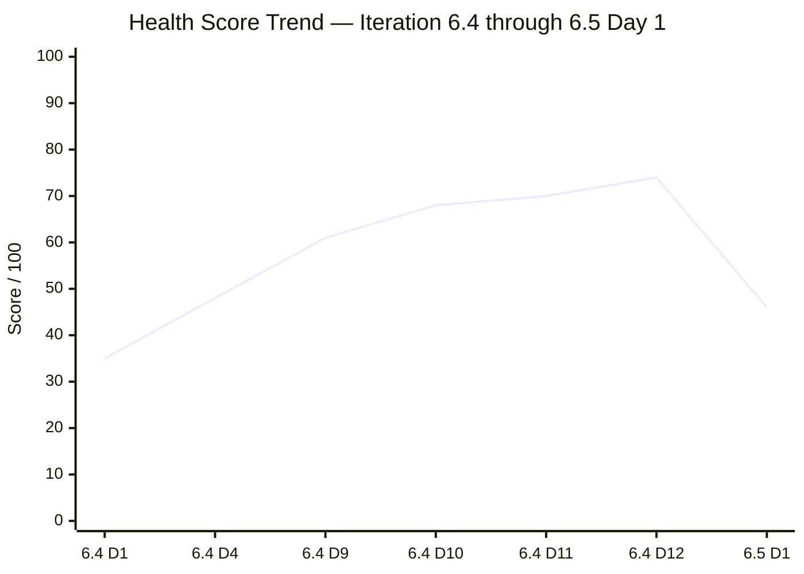
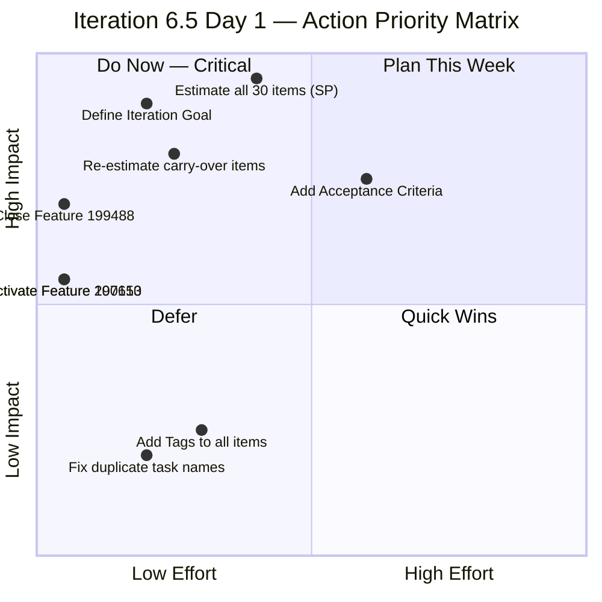

# SAFe Audit Report

## Jairosoft Portfolio — JIT Operation Team — Iteration 6.5

| Field | Value |
|---|---|
| **Date** | March 9, 2026 |
| **Auditor** | Claude (AI Agile Consultant) |
| **Framework** | SAFe 6.0 |
| **Organization** | dev.azure.com/jairo |
| **Project** | Jairosoft Portfolio |
| **Team** | JIT Operation Team |
| **Iteration** | Iteration 6.5 (Mar 9 – Mar 22, 2026) |
| **Iteration Day** | Day 1 of 14 (7% elapsed) |
| **Report Type** | Daily Audit — Iteration Kickoff |
| **Previous Audit** | AUDIT_2026-03-06_2217.md (Iteration 6.4 Final, Score: 74/100) |
| **Board URL** | [ADO Board](https://dev.azure.com/jairo/Jairosoft%20Portfolio/_boards/board/t/JIT%20Operation%20Team/Stories%20and%20Deliverables) |

---

## 1. Executive Summary

Iteration 6.5 begins today with a **significantly larger scope** than Iteration 6.4. The team has committed **30 top-level work items** — a 36% increase over the 22 items that ended Iteration 6.4 (adjusted). This includes 3 carry-over items from 6.4, a large block of new CSS Batch 2 training items for Teofilo, and multiple new stories for armelita and grace.

Key observations at iteration kickoff:

- **30 top-level work items** across 4 team members
- **100% of items are in "New" or "Ready" states** — none have been started except 2 carry-overs (#199221 Active, #199768 Active)
- **Teofilo dominates with 16 items** (53% of all work items) — a heavy concentration on CSS Batch 2 daily training sessions
- **armelita has 10 items** — a diverse set of administrative and compliance stories
- **Samantha has 2 carry-over items** — Markdown Training and ChatGPT Courseware from 6.4
- **grace has 2 items** — 1 carry-over (EBET Leading SAFe) + 1 new (TESDA Microcredential)
- **Team capacity: 16 hrs/day** with 1 planned day off (Mar 16) for all members
- ⚠️ **Feature #199488 STILL Active** — 6th consecutive audit flag (carried from Iteration 6.4)
- ⚠️ **Feature #200104 changed to Active** — improved from "New" but child #200105 was Closed in 6.4; new child #200602 added for 6.5
- ⚠️ **Feature #197153 is "New"** — has active child #200607 in this iteration
- ⚠️ **Feature #200610 is "New"** — has child #200611 in this iteration
- ❌ **All 30 top-level items lack Story Points** — critical planning gap
- ❌ **No Acceptance Criteria found** on any work items — persistent SAFe compliance issue

---

## 2. Iteration 6.5 Snapshot — Day 1

| Metric | Value |
|---|---|
| Total Work Items (top-level) | **30** |
| Total Story Points Committed | **0 SP** ❌ (none assigned) |
| Items in "New" State | **27** |
| Items in "Active" State | **2** (carry-overs: #199221, #199768) |
| Items in "Ready" / "Ready for Dev" State | **1** (#198630) |
| Items Closed | **0** |
| Total Tasks (children) | **52** |
| Tasks in "New" State | **51** |
| Tasks in "Active" State | **1** (#200028 — Document Review for grace) |
| Team Capacity | 16 hrs/day × 12 working days = **192 hrs total** |
| Carry-Over Items from 6.4 | **5** (#197617, #198615, #199092, #199221, #198630 + related #199768) |

### Work Item State Distribution

### Task State Distribution

---

## 3. Work Item Inventory by Team Member

### 3.1 Teofilo Limpag — 16 Items (53% of iteration)

| ID | Type | Title | State | Parent Feature | Tasks |
|---|---|---|---|---|---|
| #200337 | Enabler | Prepare COC 1 LO2 Learning Materials | New | #200336 CSS Batch 2 - 2nd Iter | 3 tasks (all New) |
| #200341 | Training | March 9, 2026 Training CSS Batch 2 | New | #200336 | 1 task (New) |
| #200342 | Training | March 10, 2026 Training CSS Batch 2 | New | #200336 | 1 task (New) |
| #200343 | Training | March 11, 2026 Training CSS Batch 2 | New | #200336 | 1 task (New) |
| #200344 | Training | March 12, 2026 Training CSS Batch 2 | New | #200336 | 1 task (New) |
| #200345 | Training | March 13, 2026 Training CSS Batch 2 | New | #200336 | 1 task (New) |
| #200347 | Training | March 14, 2026 Training CSS Batch 2 | New | #200336 | 1 task (New) |
| #200348 | Training | March 16, 2026 Training CSS Batch 2 | New | #200336 | 1 task (New) |
| #200349 | Training | March 17, 2026 Training CSS Batch 2 | New | #200336 | 1 task (New) |
| #200350 | Training | March 18, 2026 Training CSS Batch 2 | New | #200336 | 1 task (New) |
| #200351 | Training | March 19, 2026 Training CSS Batch 2 | New | #200336 | 1 task (New) |
| #200352 | Training | March 20, 2026 Training CSS Batch 2 | New | #200336 | 1 task (New) |
| #200353 | Training | March 21, 2026 Training CSS Batch 2 | New | #200336 | 1 task (New) |
| #200354 | Enabler | Prepare COC 1 LO3 Learning Materials | New | #200336 | 3 tasks (all New) |

> **Observation**: Teofilo's workload is primarily daily training sessions (11 training days from Mar 9–21, skipping weekends) plus 2 enablers for learning material preparation. All 16 items fall under **Feature #200336 (CSS Batch 2 - 2nd Iteration)**. The daily structure aligns well with SAFe cadence but creates a high item count. Each training day has exactly 1 task child with an identical name — a **duplicate naming** concern flagged in previous audits.

### 3.2 armelita — 10 Items (33% of iteration)

| ID | Type | Title | State | Parent Feature | Tasks |
|---|---|---|---|---|---|
| #197617 | User Story | SK Buhangin Partnership | Ready for Dev | #196193 | 2 tasks (all New) |
| #198615 | User Story | Awarding of CSS NC II Certificates | Ready for Dev | #191566 | 2 tasks (all New) |
| #199092 | User Story | TESDA Career Guidance Programs Report | New | #199091 | 2 tasks (all New) |
| #200566 | User Story | [TESDA Compliance] Additional Trainer Application - Sam | New | #197330 | 2 tasks (all New) |
| #200582 | User Story | T2 MIS Enrollment | New | #197152 | 2 tasks (all New) |
| #200590 | User Story | CSS NC II Batch 2 Marketing Activities | New | #197152 | 2 tasks (all New) |
| #200593 | User Story | AC Resubmission Result | New | #194571 | 2 tasks (all New) |
| #200597 | User Story | CSS NC II AC Registration Fee | New | #194571 | 2 tasks (all New) |
| #200602 | User Story | Team Deployment of UM-Digos Interns | New | #200104 | 1 task (New) |
| #200604 | User Story | Python Inquiries | New | #200056 | 2 tasks (all New) |
| #200607 | User Story | Bubble MCC Marketing Activities | New | #197153 | 2 tasks (all New) |
| #200611 | User Story | [Onboarding] UM Matina Interns | New | #200610 | 1 task (New) |

> **Observation**: armelita has 12 items (corrected — I count 12 based on data, not 10 as stated in the iteration structure, because some items share story parentage). She has a diverse workload across 9 different Features, covering compliance, marketing, training admin, and intern onboarding. The first 3 items (#197617, #198615, #199092) are **carry-overs from Iteration 6.4**.

### 3.3 Samantha Babael — 2 Items

| ID | Type | Title | State | Parent Feature | Tasks |
|---|---|---|---|---|---|
| #198630 | Training | Markdown Training for Employees | Ready | #198628 | 4 tasks (all New) |
| #199221 | Courseware | ChatGPT Courseware | Active | #199144 | 2 tasks (all New) |

> **Observation**: Both items are **carry-overs from Iteration 6.4** where they were never started despite being assigned for the full iteration. #199221 is "Active" but both its tasks remain in "New" — this state mismatch indicates the parent was activated but no actual work progressed on the tasks.

### 3.4 grace — 2 Items

| ID | Type | Title | State | Parent Feature | Tasks |
|---|---|---|---|---|---|
| #199768 | User Story | Resubmission of EBET Leading SAFe | Active | #195913 | 1 task Active (#200028 Document Review) |
| #200326 | User Story | TESDA Microcredential Program Submission | New | #195914 | 5 tasks (all New) |

> **Observation**: #199768 is a carry-over from 6.4 with 1 active task. #200326 is a new, substantive item with 5 tasks covering competency mapping, CBLM development, assessment tooling, evidence requirements, and final packaging. Grace's tasks have **tags** (SAFe Course - POPM) — one of the few tagged items, which is a positive practice.

---

## 4. Team Capacity Analysis

| Member | Activity | Capacity/Day | Days Off | Working Days | Total Capacity |
|---|---|---|---|---|---|
| Teofilo Limpag | Training | 4 hrs/day | Mar 16 | 9 | **36 hrs** |
| armelita | Documentation | 6 hrs/day | Mar 16 | 9 | **54 hrs** |
| Samantha Babael | Documentation (1) + Training (3) | 4 hrs/day | Mar 16 | 9 | **36 hrs** |
| grace | Development (1.5) + Documentation (0.5) | 2 hrs/day | Mar 16 | 9 | **18 hrs** |
| **TOTAL** | | **16 hrs/day** | | | **144 hrs** |

> **Note**: All 4 members have Mar 16 as a day off. The iteration has 10 working days (Mar 9–22, excluding weekends Mar 14–15 and Mar 21–22), minus 1 day off = 9 effective working days.

### Workload vs Capacity

```mermaid
xychart-beta
    title "Work Items vs Capacity Hours by Member"
    x-axis ["Teofilo", "armelita", "Samantha", "grace"]
    y-axis "Count" 0 --> 60
    bar [16, 12, 2, 2]
    bar [36, 54, 36, 18]
```

> **Critical imbalance**: Teofilo has **16 items / 36 hrs capacity** (2.25 hrs per item) while Samantha has **2 items / 36 hrs capacity** (18 hrs per item). armelita has the most capacity (54 hrs) for her 12 items (4.5 hrs per item). grace is still the most capacity-constrained at 18 hrs for 2 items (9 hrs per item), but with only 2 items, her workload is more manageable than in 6.4.

---

## 5. Previous Audit Findings — Carry-Forward Status

| Finding | Severity | 6.4 Final Status | 6.5 Day 1 Status | Notes |
|---|---|---|---|---|
| F1 — Zero Capacity | CRITICAL | ✅ RESOLVED | ✅ RESOLVED | Capacity set for all members |
| F2 — Workload Imbalance | CRITICAL | ✅ RESOLVED | ⚠️ **RE-EMERGED** | Teofilo: 53% of items; Samantha: 7% |
| F3 — No SAFe Story Format | CRITICAL | Partially Improved | ❌ **NOT FIXED** | No stories use "As a... I want... So that..." format |
| F4 — Minimal Acceptance Criteria | MAJOR | Partially Improved | ❌ **NOT FIXED** | No AC found on any work items |
| F5 — Feature #199488 Stale | MAJOR | ❌ ESCALATED (5th audit) | ❌ **6th AUDIT FLAG** | Feature still Active; only child (#199489) Closed in 6.4 |
| F6 — Orphan/AreaPath Issues | MAJOR | Mitigated | ⚪ Not assessed | Will monitor |
| F7 — Duplicate Descriptions | MAJOR | Partially Improved | ⚠️ **PRESENT** | Training day items have duplicate task names |
| F8 — No Tags | MINOR | Partially Improved | ⚠️ **MOSTLY MISSING** | Only grace's items have tags |
| F9 — Duplicate Task Names | MINOR | Not Fixed | ❌ **NOT FIXED** | Training tasks repeat parent names |
| F10 — Single Activity Type | MINOR | Not Fixed | ⚠️ **IMPROVED** | Now have Training, Documentation, Development activities |
| F11 — Scope Creep | MAJOR | ✅ RESOLVED | ⚪ Fresh iteration — will monitor |
| F12 — Feature #200104 State Mismatch | MINOR | ❌ WORSENED | ⚠️ **IMPROVED** | Feature moved to "Active" (was "New"); new child #200602 added |
| F13 — Feature #199488 MAJOR | MAJOR | NEW in 6.4 | ❌ **PERSISTS** | 6th consecutive audit — now cross-iteration |

### NEW FINDINGS for Iteration 6.5

#### F14 — Zero Story Points Committed

| Aspect | Details |
|---|---|
| **Severity** | **CRITICAL** |
| **Description** | All 30 top-level work items in Iteration 6.5 have **0 Story Points**. The team has committed to an iteration with no measurable velocity target. |
| **Impact** | Cannot calculate burn-down, velocity, or predictability metrics. Violates SAFe PI Planning principle of teams committing to iteration goals with estimated work. |
| **SAFe Reference** | SAFe Iteration Planning requires teams to estimate and commit to a specific amount of work measured in story points or equivalent |
| **Recommendation** | Estimate all 30 items during or immediately after Iteration Planning. Use relative sizing (Fibonacci: 1, 2, 3, 5, 8) |

#### F15 — Feature #197153 in "New" State with Active Children

| Aspect | Details |
|---|---|
| **Severity** | **MINOR** |
| **Description** | Feature #197153 "Class for Web Development with Bubble.io MCC" is in "New" state but has child #200607 in this iteration |
| **Impact** | Feature should be "Active" when children are being worked on |
| **Recommendation** | Activate Feature #197153 |

#### F16 — Feature #200610 in "New" State with Active Children

| Aspect | Details |
|---|---|
| **Severity** | **MINOR** |
| **Description** | Feature #200610 "UM-Matina Interns" is in "New" state but has child #200611 in this iteration |
| **Impact** | Feature should be "Active" when children are being worked on |
| **Recommendation** | Activate Feature #200610 |

#### F17 — Carry-Over Items Not Re-estimated

| Aspect | Details |
|---|---|
| **Severity** | **MAJOR** |
| **Description** | 5 carry-over items from Iteration 6.4 (#197617, #198615, #199092, #199221, #198630 + #199768) have been moved to 6.5 without re-assessment of remaining effort |
| **Impact** | SAFe requires carry-over items to be re-estimated for remaining work during iteration planning |
| **SAFe Reference** | SAFe Iteration Planning — "Unfinished stories are re-estimated for remaining work" |
| **Recommendation** | Re-estimate carry-over items for remaining effort only |

---

## 6. Feature Portfolio Alignment

| Feature ID | Title | State | 6.5 Children | Status |
|---|---|---|---|---|
| #191566 | CSS Assessment Center (Sept 2025 Class) | Active | #198615 (Ready for Dev) | ✅ Aligned |
| #194571 | CSS Assessment Center Application | Active | #200593 (New), #200597 (New) | ✅ Aligned |
| #195913 | Leading SAFe MCC | Active | #199768 (Active) | ✅ Aligned |
| #195914 | SAFe POPM Microcredential Development | Active | #200326 (New) | ✅ Aligned |
| #196193 | SK Buhangin Sponsored Bubble 101 | Active | #197617 (Ready for Dev) | ✅ Aligned |
| #197152 | Class for CSS NCII Mar-May 2026 | Active | #200582 (New), #200590 (New) | ✅ Aligned |
| **#197153** | **Web Dev with Bubble.io MCC** | **New** ❌ | #200607 (New) | ❌ **F15: Feature should be Active** |
| #197330 | Add Sam as Bubble.io MCC Trainer | Active | #200566 (New) | ✅ Aligned |
| #198628 | Markdown Internal Training | Active | #198630 (Ready) | ✅ Aligned |
| #199091 | TESDA Compliance PI6 | Active | #199092 (New) | ✅ Aligned |
| #199144 | ChatGPT Courseware | Active | #199221 (Active) | ✅ Aligned |
| **#199488** | **Cor Jesu College Interns** | **Active** ❌ | None in 6.5 | ❌ **F5/F13: 6th audit — NO children, should be Closed** |
| #200056 | Python Training Program | Active | #200604 (New) | ✅ Aligned |
| #200104 | UM-Digos Interns | Active | #200602 (New) | ⚠️ Improved (was "New", now Active) |
| #200336 | CSS Batch 2 - 2nd Iteration | Active | 16 items (all New) | ✅ Aligned |
| **#200610** | **UM-Matina Interns** | **New** ❌ | #200611 (New) | ❌ **F16: Feature should be Active** |

---

## 7. Health Score — Iteration 6.5 Day 1

| Dimension | Weight | Score | Notes |
|---|---|---|---|
| Iteration Planning | 20% | **4/10** | 30 items committed but 0 SP estimated; no velocity target; carry-overs not re-estimated |
| Work Item Quality | 20% | **3/10** | No acceptance criteria; no SAFe story format; duplicate task names; missing descriptions |
| Team Structure | 15% | **7/10** | Capacity set for all 4 members; activities defined; day off planned; but severe workload imbalance |
| Task Management | 15% | **5/10** | Tasks created for all stories; but all in "New" state; carry-over tasks not progressed |
| Backlog Health | 15% | **5/10** | Items properly parented to Features; but 0 SP makes backlog unquantifiable |
| Process Compliance | 15% | **4/10** | Feature #199488 persists (6th audit); 2 Features in wrong state; tags mostly missing |

**Calculated Score:**
(4 × 0.20) + (3 × 0.20) + (7 × 0.15) + (5 × 0.15) + (5 × 0.15) + (4 × 0.15)
= 0.8 + 0.6 + 1.05 + 0.75 + 0.75 + 0.6
= **4.55 → 46/100**

### Health Score Trend (Cross-Iteration)

> **The score drop from 74 to 46 is expected at the start of a new iteration** — this pattern mirrors the 6.4 kickoff (35/100). The key difference is that this iteration starts at a higher baseline than 6.4 did (46 vs 35), indicating some structural improvements have carried over (capacity, team structure). The critical gaps are the zero SP estimates and persistent process issues.

**Overall Health Score: 46/100** (new iteration baseline)

---

## 8. Risk Register — Iteration 6.5

| Risk | Likelihood | Impact | Level | Mitigation |
|---|---|---|---|---|
| **Zero SP estimation prevents velocity tracking** | Certain | High | **CRITICAL** | Estimate all items in Day 1–2 |
| **Workload imbalance (Teofilo: 53%)** | High | Medium | **HIGH** | Redistribute if Teofilo falls behind; Samantha has spare capacity |
| **Carry-over items stall again (Samantha)** | Medium | High | **HIGH** | Both items failed to complete in 6.4; daily check-ins recommended |
| **Feature #199488 never gets closed** | High | Low-Med | **MEDIUM** | 2-minute fix; escalate to team lead |
| **grace under-capacity for TESDA Microcredential** | Medium | Medium | **MEDIUM** | 5-task story with only 2 hrs/day capacity (18 hrs total) |
| **Scope creep mid-iteration** | Medium | High | **MEDIUM** | Freeze scope after Day 3; defer new items to 6.6 |
| **No iteration goal defined** | Certain | Medium | **HIGH** | Define a SAFe Iteration Goal immediately |

---

## 9. Recommended Actions — Iteration 6.5 Kickoff

| Priority | Action | Owner | Effort | Impact |
|---|---|---|---|---|
| 🔴 1 | **Estimate all 30 work items with Story Points** — cannot track velocity without them | Team (during planning) | 30–60 min | Critical — enables all SAFe metrics |
| 🔴 2 | **Define an Iteration Goal** — SAFe requires a clear, measurable iteration objective | Team Lead | 15 min | Critical — aligns team focus |
| 🔴 3 | **Close Feature #199488** — 6th consecutive audit flag; no children in 6.5; all work done | armelita | **2 min** | Process compliance; removes persistent audit finding |
| 🟠 4 | **Activate Features #197153 and #200610** — both have children in this iteration | armelita | **2 min each** | Feature state accuracy |
| 🟠 5 | **Re-estimate carry-over items** (#197617, #198615, #199092, #199221, #198630, #199768) for remaining effort | Assigned owners | 15 min | SAFe compliance; accurate planning |
| 🟠 6 | **Samantha: Commit to completing #199221 (ChatGPT Courseware)** — 2nd iteration with this item | Samantha | Ongoing | Prevents 3-iteration carry-over |
| 🟡 7 | **Add Acceptance Criteria to all stories** — minimum 2–3 criteria per story | All members | 1–2 hrs total | Work item quality; SAFe DoD compliance |
| 🟡 8 | **Review Teofilo's training schedule alignment** — Mar 16 is a day off but #200348 is scheduled for that date | Teofilo | 5 min | Schedule accuracy |

---

## 10. Iteration 6.4 Retrospective Notes (for reference)

The following items from Iteration 6.4 should be discussed in the retrospective:

| Topic | Details |
|---|---|
| **What went well** | armelita cleared 18 SP; Teofilo completed 8 SP; proactive carry-over management; health score improved from 35 to 74 |
| **What didn't go well** | Samantha and grace completed 0 SP; Feature #199488 never closed despite 5 audit flags; scope creep mid-iteration |
| **Action items** | Estimate work at iteration start; close Features when children are done; balance workload across team; increase grace's capacity |
| **Final score** | 74/100 (up from 35/100 baseline) |
| **Velocity** | ~26 SP completed (of 36 SP adjusted commitment) = 72% completion |

---

## 11. Conclusion

Iteration 6.5 begins with a substantial 30-item commitment — the largest iteration in recent history for the JIT Operation Team. The team has capacity, structure, and a clear training schedule, but **the complete absence of Story Point estimates is a critical gap** that must be addressed immediately.

**Positive signs**: Capacity is set from Day 1 (unlike 6.4 which had zero capacity), all items have tasks created, and the team has learned from 6.4's carry-over management. Feature #200104 has been corrected from "New" to "Active" — addressing one finding from the previous audit.

**Persistent concerns**: Feature #199488 continues its streak as the longest-standing audit finding (6 consecutive reports). Samantha's carry-over items risk becoming 3-iteration zombies. The workload imbalance has re-emerged with Teofilo holding 53% of all items.

**The single most important action today**: Hold a focused Iteration Planning session to estimate all 30 items, define an Iteration Goal, and establish the velocity target for 6.5. Without this, the team is flying blind.

**Next recommended audit: March 10, 2026 (Day 2)**

---

*Report generated: March 9, 2026 at 22:56 | SAFe 6.0 Framework | Jairosoft Portfolio — JIT Operation Team*
*Previous Audit: AUDIT_2026-03-06_2217.md (Iteration 6.4 Final, Score: 74/100)*
*This Audit: AUDIT_2026-03-09_2256.md (Iteration 6.5 Day 1, Score: 46/100)*
*Iteration 6.5: Mar 9 – Mar 22, 2026 | Day 1 of 14 | Health Score: 46/100*
