# SAFe Audit Report
## Jairosoft Portfolio — JIT Operation Team — Iteration 6.5

| Field | Value |
|---|---|
| **Date** | March 10, 2026 |
| **Auditor** | Claude (AI Agile Consultant) |
| **Framework** | SAFe 6.0 |
| **Organization** | dev.azure.com/jairo |
| **Project** | Jairosoft Portfolio |
| **Team** | JIT Operation Team |
| **Iteration** | Iteration 6.5 (Mar 9 – Mar 22, 2026) |
| **Iteration Day** | Day 2 of 14 (14% elapsed) |
| **Report Type** | Daily Audit |
| **Previous Audit** | AUDIT_2026-03-09_2256.md (Iteration 6.5 Day 1, Score: 46/100) |
| **Board URL** | [ADO Board](https://dev.azure.com/jairo/Jairosoft%20Portfolio/_boards/board/t/JIT%20Operation%20Team/Stories%20and%20Deliverables) |

---

## 1. Executive Summary

Day 2 of Iteration 6.5 shows **encouraging early momentum** from both Teofilo and armelita. In just one day, the team has moved from a near-static board to one with visible progress: **1 item closed, 6 items activated, and 5 tasks now in progress**. This is a marked improvement over Iteration 6.4's sluggish start, where the first closure didn't arrive until Day 9.

Key developments since Day 1 (March 9):

- ✅ **1 closure** — Teofilo completed #200341 (March 9 Training CSS Batch 2) — first closure of the iteration
- ✅ **Teofilo activated 2 items** — #200337 (Enabler: COC 1 LO2 materials) and #200342 (today's training session)
- ✅ **armelita activated 3 items** — #200582 (T2 MIS Enrollment), #200593 (AC Resubmission Result), #200597 (AC Registration Fee)
- ✅ **5 tasks now Active** — across Teofilo and armelita's work streams
- ⚠️ **Samantha: 0 progress** — both items (#199221, #198630) unchanged since Day 1; tasks all in "New"
- ⚠️ **grace: minimal progress** — #199768 has 1 Active task (#200028), #200326 unchanged
- ❌ **Feature #199488 STILL Active** — **7th consecutive audit flag** — crossed iteration boundary from 6.4
- ❌ **All 30 items still lack Story Points** — F14 (CRITICAL) persists from Day 1
- ❌ **No Acceptance Criteria** on any work items — F4 remains unresolved
- ❌ **Features #197153 and #200610 still in "New"** — F15/F16 persist

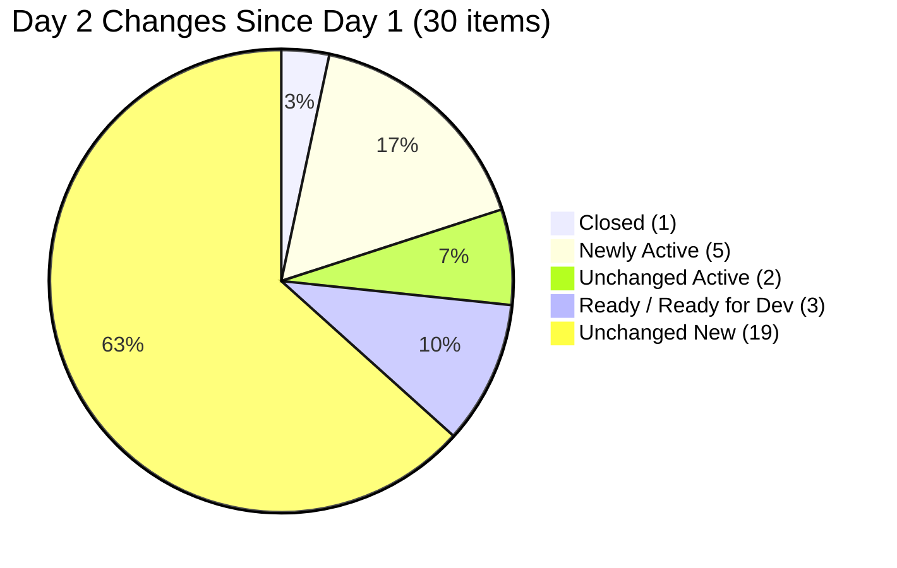

---

## 2. Iteration Snapshot — Day 2 vs Day 1

| Metric                             | Day 1      | Day 2      | Change                  |
| ---------------------------------- | ---------- | ---------- | ----------------------- |
| Total Work Items (top-level)       | 30         | **30**     | —                       |
| Total Story Points Committed       | 0 SP       | **0 SP** ❌ | —                       |
| Items in "Closed" State            | 0          | **1**      | **+1** ✅                |
| Items in "Active" State            | 2          | **7**      | **+5** ✅                |
| Items in "Ready" / "Ready for Dev" | 1          | **3**      | +2 (recount correction) |
| Items in "New" State               | 27         | **19**     | **-8** ✅                |
| Total Tasks (children)             | 52         | **52**     | —                       |
| Tasks in "Closed" State            | 0          | **2**      | **+2** ✅                |
| Tasks in "Active" State            | 1          | **6**      | **+5** ✅                |
| Tasks in "New" State               | 51         | **44**     | -7                      |
| Team Capacity                      | 16 hrs/day | 16 hrs/day | —                       |

### Work Item State Distribution — Day 2

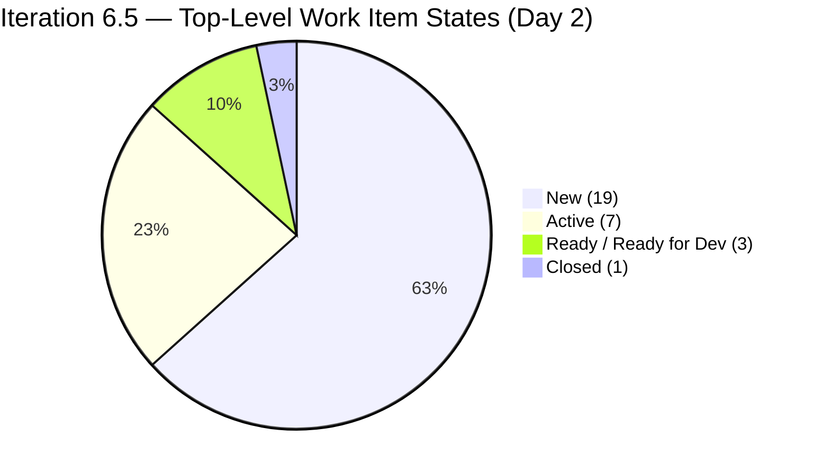

### Task State Distribution — Day 2

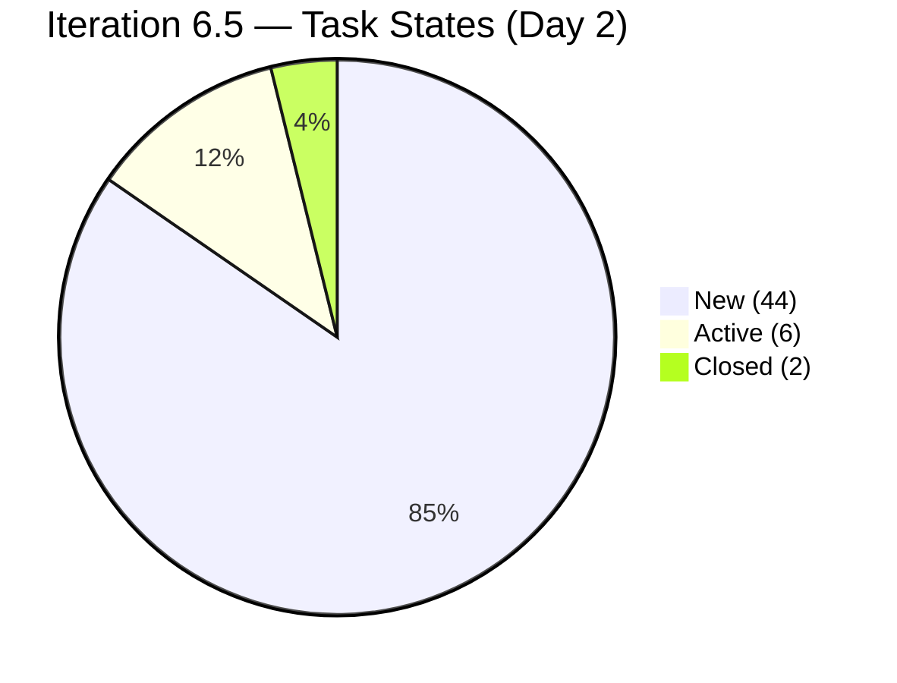

### State Movement Flow (Day 1 → Day 2)

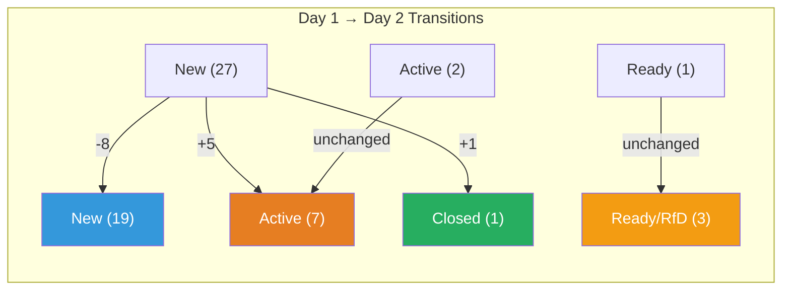

---

## 3. Changes Since Day 1 — Detailed Analysis

### 3.1 Closures

| ID      | Title                              | Assignee | Previous State | New State    | Tasks                |
| ------- | ---------------------------------- | -------- | -------------- | ------------ | -------------------- |
| #200341 | March 9, 2026 Training CSS Batch 2 | Teofilo  | New            | **Closed** ✅ | 1/1 Closed (#200355) |

> Teofilo completed his first training day promptly. This establishes a healthy pattern — closing daily training items on schedule is the foundation of his 16-item workload.

### 3.2 Items Activated (New → Active)

| ID | Title | Assignee | Type | Tasks Activated |
|---|---|---|---|---|
| #200337 | Prepare COC 1 LO2 Learning Materials | Teofilo | Enabler | 1/3 Closed (#200338), 1/3 Active (#200339), 1/3 New |
| #200342 | March 10, 2026 Training CSS Batch 2 | Teofilo | Training | 1/1 Active (#200356) |
| #200582 | T2 MIS Enrollment | armelita | User Story | 1/2 Active (#200584), 1/2 New |
| #200593 | AC Resubmission Result | armelita | User Story | 1/2 Active (#200594), 1/2 New |
| #200597 | CSS NC II AC Registration Fee | armelita | User Story | 1/2 Active (#200598), 1/2 New |

> **Positive pattern**: armelita activated 3 items on Day 2, each with 1 task in Active state. This shows focused multi-tasking across different compliance and administrative workstreams. Teofilo's enabler (#200337) already has 1 task closed and 1 active — strong early progress.

### 3.3 armelita's Task Activity (New → Active)

| Task ID | Title | Parent Story |
|---|---|---|
| #200584 | Check and Verify Students Information and Submitted Requirements | #200582 T2 MIS Enrollment |
| #200591 | Post CSS NC II poster on FB Page and Respond to Inquiries Week 10-13 | #200590 CSS Batch 2 Marketing |
| #200594 | Contact AC Focal Person for the Findings | #200593 AC Resubmission Result |
| #200598 | Communicate with TESDA for Registration Fee | #200597 CSS NC II AC Registration Fee |

> **Note**: Task #200591 is Active under story #200590, but the parent story itself is still in "New" state. This is a **state mismatch** — when a task is Active, its parent story should be at least Active.

---

## 4. Work Item Inventory by Team Member — Day 2

### 4.1 Teofilo Limpag — 16 Items (1 Closed, 2 Active, 13 New)

| ID      | Type     | Title                                | Day 1 State | Day 2 State  | Tasks                     |
| ------- | -------- | ------------------------------------ | ----------- | ------------ | ------------------------- |
| #200337 | Enabler  | Prepare COC 1 LO2 Learning Materials | New         | **Active** ✅ | 1 Closed, 1 Active, 1 New |
| #200341 | Training | March 9, 2026 Training CSS Batch 2   | New         | **Closed** ✅ | 1/1 Closed                |
| #200342 | Training | March 10, 2026 Training CSS Batch 2  | New         | **Active** ✅ | 1/1 Active                |
| #200343 | Training | March 11, 2026 Training CSS Batch 2  | New         | New          | 1 task (New)              |
| #200344 | Training | March 12, 2026 Training CSS Batch 2  | New         | New          | 1 task (New)              |
| #200345 | Training | March 13, 2026 Training CSS Batch 2  | New         | New          | 1 task (New)              |
| #200347 | Training | March 14, 2026 Training CSS Batch 2  | New         | New          | 1 task (New)              |
| #200348 | Training | March 16, 2026 Training CSS Batch 2  | New         | New          | 1 task (New)              |
| #200349 | Training | March 17, 2026 Training CSS Batch 2  | New         | New          | 1 task (New)              |
| #200350 | Training | March 18, 2026 Training CSS Batch 2  | New         | New          | 1 task (New)              |
| #200351 | Training | March 19, 2026 Training CSS Batch 2  | New         | New          | 1 task (New)              |
| #200352 | Training | March 20, 2026 Training CSS Batch 2  | New         | New          | 1 task (New)              |
| #200353 | Training | March 21, 2026 Training CSS Batch 2  | New         | New          | 1 task (New)              |
| #200354 | Enabler  | Prepare COC 1 LO3 Learning Materials | New         | New          | 3 tasks (all New)         |

> **Assessment**: Teofilo is executing well. The Mar 9 training is closed and today's (Mar 10) is Active. His enabler (#200337) is already 33% done. If he maintains this cadence — 1 training closure per day + steady enabler progress — he is on track to complete all 16 items by iteration end. ⚠️ **Note**: #200348 (Mar 16) is a day off for all members; this item should be rescheduled or removed.

### 4.2 armelita — 12 Items (0 Closed, 3 Active, 3 Ready/RfD, 6 New)

| ID | Type | Title | Day 1 State | Day 2 State | Tasks |
|---|---|---|---|---|---|
| #197617 | User Story | SK Buhangin Partnership | Ready for Dev | Ready for Dev | 2 tasks (all New) |
| #198615 | User Story | Awarding of CSS NC II Certificates | Ready for Dev | Ready for Dev | 2 tasks (all New) |
| #199092 | User Story | TESDA Career Guidance Report | New | New | 2 tasks (all New) |
| #200566 | User Story | Additional Trainer App — Sam | New | New | 2 tasks (all New) |
| #200582 | User Story | T2 MIS Enrollment | New | **Active** ✅ | 1 Active, 1 New |
| #200590 | User Story | CSS Batch 2 Marketing Activities | New | New ⚠️ | 1 Active, 1 New (state mismatch) |
| #200593 | User Story | AC Resubmission Result | New | **Active** ✅ | 1 Active, 1 New |
| #200597 | User Story | CSS NC II AC Registration Fee | New | **Active** ✅ | 1 Active, 1 New |
| #200602 | User Story | Team Deployment UM-Digos Interns | New | New | 1 task (New) |
| #200604 | User Story | Python Inquiries | New | New | 2 tasks (all New) |
| #200607 | User Story | Bubble MCC Marketing Activities | New | New | 2 tasks (all New) |
| #200611 | User Story | [Onboarding] UM Matina Interns | New | New | 1 task (New) |

> **Assessment**: armelita is off to a strong start — mirroring her productive pattern from Iteration 6.4. She has activated 3 items and has 4 tasks in progress. The 3 carry-over items (#197617, #198615, #199092) remain untouched — these should be prioritized next to prevent a third carry-over cycle.

### 4.3 Samantha Babael — 2 Items (0 Closed, 1 Active, 1 Ready, 0 progress)

| ID | Type | Title | Day 1 State | Day 2 State | Tasks |
|---|---|---|---|---|---|
| #198630 | Training | Markdown Training for Employees | Ready | Ready | 4 tasks (all New) |
| #199221 | Courseware | ChatGPT Courseware | Active | Active | 2 tasks (all New) |

> **Assessment**: ❌ **No progress on Day 2.** Both items are carry-overs from Iteration 6.4 where they were never completed. #199221 has been "Active" since 6.4 but neither of its tasks has moved to Active — this is a **state mismatch** (parent Active, children all New). These items are now in their **3rd iteration** of existence without completion. This is the **highest-risk area** for the team.

### 4.4 grace — 2 Items (0 Closed, 1 Active, 1 New)

| ID | Type | Title | Day 1 State | Day 2 State | Tasks |
|---|---|---|---|---|---|
| #199768 | User Story | Resubmission EBET Leading SAFe | Active | Active | 1 Active (#200028 Document Review) |
| #200326 | User Story | TESDA Microcredential Program Submission | New | New | 5 tasks (all New) |

> **Assessment**: grace's #199768 continues with task #200028 (Document Review) in Active state — carried from Day 1. No new task activations. #200326 with its 5 tasks remains untouched. grace has the lowest capacity (2 hrs/day) and these items require sustained effort.

---

## 5. Team Capacity Analysis — Day 2

| Member | Activity | Capacity/Day | Days Off | Remaining Working Days | Total Remaining Capacity |
|---|---|---|---|---|---|
| Teofilo Limpag | Training (4 hrs) | 4 hrs/day | Mar 16 | 8 | **32 hrs** |
| armelita | Documentation (6 hrs) | 6 hrs/day | Mar 16 | 8 | **48 hrs** |
| Samantha Babael | Documentation (1) + Training (3) | 4 hrs/day | Mar 16 | 8 | **32 hrs** |
| grace | Development (1.5) + Documentation (0.5) | 2 hrs/day | Mar 16 | 8 | **16 hrs** |
| **TOTAL** | | **16 hrs/day** | | | **128 hrs remaining** |

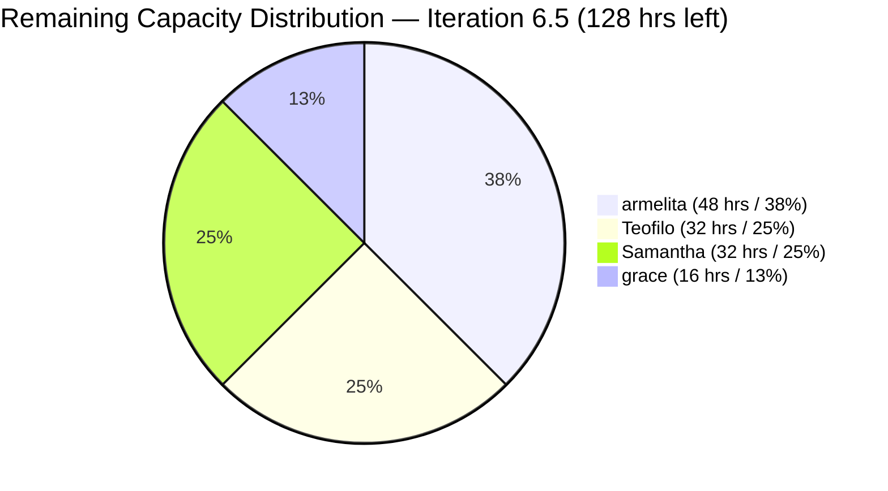

### Workload vs Progress — Day 2

```mermaid
xychart-beta
    title "Items by State per Member — Day 2"
    x-axis ["Teofilo (16)", "armelita (12)", "Samantha (2)", "grace (2)"]
    y-axis "Count" 0 --> 16
    bar [1, 0, 0, 0]
    bar [2, 3, 1, 1]
    bar [13, 9, 1, 1]
```

> **Legend**: Green = Closed, Orange = Active/Ready, Blue = New

> **Workload imbalance persists** (F2 re-emerged): Teofilo has 16 items (53%) and Samantha has 2 items (7%). However, Teofilo's daily training cadence means his items naturally close one-per-day, making the raw count less concerning than it appears. The real concern is Samantha's **zero progress with 32 hrs capacity** — a utilization waste.

---

## 6. Previous Audit Findings — Carry-Forward Status

| Finding                                 | Severity | Day 1 Status      | Day 2 Status          | Trend       |
| --------------------------------------- | -------- | ----------------- | --------------------- | ----------- |
| F1 — Zero Capacity                      | CRITICAL | ✅ RESOLVED        | ✅ RESOLVED            | —           |
| F2 — Workload Imbalance                 | CRITICAL | ⚠️ RE-EMERGED     | ⚠️ **PERSISTS**       | →           |
| F3 — No SAFe Story Format               | CRITICAL | ❌ NOT FIXED       | ❌ **NOT FIXED**       | →           |
| F4 — Minimal Acceptance Criteria        | MAJOR    | ❌ NOT FIXED       | ❌ **NOT FIXED**       | →           |
| F5/F13 — Feature #199488 Stale          | MAJOR    | ❌ 6th AUDIT FLAG  | ❌ **7th AUDIT FLAG**  | ↑ Worsening |
| F7 — Duplicate Descriptions             | MAJOR    | ⚠️ PRESENT        | ⚠️ **PRESENT**        | →           |
| F8 — No Tags                            | MINOR    | ⚠️ MOSTLY MISSING | ⚠️ **MOSTLY MISSING** | →           |
| F9 — Duplicate Task Names               | MINOR    | ❌ NOT FIXED       | ❌ **NOT FIXED**       | →           |
| F14 — Zero Story Points                 | CRITICAL | ❌ NEW             | ❌ **NOT FIXED**       | →           |
| F15 — Feature #197153 "New" w/ children | MINOR    | ❌ NEW             | ❌ **NOT FIXED**       | →           |
| F16 — Feature #200610 "New" w/ children | MINOR    | ❌ NEW             | ❌ **NOT FIXED**       | →           |
| F17 — Carry-Overs Not Re-estimated      | MAJOR    | ❌ NEW             | ❌ **NOT FIXED**       | →           |

### NEW FINDING — Day 2

#### F18 — Story #200590 State Mismatch (Task Active, Parent New)

| Aspect             | Details                                                                                                                                                                                |
| ------------------ | -------------------------------------------------------------------------------------------------------------------------------------------------------------------------------------- |
| **Severity**       | **MINOR**                                                                                                                                                                              |
| **Description**    | User Story #200590 (CSS Batch 2 Marketing) is in "New" state but child task #200591 is "Active". When a child task is being worked on, the parent story should transition to "Active". |
| **Impact**         | Board state does not reflect actual work in progress; misleads status reporting                                                                                                        |
| **Recommendation** | Activate story #200590                                                                                                                                                                 |

#### F19 — Samantha's Items: 3rd Iteration Without Completion

| Aspect             | Details                                                                                                                                                                                                                                                                                          |
| ------------------ | ------------------------------------------------------------------------------------------------------------------------------------------------------------------------------------------------------------------------------------------------------------------------------------------------ |
| **Severity**       | **MAJOR**                                                                                                                                                                                                                                                                                        |
| **Description**    | Both of Samantha's items (#199221 ChatGPT Courseware, #198630 Markdown Training) have been assigned since Iteration 6.4 and are now in their 2nd carry-over iteration with zero task progress. #199221 is "Active" but both its tasks remain "New" — a state mismatch indicating no actual work. |
| **Impact**         | SAFe velocity metrics are distorted; items blocking flow create waste; team credibility risk with stakeholders                                                                                                                                                                                   |
| **SAFe Reference** | SAFe recommends that work items not carried over more than once — persistent carry-overs signal sizing or commitment issues                                                                                                                                                                      |
| **Recommendation** | Immediate 1:1 with Samantha to identify blockers; consider re-sizing or decomposing items; reassign to other team members if blocked                                                                                                                                                             |

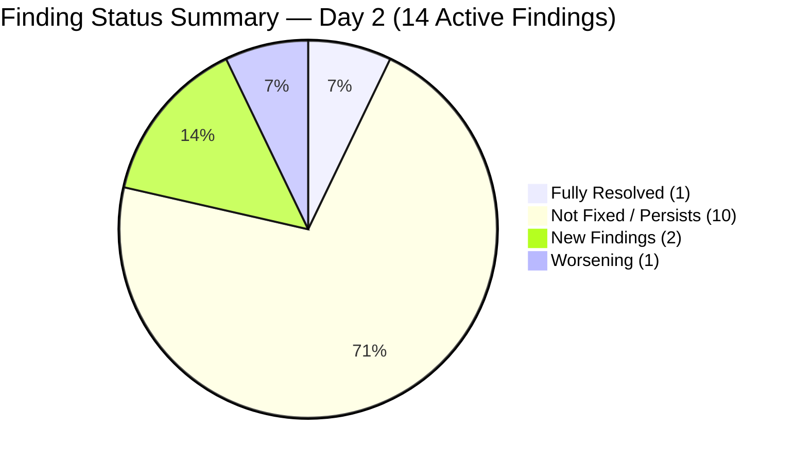

---

## 7. Feature Portfolio Alignment — Day 2

| Feature ID  | Title                                   | State        | 6.5 Children                           | Status                                |
| ----------- | --------------------------------------- | ------------ | -------------------------------------- | ------------------------------------- |
| #191566     | CSS Assessment Center (Sept 2025 Class) | Active       | #198615 (Ready for Dev)                | ✅ Aligned                             |
| #194571     | CSS Assessment Center Application       | Active       | #200593 (Active ✅), #200597 (Active ✅) | ✅ Aligned                             |
| #195913     | Leading SAFe MCC                        | Active       | #199768 (Active)                       | ✅ Aligned                             |
| #195914     | SAFe POPM Microcredential               | Active       | #200326 (New)                          | ✅ Aligned                             |
| #196193     | SK Buhangin Sponsored Bubble 101        | Active       | #197617 (Ready for Dev)                | ✅ Aligned                             |
| #197152     | Class for CSS NCII Mar-May 2026         | Active       | #200582 (Active ✅), #200590 (New ⚠️)   | ⚠️ Partial                            |
| **#197153** | **Web Dev with Bubble.io MCC**          | **New** ❌    | #200607 (New)                          | ❌ **F15: Feature should be Active**   |
| #197330     | Add Sam as Bubble.io MCC Trainer        | Active       | #200566 (New)                          | ✅ Aligned                             |
| #198628     | Markdown Internal Training              | Active       | #198630 (Ready)                        | ✅ Aligned                             |
| #199091     | TESDA Compliance PI6                    | Active       | #199092 (New)                          | ✅ Aligned                             |
| #199144     | ChatGPT Courseware                      | Active       | #199221 (Active)                       | ⚠️ Parent Active, child tasks New     |
| **#199488** | **Cor Jesu College Interns**            | **Active** ❌ | None in 6.5                            | ❌ **F5/F13: 7th AUDIT — NO children** |
| #200056     | Python Training Program                 | Active       | #200604 (New)                          | ✅ Aligned                             |
| #200104     | UM-Digos Interns                        | Active       | #200602 (New)                          | ✅ Aligned                             |
| #200336     | CSS Batch 2 - 2nd Iteration             | Active       | 16 items (1 Closed, 2 Active, 13 New)  | ✅ Aligned                             |
| **#200610** | **UM-Matina Interns**                   | **New** ❌    | #200611 (New)                          | ❌ **F16: Feature should be Active**   |

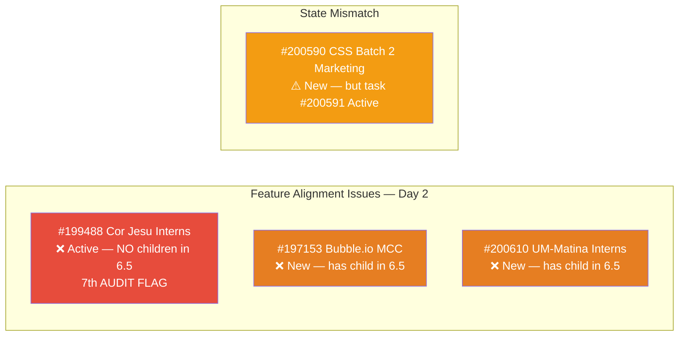

---

## 8. Cross-Iteration Trend Analysis

### 8.1 Iteration Start Comparison: 6.4 vs 6.5

| Metric | 6.4 Day 2 (Feb 24) | 6.5 Day 2 (Mar 10) | Trend |
|---|---|---|---|
| Total Items | 16 | 30 | ↑ 88% more items |
| Closed Items by Day 2 | 0 | **1** | ✅ Faster start |
| Active Items by Day 2 | 0 | **7** | ✅ Much faster activation |
| Items with SP | 0 | 0 | ❌ Same gap |
| Capacity Set | No | **Yes** | ✅ Lesson learned |
| Team Members Active | 0 | **2 (Teofilo + armelita)** | ✅ Earlier engagement |

> **Pattern**: Iteration 6.5 is starting significantly faster than 6.4. The team learned from 6.4's slow start (first closure on Day 9) and is now activating work from Day 1. However, the persistent absence of Story Points means velocity cannot be measured — a systemic gap carried across iterations.

### 8.2 armelita Productivity Pattern

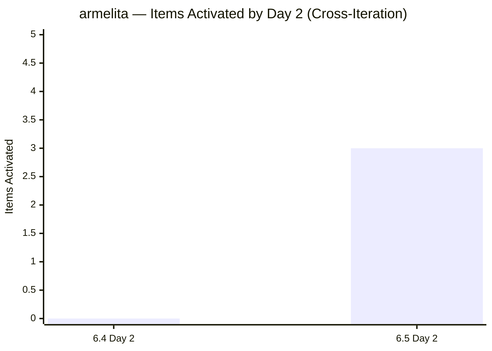

> armelita activated 0 items by Day 2 of 6.4 but has already activated 3 in 6.5 — a strong improvement in early-iteration engagement.

### 8.3 Samantha Recurring Pattern — CONCERN

| Iteration | Items Assigned                | Items Completed | Carry-Over? |
| --------- | ----------------------------- | --------------- | ----------- |
| 6.4       | 3 (#199221, #198630, #198637) | 0               | Yes → 6.5   |
| 6.5       | 2 (#199221, #198630)          | 0 (Day 2)       | ⚠️ At risk  |

> Samantha's items have been unworked for **16+ days** across two iterations. This pattern requires immediate intervention — not as a punitive measure, but to understand if there are blockers, skill gaps, or capacity constraints preventing progress.

---

## 9. Health Score — Day 2

| Dimension          | Weight | Day 1 | Day 2    | Change | Notes                                                                   |
| ------------------ | ------ | ----- | -------- | ------ | ----------------------------------------------------------------------- |
| Iteration Planning | 20%    | 4/10  | **4/10** | —      | Still 0 SP; no iteration goal defined; carry-overs not re-estimated     |
| Work Item Quality  | 20%    | 3/10  | **3/10** | —      | No AC; no SAFe format; state mismatches on #200590, #199221             |
| Team Structure     | 15%    | 7/10  | **7/10** | —      | Capacity set; activities defined; but Samantha utilization at 0%        |
| Task Management    | 15%    | 5/10  | **6/10** | **+1** | 6 tasks now Active (was 1); 2 tasks Closed; Teofilo cadence established |
| Backlog Health     | 15%    | 5/10  | **6/10** | **+1** | First closure achieved; 7 items now Active; forward momentum visible    |
| Process Compliance | 15%    | 4/10  | **4/10** | —      | #199488 7th flag; 2 Features still "New"; new state mismatch found      |

**Calculated Score:**
(4 × 0.20) + (3 × 0.20) + (7 × 0.15) + (6 × 0.15) + (6 × 0.15) + (4 × 0.15)
= 0.8 + 0.6 + 1.05 + 0.9 + 0.9 + 0.6
= **4.85 → 49/100**

```mermaid
xychart-beta
    title "Health Score by Dimension — Day 1 vs Day 2"
    x-axis ["Iter Planning", "Work Item Quality", "Team Structure", "Task Mgmt", "Backlog Health", "Process Compliance"]
    y-axis "Score (out of 10)" 0 --> 10
    bar [4, 3, 7, 5, 5, 4]
    bar [4, 3, 7, 6, 6, 4]
```

### Health Score Trend (Cross-Iteration)

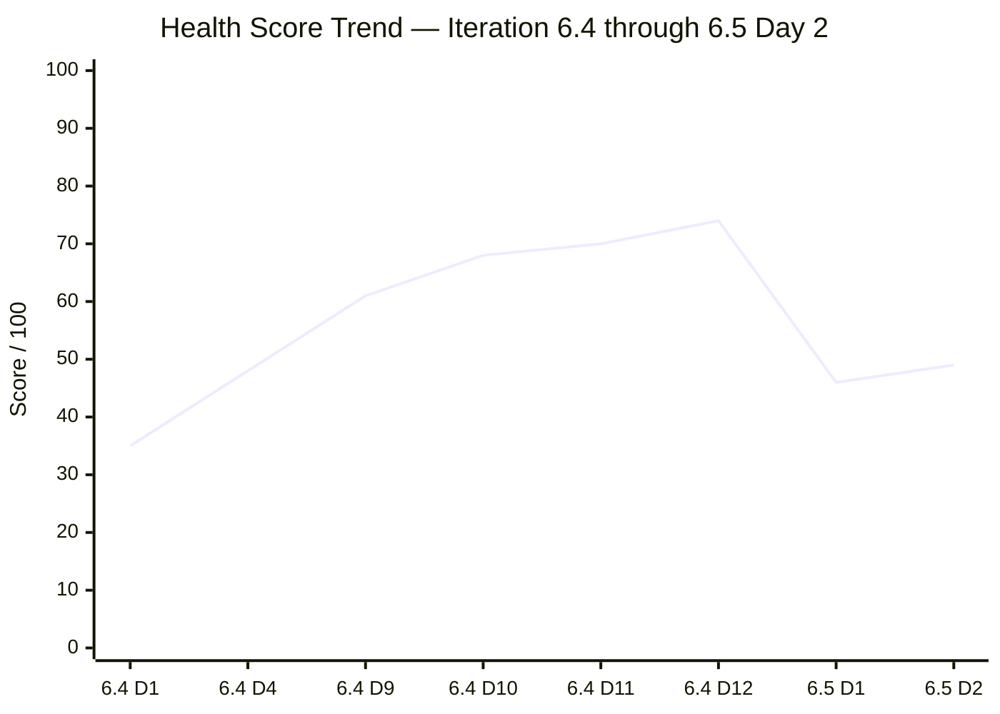

> **Score increased +3 points** (46 → 49). The improvement is modest but meaningful — Task Management and Backlog Health both gained a point as the team begins executing. For context, 6.4 gained +13 points between Day 1 and Day 4. If the current trajectory holds, we should see a similar jump once SP estimation and process fixes are applied.

**Overall Health Score: 49/100** (+3 from Day 1)

---

## 10. Risk Register — Day 2 Update

| Risk                                               | Day 1 Level | Day 2 Level    | Trend        | Mitigation                                                                 |
| -------------------------------------------------- | ----------- | -------------- | ------------ | -------------------------------------------------------------------------- |
| **Zero SP prevents velocity tracking**             | CRITICAL    | **CRITICAL**   | →            | Must estimate in next team session                                         |
| **Samantha 3-iteration carry-over**                | HIGH        | **CRITICAL** ↑ | ↑ Escalating | 1:1 intervention required; 0 progress across 2 days of 6.5                 |
| **Workload imbalance (Teofilo 53%)**               | HIGH        | **MEDIUM** ⬇️  | ⬇️ Improving | Teofilo's daily cadence is working; imbalance is structural not behavioral |
| **Feature #199488 never gets closed**              | MEDIUM      | **HIGH** ↑     | ↑ 7th audit  | Escalate to Project Owner (Ramon)                                          |
| **grace under-capacity for TESDA Microcredential** | MEDIUM      | **MEDIUM**     | →            | 5 tasks, 16 hrs remaining; needs to start soon                             |
| **Scope creep mid-iteration**                      | MEDIUM      | **LOW** ⬇️     | ⬇️           | No new items added; scope stable                                           |
| **No iteration goal defined**                      | HIGH        | **HIGH**       | →            | Define during next team sync                                               |

---

## 11. Recommended Actions — Day 2

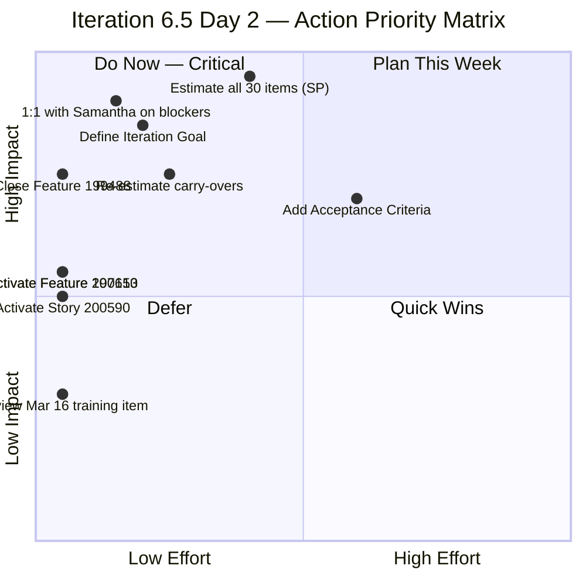

| Priority | Action | Owner | Effort | Impact |
|---|---|---|---|---|
| 🔴 1 | **Estimate all 30 work items with Story Points** — Day 2 without SP; velocity unmeasurable | Team | 30–60 min | Critical — enables all SAFe metrics |
| 🔴 2 | **1:1 with Samantha to identify blockers** — 0 progress across 16+ days; items at risk of 3-iteration carry-over | Team Lead / Ramon | 15 min | Critical — unblocks 2 items; Samantha has 32 hrs spare capacity |
| 🔴 3 | **Define an Iteration Goal** — SAFe requires clear, measurable iteration objective | Team Lead | 10 min | Aligns team focus |
| 🔴 4 | **Close Feature #199488** — 7th consecutive audit flag; no children in 6.5 | armelita | **2 min** | Process compliance; removes longest-standing finding |
| 🟠 5 | **Activate Story #200590** — task #200591 is Active but parent is "New" | armelita | **1 min** | Board accuracy |
| 🟠 6 | **Activate Features #197153 and #200610** — both have children in this iteration | armelita | **2 min each** | Feature state accuracy |
| 🟠 7 | **Re-estimate carry-over items** (#197617, #198615, #199092, #199221, #198630, #199768) | Assigned owners | 15 min | SAFe compliance |
| 🟡 8 | **armelita: Prioritize carry-over items** (#197617, #198615, #199092) — avoid 3rd-iteration carry | armelita | Ongoing | Prevents chronic carry-over |
| 🟡 9 | **grace: Start #200326 tasks** — 5 tasks with only 16 hrs remaining capacity | grace | Ongoing | Prevents end-of-iteration crunch |
| 🟡 10 | **Review #200348** (Mar 16 training) — Mar 16 is a day off | Teofilo | 5 min | Schedule accuracy |

---

## 12. Positive Observations — Learnings from 6.4 Applied

Despite the persistent process gaps, several **positive patterns** are emerging that reflect lessons learned from Iteration 6.4:

1. **Faster iteration start**: First closure on Day 2 (vs Day 9 in 6.4)
2. **Capacity set from Day 1**: Unlike 6.4's zero-capacity start, all 4 members have capacity configured
3. **armelita's early activation**: 3 items activated by Day 2 shows proactive engagement
4. **Teofilo's daily cadence**: Closing training items on schedule establishes predictable flow
5. **No scope creep**: 30 items on Day 1, still 30 items on Day 2 — scope discipline maintained

These improvements suggest the team is internalizing feedback from previous audits, even as structural issues (SP estimation, AC, Feature state management) remain unaddressed.

---

## 13. Conclusion

Day 2 brings the first tangible signs of progress in Iteration 6.5. Teofilo has established his daily training rhythm with 1 closure and 2 activations. armelita has hit the ground running with 3 stories activated and 4 tasks in progress. These are healthy patterns that, if sustained, position the iteration well.

**However, two critical gaps demand immediate attention:**

1. **Samantha's stall**: Zero progress for 16+ days across two iterations. This is not a performance critique — it's a signal that something is blocking her work, and the team needs to identify and remove that blocker immediately. With 32 hrs of unused capacity, Samantha represents the team's largest untapped resource.

2. **Zero Story Points**: For the second consecutive day, the entire iteration has no SP estimates. Without this, the team cannot track velocity, measure progress, or forecast completion. This is the single most impactful improvement the team can make today.

Feature #199488 continues its unprecedented streak as the longest-standing audit finding — now at **7 consecutive reports**. This 2-minute fix has become a symbol of process debt that erodes confidence in the team's ability to manage its board hygiene.

**What's going well**: Teofilo + armelita account for 67% of the team and are both producing. The iteration's trajectory is healthier than 6.4's early days.

**What needs fixing**: SP estimation (team effort), Samantha intervention (management action), Feature #199488 closure (2-minute fix).

**Next recommended audit: March 11, 2026 (Day 3)**

---

*Report generated: March 10, 2026 at 21:05 UTC | SAFe 6.0 Framework | Jairosoft Portfolio — JIT Operation Team*
*Previous Audit: AUDIT_2026-03-09_2256.md (Iteration 6.5 Day 1, Score: 46/100)*
*This Audit: AUDIT_2026-03-10_2105.md (Iteration 6.5 Day 2, Score: 49/100)*
*Iteration 6.5: Mar 9 – Mar 22, 2026 | Day 2 of 14 | Health Score: 49/100 (+3)*
