# SAFe Audit Report

## Jairosoft Portfolio — JIT Operation Team — Iteration 6.5

| Field | Value |
|---|---|
| **Date** | March 11, 2026 |
| **Auditor** | Claude (AI Agile Consultant) |
| **Framework** | SAFe 6.0 |
| **Organization** | dev.azure.com/jairo |
| **Project** | Jairosoft Portfolio |
| **Team** | JIT Operation Team |
| **Iteration** | Iteration 6.5 (Mar 9 – Mar 22, 2026) |
| **Iteration Day** | Day 3 of 14 (21% elapsed) |
| **Report Type** | Daily Audit |
| **Previous Audit** | AUDIT_2026-03-10_2105.md (Iteration 6.5 Day 2, Score: 49/100) |
| **Board URL** | [ADO Board](https://dev.azure.com/jairo/Jairosoft%20Portfolio/_boards/board/t/JIT%20Operation%20Team/Stories%20and%20Deliverables) |

---

## 1. Executive Summary

Day 3 of Iteration 6.5 delivers the **strongest single-day performance** of the iteration so far. The team has produced **2 new closures, 5 new activations, and 8 task closures** — a surge that brings all four team members into active contribution for the first time this iteration.

Key developments since Day 2 (March 10):

- ✅ **2 new closures** — Teofilo completed #200337 (Enabler: COC 1 LO2 materials — all 3 tasks closed) and #200342 (Mar 10 Training)
- ✅ **Teofilo immediately started next enabler** — #200354 (COC 1 LO3 materials) now Active with 1 task in progress
- ✅ **Teofilo activated today's training** — #200343 (Mar 11 Training) is Active
- ✅ **grace broke through** — #200326 (TESDA Microcredential) moved New → Active with 1 task Closed (#200327) and 1 Active (#200329)
- ✅ **armelita expanded active work** — #200590 (CSS Marketing) and #200602 (UM-Digos Interns) both activated; 3 tasks closed
- ✅ **SAMANTHA HAS PROGRESS** — #199653 (ChatGPT Courseware task 1) moved to **Closed** and #199654 (task 2) is now **Active** — breaking 17+ days of stagnation
- ✅ **F18 RESOLVED** — Story #200590 now correctly in Active state (was New with Active task)
- ❌ **Feature #199488 STILL Active** — **8th consecutive audit flag**
- ❌ **All 30 items still lack Story Points** — F14 (CRITICAL) persists
- ❌ **No Acceptance Criteria** on any work items — F4 remains unresolved

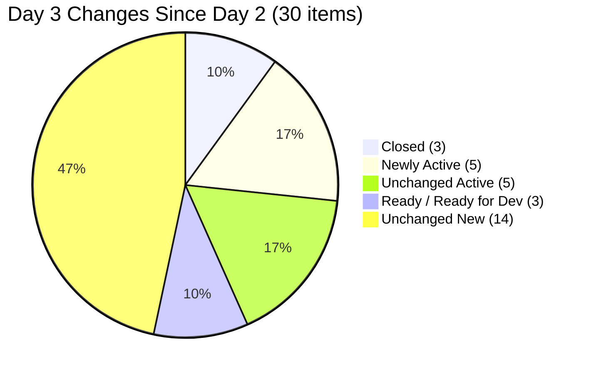

---

## 2. Iteration Snapshot — Day 3 vs Day 2

| Metric | Day 1 | Day 2 | Day 3 | Day 2→3 Change |
|---|---|---|---|---|
| Total Work Items (top-level) | 30 | 30 | **30** | — |
| Total Story Points Committed | 0 SP | 0 SP | **0 SP** ❌ | — |
| Items in "Closed" State | 0 | 1 | **3** | **+2** ✅ |
| Items in "Active" State | 2 | 7 | **10** | **+3** ✅ |
| Items in "Ready" / "Ready for Dev" | 1 | 3 | **3** | — |
| Items in "New" State | 27 | 19 | **14** | **-5** ✅ |
| Total Tasks (children) | 52 | 52 | **52** | — |
| Tasks in "Closed" State | 0 | 2 | **10** | **+8** ✅ |
| Tasks in "Active" State | 1 | 6 | **6** | — |
| Tasks in "New" State | 51 | 44 | **36** | **-8** ✅ |
| Team Capacity | 16 hrs/day | 16 hrs/day | 16 hrs/day | — |

### Work Item State Distribution — Day 3

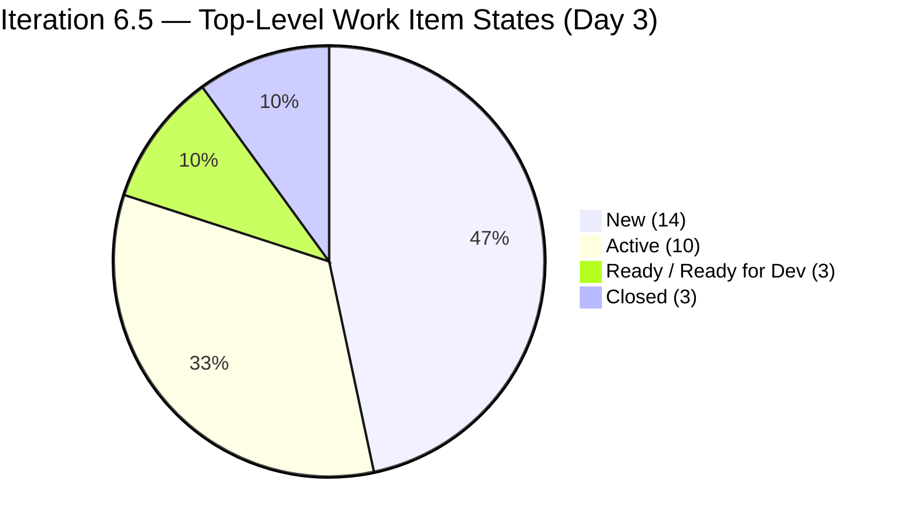

### Task State Distribution — Day 3

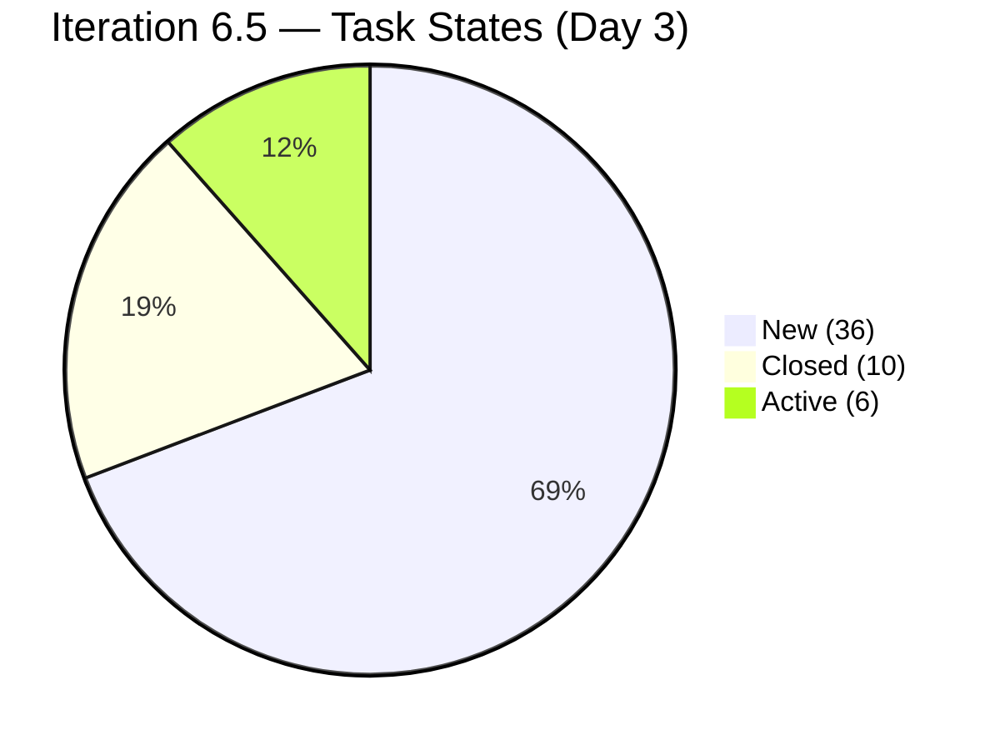

### State Movement Flow (Day 2 → Day 3)

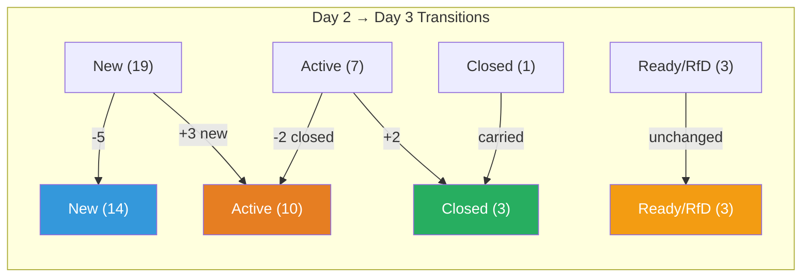

---

## 3. Changes Since Day 2 — Detailed Analysis

### 3.1 New Closures (Day 3)

| ID | Title | Assignee | Previous State | New State | Tasks |
|---|---|---|---|---|---|
| #200337 | Prepare COC 1 LO2 Learning Materials | Teofilo | Active | **Closed** ✅ | 3/3 Closed (#200338, #200339, #200340) |
| #200342 | March 10, 2026 Training CSS Batch 2 | Teofilo | Active | **Closed** ✅ | 1/1 Closed (#200356) |

> **Teofilo has now closed 3 items in 3 days** — his daily training cadence is holding perfectly, and he completed his first enabler (COC 1 LO2) with all 3 tasks. This is the strongest individual performance of the iteration.

### 3.2 Items Activated (Day 3)

| ID | Title | Assignee | Previous State | Type | Tasks |
|---|---|---|---|---|---|
| #200343 | March 11, 2026 Training CSS Batch 2 | Teofilo | New | Training | 1 task (New → awaiting today's session) |
| #200354 | Prepare COC 1 LO3 Learning Materials | Teofilo | New | Enabler | 1 Active (#200512), 2 New |
| #200326 | TESDA Microcredential Program Submission | grace | New | User Story | 1 Closed (#200327), 1 Active (#200329), 3 New |
| #200590 | CSS Batch 2 Marketing Activities | armelita | New | User Story | 1 Active (#200591), 1 New |
| #200602 | Team Deployment of UM-Digos Interns | armelita | New | User Story | 1 Active (#200603) |

### 3.3 Task Closures (8 new closures)

| Task ID | Title | Parent | Assignee |
|---|---|---|---|
| #200339 | 1.2-2 Bootable Device to eLMS | #200337 (Enabler LO2) | Teofilo |
| #200340 | 1.2-3 Creating Portable Bootable Device to eLMS | #200337 (Enabler LO2) | Teofilo |
| #200356 | March 10, 2026 Training CSS Batch 2 | #200342 (Training) | Teofilo |
| #200327 | Competency Mapping | #200326 (TESDA Microcredential) | grace |
| #200584 | Check and Verify Students Information | #200582 (T2 MIS Enrollment) | armelita |
| #200594 | Contact AC Focal Person for the Findings | #200593 (AC Resubmission) | armelita |
| #200598 | Communicate with TESDA for Registration Fee | #200597 (AC Registration Fee) | armelita |
| #199653 | Prepare discussion day 1 | #199221 (ChatGPT Courseware) | **Samantha** ✅ |

### 3.4 BREAKTHROUGH: Samantha's First Progress

| Aspect | Details |
|---|---|
| **What changed** | Task #199653 (prepare discussion day 1) under #199221 (ChatGPT Courseware) moved from New → **Closed**. Task #199654 (prepare discussion day 2) moved from New → **Active**. |
| **Significance** | This is Samantha's **first work item progress since Iteration 6.4 began** — ending a 17+ day stagnation period across two iterations. |
| **Impact on F19** | Finding F19 (Samantha's 3rd-iteration carry-over risk) is now **PARTIALLY MITIGATED**. #199221 has clear momentum with 1/2 tasks closed and 1/2 active. |
| **Remaining concern** | #198630 (Markdown Training) still has 0 task progress — all 4 tasks remain in "New" state. |

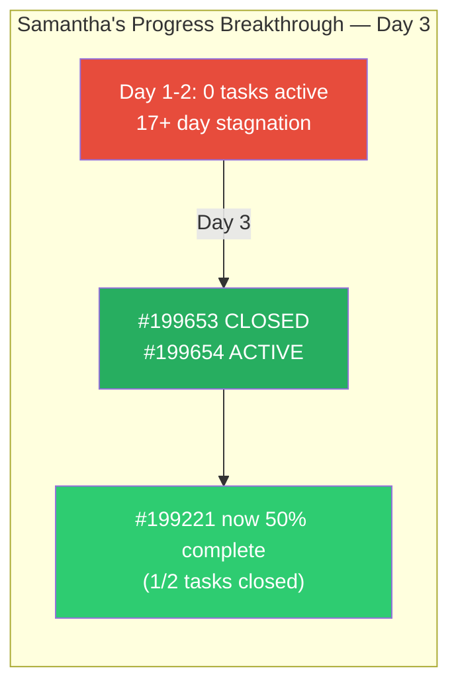

### 3.5 grace's Activation of TESDA Microcredential

| Aspect | Details |
|---|---|
| **What changed** | Story #200326 moved from New → **Active**. Task #200327 (Competency Mapping) is already **Closed**. Task #200329 (CBLM Development) is **Active**. |
| **Significance** | grace has accelerated from 1 active item to 2, with her 5-task Microcredential story now 20% complete on its first day of work. |
| **Positive pattern** | grace is working sequentially through tasks — completing Competency Mapping before starting CBLM Development. This disciplined approach maximizes focus within her limited 2 hrs/day capacity. |

---

## 4. Work Item Inventory by Team Member — Day 3

### 4.1 Teofilo Limpag — 16 Items (3 Closed, 2 Active, 11 New)

| ID | Type | Title | Day 2 State | Day 3 State | Tasks |
|---|---|---|---|---|---|
| #200337 | Enabler | Prepare COC 1 LO2 Learning Materials | Active | **Closed** ✅ | 3/3 Closed |
| #200341 | Training | March 9, 2026 Training CSS Batch 2 | Closed | Closed | 1/1 Closed |
| #200342 | Training | March 10, 2026 Training CSS Batch 2 | Active | **Closed** ✅ | 1/1 Closed |
| #200343 | Training | March 11, 2026 Training CSS Batch 2 | New | **Active** ✅ | 1 task (New) |
| #200354 | Enabler | Prepare COC 1 LO3 Learning Materials | New | **Active** ✅ | 1 Active, 2 New |
| #200344 | Training | March 12, 2026 Training CSS Batch 2 | New | New | 1 task (New) |
| #200345 | Training | March 13, 2026 Training CSS Batch 2 | New | New | 1 task (New) |
| #200347 | Training | March 14, 2026 Training CSS Batch 2 | New | New | 1 task (New) |
| #200348 | Training | March 16, 2026 Training CSS Batch 2 | New | New | 1 task (New) |
| #200349 | Training | March 17, 2026 Training CSS Batch 2 | New | New | 1 task (New) |
| #200350 | Training | March 18, 2026 Training CSS Batch 2 | New | New | 1 task (New) |
| #200351 | Training | March 19, 2026 Training CSS Batch 2 | New | New | 1 task (New) |
| #200352 | Training | March 20, 2026 Training CSS Batch 2 | New | New | 1 task (New) |
| #200353 | Training | March 21, 2026 Training CSS Batch 2 | New | New | 1 task (New) |

> **Assessment**: Teofilo is the iteration's top performer. 3 items closed in 3 days with a perfect daily cadence. He completed Enabler LO2 and immediately started LO3 — demonstrating excellent work sequencing. At this rate, he will close all 11 remaining training items on schedule plus complete LO3 before iteration end. **Projected completion: 100%** if cadence holds.

### 4.2 armelita — 12 Items (0 Closed, 6 Active, 3 Ready/RfD, 3 New)

| ID | Type | Title | Day 2 State | Day 3 State | Tasks |
|---|---|---|---|---|---|
| #200582 | User Story | T2 MIS Enrollment | Active | Active | 1 **Closed** (#200584), 1 New |
| #200590 | User Story | CSS Batch 2 Marketing Activities | New ⚠️ | **Active** ✅ | 1 Active (#200591), 1 New |
| #200593 | User Story | AC Resubmission Result | Active | Active | 1 **Closed** (#200594), 1 New |
| #200597 | User Story | CSS NC II AC Registration Fee | Active | Active | 1 **Closed** (#200598), 1 New |
| #200602 | User Story | Team Deployment of UM-Digos Interns | New | **Active** ✅ | 1 Active (#200603) |
| #197617 | User Story | SK Buhangin Partnership | Ready for Dev | Ready for Dev | 2 tasks (all New) |
| #198615 | User Story | Awarding of CSS NC II Certificates | Ready for Dev | Ready for Dev | 2 tasks (all New) |
| #199092 | User Story | TESDA Career Guidance Report | New | New | 2 tasks (all New) |
| #200566 | User Story | Additional Trainer App — Sam | New | New | 2 tasks (all New) |
| #200604 | User Story | Python Inquiries | New | New | 2 tasks (all New) |
| #200607 | User Story | Bubble MCC Marketing Activities | New | New | 2 tasks (all New) |
| #200611 | User Story | [Onboarding] UM Matina Interns | New | New | 1 task (New) |

> **Assessment**: armelita continues strong execution with 3 task closures today and 2 new story activations. She now has **6 active stories** — the widest active workfront on the team. The 3 carry-over items (#197617, #198615, #199092) remain untouched for the **3rd consecutive day** — these should be prioritized before they become entrenched.

### 4.3 Samantha Babael — 2 Items (0 Closed, 1 Active, 1 Ready)

| ID | Type | Title | Day 2 State | Day 3 State | Tasks |
|---|---|---|---|---|---|
| #199221 | Courseware | ChatGPT Courseware | Active | Active | 1 **Closed** (#199653) ✅, 1 **Active** (#199654) ✅ |
| #198630 | Training | Markdown Training for Employees | Ready | Ready | 4 tasks (all New) ❌ |

> **Assessment**: ✅ **Significant turnaround from Day 2.** Samantha moved from zero progress to having 1 task closed and 1 task active on #199221. This breaks the 17-day stagnation pattern and shows the item is achievable. However, #198630 (Markdown Training) with 4 tasks still has zero progress — this item now becomes the primary carry-over risk.

### 4.4 grace — 2 Items (0 Closed, 2 Active)

| ID | Type | Title | Day 2 State | Day 3 State | Tasks |
|---|---|---|---|---|---|
| #199768 | User Story | Resubmission EBET Leading SAFe | Active | Active | 1 Active (#200028 Document Review) |
| #200326 | User Story | TESDA Microcredential Program Submission | New | **Active** ✅ | 1 **Closed** (#200327), 1 **Active** (#200329), 3 New |

> **Assessment**: ✅ **Strong Day 3 from grace.** Both items now Active. The TESDA Microcredential story is already 20% through its tasks with Competency Mapping completed and CBLM Development underway. With 3 tasks remaining and ~14 hrs of capacity left, grace needs to maintain steady progress to complete both items by iteration end.

---

## 5. Team Capacity Analysis — Day 3

| Member | Capacity/Day | Days Off | Remaining Working Days | Total Remaining Capacity | Items | Closed |
|---|---|---|---|---|---|---|
| Teofilo Limpag | 4 hrs/day | Mar 16 | 7 | **28 hrs** | 16 | 3 |
| armelita | 6 hrs/day | Mar 16 | 7 | **42 hrs** | 12 | 0 |
| Samantha Babael | 4 hrs/day | Mar 16 | 7 | **28 hrs** | 2 | 0 |
| grace | 2 hrs/day | Mar 16 | 7 | **14 hrs** | 2 | 0 |
| **TOTAL** | **16 hrs/day** | | | **112 hrs remaining** | **30** | **3** |

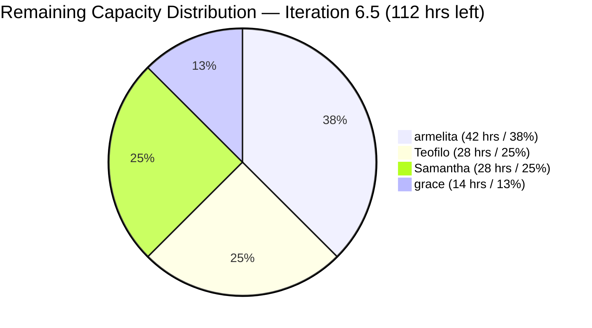

### Completion Progress by Member — Day 3

```mermaid
xychart-beta
    title "Items by State per Member — Day 3"
    x-axis ["Teofilo (16)", "armelita (12)", "Samantha (2)", "grace (2)"]
    y-axis "Count" 0 --> 16
    bar [3, 0, 0, 0]
    bar [2, 6, 1, 2]
    bar [11, 6, 1, 0]
```

> **Legend**: Green = Closed, Orange = Active/Ready, Blue = New

> **Workload balance improving**: While Teofilo still holds 53% of items, he's closing them at the fastest rate. Samantha's utilization has finally moved off zero. grace now has both items active. armelita has the most complex portfolio with 6 concurrent active stories.

---

## 6. Previous Audit Findings — Carry-Forward Status

| Finding | Severity | Day 2 Status | Day 3 Status | Trend |
|---|---|---|---|---|
| F1 — Zero Capacity | CRITICAL | ✅ RESOLVED | ✅ RESOLVED | — |
| F2 — Workload Imbalance | CRITICAL | ⚠️ PERSISTS | ⚠️ **MITIGATING** | ⬇️ Improving |
| F3 — No SAFe Story Format | CRITICAL | ❌ NOT FIXED | ❌ **NOT FIXED** | → |
| F4 — Minimal Acceptance Criteria | MAJOR | ❌ NOT FIXED | ❌ **NOT FIXED** | → |
| F5/F13 — Feature #199488 Stale | MAJOR | ❌ 7th AUDIT FLAG | ❌ **8th AUDIT FLAG** | ↑ Worsening |
| F7 — Duplicate Descriptions | MAJOR | ⚠️ PRESENT | ⚠️ **PRESENT** | → |
| F8 — No Tags | MINOR | ⚠️ MOSTLY MISSING | ⚠️ **MOSTLY MISSING** | → |
| F9 — Duplicate Task Names | MINOR | ❌ NOT FIXED | ❌ **NOT FIXED** | → |
| F14 — Zero Story Points | CRITICAL | ❌ NOT FIXED | ❌ **NOT FIXED** | → |
| F15 — Feature #197153 "New" w/ children | MINOR | ❌ NOT FIXED | ❌ **NOT FIXED** | → |
| F16 — Feature #200610 "New" w/ children | MINOR | ❌ NOT FIXED | ❌ **NOT FIXED** | → |
| F17 — Carry-Overs Not Re-estimated | MAJOR | ❌ NOT FIXED | ❌ **NOT FIXED** | → |
| F18 — Story #200590 State Mismatch | MINOR | ❌ NEW (Day 2) | ✅ **RESOLVED** | ✅ Fixed |
| F19 — Samantha 3rd-Iter Carry-Over Risk | MAJOR | ❌ NEW (Day 2) | ⚠️ **PARTIALLY MITIGATED** | ⬇️ Improving |

### Day 3 — No New Findings

For the first time in this iteration, there are **no new findings** to report. The team's execution focus today has not introduced new process issues, and one finding (F18) was resolved.

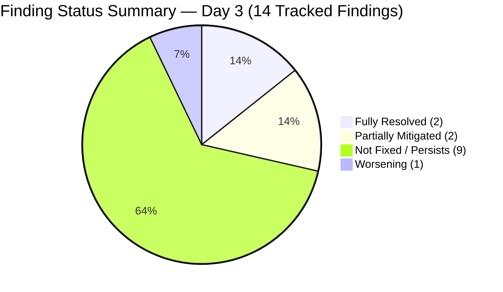

---

## 7. Feature Portfolio Alignment — Day 3

| Feature ID | Title | State | 6.5 Children | Status |
|---|---|---|---|---|
| #191566 | CSS Assessment Center (Sept 2025 Class) | Active | #198615 (Ready for Dev) | ✅ Aligned |
| #194571 | CSS Assessment Center Application | Active | #200593 (Active), #200597 (Active) | ✅ Aligned |
| #195913 | Leading SAFe MCC | Active | #199768 (Active) | ✅ Aligned |
| #195914 | SAFe POPM Microcredential | Active | #200326 (**Active** ✅) | ✅ Aligned — improved |
| #196193 | SK Buhangin Sponsored Bubble 101 | Active | #197617 (Ready for Dev) | ✅ Aligned |
| #197152 | Class for CSS NCII Mar-May 2026 | Active | #200582 (Active), #200590 (**Active** ✅) | ✅ Aligned — F18 resolved |
| **#197153** | **Web Dev with Bubble.io MCC** | **New** ❌ | #200607 (New) | ❌ **F15: Feature should be Active** |
| #197330 | Add Sam as Bubble.io MCC Trainer | Active | #200566 (New) | ✅ Aligned |
| #198628 | Markdown Internal Training | Active | #198630 (Ready) | ✅ Aligned |
| #199091 | TESDA Compliance PI6 | Active | #199092 (New) | ✅ Aligned |
| #199144 | ChatGPT Courseware | Active | #199221 (Active) | ✅ Aligned — tasks now progressing |
| **#199488** | **Cor Jesu College Interns** | **Active** ❌ | None in 6.5 | ❌ **F5/F13: 8th AUDIT — NO children** |
| #200056 | Python Training Program | Active | #200604 (New) | ✅ Aligned |
| #200104 | UM-Digos Interns | Active | #200602 (**Active** ✅) | ✅ Aligned — improved |
| #200336 | CSS Batch 2 - 2nd Iteration | Active | 16 items (3 Closed, 2 Active, 11 New) | ✅ Aligned |
| **#200610** | **UM-Matina Interns** | **New** ❌ | #200611 (New) | ❌ **F16: Feature should be Active** |

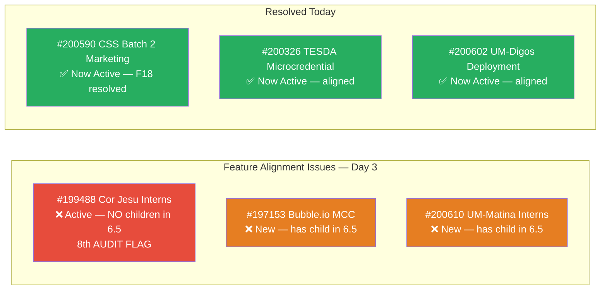

---

## 8. Cross-Iteration Trend Analysis

### 8.1 Iteration 6.5 — Day-over-Day Progress

| Metric | Day 1 | Day 2 | Day 3 | 3-Day Trend |
|---|---|---|---|---|
| Closed Items | 0 | 1 | **3** | ✅ Accelerating |
| Active Items | 2 | 7 | **10** | ✅ Broadening |
| Tasks Closed | 0 | 2 | **10** | ✅ Strong acceleration |
| Team Members Contributing | 0 | 2 | **4** | ✅ **Full team engaged** |
| New Findings | 4 | 2 | **0** | ✅ Process stabilizing |

```mermaid
xychart-beta
    title "Iteration 6.5 — Daily Progress Trend"
    x-axis ["Day 1", "Day 2", "Day 3"]
    y-axis "Count" 0 --> 12
    bar [0, 1, 3]
    bar [0, 2, 10]
    line [0, 2, 10]
```

> **Legend**: Blue bars = Items Closed, Orange bars = Tasks Closed, Line = Task closure trend

### 8.2 Iteration Start Comparison: 6.4 Day 3 vs 6.5 Day 3

| Metric | 6.4 Day 3 (Feb 25) | 6.5 Day 3 (Mar 11) | Improvement |
|---|---|---|---|
| Closed Items | 0 | **3** | ✅ Far ahead |
| Active Items | ~2 | **10** | ✅ 5× more active |
| Tasks Closed | 0 | **10** | ✅ Significant |
| Members Contributing | ~1 | **4** | ✅ Full team |
| Health Score | ~42 | **55** | ✅ +13 points higher |

> **The team is executing Iteration 6.5 at a fundamentally faster pace than 6.4.** By Day 3 of 6.4, the team had zero closures and was still ramping up. By Day 3 of 6.5, all four members are contributing, 3 items are closed, and 10 tasks are done. This validates that lessons from 6.4 are being applied.

### 8.3 Samantha Recovery Pattern

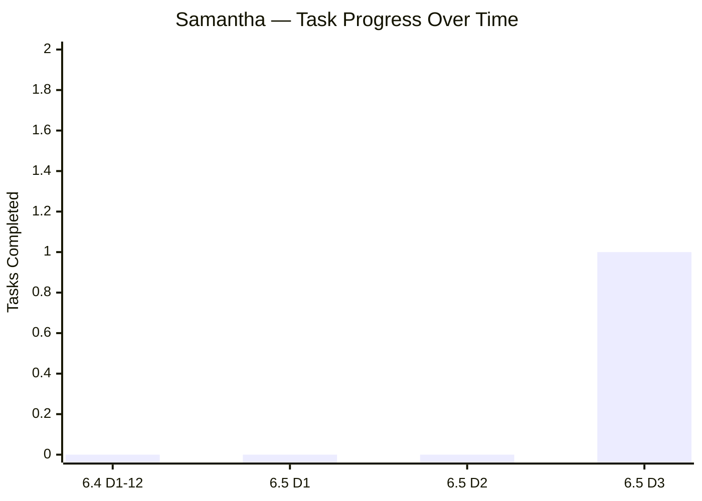

> After 17+ days of zero task completions across Iterations 6.4 and 6.5 Days 1-2, Samantha's Day 3 breakthrough represents a positive inflection point. Whether this becomes a sustained pattern or an isolated event will be critical to monitor.

### 8.4 grace Execution Pattern

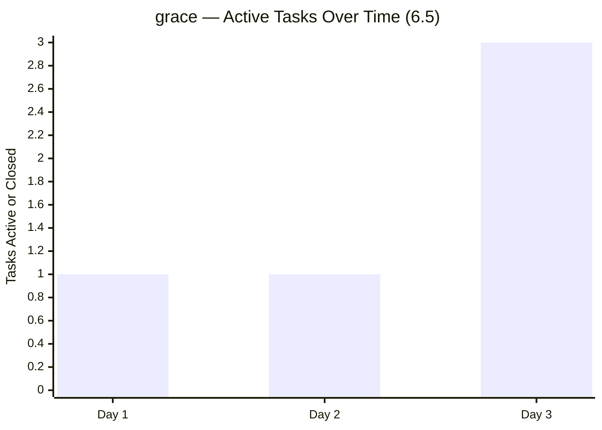

> grace went from 1 active task (Document Review) to 3 tasks in progress/completed across 2 stories. The sequential task completion approach (Competency Mapping done → CBLM Development started) shows disciplined execution within her capacity constraints.

---

## 9. Health Score — Day 3

| Dimension | Weight | Day 1 | Day 2 | Day 3 | Change | Notes |
|---|---|---|---|---|---|---|
| Iteration Planning | 20% | 4/10 | 4/10 | **4/10** | — | Still 0 SP; no iteration goal; carry-overs not re-estimated |
| Work Item Quality | 20% | 3/10 | 3/10 | **3/10** | — | No AC; no SAFe format; duplicate task names persist |
| Team Structure | 15% | 7/10 | 7/10 | **8/10** | **+1** | All 4 members now actively contributing; Samantha unblocked |
| Task Management | 15% | 5/10 | 6/10 | **7/10** | **+1** | 10 tasks closed (was 2); strong daily throughput |
| Backlog Health | 15% | 5/10 | 6/10 | **7/10** | **+1** | 3 items closed; 10 active; 43% items in active/closed state |
| Process Compliance | 15% | 4/10 | 4/10 | **5/10** | **+1** | F18 resolved; no new findings; but #199488 hits 8th flag |

**Calculated Score:**
(4 × 0.20) + (3 × 0.20) + (8 × 0.15) + (7 × 0.15) + (7 × 0.15) + (5 × 0.15)
= 0.80 + 0.60 + 1.20 + 1.05 + 1.05 + 0.75
= **5.45 → 55/100**

```mermaid
xychart-beta
    title "Health Score by Dimension — Day 2 vs Day 3"
    x-axis ["Iter Planning", "Work Item Quality", "Team Structure", "Task Mgmt", "Backlog Health", "Process Compliance"]
    y-axis "Score (out of 10)" 0 --> 10
    bar [4, 3, 7, 6, 6, 4]
    bar [4, 3, 8, 7, 7, 5]
```

### Health Score Trend (Cross-Iteration)

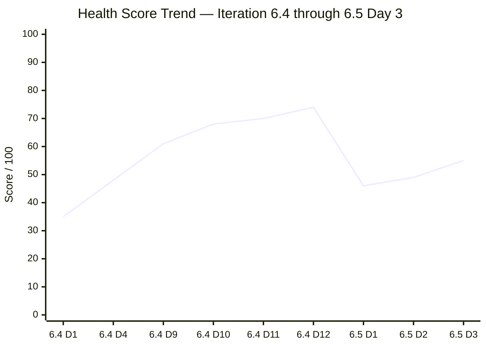

> **Score increased +6 points** (49 → 55). This is the largest single-day improvement in Iteration 6.5, driven by 4 dimensions improving simultaneously. For comparison, 6.4 gained +13 points between Day 1 and Day 4. Iteration 6.5 has already gained +9 points in 3 days. The score is now tracking above 6.4's equivalent day.

**Overall Health Score: 55/100** (+6 from Day 2)

---

## 10. Risk Register — Day 3 Update

| Risk | Day 2 Level | Day 3 Level | Trend | Mitigation |
|---|---|---|---|---|
| **Zero SP prevents velocity tracking** | CRITICAL | **CRITICAL** | → | Must estimate in next team session |
| **Samantha carry-over (Markdown Training)** | CRITICAL | **HIGH** ⬇️ | ⬇️ Improving | ChatGPT Courseware progressing; Markdown Training still zero progress |
| **Feature #199488 never gets closed** | HIGH | **HIGH** | ↑ 8th audit | Escalate to Project Owner (Ramon) |
| **No iteration goal defined** | HIGH | **HIGH** | → | Define during next team sync |
| **armelita's carry-overs untouched (Day 3)** | — | **MEDIUM** ⬆️ | NEW | #197617, #198615, #199092 — 3 items untouched since 6.4 |
| **grace capacity for TESDA Microcredential** | MEDIUM | **MEDIUM** ⬇️ | ⬇️ Improving | Task 1 closed, Task 2 active; 14 hrs for 3 remaining tasks |
| **Workload imbalance** | MEDIUM | **LOW** ⬇️ | ⬇️ | Teofilo's cadence closing items daily; structural not behavioral |
| **Scope creep mid-iteration** | LOW | **LOW** | → | No new items added; scope stable |

---

## 11. Recommended Actions — Day 3

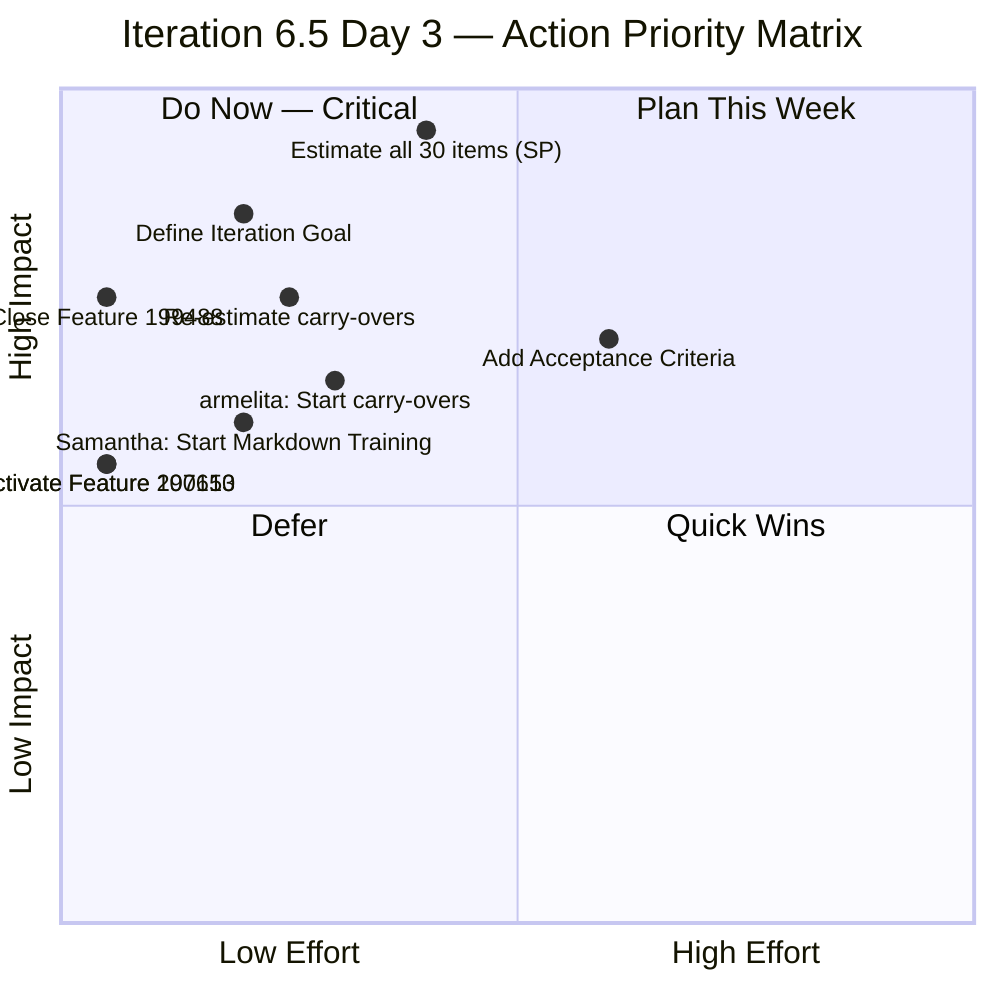

| Priority | Action | Owner | Effort | Impact |
|---|---|---|---|---|
| 🔴 1 | **Estimate all 30 work items with Story Points** — Day 3 without SP; velocity still unmeasurable | Team | 30–60 min | Critical — enables all SAFe metrics |
| 🔴 2 | **Define an Iteration Goal** — SAFe requires clear, measurable iteration objective | Team Lead | 10 min | Aligns team focus |
| 🔴 3 | **Close Feature #199488** — **8th consecutive audit flag**; no children in 6.5; 2-minute fix | armelita | **2 min** | Process compliance; removes longest-standing finding |
| 🟠 4 | **Activate Features #197153 and #200610** — both have children in this iteration | armelita | **2 min each** | Feature state accuracy |
| 🟠 5 | **Re-estimate carry-over items** (#197617, #198615, #199092, #199221, #198630, #199768) | Assigned owners | 15 min | SAFe compliance |
| 🟠 6 | **armelita: Prioritize carry-over items** (#197617, #198615, #199092) — untouched for 3 days in 6.5, already carry-overs from 6.4 | armelita | Ongoing | Prevents 3rd-iteration carry-over |
| 🟡 7 | **Samantha: Start Markdown Training** (#198630) — 4 tasks, all New; ChatGPT Courseware is progressing well | Samantha | Ongoing | Prevents continued carry-over |
| 🟡 8 | **Review #200348** (Mar 16 training) — Mar 16 is a day off for all members | Teofilo | 5 min | Schedule accuracy |

---

## 12. Positive Observations — Day 3 Highlights

Day 3 is the most productive day of Iteration 6.5 so far, with several positive developments worth celebrating:

1. **All 4 team members contributing**: For the first time this iteration, every team member has active task progress — a milestone that 6.4 didn't achieve until much later.

2. **Teofilo's perfect cadence**: 3 closures in 3 days, with immediate transition between enablers (LO2 completed → LO3 started). This is textbook SAFe flow.

3. **Samantha's breakthrough**: After 17+ days of stagnation, closing a task and activating the next one signals that the blocker (whatever it was) has been removed. The 1:1 intervention recommended in previous audits appears to have had effect.

4. **grace's disciplined execution**: Completing Competency Mapping before starting CBLM Development shows sequential focus — the right approach for her 2 hrs/day capacity constraint.

5. **armelita's task throughput**: 3 task closures in a single day across 3 different stories demonstrates effective multi-story management.

6. **Zero new findings**: The team introduced no new process issues today — a first for Iteration 6.5.

7. **F18 self-corrected**: Story #200590 was activated without audit intervention, showing the team may be internalizing board hygiene practices.

---

## 13. Conclusion

Day 3 represents a **turning point** for Iteration 6.5. The team has shifted from a planning/activation phase into genuine execution mode. All four members are contributing, task closures have jumped from 2 to 10, and the health score gained 6 points — the strongest single-day improvement of the iteration.

**The headline story is Samantha's breakthrough.** After being flagged as the highest-risk area for two consecutive audits, she has closed her first task and activated the next. This doesn't fully resolve the concern — #198630 (Markdown Training) remains untouched — but it demonstrates that the carry-over items are achievable and the stagnation was not permanent.

**Teofilo continues to be the iteration anchor**, delivering with mechanical precision: 1 training closure per day, enablers completed sequentially, zero dropped items. grace and armelita are both expanding their active workfronts appropriately.

**The remaining ceiling on the health score** is defined by two factors the team has not yet addressed:

1. **Zero Story Points** (F14 — CRITICAL): This is now Day 3 without SP estimates. Every day without estimation makes velocity tracking more meaningless and iteration forecasting impossible. This is the single highest-impact action available.

2. **Feature #199488** (F5/F13 — 8th audit): This 2-minute fix has become an embedded process debt. It should be closed today.

**What's going well**: Full team engagement, strong task throughput, Samantha unblocked, no new findings.

**What needs fixing**: SP estimation (team effort), Feature #199488 closure (2-minute fix), carry-over item prioritization (armelita).

**Velocity projection**: With 3 items closed in 3 days and 7 remaining working days, the team is on pace for ~10 closures this iteration — a significant improvement over 6.4's early trajectory. If SP estimation is completed, this can be measured precisely.

**Next recommended audit: March 12, 2026 (Day 4)**

---

*Report generated: March 11, 2026 at 21:04 UTC | SAFe 6.0 Framework | Jairosoft Portfolio — JIT Operation Team*
*Previous Audit: AUDIT_2026-03-10_2105.md (Iteration 6.5 Day 2, Score: 49/100)*
*This Audit: AUDIT_2026-03-11_2104.md (Iteration 6.5 Day 3, Score: 55/100)*
*Iteration 6.5: Mar 9 – Mar 22, 2026 | Day 3 of 14 | Health Score: 55/100 (+6)*
