# SAFe Audit Report

## Jairosoft Portfolio — JIT Operation Team — Iteration 6.5

| Field | Value |
|---|---|
| **Date** | March 12, 2026 |
| **Auditor** | Claude (AI Agile Consultant) |
| **Framework** | SAFe 6.0 |
| **Organization** | dev.azure.com/jairo |
| **Project** | Jairosoft Portfolio |
| **Team** | JIT Operation Team |
| **Iteration** | Iteration 6.5 (Mar 9 – Mar 22, 2026) |
| **Iteration Day** | Day 4 of 14 (29% elapsed) |
| **Report Type** | Daily Audit |
| **Previous Audit** | AUDIT_2026-03-11_2104.md (Iteration 6.5 Day 3, Score: 55/100) |
| **Board URL** | [ADO Board](https://dev.azure.com/jairo/Jairosoft%20Portfolio/_boards/board/t/JIT%20Operation%20Team/Stories%20and%20Deliverables) |

---

## 1. Executive Summary

Day 4 of Iteration 6.5 is a **scope management day** rather than a closure day. The headline developments since yesterday's Day 3 audit are:

- 🆕 **New high-priority item added** — #201003 (CSS NC II Compliance Audit) entered the iteration as **Active** with armelita already started on task #201004. This is an urgent TESDA compliance deliverable with 5 tasks.
- 📋 **Iteration scope intentionally reduced** — 4 items (#198615, #199092, #200566, #200604) were **removed from Iteration 6.5**, trimming the backlog from 30 to 27 items. This is a positive SAFe scope management action.
- ⚠️ **Zero new closures** — For the first time since Day 1, no top-level items or tasks advanced to Closed status today.
- ⚠️ **Teofilo's cadence interrupted** — The March 11 Training (#200343) is still Active with its task still New on Day 4. This breaks his 3-day perfect closure streak.
- ✅ **Samantha and grace maintaining momentum** — Both members hold active tasks from Day 3 with no regression.
- ❌ **Feature #199488 hits 9th consecutive audit flag** — Still Active with no iteration children.

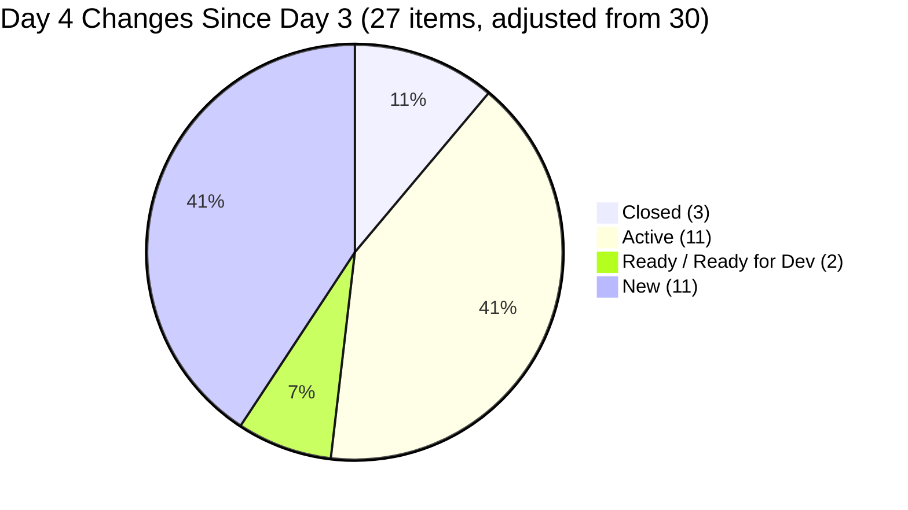

---

## 2. Iteration Snapshot — Day 4 vs Day 3

| Metric | Day 1 | Day 2 | Day 3 | Day 4 | Day 3→4 Change |
|---|---|---|---|---|---|
| Total Work Items (top-level) | 30 | 30 | 30 | **27** | **-3** 📋 (scope managed) |
| Total Story Points Committed | 0 SP | 0 SP | 0 SP | **0 SP** ❌ | — |
| Items in "Closed" State | 0 | 1 | 3 | **3** | **0** — |
| Items in "Active" State | 2 | 7 | 10 | **11** | **+1** ✅ |
| Items in "Ready" / "Ready for Dev" | 1 | 3 | 3 | **2** | **-1** (198615 de-scoped) |
| Items in "New" State | 27 | 19 | 14 | **11** | **-3** (de-scoped) |
| Total Tasks (children) | 52 | 52 | 52 | **49** | **-3** (net: −8 de-scoped, +5 new) |
| Tasks in "Closed" State | 0 | 2 | 10 | **10** | **0** — |
| Tasks in "Active" State | 1 | 6 | 6 | **7** | **+1** ✅ |
| Tasks in "New" State | 51 | 44 | 36 | **32** | **-4** (scope-adjusted) |
| Team Capacity | 16 hrs/day | 16 hrs/day | 16 hrs/day | 16 hrs/day | — |

### Work Item State Distribution — Day 4

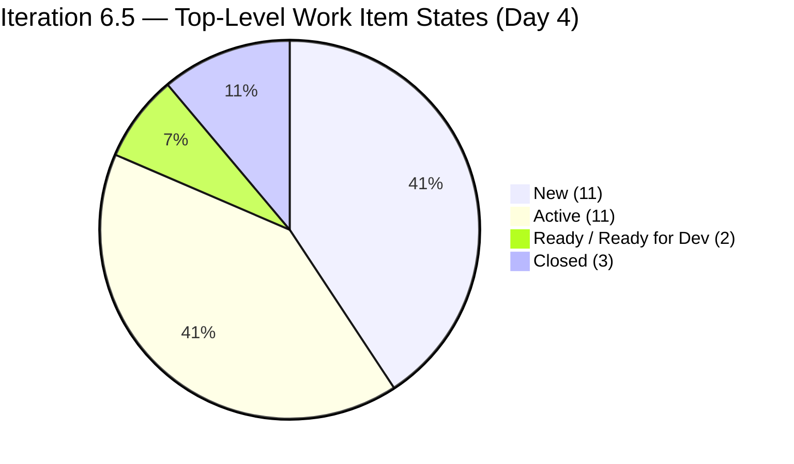

### Task State Distribution — Day 4

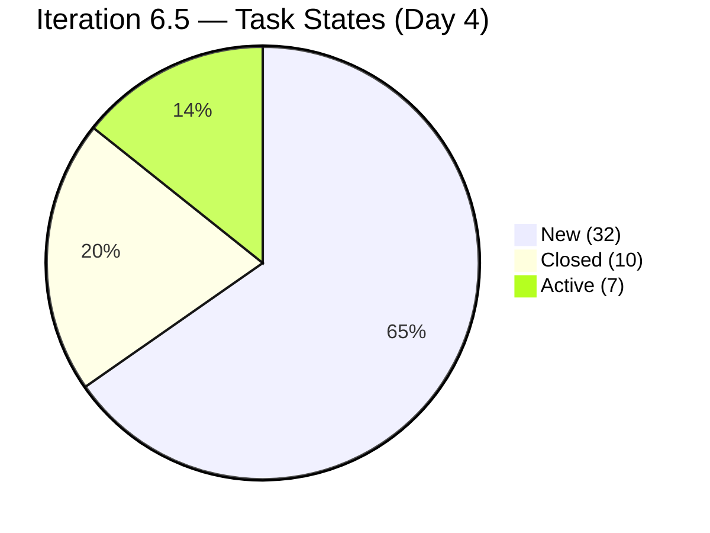

### State Movement Flow (Day 3 → Day 4)

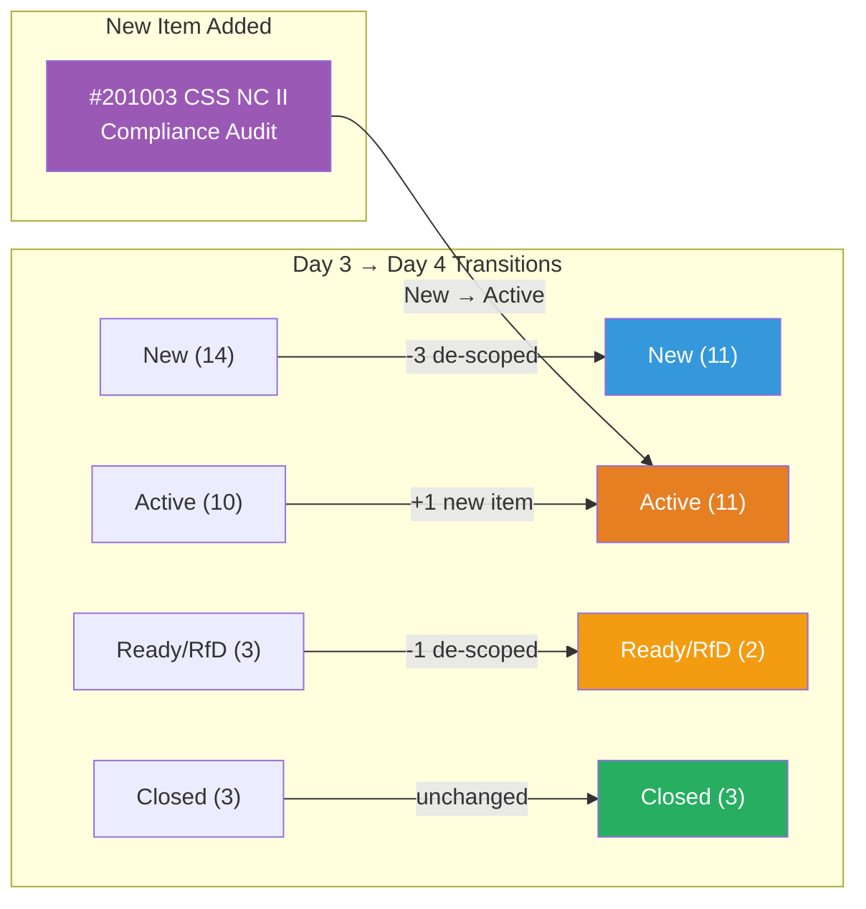

---

## 3. Changes Since Day 3 — Detailed Analysis

### 3.1 New Closures — Day 4

**None.** This is the first day in the iteration without a closure event. The team advanced no top-level items or tasks to Closed status on Day 4.

> This is notable because Day 3 produced 2 item closures and 8 task closures. The Day 4 pause is likely a combination of: (a) scope management work consuming armelita's focus, (b) Teofilo's cadence interruption, and (c) the audit running before the full workday's activity has been logged.

### 3.2 New Item Added — #201003 CSS NC II Compliance Audit (🆕 HIGH PRIORITY)

| Field | Details |
|---|---|
| **ID** | #201003 |
| **Title** | CSS NC II Compliance Audit |
| **Type** | User Story |
| **Assignee** | armelita |
| **Parent Feature** | #199091 (TESDA Compliance PI6) |
| **State** | **Active** — started immediately |
| **Tasks** | 5 tasks (1 Active, 4 New) |

**Tasks under #201003:**

| Task ID | Title | State |
|---|---|---|
| #201004 | Update and Prepare Program Registration Folder | **Active** ✅ |
| #201007 | Send BR for the Auditors and Key People of JIT | New |
| #201008 | Create and Submit MIS 0302 | New |
| #201009 | Compile CSS NC II Students Instructional Materials and Institutional Assessments | New |
| #201010 | Perform Internal Audit | New |

> **Strategic Significance**: The CSS NC II Compliance Audit is a **critical compliance deliverable** for TESDA's Assessment Center accreditation. armelita correctly prioritized this immediately — adding it as Active with a task already underway signals urgency. This item has a sequencing dependency: tasks #201007–#201009 are preparation steps that must be completed before #201010 (Perform Internal Audit) can execute. The "Perform Internal Audit" task suggests an upcoming formal TESDA inspection or pre-audit.

### 3.3 Scope De-Scoping — 4 Items Removed from Iteration 6.5

| ID | Title | State | Assignee | Tasks (all New) |
|---|---|---|---|---|
| #198615 | Awarding of CSS NC II Certificates | Ready for Dev | armelita | 2 tasks (both New) |
| #199092 | TESDA Career Guidance Programs Semestral Report | New | armelita | 2 tasks (both New) |
| #200566 | [TESDA Compliance] Additional Trainer App — Samantha | New | armelita | 2 tasks (both New) |
| #200604 | Python Inquiries | New | armelita | 2 tasks (both New) |

> **Assessment**: Removing these 4 items (all with zero task progress in 6.5) is a **correct SAFe scope management action**. In SAFe, teams are expected to proactively manage scope by moving items they cannot complete in the iteration to the next iteration backlog. The 4 removed items collectively had 8 tasks — none of which had any progress. Their removal makes the iteration plan more realistic, especially given the addition of the high-priority CSS NC II Compliance Audit item. However, this change should be communicated and acknowledged at the next team sync (e.g., iteration retrospective or daily standup).

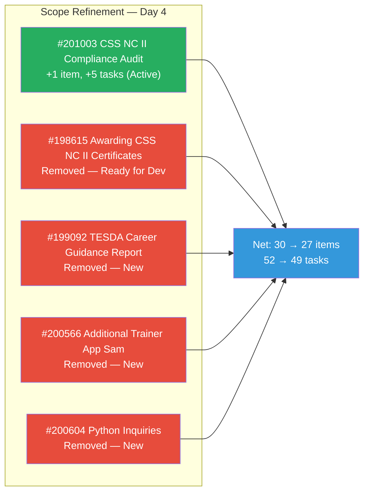

### 3.4 Teofilo's Cadence Interruption — March 11 Training

| Aspect | Details |
|---|---|
| **Item** | #200343 — March 11, 2026 Training CSS Batch 2 |
| **Current State** | **Active** (unchanged from Day 3) |
| **Task #200357 State** | **New** (unchanged from Day 3 — was never activated) |
| **Expected State (Day 4)** | Should be **Closed** by Day 4 |
| **Impact** | Breaks 3-day consecutive closure streak |
| **Pattern** | Days 1–3: 1 training closed per day; Day 4: 0 closures |

> **Possible Explanations**: (1) The audit ran before Teofilo logged the March 11 training — it may be completed by end of Day 4. (2) The training was not conducted on March 11 for a legitimate reason not yet reflected in the board. (3) Teofilo is focused on the COC 1 LO3 enabler work. Either way, if #200343 is not closed by end of Day 4, it becomes a formal new finding.

---

## 4. Work Item Inventory by Team Member — Day 4

### 4.1 Teofilo Limpag — 16 Items (3 Closed, 2 Active, 11 New)

| ID | Type | Title | Day 3 State | Day 4 State | Tasks |
|---|---|---|---|---|---|
| #200337 | Enabler | Prepare COC 1 LO2 Learning Materials | Closed | Closed | 3/3 Closed |
| #200341 | Training | March 9, 2026 Training CSS Batch 2 | Closed | Closed | 1/1 Closed |
| #200342 | Training | March 10, 2026 Training CSS Batch 2 | Closed | Closed | 1/1 Closed |
| #200343 | Training | March 11, 2026 Training CSS Batch 2 | Active | **Active ⚠️** | 1 task (still New) |
| #200354 | Enabler | Prepare COC 1 LO3 Learning Materials | Active | Active | 1 Active (#200512), 2 New |
| #200344 | Training | March 12, 2026 Training CSS Batch 2 | New | New | 1 task (New) |
| #200345 | Training | March 13, 2026 Training CSS Batch 2 | New | New | 1 task (New) |
| #200347 | Training | March 14, 2026 Training CSS Batch 2 | New | New | 1 task (New) |
| #200348 | Training | March 16, 2026 Training CSS Batch 2 | New | New | 1 task (New) |
| #200349 | Training | March 17, 2026 Training CSS Batch 2 | New | New | 1 task (New) |
| #200350 | Training | March 18, 2026 Training CSS Batch 2 | New | New | 1 task (New) |
| #200351 | Training | March 19, 2026 Training CSS Batch 2 | New | New | 1 task (New) |
| #200352 | Training | March 20, 2026 Training CSS Batch 2 | New | New | 1 task (New) |
| #200353 | Training | March 21, 2026 Training CSS Batch 2 | New | New | 1 task (New — ⚠️ task title wrong: says "March 16") |

> **Assessment**: Teofilo's previously perfect cadence has paused on Day 4. His 3-closure-in-3-days record was the iteration's highest performing streak. The LO3 enabler (#200354) remains progressing with 1 active task. **Critical watch**: If the March 11 training is not closed by end of Day 4, and #200344 (March 12 training) is not activated, Teofilo's completion forecast drops. His remaining cadence requires 11 items in 10 remaining working days — still achievable if he resumes immediately.

### 4.2 armelita — 9 Items (0 Closed, 6 Active, 1 Ready for Dev, 2 New)

| ID | Type | Title | Day 3 State | Day 4 State | Tasks |
|---|---|---|---|---|---|
| #200582 | User Story | T2 MIS Enrollment | Active | Active | 1 Closed (#200584), 1 New |
| #200590 | User Story | CSS NC II Batch 2 Marketing Activities | Active | Active | 1 Active (#200591), 1 New |
| #200593 | User Story | AC Resubmission Result | Active | Active | 1 Closed (#200594), 1 New |
| #200597 | User Story | CSS NC II AC Registration Fee | Active | Active | 1 Closed (#200598), 1 New |
| #200602 | User Story | Team Deployment of UM-Digos Interns | Active | Active | 1 Active (#200603) |
| **#201003** | **User Story** | **CSS NC II Compliance Audit** | **—** | **Active 🆕** | 1 Active (#201004), 4 New |
| #197617 | User Story | SK Buhangin Partnership | Ready for Dev | Ready for Dev | 2 tasks (all New) |
| #200607 | User Story | Bubble MCC Marketing Activities | New | New | 2 tasks (all New) |
| #200611 | User Story | [Onboarding] UM Matina Interns | New | New | 1 task (New) |
| ~~#198615~~ | ~~User Story~~ | ~~Awarding of CSS NC II Certificates~~ | ~~Ready for Dev~~ | ~~De-scoped~~ | — |
| ~~#199092~~ | ~~User Story~~ | ~~TESDA Career Guidance Report~~ | ~~New~~ | ~~De-scoped~~ | — |
| ~~#200566~~ | ~~User Story~~ | ~~Additional Trainer App — Sam~~ | ~~New~~ | ~~De-scoped~~ | — |
| ~~#200604~~ | ~~User Story~~ | ~~Python Inquiries~~ | ~~New~~ | ~~De-scoped~~ | — |

> **Assessment**: armelita made the biggest strategic move of Day 4 — adding the CSS NC II Compliance Audit and starting immediately. Her scope was intelligently trimmed from 12 to 9 items, making her workload more achievable. She now has **6 Active stories** with real task momentum (3 tasks Closed across her stories, 2 tasks Active). **Priority shift**: The Compliance Audit (#201003) should now be armelita's primary focus, given its TESDA compliance urgency.

### 4.3 Samantha Babael — 2 Items (0 Closed, 1 Active, 1 Ready)

| ID | Type | Title | Day 3 State | Day 4 State | Tasks |
|---|---|---|---|---|---|
| #199221 | Courseware | ChatGPT Courseware | Active | Active | 1 Closed (#199653) ✅, 1 **Active** (#199654) — unchanged |
| #198630 | Training | Markdown Training for Employees | Ready | Ready | 4 tasks (all New) ❌ |

> **Assessment**: Samantha's Day 3 breakthrough continues to hold — #199654 remains Active, showing no regression. However, there's no visible forward progress on Day 4 either. Task #199654 has been Active for 2 days now; it should be moving toward Closed. #198630 (Markdown Training) with 4 New tasks remains the carry-over risk flag from previous audits.

### 4.4 grace — 2 Items (0 Closed, 2 Active)

| ID | Type | Title | Day 3 State | Day 4 State | Tasks |
|---|---|---|---|---|---|
| #199768 | User Story | Resubmission of EBET Leading SAFe | Active | Active | 1 Active (#200028 Document Review) — unchanged |
| #200326 | User Story | TESDA Microcredential Program Submission | Active | Active | 1 Closed (#200327), 1 **Active** (#200329 CBLM Dev), 3 New |

> **Assessment**: grace is holding steady with both items Active. The TESDA Microcredential story (#200326) still shows CBLM Development as Active, but no new task closures. grace has 2 hrs/day capacity — her next milestone is closing #200329 (CBLM Development) and starting Assessment Tooling (#200330). With 10 remaining days and 4 tasks remaining, she needs to sustain 0.4 tasks/day — feasible but requires consistent progress.

---

## 5. Team Capacity Analysis — Day 4

| Member | Capacity/Day | Days Off | Remaining Working Days | Total Remaining Capacity | Items | Closed |
|---|---|---|---|---|---|---|
| Teofilo Limpag | 4 hrs/day | Mar 16 | 6 | **24 hrs** | 16 | 3 |
| armelita | 6 hrs/day | Mar 16 | 6 | **36 hrs** | 9 | 0 |
| Samantha Babael | 4 hrs/day | Mar 16 | 6 | **24 hrs** | 2 | 0 |
| grace | 2 hrs/day | Mar 16 | 6 | **12 hrs** | 2 | 0 |
| **TOTAL** | **16 hrs/day** | | | **96 hrs remaining** | **27** | **3** |

> Note: Day 4 capacity calculations reduce remaining days from 7 to 6 vs Day 3 estimates.

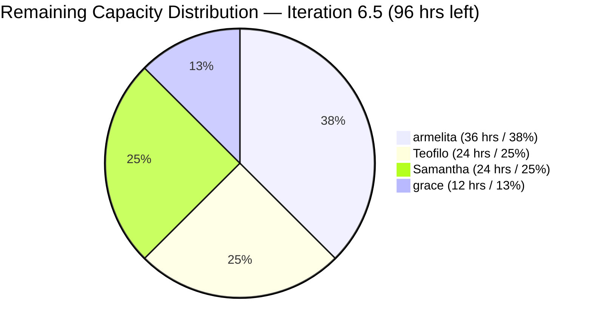

### Completion Forecast vs Remaining Work

```mermaid
xychart-beta
    title "Items by State per Member — Day 4"
    x-axis ["Teofilo (16)", "armelita (9)", "Samantha (2)", "grace (2)"]
    y-axis "Count" 0 --> 16
    bar [3, 0, 0, 0]
    bar [2, 6, 1, 2]
    bar [11, 3, 1, 0]
```

> **Legend**: Green = Closed, Orange = Active/Ready, Blue = New

> **Capacity concern emerging**: With 6 working days left and 24 items yet to close, the team needs to average **4 closures per day** — compared to the 3 items closed across 4 days so far. Teofilo accounts for the majority of the remaining scope (13 items still open out of 16 assigned).

---

## 6. Previous Audit Findings — Carry-Forward Status

| Finding | Severity | Day 3 Status | Day 4 Status | Trend |
|---|---|---|---|---|
| F1 — Zero Capacity | CRITICAL | ✅ RESOLVED | ✅ RESOLVED | — |
| F2 — Workload Imbalance | CRITICAL | ⚠️ MITIGATING | ⚠️ **IMPROVED** (armelita de-scoped 4 items) | ⬇️ Improving |
| F3 — No SAFe Story Format | CRITICAL | ❌ NOT FIXED | ❌ **NOT FIXED** | → |
| F4 — Minimal Acceptance Criteria | MAJOR | ❌ NOT FIXED | ❌ **NOT FIXED** | → |
| F5/F13 — Feature #199488 Stale | MAJOR | ❌ 8th AUDIT FLAG | ❌ **9th AUDIT FLAG** | ↑ Worsening |
| F7 — Duplicate Descriptions | MAJOR | ⚠️ PRESENT | ⚠️ **PRESENT** | → |
| F8 — No Tags | MINOR | ⚠️ MOSTLY MISSING | ⚠️ **MOSTLY MISSING** | → |
| F9 — Duplicate Task Names | MINOR | ❌ NOT FIXED | ❌ **NOT FIXED** (#200368 still says "March 16") | → |
| F14 — Zero Story Points | CRITICAL | ❌ NOT FIXED | ❌ **NOT FIXED** | → |
| F15 — Feature #197153 "New" w/ children | MINOR | ❌ NOT FIXED | ❌ **NOT FIXED** | → |
| F16 — Feature #200610 "New" w/ children | MINOR | ❌ NOT FIXED | ❌ **NOT FIXED** | → |
| F17 — Carry-Overs Not Re-estimated | MAJOR | ❌ NOT FIXED | ❌ **NOT FIXED** | → |
| F18 — Story #200590 State Mismatch | MINOR | ✅ RESOLVED | ✅ RESOLVED | — |
| F19 — Samantha 3rd-Iter Carry-Over Risk | MAJOR | ⚠️ PARTIALLY MITIGATED | ⚠️ **PARTIALLY MITIGATED** | → |

### New Findings — Day 4

| Finding | Severity | Description |
|---|---|---|
| **F20** | **MAJOR** | **Teofilo's daily cadence interrupted** — March 11 Training (#200343) still Active/New task on Day 4. Expected to be Closed by now. Monitor: if not closed by end of Day 4, escalate to CRITICAL. |
| **F21** | **INFO** | **Scope de-scoping not formally documented** — 4 items removed from Iteration 6.5 without an iteration goal revision or team decision record visible in ADO. SAFe requires scope changes be transparent and acknowledged. |
| **F22** | **MAJOR** | **CSS NC II Compliance Audit urgency** — #201003 added mid-iteration and immediately started suggests an imminent TESDA audit. armelita's entire remaining capacity may need to be focused here. Team should re-plan remaining iteration with this as the top priority. |

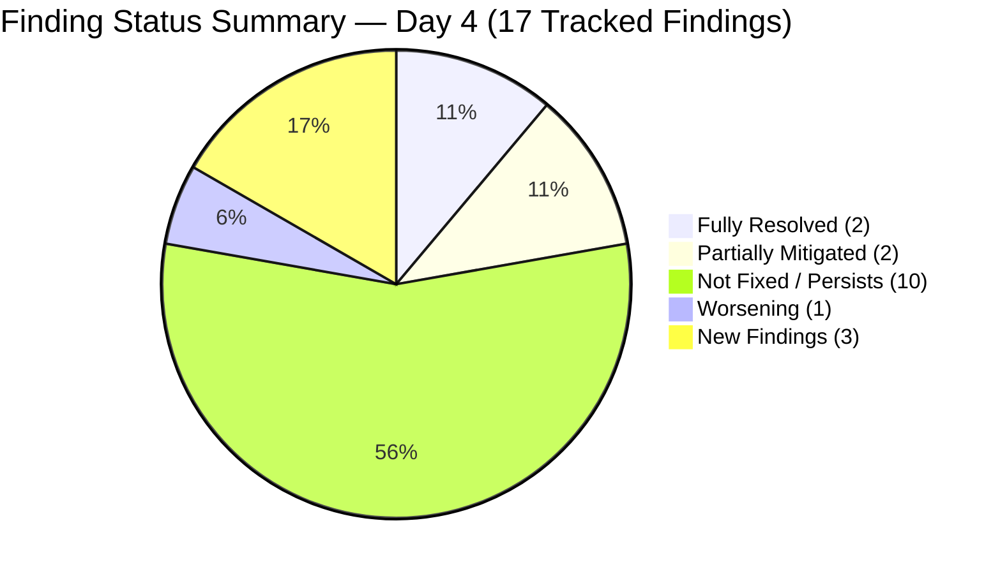

---

## 7. Feature Portfolio Alignment — Day 4

| Feature ID | Title | State | 6.5 Children | Status |
|---|---|---|---|---|
| #191566 | CSS Assessment Center (Sept 2025 Class) | Active | (de-scoped: #198615) | ⚠️ No active children in 6.5 |
| #194571 | CSS Assessment Center Application | Active | #200593 (Active), #200597 (Active) | ✅ Aligned |
| #195913 | Leading SAFe MCC | Active | #199768 (Active) | ✅ Aligned |
| #195914 | SAFe POPM Microcredential | Active | #200326 (Active) | ✅ Aligned |
| #196193 | SK Buhangin Sponsored Bubble 101 | Active | #197617 (Ready for Dev) | ✅ Aligned |
| #197152 | Class for CSS NCII Mar-May 2026 | Active | #200582 (Active), #200590 (Active) | ✅ Aligned |
| **#197153** | **Web Dev with Bubble.io MCC** | **New** ❌ | #200607 (New) | ❌ **F15: Feature should be Active** |
| #197330 | Add Sam as Bubble.io MCC Trainer | Active | (de-scoped: #200566) | ⚠️ No active children in 6.5 |
| #198628 | Markdown Internal Training | Active | #198630 (Ready) | ✅ Aligned |
| #199091 | TESDA Compliance PI6 | Active | #199092 (de-scoped), **#201003 (Active 🆕)** | ✅ Aligned — improved with compliance audit item |
| #199144 | ChatGPT Courseware | Active | #199221 (Active) | ✅ Aligned |
| **#199488** | **Cor Jesu College Interns** | **Active** ❌ | None in 6.5 | ❌ **F5/F13: 9th AUDIT — NO children** |
| #200056 | Python Training Program | Active | (de-scoped: #200604) | ⚠️ No active children in 6.5 |
| #200104 | UM-Digos Interns | Active | #200602 (Active) | ✅ Aligned |
| #200336 | CSS Batch 2 - 2nd Iteration | Active | 16 items (3 Closed, 2 Active, 11 New) | ✅ Aligned |
| **#200610** | **UM-Matina Interns** | **New** ❌ | #200611 (New) | ❌ **F16: Feature should be Active** |

---

## 8. Cross-Iteration Trend Analysis

### 8.1 Iteration 6.5 — Day-over-Day Progress

| Metric | Day 1 | Day 2 | Day 3 | Day 4 | 4-Day Trend |
|---|---|---|---|---|---|
| Closed Items | 0 | 1 | 3 | **3** | ⚠️ Plateau |
| Active Items | 2 | 7 | 10 | **11** | ✅ Broadening |
| Tasks Closed | 0 | 2 | 10 | **10** | ⚠️ Plateau |
| Team Members Contributing | 0 | 2 | 4 | **4** | ✅ Full team holding |
| Health Score | 46 | 49 | 55 | **52** | ⚠️ Slight regression |
| New Findings | 4 | 2 | 0 | **3** | ⚠️ Slight increase |
| Iteration Scope (items) | 30 | 30 | 30 | **27** | 📋 Scope managed |

```mermaid
xychart-beta
    title "Iteration 6.5 — Daily Progress Trend (Items Closed + Tasks Closed)"
    x-axis ["Day 1", "Day 2", "Day 3", "Day 4"]
    y-axis "Count" 0 --> 12
    bar [0, 1, 3, 3]
    bar [0, 2, 10, 10]
    line [0, 2, 10, 10]
```

> **Legend**: Blue bars = Items Closed, Orange bars = Tasks Closed, Line = Task closure trend

### 8.2 Health Score Trajectory

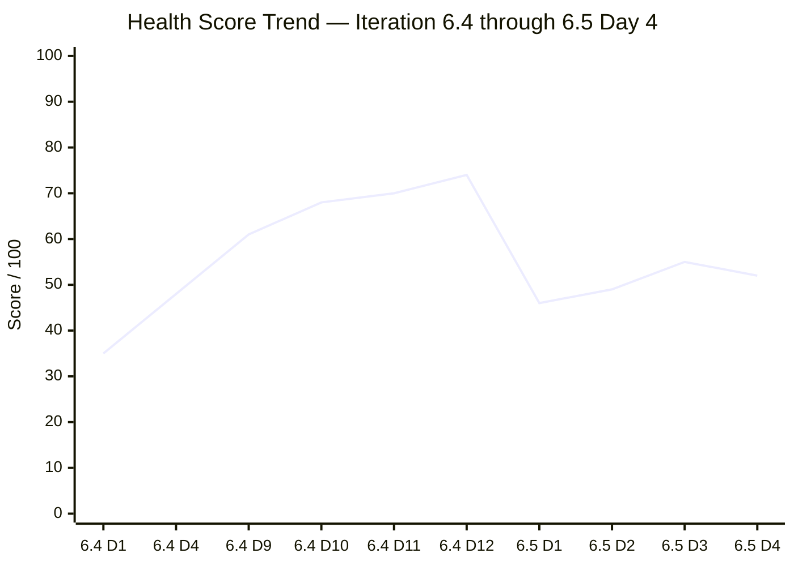

> **Day 4 represents the iteration's first health score regression** (-3 from 55 to 52). In Iteration 6.4, the score consistently climbed from Day 1 onwards. The Day 4 plateau/regression in 6.5 is attributable to: zero new closures, Teofilo's cadence interruption, and 3 new findings. However, the scope de-scoping and CSS NC II Compliance Audit addition are strategically positive and should not trigger alarm.

### 8.3 Closure Velocity Comparison

```mermaid
xychart-beta
    title "Cumulative Item Closures — 6.4 vs 6.5 (by Day)"
    x-axis ["Day 1", "Day 2", "Day 3", "Day 4"]
    y-axis "Cumulative Closed Items" 0 --> 10
    bar [0, 0, 0, 2]
    bar [0, 1, 3, 3]
```

> **Legend**: Blue = 6.4, Orange = 6.5

> Iteration 6.5 remains ahead of 6.4's pace through Day 4, despite today's plateau. In 6.4, the team had zero closures through Day 4. In 6.5, 3 items are closed. The 6.5 plateau is still better than 6.4's trajectory at the same point.

### 8.4 Patterns and Learnings Across Audits

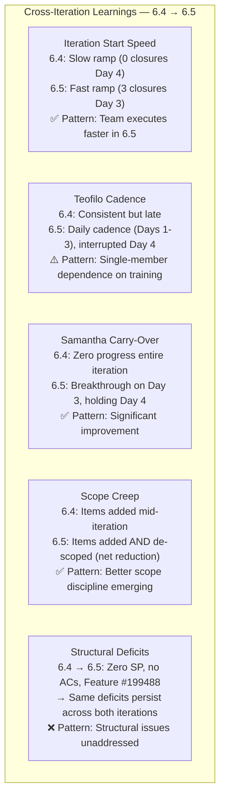

---

## 9. Health Score — Day 4

| Dimension | Weight | Day 2 | Day 3 | Day 4 | Change | Notes |
|---|---|---|---|---|---|---|
| Iteration Planning | 20% | 4/10 | 4/10 | **4/10** | — | Still 0 SP; no iteration goal; scope de-scoping is positive but structural issues unchanged |
| Work Item Quality | 20% | 3/10 | 3/10 | **3/10** | — | No AC; no SAFe format; duplicate task names still present |
| Team Structure | 15% | 7/10 | 8/10 | **7/10** | **-1** | All 4 members still active but Teofilo's cadence interrupted; momentum plateau |
| Task Management | 15% | 6/10 | 7/10 | **6/10** | **-1** | Zero task closures on Day 4 for the first time; 10 tasks still max |
| Backlog Health | 15% | 6/10 | 7/10 | **7/10** | — | Scope refinement positive (4 items de-scoped); new compliance item added strategically |
| Process Compliance | 15% | 4/10 | 5/10 | **5/10** | — | #199488 hits 9th flag (negative); scope management (positive); balance held |

**Calculated Score:**
(4 × 0.20) + (3 × 0.20) + (7 × 0.15) + (6 × 0.15) + (7 × 0.15) + (5 × 0.15)
= 0.80 + 0.60 + 1.05 + 0.90 + 1.05 + 0.75
= **5.15 → 52/100**

```mermaid
xychart-beta
    title "Health Score by Dimension — Day 3 vs Day 4"
    x-axis ["Iter Planning", "Work Item Quality", "Team Structure", "Task Mgmt", "Backlog Health", "Process Compliance"]
    y-axis "Score (out of 10)" 0 --> 10
    bar [4, 3, 8, 7, 7, 5]
    bar [4, 3, 7, 6, 7, 5]
```

**Overall Health Score: 52/100** (-3 from Day 3)

> The Day 4 regression is modest and expected given a zero-closure day. The score is not a cause for alarm — it reflects the natural rhythm of scope management followed by execution acceleration.

---

## 10. Risk Register — Day 4 Update

| Risk | Day 3 Level | Day 4 Level | Trend | Mitigation |
|---|---|---|---|---|
| **Zero SP prevents velocity tracking** | CRITICAL | **CRITICAL** | → | Must estimate in next team session |
| **CSS NC II Compliance Audit urgency** | — | **CRITICAL 🆕** | NEW | #201003 just added; armelita must prioritize; all 5 tasks need to complete before TESDA audit |
| **Teofilo cadence disrupted** | LOW | **MEDIUM 🆕** | ↑ Watch | March 11 Training still Active/New — if not closed today, becomes HIGH |
| **Feature #199488 never gets closed** | HIGH | **HIGH** | ↑ 9th audit | Escalate to Project Owner (Ramon); this is 9th consecutive flag |
| **No iteration goal defined** | HIGH | **HIGH** | → | Define during next team sync |
| **Samantha carry-over (#198630 Markdown)** | HIGH | **HIGH** | → | #199654 still Active (Day 3 breakthrough holding); #198630 untouched |
| **grace capacity for TESDA Microcredential** | MEDIUM | **MEDIUM** | → | CBLM Development still Active; 14 → 12 hrs remaining for 3 tasks |
| **armelita's carry-overs** | MEDIUM | **LOW** ⬇️ | ⬇️ | 4 carry-overs de-scoped; compliance audit correctly prioritized |
| **Scope creep mid-iteration** | LOW | **LOW** | → | 1 item added, 4 removed; net scope decreased |

---

## 11. Recommended Actions — Day 4

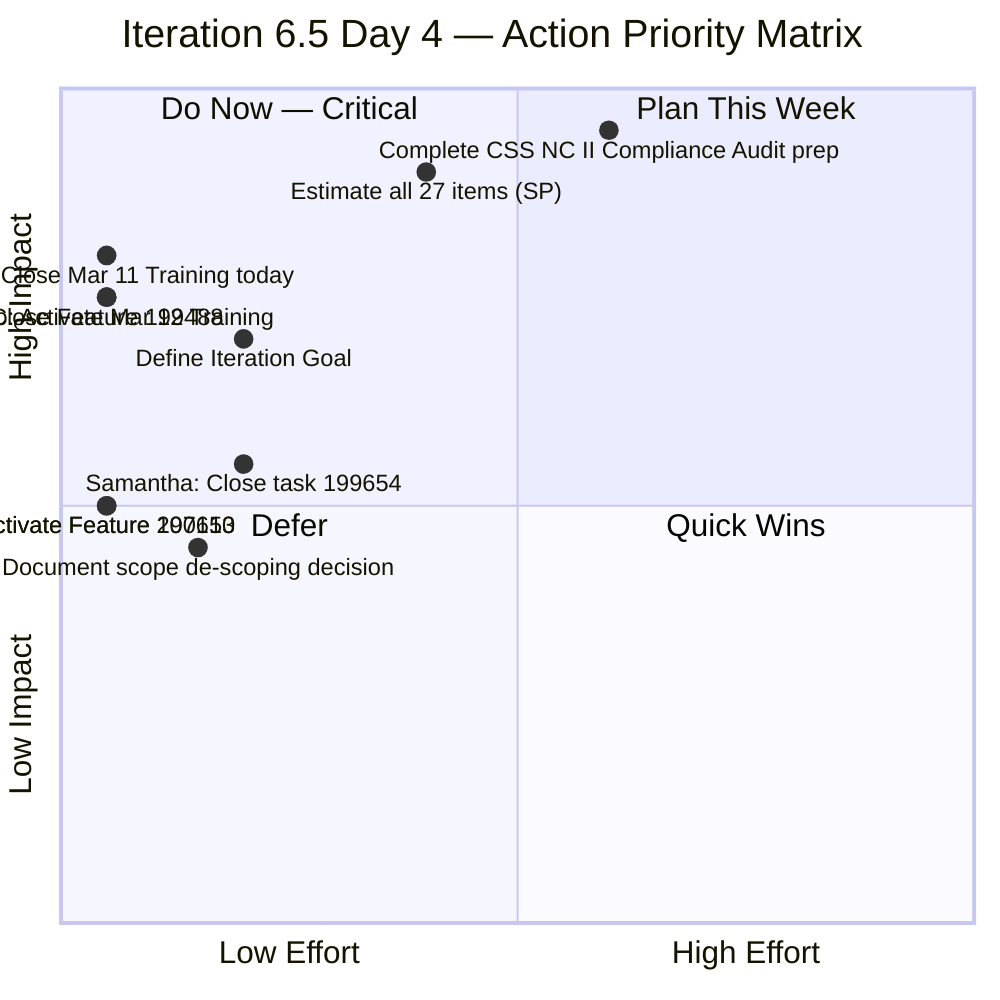

| Priority | Action | Owner | Effort | Impact |
|---|---|---|---|---|
| 🔴 1 | **CSS NC II Compliance Audit** (#201003) — complete all 5 tasks before TESDA inspection; armelita should treat this as Sprint Zero work | armelita | High | CRITICAL — compliance risk |
| 🔴 2 | **Close March 11 Training & activate March 12** (#200343 → Closed, #200344 → Active) — restore daily cadence | Teofilo | **5 min** | Cadence recovery |
| 🔴 3 | **Estimate all 27 work items with Story Points** — Day 4 without SP; 5th consecutive audit flag | Team | 30–60 min | Enables all SAFe velocity metrics |
| 🔴 4 | **Close Feature #199488** — **9th consecutive audit flag**; no children in 6.5; 2-minute fix | armelita | **2 min** | Removes longest-standing finding |
| 🟠 5 | **Define Iteration Goal** — SAFe requires clear, measurable objective | armelita/Team | 10 min | Team alignment |
| 🟠 6 | **Activate Features #197153 and #200610** — both have children in this iteration | armelita | **2 min each** | Feature state accuracy |
| 🟠 7 | **Document scope de-scoping decision** (F21) — record WHY items were removed from 6.5 in ADO or team notes | armelita/Team | 5 min | SAFe transparency |
| 🟡 8 | **Samantha: Close #199654 (Discussion Day 2)** — has been Active for 2 days; momentum must continue | Samantha | Ongoing | Carry-over prevention |
| 🟡 9 | **grace: Close #200329 (CBLM Development)** — has been Active for 2 days; next task is Assessment Tooling | grace | Ongoing | TESDA Microcredential progress |

---

## 12. Positive Observations — Day 4

Despite zero closures, Day 4 demonstrates important strategic maturity:

1. **Proactive scope management**: Removing 4 items with zero progress before they become entrenched carry-overs is exactly what SAFe iteration management requires. This shows the team is developing iteration discipline.

2. **Urgency-driven prioritization**: Adding the CSS NC II Compliance Audit (#201003) mid-iteration and immediately starting it reflects correct business value prioritization. armelita did not wait — she added it and started in the same action.

3. **No regression in active work**: Samantha's task (#199654), grace's CBLM task (#200329), armelita's 5 active stories, and Teofilo's LO3 enabler are all still progressing. No items moved backward from Active to New.

4. **Iteration 6.5 vs 6.4 still favorable**: At the same point in 6.4, the team had zero closures and was just beginning to ramp up. At Day 4 of 6.5, the team has 3 items closed and a more structured workboard.

---

## 13. Conclusion

Day 4 is a **natural plateau and reset day** following Day 3's strongest performance of the iteration. The absence of new closures is less concerning than the two strategic actions that define the day: **scope refinement** and **compliance prioritization**.

The addition of the CSS NC II Compliance Audit (#201003) may be the most consequential work item event of the iteration. If an imminent TESDA inspection is driving armelita's urgency, this item effectively becomes the team's highest-priority deliverable for the remainder of Iteration 6.5. This may also explain the de-scoping of lower-priority items — armelita is clearing her plate for the compliance work.

**Teofilo's Day 4 pause is the primary operational concern.** His 3-day streak was the iteration's engine. If he closes the March 11 training and activates the March 12 training today, the cadence restores immediately. If he does not, the training delivery schedule slips and creates a compounding backlog of daily training items.

**The health score regression from 55 to 52 is minor and expected** — a single zero-closure day does not indicate trend reversal. The structural ceiling on the score remains unchanged: zero Story Points and the absence of iteration goals are the two highest-leverage fixes still available.

**Looking ahead to Day 5 (March 13)**: The team needs to see:

- Teofilo closing the March 11 and March 12 trainings and maintaining the daily cadence
- armelita advancing CSS NC II Compliance Audit tasks toward readiness
- Samantha closing Task #199654 (Discussion Day 2)
- Story Point estimation completed in team session

**Velocity projection update**: With 3 items closed in 4 days and 6 working days remaining, the team must close approximately 4 items per day to complete all 27 items — an acceleration that requires Teofilo resuming his daily cadence and at least 1-2 closures from armelita. A more realistic forecast is **10-15 items closed by iteration end**, similar to 6.4's final tally.

**Next recommended audit: March 13, 2026 (Day 5)**

---

*Report generated: March 12, 2026 at 14:06 UTC | SAFe 6.0 Framework | Jairosoft Portfolio — JIT Operation Team*
*Previous Audit: AUDIT_2026-03-11_2104.md (Iteration 6.5 Day 3, Score: 55/100)*
*This Audit: AUDIT_2026-03-12_1406.md (Iteration 6.5 Day 4, Score: 52/100)*
*Iteration 6.5: Mar 9 – Mar 22, 2026 | Day 4 of 14 | Health Score: 52/100 (-3)*
