# SAFe Audit Report — Iteration 6.5 (Day 9)

## Jairosoft Portfolio — JIT Operation Team

| Field | Value |
|---|---|
| **Date** | March 17, 2026 |
| **Auditor** | Claude (AI Agile Consultant) |
| **Framework** | SAFe 6.0 |
| **Organization** | dev.azure.com/jairo |
| **Project** | Jairosoft Portfolio |
| **Team** | JIT Operation Team |
| **Product Owner** | Armelita |
| **Iteration** | Iteration 6.5 (Mar 9 – Mar 22, 2026) |
| **Iteration Day** | Day 9 of 14 (64% elapsed) |
| **Report Type** | Follow-Up Audit & Sprint Health Check |
| **Previous Audit** | AUDIT_2026-03-16_0800.md (Iter 6.5 Day 8, Score: 78/100) |
| **Board URL** | [ADO Board](https://dev.azure.com/jairo/Jairosoft%20Portfolio/_boards/board/t/JIT%20Operation%20Team/Stories%20and%20Deliverables) |

---

## 1. Executive Summary

This report audits **Iteration 6.5** at **Day 9 of 14** (64% elapsed), tracking changes since the previous audit (Day 8, March 16).

**Changes since last audit:**

- **#200602 (Team Deployment of UM-Digos Interns)** moved from Active → **Closed** by armelita (+1 SP)
- **2 items removed from iteration:** #197617 (SK Buhangin Partnership) and #200611 (UM Matina Interns)
- Net result: 25 items (was 27), 54 SP (was 56), 7 Closed / 13 SP completed (24%)

**Health Score: 79/100** (+1 from 78, continuing upward trend from baseline 48)

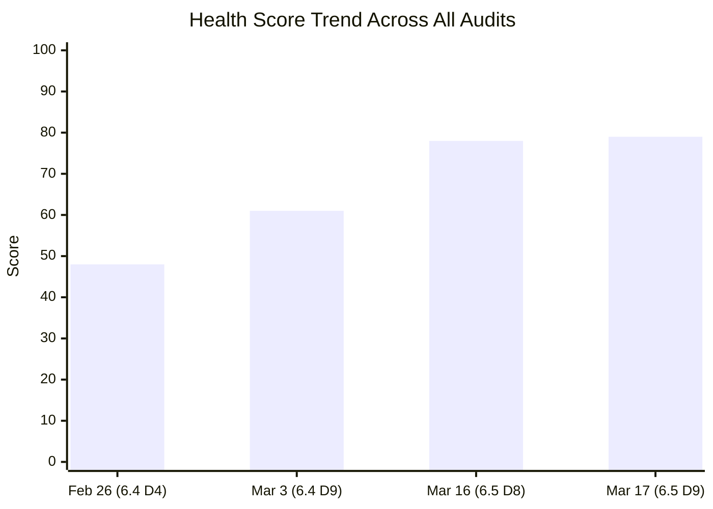

---

## 2. Iteration Snapshot

| Metric | Mar 16 (Day 8) | Mar 17 (Day 9) | Change |
|---|---|---|---|
| Total Work Items | 27 | **25** | -2 (removed from iteration) |
| Total Story Points | 56 SP | **54 SP** | -2 SP |
| Closed Items | 6 | **7** | **+1** (#200602) |
| SP Completed | 12 SP (21%) | **13 SP (24%)** | **+1 SP** |
| Active Items | 9 | **8** | -1 (moved to Closed) |
| Validation | 1 | 1 | — |
| Ready | 2 | **1** | -1 (removed from iteration) |
| New Items | 9 | **8** | -1 (removed from iteration) |
| Team Capacity | 16 hrs/day | 16 hrs/day | — |

### State Distribution

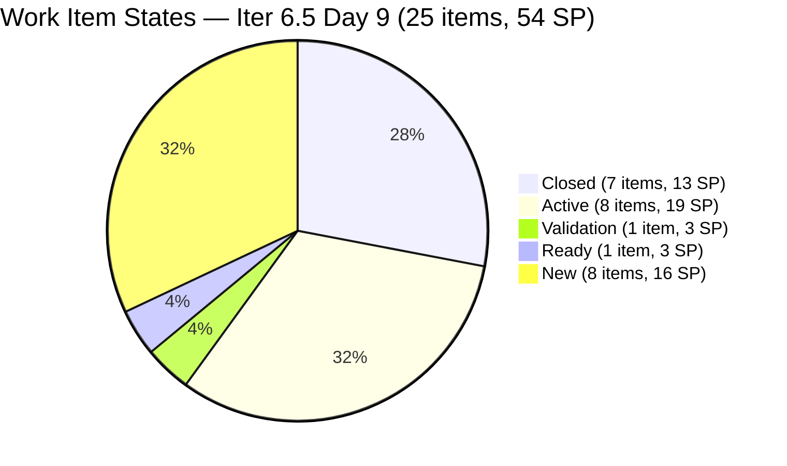

### Burndown Progress

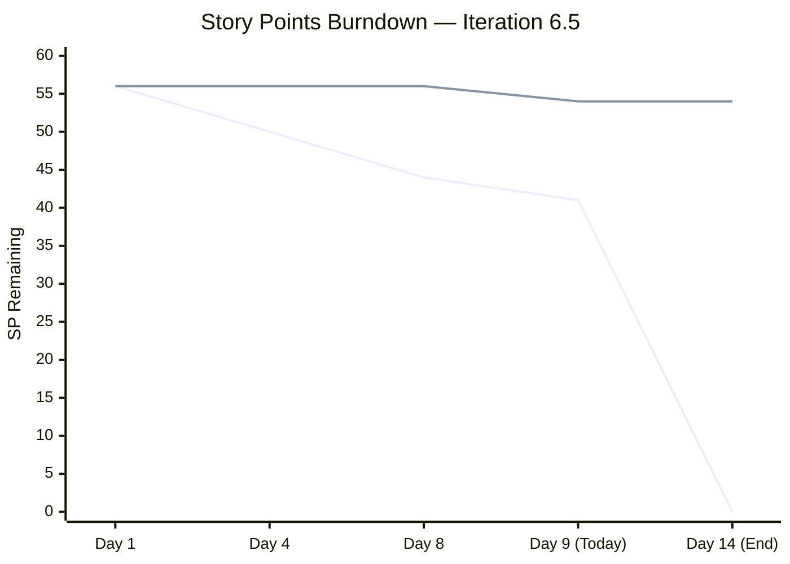

> Note: Total SP dropped from 56 → 54 at Day 9 due to 2 items removed from iteration. Ideal burndown now targets 54 SP.

### Iteration Timeline

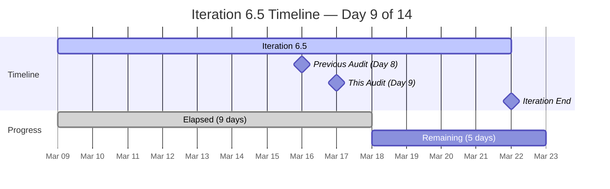

---

## 3. Sprint Goal Probability

| Factor | Assessment |
|---|---|
| **SP Remaining** | 41 SP in 5 working days (~8.2 SP/day needed) |
| **Training auto-close** | 7 of 8 New items are daily training sessions (14 SP) that will close as Teofilo delivers them |
| **Adjusted risk SP** | Excluding auto-close training: 27 SP across 11 items (Active + Validation + Ready + Bubble MCC) |
| **Velocity so far** | 13 SP in 9 days (~1.4 SP/day) — low, but training sessions will accelerate closure |
| **Probability** | **MODERATE-HIGH** — Training items are predictable; real risk is armelita's 5 Active stories (10 SP) and Samantha's 2 items (6 SP) |

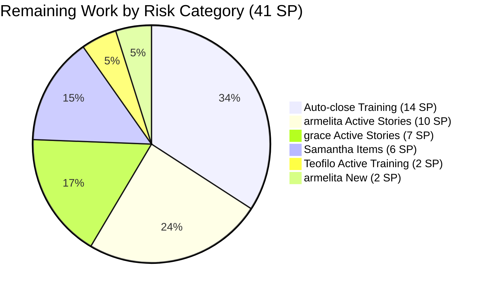

---

## 4. Team Capacity & Workload

| Member | Capacity | Activity Types | Items | SP | Closed | Open SP |
|---|---|---|---|---|---|---|
| armelita | 6 hrs/day | Documentation | 7 | 13 SP | 1 | 12 SP |
| Teofilo Limpag | 4 hrs/day | Training | 14 | 28 SP | 6 | 16 SP |
| Samantha Babael | 4 hrs/day | Documentation + Training | 2 | 6 SP | 0 | 6 SP |
| grace | 2 hrs/day | Development + Documentation | 2 | 7 SP | 0 | 7 SP |
| **TOTAL** | **16 hrs/day** | **4 types** | **25** | **54 SP** | **7** | **41 SP** |

> All 4 members had March 16 as a Day Off.

```mermaid
xychart-beta
    title "Workload by Member — Closed vs Open SP"
    x-axis ["armelita", "Teofilo", "Samantha", "grace"]
    y-axis "Story Points" 0 --> 30
    bar [1, 12, 0, 0]
    bar [12, 16, 6, 7]
```

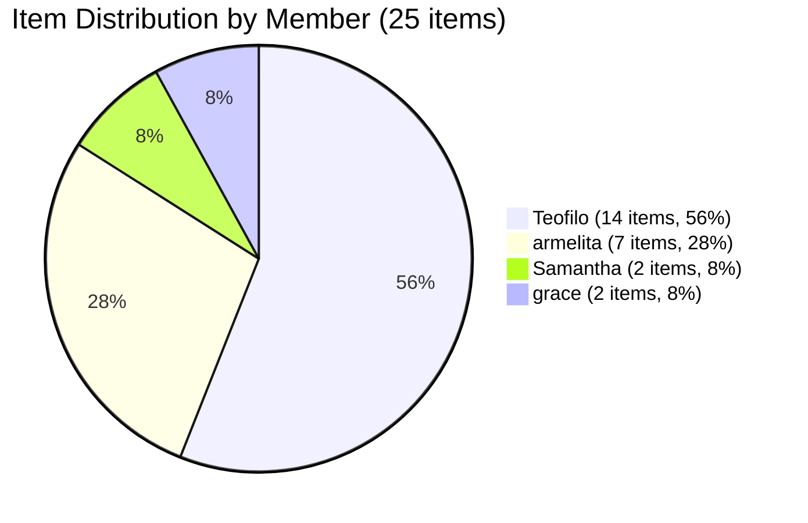

---

## 5. Finding Remediation Status (10 Findings from Iter 6.4)

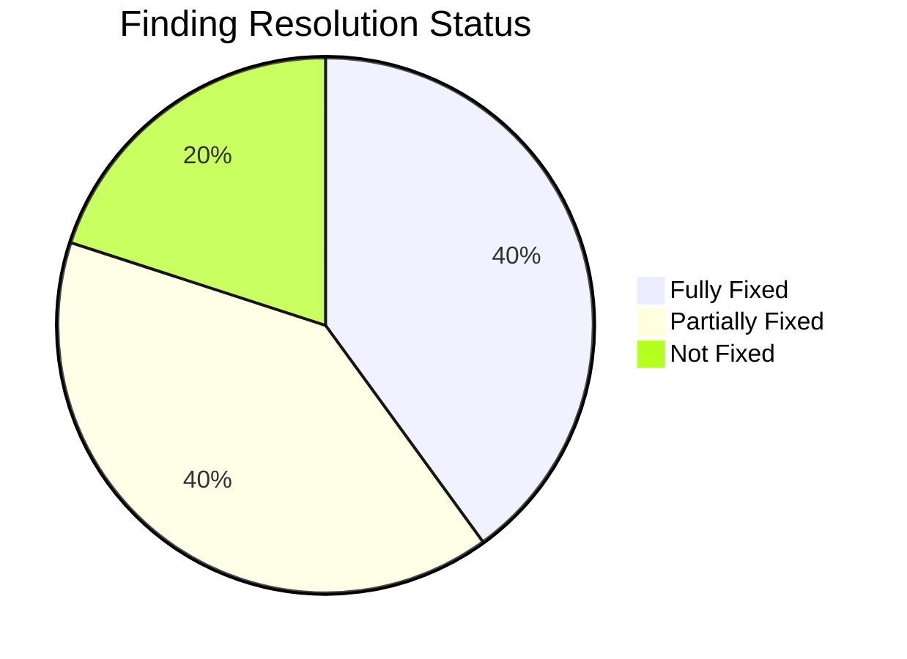

| # | Finding | Severity | Iter 6.4 Status | Iter 6.5 Status | Key Change |
|---|---|---|---|---|---|
| F1 | Zero Capacity Members | CRITICAL | Partially Fixed | **FIXED** | All 4 members: 16 hrs/day total |
| F2 | Severe Workload Imbalance | CRITICAL | Partially Improved | **PARTIALLY FIXED** | armelita 28% (was 65%); Teofilo now 56% |
| F3 | No SAFe User Story Format | CRITICAL | Not Fixed | **PARTIALLY FIXED** | 9 of 25 (36%) use SAFe format |
| F4 | Minimal Acceptance Criteria | MAJOR | Not Fixed | **PARTIALLY FIXED** | 12 of 25 (48%) have structured AC |
| F5 | Stale Features | MAJOR | Not Fixed | **PARTIALLY FIXED** | #198628 now Active; new Features acceptable |
| F6 | Orphan Story #199246 | MAJOR | Mitigated | **RESOLVED** | Closed in Iter 6.4 |
| F7 | Descriptions Duplicate Titles | MAJOR | Not Fixed | **PARTIALLY FIXED** | New items have SAFe descriptions |
| F8 | No Tags Used | MINOR | Not Fixed | **NOT FIXED** | Only 2 of 25 tagged |
| F9 | Task Titles Duplicate Parent | MINOR | Not Fixed | **IMPROVED** | All 25 items have child tasks |
| F10 | Single Activity Type | MINOR | Not Fixed | **PARTIALLY FIXED** | 3 activity types across members |

### New Findings (from Iter 6.5)

| # | Finding | Severity | Details |
|---|---|---|---|
| F11 | Training Items Copy-Paste Pattern | MINOR | 10 Training items share identical descriptions and AC |
| F12 | 3 Features Lack PI Objective Parent | MINOR | #200336, #197153, #200610 — suggested parents identified |
| F13 | AreaPath Inconsistency | MINOR | Teofilo's items use different AreaPath than team standard |

---

## 6. Work Item Inventory (25 Items)

### Closed (7 items, 13 SP)

| ID | Type | Title | Assigned | SP |
|---|---|---|---|---|
| #200337 | Enabler | Prepare COC 1 LO2 Learning Materials | Teofilo | 2 |
| #200341 | Training | March 9 Training CSS Batch 2 | Teofilo | 2 |
| #200342 | Training | March 10 Training CSS Batch 2 | Teofilo | 2 |
| #200343 | Training | March 11 Training CSS Batch 2 (BIOS Config) | Teofilo | 2 |
| #200344 | Training | March 12 Training CSS Batch 2 | Teofilo | 2 |
| #200354 | Enabler | Prepare COC 1 LO3 Learning Materials | Teofilo | 2 |
| **#200602** | **User Story** | **Team Deployment of UM-Digos Interns** | **armelita** | **1** |

> #200602 is **new closure** since the last audit (Day 8 → Day 9).

### Active (8 items, 19 SP)

| ID | Type | Title | Assigned | SP | SAFe Format | AC Quality |
|---|---|---|---|---|---|---|
| #200345 | Training | March 13 Training CSS Batch 2 | Teofilo | 2 | No | Minimal |
| #200326 | User Story | TESDA Microcredential Program | grace | 4 | Yes | Excellent |
| #199768 | User Story | Resubmission of EBET Leading SAFe | grace | 3 | Yes | Good |
| #200582 | User Story | T2 MIS Enrollment | armelita | 2 | Yes | Excellent |
| #200590 | User Story | CSS NC II Batch 2 Marketing | armelita | 2 | Yes | Excellent |
| #200593 | User Story | AC Resubmission Result | armelita | 1 | Yes | Excellent |
| #200597 | User Story | CSS NC II AC Registration Fee | armelita | 2 | Yes | Excellent |
| #201003 | User Story | CSS NC II Compliance Audit | armelita | 3 | Yes | Exemplary |

### Validation (1 item, 3 SP)

| ID | Type | Title | Assigned | SP |
|---|---|---|---|---|
| #199221 | Courseware | ChatGPT Courseware | Samantha | 3 |

### Ready (1 item, 3 SP)

| ID | Type | Title | Assigned | SP |
|---|---|---|---|---|
| #198630 | Training | Markdown Training for Employees | Samantha | 3 |

### New (8 items, 16 SP)

| ID | Type | Title | Assigned | SP |
|---|---|---|---|---|
| #200347 | Training | March 14 Training CSS Batch 2 | Teofilo | 2 |
| #200348 | Training | March 16 Training CSS Batch 2 | Teofilo | 2 |
| #200349 | Training | March 17 Training CSS Batch 2 | Teofilo | 2 |
| #200350 | Training | March 18 Training CSS Batch 2 | Teofilo | 2 |
| #200351 | Training | March 19 Training CSS Batch 2 | Teofilo | 2 |
| #200352 | Training | March 20 Training CSS Batch 2 | Teofilo | 2 |
| #200353 | Training | March 21 Training CSS Batch 2 | Teofilo | 2 |
| #200607 | User Story | Bubble MCC Marketing Activities | armelita | 2 |

### State Flow Diagram

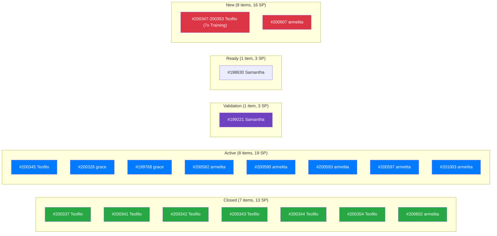

---

## 7. Risk Register

| Risk | Severity | Trend | Mitigation |
|---|---|---|---|
| Teofilo overload (56% of items, 28 SP) | Medium | Stable | Daily training items are routine; 6 already closed |
| Sprint overcommitment (41 SP in 5 days) | Medium | Stable | 14 SP of training auto-close; real risk is 27 SP |
| Samantha underutilization (2 items, 6 SP) | Medium | Improving | ChatGPT Courseware in Validation is positive signal |
| Tags not adopted (2 of 25) | Low | Stable | Quick win; recommend bulk tagging session |
| 3 Features orphaned (no PI Objective) | Low | Stable | Suggested parents identified in traceability report |
| Items removed mid-sprint (#197617, #200611) | Low | New | Scope reduction noted; may indicate reprioritization |

---

## 8. Recommended Actions (Remaining 5 Days)

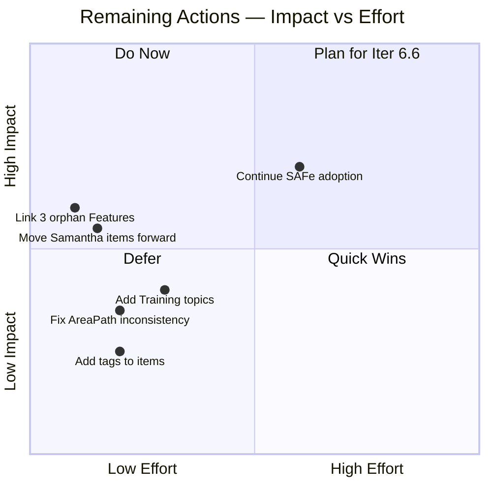

| Priority | Action | Effort | Impact |
|---|---|---|---|
| 1 | **Move Samantha's items forward** — push #198630 (Ready) and #199221 (Validation) toward completion | 5 min | High — increases completion % |
| 2 | **Link 3 orphan Features** (#200336, #197153, #200610) to PI Objectives | 3 min | High — strategic traceability |
| 3 | **Add daily topics** to Training item descriptions (#200347–200353) | 15 min | Medium — training traceability |
| 4 | **Fix AreaPath** on Teofilo's items to match team standard | 10 min | Medium — board consistency |
| 5 | **Bulk-add tags** across all items | 15 min | Low — filtering/reporting |
| 6 | **Plan Iter 6.6** — ensure removed items (#197617, #200611) are rescheduled | Next iteration | High — no work lost |

---

## 9. Health Score

| Dimension | Weight | Iter 6.4 D4 | Iter 6.4 D9 | Iter 6.5 D8 | Iter 6.5 D9 | Change |
|---|---|---|---|---|---|---|
| Iteration Planning | 20% | 5 | 7 | 9 | **9** | — |
| Work Item Quality | 20% | 3 | 3 | 6 | **6** | — |
| Team Structure | 15% | 4 | 5 | 8 | **8** | — |
| Task Management | 15% | 7 | 8 | 9 | **9** | — |
| Backlog Health | 15% | 6 | 7 | 7 | **8** | +1 (new closure, scope refined) |
| Process Compliance | 15% | 5 | 5 | 7 | **7** | — |

**Overall Health Score: 79/100** (was 78/100, +1 point)

Calculated: (9×0.20) + (6×0.20) + (8×0.15) + (9×0.15) + (8×0.15) + (7×0.15) = 1.80 + 1.20 + 1.20 + 1.35 + 1.20 + 1.05 = **7.80 × 10 ≈ 79/100**

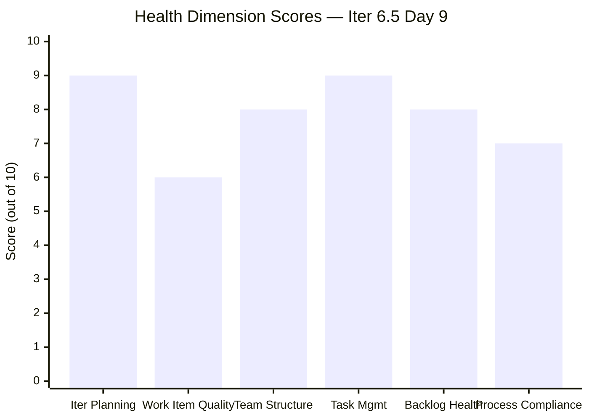

---

## 10. Conclusion

Iteration 6.5 continues to track well at Day 9. The key change today is armelita closing **#200602 (Team Deployment of UM-Digos Interns)**, bringing completed SP to 13 (24%). The removal of 2 items (#197617 SK Buhangin, #200611 UM Matina Interns) from the iteration represents scope refinement — these should be rescheduled to Iteration 6.6.

The sprint is on track with **moderate-high probability** of meeting its goal. Teofilo's daily training sessions will auto-close over the remaining 5 days, contributing predictable velocity. The primary areas to watch are armelita's 5 Active stories (10 SP) and Samantha's 2 items (6 SP in Validation/Ready).

The health score has risen steadily across 4 audits: **48 → 61 → 78 → 79**, reflecting sustained process improvement. The team has transformed from a baseline with zero capacity configuration and no SAFe practices to a well-structured iteration with proper story formats, acceptance criteria, and task breakdowns.

**Recommended next audit: March 23, 2026 (Post-Iteration 6.5 Retrospective)**

---

*Report generated: March 17, 2026 | SAFe 6.0 Framework | Jairosoft Portfolio — JIT Operation Team*
*Previous Audits: AUDIT_2026-02-26 (48/100), AUDIT_2026-03-03 (61/100), AUDIT_2026-03-16 (78/100)*
*This Audit: AUDIT_2026-03-17_0800.md (79/100)*
*Iteration 6.5: Mar 9 – Mar 22, 2026 | Day 9 of 14 | Health Score: 79/100*
